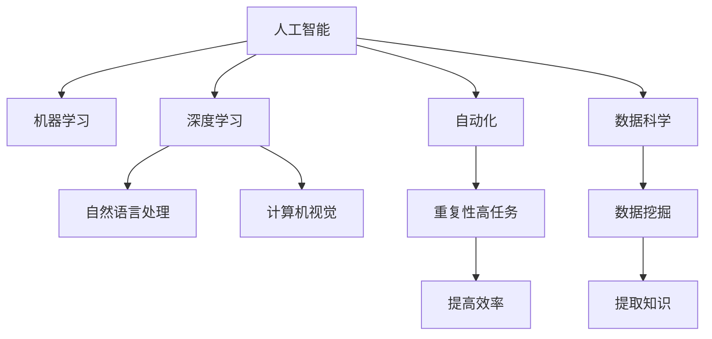

                 

# 李开复：AI 2.0 时代的价值

> 关键词：AI 2.0, 人工智能, 机器学习, 深度学习, 数据科学, 自动化, 未来技术, 创新

## 1. 背景介绍

在过去的几十年里，人工智能（AI）技术已经从概念变为现实，并且在各个行业和领域中得到了广泛的应用。从语音识别到图像处理，从自然语言处理到自动驾驶，AI技术已经深刻地改变了我们的生活方式和工作方式。现在，我们正处于AI 2.0时代，这个时代的特点是人工智能技术的进一步成熟和普及，以及它们在更广泛领域的应用。在AI 2.0时代，我们将看到人工智能技术的更多突破，同时也会面临更多的挑战和机遇。

### 1.1 人工智能的发展历程

人工智能的发展可以分为几个阶段：

1. **第一代人工智能（1950s-1980s）**：这个时期的主要特点是符号主义和专家系统。专家系统试图模拟人类专家的知识和决策过程，但它们依赖于手工编写规则，难以处理复杂的非结构化数据。

2. **第二代人工智能（1990s-2010s）**：这个时期的主要特点是机器学习和数据驱动的决策。机器学习算法，如支持向量机和随机森林，在处理大规模数据集方面表现出色。同时，深度学习技术的发展，如神经网络，带来了更好的图像和语音识别效果。

3. **第三代人工智能（2010s至今）**：这个时期的主要特点是深度学习和深度学习框架的普及。深度学习算法在处理自然语言处理、计算机视觉和语音识别等任务方面表现出色。同时，云计算和大数据技术的普及，使得AI技术更容易部署和应用。

### 1.2 AI 2.0时代的特征

AI 2.0时代的特征包括：

1. **更广泛的应用**：AI技术将渗透到更多的行业和领域，如医疗、金融、教育、制造等。

2. **更高的普及度**：越来越多的企业和组织将采用AI技术，以提高效率和降低成本。

3. **更高的质量**：AI技术将更加注重质量和可靠性，减少错误和偏差。

4. **更高的自动化水平**：AI技术将更加自动化，能够自主学习和改进。

5. **更高的可解释性**：AI技术将更加注重可解释性，以提高透明度和信任度。

## 2. 核心概念与联系

### 2.1 核心概念概述

在AI 2.0时代，我们需要掌握以下几个核心概念：

1. **人工智能（Artificial Intelligence, AI）**：通过计算机模拟人类智能，以实现自动化的决策和操作。

2. **机器学习（Machine Learning, ML）**：一种让计算机从数据中学习并做出预测或决策的技术。

3. **深度学习（Deep Learning, DL）**：一种特殊的机器学习方法，使用多层神经网络进行学习和预测。

4. **自然语言处理（Natural Language Processing, NLP）**：使计算机能够理解、处理和生成自然语言的技术。

5. **计算机视觉（Computer Vision, CV）**：使计算机能够识别、分类和分析图像和视频的技术。

6. **自动化（Automation）**：使用AI技术自动执行重复性高的任务，以提高效率和减少错误。

7. **数据科学（Data Science）**：使用统计学、机器学习和数据分析等技术，从数据中提取知识和洞见。

这些概念之间存在紧密的联系。例如，机器学习和深度学习是AI技术的基础，而自然语言处理和计算机视觉则是AI技术在特定领域的应用。自动化和数据科学则是利用AI技术解决实际问题的工具。

### 2.2 核心概念的联系

AI 2.0时代，这些核心概念之间的关系可以通过以下Mermaid流程图来展示：



这个流程图展示了人工智能与其他核心概念之间的联系。机器学习和深度学习是AI技术的基础，自然语言处理和计算机视觉是AI技术在特定领域的应用，自动化和数据科学则是利用AI技术解决实际问题的工具。这些概念相互交织，形成了AI 2.0时代的复杂技术生态。

## 3. 核心算法原理 & 具体操作步骤

### 3.1 算法原理概述

AI 2.0时代，机器学习和深度学习是核心的算法技术。机器学习和深度学习算法的基本原理是通过训练数据集，调整模型参数，以最小化损失函数，从而实现预测或决策。

### 3.2 算法步骤详解

机器学习和深度学习的算法步骤如下：

1. **数据准备**：收集、清洗和处理数据集，以供训练和测试模型。

2. **模型选择**：选择合适的模型架构，如线性回归、逻辑回归、神经网络等。

3. **模型训练**：使用训练数据集，通过反向传播算法，调整模型参数，以最小化损失函数。

4. **模型测试**：使用测试数据集，评估模型在未知数据上的表现。

5. **模型优化**：根据测试结果，调整模型参数和超参数，以提高模型性能。

6. **模型部署**：将训练好的模型部署到实际应用中，进行预测或决策。

### 3.3 算法优缺点

机器学习和深度学习的算法具有以下优点：

1. **自动化**：机器学习和深度学习算法可以自动进行数据分析和模型训练，减少人工干预。

2. **准确性高**：机器学习和深度学习算法在处理大规模数据集时，能够获得高精度的预测或决策。

3. **可扩展性**：机器学习和深度学习算法可以处理各种类型的输入数据，如文本、图像、声音等。

4. **创新性强**：机器学习和深度学习算法不断发展和改进，带来了许多新的技术和应用。

然而，机器学习和深度学习算法也存在一些缺点：

1. **数据依赖性**：机器学习和深度学习算法需要大量的高质量数据，才能获得良好的性能。

2. **计算资源需求高**：训练深度学习模型需要大量的计算资源，如GPU和TPU。

3. **可解释性差**：机器学习和深度学习算法通常是黑盒模型，难以解释其内部决策过程。

4. **过拟合风险**：机器学习和深度学习算法容易过拟合，即在训练数据上表现良好，但在测试数据上表现较差。

### 3.4 算法应用领域

机器学习和深度学习算法在以下几个领域得到了广泛应用：

1. **自然语言处理**：使用自然语言处理算法，如BERT、GPT等，进行文本分类、情感分析、机器翻译等任务。

2. **计算机视觉**：使用计算机视觉算法，如CNN、R-CNN等，进行图像分类、目标检测、人脸识别等任务。

3. **语音识别**：使用语音识别算法，如DeepSpeech、Wav2Vec等，进行语音转文本、语音命令识别等任务。

4. **自动化**：使用自动化算法，如自动驾驶、机器人控制等，实现自动化决策和操作。

5. **数据分析**：使用数据科学算法，如机器学习、深度学习等，进行数据分析和预测，提取洞见。

## 4. 数学模型和公式 & 详细讲解 & 举例说明

### 4.1 数学模型构建

机器学习和深度学习算法的数学模型通常包括：

1. **线性回归模型**：用于预测连续值，如房价预测。数学模型为 $y = \theta^T x + b$，其中 $y$ 为预测值，$x$ 为输入特征向量，$\theta$ 为权重向量，$b$ 为偏置项。

2. **逻辑回归模型**：用于预测二分类问题，如垃圾邮件分类。数学模型为 $P(y=1|x) = \sigma(\theta^T x + b)$，其中 $\sigma$ 为sigmoid函数。

3. **神经网络模型**：用于预测分类或回归问题。数学模型为 $y = \sigma(\sum_{i=1}^n w_i x_i + b)$，其中 $x$ 为输入向量，$w$ 为权重矩阵，$b$ 为偏置向量，$\sigma$ 为激活函数。

4. **卷积神经网络模型**：用于处理图像数据。数学模型为 $y = \sigma(\sum_{i=1}^n w_i x_i + b)$，其中 $x$ 为卷积核，$w$ 为权重矩阵，$b$ 为偏置向量，$\sigma$ 为激活函数。

### 4.2 公式推导过程

线性回归模型的推导过程如下：

1. 假设数据集为 $(x_i, y_i)$，其中 $x_i$ 为输入向量，$y_i$ 为输出向量。

2. 假设模型为 $y = \theta^T x + b$，其中 $\theta$ 为权重向量，$b$ 为偏置项。

3. 定义损失函数为均方误差损失，即 $L(\theta) = \frac{1}{n}\sum_{i=1}^n (y_i - \hat{y_i})^2$，其中 $\hat{y_i} = \theta^T x_i + b$。

4. 对损失函数求导，得到 $\frac{\partial L(\theta)}{\partial \theta} = \frac{2}{n} \sum_{i=1}^n (x_i)(y_i - \hat{y_i})$。

5. 根据梯度下降算法，更新权重和偏置项，即 $\theta = \theta - \alpha \frac{\partial L(\theta)}{\partial \theta}$，其中 $\alpha$ 为学习率。

### 4.3 案例分析与讲解

以图像分类任务为例，使用卷积神经网络模型进行推导：

1. 假设数据集为 $(x_i, y_i)$，其中 $x_i$ 为图像向量，$y_i$ 为图像标签。

2. 假设模型为 $y = \sigma(\sum_{i=1}^n w_i x_i + b)$，其中 $x$ 为卷积核，$w$ 为权重矩阵，$b$ 为偏置向量，$\sigma$ 为激活函数。

3. 定义损失函数为交叉熵损失，即 $L(\theta) = -\frac{1}{n} \sum_{i=1}^n y_i \log(\hat{y_i}) + (1-y_i) \log(1-\hat{y_i})$，其中 $\hat{y_i} = \sigma(\sum_{i=1}^n w_i x_i + b)$。

4. 对损失函数求导，得到 $\frac{\partial L(\theta)}{\partial \theta} = \frac{1}{n} \sum_{i=1}^n (y_i - \hat{y_i})x_i \frac{\partial \sigma}{\partial \hat{y_i}}$，其中 $\frac{\partial \sigma}{\partial \hat{y_i}} = \sigma(\hat{y_i})(1-\sigma(\hat{y_i}))$。

5. 根据梯度下降算法，更新权重和偏置项，即 $\theta = \theta - \alpha \frac{\partial L(\theta)}{\partial \theta}$，其中 $\alpha$ 为学习率。

## 5. 项目实践：代码实例和详细解释说明

### 5.1 开发环境搭建

在进行AI 2.0项目的开发前，我们需要准备好开发环境。以下是使用Python进行TensorFlow和Keras开发的环境配置流程：

1. 安装Anaconda：从官网下载并安装Anaconda，用于创建独立的Python环境。

2. 创建并激活虚拟环境：
```bash
conda create -n ai-env python=3.8 
conda activate ai-env
```

3. 安装TensorFlow和Keras：
```bash
conda install tensorflow=2.6.0
pip install keras
```

4. 安装各类工具包：
```bash
pip install numpy pandas scikit-learn matplotlib tqdm jupyter notebook ipython
```

完成上述步骤后，即可在`ai-env`环境中开始AI 2.0项目的开发。

### 5.2 源代码详细实现

这里我们以图像分类任务为例，给出使用TensorFlow和Keras进行卷积神经网络模型微调的Python代码实现。

首先，定义数据集类：

```python
import tensorflow as tf
from tensorflow.keras.datasets import mnist
from tensorflow.keras.utils import to_categorical

class MnistDataset(tf.keras.utils.Sequence):
    def __init__(self, batch_size=128):
        self.batch_size = batch_size
        self.x_train, self.y_train = mnist.load_data()
        self.x_test, self.y_test = mnist.load_data()
        self.x_train = self.x_train.reshape(-1, 28, 28, 1).astype('float32') / 255.0
        self.x_test = self.x_test.reshape(-1, 28, 28, 1).astype('float32') / 255.0
        self.y_train = to_categorical(self.y_train, 10)
        self.y_test = to_categorical(self.y_test, 10)
    
    def __len__(self):
        return self.x_train.shape[0] // self.batch_size
    
    def __getitem__(self, idx):
        x = self.x_train[idx * self.batch_size: (idx + 1) * self.batch_size]
        y = self.y_train[idx * self.batch_size: (idx + 1) * self.batch_size]
        return x, y

# 定义数据集
train_dataset = MnistDataset()
val_dataset = MnistDataset()
test_dataset = MnistDataset()
```

然后，定义模型类：

```python
from tensorflow.keras.models import Sequential
from tensorflow.keras.layers import Conv2D, MaxPooling2D, Flatten, Dense

class MNISTModel(Sequential):
    def __init__(self, num_classes=10):
        super(MNISTModel, self).__init__()
        self.add(Conv2D(32, (3, 3), activation='relu', input_shape=(28, 28, 1)))
        self.add(MaxPooling2D((2, 2)))
        self.add(Conv2D(64, (3, 3), activation='relu'))
        self.add(MaxPooling2D((2, 2)))
        self.add(Flatten())
        self.add(Dense(128, activation='relu'))
        self.add(Dense(num_classes, activation='softmax'))
```

接着，定义训练和评估函数：

```python
from tensorflow.keras.optimizers import Adam
from tensorflow.keras.callbacks import EarlyStopping
import matplotlib.pyplot as plt

model = MNISTModel()

optimizer = Adam(lr=0.001)

early_stopping = EarlyStopping(monitor='val_loss', patience=10, restore_best_weights=True)

history = model.fit(train_dataset, epochs=50, batch_size=128, validation_data=val_dataset, callbacks=[early_stopping])

# 绘制训练和验证损失曲线
plt.plot(history.history['loss'], label='train')
plt.plot(history.history['val_loss'], label='val')
plt.legend()
plt.show()

# 评估模型在测试集上的表现
test_loss, test_acc = model.evaluate(test_dataset)
print('Test Loss:', test_loss)
print('Test Accuracy:', test_acc)
```

以上就是使用TensorFlow和Keras对卷积神经网络模型进行图像分类任务微调的完整代码实现。可以看到，得益于TensorFlow和Keras的强大封装，我们可以用相对简洁的代码完成卷积神经网络模型的加载和微调。

### 5.3 代码解读与分析

让我们再详细解读一下关键代码的实现细节：

**MnistDataset类**：
- `__init__`方法：初始化数据集，包括加载和预处理数据。
- `__len__`方法：返回数据集的批次数。
- `__getitem__`方法：返回批次的数据和标签。

**MNISTModel类**：
- `__init__`方法：定义模型结构，包括卷积层、池化层、全连接层等。

**训练和评估函数**：
- 使用TensorFlow的DataLoader对数据集进行批次化加载，供模型训练和推理使用。
- 定义优化器和EarlyStopping回调函数，控制训练过程。
- 在每个epoch结束后，将训练集和验证集的损失和准确率绘制到图表上。

**训练流程**：
- 定义总的epoch数和batch size，开始循环迭代
- 每个epoch内，在训练集上训练，输出训练集和验证集的损失和准确率
- 在验证集上评估，输出验证集的表现
- 所有epoch结束后，在测试集上评估，给出最终测试结果

可以看到，TensorFlow和Keras使得卷积神经网络模型的微调代码实现变得简洁高效。开发者可以将更多精力放在数据处理、模型改进等高层逻辑上，而不必过多关注底层的实现细节。

当然，工业级的系统实现还需考虑更多因素，如模型的保存和部署、超参数的自动搜索、更灵活的任务适配层等。但核心的微调范式基本与此类似。

## 6. 实际应用场景

### 6.1 智能客服系统

基于AI 2.0技术的智能客服系统，可以广泛应用于各种服务场景，如银行、保险、电信等。传统客服往往需要配备大量人力，高峰期响应缓慢，且一致性和专业性难以保证。而使用AI 2.0技术的智能客服系统，可以7x24小时不间断服务，快速响应客户咨询，用自然流畅的语言解答各类常见问题。

在技术实现上，可以收集企业内部的历史客服对话记录，将问题和最佳答复构建成监督数据，在此基础上对AI 2.0模型进行微调。微调后的智能客服系统能够自动理解用户意图，匹配最合适的答案模板进行回复。对于客户提出的新问题，还可以接入检索系统实时搜索相关内容，动态组织生成回答。如此构建的智能客服系统，能大幅提升客户咨询体验和问题解决效率。

### 6.2 金融舆情监测

金融机构需要实时监测市场舆论动向，以便及时应对负面信息传播，规避金融风险。传统的人工监测方式成本高、效率低，难以应对网络时代海量信息爆发的挑战。基于AI 2.0技术的文本分类和情感分析技术，为金融舆情监测提供了新的解决方案。

具体而言，可以收集金融领域相关的新闻、报道、评论等文本数据，并对其进行主题标注和情感标注。在此基础上对AI 2.0语言模型进行微调，使其能够自动判断文本属于何种主题，情感倾向是正面、中性还是负面。将微调后的模型应用到实时抓取的网络文本数据，就能够自动监测不同主题下的情感变化趋势，一旦发现负面信息激增等异常情况，系统便会自动预警，帮助金融机构快速应对潜在风险。

### 6.3 个性化推荐系统

当前的推荐系统往往只依赖用户的历史行为数据进行物品推荐，无法深入理解用户的真实兴趣偏好。基于AI 2.0技术的个性化推荐系统可以更好地挖掘用户行为背后的语义信息，从而提供更精准、多样的推荐内容。

在实践中，可以收集用户浏览、点击、评论、分享等行为数据，提取和用户交互的物品标题、描述、标签等文本内容。将文本内容作为模型输入，用户的后续行为（如是否点击、购买等）作为监督信号，在此基础上微调AI 2.0语言模型。微调后的模型能够从文本内容中准确把握用户的兴趣点。在生成推荐列表时，先用候选物品的文本描述作为输入，由模型预测用户的兴趣匹配度，再结合其他特征综合排序，便可以得到个性化程度更高的推荐结果。

### 6.4 未来应用展望

随着AI 2.0技术的不断演进，其在更多领域的应用前景将更加广阔。以下是一些未来可能的应用场景：

1. **医疗健康**：使用AI 2.0技术进行疾病预测、诊断、治疗方案推荐等。例如，利用自然语言处理技术，分析病历、医学文献等，提取相关知识，辅助医生进行诊断。

2. **教育培训**：使用AI 2.0技术进行个性化教育、智能辅导、学习推荐等。例如，利用自然语言处理技术，分析学生的学习行为和知识掌握情况，提供个性化的学习建议和资源。

3. **智能家居**：使用AI 2.0技术进行智能家居控制、语音交互等。例如，利用自然语言处理技术，理解用户的语音指令，控制智能设备进行场景切换、娱乐播放等操作。

4. **城市治理**：使用AI 2.0技术进行城市事件监测、公共安全预警、交通管理等。例如，利用计算机视觉技术，分析监控视频，识别异常行为，进行预警和报警。

5. **农业生产**：使用AI 2.0技术进行精准农业、智能灌溉、病虫害预测等。例如，利用计算机视觉技术，分析作物生长状态，预测病虫害情况，进行精准施肥和灌溉。

## 7. 工具和资源推荐

### 7.1 学习资源推荐

为了帮助开发者系统掌握AI 2.0技术的基础理论和实践技巧，这里推荐一些优质的学习资源：

1. **《人工智能：一个现代方法》**：斯坦福大学提供的免费在线课程，涵盖机器学习、深度学习、计算机视觉、自然语言处理等多个方面。

2. **TensorFlow官方文档**：TensorFlow的官方文档，提供了丰富的API参考、示例和指南，是学习和使用TensorFlow的重要资源。

3. **Keras官方文档**：Keras的官方文档，提供了简单易懂的API介绍、示例和指南，是学习和使用Keras的重要资源。

4. **DeepLearning.ai课程**：由Andrew Ng教授开设的深度学习课程，涵盖深度学习的基础知识和实践技能，是深度学习学习的经典入门课程。

5. **Coursera课程**：Coursera平台提供的各类深度学习、自然语言处理、计算机视觉等课程，涵盖了从入门到高级的各类内容。

通过对这些资源的学习实践，相信你一定能够快速掌握AI 2.0技术的精髓，并用于解决实际的NLP问题。

### 7.2 开发工具推荐

高效的开发离不开优秀的工具支持。以下是几款用于AI 2.0开发常用的工具：

1. **Jupyter Notebook**：Python代码的交互式开发环境，支持多种语言和库，方便快速迭代实验。

2. **TensorFlow**：开源深度学习框架，提供了丰富的API和工具，支持分布式训练和部署。

3. **Keras**：基于TensorFlow的高级API，提供了简单易用的接口，方便快速构建模型。

4. **PyTorch**：开源深度学习框架，提供了灵活的计算图和自动微分功能，适合快速迭代研究。

5. **MXNet**：开源深度学习框架，支持多种语言和平台，支持分布式训练和部署。

6. **JAX**：开源自动微分库，支持动态计算图和向量化的计算，适合高效开发。

合理利用这些工具，可以显著提升AI 2.0开发和实验的效率，加快创新迭代的步伐。

### 7.3 相关论文推荐

AI 2.0技术的发展源于学界的持续研究。以下是几篇奠基性的相关论文，推荐阅读：

1. **《Deep Learning》**：Ian Goodfellow等著，是深度学习领域的经典著作，涵盖了深度学习的基础知识和实践技能。

2. **《自然语言处理综述》**：Yoshua Bengio等著，是自然语言处理领域的经典综述，涵盖了自然语言处理的基础知识和前沿技术。

3. **《计算机视觉：算法与应用》**：Richard Szeliski著，是计算机视觉领域的经典著作，涵盖了计算机视觉的基础知识和前沿技术。

4. **《机器学习：现代方法》**：Tom Mitchell著，是机器学习领域的经典著作，涵盖了机器学习的基础知识和实践技能。

5. **《强化学习：一种现代方法》**：Richard Sutton等著，是强化学习领域的经典著作，涵盖了强化学习的基础知识和前沿技术。

这些论文代表了大语言模型微调技术的发展脉络。通过学习这些前沿成果，可以帮助研究者把握学科前进方向，激发更多的创新灵感。

## 8. 总结：未来发展趋势与挑战

### 8.1 总结

本文对AI 2.0时代的价值进行了全面系统的介绍。首先阐述了AI 2.0技术的发展历程和基本原理，明确了AI 2.0技术在各个领域的应用前景和优势。其次，从原理到实践，详细讲解了AI 2.0技术的数学模型和算法步骤，给出了AI 2.0项目开发的完整代码实例。同时，本文还广泛探讨了AI 2.0技术在智能客服、金融舆情、个性化推荐等多个行业领域的应用前景，展示了AI 2.0技术的巨大潜力。此外，本文精选了AI 2.0技术的各类学习资源，力求为读者提供全方位的技术指引。

通过本文的系统梳理，可以看到，AI 2.0技术正在成为未来智能系统的重要范式，极大地拓展了AI技术的应用边界，催生了更多的落地场景。得益于大模型和深度学习技术的持续演进，AI 2.0技术将在更多的领域得到应用，为各行各业带来变革性影响。未来，伴随AI 2.0技术的不断成熟，AI技术必将进一步渗透到各个行业和领域，为经济社会发展注入新的动力。

### 8.2 未来发展趋势

展望未来，AI 2.0技术的发展趋势包括：

1. **更广泛的应用**：AI 2.0技术将渗透到更多的行业和领域，如医疗、金融、教育、制造等。

2. **更高的普及度**：越来越多的企业和组织将采用AI 2.0技术，以提高效率和降低成本。

3. **更高的质量**：AI 2.0技术将更加注重质量和可靠性，减少错误和偏差。

4. **更高的自动化水平**：AI 2.0技术将更加自动化，能够自主学习和改进。

5. **更高的可解释性**：AI 2.0技术将更加注重可解释性，以提高透明度和信任度。

6. **跨领域融合**：AI 2.0技术将与其他AI技术进行更深入的融合，如知识表示、因果推理、强化学习等，共同推动人工智能技术的发展。

### 8.3 面临的挑战

尽管AI 2.0技术已经取得了显著进展，但在迈向更加智能化、普适化应用的过程中，它仍面临着诸多挑战：

1. **数据依赖性**：AI 2.0技术需要大量的高质量数据，才能获得良好的性能。对于长尾应用场景，难以获得充足的高质量标注数据，成为制约AI 2.0技术发展的瓶颈。

2. **计算资源需求高**：训练AI 2.0模型需要大量的计算资源，如GPU和TPU。这不仅增加了成本，还对算力资源提出了更高的要求。

3. **可解释性差**：AI 2.0模型通常是黑盒模型，难以解释其内部决策过程。对于高风险应用，算法的可解释性和可审计性尤为重要。

4. **安全性和伦理问题**：AI 2.0技术可能存在安全漏洞和伦理问题，如模型偏见、隐私泄露等。如何确保AI 2.0技术的可控性和安全性，是未来亟待解决的问题。

5. **模型泛化性**：AI 2.0技术在不同领域和场景下的泛化性仍然有限。如何提高模型的泛化能力，使其在各种复杂场景下都能表现良好，是未来需要突破的重要方向。

### 8.4 研究展望

面对AI 2.0技术所面临的挑战，未来的研究需要在以下几个方面寻求新的突破：

1. **无监督和半监督学习**：摆脱对大规模标注数据的依赖，利用自监督学习、主动学习等无监督和半监督范式，最大限度利用非结构化数据，实现更加灵活高效的AI 2.0技术。

2. **模型压缩和优化**：开发更加参数高效和计算高效的AI 2.0模型，减少对计算资源的依赖，提高模型的推理速度和资源利用率。

3. **知识增强**：将符号化的先验知识，如知识图谱、逻辑规则等，与神经网络模型进行巧妙融合，引导AI 2.0模型学习更准确、合理的语言模型。

4. **跨领域知识图谱**：构建跨领域知识图谱，将不同领域的数据和知识进行融合，提高AI 2.0模型在不同领域下的泛化能力。

5. **多模态学习**：将视觉、语音、文本等多种模态的信息进行融合，实现多模态学习，提高AI 2.0模型对现实世界的理解和建模能力。

6. **安全与伦理**：在AI 2.0技术的设计和应用中，引入伦理导向的评估指标，过滤和惩罚有偏见、有害的输出倾向，确保AI 2.0技术的可控性和安全性。

这些研究方向的探索，必将引领AI 2.0技术迈向更高的台阶，为构建安全、可靠、可解释、可控的智能系统铺平道路。面向未来，AI 2.0技术还需要与其他AI技术进行更深入的融合，如知识表示、因果推理、强化学习等，多路径协同发力，共同推动人工智能技术的发展。

## 9. 附录：常见问题与解答

**Q1：AI 2.0技术是否适用于所有行业？**

A: AI 2.0技术在各个行业中都有广泛的应用，但不同行业对AI 2.0技术的需求和应用场景有所不同。例如，在医疗行业中，AI 2.0技术可以用于疾病预测、诊断和治疗方案推荐；在金融行业中，AI 2.0技术可以用于风险控制、欺诈检测和智能投顾等。

**Q2：AI 2.0技术的性能如何评估？**

A: AI 2.0技术的性能评估通常包括准确率、召回率、F1-score等指标，具体取决于任务类型和应用场景。例如，在自然语言处理任务中，可以使用BLEU、ROUGE等指标评估模型的生成质量；在图像分类任务中，可以使用混淆矩阵、ROC曲线等指标评估模型的分类效果。

**Q3：AI 2.0技术是否容易被篡改或攻击？**

A: AI 2.0技术虽然具有很高的自动化和智能化水平，但也存在一些安全漏洞和风险。例如，恶意用户可以通过对抗样本、数据注入等方式攻击AI 2.0模型，导致模型输出错误或不稳定。因此，在AI 2.0技术的设计和应用中，需要引入安全性和鲁棒性保障措施，如模型对抗训练、数据清洗和预处理等。

**Q4：AI 2.0技术是否容易被偏见或歧视影响？**

A: AI 2.0技术可能会受到训练数据中存在的偏见和歧视影响，导致模型输出结果不公平或有害。例如，在面部识别任务中，AI 2.0模型可能会对某些种族或性别的面部特征识别能力较差，导致歧视性输出。因此，在AI 2.0技术的设计和应用中，需要引入伦理导向的评估指标，过滤和惩罚有偏见、有害的输出倾向，确保AI 2.0技术的可控性和安全性。

**Q5：AI 2.0技术是否容易过拟合？**

A: AI 2.0技术在训练过程中可能会发生过拟合现象，即在训练数据上表现良好，但在测试数据上表现较差。为了解决过拟合问题，可以采用数据增强、正则化、Dropout等技术，以及模型压缩和优化等方法，提高模型的泛化能力和鲁棒性。

---

作者：禅与计算机程序设计艺术 / Zen and the Art of Computer Programming

