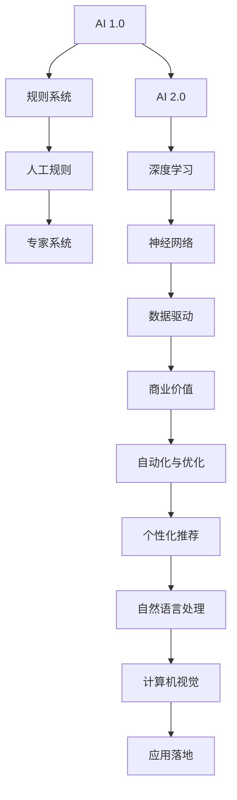

                 

# 李开复：AI 2.0 时代的商业价值

> 关键词：AI 2.0, 商业价值, 人工智能, 技术创新, 应用落地, 未来展望, 商业策略, 数据分析

## 1. 背景介绍

随着人工智能技术的迅猛发展，AI 2.0 时代已经悄然到来。这一时代的到来，不仅仅意味着技术上的突破，更是商业模式的巨大变革。AI 2.0 技术，尤其是深度学习、自然语言处理和计算机视觉等领域的快速发展，正在重新定义企业的核心竞争力。本文将从 AI 2.0 的定义、商业价值以及未来展望三个方面，深入探讨这一时代的商业潜力与策略。

## 2. 核心概念与联系

### 2.1 核心概念概述

**AI 1.0 与 AI 2.0**：
- **AI 1.0**：以规则为基础的人工智能系统，侧重于符号计算和专家系统，需要大量的人工规则和知识库。
- **AI 2.0**：以深度学习为核心的智能系统，依赖大数据训练模型，能够自动学习和提取复杂模式。

**商业价值**：
- **数据驱动**：利用 AI 技术分析海量数据，发掘潜在商业机会。
- **自动化与优化**：通过 AI 自动化流程，优化资源配置，提升运营效率。
- **个性化推荐**：基于用户行为和偏好，提供定制化服务，增强用户体验。

**技术创新**：
- **深度学习**：通过多层神经网络结构，模拟人脑的复杂计算过程。
- **自然语言处理**：使机器能够理解和生成自然语言，提升人机交互体验。
- **计算机视觉**：让机器具备图像识别、视频分析等能力，拓展应用场景。

**应用落地**：
- **智慧医疗**：利用 AI 进行疾病预测、药物研发，提升医疗服务质量。
- **智能制造**：通过 AI 优化生产流程，减少浪费，提升产品质量。
- **金融科技**：利用 AI 进行风险评估、欺诈检测，增强金融安全。

### 2.2 核心概念原理和架构的 Mermaid 流程图



此图展示了 AI 1.0 和 AI 2.0 的不同架构及其在商业价值中的应用。

## 3. 核心算法原理 & 具体操作步骤

### 3.1 算法原理概述

AI 2.0 的商业价值主要体现在以下几个方面：

**数据驱动**：AI 通过深度学习和自然语言处理技术，能够从海量数据中提取有价值的信息，提供决策支持。例如，利用 AI 进行市场分析、客户画像等，帮助企业洞察市场趋势，制定有效策略。

**自动化与优化**：AI 可以通过自动化流程，优化资源配置，提升效率。例如，在制造业中，通过 AI 进行预测性维护，减少设备故障，降低生产成本。

**个性化推荐**：AI 能够基于用户行为和偏好，提供定制化服务，增强用户体验。例如，电商平台的个性化推荐系统，可以根据用户的历史购买记录和浏览行为，推荐相关商品。

### 3.2 算法步骤详解

AI 2.0 的商业价值实现一般分为以下步骤：

1. **数据收集与预处理**：收集相关业务数据，清洗和标注数据集，确保数据质量和一致性。
2. **模型训练与优化**：选择适合的 AI 模型，如深度神经网络，使用训练数据进行模型训练，并通过超参数调优提升模型性能。
3. **应用部署与监控**：将训练好的模型部署到实际业务场景中，实时监控模型性能，及时调整优化。
4. **业务集成与反馈**：将 AI 应用集成到现有业务流程中，收集用户反馈，不断优化模型和应用。

### 3.3 算法优缺点

**优点**：
- **高效性**：AI 能够快速处理大量数据，提供实时决策支持。
- **灵活性**：AI 可以根据业务需求，灵活调整模型结构和参数，适应复杂场景。
- **自适应**：AI 能够不断学习新数据，更新模型，保持竞争力。

**缺点**：
- **高成本**：AI 模型的训练和部署需要大量计算资源，成本较高。
- **技术门槛**：需要具备较强的技术背景，否则难以有效应用。
- **数据依赖**：AI 模型依赖高质量数据，数据质量直接影响模型效果。

### 3.4 算法应用领域

AI 2.0 技术在多个领域展现了强大的商业价值，以下是主要应用领域：

**智慧医疗**：利用 AI 进行疾病预测、治疗方案推荐，提高医疗服务质量。例如，IBM Watson Health 利用 AI 分析患者数据，提供个性化的治疗方案。

**智能制造**：通过 AI 优化生产流程，提升生产效率和质量。例如，GE 利用 AI 进行设备预测性维护，减少设备故障率。

**金融科技**：利用 AI 进行风险评估、欺诈检测，增强金融安全。例如，摩根大通利用 AI 进行信用评分，降低贷款风险。

**零售电商**：利用 AI 进行库存管理、客户推荐，提升销售额。例如，亚马逊利用 AI 进行个性化推荐，提高客户转化率。

## 4. 数学模型和公式 & 详细讲解 & 举例说明

### 4.1 数学模型构建

以推荐系统为例，AI 2.0 推荐模型的一般结构如下：

$$
\text{推荐得分} = \text{用户-商品矩阵} \times \text{用户特征矩阵} \times \text{商品特征矩阵} \times \text{用户行为矩阵}
$$

其中，用户-商品矩阵为二值矩阵，表示用户对商品的兴趣程度；用户特征矩阵和商品特征矩阵为高维向量，表示用户的兴趣和商品的特征；用户行为矩阵为稀疏矩阵，表示用户的历史行为数据。

### 4.2 公式推导过程

推荐系统的目标是最小化预测错误率，即：

$$
\min_{\theta} \frac{1}{N} \sum_{i=1}^N \mathbb{E}[L(f(x_i, y_i), y_i)]
$$

其中，$N$ 为样本数量，$L$ 为损失函数，$f$ 为模型预测函数，$x_i$ 为输入特征，$y_i$ 为标签。

通过梯度下降等优化算法，最小化损失函数，得到最优参数 $\theta$。具体计算步骤如下：

1. **初始化参数**：$\theta \leftarrow \theta_0$
2. **前向传播**：$\hat{y}_i = f(x_i, \theta)$
3. **计算损失**：$L_i = L(\hat{y}_i, y_i)$
4. **反向传播**：$\frac{\partial L_i}{\partial \theta} = \frac{\partial f(x_i, \theta)}{\partial \theta} \times \frac{\partial L}{\partial \hat{y}_i}$
5. **参数更新**：$\theta \leftarrow \theta - \eta \times \frac{\partial L_i}{\partial \theta}$

其中，$\eta$ 为学习率。

### 4.3 案例分析与讲解

假设某电商平台有 1000 个用户，每个用户对 1000 个商品进行了 100 次行为记录，如购买、浏览、点击等。现在需要为用户推荐他可能感兴趣的商品。

**输入特征**：
- 用户-商品矩阵 $X_{1000 \times 1000}$
- 用户特征矩阵 $U_{1000 \times 100}$
- 商品特征矩阵 $V_{1000 \times 100}$
- 用户行为矩阵 $W_{1000 \times 100}$

**模型预测**：
$$
\hat{Y}_{1000 \times 1000} = X_{1000 \times 1000} \times U_{1000 \times 100} \times V_{1000 \times 100} \times W_{1000 \times 100}
$$

**损失函数**：
$$
L(\hat{Y}, Y) = \frac{1}{N} \sum_{i=1}^N \sum_{j=1}^N \mathbb{E}[L(\hat{y}_{ij}, y_{ij})]
$$

**优化算法**：
使用梯度下降算法，不断更新模型参数 $\theta$，直到损失函数收敛。

## 5. 项目实践：代码实例和详细解释说明

### 5.1 开发环境搭建

为了进行 AI 2.0 推荐系统的开发，需要以下开发环境：

1. **Python**：选择 Python 3.x 版本。
2. **PyTorch**：用于深度学习模型的实现和训练。
3. **TensorFlow**：用于分布式计算和模型优化。
4. **Pandas**：用于数据处理和分析。
5. **Numpy**：用于数值计算和矩阵操作。
6. **Jupyter Notebook**：用于交互式编程和数据可视化。

### 5.2 源代码详细实现

以下是一个简单的推荐系统实现示例：

```python
import torch
import torch.nn as nn
import torch.optim as optim
import pandas as pd
import numpy as np

class Recommender(nn.Module):
    def __init__(self, num_users, num_items, num_features):
        super(Recommender, self).__init__()
        self.user_bias = nn.Parameter(torch.zeros(num_users))
        self.item_bias = nn.Parameter(torch.zeros(num_items))
        self.user_embeddings = nn.Parameter(torch.zeros(num_users, num_features))
        self.item_embeddings = nn.Parameter(torch.zeros(num_items, num_features))

    def forward(self, user_id, item_id, user_features, item_features, user_behaviors):
        user_bias = self.user_bias[user_id]
        item_bias = self.item_bias[item_id]
        user_embedding = self.user_embeddings[user_id]
        item_embedding = self.item_embeddings[item_id]
        user_feature_vector = torch.cat([user_bias, user_embedding, user_features], dim=1)
        item_feature_vector = torch.cat([item_bias, item_embedding, item_features], dim=1)
        dot_product = user_feature_vector.dot(item_feature_vector)
        prediction = dot_product / torch.sqrt(user_features.numel() + item_features.numel())
        return prediction

def train_model(model, optimizer, num_epochs, num_users, num_items, num_features, user_behaviors, user_features, item_features):
    device = torch.device("cuda" if torch.cuda.is_available() else "cpu")
    model.to(device)

    for epoch in range(num_epochs):
        for user_id, user_behaviors in user_behaviors.items():
            for item_id, features in user_behaviors.items():
                prediction = model(user_id, item_id, user_features[user_id], item_features[item_id], features)
                loss = nn.BCELoss()(prediction, user_behaviors[item_id])
                optimizer.zero_grad()
                loss.backward()
                optimizer.step()

        print(f"Epoch {epoch+1}, Loss: {loss.item()}")

# 示例数据
num_users = 1000
num_items = 1000
num_features = 100
user_behaviors = pd.DataFrame({user_id: np.random.randint(0, 2, size=(num_items,)) for user_id in range(num_users)})
user_features = pd.DataFrame(np.random.randn(num_users, num_features))
item_features = pd.DataFrame(np.random.randn(num_items, num_features))

# 模型初始化
model = Recommender(num_users, num_items, num_features)

# 定义优化器
optimizer = optim.Adam(model.parameters(), lr=0.01)

# 训练模型
train_model(model, optimizer, num_epochs=10, num_users=num_users, num_items=num_items, num_features=num_features, user_behaviors=user_behaviors, user_features=user_features, item_features=item_features)

# 模型评估
user_ids = [user_id for user_id in range(num_users)]
user_behaviors = user_behaviors.iloc[user_ids, 0]
prediction = model(user_ids, user_ids, user_features[user_ids], item_features[user_ids], user_behaviors)
```

### 5.3 代码解读与分析

**Recommender类**：
- `__init__`方法：初始化模型参数。
- `forward`方法：实现前向传播，计算预测得分。

**train_model函数**：
- 使用 PyTorch 进行模型定义和优化器设置。
- 循环迭代训练，计算损失函数并反向传播更新模型参数。

**示例数据**：
- 使用 pandas 生成随机数据，模拟用户行为和特征。

**模型训练**：
- 将模型部署到 GPU 上，使用 Adam 优化器进行模型训练。
- 在训练过程中，不断更新模型参数，最小化损失函数。

**模型评估**：
- 使用训练好的模型进行预测，并输出预测结果。

## 6. 实际应用场景

### 6.1 智慧医疗

AI 2.0 技术在智慧医疗中的应用，包括疾病预测、药物研发、个性化治疗等方面。例如，IBM Watson Health 利用 AI 分析患者数据，提供个性化的治疗方案，提高了医疗服务的效率和质量。

### 6.2 智能制造

通过 AI 2.0 技术，可以实现预测性维护、质量控制、供应链优化等，提升制造业的自动化和智能化水平。例如，GE 利用 AI 进行设备预测性维护，减少了设备故障，提高了生产效率。

### 6.3 金融科技

在金融科技领域，AI 2.0 技术可以用于风险评估、欺诈检测、客户服务等方面。例如，摩根大通利用 AI 进行信用评分，降低了贷款风险，提高了金融服务的安全性。

### 6.4 未来应用展望

未来，AI 2.0 技术将进一步拓展应用领域，包括自动驾驶、智能家居、智能城市等。这些技术的普及，将带来更加智能化的生活和工作方式，提升人类的生活质量。

## 7. 工具和资源推荐

### 7.1 学习资源推荐

1. **《深度学习》课程**：斯坦福大学李飞飞教授的深度学习课程，涵盖深度学习的基础理论和实践技巧。
2. **《自然语言处理综述》**：Yoshua Bengio 的综述论文，介绍了 NLP 领域的主要研究成果和技术进展。
3. **《Python 深度学习》**：Francois Chollet 的深度学习书籍，详细介绍了 TensorFlow 和 Keras 的使用方法。
4. **Kaggle**：提供丰富的数据集和竞赛平台，是学习和实践深度学习的极佳资源。
5. **Hugging Face**：提供预训练模型和工具库，便于开发者进行模型微调和应用开发。

### 7.2 开发工具推荐

1. **PyTorch**：深度学习框架，具有动态计算图和丰富的神经网络库。
2. **TensorFlow**：开源机器学习库，支持分布式计算和模型优化。
3. **Jupyter Notebook**：交互式编程工具，支持多语言和数据可视化。
4. **Scikit-Learn**：机器学习库，提供了各种机器学习算法和工具。
5. **TensorBoard**：可视化工具，支持模型的训练监控和调试。

### 7.3 相关论文推荐

1. **《深度学习》**：Yoshua Bengio 的深度学习综述，介绍了深度学习的基本概念和应用场景。
2. **《机器学习：实战指南》**：Peter Harrington 的机器学习书籍，详细介绍了机器学习算法的实现和应用。
3. **《计算机视觉：算法与应用》**：Simon J.D. Prince 的计算机视觉书籍，介绍了计算机视觉的基本理论和应用。
4. **《自然语言处理综述》**：Yoshua Bengio 的综述论文，介绍了 NLP 领域的主要研究成果和技术进展。
5. **《智慧城市》**：Lee Clow 的智慧城市书籍，介绍了智慧城市的构建和应用。

## 8. 总结：未来发展趋势与挑战

### 8.1 研究成果总结

AI 2.0 技术在多个领域展示了其强大的商业价值，尤其是在智慧医疗、智能制造、金融科技等领域的成功应用，推动了产业升级和创新。然而，AI 2.0 技术的发展也面临着诸多挑战，如数据质量、模型训练成本、技术门槛等。

### 8.2 未来发展趋势

未来，AI 2.0 技术将进一步发展和普及，将带来更加智能化的应用场景和业务模式。以下是一些未来趋势：

1. **更广泛的应用场景**：AI 2.0 技术将在更多领域得到应用，如自动驾驶、智能家居、智能城市等。
2. **更高的智能化水平**：AI 2.0 技术将更加智能化，能够提供更加个性化和精准的服务。
3. **更强的自适应能力**：AI 2.0 技术将具有更强的自适应能力，能够不断学习和优化。
4. **更高的安全性**：AI 2.0 技术将更加注重安全性，防止恶意攻击和数据泄露。
5. **更强的可解释性**：AI 2.0 技术将更加注重可解释性，增强用户对系统的信任。

### 8.3 面临的挑战

AI 2.0 技术在发展过程中也面临诸多挑战：

1. **数据质量问题**：AI 2.0 技术依赖高质量数据，数据质量直接影响模型效果。
2. **技术门槛高**：AI 2.0 技术需要较强的技术背景，否则难以有效应用。
3. **模型训练成本高**：AI 2.0 技术的训练和部署需要大量计算资源，成本较高。
4. **模型偏见问题**：AI 2.0 模型可能会学习到偏见，导致不公正和有害的输出。
5. **用户信任问题**：AI 2.0 技术的可解释性不足，用户对其信任度不高。

### 8.4 研究展望

未来，AI 2.0 技术的研究将关注以下几个方面：

1. **数据增强和数据清洗**：提高数据质量和多样性，增强模型的泛化能力。
2. **模型优化和效率提升**：优化模型结构和参数，提高模型的训练和推理效率。
3. **模型可解释性**：增强模型的可解释性，提升用户信任度。
4. **安全性和隐私保护**：提高模型的安全性，保护用户隐私。
5. **跨领域应用**：将 AI 2.0 技术应用于更多领域，提升各领域的智能化水平。

## 9. 附录：常见问题与解答

### Q1: AI 2.0 技术与 AI 1.0 技术有何区别？

A: AI 2.0 技术是以深度学习为核心的人工智能技术，能够自动学习和提取复杂模式，而 AI 1.0 技术依赖于人工规则和专家知识库。AI 2.0 技术具有更高的智能化水平和自适应能力，能够处理更加复杂的任务。

### Q2: AI 2.0 技术的主要应用领域有哪些？

A: AI 2.0 技术在多个领域都有应用，包括智慧医疗、智能制造、金融科技、零售电商、智慧城市等。这些应用展示了 AI 2.0 技术的强大商业价值。

### Q3: 如何提高 AI 2.0 模型的训练效率？

A: 提高 AI 2.0 模型训练效率可以从以下几个方面入手：
1. 使用分布式计算框架，如 TensorFlow 和 PyTorch 的分布式训练功能。
2. 使用GPU或TPU等高性能设备，加速计算过程。
3. 使用混合精度训练、梯度积累等优化技术，降低内存和计算资源消耗。
4. 使用模型压缩、稀疏化存储等方法，减少模型尺寸和计算量。

### Q4: AI 2.0 技术面临的主要挑战是什么？

A: AI 2.0 技术面临的主要挑战包括数据质量问题、技术门槛高、模型训练成本高、模型偏见问题、用户信任度低等。这些挑战需要通过数据增强、模型优化、隐私保护等方法来解决。

### Q5: 未来 AI 2.0 技术的发展方向是什么？

A: 未来 AI 2.0 技术的发展方向包括更广泛的应用场景、更高的智能化水平、更强的自适应能力、更高的安全性和可解释性等。这些方向将推动 AI 2.0 技术在更多领域得到应用，提升人类生活的智能化水平。

---

作者：禅与计算机程序设计艺术 / Zen and the Art of Computer Programming

