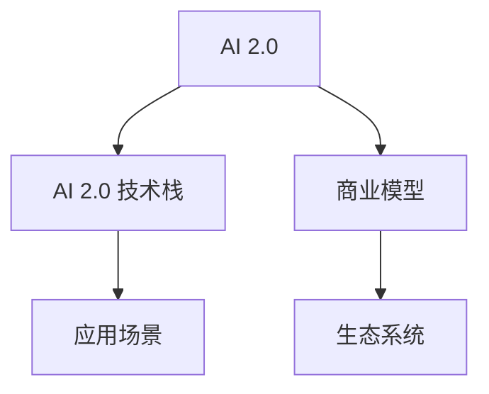
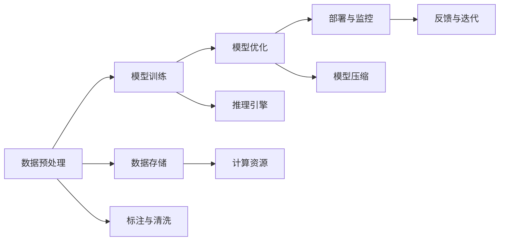

                 

## 1. 背景介绍

在AI 2.0时代，人工智能技术已经从实验室走向商业应用，与各行各业深度融合，呈现出前所未有的发展态势。AI的商业化应用不断拓展，带来新的商业模式和商业机会。本文将深入探讨AI 2.0时代的商业模式，分析其核心要素，展望未来发展趋势，为业内人士提供有价值的参考。

## 2. 核心概念与联系

### 2.1 核心概念概述

在探讨AI 2.0时代的商业模式之前，需要理解以下几个核心概念：

- **AI 2.0**：指第二代人工智能技术，以深度学习为核心，具有强泛化能力和广泛应用前景。
- **AI 2.0 技术栈**：包括深度学习框架（如TensorFlow、PyTorch）、数据处理工具（如Hadoop、Spark）、模型优化工具（如TensorRT、ONNX）等。
- **商业模型**：指企业基于AI技术提供的产品或服务，以及通过这些产品或服务实现的收入和利润模式。
- **生态系统**：包括供应商、用户、政府、投资者等多方参与者，共同构成AI 2.0商业化的生态体系。

这些概念之间的关系可以通过以下Mermaid流程图来展示：



此图展示了AI 2.0技术栈为AI 2.0商业模型提供技术支撑，应用场景体现商业价值，而生态系统则构成了AI 2.0商业化的环境。

### 2.2 核心概念原理和架构的 Mermaid 流程图

AI 2.0技术栈的核心原理是利用深度学习算法从大量数据中学习模式和特征，并应用于不同的商业场景。以下是一个简化的AI 2.0技术栈架构图：



此图展示了AI 2.0技术栈的四个关键步骤：数据预处理、模型训练、模型优化和部署与监控。同时，数据存储和计算资源、标注与清洗、推理引擎、模型压缩、反馈与迭代也是不可或缺的组成部分。

## 3. 核心算法原理 & 具体操作步骤

### 3.1 算法原理概述

AI 2.0的商业化过程中，核心的算法原理包括深度学习、迁移学习、强化学习等。深度学习能够处理大量非结构化数据，提取高级特征；迁移学习可以将预训练模型应用于不同场景；强化学习则通过奖励机制训练模型，优化策略。

### 3.2 算法步骤详解

AI 2.0商业化的具体操作步骤主要包括以下几个环节：

1. **数据收集与预处理**：收集与业务相关的数据，进行清洗、标注和预处理。
2. **模型选择与训练**：选择适合的深度学习模型，并利用标注数据进行训练。
3. **模型优化与调整**：通过超参数调优、模型压缩、迁移学习等手段，提升模型性能。
4. **部署与监控**：将训练好的模型部署到生产环境，进行实时监控和优化。
5. **商业化落地**：将模型应用到具体的商业场景中，实现商业价值。

### 3.3 算法优缺点

AI 2.0商业化算法的优点包括：

- **高泛化能力**：深度学习模型能够处理大规模非结构化数据，提取高层次特征。
- **高效训练**：通过迁移学习，利用预训练模型加速训练。
- **鲁棒性**：强化学习能够应对动态环境，适应性强。

缺点包括：

- **数据依赖**：需要大量标注数据进行训练。
- **模型复杂**：深度学习模型参数量庞大，训练和推理复杂。
- **解释性不足**：黑盒模型难以解释内部机制。

### 3.4 算法应用领域

AI 2.0技术栈广泛应用于金融、医疗、零售、制造等多个领域。例如：

- **金融领域**：利用深度学习进行风险评估、智能投顾、欺诈检测等。
- **医疗领域**：通过深度学习进行图像识别、病理分析、智能诊断等。
- **零售领域**：使用深度学习进行客户画像、推荐系统、库存优化等。
- **制造领域**：应用深度学习进行质量检测、设备预测性维护等。

## 4. 数学模型和公式 & 详细讲解 & 举例说明

### 4.1 数学模型构建

AI 2.0商业化的数学模型主要包括以下几种：

- **神经网络**：用于处理图像、语音、文本等非结构化数据。
- **支持向量机**：适用于分类和回归任务。
- **随机森林**：适用于特征重要性较高的场景。

### 4.2 公式推导过程

以神经网络为例，其核心公式包括前向传播和反向传播：

- **前向传播**：$$
  \text{前向传播} = \text{激活函数}(\text{权重矩阵} \times \text{输入数据} + \text{偏置项})
  $$

- **反向传播**：$$
  \text{反向传播} = \nabla_{w}(\text{损失函数}) \times \text{前向传播} \times \text{激活函数的导数}
  $$

其中，$\nabla_{w}(\text{损失函数})$表示损失函数对权重的梯度，$\text{激活函数}$包括ReLU、Sigmoid等。

### 4.3 案例分析与讲解

以医疗影像诊断为例，通过深度学习模型进行病理图像分类：

1. **数据准备**：收集医院的历史病历和影像数据，进行清洗和标注。
2. **模型选择**：选择卷积神经网络（CNN）作为模型。
3. **模型训练**：利用标注数据进行模型训练，优化超参数。
4. **模型验证**：在验证集上进行模型验证，调整模型参数。
5. **模型应用**：将训练好的模型部署到医院影像诊断系统中，实时处理患者影像数据，辅助医生诊断。

## 5. 项目实践：代码实例和详细解释说明

### 5.1 开发环境搭建

AI 2.0商业化项目通常需要高性能的计算资源和数据存储。以下是常用的开发环境搭建步骤：

1. **安装Python环境**：
   ```bash
   conda create --name pytorch-env python=3.8
   conda activate pytorch-env
   ```

2. **安装PyTorch**：
   ```bash
   pip install torch torchvision torchaudio
   ```

3. **安装深度学习框架**：
   ```bash
   pip install tensorflow keras
   ```

4. **安装数据处理工具**：
   ```bash
   pip install hdfs hive
   ```

5. **安装模型优化工具**：
   ```bash
   pip install onnx
   ```

### 5.2 源代码详细实现

以深度学习模型为例，给出TensorFlow框架下的代码实现：

```python
import tensorflow as tf
from tensorflow import keras

# 定义模型结构
model = keras.Sequential([
    keras.layers.Dense(64, activation='relu'),
    keras.layers.Dense(10)
])

# 定义优化器
optimizer = tf.keras.optimizers.Adam(learning_rate=0.001)

# 定义损失函数
loss_fn = tf.keras.losses.SparseCategoricalCrossentropy(from_logits=True)

# 定义模型编译
model.compile(optimizer=optimizer, loss=loss_fn, metrics=['accuracy'])

# 加载数据
(x_train, y_train), (x_test, y_test) = tf.keras.datasets.mnist.load_data()

# 数据预处理
x_train = x_train / 255.0
x_test = x_test / 255.0

# 模型训练
model.fit(x_train, y_train, epochs=10, validation_data=(x_test, y_test))
```

### 5.3 代码解读与分析

以上代码展示了使用TensorFlow进行深度学习模型训练的基本流程。关键点包括：

- **模型结构定义**：使用Sequential模型定义多层神经网络结构。
- **优化器选择**：使用Adam优化器进行参数更新。
- **损失函数定义**：使用交叉熵损失函数。
- **模型编译**：指定优化器和损失函数。
- **数据加载与预处理**：将数据归一化处理，便于模型训练。
- **模型训练**：在训练集上进行多轮迭代训练，并在验证集上进行性能评估。

### 5.4 运行结果展示

训练完成后，可以通过测试集评估模型的性能：

```python
test_loss, test_acc = model.evaluate(x_test, y_test)
print('Test accuracy:', test_acc)
```

输出结果显示模型的准确率。

## 6. 实际应用场景

### 6.1 金融领域

AI 2.0在金融领域的应用包括智能投顾、风险评估、欺诈检测等。例如，利用深度学习模型对交易数据进行模式识别，预测市场走势，优化投资组合。

### 6.2 医疗领域

AI 2.0在医疗领域的应用包括图像诊断、病理分析、智能诊断等。例如，利用深度学习模型进行乳腺癌图像分类，辅助医生进行诊断。

### 6.3 零售领域

AI 2.0在零售领域的应用包括客户画像、推荐系统、库存优化等。例如，利用深度学习模型对客户行为进行预测，优化商品推荐。

### 6.4 制造领域

AI 2.0在制造领域的应用包括质量检测、设备预测性维护等。例如，利用深度学习模型进行缺陷检测，提高产品质量。

## 7. 工具和资源推荐

### 7.1 学习资源推荐

1. **《深度学习》课程**：斯坦福大学提供的在线课程，涵盖深度学习的基本概念和应用。
2. **《TensorFlow 实战》书籍**：介绍TensorFlow框架的使用方法，并包含多个实战项目。
3. **Kaggle平台**：提供大量数据集和竞赛项目，帮助开发者练习和应用深度学习模型。

### 7.2 开发工具推荐

1. **PyTorch**：深度学习框架，易于使用，支持多种语言实现。
2. **TensorFlow**：由Google主导的开源框架，支持分布式计算。
3. **Jupyter Notebook**：交互式编程环境，便于代码测试和数据可视化。
4. **Google Colab**：提供高性能GPU/TPU资源，支持大规模模型训练。

### 7.3 相关论文推荐

1. **《ImageNet大规模视觉识别挑战》**：深度学习在图像识别领域的经典研究。
2. **《神经网络与深度学习》**：深度学习的基本概念和方法。
3. **《强化学习与智能决策》**：强化学习在AI 2.0中的应用。

## 8. 总结：未来发展趋势与挑战

### 8.1 研究成果总结

AI 2.0技术栈已经广泛应用于多个领域，并取得了显著成果。未来的发展方向包括模型复杂性提升、多模态数据融合、实时系统优化等。

### 8.2 未来发展趋势

1. **模型规模扩大**：随着计算资源和数据量的增加，深度学习模型的参数量将继续增长，模型复杂度将进一步提高。
2. **多模态数据融合**：深度学习模型将能够处理图像、语音、文本等多种模态数据，提升智能系统的全面性。
3. **实时系统优化**：针对实时性要求高的场景，将开发高效推理引擎和优化技术，提升系统响应速度。

### 8.3 面临的挑战

1. **计算资源需求高**：大规模深度学习模型的训练和推理需要高性能计算资源。
2. **数据质量要求高**：深度学习模型对数据质量要求较高，数据清洗和标注工作量大。
3. **模型复杂性高**：深度学习模型结构复杂，难以解释和调试。

### 8.4 研究展望

未来的研究重点包括：

1. **高效模型训练**：开发高效优化算法和分布式训练技术，提升模型训练速度。
2. **模型压缩与加速**：开发模型压缩和加速技术，提升推理速度和资源利用率。
3. **多模态数据处理**：开发多模态数据融合技术，提升系统的全面性和鲁棒性。
4. **实时系统优化**：开发高效的实时推理引擎，支持高实时性要求的应用场景。

## 9. 附录：常见问题与解答

**Q1：AI 2.0技术栈是否适用于所有行业？**

A: AI 2.0技术栈虽然具有广泛的应用前景，但需要根据行业特点进行适配和优化。例如，医疗领域需要处理大量的图像和文本数据，制造领域则需要处理质量检测数据。

**Q2：AI 2.0技术栈如何与其他技术进行融合？**

A: AI 2.0技术栈可以通过API接口与其他技术进行融合。例如，利用深度学习模型进行图像识别，再将其结果输入到规则引擎中进行决策。

**Q3：AI 2.0技术栈有哪些常见的挑战？**

A: AI 2.0技术栈的常见挑战包括计算资源需求高、数据质量要求高、模型复杂性高。需要从技术、资源、数据等多个方面进行优化。

**Q4：AI 2.0技术栈未来的发展方向是什么？**

A: AI 2.0技术栈的未来发展方向包括模型规模扩大、多模态数据融合、实时系统优化等。需要持续创新，解决现有挑战，拓展应用边界。

---

作者：禅与计算机程序设计艺术 / Zen and the Art of Computer Programming

