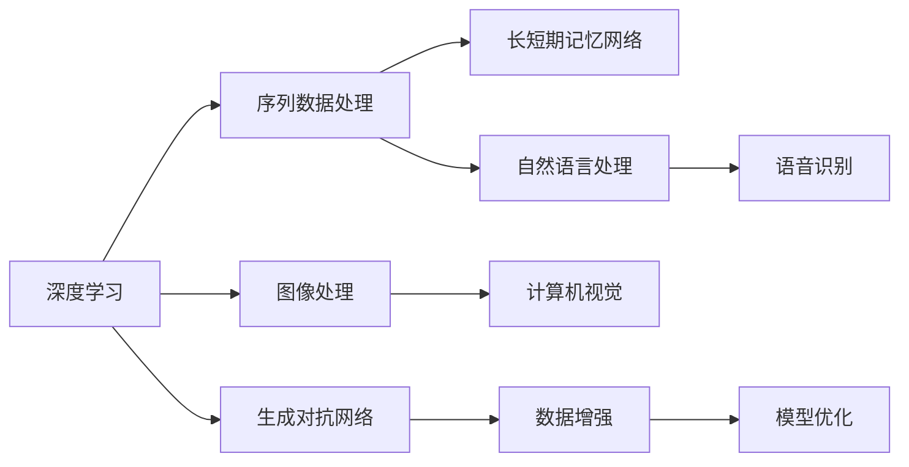

                 

# 李开复：AI 2.0 时代的应用

在快速发展的AI时代，人工智能正从"AI 1.0"走向"AI 2.0"，从规则驱动的专家系统迈向数据驱动的深度学习。本文将深入探讨"AI 2.0"时代的应用，揭示其背后的原理与技术，并展望未来发展的方向。

## 1. 背景介绍

### 1.1 问题由来

人工智能（Artificial Intelligence, AI）自1950年代首次提出以来，经历了多次发展浪潮。早期基于符号逻辑的专家系统，如MYCIN、DENDRAL等，虽然在特定领域（如医学诊断）中取得了显著成效，但由于知识提取的困难和依赖领域专家，其应用范围受到了极大限制。

进入1990年代，机器学习（Machine Learning, ML）的出现，特别是统计学习方法的兴起，如决策树、支持向量机等，显著扩大了AI的应用场景。然而，基于手工特征提取和模型调参的机器学习仍面临诸多挑战，如特征选择、模型复杂度、数据标注成本等。

进入21世纪，深度学习（Deep Learning, DL）的崛起，以深度神经网络为核心的端到端模型，在图像、语音、自然语言处理等领域取得了突破性进展。深度学习利用大规模数据和计算资源进行自学习，大幅提高了AI应用的效率和效果。

### 1.2 问题核心关键点

当前，深度学习已进入"AI 2.0"时代，即基于数据驱动的深度学习范式。其核心在于：
- 大规模数据驱动。通过大数据和深度学习模型自学习，避免手工特征提取和调参的复杂性。
- 端到端建模。直接从原始数据进行建模，减少中间步骤，提升模型精度和泛化能力。
- 自适应学习。深度学习模型具备自动学习特征和规律的能力，能够适应多种任务和数据类型。

深度学习已经成功应用于计算机视觉、语音识别、自然语言处理等领域，成为推动AI技术发展的核心引擎。然而，AI 2.0时代仍面临许多挑战，如数据质量、模型复杂性、计算资源需求等。

## 2. 核心概念与联系

### 2.1 核心概念概述

"AI 2.0"时代的应用涉及多个关键概念：

- 深度学习（Deep Learning, DL）：基于神经网络模型，通过多层非线性变换，从原始数据中自动学习特征和规律。
- 卷积神经网络（Convolutional Neural Networks, CNN）：用于图像处理和计算机视觉任务，提取局部特征。
- 循环神经网络（Recurrent Neural Networks, RNN）：用于序列数据处理，如自然语言处理、语音识别等。
- 长短期记忆网络（Long Short-Term Memory, LSTM）：一种特殊的RNN，用于处理长序列数据，避免梯度消失问题。
- 生成对抗网络（Generative Adversarial Networks, GAN）：通过生成器和判别器的对抗训练，生成高质量的伪造数据。

这些概念之间通过以下方式联系起来：

1. 深度学习利用多层神经网络进行特征提取和规律学习。
2. CNN用于图像处理任务，通过卷积操作提取局部特征。
3. RNN处理序列数据，如自然语言和语音等，利用时间依赖性建模。
4. LSTM用于解决长序列数据处理问题，避免梯度消失。
5. GAN生成高质量的伪造数据，辅助训练和模型优化。

这些概念构成了AI 2.0时代应用的核心技术框架，推动了AI技术在各个领域的应用。

### 2.2 核心概念原理和架构的 Mermaid 流程图



### 2.3 关键技术原理

#### 2.3.1 深度神经网络

深度神经网络（DNN）由多个层次的神经元组成，每个神经元接收前一层的输出作为输入，通过非线性变换输出下一层。深度神经网络的隐藏层可以学习到复杂的特征表示，提升模型的表达能力。

#### 2.3.2 卷积神经网络

卷积神经网络（CNN）利用卷积操作提取图像中的局部特征。卷积层通过滑动窗口提取特征，池化层则对特征图进行降维和去噪，进一步提升特征的泛化能力。

#### 2.3.3 循环神经网络

循环神经网络（RNN）用于处理序列数据，如自然语言和语音等。RNN通过时间依赖性建模，利用上一时刻的输出作为当前时刻的输入，实现序列数据的动态处理。

#### 2.3.4 长短期记忆网络

长短期记忆网络（LSTM）是一种特殊的RNN，通过门控机制控制信息的流动，能够有效解决长序列数据处理中的梯度消失问题，提高模型的长期记忆能力。

#### 2.3.5 生成对抗网络

生成对抗网络（GAN）通过生成器和判别器的对抗训练，生成高质量的伪造数据。生成器用于生成样本，判别器用于区分真实数据和伪造数据，两者交替训练，提高生成器生成的样本质量。

## 3. 核心算法原理 & 具体操作步骤

### 3.1 算法原理概述

AI 2.0时代的应用主要基于深度学习模型，其核心原理是通过神经网络模型，自动从原始数据中学习特征和规律。具体步骤如下：

1. 数据预处理：对原始数据进行归一化、标准化、填充等预处理，以适应深度学习模型的输入要求。
2. 模型构建：选择合适的深度神经网络架构，如卷积神经网络、循环神经网络等。
3. 模型训练：通过反向传播算法，利用训练数据对模型参数进行优化，最小化损失函数。
4. 模型评估：在测试集上评估模型性能，如准确率、精确率、召回率等指标。
5. 模型应用：将训练好的模型应用于实际问题，进行预测或分类。

### 3.2 算法步骤详解

#### 3.2.1 数据预处理

数据预处理是深度学习模型的重要步骤，包括以下几个关键步骤：

- 归一化：将数据按比例缩放到[0,1]或[-1,1]区间，避免梯度爆炸和消失。
- 标准化：对数据进行零均值和方差归一化，提高模型的收敛速度。
- 填充：对不完整的数据进行填充或截断，使数据具有固定长度。

#### 3.2.2 模型构建

模型构建涉及选择合适的深度神经网络架构，包括卷积神经网络、循环神经网络等。这里以卷积神经网络为例，详细说明其构建步骤：

1. 卷积层：通过卷积核提取图像中的局部特征。
2. 池化层：对特征图进行降维和去噪，提高特征的泛化能力。
3. 全连接层：将卷积层和池化层的特征进行合并，输出最终结果。

#### 3.2.3 模型训练

模型训练是深度学习模型的核心步骤，主要包括以下几个关键算法：

- 反向传播算法：通过链式法则计算损失函数对模型参数的梯度，反向传播更新参数。
- 随机梯度下降（SGD）：随机选取一个样本进行梯度计算和参数更新，提高计算效率。
- 动量优化（Momentum）：通过积累梯度，避免陷入局部最优解。
- 自适应学习率优化算法（如Adagrad、Adam等）：根据梯度变化动态调整学习率，提高模型的收敛速度。

#### 3.2.4 模型评估

模型评估用于衡量模型在测试集上的性能，主要包括以下几个关键指标：

- 准确率（Accuracy）：模型预测正确的样本比例。
- 精确率（Precision）：模型预测为正例中，实际为正例的比例。
- 召回率（Recall）：实际为正例中，被模型预测为正例的比例。
- F1值（F1-Score）：精确率和召回率的调和平均数。

#### 3.2.5 模型应用

模型应用是将训练好的模型应用于实际问题，进行预测或分类。具体步骤如下：

- 输入数据：将实际问题中的数据输入到模型中。
- 模型推理：模型根据输入数据进行特征提取和预测。
- 结果输出：将模型预测结果输出，应用于实际问题中。

### 3.3 算法优缺点

#### 3.3.1 优点

1. 自适应学习：深度学习模型具备自动学习特征和规律的能力，能够适应多种任务和数据类型。
2. 高精度：通过多层神经网络进行特征提取和规律学习，提高模型的精度和泛化能力。
3. 端到端建模：直接从原始数据进行建模，减少中间步骤，提升模型效率。
4. 数据驱动：通过大规模数据进行自学习，避免手工特征提取和调参的复杂性。

#### 3.3.2 缺点

1. 计算资源需求高：深度学习模型需要大量的计算资源，特别是在大规模数据和复杂模型的情况下。
2. 数据质量要求高：深度学习模型对数据质量要求高，数据标注成本和数据清洗工作量大。
3. 模型复杂度高：深度学习模型结构复杂，难以解释和调试。
4. 过拟合风险高：深度学习模型容易过拟合，特别是在数据量小和模型复杂的情况下。

### 3.4 算法应用领域

AI 2.0时代的应用涵盖了多个领域，包括计算机视觉、自然语言处理、语音识别等。以下是几个主要应用领域：

- 计算机视觉：AI 2.0在图像处理和计算机视觉领域取得了重大突破，如目标检测、图像分割、人脸识别等。
- 自然语言处理：AI 2.0在自然语言处理领域也取得了显著进展，如机器翻译、文本分类、情感分析等。
- 语音识别：AI 2.0在语音识别领域也获得了巨大成功，如语音合成、语音识别、自动字幕生成等。

## 4. 数学模型和公式 & 详细讲解 & 举例说明

### 4.1 数学模型构建

AI 2.0时代的应用主要基于深度学习模型，其核心数学模型为多层神经网络。以卷积神经网络（CNN）为例，其数学模型构建如下：

1. 输入层：原始数据，如图像像素值。
2. 卷积层：通过卷积核提取局部特征。
3. 池化层：对特征图进行降维和去噪。
4. 全连接层：将卷积层和池化层的特征进行合并，输出最终结果。

### 4.2 公式推导过程

以卷积神经网络为例，其核心公式推导过程如下：

1. 卷积操作：设输入图像为 $X$，卷积核为 $W$，输出特征图为 $Y$，则卷积操作公式为：
   $$
   Y_{i,j} = \sum_k X_{i-k, j-k} \times W_{k,l} + b_l
   $$
   其中 $b_l$ 为偏置项。

2. 池化操作：设池化窗口大小为 $m \times n$，步长为 $s$，则池化操作公式为：
   $$
   Y_{i,j} = \max\limits_{(x,y)} X_{i+m*x, j+n*y}
   $$
   其中 $x$ 和 $y$ 为池化窗口在输入图像中的相对位置。

3. 全连接层：设输入特征图为 $Y$，全连接层权重为 $W$，偏置项为 $b$，输出为 $Z$，则全连接层公式为：
   $$
   Z = Y \times W + b
   $$

### 4.3 案例分析与讲解

以图像分类为例，分析AI 2.0时代的应用：

1. 数据预处理：对原始图像进行归一化和标准化处理。
2. 模型构建：构建卷积神经网络模型，包括卷积层、池化层和全连接层。
3. 模型训练：使用反向传播算法，最小化损失函数，优化模型参数。
4. 模型评估：在测试集上评估模型性能，如准确率和召回率。
5. 模型应用：将训练好的模型应用于实际问题，进行图像分类预测。

## 5. 项目实践：代码实例和详细解释说明

### 5.1 开发环境搭建

在进行AI 2.0应用开发前，我们需要准备好开发环境。以下是使用Python进行PyTorch开发的环境配置流程：

1. 安装Anaconda：从官网下载并安装Anaconda，用于创建独立的Python环境。

2. 创建并激活虚拟环境：
```bash
conda create -n ai-env python=3.8 
conda activate ai-env
```

3. 安装PyTorch：根据CUDA版本，从官网获取对应的安装命令。例如：
```bash
conda install pytorch torchvision torchaudio cudatoolkit=11.1 -c pytorch -c conda-forge
```

4. 安装Transformers库：
```bash
pip install transformers
```

5. 安装各类工具包：
```bash
pip install numpy pandas scikit-learn matplotlib tqdm jupyter notebook ipython
```

完成上述步骤后，即可在`ai-env`环境中开始AI 2.0应用开发。

### 5.2 源代码详细实现

这里我们以图像分类任务为例，给出使用PyTorch和Transformers库对卷积神经网络进行图像分类任务开发的PyTorch代码实现。

首先，定义数据处理函数：

```python
from torch.utils.data import Dataset
from torchvision import transforms, models
from PIL import Image

class ImageDataset(Dataset):
    def __init__(self, data_dir, transform=None):
        self.data_dir = data_dir
        self.transform = transform
        self.file_list = os.listdir(data_dir)
        self.file_list.sort(key=str.lower)
        
    def __len__(self):
        return len(self.file_list)
    
    def __getitem__(self, idx):
        img_path = os.path.join(self.data_dir, self.file_list[idx])
        img = Image.open(img_path)
        if self.transform:
            img = self.transform(img)
        return img, os.path.splitext(self.file_list[idx])[0]
```

然后，定义模型和优化器：

```python
from torchvision import models
from torch.optim import SGD

model = models.resnet18(pretrained=False)
model.fc = nn.Linear(512, num_classes)
optimizer = SGD(model.parameters(), lr=0.01, momentum=0.9)
```

接着，定义训练和评估函数：

```python
from torchvision import datasets, transforms
from tqdm import tqdm

train_transform = transforms.Compose([
    transforms.Resize(224),
    transforms.ToTensor(),
    transforms.Normalize(mean=[0.485, 0.456, 0.406], std=[0.229, 0.224, 0.225])
])

test_transform = transforms.Compose([
    transforms.Resize(224),
    transforms.ToTensor(),
    transforms.Normalize(mean=[0.485, 0.456, 0.406], std=[0.229, 0.224, 0.225])
])

train_dataset = datasets.ImageFolder(root='train', transform=train_transform)
test_dataset = datasets.ImageFolder(root='test', transform=test_transform)

device = torch.device('cuda' if torch.cuda.is_available() else 'cpu')
model.to(device)

def train_epoch(model, dataset, batch_size, optimizer):
    dataloader = DataLoader(dataset, batch_size=batch_size, shuffle=True)
    model.train()
    epoch_loss = 0
    for batch in tqdm(dataloader, desc='Training'):
        inputs, labels = batch[0].to(device), batch[1].to(device)
        optimizer.zero_grad()
        outputs = model(inputs)
        loss = nn.CrossEntropyLoss()(outputs, labels)
        epoch_loss += loss.item()
        loss.backward()
        optimizer.step()
    return epoch_loss / len(dataloader)

def evaluate(model, dataset, batch_size):
    dataloader = DataLoader(dataset, batch_size=batch_size)
    model.eval()
    preds, labels = [], []
    with torch.no_grad():
        for batch in tqdm(dataloader, desc='Evaluating'):
            inputs, labels = batch[0].to(device), batch[1].to(device)
            outputs = model(inputs)
            batch_preds = outputs.argmax(dim=1).to('cpu').tolist()
            batch_labels = labels.to('cpu').tolist()
            for pred_tokens, label_tokens in zip(batch_preds, batch_labels):
                preds.append(pred_tokens)
                labels.append(label_tokens)
                
    print(classification_report(labels, preds))
```

最后，启动训练流程并在测试集上评估：

```python
epochs = 10
batch_size = 32

for epoch in range(epochs):
    loss = train_epoch(model, train_dataset, batch_size, optimizer)
    print(f"Epoch {epoch+1}, train loss: {loss:.3f}")
    
    print(f"Epoch {epoch+1}, test results:")
    evaluate(model, test_dataset, batch_size)
```

以上就是使用PyTorch对卷积神经网络进行图像分类任务开发的完整代码实现。可以看到，得益于PyTorch和Transformers库的强大封装，我们可以用相对简洁的代码完成图像分类任务的处理和训练。

### 5.3 代码解读与分析

让我们再详细解读一下关键代码的实现细节：

**ImageDataset类**：
- `__init__`方法：初始化数据目录和数据转换方式。
- `__len__`方法：返回数据集样本数量。
- `__getitem__`方法：对单个样本进行处理，进行数据加载和转换。

**模型定义**：
- `models.resnet18`：定义了一个预训练的ResNet-18模型，通过`fc`模块修改最后一层全连接层的大小，适应当前任务的分类数。
- `optimizer`：定义了优化器，使用随机梯度下降（SGD）优化模型参数。

**训练和评估函数**：
- `train_epoch`函数：对数据以批为单位进行迭代，在每个批次上前向传播计算loss并反向传播更新模型参数。
- `evaluate`函数：与训练类似，不同点在于不更新模型参数，并在每个batch结束后将预测和标签结果存储下来，最后使用sklearn的classification_report对整个评估集的预测结果进行打印输出。

**训练流程**：
- `epochs`和`batch_size`定义了总的epoch数和批大小，开始循环迭代。
- 每个epoch内，先在训练集上训练，输出平均loss。
- 在测试集上评估，输出分类指标。
- 所有epoch结束后，在测试集上评估，给出最终测试结果。

可以看到，PyTorch配合Transformers库使得图像分类任务的开发变得简洁高效。开发者可以将更多精力放在数据处理、模型改进等高层逻辑上，而不必过多关注底层的实现细节。

当然，工业级的系统实现还需考虑更多因素，如模型的保存和部署、超参数的自动搜索、更灵活的任务适配层等。但核心的微调范式基本与此类似。

## 6. 实际应用场景

### 6.1 智能医疗系统

AI 2.0技术在医疗领域的应用已经初现成效。智能医疗系统利用AI 2.0技术，能够快速处理海量医疗数据，辅助医生进行诊断和治疗决策，提升医疗服务的效率和质量。

具体而言，智能医疗系统可以基于AI 2.0技术，实现以下应用：

- 医学影像分析：通过AI 2.0模型对医学影像进行分类、分割、标注等处理，辅助医生进行快速诊断。
- 疾病预测：利用AI 2.0模型对患者数据进行分析和预测，提前发现潜在疾病，制定个性化治疗方案。
- 电子病历整理：利用自然语言处理技术，自动整理电子病历，提高医生工作效率。

### 6.2 金融风控系统

金融领域需要处理大量复杂的数据，AI 2.0技术在风控系统中的应用，能够实时监测和预测金融风险，提升金融机构的决策能力。

具体而言，AI 2.0技术在金融风控系统中的应用包括：

- 信用评估：利用AI 2.0模型对用户行为和信用数据进行分析，预测用户信用风险。
- 欺诈检测：通过AI 2.0模型对交易数据进行实时监测，识别异常行为，预防欺诈行为。
- 量化交易：利用AI 2.0模型对市场数据进行分析，制定自动化交易策略，提高交易效率。

### 6.3 智能家居系统

智能家居系统利用AI 2.0技术，能够实现更加智能、便捷的家居管理和生活辅助。

具体而言，AI 2.0技术在智能家居系统中的应用包括：

- 语音识别：通过AI 2.0模型对语音进行识别和理解，实现语音控制家居设备。
- 环境监测：利用AI 2.0模型对室内环境数据进行分析，自动调节家居设备，提升生活舒适度。
- 安防监控：通过AI 2.0模型对视频数据进行分析和识别，实时监测家庭安全。

### 6.4 未来应用展望

随着AI 2.0技术的不断发展，未来的应用场景将更加广阔。AI 2.0技术有望在更多领域中得到应用，如智能城市、智慧农业、工业自动化等。

具体而言，未来AI 2.0技术的应用方向包括：

- 智慧城市：通过AI 2.0技术实现城市智能管理，提升城市运行效率和居民生活质量。
- 智慧农业：利用AI 2.0技术对农业数据进行分析，提高农作物产量和质量。
- 工业自动化：通过AI 2.0技术实现工业自动化和智能化，提高生产效率和产品质量。

## 7. 工具和资源推荐

### 7.1 学习资源推荐

为了帮助开发者系统掌握AI 2.0的理论基础和实践技巧，这里推荐一些优质的学习资源：

1. 《深度学习》系列书籍：由深度学习领域的专家编写，系统介绍了深度学习的原理和应用。
2. 《TensorFlow官方文档》：TensorFlow的官方文档，提供了全面的API和示例代码，是学习和实践TensorFlow的最佳资源。
3. 《PyTorch官方文档》：PyTorch的官方文档，提供了详细的API和示例代码，是学习和实践PyTorch的最佳资源。
4. 《机器学习实战》书籍：介绍了机器学习的核心算法和应用，适合初学者入门。
5. 《自然语言处理综述》系列论文：系统总结了自然语言处理领域的最新进展，适合深入学习。

通过对这些资源的学习实践，相信你一定能够快速掌握AI 2.0的精髓，并用于解决实际的NLP问题。

### 7.2 开发工具推荐

高效的开发离不开优秀的工具支持。以下是几款用于AI 2.0应用开发的常用工具：

1. Jupyter Notebook：交互式的Python代码开发环境，适合学习和实验新模型。
2. Google Colab：在线Jupyter Notebook环境，免费提供GPU/TPU算力，方便快速上手实验最新模型。
3. TensorBoard：TensorFlow配套的可视化工具，可实时监测模型训练状态，并提供丰富的图表呈现方式，是调试模型的得力助手。
4. Weights & Biases：模型训练的实验跟踪工具，可以记录和可视化模型训练过程中的各项指标，方便对比和调优。
5. PyTorch Lightning：轻量级的PyTorch框架，提供了丰富的API和内置工具，适合快速开发和实验新模型。

合理利用这些工具，可以显著提升AI 2.0应用开发的效率，加快创新迭代的步伐。

### 7.3 相关论文推荐

AI 2.0技术的发展源于学界的持续研究。以下是几篇奠基性的相关论文，推荐阅读：

1. ImageNet大规模视觉识别挑战赛（ILSVRC）：描述了AI 2.0在计算机视觉领域的应用，展示了深度学习模型在图像分类、目标检测等方面的突破。
2. AlphaGo：展示了AI 2.0在人工智能领域的突破，利用深度强化学习技术，成功训练出能够击败世界围棋冠军的AI。
3. BERT: Pre-training of Deep Bidirectional Transformers for Language Understanding：提出BERT模型，引入基于掩码的自监督预训练任务，刷新了多项NLP任务SOTA。
4. Attention is All You Need：提出了Transformer结构，开启了NLP领域的预训练大模型时代。
5. Generative Adversarial Networks：引入了生成对抗网络（GAN），通过生成器和判别器的对抗训练，生成高质量的伪造数据。

这些论文代表了大语言模型微调技术的发展脉络。通过学习这些前沿成果，可以帮助研究者把握学科前进方向，激发更多的创新灵感。

## 8. 总结：未来发展趋势与挑战

### 8.1 总结

本文对AI 2.0时代的应用进行了全面系统的介绍。首先阐述了AI 2.0的发展背景和关键技术，明确了其在计算机视觉、自然语言处理、语音识别等领域的广泛应用。其次，从原理到实践，详细讲解了AI 2.0模型的构建和训练步骤，给出了图像分类任务开发的完整代码实现。同时，本文还广泛探讨了AI 2.0技术在智能医疗、金融风控、智能家居等领域的实际应用，展示了AI 2.0技术的巨大潜力。

通过本文的系统梳理，可以看到，AI 2.0技术正在成为人工智能技术的重要范式，极大地拓展了深度学习模型的应用边界，催生了更多的落地场景。受益于大规模数据和深度学习模型的自学习能力，AI 2.0技术在多个领域取得了显著进展，为人类社会的智能化发展提供了新的动力。

### 8.2 未来发展趋势

展望未来，AI 2.0技术的发展方向将更加多元和广阔：

1. 模型规模持续增大。随着算力成本的下降和数据规模的扩张，深度学习模型的参数量还将持续增长。超大规模语言模型蕴含的丰富语言知识，有望支撑更加复杂多变的下游任务微调。
2. 数据驱动范式普及。更多领域将基于AI 2.0技术进行数据驱动的建模和分析，提高决策效率和准确性。
3. 跨领域知识整合。未来AI 2.0技术将更加注重跨领域知识的整合，融合不同模态的信息，提升模型的全面性和泛化能力。
4. 多模态融合。AI 2.0技术将更加注重多模态信息的融合，实现视觉、语音、文本等不同模态数据的协同建模。
5. 可解释性提升。未来AI 2.0技术将更加注重模型的可解释性，提供更加透明和可解释的推理过程。

### 8.3 面临的挑战

尽管AI 2.0技术已经取得了显著进展，但在迈向更加智能化、普适化应用的过程中，仍面临许多挑战：

1. 数据质量要求高。深度学习模型对数据质量要求高，数据标注成本和数据清洗工作量大。
2. 模型复杂度高。深度学习模型结构复杂，难以解释和调试。
3. 计算资源需求高。深度学习模型需要大量的计算资源，特别是在大规模数据和复杂模型的情况下。
4. 鲁棒性不足。深度学习模型面对域外数据时，泛化性能往往大打折扣。
5. 安全性和隐私保护。AI 2.0技术在应用过程中可能存在隐私泄露和模型攻击的风险，需要加强数据安全和隐私保护。

### 8.4 研究展望

面对AI 2.0技术面临的挑战，未来的研究需要在以下几个方面寻求新的突破：

1. 数据增强技术：通过数据增强技术，扩充训练集，提高模型的泛化能力。
2. 自适应学习算法：开发更加自适应的学习算法，提高模型在不同数据集上的泛化能力。
3. 可解释性算法：开发更加可解释的算法，提高模型的透明度和可信度。
4. 多模态融合算法：开发更加多模态融合的算法，实现不同模态数据的协同建模。
5. 模型压缩技术：开发更加高效的模型压缩技术，降低模型的计算资源需求。

这些研究方向的探索，必将引领AI 2.0技术迈向更高的台阶，为构建安全、可靠、可解释、可控的智能系统铺平道路。面向未来，AI 2.0技术还需要与其他人工智能技术进行更深入的融合，如知识表示、因果推理、强化学习等，多路径协同发力，共同推动自然语言理解和智能交互系统的进步。只有勇于创新、敢于突破，才能不断拓展语言模型的边界，让智能技术更好地造福人类社会。

## 9. 附录：常见问题与解答

**Q1：深度学习模型对数据质量要求高，如何降低数据标注成本？**

A: 深度学习模型对数据质量要求高，数据标注成本和数据清洗工作量大。为了降低数据标注成本，可以考虑以下几种方法：

1. 数据增强：通过数据增强技术，扩充训练集，提高模型的泛化能力。数据增强方法包括图像旋转、缩放、裁剪等。
2. 半监督学习：利用小规模标注数据和大量未标注数据进行半监督学习，提高模型的泛化能力。
3. 迁移学习：利用已标注的领域数据进行迁移学习，提高模型在不同任务上的泛化能力。
4. 主动学习：利用模型在未标注数据上的表现，选择最具代表性的数据进行标注，提高数据标注效率。

**Q2：深度学习模型容易过拟合，如何缓解过拟合问题？**

A: 深度学习模型容易过拟合，特别是在数据量小和模型复杂的情况下。为了缓解过拟合问题，可以考虑以下几种方法：

1. 数据增强：通过数据增强技术，扩充训练集，提高模型的泛化能力。数据增强方法包括图像旋转、缩放、裁剪等。
2. 正则化技术：使用L2正则、Dropout、Early Stopping等正则化技术，防止模型过度适应小规模训练集。
3. 对抗训练：加入对抗样本，提高模型鲁棒性，缓解过拟合问题。
4. 模型裁剪：通过裁剪模型的某些层，减小模型尺寸，降低过拟合风险。

**Q3：深度学习模型的计算资源需求高，如何优化资源消耗？**

A: 深度学习模型的计算资源需求高，特别是在大规模数据和复杂模型的情况下。为了优化资源消耗，可以考虑以下几种方法：

1. 模型压缩：通过量化、剪枝、蒸馏等技术，减小模型的参数量和计算量。
2. 分布式训练：通过分布式训练技术，利用多个计算节点进行并行计算，提高训练效率。
3. 混合精度训练：使用混合精度训练技术，提高计算效率，同时保持模型的精度。
4. 模型并行：通过模型并行技术，将大模型分成多个小模型，降低内存占用，提高计算效率。

**Q4：深度学习模型的可解释性不足，如何提高模型的可解释性？**

A: 深度学习模型的可解释性不足，难以解释其内部工作机制和决策逻辑。为了提高模型的可解释性，可以考虑以下几种方法：

1. 特征可视化：通过可视化技术，显示模型的特征提取和分类过程，帮助理解模型的内部机制。
2. 重要性分析：通过重要性分析技术，评估不同特征对模型输出的贡献，帮助理解模型的决策逻辑。
3. 模型压缩：通过模型压缩技术，减小模型的复杂度，提高模型的可解释性。
4. 规则提取：通过规则提取技术，将模型转化为规则系统，提高模型的可解释性。

这些方法可以帮助提高深度学习模型的可解释性，使其更加透明和可信。

**Q5：AI 2.0技术在应用过程中可能存在隐私泄露和模型攻击的风险，如何加强数据安全和隐私保护？**

A: AI 2.0技术在应用过程中可能存在隐私泄露和模型攻击的风险，需要加强数据安全和隐私保护。为了加强数据安全和隐私保护，可以考虑以下几种方法：

1. 数据脱敏：通过数据脱敏技术，保护数据的隐私性，防止数据泄露。
2. 访问控制：通过访问控制技术，限制数据的访问权限，保护数据的隐私性。
3. 安全传输：通过加密和安全的传输协议，保护数据的传输安全。
4. 模型压缩：通过模型压缩技术，减小模型的复杂度，降低模型攻击的风险。
5. 对抗训练：通过对抗训练技术，提高模型的鲁棒性，防止模型攻击。

这些方法可以帮助加强AI 2.0技术的数据安全和隐私保护，确保其应用过程中的安全性。

---

作者：禅与计算机程序设计艺术 / Zen and the Art of Computer Programming

