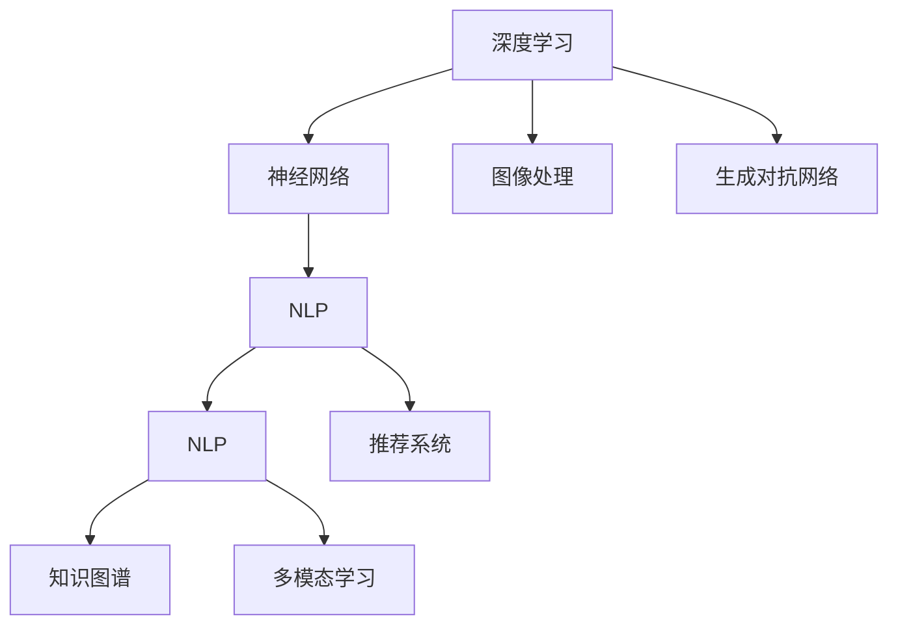

                 

# 李开复：AI 2.0 时代的文化价值

## 1. 背景介绍

### 1.1 问题由来
当前，人工智能(AI)已经进入了一个新的阶段——AI 2.0时代。不同于传统的AI1.0（符号主义和统计学派），AI 2.0（深度学习为主）已经展现出惊人的学习和适应能力。李开复博士认为，AI 2.0时代，AI技术已经从简单的模式识别、图像识别和自然语言处理（NLP）扩展到更复杂的任务，如图像生成、音乐创作、创作式写作和动态游戏设计等。这些新应用不仅仅在技术上取得了突破，还深刻地影响了人类的文化价值和思维方式。

### 1.2 问题核心关键点
李开复博士指出，AI 2.0时代的核心关键点在于：

- **技术进步**：深度学习、神经网络等技术的突破，使得AI系统能够处理更复杂、更抽象的任务。
- **数据丰富**：大规模数据的收集和处理能力，为AI提供了丰富的训练材料。
- **计算资源**：高性能计算设备的普及，使得复杂的AI模型训练成为可能。
- **社会影响**：AI的应用从科研领域拓展到产业和日常生活，对社会产生了广泛而深远的影响。

## 2. 核心概念与联系

### 2.1 核心概念概述

在AI 2.0时代，核心概念包括深度学习、神经网络、自然语言处理、生成对抗网络（GANs）、知识图谱等。这些技术通过相互结合，推动了AI在各个领域的应用。以下，我们通过Mermaid流程图来展示这些核心概念之间的联系：



### 2.2 核心概念原理和架构的 Mermaid 流程图

以下是一个简化的神经网络结构图，展示了如何通过多个层次进行特征提取和分类：


## 3. 核心算法原理 & 具体操作步骤

### 3.1 算法原理概述

李开复博士指出，AI 2.0时代的核心算法原理包括：

- **深度学习**：通过多层神经网络，自动学习输入数据的高级表示，适用于复杂的图像识别、语音识别、NLP等任务。
- **卷积神经网络**：利用卷积操作提取图像中的局部特征，适用于图像识别任务。
- **循环神经网络**：通过时间序列数据的学习，适用于语音识别、机器翻译等任务。
- **生成对抗网络**：通过生成器和判别器的对抗训练，生成逼真的图像、音乐、文本等。

### 3.2 算法步骤详解

以下是一个基于深度学习的图像分类任务的详细操作步骤：

1. **数据准备**：收集训练集、验证集和测试集，并进行预处理，如归一化、数据增强等。
2. **模型搭建**：选择合适的深度学习模型（如卷积神经网络），并定义损失函数和优化器。
3. **模型训练**：使用训练集进行前向传播和反向传播，更新模型参数，直至收敛。
4. **模型评估**：使用验证集评估模型性能，调整超参数和模型结构。
5. **模型测试**：使用测试集测试模型性能，输出最终结果。

### 3.3 算法优缺点

AI 2.0时代的算法优点包括：

- **自适应性强**：能够自动学习特征，适用于复杂的任务。
- **效果显著**：在图像识别、语音识别、NLP等任务上取得了显著效果。
- **应用广泛**：应用领域从科研拓展到产业、日常生活。

缺点包括：

- **数据依赖性高**：需要大量高质量的数据进行训练。
- **计算资源需求大**：高性能计算设备是必要的。
- **黑盒模型**：模型的内部机制难以解释。

### 3.4 算法应用领域

AI 2.0时代的算法广泛应用于：

- **计算机视觉**：如图像识别、视频分析、人脸识别等。
- **自然语言处理**：如机器翻译、文本生成、情感分析等。
- **语音识别**：如语音转文本、语音合成、语音指令等。
- **推荐系统**：如电商推荐、音乐推荐、广告推荐等。
- **自动驾驶**：如自动驾驶车辆、智能交通系统等。

## 4. 数学模型和公式 & 详细讲解 & 举例说明

### 4.1 数学模型构建

在深度学习中，常用的模型包括卷积神经网络（CNN）、循环神经网络（RNN）和生成对抗网络（GANs）。以卷积神经网络为例，其数学模型可以表示为：

$$
f(x) = W^{(1)}x + b^{(1)}
$$

$$
h_i = \sigma(W^{(2)}x_i + b^{(2)})
$$

$$
f(x) = \sum_{i=1}^m h_i \cdot \sigma(W^{(3)}h_i + b^{(3)})
$$

其中，$f(x)$表示输入$x$的输出，$W^{(i)}$和$b^{(i)}$为第$i$层的权重和偏置项，$\sigma$为激活函数。

### 4.2 公式推导过程

以卷积神经网络为例，其推导过程包括：

1. **输入层**：将输入数据$x$进行展平，形成二维矩阵。
2. **卷积层**：通过卷积操作提取局部特征，生成新的特征图。
3. **池化层**：对特征图进行下采样，减少计算量。
4. **全连接层**：将特征图连接成向量，进行分类。

### 4.3 案例分析与讲解

假设我们有一张手写数字图像，输入为$x$，输出为$y$，模型为$f(x)$。我们可以使用CNN模型进行训练，得到$y=f(x)$的映射关系。在训练过程中，通过反向传播算法，不断调整权重和偏置项，使得$f(x)$逼近$y$。

## 5. 项目实践：代码实例和详细解释说明

### 5.1 开发环境搭建

以下是在Python中使用Keras框架搭建卷积神经网络的步骤：

1. **安装Keras**：
   ```bash
   pip install keras
   ```

2. **导入库**：
   ```python
   import keras
   from keras.models import Sequential
   from keras.layers import Conv2D, MaxPooling2D, Flatten, Dense
   ```

3. **准备数据**：
   ```python
   from keras.datasets import mnist
   (x_train, y_train), (x_test, y_test) = mnist.load_data()
   x_train = x_train.reshape(60000, 28, 28, 1)
   x_test = x_test.reshape(10000, 28, 28, 1)
   x_train = x_train.astype('float32') / 255
   x_test = x_test.astype('float32') / 255
   y_train = keras.utils.to_categorical(y_train, 10)
   y_test = keras.utils.to_categorical(y_test, 10)
   ```

### 5.2 源代码详细实现

```python
model = Sequential()
model.add(Conv2D(32, kernel_size=(3, 3), activation='relu', input_shape=(28, 28, 1)))
model.add(MaxPooling2D(pool_size=(2, 2)))
model.add(Flatten())
model.add(Dense(128, activation='relu'))
model.add(Dense(10, activation='softmax'))

model.compile(optimizer='adam', loss='categorical_crossentropy', metrics=['accuracy'])
model.fit(x_train, y_train, epochs=10, batch_size=128, validation_data=(x_test, y_test))
```

### 5.3 代码解读与分析

在上述代码中，我们首先定义了一个包含两个卷积层和两个全连接层的CNN模型。然后，我们使用`compile`方法定义优化器和损失函数，最后通过`fit`方法进行模型训练。在训练过程中，我们使用`validation_data`参数指定验证集，以监控模型在训练集和验证集上的性能。

### 5.4 运行结果展示

训练完成后，我们可以使用`evaluate`方法评估模型在测试集上的性能：

```python
test_loss, test_acc = model.evaluate(x_test, y_test)
print('Test accuracy:', test_acc)
```

## 6. 实际应用场景

### 6.1 智能医疗

AI 2.0时代，智能医疗的应用包括疾病诊断、影像分析、个性化治疗等。李开复博士指出，AI技术可以处理海量的医疗数据，识别异常模式，提供准确的诊断和治疗建议。例如，IBM Watson Health利用深度学习技术，结合电子病历、基因数据等，辅助医生进行疾病诊断和治疗决策。

### 6.2 自动驾驶

自动驾驶是AI 2.0时代的重要应用之一。AI技术可以通过传感器数据和图像处理技术，实现环境感知和路径规划。例如，特斯拉Autopilot系统利用卷积神经网络对图像数据进行处理，识别道路标志、车辆、行人等目标，从而进行自动驾驶。

### 6.3 智能制造

AI 2.0时代，智能制造的应用包括预测性维护、质量控制、生产优化等。AI技术可以通过分析设备数据和传感器数据，预测设备故障，优化生产流程，提高生产效率。例如，西门子利用深度学习技术，对设备数据进行实时监控，预测设备故障，减少停机时间。

### 6.4 未来应用展望

未来，AI 2.0技术将在更多领域得到应用，为社会带来更深远的影响。例如：

- **教育**：利用AI技术进行个性化学习、智能辅导、作业批改等，提高教育效率和质量。
- **娱乐**：利用AI技术进行游戏设计、虚拟现实、音乐创作等，丰富娱乐体验。
- **金融**：利用AI技术进行风险控制、自动化交易、智能投顾等，提升金融服务质量。
- **农业**：利用AI技术进行智能农业管理、灾害预警、精准农业等，提高农业生产效率。

## 7. 工具和资源推荐

### 7.1 学习资源推荐

为了帮助开发者系统掌握AI 2.0技术的理论基础和实践技巧，以下推荐一些优质的学习资源：

1. **李开复《人工智能：一种现代的方法》**：详细介绍了AI技术的发展历程和基本原理，是AI领域的重要入门书籍。
2. **吴恩达《深度学习》课程**：由Coursera推出，涵盖了深度学习的基础和应用，是AI学习的经典课程。
3. **Kaggle**：提供了大量数据集和竞赛平台，可以帮助开发者实践AI技术，提升实战能力。
4. **GitHub**：提供了丰富的开源代码和项目，可以帮助开发者学习和借鉴优秀的实践经验。

### 7.2 开发工具推荐

以下是几款用于AI 2.0技术开发的常用工具：

1. **PyTorch**：基于Python的开源深度学习框架，适合研究和生产部署。
2. **TensorFlow**：由Google主导的深度学习框架，支持分布式训练和高效部署。
3. **Keras**：高级神经网络API，易于上手，适合快速原型设计和模型测试。
4. **Jupyter Notebook**：支持代码编写和数据可视化，是数据科学家的常用工具。

### 7.3 相关论文推荐

AI 2.0技术的发展源于学界的持续研究。以下是几篇奠基性的相关论文，推荐阅读：

1. **《ImageNet Classification with Deep Convolutional Neural Networks》**：提出卷积神经网络，是图像识别领域的里程碑论文。
2. **《Learning Phrase Representations using RNN Encoder–Decoder for Statistical Machine Translation》**：提出循环神经网络，推动了自然语言处理的进展。
3. **《Generative Adversarial Nets》**：提出生成对抗网络，开启了生成模型的新方向。
4. **《Attention Is All You Need》**：提出Transformer模型，推动了自然语言处理的发展。

## 8. 总结：未来发展趋势与挑战

### 8.1 总结

本文对AI 2.0时代的核心概念和应用进行了系统介绍。AI 2.0技术已经从科研领域拓展到各个行业，展现了强大的应用潜力。李开复博士指出，AI 2.0时代的文化价值在于其对人类生活方式和思维方式的影响。未来，AI 2.0技术将继续推动社会的进步和变革。

### 8.2 未来发展趋势

展望未来，AI 2.0技术将呈现以下几个发展趋势：

1. **模型复杂性增加**：随着深度学习模型的不断发展，模型复杂性将进一步提升，能够处理更复杂、更抽象的任务。
2. **跨领域应用拓展**：AI技术将跨界应用于更多领域，如医疗、金融、制造、农业等。
3. **人机协同增强**：AI技术与人类协同工作，实现更高效、更智能的决策和操作。
4. **社会伦理挑战**：AI技术在带来便利的同时，也带来了隐私、安全、伦理等挑战，需要社会各界共同面对。

### 8.3 面临的挑战

尽管AI 2.0技术取得了巨大的进展，但在迈向更广泛应用的过程中，仍然面临以下挑战：

1. **数据隐私和安全**：如何保护数据隐私和安全，避免数据泄露和滥用。
2. **模型透明性和可解释性**：如何使AI模型更加透明，便于理解和解释。
3. **伦理和社会影响**：如何确保AI技术的使用符合伦理规范，避免对社会造成负面影响。
4. **资源消耗**：如何降低AI技术在计算、存储和能耗方面的消耗。
5. **多模态融合**：如何实现不同模态数据（如视觉、语音、文本）的融合，提高AI系统的综合能力。

### 8.4 研究展望

未来，AI 2.0技术需要在以下几个方面进行深入研究：

1. **多模态融合**：研究如何实现多模态数据的融合和协同，提高AI系统的综合能力。
2. **知识图谱**：研究如何利用知识图谱等知识表示技术，提高AI系统的智能水平。
3. **模型透明性和可解释性**：研究如何使AI模型更加透明，便于理解和解释。
4. **社会伦理**：研究如何确保AI技术的使用符合伦理规范，避免对社会造成负面影响。

## 9. 附录：常见问题与解答

**Q1：AI 2.0技术的优势和劣势有哪些？**

A: AI 2.0技术的优势包括：

- **处理复杂任务**：能够处理更复杂、更抽象的任务。
- **应用广泛**：应用领域从科研拓展到产业、日常生活。

劣势包括：

- **数据依赖性高**：需要大量高质量的数据进行训练。
- **计算资源需求大**：高性能计算设备是必要的。
- **黑盒模型**：模型的内部机制难以解释。

**Q2：如何保护AI数据隐私和安全？**

A: 保护AI数据隐私和安全需要采取以下措施：

- **数据匿名化**：通过数据匿名化技术，避免数据泄露。
- **加密传输**：通过加密传输技术，保护数据传输过程中的安全性。
- **访问控制**：通过访问控制技术，限制数据访问权限，避免数据滥用。

**Q3：如何提高AI模型的透明性和可解释性？**

A: 提高AI模型的透明性和可解释性需要采取以下措施：

- **模型可视化**：通过模型可视化技术，直观展示模型结构和特征。
- **特征重要性分析**：通过特征重要性分析技术，解释模型的决策依据。
- **规则提取**：通过规则提取技术，将模型规则转换为易于理解的规则。

**Q4：如何实现多模态数据的融合？**

A: 实现多模态数据的融合需要采取以下措施：

- **特征提取**：对不同模态数据进行特征提取，提取共性特征。
- **融合方法**：采用融合方法，如特征拼接、注意力机制等，将不同模态数据融合为一个整体。
- **协同学习**：采用协同学习方法，训练多模态数据联合模型，提高融合效果。

**Q5：AI技术在社会中的应用前景如何？**

A: AI技术在社会中的应用前景广阔：

- **医疗**：辅助诊断、治疗决策等。
- **金融**：风险控制、自动化交易、智能投顾等。
- **制造**：预测性维护、质量控制、生产优化等。
- **农业**：智能农业管理、灾害预警、精准农业等。

---

作者：禅与计算机程序设计艺术 / Zen and the Art of Computer Programming

