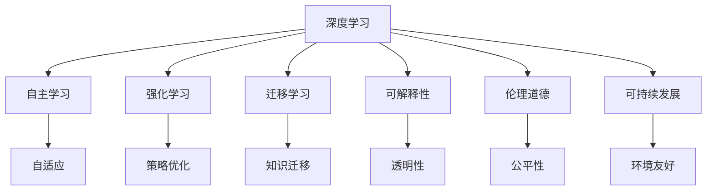

                 

# 李开复：AI 2.0 时代的未来展望

> 关键词：人工智能, AI 2.0, 未来展望, 技术趋势, 深度学习, 计算机视觉, 自然语言处理, 可解释性, 伦理道德, 可持续发展

## 1. 背景介绍

### 1.1 问题由来
AI 2.0 时代的到来，标志着人工智能技术进入了新的发展阶段。这一阶段以深度学习和自主学习的全面突破为特征，AI 开始从具体的任务和应用场景中解放出来，具备了更强的自主学习能力和泛化能力。这种技术进步不仅在学术界引起了广泛关注，也在产业界引发了热烈的讨论和应用。

AI 2.0 时代的核心是深度学习和大数据技术的结合，这种结合使得机器能够从海量数据中提取有价值的信息，从而实现对复杂问题的有效处理。从图像识别、语音识别、自然语言处理到自动驾驶、机器人、医疗诊断等诸多领域，AI 2.0 技术的应用已经渗透到了人类生活的方方面面。

### 1.2 问题核心关键点
AI 2.0 时代的主要特点包括：
1. **深度学习的大规模应用**：深度学习技术使得机器可以从大量数据中自动学习到复杂的特征表示，极大地提升了计算效率和处理能力。
2. **自主学习能力的增强**：AI 2.0 技术不仅能够处理已有数据，还能够通过强化学习、迁移学习等手段，自主学习和适应新数据和新场景。
3. **跨领域应用的广泛性**：AI 2.0 技术已经从最初的图像和语音识别扩展到自然语言处理、机器人控制、医疗诊断等多个领域，展现出强大的跨领域应用能力。
4. **对伦理和道德的重视**：AI 2.0 技术的发展促使人们重新审视其对伦理道德的影响，如何在保证技术进步的同时，确保技术的公正、透明和可信，成为了一个重要议题。

## 2. 核心概念与联系

### 2.1 核心概念概述

为了更好地理解 AI 2.0 时代的技术发展，我们需要掌握一些关键概念：

- **深度学习(Deep Learning)**：一种通过多层神经网络模型来模拟人脑处理复杂数据的技术。
- **自主学习(Autonomous Learning)**：指机器能够自主地从环境中学习和适应，无需人类干预。
- **强化学习(Reinforcement Learning)**：一种通过与环境互动来学习最优策略的技术。
- **迁移学习(Transfer Learning)**：一种将一个领域学到的知识应用到另一个相关领域的技术。
- **可解释性(Explainability)**：指机器学习模型的决策过程能够被理解和解释，以增强其可信度。
- **伦理道德(Ethics and Morality)**：指在应用 AI 技术时，需要考虑其对社会、环境和个人的影响，确保技术的使用符合道德规范。
- **可持续发展(Sustainable Development)**：指 AI 技术的应用应该促进社会的可持续发展，而不是加剧不平等和社会分裂。

这些概念之间的关系可以通过以下 Mermaid 流程图来展示：



这个流程图展示了大语言模型的工作原理和优化方向：

1. 深度学习提供基本的特征提取能力。
2. 自主学习使得模型能够从数据中自主学习和适应。
3. 强化学习通过与环境的互动，优化模型的决策策略。
4. 迁移学习促进了模型在不同领域之间的知识迁移。
5. 可解释性增强了模型的可信度和透明度。
6. 伦理道德确保技术的应用符合道德规范。
7. 可持续发展促进了社会的整体进步。

## 3. 核心算法原理 & 具体操作步骤

### 3.1 算法原理概述

AI 2.0 时代的关键算法原理包括：

- **深度神经网络**：通过多层次的非线性变换，能够有效地处理复杂数据结构，如图像、语音和文本。
- **卷积神经网络(CNN)**：特别适用于处理空间数据，如图像和视频。
- **循环神经网络(RNN)**：适用于序列数据的处理，如语音识别和自然语言处理。
- **长短期记忆网络(LSTM)**：一种特殊的 RNN，能够有效处理长期依赖关系。
- **自编码器(Autencoder)**：通过将数据压缩到低维空间，再重构为原始数据，实现数据的降维和特征提取。

### 3.2 算法步骤详解

AI 2.0 技术的具体实现步骤包括：

1. **数据收集与预处理**：
   - 收集与任务相关的数据集。
   - 对数据进行清洗、归一化和标注。
   - 将数据划分为训练集、验证集和测试集。

2. **模型设计**：
   - 选择合适的深度学习模型架构，如 CNN、RNN、LSTM 等。
   - 确定模型参数和超参数，如学习率、批次大小、优化器等。

3. **模型训练**：
   - 使用训练集对模型进行前向传播和反向传播。
   - 更新模型参数，最小化损失函数。
   - 在验证集上评估模型性能，避免过拟合。

4. **模型评估与部署**：
   - 在测试集上评估模型的最终性能。
   - 部署模型到生产环境，进行实时应用。
   - 持续监测模型性能，定期重新训练。

### 3.3 算法优缺点

AI 2.0 技术的优势包括：

- **高效性**：深度学习模型能够在较短时间内处理大量数据。
- **泛化能力**：通过大规模数据训练，AI 2.0 技术能够处理多种类型的数据和任务。
- **可扩展性**：能够轻松扩展到多个设备和平台，实现分布式计算。

其缺点包括：

- **计算资源需求高**：需要高性能的计算设备，如 GPU 和 TPU。
- **模型复杂度高**：深度学习模型参数众多，难以解释。
- **数据依赖性强**：模型性能高度依赖于训练数据的数量和质量。
- **伦理道德风险**：AI 2.0 技术可能引发隐私、偏见和歧视等问题。

### 3.4 算法应用领域

AI 2.0 技术已经在多个领域得到了广泛应用，例如：

- **计算机视觉**：图像识别、目标检测、图像生成、图像增强等。
- **自然语言处理(NLP)**：机器翻译、文本分类、情感分析、问答系统等。
- **语音识别**：语音识别、语音合成、语音翻译等。
- **机器人**：机器人控制、路径规划、环境感知等。
- **医疗**：医学影像分析、疾病诊断、个性化医疗等。
- **自动驾驶**：目标检测、路径规划、障碍物识别等。

## 4. 数学模型和公式 & 详细讲解 & 举例说明

### 4.1 数学模型构建

AI 2.0 技术的数学模型通常基于深度学习框架，包括卷积神经网络(CNN)、循环神经网络(RNN)、长短期记忆网络(LSTM)等。以卷积神经网络为例，其数学模型可以表示为：

$$
f(x)=W_n\sigma(W_{n-1}\sigma(\cdots\sigma(W_1x+b_1)\cdots+b_{n-1}))
$$

其中，$W_i$ 表示权重矩阵，$b_i$ 表示偏置向量，$\sigma$ 表示激活函数。

### 4.2 公式推导过程

以卷积神经网络为例，其训练过程可以表示为：

1. 前向传播：
$$
h_1 = W_1x+b_1
$$
$$
h_2 = \sigma(h_1)
$$
$$
h_3 = W_2h_2+b_2
$$
$$
h_4 = \sigma(h_3)
$$
$$
\cdots
$$
$$
y = W_nh_{n-1}+b_n
$$

2. 反向传播：
$$
\frac{\partial L}{\partial W_n} = \frac{\partial L}{\partial y}\frac{\partial y}{\partial h_{n-1}}\frac{\partial h_{n-1}}{\partial W_n}
$$
$$
\frac{\partial L}{\partial b_n} = \frac{\partial L}{\partial y}
$$
$$
\frac{\partial L}{\partial W_{n-1}} = \frac{\partial L}{\partial h_{n-1}}\frac{\partial h_{n-1}}{\partial W_{n-1}}
$$
$$
\frac{\partial L}{\partial b_{n-1}} = \frac{\partial L}{\partial h_{n-1}}
$$
$$
\cdots
$$

通过上述公式，可以计算出损失函数对每个参数的梯度，并用于更新模型参数。

### 4.3 案例分析与讲解

以图像分类任务为例，假设训练集为 MNIST 手写数字数据集，其标签为 0-9 的整数。模型设计为卷积神经网络，包含两个卷积层和两个池化层，最后一层为全连接层。训练过程中，使用交叉熵损失函数，学习率为 0.001，批次大小为 64。

训练过程中，首先进行前向传播，计算输出结果。然后计算损失函数对每个参数的梯度，并使用反向传播更新模型参数。重复以上过程，直至损失函数收敛。

## 5. 项目实践：代码实例和详细解释说明

### 5.1 开发环境搭建

AI 2.0 技术的开发通常使用 Python 语言和深度学习框架，如 TensorFlow、PyTorch 和 Keras。以下是在 TensorFlow 下进行图像分类任务开发的环境配置：

1. 安装 TensorFlow：
```
pip install tensorflow
```

2. 安装 Keras：
```
pip install keras
```

3. 安装其他依赖库：
```
pip install numpy matplotlib scikit-learn
```

4. 创建虚拟环境：
```
python3 -m venv tf_venv
source tf_venv/bin/activate
```

### 5.2 源代码详细实现

以下是在 TensorFlow 下实现图像分类任务的代码示例：

```python
import tensorflow as tf
from tensorflow.keras import layers, models

# 加载 MNIST 数据集
(x_train, y_train), (x_test, y_test) = tf.keras.datasets.mnist.load_data()

# 数据预处理
x_train = x_train.reshape(-1, 28, 28, 1).astype('float32') / 255.0
x_test = x_test.reshape(-1, 28, 28, 1).astype('float32') / 255.0

# 构建卷积神经网络模型
model = models.Sequential()
model.add(layers.Conv2D(32, (3, 3), activation='relu', input_shape=(28, 28, 1)))
model.add(layers.MaxPooling2D((2, 2)))
model.add(layers.Conv2D(64, (3, 3), activation='relu'))
model.add(layers.MaxPooling2D((2, 2)))
model.add(layers.Flatten())
model.add(layers.Dense(64, activation='relu'))
model.add(layers.Dense(10, activation='softmax'))

# 编译模型
model.compile(optimizer='adam',
              loss='sparse_categorical_crossentropy',
              metrics=['accuracy'])

# 训练模型
model.fit(x_train, y_train, epochs=5, validation_data=(x_test, y_test))

# 评估模型
model.evaluate(x_test, y_test)
```

### 5.3 代码解读与分析

上述代码中，首先加载 MNIST 数据集，并进行数据预处理。然后构建卷积神经网络模型，使用 Keras API 进行模型定义和编译。在模型训练过程中，使用 Adam 优化器进行参数更新，交叉熵损失函数进行损失计算，并记录训练过程中的精度。

在训练完成后，使用测试集评估模型性能，输出模型的损失函数和精度。

## 6. 实际应用场景

### 6.1 智能医疗

AI 2.0 技术在智能医疗中的应用前景广阔。例如，通过卷积神经网络对医学影像进行分类和分析，可以实现早期癌症筛查、病变定位和分割等。此外，自然语言处理技术可以用于病历分析和医学文献的自动摘要，提高医生的工作效率和诊断准确性。

### 6.2 金融风险管理

AI 2.0 技术在金融领域的应用可以显著提升风险管理的效率和准确性。例如，通过深度学习模型对金融数据进行分析和预测，可以及时发现潜在的市场风险和异常交易行为，提高金融机构的安全性和稳健性。

### 6.3 智能制造

AI 2.0 技术在智能制造中的应用可以提升生产效率和质量。例如，通过深度学习模型对生产数据进行分析和预测，可以实现设备故障预测、质量控制和生产优化，降低生产成本和提高生产效率。

### 6.4 未来应用展望

随着 AI 2.0 技术的不断发展和应用，未来的前景广阔。例如，AI 2.0 技术将进一步应用于智能交通、智慧城市、环境保护等领域，为人类社会带来更加智能化和可持续发展的未来。

## 7. 工具和资源推荐

### 7.1 学习资源推荐

1. **《深度学习》(Deep Learning)** 书籍：Ian Goodfellow 等著，全面介绍了深度学习的原理和应用。
2. **Coursera 深度学习课程**：由 Andrew Ng 开设，涵盖深度学习的各个方面，包括卷积神经网络、循环神经网络等。
3. **Kaggle 数据科学竞赛**：通过参与比赛，学习深度学习的实际应用和数据处理技巧。
4. **GitHub 开源项目**：通过阅读和参与开源项目，学习深度学习的工程实现和部署技巧。

### 7.2 开发工具推荐

1. **TensorFlow**：由 Google 开发的深度学习框架，支持分布式计算和 GPU 加速。
2. **PyTorch**：由 Facebook 开发的深度学习框架，易于使用，支持动态图。
3. **Keras**：基于 TensorFlow 和 Theano 开发的深度学习库，易于上手，适合初学者。
4. **Jupyter Notebook**：开源的交互式编程环境，适合进行数据分析和机器学习实验。

### 7.3 相关论文推荐

1. **ImageNet Classification with Deep Convolutional Neural Networks**：Alex Krizhevsky 等著，介绍了卷积神经网络在图像分类中的应用。
2. **Learning to Communicate**：Jürgen Schmidhuber 等著，介绍了机器人控制和语言生成等领域的 AI 2.0 技术。
3. **Long Short-Term Memory**：Sak et al. 著，介绍了长短期记忆网络在序列数据处理中的应用。
4. **A Survey on Attention Models in Natural Language Processing**：John B. Wiemann 等著，介绍了注意力机制在自然语言处理中的应用。

## 8. 总结：未来发展趋势与挑战

### 8.1 总结

AI 2.0 技术的发展正在深刻改变着人类的生产和生活方式。从深度学习的突破到自主学习能力的增强，AI 2.0 技术正在逐步实现从任务驱动到自主探索的转变，展现出强大的应用潜力。

### 8.2 未来发展趋势

未来 AI 2.0 技术的发展趋势包括：

1. **模型规模的不断增大**：随着计算能力的提升和数据量的增加，深度学习模型的规模将不断增大，处理能力将进一步提升。
2. **跨领域应用的拓展**：AI 2.0 技术将进一步扩展到更多领域，如智能交通、智慧城市、环境保护等，带来更加广泛的应用。
3. **伦理道德的重视**：随着 AI 技术的广泛应用，伦理道德问题将受到更多关注，AI 技术的应用需要符合伦理规范。
4. **可持续发展**：AI 技术的应用将促进社会的可持续发展，减少资源浪费和环境污染。
5. **可解释性增强**：AI 2.0 技术将更加注重模型的可解释性，增强模型的透明性和可信度。

### 8.3 面临的挑战

AI 2.0 技术在发展过程中也面临着诸多挑战：

1. **计算资源的需求**：深度学习模型的训练和推理需要高性能计算资源，如 GPU 和 TPU，这将带来高昂的硬件成本。
2. **数据依赖性强**：AI 2.0 技术对数据质量和数量的依赖性较强，获取高质量数据成本较高。
3. **伦理道德问题**：AI 2.0 技术可能引发隐私、偏见和歧视等问题，需要制定相关法律法规进行规范。
4. **可解释性不足**：深度学习模型通常被视为"黑盒"系统，难以解释其内部工作机制。
5. **公平性和安全性**：AI 2.0 技术的应用需要考虑其对社会公平和安全的影响，确保技术的安全性和公正性。

### 8.4 研究展望

未来 AI 2.0 技术的研究方向包括：

1. **无监督学习和半监督学习**：减少对标注数据的依赖，提高 AI 技术在非结构化数据上的应用能力。
2. **可解释性增强**：提高 AI 技术的可解释性和透明性，增强其可信度。
3. **跨领域知识融合**：将不同领域的知识融合到 AI 模型中，提高模型的泛化能力和适应性。
4. **伦理道德规范**：制定相关法律法规和伦理准则，规范 AI 技术的应用。
5. **可持续发展目标**：将 AI 技术应用于促进社会可持续发展，减少资源浪费和环境污染。

## 9. 附录：常见问题与解答

**Q1：AI 2.0 技术是否会对传统行业产生冲击？**

A: AI 2.0 技术将在多个领域产生深远影响，如金融、医疗、制造等。虽然AI 2.0 技术的应用可能会对部分传统行业产生冲击，但同时也会带来效率提升和成本降低，推动行业升级和转型。

**Q2：AI 2.0 技术的开发和部署需要哪些资源？**

A: AI 2.0 技术的开发和部署需要高性能计算资源，如 GPU 和 TPU。同时，还需要高质量的数据集和强大的算法框架，如 TensorFlow 和 PyTorch。

**Q3：AI 2.0 技术的伦理道德问题如何处理？**

A: AI 2.0 技术的伦理道德问题需要从多个方面进行处理，包括数据隐私保护、算法透明性、公平性等。需要在技术开发和应用过程中，制定相关法律法规和伦理准则。

**Q4：AI 2.0 技术的未来发展方向是什么？**

A: AI 2.0 技术的未来发展方向包括无监督学习、跨领域知识融合、伦理道德规范、可持续发展目标等。未来的研究将更加注重提高技术的可解释性和透明性，确保其应用的公平性和安全性。

**Q5：AI 2.0 技术在实际应用中需要注意哪些问题？**

A: AI 2.0 技术在实际应用中需要注意的问题包括数据质量、计算资源、伦理道德、安全性和公平性等。需要在技术开发和应用过程中，制定相关法律法规和伦理准则，确保技术的公正性和可信性。

---

作者：禅与计算机程序设计艺术 / Zen and the Art of Computer Programming

