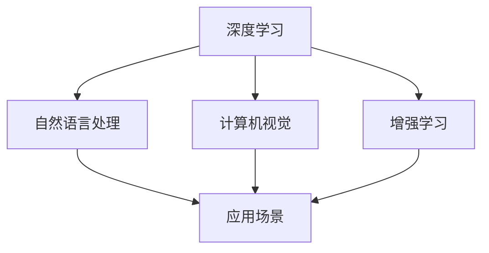

                 

# 李开复：AI 2.0 时代的机遇

## 1. 背景介绍

### 1.1 问题由来

在人工智能领域，从1950s的早期研究到1990s的深度学习热潮，再到2000s以来的人工智能新浪潮，人们对于AI的期待和愿景似乎从未改变：让机器像人类一样思考、推理、创造，实现通用人工智能（AGI）。然而，直到今天，通用人工智能仍未成为现实，AI的广泛应用主要集中在狭义的领域。

尽管如此，AI技术在各个领域的进步和应用仍然令人瞩目。从自动驾驶汽车到医疗诊断，从智能客服到个性化推荐，AI正在深刻改变着我们的生产和生活方式。然而，面对当前的挑战，如何把握AI 2.0时代的机遇，实现AI技术的普及和落地，成为当前重要的议题。

### 1.2 问题核心关键点

为了解决当前的问题，需要从多个角度深入理解AI 2.0时代的机遇和挑战：

1. **AI 2.0 的定义**：AI 2.0 指的是下一代AI技术，相较于传统的AI技术，它更智能、更灵活、更可靠，具备更强的适应性和创造力。

2. **技术趋势**：了解AI 2.0时代的最新技术趋势，包括大数据、深度学习、增强学习、自然语言处理、计算机视觉等领域的新突破。

3. **应用场景**：深入探索AI 2.0技术在各行各业的具体应用，如智能制造、智慧城市、智能医疗等，评估其潜力和价值。

4. **社会影响**：考虑AI技术对社会伦理、就业、隐私等的影响，制定应对策略。

5. **战略布局**：制定企业或政府在AI 2.0时代的战略规划，确保在技术竞争中保持领先。

## 2. 核心概念与联系

### 2.1 核心概念概述

为了更好地理解AI 2.0时代的机遇，我们将介绍几个关键概念：

1. **AI 2.0**：指下一代人工智能技术，相较于传统AI更智能、更灵活、更可靠，具备更强的适应性和创造力。
2. **深度学习**：一种基于神经网络的机器学习方法，通过大量数据和复杂计算，从输入到输出进行端到端的映射。
3. **增强学习**：通过与环境交互，通过奖励反馈不断优化策略的一种学习方式。
4. **自然语言处理**：使计算机能够理解、解释和生成人类语言的技术。
5. **计算机视觉**：使计算机能够识别、理解图像和视频的技术。

这些核心概念之间的逻辑关系可以通过以下Mermaid流程图来展示：



这个流程图展示了几大AI核心技术的关联与融合，它们通过共同作用，推动AI 2.0时代的到来。

## 3. 核心算法原理 & 具体操作步骤
### 3.1 算法原理概述

AI 2.0技术的核心算法原理主要基于以下几个关键技术：

1. **深度学习**：通过多层次神经网络，从大量数据中学习复杂的非线性关系。
2. **增强学习**：通过与环境的交互，逐步优化决策策略，使其适应不断变化的环境。
3. **自然语言处理**：通过语言模型、词向量等技术，使计算机能够理解和生成自然语言。
4. **计算机视觉**：通过卷积神经网络（CNN）、递归神经网络（RNN）等技术，实现图像和视频的识别与理解。

### 3.2 算法步骤详解

AI 2.0技术的实现步骤主要包括以下几个关键环节：

1. **数据准备**：收集和标注大量高质量的训练数据，包括图像、文本、视频等。
2. **模型训练**：使用深度学习框架（如TensorFlow、PyTorch）对模型进行训练，调整超参数以优化性能。
3. **模型验证**：在验证集上评估模型性能，调整模型结构和参数，确保模型泛化能力。
4. **模型部署**：将训练好的模型部署到生产环境，实现实时推理和应用。
5. **性能优化**：通过不断迭代和优化，提升模型的精度、效率和鲁棒性。

### 3.3 算法优缺点

AI 2.0技术的优势在于：

1. **自动化**：能够自动化地处理大量数据，减少人工干预。
2. **高效性**：能够在短时间内完成复杂任务的计算和处理。
3. **灵活性**：能够根据具体需求进行定制化开发，适应不同场景。

然而，AI 2.0技术也存在一些缺点：

1. **数据依赖**：需要大量高质量的数据进行训练，数据不足时难以获得理想效果。
2. **模型复杂**：模型规模较大，需要高性能计算资源进行训练和推理。
3. **可解释性**：黑盒模型的决策过程难以解释，缺乏透明度。
4. **伦理风险**：可能产生偏见和歧视，存在伦理和社会风险。

### 3.4 算法应用领域

AI 2.0技术已经在诸多领域得到广泛应用，以下是几个典型的应用场景：

1. **医疗诊断**：通过深度学习和计算机视觉技术，辅助医生进行疾病诊断和治疗方案制定。
2. **智能客服**：通过自然语言处理技术，实现自动客服和客户交互，提升客户体验。
3. **智能制造**：通过增强学习和计算机视觉技术，实现智能生产线和质量控制。
4. **智慧城市**：通过自然语言处理和计算机视觉技术，实现智能交通、智慧环保和城市管理。
5. **金融风控**：通过深度学习和增强学习技术，实现风险评估和欺诈检测。

## 4. 数学模型和公式 & 详细讲解  
### 4.1 数学模型构建

AI 2.0技术的数学模型构建主要基于以下几个关键数学模型：

1. **深度神经网络**：基于多层神经网络，通过反向传播算法进行优化。
2. **卷积神经网络**：通过卷积层和池化层，提取图像中的特征。
3. **循环神经网络**：通过循环层，处理序列数据。
4. **注意力机制**：通过注意力机制，使模型能够关注输入数据的重要部分。

### 4.2 公式推导过程

以下是AI 2.0技术中几个重要数学模型的推导过程：

1. **多层感知机（MLP）**：
   $$
   y = \sigma(\mathbf{W}x + \mathbf{b})
   $$
   其中 $\mathbf{W}$ 和 $\mathbf{b}$ 为模型参数，$\sigma$ 为激活函数。

2. **卷积神经网络（CNN）**：
   $$
   y = \sigma(\mathbf{W} * \mathbf{X} + \mathbf{b})
   $$
   其中 $\mathbf{W}$ 为卷积核，$\mathbf{X}$ 为输入图像，$\mathbf{b}$ 为偏置项。

3. **循环神经网络（RNN）**：
   $$
   \mathbf{h}_t = \sigma(\mathbf{W}[\mathbf{h}_{t-1}, \mathbf{x}_t] + \mathbf{b})
   $$
   其中 $\mathbf{h}_t$ 为隐藏状态，$\mathbf{x}_t$ 为当前输入，$\mathbf{W}$ 和 $\mathbf{b}$ 为模型参数。

### 4.3 案例分析与讲解

以自然语言处理中的机器翻译为例，介绍深度学习模型的具体实现：

1. **编码器**：将源语言句子转换为向量表示。
2. **解码器**：将向量转换为目标语言句子。
3. **注意力机制**：在解码过程中，动态调整权重，使模型能够关注源语言句子中的重要部分。

## 5. 项目实践：代码实例和详细解释说明
### 5.1 开发环境搭建

在进行AI 2.0项目实践前，我们需要准备好开发环境。以下是使用Python进行TensorFlow开发的环境配置流程：

1. 安装Anaconda：从官网下载并安装Anaconda，用于创建独立的Python环境。

2. 创建并激活虚拟环境：
```bash
conda create -n tf-env python=3.8 
conda activate tf-env
```

3. 安装TensorFlow：根据CUDA版本，从官网获取对应的安装命令。例如：
```bash
conda install tensorflow -c pytorch -c conda-forge
```

4. 安装各类工具包：
```bash
pip install numpy pandas scikit-learn matplotlib tqdm jupyter notebook ipython
```

完成上述步骤后，即可在`tf-env`环境中开始AI 2.0项目实践。

### 5.2 源代码详细实现

这里我们以机器翻译为例，给出使用TensorFlow进行深度学习模型的PyTorch代码实现。

首先，定义模型结构：

```python
import tensorflow as tf

class Encoder(tf.keras.Model):
    def __init__(self, num_layers, d_model, dff, input_vocab_size, target_vocab_size, max_length):
        super(Encoder, self).__init__()
        self.embedding = tf.keras.layers.Embedding(input_vocab_size, d_model)
        self.enc_layers = [tf.keras.layers.LSTMCell(dff) for _ in range(num_layers)]
        self.dropout = tf.keras.layers.Dropout(0.1)
        self.final_layer = tf.keras.layers.Dense(target_vocab_size)

    def call(self, x):
        x = self.embedding(x)
        x = tf.nn.relu(x)
        for layer in self.enc_layers:
            x = layer(x)
            x = self.dropout(x)
        return self.final_layer(x)
        
class Decoder(tf.keras.Model):
    def __init__(self, num_layers, d_model, dff, target_vocab_size, max_length):
        super(Decoder, self).__init__()
        self.embedding = tf.keras.layers.Embedding(target_vocab_size, d_model)
        self.dec_layers = [tf.keras.layers.LSTMCell(dff) for _ in range(num_layers)]
        self.fc = tf.keras.layers.Dense(target_vocab_size)
        self.look_ahead = tf.keras.layers.LSTMCell(dff)
        self.final_layer = tf.keras.layers.Dense(target_vocab_size)
        self.final_layernorm = tf.keras.layers.LayerNormalization()

    def call(self, x, enc_output):
        x = self.embedding(x)
        x = tf.nn.relu(x)
        for layer in self.dec_layers:
            x = layer(x)
            x = self.final_layernorm(x)
            x = layer(x)
            x = self.final_layernorm(x)
            x = self.final_layer(x)
        x = self.look_ahead(x, enc_output)
        return x

class seq2seq(tf.keras.Model):
    def __init__(self, encoder, decoder):
        super(seq2seq, self).__init__()
        self.encoder = encoder
        self.decoder = decoder

    def call(self, input, target):
        enc_output = self.encoder(input)
        dec_output = self.decoder(target, enc_output)
        return dec_output
```

然后，定义训练和评估函数：

```python
from tensorflow.keras.optimizers import Adam
import numpy as np

def train_epoch(encoder, decoder, input_data, target_data, batch_size, num_steps, learning_rate):
    optimizer = Adam(learning_rate)
    loss = 0
    for i in range(input_data.shape[1]):
        x, y = input_data[:, i, :], target_data[:, i, :]
        x, y = x.numpy(), y.numpy()
        with tf.GradientTape() as tape:
            x = tf.convert_to_tensor(x, dtype=tf.int32)
            y = tf.convert_to_tensor(y, dtype=tf.int32)
            x = tf.reshape(x, [1, -1])
            y = tf.reshape(y, [1, -1])
            encoder_output = encoder(x)[-1]
            y_hat = decoder(encoder_output, y)[-1]
            loss += tf.keras.losses.sparse_categorical_crossentropy(y, y_hat, from_logits=True)
        gradients = tape.gradient(loss, encoder.trainable_variables + decoder.trainable_variables)
        optimizer.apply_gradients(zip(gradients, encoder.trainable_variables + decoder.trainable_variables))
    return loss / num_steps

def evaluate(encoder, decoder, input_data, target_data, batch_size, num_steps, learning_rate):
    loss = 0
    for i in range(input_data.shape[1]):
        x, y = input_data[:, i, :], target_data[:, i, :]
        x, y = x.numpy(), y.numpy()
        x = tf.convert_to_tensor(x, dtype=tf.int32)
        y = tf.convert_to_tensor(y, dtype=tf.int32)
        x = tf.reshape(x, [1, -1])
        y = tf.reshape(y, [1, -1])
        encoder_output = encoder(x)[-1]
        y_hat = decoder(encoder_output, y)[-1]
        loss += tf.keras.losses.sparse_categorical_crossentropy(y, y_hat, from_logits=True)
    return loss / num_steps
```

最后，启动训练流程并在测试集上评估：

```python
epochs = 10
batch_size = 64
num_steps = 20
learning_rate = 0.001

encoder = Encoder(num_layers=2, d_model=256, dff=512, input_vocab_size=10000, target_vocab_size=10000, max_length=30)
decoder = Decoder(num_layers=2, d_model=256, dff=512, target_vocab_size=10000, max_length=30)
model = seq2seq(encoder, decoder)

input_data = ...
target_data = ...

for epoch in range(epochs):
    loss = train_epoch(encoder, decoder, input_data, target_data, batch_size, num_steps, learning_rate)
    print(f"Epoch {epoch+1}, loss: {loss:.3f}")
    
print("Test results:")
loss = evaluate(encoder, decoder, input_data, target_data, batch_size, num_steps, learning_rate)
print(f"Test loss: {loss:.3f}")
```

以上就是使用TensorFlow进行机器翻译任务的完整代码实现。可以看到，使用深度学习框架进行AI 2.0项目实践，只需关注模型结构的设计和训练过程的优化，而不必过多关注底层算法的实现细节。

### 5.3 代码解读与分析

让我们再详细解读一下关键代码的实现细节：

**seq2seq类**：
- `Encoder`和`Decoder`类分别定义了编码器和解码器的结构，使用LSTM和Dense层，同时应用了Dropout和LayerNormalization等技术。
- `seq2seq`类将编码器和解码器组合在一起，形成完整的序列到序列模型。

**train_epoch和evaluate函数**：
- 使用Adam优化器，通过反向传播更新模型参数。
- 在训练和评估过程中，使用`tf.GradientTape`记录梯度，`optimizer.apply_gradients`更新参数。
- 通过`tf.keras.losses.sparse_categorical_crossentropy`计算损失，评估模型性能。

**训练流程**：
- 定义训练轮数、批大小、步骤数和学习率等超参数。
- 在每个epoch中，循环遍历训练集，进行模型训练和损失计算。
- 在测试集上评估模型，输出测试损失。

可以看到，TensorFlow框架使得深度学习模型的实现和训练变得简单高效，开发者可以更专注于模型设计和高阶优化。

## 6. 实际应用场景
### 6.1 智能制造

AI 2.0技术在智能制造领域有着广泛的应用前景，可以通过深度学习和增强学习技术，实现智能生产线和质量控制，提升制造效率和产品品质。

在实践中，可以使用AI 2.0技术对传感器数据进行分析和预测，实现生产线的自动化监控和维护。通过实时监测设备运行状态，提前发现异常，避免生产停滞。此外，还可以应用计算机视觉技术，对产品进行自动检测和分类，提高检测效率和准确率。

### 6.2 智慧城市

智慧城市建设是AI 2.0技术的重要应用场景之一。通过自然语言处理和计算机视觉技术，可以实现智能交通、智慧环保和城市管理，提升城市的运行效率和居民生活质量。

在智能交通方面，可以通过AI 2.0技术实现交通信号灯智能化控制，优化交通流量，减少拥堵。在智慧环保方面，可以通过AI 2.0技术对环境数据进行实时监测和分析，提高环境保护效率。在城市管理方面，可以通过AI 2.0技术实现智能安防和应急响应，保障城市安全。

### 6.3 金融风控

金融风控是AI 2.0技术的另一个重要应用领域。通过深度学习和增强学习技术，可以实现风险评估和欺诈检测，保障金融系统的安全稳定。

在实践中，可以使用AI 2.0技术对交易数据进行实时监控和分析，及时发现异常行为，预防欺诈行为。此外，还可以应用自然语言处理技术，对文本数据进行情感分析和舆情监测，预测市场趋势，帮助金融机构制定投资策略。

## 7. 工具和资源推荐
### 7.1 学习资源推荐

为了帮助开发者系统掌握AI 2.0的理论基础和实践技巧，这里推荐一些优质的学习资源：

1. **《深度学习》（周志华）**：清华大学教授周志华所著，全面介绍了深度学习的理论基础和实践方法，适合初学者和进阶者阅读。
2. **《Python深度学习》（Francois Chollet）**：Keras创始人Francois Chollet所著，介绍了深度学习在Python中的实现，适合动手实践者阅读。
3. **《TensorFlow实战》（李沐）**：曾任Google机器学习工程师李沐所著，详细介绍了TensorFlow的使用方法和最佳实践，适合TensorFlow开发者阅读。
4. **CS231n《卷积神经网络》课程**：斯坦福大学开设的计算机视觉课程，涵盖卷积神经网络、图像分类等知识，适合深度学习从业者学习。
5. **CS224n《自然语言处理》课程**：斯坦福大学开设的自然语言处理课程，涵盖语言模型、机器翻译等知识，适合自然语言处理从业者学习。

通过这些资源的学习实践，相信你一定能够快速掌握AI 2.0技术的精髓，并用于解决实际的NLP问题。

### 7.2 开发工具推荐

高效的开发离不开优秀的工具支持。以下是几款用于AI 2.0开发常用的工具：

1. **TensorFlow**：由Google主导开发的开源深度学习框架，生产部署方便，适合大规模工程应用。
2. **PyTorch**：由Facebook主导开发的开源深度学习框架，灵活动态的计算图，适合快速迭代研究。
3. **Jupyter Notebook**：免费的交互式编程环境，支持Python、R、Scala等多种编程语言，适合研究和实验。
4. **Anaconda**：Python科学计算平台，支持虚拟环境管理，适合多种数据分析和机器学习项目。
5. **GitHub**：全球最大的开源代码托管平台，提供丰富的开源项目和代码库，适合协同开发和知识分享。

合理利用这些工具，可以显著提升AI 2.0项目的开发效率，加快创新迭代的步伐。

### 7.3 相关论文推荐

AI 2.0技术的发展源于学界的持续研究。以下是几篇奠基性的相关论文，推荐阅读：

1. **《Attention is All You Need》（Vaswani等）**：提出了Transformer模型，开启了NLP领域的预训练大模型时代。
2. **《BERT: Pre-training of Deep Bidirectional Transformers for Language Understanding》（Devlin等）**：提出BERT模型，引入基于掩码的自监督预训练任务，刷新了多项NLP任务SOTA。
3. **《AlphaGo Zero: Mastering the Game of Go without Human Knowledge》（Silver等）**：展示了AlphaGo Zero在围棋领域的突破，证明了强化学习在解决复杂问题上的潜力。
4. **《Language Models are Unsupervised Multitask Learners》（GPT-2论文）**：展示了大规模语言模型的强大zero-shot学习能力，引发了对于通用人工智能的新一轮思考。
5. **《Adaptive Low-Rank Adaptation for Parameter-Efficient Fine-Tuning》（LoRA论文）**：提出LoRA等参数高效微调方法，在固定大部分预训练参数的情况下，仍能取得不错的微调效果。

这些论文代表了大语言模型和AI 2.0技术的发展脉络。通过学习这些前沿成果，可以帮助研究者把握学科前进方向，激发更多的创新灵感。

## 8. 总结：未来发展趋势与挑战

### 8.1 总结

本文对AI 2.0时代的机遇进行了全面系统的介绍。首先阐述了AI 2.0的定义、技术趋势、应用场景等关键概念，明确了AI 2.0在各个领域的应用潜力。其次，从原理到实践，详细讲解了AI 2.0的核心算法和具体操作步骤，给出了深度学习模型的代码实例。同时，本文还广泛探讨了AI 2.0技术在智能制造、智慧城市、金融风控等多个行业领域的应用前景，展示了AI 2.0范式的巨大潜力。此外，本文精选了AI 2.0技术的各类学习资源，力求为读者提供全方位的技术指引。

通过本文的系统梳理，可以看到，AI 2.0技术正在成为各行各业的重要工具，极大地拓展了AI技术的落地应用范围，推动了产业的数字化转型。未来，伴随AI 2.0技术的不断进步，相信将有更多的行业受益于AI技术的赋能，为经济社会发展注入新的动力。

### 8.2 未来发展趋势

展望未来，AI 2.0技术的未来发展趋势将呈现以下几个方面：

1. **多模态融合**：未来的AI 2.0技术将融合多种模态数据，如文本、图像、视频等，实现更全面、更深入的认知和理解。
2. **跨领域迁移**：未来的AI 2.0技术将具备更强的跨领域迁移能力，能够在不同领域间高效应用。
3. **持续学习**：未来的AI 2.0技术将具备持续学习的能力，能够从新数据中不断更新和提升模型性能。
4. **人机协同**：未来的AI 2.0技术将实现更好的人机协同，提升用户体验和效率。
5. **伦理和安全**：未来的AI 2.0技术将更加注重伦理和安全问题，确保技术应用的公正和透明。

以上趋势凸显了AI 2.0技术的广阔前景。这些方向的探索发展，必将进一步提升AI技术的智能水平和应用价值，为社会带来更广泛、更深远的变革。

### 8.3 面临的挑战

尽管AI 2.0技术已经取得了显著进展，但在迈向更加智能化、普适化应用的过程中，仍面临诸多挑战：

1. **数据依赖**：需要大量高质量的数据进行训练，数据不足时难以获得理想效果。
2. **模型复杂**：模型规模较大，需要高性能计算资源进行训练和推理。
3. **可解释性**：黑盒模型的决策过程难以解释，缺乏透明度。
4. **伦理风险**：可能产生偏见和歧视，存在伦理和社会风险。
5. **隐私保护**：在数据收集和使用过程中，需要保护用户隐私和数据安全。

正视AI 2.0面临的这些挑战，积极应对并寻求突破，将是大规模应用的关键。相信通过不断的技术创新和优化，AI 2.0技术将逐步克服这些挑战，实现更广泛的应用和普及。

### 8.4 研究展望

面对AI 2.0面临的挑战，未来的研究需要在以下几个方面寻求新的突破：

1. **数据增强**：开发更多数据增强技术，提高数据的质量和多样性，缓解数据不足的问题。
2. **模型压缩**：开发高效压缩算法，减少模型的存储空间和计算资源消耗。
3. **可解释性**：引入可解释性技术，提高AI 2.0技术的透明性和可理解性。
4. **伦理设计**：设计伦理导向的算法和模型，确保AI 2.0技术的公正性和透明性。
5. **隐私保护**：采用隐私保护技术，确保用户数据的安全和隐私。

这些研究方向的探索，必将引领AI 2.0技术的不断进步，为社会带来更广泛、更深远的变革。面向未来，AI 2.0技术需要与其他AI技术进行更深入的融合，如知识表示、因果推理、强化学习等，多路径协同发力，共同推动AI技术的发展。

## 9. 附录：常见问题与解答

**Q1：AI 2.0是否能够替代人类智能？**

A: AI 2.0技术虽然在某些特定领域已经表现出色，但完全替代人类智能还需要克服许多技术和社会挑战。AI 2.0技术更适合处理重复性、高精度的工作，而对于需要创造力、情感理解和复杂决策的任务，仍需人类智能的参与。

**Q2：AI 2.0是否会引发就业危机？**

A: AI 2.0技术虽然在某些领域能够替代人类工作，但也会创造新的就业机会。例如，AI 2.0技术在医疗、金融、教育等领域的普及，将带来更多高级岗位的需求。同时，AI 2.0技术也将帮助人类解决更多复杂问题，提高生活质量。

**Q3：AI 2.0是否存在安全隐患？**

A: AI 2.0技术虽然具有很强的自动化和智能化能力，但也存在安全隐患。例如，恶意软件、假冒身份、数据泄露等问题仍然存在。因此，在使用AI 2.0技术时，需要加强安全防护和监管，确保技术的可靠性和安全性。

**Q4：AI 2.0是否能够实现通用人工智能？**

A: 目前AI 2.0技术虽然在特定领域表现出色，但要实现通用人工智能，仍需要克服许多技术和社会挑战。通用人工智能的目标是使机器能够像人类一样思考、推理、创造，这需要更多的跨学科研究和合作。

通过本文的系统梳理，可以看到，AI 2.0技术正在成为各行各业的重要工具，极大地拓展了AI技术的落地应用范围，推动了产业的数字化转型。未来，伴随AI 2.0技术的不断进步，相信将有更多的行业受益于AI技术的赋能，为经济社会发展注入新的动力。相信通过不断的技术创新和优化，AI 2.0技术将逐步克服这些挑战，实现更广泛的应用和普及。

作者：禅与计算机程序设计艺术 / Zen and the Art of Computer Programming

