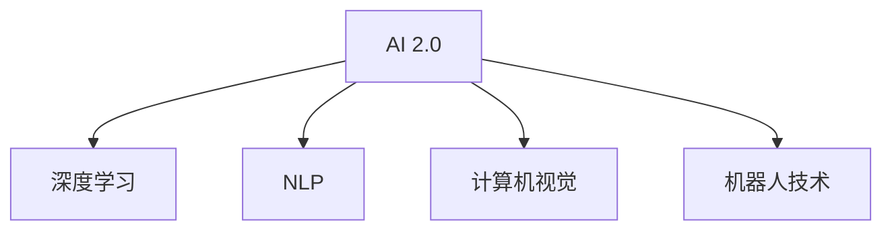

                 

# 李开复：AI 2.0 时代的生态

## 1. 背景介绍

随着人工智能（AI）技术的发展，世界正进入一个新的时代：AI 2.0。AI 2.0 时代，人工智能不再仅仅局限于科研领域，而是开始在各个行业和领域中广泛应用，成为推动社会进步和经济发展的重要力量。然而，随着AI技术的普及，也带来了一系列生态问题，需要我们深入思考和解决。

## 2. 核心概念与联系

### 2.1 核心概念概述

AI 2.0 时代，涵盖了从基础科研到实际应用的多个方面，涉及的概念众多。本节将介绍几个关键概念及其之间的关系：

- **AI 2.0**：指人工智能技术的高级阶段，包括了机器学习、深度学习、自然语言处理、计算机视觉、机器人技术等多个方向。AI 2.0 时代，AI 技术已经从基础科研走向实际应用，广泛渗透到各个行业和领域。

- **深度学习**：深度学习是AI 2.0时代最重要的技术之一，通过多层次的神经网络结构，能够从大数据中自动学习到高层次的特征表示，广泛应用于图像、语音、自然语言处理等领域。

- **自然语言处理（NLP）**：NLP 是AI 2.0 时代最重要的应用之一，涉及语言理解、文本生成、情感分析、机器翻译等多个子领域。NLP 技术使得机器能够理解和生成人类语言，广泛应用于智能客服、翻译、自动摘要、问答系统等场景。

- **计算机视觉**：计算机视觉是AI 2.0 时代的另一重要应用方向，涉及图像识别、目标检测、图像生成等多个领域。计算机视觉技术已经被广泛应用于自动驾驶、安防监控、医学影像分析等场景。

- **机器人技术**：机器人技术是AI 2.0 时代的关键应用之一，涉及移动机器人、服务机器人、协作机器人等多个方向。机器人技术已经在制造业、物流、医疗等领域得到广泛应用。

这些核心概念之间的关系可以通过以下Mermaid流程图来展示：



这个流程图展示了大语言模型和微调的核心概念及其之间的关系：

1. AI 2.0 时代，深度学习、NLP、计算机视觉、机器人技术等多个方向快速发展。
2. 深度学习、NLP 和计算机视觉等技术是AI 2.0时代的重要应用方向，广泛应用于各个领域。
3. 机器人技术是AI 2.0时代的重要应用之一，涉及移动机器人、服务机器人、协作机器人等多个方向。

## 3. 核心算法原理 & 具体操作步骤

### 3.1 算法原理概述

AI 2.0 时代，深度学习、NLP、计算机视觉等技术已经成为多个领域的重要基础。这些技术的核心算法原理包括：

- **深度学习**：通过多层次的神经网络结构，自动学习高层次的特征表示，广泛应用于图像、语音、自然语言处理等领域。
- **自然语言处理（NLP）**：通过词向量、卷积神经网络、循环神经网络等技术，实现语言理解和生成。
- **计算机视觉**：通过卷积神经网络、目标检测、图像生成等技术，实现图像识别、目标检测、图像生成等应用。

### 3.2 算法步骤详解

AI 2.0 时代的算法步骤主要包括：

1. **数据准备**：收集、清洗和标注数据，是算法训练的前提。
2. **模型训练**：选择合适的模型架构和参数，通过反向传播算法优化模型。
3. **模型评估**：使用验证集或测试集评估模型的性能，调整模型参数。
4. **模型部署**：将训练好的模型部署到实际应用场景中，进行推理和预测。

### 3.3 算法优缺点

AI 2.0 时代的算法具有以下优点：

- **自动化**：自动学习高层次的特征表示，减少人工干预。
- **高精度**：通过大量数据的训练，能够获得高精度的模型。
- **应用广泛**：广泛应用于图像、语音、自然语言处理等多个领域。

同时，这些算法也存在以下缺点：

- **数据依赖**：需要大量标注数据，数据质量直接影响模型性能。
- **计算资源需求高**：训练深度学习模型需要大量的计算资源和存储空间。
- **黑盒模型**：难以解释模型内部决策过程，缺乏可解释性。

### 3.4 算法应用领域

AI 2.0 时代的算法广泛应用于以下几个领域：

- **医疗**：应用于医学影像分析、疾病诊断、个性化医疗等领域。
- **金融**：应用于风险评估、投资分析、智能客服等领域。
- **制造业**：应用于质量检测、智能制造、供应链管理等领域。
- **农业**：应用于精准农业、智能灌溉、农业机器人等领域。
- **交通**：应用于自动驾驶、交通流量预测、智能交通等领域。

这些领域的应用展示了AI 2.0时代的巨大潜力和广泛前景。

## 4. 数学模型和公式 & 详细讲解 & 举例说明

### 4.1 数学模型构建

在AI 2.0时代，深度学习、NLP等技术都依赖于数学模型和算法。这里以NLP中的词向量模型为例，介绍数学模型的构建过程。

词向量模型（Word Embedding Model）是一种将词语映射到高维向量空间的技术，通过学习词语之间的语义关系，实现自然语言的理解和生成。词向量模型的数学模型可以表示为：

$$
\mathbf{x} = \mathbf{W} \mathbf{c}
$$

其中，$\mathbf{x}$表示词语的向量表示，$\mathbf{c}$表示词语的one-hot编码向量，$\mathbf{W}$表示词向量矩阵。

### 4.2 公式推导过程

词向量模型的训练过程包括词向量的初始化、词语的one-hot编码、模型的前向传播和后向传播等步骤。

词向量的初始化通常使用随机初始化，其数学表达式为：

$$
\mathbf{W} \sim \mathcal{N}(0, \sigma^2)
$$

其中，$\mathcal{N}(0, \sigma^2)$表示高斯分布。

词语的one-hot编码是将词语映射到one-hot向量中，其数学表达式为：

$$
\mathbf{c} = \begin{cases}
\mathbf{1}_i & \text{if } \text{word} = i \\
\mathbf{0} & \text{otherwise}
\end{cases}
$$

其中，$\mathbf{1}_i$表示第i个维度为1，其余维度为0的向量。

模型的前向传播是将词语的one-hot编码输入到词向量矩阵中，计算出词语的向量表示，其数学表达式为：

$$
\mathbf{x} = \mathbf{W} \mathbf{c}
$$

模型后向传播是使用梯度下降算法优化词向量矩阵，其数学表达式为：

$$
\mathbf{W} \leftarrow \mathbf{W} - \alpha \frac{\partial \mathcal{L}}{\partial \mathbf{W}}
$$

其中，$\alpha$表示学习率，$\frac{\partial \mathcal{L}}{\partial \mathbf{W}}$表示损失函数对词向量矩阵的梯度。

### 4.3 案例分析与讲解

以BERT模型为例，介绍其在NLP中的应用。BERT（Bidirectional Encoder Representations from Transformers）是一种预训练语言模型，通过在大规模无标签文本语料上进行预训练，学习到通用的语言表示，然后通过微调适配下游任务。BERT模型的数学模型可以表示为：

$$
\mathbf{h} = \text{BERT}(\mathbf{x}, \mathbf{m})
$$

其中，$\mathbf{x}$表示输入的词语序列，$\mathbf{m}$表示掩码序列，$\text{BERT}(\mathbf{x}, \mathbf{m})$表示BERT模型的前向传播过程。

BERT模型的训练过程包括掩码预测和下一句预测两个任务。掩码预测任务是预测词语序列中缺失的词语，下一句预测任务是预测两个句子是否连续。BERT模型的训练过程可以表示为：

$$
\mathbf{h} = \text{BERT}(\mathbf{x}, \mathbf{m})
$$

其中，$\mathbf{h}$表示BERT模型输出的隐状态，$\mathbf{x}$表示输入的词语序列，$\mathbf{m}$表示掩码序列，$\text{BERT}(\mathbf{x}, \mathbf{m})$表示BERT模型的前向传播过程。

## 5. 项目实践：代码实例和详细解释说明

### 5.1 开发环境搭建

在进行AI 2.0时代的应用开发前，需要先搭建好开发环境。以下是使用Python进行PyTorch开发的环境配置流程：

1. 安装Anaconda：从官网下载并安装Anaconda，用于创建独立的Python环境。

2. 创建并激活虚拟环境：
```bash
conda create -n pytorch-env python=3.8 
conda activate pytorch-env
```

3. 安装PyTorch：根据CUDA版本，从官网获取对应的安装命令。例如：
```bash
conda install pytorch torchvision torchaudio cudatoolkit=11.1 -c pytorch -c conda-forge
```

4. 安装TensorFlow：由Google主导开发的开源深度学习框架，生产部署方便，适合大规模工程应用。同样有丰富的预训练语言模型资源。

5. 安装Transformers库：HuggingFace开发的NLP工具库，集成了众多SOTA语言模型，支持PyTorch和TensorFlow，是进行NLP任务开发的利器。

6. 安装各类工具包：
```bash
pip install numpy pandas scikit-learn matplotlib tqdm jupyter notebook ipython
```

完成上述步骤后，即可在`pytorch-env`环境中开始AI 2.0时代的应用开发。

### 5.2 源代码详细实现

这里我们以BERT模型进行NLP任务的微调为例，给出使用PyTorch和Transformers库的代码实现。

```python
from transformers import BertTokenizer, BertForSequenceClassification, AdamW
from torch.utils.data import DataLoader
import torch
import numpy as np

# 定义数据集
class NLPDataset(Dataset):
    def __init__(self, texts, labels, tokenizer, max_len=128):
        self.texts = texts
        self.labels = labels
        self.tokenizer = tokenizer
        self.max_len = max_len

    def __len__(self):
        return len(self.texts)

    def __getitem__(self, item):
        text = self.texts[item]
        label = self.labels[item]
        
        encoding = self.tokenizer(text, return_tensors='pt', max_length=self.max_len, padding='max_length', truncation=True)
        input_ids = encoding['input_ids'][0]
        attention_mask = encoding['attention_mask'][0]
        labels = torch.tensor([label], dtype=torch.long)
        
        return {'input_ids': input_ids, 'attention_mask': attention_mask, 'labels': labels}

# 定义模型和优化器
model = BertForSequenceClassification.from_pretrained('bert-base-cased', num_labels=2)
optimizer = AdamW(model.parameters(), lr=2e-5)

# 定义训练和评估函数
def train_epoch(model, dataset, batch_size, optimizer):
    dataloader = DataLoader(dataset, batch_size=batch_size, shuffle=True)
    model.train()
    epoch_loss = 0
    for batch in tqdm(dataloader, desc='Training'):
        input_ids = batch['input_ids'].to(device)
        attention_mask = batch['attention_mask'].to(device)
        labels = batch['labels'].to(device)
        model.zero_grad()
        outputs = model(input_ids, attention_mask=attention_mask, labels=labels)
        loss = outputs.loss
        epoch_loss += loss.item()
        loss.backward()
        optimizer.step()
    return epoch_loss / len(dataloader)

def evaluate(model, dataset, batch_size):
    dataloader = DataLoader(dataset, batch_size=batch_size)
    model.eval()
    preds, labels = [], []
    with torch.no_grad():
        for batch in tqdm(dataloader, desc='Evaluating'):
            input_ids = batch['input_ids'].to(device)
            attention_mask = batch['attention_mask'].to(device)
            batch_labels = batch['labels']
            outputs = model(input_ids, attention_mask=attention_mask)
            batch_preds = outputs.logits.argmax(dim=1).to('cpu').tolist()
            batch_labels = batch_labels.to('cpu').tolist()
            for pred, label in zip(batch_preds, batch_labels):
                preds.append(pred)
                labels.append(label)
                
    return preds, labels

# 训练和评估
device = torch.device('cuda') if torch.cuda.is_available() else torch.device('cpu')
model.to(device)

epochs = 5
batch_size = 16

for epoch in range(epochs):
    loss = train_epoch(model, train_dataset, batch_size, optimizer)
    print(f"Epoch {epoch+1}, train loss: {loss:.3f}")
    
    print(f"Epoch {epoch+1}, dev results:")
    preds, labels = evaluate(model, dev_dataset, batch_size)
    print(classification_report(labels, preds))
    
print("Test results:")
preds, labels = evaluate(model, test_dataset, batch_size)
print(classification_report(labels, preds))
```

以上就是使用PyTorch和Transformers库对BERT模型进行NLP任务微调的代码实现。可以看到，得益于Transformers库的强大封装，我们可以用相对简洁的代码完成BERT模型的加载和微调。

### 5.3 代码解读与分析

让我们再详细解读一下关键代码的实现细节：

**NLPDataset类**：
- `__init__`方法：初始化文本、标签、分词器等关键组件。
- `__len__`方法：返回数据集的样本数量。
- `__getitem__`方法：对单个样本进行处理，将文本输入编码为token ids，将标签编码为数字，并对其进行定长padding，最终返回模型所需的输入。

**标签与id的映射**：
- 定义了标签与数字id之间的映射关系，用于将token-wise的预测结果解码回真实的标签。

**训练和评估函数**：
- 使用PyTorch的DataLoader对数据集进行批次化加载，供模型训练和推理使用。
- 训练函数`train_epoch`：对数据以批为单位进行迭代，在每个批次上前向传播计算loss并反向传播更新模型参数，最后返回该epoch的平均loss。
- 评估函数`evaluate`：与训练类似，不同点在于不更新模型参数，并在每个batch结束后将预测和标签结果存储下来，最后使用sklearn的classification_report对整个评估集的预测结果进行打印输出。

**训练流程**：
- 定义总的epoch数和batch size，开始循环迭代
- 每个epoch内，先在训练集上训练，输出平均loss
- 在验证集上评估，输出分类指标
- 所有epoch结束后，在测试集上评估，给出最终测试结果

可以看到，PyTorch配合Transformers库使得BERT微调的代码实现变得简洁高效。开发者可以将更多精力放在数据处理、模型改进等高层逻辑上，而不必过多关注底层的实现细节。

当然，工业级的系统实现还需考虑更多因素，如模型的保存和部署、超参数的自动搜索、更灵活的任务适配层等。但核心的微调范式基本与此类似。

## 6. 实际应用场景

### 6.1 智能客服系统

基于大语言模型微调的对话技术，可以广泛应用于智能客服系统的构建。传统客服往往需要配备大量人力，高峰期响应缓慢，且一致性和专业性难以保证。而使用微调后的对话模型，可以7x24小时不间断服务，快速响应客户咨询，用自然流畅的语言解答各类常见问题。

在技术实现上，可以收集企业内部的历史客服对话记录，将问题和最佳答复构建成监督数据，在此基础上对预训练对话模型进行微调。微调后的对话模型能够自动理解用户意图，匹配最合适的答案模板进行回复。对于客户提出的新问题，还可以接入检索系统实时搜索相关内容，动态组织生成回答。如此构建的智能客服系统，能大幅提升客户咨询体验和问题解决效率。

### 6.2 金融舆情监测

金融机构需要实时监测市场舆论动向，以便及时应对负面信息传播，规避金融风险。传统的人工监测方式成本高、效率低，难以应对网络时代海量信息爆发的挑战。基于大语言模型微调的文本分类和情感分析技术，为金融舆情监测提供了新的解决方案。

具体而言，可以收集金融领域相关的新闻、报道、评论等文本数据，并对其进行主题标注和情感标注。在此基础上对预训练语言模型进行微调，使其能够自动判断文本属于何种主题，情感倾向是正面、中性还是负面。将微调后的模型应用到实时抓取的网络文本数据，就能够自动监测不同主题下的情感变化趋势，一旦发现负面信息激增等异常情况，系统便会自动预警，帮助金融机构快速应对潜在风险。

### 6.3 个性化推荐系统

当前的推荐系统往往只依赖用户的历史行为数据进行物品推荐，无法深入理解用户的真实兴趣偏好。基于大语言模型微调技术，个性化推荐系统可以更好地挖掘用户行为背后的语义信息，从而提供更精准、多样的推荐内容。

在实践中，可以收集用户浏览、点击、评论、分享等行为数据，提取和用户交互的物品标题、描述、标签等文本内容。将文本内容作为模型输入，用户的后续行为（如是否点击、购买等）作为监督信号，在此基础上微调预训练语言模型。微调后的模型能够从文本内容中准确把握用户的兴趣点。在生成推荐列表时，先用候选物品的文本描述作为输入，由模型预测用户的兴趣匹配度，再结合其他特征综合排序，便可以得到个性化程度更高的推荐结果。

### 6.4 未来应用展望

随着大语言模型微调技术的发展，未来将在更多领域得到应用，为传统行业带来变革性影响。

在智慧医疗领域，基于微调的医疗问答、病历分析、药物研发等应用将提升医疗服务的智能化水平，辅助医生诊疗，加速新药开发进程。

在智能教育领域，微调技术可应用于作业批改、学情分析、知识推荐等方面，因材施教，促进教育公平，提高教学质量。

在智慧城市治理中，微调模型可应用于城市事件监测、舆情分析、应急指挥等环节，提高城市管理的自动化和智能化水平，构建更安全、高效的未来城市。

此外，在企业生产、社会治理、文娱传媒等众多领域，基于大模型微调的人工智能应用也将不断涌现，为NLP技术带来全新的突破。随着预训练语言模型和微调方法的持续演进，相信NLP技术将在更广阔的应用领域大放异彩。

## 7. 工具和资源推荐

### 7.1 学习资源推荐

为了帮助开发者系统掌握AI 2.0时代的应用开发，这里推荐一些优质的学习资源：

1. 《深度学习》系列博文：由大模型技术专家撰写，深入浅出地介绍了深度学习原理、NLP模型、计算机视觉模型等前沿话题。

2. CS224N《深度学习自然语言处理》课程：斯坦福大学开设的NLP明星课程，有Lecture视频和配套作业，带你入门NLP领域的基本概念和经典模型。

3. 《Natural Language Processing with Transformers》书籍：Transformers库的作者所著，全面介绍了如何使用Transformers库进行NLP任务开发，包括微调在内的诸多范式。

4. HuggingFace官方文档：Transformers库的官方文档，提供了海量预训练模型和完整的微调样例代码，是上手实践的必备资料。

5. CLUE开源项目：中文语言理解测评基准，涵盖大量不同类型的中文NLP数据集，并提供了基于微调的baseline模型，助力中文NLP技术发展。

通过对这些资源的学习实践，相信你一定能够快速掌握AI 2.0时代的微调技术，并用于解决实际的NLP问题。

### 7.2 开发工具推荐

高效的开发离不开优秀的工具支持。以下是几款用于AI 2.0时代的应用开发的常用工具：

1. PyTorch：基于Python的开源深度学习框架，灵活动态的计算图，适合快速迭代研究。大部分预训练语言模型都有PyTorch版本的实现。

2. TensorFlow：由Google主导开发的开源深度学习框架，生产部署方便，适合大规模工程应用。同样有丰富的预训练语言模型资源。

3. Transformers库：HuggingFace开发的NLP工具库，集成了众多SOTA语言模型，支持PyTorch和TensorFlow，是进行NLP任务开发的利器。

4. Weights & Biases：模型训练的实验跟踪工具，可以记录和可视化模型训练过程中的各项指标，方便对比和调优。与主流深度学习框架无缝集成。

5. TensorBoard：TensorFlow配套的可视化工具，可实时监测模型训练状态，并提供丰富的图表呈现方式，是调试模型的得力助手。

6. Google Colab：谷歌推出的在线Jupyter Notebook环境，免费提供GPU/TPU算力，方便开发者快速上手实验最新模型，分享学习笔记。

合理利用这些工具，可以显著提升AI 2.0时代的应用开发效率，加快创新迭代的步伐。

### 7.3 相关论文推荐

AI 2.0时代的发展源于学界的持续研究。以下是几篇奠基性的相关论文，推荐阅读：

1. Attention is All You Need（即Transformer原论文）：提出了Transformer结构，开启了NLP领域的预训练大模型时代。

2. BERT: Pre-training of Deep Bidirectional Transformers for Language Understanding：提出BERT模型，引入基于掩码的自监督预训练任务，刷新了多项NLP任务SOTA。

3. Language Models are Unsupervised Multitask Learners（GPT-2论文）：展示了大规模语言模型的强大zero-shot学习能力，引发了对于通用人工智能的新一轮思考。

4. Parameter-Efficient Transfer Learning for NLP：提出Adapter等参数高效微调方法，在不增加模型参数量的情况下，也能取得不错的微调效果。

5. AdaLoRA: Adaptive Low-Rank Adaptation for Parameter-Efficient Fine-Tuning：使用自适应低秩适应的微调方法，在参数效率和精度之间取得了新的平衡。

6. Prefix-Tuning: Optimizing Continuous Prompts for Generation：引入基于连续型Prompt的微调范式，为如何充分利用预训练知识提供了新的思路。

这些论文代表了大语言模型微调技术的发展脉络。通过学习这些前沿成果，可以帮助研究者把握学科前进方向，激发更多的创新灵感。

## 8. 总结：未来发展趋势与挑战

### 8.1 总结

本文对AI 2.0时代的应用开发进行了全面系统的介绍。首先阐述了AI 2.0时代的技术背景和应用场景，明确了深度学习、NLP、计算机视觉等技术在AI 2.0时代的重要地位。其次，从原理到实践，详细讲解了深度学习、NLP等技术的核心算法原理和具体实现，给出了完整的代码实例。同时，本文还广泛探讨了AI 2.0时代在智能客服、金融舆情监测、个性化推荐等领域的实际应用，展示了AI 2.0时代的技术潜力和广阔前景。此外，本文精选了AI 2.0时代的各类学习资源，力求为开发者提供全方位的技术指引。

通过本文的系统梳理，可以看到，AI 2.0时代的深度学习、NLP等技术正在成为多个领域的重要基础，推动AI技术的不断发展和应用。未来，伴随预训练语言模型和微调方法的持续演进，相信AI 2.0时代将会有更多创新突破，推动人工智能技术向更加智能化、普适化的方向迈进。

### 8.2 未来发展趋势

展望未来，AI 2.0时代的发展趋势包括：

1. 技术不断演进：深度学习、NLP、计算机视觉等技术将不断演进，推动AI技术的持续发展。
2. 应用广泛普及：AI 2.0时代的技术将在更多领域得到应用，推动各行各业的数字化转型。
3. 数据驱动决策：基于AI技术的数据分析和大数据应用将成为决策支持的重要手段。
4. 人机协同工作：AI 2.0时代的技术将与人类协同工作，提升工作效率和创新能力。
5. 伦理道德关注：AI 2.0时代的技术将更多关注伦理道德问题，确保技术的安全和可靠性。

### 8.3 面临的挑战

尽管AI 2.0时代的技术发展迅速，但在实际应用中仍面临诸多挑战：

1. 数据隐私问题：AI 2.0时代的技术需要大量数据支持，如何保护用户隐私和数据安全是一个重要挑战。
2. 模型鲁棒性不足：AI 2.0时代的技术需要处理复杂的现实场景，模型的鲁棒性和泛化能力还需要进一步提升。
3. 伦理道德风险：AI 2.0时代的技术可能带来伦理道德风险，如偏见、歧视等问题，需要建立相应的监管机制。
4. 计算资源限制：AI 2.0时代的技术需要大量的计算资源和存储空间，如何优化资源使用是一个重要挑战。
5. 算法透明性不足：AI 2.0时代的技术缺乏可解释性，如何提高算法的透明性和可解释性是一个重要课题。

### 8.4 研究展望

未来的研究需要在以下几个方面寻求新的突破：

1. 探索更多应用场景：探索AI 2.0技术在更多领域的应用，推动技术向更广泛的场景扩展。
2. 提升算法鲁棒性：提升AI 2.0技术的鲁棒性和泛化能力，确保其在复杂场景下的稳定性。
3. 加强数据保护：加强数据隐私和安全保护，确保AI 2.0技术在应用中的数据安全和用户隐私。
4. 推进算法透明性：提升AI 2.0技术的透明性和可解释性，确保其算法的公正性和可靠性。
5. 优化资源使用：优化AI 2.0技术的计算资源使用，提升技术的可部署性和实用性。

通过不断推进这些研究方向，AI 2.0技术将在更多领域得到应用，推动社会和经济的发展。相信未来，AI 2.0技术将在多个领域产生深远影响，引领人工智能技术向更加智能化、普适化的方向迈进。

## 9. 附录：常见问题与解答

**Q1：AI 2.0时代的深度学习模型有哪些优点和缺点？**

A: AI 2.0时代的深度学习模型具有以下优点：
- 自动化：自动学习高层次的特征表示，减少人工干预。
- 高精度：通过大量数据的训练，能够获得高精度的模型。
- 应用广泛：广泛应用于图像、语音、自然语言处理等多个领域。

同时，这些模型也存在以下缺点：
- 数据依赖：需要大量标注数据，数据质量直接影响模型性能。
- 计算资源需求高：训练深度学习模型需要大量的计算资源和存储空间。
- 黑盒模型：难以解释模型内部决策过程，缺乏可解释性。

**Q2：AI 2.0时代的深度学习模型在实际应用中需要注意哪些问题？**

A: AI 2.0时代的深度学习模型在实际应用中需要注意以下问题：
- 数据隐私：需要保护用户隐私和数据安全，防止数据泄露。
- 模型鲁棒性：需要提升模型的鲁棒性和泛化能力，确保其在复杂场景下的稳定性。
- 算法透明性：需要提高算法的透明性和可解释性，确保其算法的公正性和可靠性。
- 计算资源：需要优化计算资源使用，提升技术的可部署性和实用性。
- 伦理道德：需要关注伦理道德问题，确保技术的公正性和安全性。

**Q3：AI 2.0时代的深度学习模型在实际应用中如何进行优化？**

A: AI 2.0时代的深度学习模型在实际应用中可以进行以下优化：
- 数据增强：通过数据增强技术，提升模型的泛化能力。
- 模型压缩：通过模型压缩技术，减少模型参数量和计算资源使用。
- 参数高效微调：使用参数高效微调技术，只调整少量参数，减少过拟合风险。
- 超参数调优：通过超参数调优技术，优化模型参数和超参数，提升模型性能。
- 模型融合：通过模型融合技术，提升模型的鲁棒性和泛化能力。

**Q4：AI 2.0时代的深度学习模型在实际应用中如何保护用户隐私？**

A: AI 2.0时代的深度学习模型在实际应用中可以通过以下方式保护用户隐私：
- 数据匿名化：对用户数据进行匿名化处理，防止数据泄露。
- 差分隐私：使用差分隐私技术，保护用户隐私。
- 数据加密：对用户数据进行加密处理，防止数据泄露。
- 访问控制：对用户数据进行访问控制，确保数据的安全性。
- 隐私计算：使用隐私计算技术，保护用户隐私。

**Q5：AI 2.0时代的深度学习模型在实际应用中如何进行伦理道德风险管理？**

A: AI 2.0时代的深度学习模型在实际应用中可以通过以下方式进行伦理道德风险管理：
- 伦理审查：在模型开发过程中，进行伦理审查，确保模型的公正性和安全性。
- 公平性检测：对模型进行公平性检测，确保模型的公平性。
- 透明性保证：提高模型的透明性和可解释性，确保算法的公正性和可靠性。
- 伦理培训：对开发者进行伦理培训，提升其伦理意识。
- 伦理监管：建立伦理监管机制，确保技术的公正性和安全性。

---

作者：禅与计算机程序设计艺术 / Zen and the Art of Computer Programming

