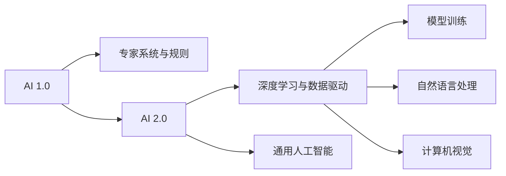

                 

# 李开复：AI 2.0 时代的观察者

## 1. 背景介绍

### 1.1 问题由来

随着人工智能（AI）技术的迅猛发展，我们正步入AI 2.0时代，这是一个技术日益普及、应用场景日趋丰富的全新时代。从语音识别到自然语言处理，从图像处理到智能推荐，AI技术正在渗透到社会的各个角落。然而，AI技术的进步并非一帆风顺，它在带来巨大机遇的同时，也伴随着诸多挑战和伦理问题。作为一名经验丰富的AI从业者，李开复博士以深厚的学识和敏锐的洞察力，对AI 2.0时代的现状和未来进行了深入观察与思考。

### 1.2 问题核心关键点

本文将聚焦于以下几个核心问题：
- 如何理解AI 2.0时代的技术进展和应用现状？
- AI 2.0时代面临的主要挑战和风险是什么？
- AI 2.0时代的伦理问题有哪些，如何解决？
- AI 2.0时代的发展趋势和未来展望如何？

通过这些问题，我们希望深入探讨AI 2.0时代的复杂性，揭示其中的机遇与挑战，为未来的发展提供指导。

## 2. 核心概念与联系

### 2.1 核心概念概述

要理解AI 2.0时代，首先需要明确几个关键概念：

- **人工智能（AI）**：指利用计算机技术和算法，使机器能够执行人类通常需要智能才能完成的任务。AI技术包括机器学习、自然语言处理、计算机视觉等。
- **AI 1.0时代**：以专家系统和规则为基础的时代，依赖于手写的规则和专家知识库。
- **AI 2.0时代**：以数据驱动、深度学习、模型为核心的时代，通过海量数据训练出强大的模型，实现自主学习与优化。
- **AI 3.0时代**：强调通用人工智能（AGI），即具备广泛认知能力的人工智能系统。

这些概念之间存在紧密联系，构成了AI技术发展的全貌。

### 2.2 核心概念原理和架构的 Mermaid 流程图



这个流程图展示了AI技术从1.0到2.0再到3.0的发展脉络：从早期的规则系统到数据驱动的深度学习，再到追求通用认知能力的AI 3.0。

## 3. 核心算法原理 & 具体操作步骤

### 3.1 算法原理概述

AI 2.0时代的核心算法原理是深度学习（Deep Learning）和机器学习（Machine Learning）。这些算法能够通过数据自适应学习，不断优化模型参数，实现复杂任务的自动化处理。以神经网络为代表的深度学习模型，通过多层非线性映射，捕捉数据中的复杂关系，从而在图像识别、语音处理、自然语言处理等领域取得了显著成效。

### 3.2 算法步骤详解

AI 2.0模型的构建和训练通常分为以下步骤：

1. **数据收集与预处理**：收集大量标记数据，进行清洗、标注和划分训练集、验证集、测试集。
2. **模型设计**：选择合适的深度学习框架（如TensorFlow、PyTorch）和模型架构（如卷积神经网络CNN、循环神经网络RNN、Transformer等）。
3. **模型训练**：使用梯度下降等优化算法，通过反向传播更新模型参数，最小化损失函数。
4. **模型评估**：在验证集上评估模型性能，调整超参数（如学习率、批大小、迭代轮数等），提高模型泛化能力。
5. **模型部署**：将训练好的模型应用到实际场景中，进行推理和预测。

### 3.3 算法优缺点

AI 2.0算法的主要优点包括：

- **自动化学习**：能够自主发现数据中的规律，无需人工干预。
- **高准确率**：在许多任务上取得了超越人类的表现。
- **泛化能力强**：在处理新数据时，能够较好地保持性能。

同时，这些算法也存在一些缺点：

- **高计算需求**：需要大量的计算资源和数据存储。
- **模型复杂性**：模型参数繁多，难以解释和调试。
- **数据依赖**：模型的性能高度依赖于训练数据的数量和质量。

### 3.4 算法应用领域

AI 2.0算法在多个领域得到了广泛应用，包括但不限于：

- **自然语言处理（NLP）**：机器翻译、情感分析、文本分类、对话系统等。
- **计算机视觉**：图像识别、目标检测、人脸识别、自动驾驶等。
- **语音处理**：语音识别、语音合成、说话人识别等。
- **推荐系统**：个性化推荐、广告推荐、内容推荐等。

## 4. 数学模型和公式 & 详细讲解 & 举例说明

### 4.1 数学模型构建

AI 2.0模型的数学模型通常基于深度神经网络，以下是一个简单的神经网络模型示例：

```
输入层：$x_1, x_2, ..., x_n$
隐藏层：$h_1, h_2, ..., h_m$
输出层：$y_1, y_2, ..., y_k$

输入层 -> 隐藏层1 -> 隐藏层2 -> ... -> 隐藏层m -> 输出层1 -> 输出层2 -> ... -> 输出层k
```

其中，$h_i$表示第$i$个隐藏层的输出，$y_j$表示第$j$个输出层的输出，各层的激活函数一般为ReLU或Sigmoid。

### 4.2 公式推导过程

以反向传播算法为例，推导神经网络模型的参数更新公式：

设损失函数为$\mathcal{L}$，模型参数为$\theta$，对于训练样本$(x,y)$，前向传播计算输出$y$：

$$
y = f(Wx + b)
$$

其中，$f$为激活函数，$W$为权重矩阵，$b$为偏置项。

反向传播算法计算损失函数对每个参数的梯度：

$$
\frac{\partial \mathcal{L}}{\partial \theta} = \frac{\partial \mathcal{L}}{\partial y} \frac{\partial y}{\partial \theta}
$$

利用链式法则，逐层计算梯度，最终更新模型参数：

$$
\theta \leftarrow \theta - \eta \frac{\partial \mathcal{L}}{\partial \theta}
$$

其中，$\eta$为学习率。

### 4.3 案例分析与讲解

以图像识别为例，介绍卷积神经网络（CNN）的基本原理和结构：

```
输入层：$x_{11}, x_{12}, ..., x_{1n_1}$
卷积层1：$h_{11}, h_{12}, ..., h_{1n_2}$
池化层1：$p_{11}, p_{12}, ..., p_{1n_2}$
卷积层2：$h_{21}, h_{22}, ..., h_{2n_2}$
池化层2：$p_{21}, p_{22}, ..., p_{2n_2}$
全连接层1：$y_{11}, y_{12}, ..., y_{1n_3}$
输出层：$y_1, y_2, ..., y_k$

输入层 -> 卷积层1 -> 池化层1 -> 卷积层2 -> 池化层2 -> 全连接层1 -> 输出层1 -> 输出层2 -> ... -> 输出层k
```

CNN通过卷积和池化操作，提取图像特征，并通过全连接层进行分类，取得了显著的性能。

## 5. 项目实践：代码实例和详细解释说明

### 5.1 开发环境搭建

1. **环境准备**：安装Python和相关依赖库，如TensorFlow、PyTorch、NumPy等。
2. **数据集准备**：收集和处理训练集、验证集和测试集，并进行数据增强和预处理。
3. **模型选择**：选择合适的深度学习模型架构，如卷积神经网络、循环神经网络、Transformer等。
4. **超参数调优**：调整学习率、批大小、迭代轮数等超参数，进行模型训练。
5. **模型评估**：在验证集上评估模型性能，根据评估结果调整超参数，提高模型泛化能力。
6. **模型部署**：将训练好的模型应用到实际场景中，进行推理和预测。

### 5.2 源代码详细实现

以手写数字识别为例，给出使用TensorFlow实现的完整代码：

```python
import tensorflow as tf
from tensorflow import keras

# 加载MNIST数据集
mnist = keras.datasets.mnist
(train_images, train_labels), (test_images, test_labels) = mnist.load_data()

# 数据预处理
train_images = train_images / 255.0
test_images = test_images / 255.0

# 构建模型
model = keras.Sequential([
    keras.layers.Flatten(input_shape=(28, 28)),
    keras.layers.Dense(128, activation='relu'),
    keras.layers.Dense(10, activation='softmax')
])

# 编译模型
model.compile(optimizer='adam',
              loss='sparse_categorical_crossentropy',
              metrics=['accuracy'])

# 训练模型
model.fit(train_images, train_labels, epochs=5)

# 评估模型
model.evaluate(test_images, test_labels)

# 推理预测
predictions = model.predict(test_images)
```

### 5.3 代码解读与分析

- **数据加载和预处理**：使用`keras.datasets.mnist.load_data()`加载MNIST数据集，并进行归一化处理。
- **模型构建**：使用`keras.Sequential`构建一个简单的神经网络模型，包含输入层、隐藏层和输出层。
- **模型编译**：选择优化器、损失函数和评估指标，进行模型编译。
- **模型训练**：使用`model.fit()`训练模型，设置训练轮数为5。
- **模型评估**：使用`model.evaluate()`评估模型性能。
- **推理预测**：使用`model.predict()`进行推理预测。

## 6. 实际应用场景

### 6.1 智能客服系统

AI 2.0时代的智能客服系统，通过深度学习和大语言模型，能够实时处理和回答用户的查询，提升客户满意度。例如，利用自然语言处理技术，对用户输入的文本进行理解和生成响应，确保客户获得准确、快速的服务。

### 6.2 金融舆情监测

金融领域的舆情监测，通过AI 2.0技术，能够实时分析海量新闻和社交媒体数据，识别出潜在的市场动向和风险因素，为投资者提供决策支持。例如，利用自然语言处理技术，对金融新闻进行情感分析，预测股票价格走势。

### 6.3 个性化推荐系统

AI 2.0技术在个性化推荐系统中得到了广泛应用。例如，通过深度学习模型，分析用户的历史行为数据，为用户推荐感兴趣的内容和产品，提升用户满意度和平台黏性。

### 6.4 未来应用展望

未来，AI 2.0技术将在更多领域得到应用，带来深远的影响。例如：

- **医疗领域**：通过AI 2.0技术，分析医学影像和电子病历，辅助医生诊断和治疗。
- **教育领域**：利用AI 2.0技术，自动批改作业和生成教学内容，提升教育效果。
- **城市管理**：通过AI 2.0技术，实时监测城市运行状态，优化资源配置，提高城市管理效率。
- **智能制造**：利用AI 2.0技术，实现生产过程的智能化和自动化，提升生产效率和质量。

## 7. 工具和资源推荐

### 7.1 学习资源推荐

1. **深度学习基础**：《Deep Learning》一书，由深度学习领域的权威人物Ian Goodfellow撰写，全面介绍深度学习的基本原理和应用。
2. **TensorFlow官方文档**：提供详细的TensorFlow使用指南和示例代码，适合初学者和进阶者。
3. **PyTorch官方文档**：提供丰富的PyTorch使用教程和案例，适合深度学习开发。
4. **Kaggle竞赛**：提供大量数据集和实战项目，帮助开发者提升实战能力。
5. **Google AI博客**：分享Google AI团队的最新研究进展和技术动态，适合跟踪AI前沿技术。

### 7.2 开发工具推荐

1. **Jupyter Notebook**：免费、开源的交互式编程环境，支持Python、R等多种编程语言。
2. **Google Colab**：提供GPU/TPU计算资源，支持Jupyter Notebook，方便进行深度学习实验。
3. **PyCharm**：支持Python编程，提供丰富的IDE功能，适合深度学习开发。
4. **TensorBoard**：提供可视化工具，帮助监控和调试模型训练过程。
5. **PyTorch Lightning**：提供快速原型开发和模型调优功能，适合初学者和高级开发者。

### 7.3 相关论文推荐

1. **ImageNet大规模视觉识别挑战**：提出了一种基于深度学习的图像分类方法，取得了显著的性能提升。
2. **AlphaGo**：通过深度学习和蒙特卡罗树搜索技术，实现了围棋世界冠军级别的水平。
3. **BERT：预训练表示的深度学习模型**：提出了一种基于Transformer的预训练语言模型，在多个NLP任务上取得了SOTA表现。
4. **GPT-3：大规模预训练语言模型**：提出了一种基于Transformer的大规模语言模型，能够生成高质量的自然语言文本。

## 8. 总结：未来发展趋势与挑战

### 8.1 研究成果总结

AI 2.0时代，深度学习和大模型在各个领域取得了显著进展，推动了技术进步和应用创新。然而，AI 2.0也面临诸多挑战，如计算资源需求高、模型复杂性、数据依赖等。

### 8.2 未来发展趋势

AI 2.0技术的未来发展趋势包括：

- **更强的泛化能力**：通过预训练技术，提升模型的泛化能力，应对更多的应用场景。
- **更高效和可解释**：开发更高效的深度学习算法，增强模型的可解释性，提升用户信任度。
- **多模态融合**：实现不同模态数据（如视觉、语音、文本）的融合，提高AI系统的全面性。
- **伦理和公平**：解决AI系统的伦理和公平性问题，确保技术应用的社会责任。
- **人机协同**：实现人机协同，提升AI系统的用户体验和智能水平。

### 8.3 面临的挑战

AI 2.0技术的发展也面临诸多挑战：

- **计算资源**：深度学习模型需要大量的计算资源，如何降低计算成本是重要问题。
- **数据隐私**：AI系统的数据来源多样，如何保护数据隐私和安全性是关键挑战。
- **伦理问题**：AI系统的决策过程难以解释，可能带来偏见和歧视，需要加强伦理审查。
- **公平性**：AI系统的应用可能带来不公平，如何确保系统公平性是重要课题。
- **技术更新**：AI技术的快速发展，需要开发者不断学习和跟进，保持技术竞争力。

### 8.4 研究展望

未来，AI 2.0技术需要在以下几个方面进行深入研究：

- **算法优化**：开发更高效、更可解释的深度学习算法，提升模型性能和用户信任度。
- **数据治理**：加强数据隐私保护和公平性，确保数据使用的合法性和合理性。
- **伦理审查**：建立AI系统的伦理审查机制，确保技术应用的公正性和透明度。
- **人机协同**：实现人机协同，提升AI系统的智能水平和用户体验。

总之，AI 2.0技术正处于快速发展阶段，我们需要从技术、伦理、社会等多个维度进行深入研究，推动AI技术向更普适、更智能、更可靠的方向发展。

## 9. 附录：常见问题与解答

**Q1：如何理解深度学习的原理？**

A: 深度学习是一种基于神经网络的机器学习方法，通过多层次的非线性变换，能够自动学习数据的复杂特征。深度学习的核心在于数据驱动，通过大量标注数据进行训练，使模型能够自主发现数据中的规律和模式。

**Q2：如何选择合适的深度学习框架？**

A: 选择合适的深度学习框架需要考虑以下几个因素：
1. **生态系统**：选择有活跃社区和丰富资源支持的框架，如TensorFlow、PyTorch等。
2. **功能特点**：根据任务需求选择功能完备的框架，如支持GPU加速、分布式训练等。
3. **易用性**：选择易学易用的框架，如Keras、TensorFlow Lite等。

**Q3：如何提高深度学习模型的泛化能力？**

A: 提高深度学习模型的泛化能力，需要从以下几个方面进行优化：
1. **数据增强**：通过数据增强技术，增加训练数据的多样性，提升模型泛化能力。
2. **正则化**：使用L2正则、Dropout等技术，防止模型过拟合。
3. **模型集成**：采用模型集成技术，如Bagging、Boosting等，提升模型的稳定性。
4. **超参数调优**：通过超参数调优，找到最优的模型参数组合，提高模型的泛化能力。

**Q4：如何避免深度学习模型的过拟合？**

A: 避免深度学习模型的过拟合，需要从以下几个方面进行优化：
1. **数据增强**：通过数据增强技术，增加训练数据的多样性。
2. **正则化**：使用L2正则、Dropout等技术，防止模型过拟合。
3. **模型集成**：采用模型集成技术，如Bagging、Boosting等，提升模型的稳定性。
4. **超参数调优**：通过超参数调优，找到最优的模型参数组合，提高模型的泛化能力。

**Q5：如何部署深度学习模型？**

A: 部署深度学习模型需要考虑以下几个方面：
1. **模型压缩**：通过模型压缩技术，减小模型尺寸，提升推理速度。
2. **模型量化**：将浮点模型转为定点模型，压缩存储空间，提高计算效率。
3. **服务化封装**：将模型封装为标准化服务接口，便于集成调用。
4. **弹性伸缩**：根据请求流量动态调整资源配置，平衡服务质量和成本。
5. **监控告警**：实时采集系统指标，设置异常告警阈值，确保服务稳定性。

总之，深度学习模型的部署需要全面考虑模型优化、服务化封装、弹性伸缩等多个方面，确保模型的稳定性和可靠性。

---

作者：禅与计算机程序设计艺术 / Zen and the Art of Computer Programming

