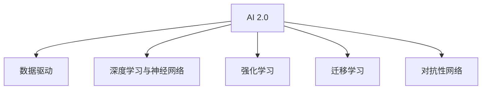

                 

# 李开复：AI 2.0 时代的趋势

## 1. 背景介绍

### 1.1 问题由来

人工智能(AI)技术正以前所未有的速度发展，已经从早期的理论研究阶段走向了实际应用阶段。人工智能技术已经从单一领域的独立技术发展成为跨领域的基础设施，为各行各业注入了新的活力。AI 1.0 时代的重点在于知识的表示与推理，而 AI 2.0 时代则更加关注于数据与智能算法的结合，以实现更强大的自动化与智能化能力。

## 2. 核心概念与联系

### 2.1 核心概念概述

为更好地理解 AI 2.0 时代的趋势，本节将介绍几个密切相关的核心概念：

- AI 2.0：人工智能的 2.0 时代，相较于 AI 1.0 时代，AI 2.0 更加注重数据驱动的智能，其核心在于大规模的数据处理与分析，以及基于数据与智能算法的结合。

- 数据驱动：AI 2.0 的核心在于数据驱动，通过海量的数据来训练出智能模型，使其具备强大的数据处理与分析能力。

- 深度学习与神经网络：深度学习与神经网络是 AI 2.0 时代的主要技术工具，通过多层神经网络的组合来实现复杂的非线性映射。

- 强化学习：强化学习是 AI 2.0 时代的一个重要分支，通过智能体与环境的交互来学习最优策略。

- 迁移学习：迁移学习是指在已有模型的基础上，将已学知识迁移到新的任务或领域。

- 对抗性网络：对抗性网络是指能够生成对抗样本，挑战模型鲁棒性的技术，也是 AI 2.0 时代的重要研究方向。

这些核心概念之间的逻辑关系可以通过以下 Mermaid 流程图来展示：



这个流程图展示了大语言模型的工作原理和优化方向：

1. AI 2.0 通过数据驱动，在深度学习与神经网络的辅助下，实现大规模数据处理与智能模型训练。
2. 强化学习用于提升模型的策略学习能力，更好地适应复杂环境和任务。
3. 迁移学习能够将已有模型的知识迁移到新任务上，提高模型泛化能力。
4. 对抗性网络测试模型鲁棒性，提高模型的稳健性。

这些概念共同构成了 AI 2.0 时代的核心技术基础，使其在多个领域实现了突破性应用。

## 3. 核心算法原理 & 具体操作步骤
### 3.1 算法原理概述

AI 2.0 时代的核心算法原理主要围绕深度学习与神经网络的构建与训练展开。深度学习模型通过多层非线性变换，实现对复杂数据的有效处理与表示。神经网络的训练则通过反向传播算法，利用梯度下降等优化方法，最小化模型损失函数，从而实现模型参数的优化。

以深度学习中的卷积神经网络(CNN)为例，其核心原理包括：

- 卷积层：通过卷积操作提取图像的空间特征。
- 池化层：通过池化操作对特征图进行降维。
- 全连接层：将卷积层和池化层的特征图通过全连接层进行分类。

神经网络的训练过程通过反向传播算法实现：

- 前向传播：将输入数据通过网络各层进行非线性变换，得到输出结果。
- 计算损失函数：将输出结果与真实标签进行比较，计算损失函数。
- 反向传播：利用链式法则计算损失函数对每个参数的梯度。
- 更新参数：通过梯度下降等优化算法更新网络参数，使得损失函数最小化。

### 3.2 算法步骤详解

AI 2.0 时代的深度学习算法通常包括以下几个关键步骤：

**Step 1: 准备数据集**

- 收集标注数据集，并划分为训练集、验证集和测试集。训练集用于模型训练，验证集用于模型调优，测试集用于模型评估。

**Step 2: 构建神经网络模型**

- 选择适当的神经网络结构，如卷积神经网络(CNN)、循环神经网络(RNN)、长短期记忆网络(LSTM)、生成对抗网络(GAN)等。
- 设计网络层数、每层节点数、激活函数、优化器等超参数。

**Step 3: 训练模型**

- 使用随机梯度下降等优化算法，对模型进行训练。通过前向传播和反向传播更新模型参数。
- 在训练过程中，通过验证集监控模型性能，及时调整超参数。

**Step 4: 评估模型**

- 在测试集上评估模型性能，常用的评估指标包括准确率、精确率、召回率等。
- 分析模型误差来源，进行模型调优。

**Step 5: 应用模型**

- 将训练好的模型应用于实际问题中，如图像识别、语音识别、自然语言处理等。
- 不断收集新数据，更新模型参数，保持模型性能。

### 3.3 算法优缺点

AI 2.0 时代的深度学习算法具有以下优点：

- 强大的数据处理能力：深度学习算法可以处理海量的复杂数据，如图像、语音、文本等。
- 自动特征提取：通过多层神经网络，算法能够自动学习数据的特征表示。
- 可解释性：部分深度学习算法，如卷积神经网络、循环神经网络，具备较好的可解释性。
- 高性能：深度学习算法在许多领域取得了突破性成果，如计算机视觉、自然语言处理、语音识别等。

同时，这些算法也存在一些局限性：

- 对标注数据依赖较大：深度学习模型的训练需要大量的标注数据，数据获取成本较高。
- 计算资源消耗大：深度学习模型通常需要较大的计算资源，如GPU、TPU等。
- 易过拟合：深度学习模型容易过拟合，需要进行正则化等技术手段进行处理。
- 缺乏通用性：不同领域的数据和问题特点各异，深度学习模型需要针对具体问题进行设计。

尽管存在这些局限性，但深度学习算法在 AI 2.0 时代已展现出巨大的潜力，成为推动各行各业智能化转型的重要工具。

### 3.4 算法应用领域

AI 2.0 时代的深度学习算法在多个领域得到了广泛应用，以下是几个典型应用场景：

- 计算机视觉：如目标检测、图像分类、图像生成等。通过深度学习模型提取图像特征，实现图像识别与生成。
- 自然语言处理：如文本分类、机器翻译、情感分析等。通过深度学习模型处理自然语言，实现语义理解与生成。
- 语音识别：如语音识别、语音合成等。通过深度学习模型提取语音特征，实现语音转换。
- 推荐系统：如商品推荐、用户推荐等。通过深度学习模型预测用户行为，实现个性化推荐。
- 自动驾驶：如目标检测、行为预测、决策规划等。通过深度学习模型处理多模态数据，实现自动驾驶。

除了上述这些经典应用外，深度学习算法还被应用于医学影像分析、金融预测、智能制造等领域，为各行各业带来了革命性变革。

## 4. 数学模型和公式 & 详细讲解 & 举例说明

### 4.1 数学模型构建

AI 2.0 时代的深度学习算法通常使用神经网络模型，以下以卷积神经网络为例，介绍其数学模型的构建过程。

设输入数据为 $x$，输出标签为 $y$，则卷积神经网络的目标是最小化损失函数 $L$，表示模型输出与真实标签的误差：

$$
L = \frac{1}{N} \sum_{i=1}^N \ell(x_i, y_i)
$$

其中，$N$ 表示数据集大小，$\ell$ 表示单样本损失函数。常用的单样本损失函数包括交叉熵损失函数和均方误差损失函数。

### 4.2 公式推导过程

以交叉熵损失函数为例，其公式推导如下：

设模型对样本 $x_i$ 的输出为 $\hat{y}_i$，则交叉熵损失函数 $\ell$ 为：

$$
\ell(x_i, y_i) = -y_i \log \hat{y}_i - (1-y_i) \log (1-\hat{y}_i)
$$

将其代入总体损失函数 $L$，得：

$$
L = \frac{1}{N} \sum_{i=1}^N [-y_i \log \hat{y}_i - (1-y_i) \log (1-\hat{y}_i)]
$$

在训练过程中，利用梯度下降等优化算法，更新模型参数 $\theta$，使得 $L$ 最小化。

### 4.3 案例分析与讲解

以手写数字识别为例，卷积神经网络的结构如下：

- 输入层：输入数字图像，大小为 $28 \times 28 \times 1$。
- 卷积层：使用 $3 \times 3$ 的卷积核，步长为 $1$，使用 $ReLU$ 激活函数，输出大小为 $28 \times 28 \times 32$。
- 池化层：使用 $2 \times 2$ 的池化核，步长为 $2$，输出大小为 $14 \times 14 \times 32$。
- 全连接层：将池化层的输出进行扁平化，输入全连接层，大小为 $14 \times 14 \times 32$，输出大小为 $10$。

通过反向传播算法，更新模型参数，使得模型在测试集上达到较高的识别准确率。

## 5. 项目实践：代码实例和详细解释说明

### 5.1 开发环境搭建

在进行深度学习项目开发前，需要搭建好开发环境。以下是使用 Python 和 PyTorch 搭建深度学习开发环境的步骤：

1. 安装 Python：从官网下载并安装 Python，建议使用 Python 3.x 版本。
2. 安装 PyTorch：使用 pip 安装 PyTorch 库，安装命令为 `pip install torch torchvision torchaudio`
3. 安装相关工具包：如 numpy、pandas、matplotlib 等。
4. 安装 GPU 加速工具：如果使用 GPU 进行加速，需要安装 CUDA 和 cuDNN。

### 5.2 源代码详细实现

以下是一个手写数字识别的深度学习项目示例，使用 PyTorch 实现卷积神经网络。

```python
import torch
import torch.nn as nn
import torchvision
import torchvision.transforms as transforms
from torch.utils.data import DataLoader

# 定义卷积神经网络模型
class CNNModel(nn.Module):
    def __init__(self):
        super(CNNModel, self).__init__()
        self.conv1 = nn.Conv2d(1, 32, 3, 1)
        self.pool = nn.MaxPool2d(2, 2)
        self.fc1 = nn.Linear(28 * 28 * 32, 128)
        self.fc2 = nn.Linear(128, 10)
        self.dropout = nn.Dropout(0.5)

    def forward(self, x):
        x = self.pool(F.relu(self.conv1(x)))
        x = self.pool(F.relu(self.conv1(x)))
        x = x.view(-1, 28 * 28 * 32)
        x = F.relu(self.fc1(x))
        x = self.dropout(x)
        x = self.fc2(x)
        return x

# 定义数据加载器
transform = transforms.Compose([
    transforms.ToTensor(),
    transforms.Normalize((0.5,), (0.5,))
])
trainset = torchvision.datasets.MNIST(root='./data', train=True, download=True, transform=transform)
trainloader = DataLoader(trainset, batch_size=64, shuffle=True)

# 训练模型
model = CNNModel()
criterion = nn.CrossEntropyLoss()
optimizer = torch.optim.Adam(model.parameters(), lr=0.001)

for epoch in range(10):
    running_loss = 0.0
    for i, data in enumerate(trainloader, 0):
        inputs, labels = data
        optimizer.zero_grad()
        outputs = model(inputs)
        loss = criterion(outputs, labels)
        loss.backward()
        optimizer.step()
        running_loss += loss.item()
        if i % 100 == 99:
            print('[%d, %5d] loss: %.3f' %
                  (epoch + 1, i + 1, running_loss / 100))
            running_loss = 0.0
```

### 5.3 代码解读与分析

**CNNModel 类**：定义了卷积神经网络的结构，包括卷积层、池化层、全连接层等。

**DataLoader 类**：用于加载数据集，设置 batch size 和 shuffle 参数，自动进行数据增强和归一化。

**训练流程**：在每个 epoch 内，对训练集数据进行迭代，前向传播计算损失函数，反向传播更新模型参数，不断优化模型。

**损失函数**：使用交叉熵损失函数计算模型输出与真实标签的误差。

**优化器**：使用 Adam 优化器更新模型参数，学习率设置为 0.001。

## 6. 实际应用场景

### 6.1 智能医疗

AI 2.0 技术在智能医疗领域具有广泛的应用前景。通过深度学习算法，可以实现病历分析、医学影像诊断、药物研发等任务。例如，使用卷积神经网络对医学影像进行分类与识别，使用循环神经网络对病历数据进行文本分析，使用生成对抗网络进行药物分子设计等。

### 6.2 自动驾驶

自动驾驶技术需要处理多模态数据，如图像、激光雷达、雷达信号等。通过深度学习算法，可以实现目标检测、行为预测、路径规划等任务。例如，使用卷积神经网络对图像进行目标检测，使用循环神经网络对激光雷达信号进行处理，使用生成对抗网络进行图像生成等。

### 6.3 金融预测

金融预测是 AI 2.0 技术的重要应用场景之一。通过深度学习算法，可以实现股票预测、风险评估、量化交易等任务。例如，使用循环神经网络对金融时间序列进行预测，使用卷积神经网络对股票新闻进行情感分析，使用生成对抗网络进行金融数据生成等。

### 6.4 未来应用展望

AI 2.0 技术将继续拓展应用领域，推动各行各业智能化转型。未来，AI 2.0 技术将在以下领域得到广泛应用：

- 医疗健康：实现病历分析、医学影像诊断、药物研发等。
- 自动驾驶：实现目标检测、行为预测、路径规划等。
- 金融预测：实现股票预测、风险评估、量化交易等。
- 智能制造：实现质量检测、缺陷检测、设备预测维护等。
- 智能家居：实现语音识别、自然语言处理、智能设备控制等。

## 7. 工具和资源推荐

### 7.1 学习资源推荐

为了帮助开发者系统掌握 AI 2.0 技术的理论基础和实践技巧，这里推荐一些优质的学习资源：

1. 《深度学习》（Ian Goodfellow 等著）：全面介绍了深度学习的基本概念和算法，适合初学者入门。
2. CS231n《卷积神经网络》课程：斯坦福大学开设的计算机视觉课程，涵盖了卷积神经网络的基本原理和实现方法。
3. DeepLearning.ai 深度学习专业课程：由 Andrew Ng 领衔，涵盖了深度学习的基本理论和实践技巧，适合进阶学习。
4. Arxiv 论文库：深度学习领域的最新研究成果，涵盖了各个领域的前沿进展。
5. GitHub：深度学习项目的代码库，包含了各种开源框架和实现案例。

通过对这些资源的学习实践，相信你一定能够快速掌握 AI 2.0 技术的精髓，并用于解决实际的 AI 问题。

### 7.2 开发工具推荐

高效的开发离不开优秀的工具支持。以下是几款用于深度学习开发的常用工具：

1. PyTorch：基于 Python 的开源深度学习框架，支持动态计算图，适合快速迭代研究。
2. TensorFlow：由 Google 主导开发的深度学习框架，支持静态计算图和分布式计算，适合大规模工程应用。
3. Keras：基于 Python 的高层深度学习框架，简单易用，适合快速原型开发。
4. Jupyter Notebook：交互式编程环境，支持实时计算和可视化，适合研究和分享学习笔记。
5. TensorBoard：TensorFlow 配套的可视化工具，可以实时监测模型训练状态，并提供丰富的图表呈现方式。

合理利用这些工具，可以显著提升深度学习开发和研究效率，加快创新迭代的步伐。

### 7.3 相关论文推荐

深度学习技术的发展离不开学界的持续研究。以下是几篇奠基性的相关论文，推荐阅读：

1. AlexNet：ImageNet 2012 冠军模型，标志着深度学习在计算机视觉领域的应用突破。
2. ResNet：深层残差网络，解决了深层网络退化的问题，推动了深度学习的发展。
3. Inception：GoogLeNet，通过模块化设计实现了高效的深度网络构建。
4. GAN：生成对抗网络，实现了高质量的图像生成和图像修复。
5. Attention Mechanism：Transformer，改变了自然语言处理领域的语言建模方式，推动了预训练大模型的发展。

这些论文代表了大语言模型微调技术的发展脉络。通过学习这些前沿成果，可以帮助研究者把握学科前进方向，激发更多的创新灵感。

## 8. 总结：未来发展趋势与挑战

### 8.1 研究成果总结

AI 2.0 技术的发展离不开学界的持续研究与创新。近年来，深度学习技术在多个领域取得了突破性进展，推动了 AI 技术的广泛应用。

### 8.2 未来发展趋势

AI 2.0 技术将继续拓展应用领域，推动各行各业智能化转型。未来，AI 2.0 技术将在以下领域得到广泛应用：

- 医疗健康：实现病历分析、医学影像诊断、药物研发等。
- 自动驾驶：实现目标检测、行为预测、路径规划等。
- 金融预测：实现股票预测、风险评估、量化交易等。
- 智能制造：实现质量检测、缺陷检测、设备预测维护等。
- 智能家居：实现语音识别、自然语言处理、智能设备控制等。

### 8.3 面临的挑战

尽管 AI 2.0 技术已经取得了瞩目成就，但在迈向更加智能化、普适化应用的过程中，它仍面临着诸多挑战：

- 数据瓶颈：AI 2.0 技术对数据的需求较高，数据的获取和标注成本较高。如何获取高质量的数据，降低数据标注成本，仍然是一个难题。
- 计算资源：AI 2.0 技术对计算资源的需求较大，需要高性能的 GPU 和 TPU。如何在保证性能的同时，降低计算成本，也是一个重要问题。
- 模型泛化：AI 2.0 技术在处理复杂任务时，容易过拟合，需要进行正则化等技术手段进行处理。如何在保证模型泛化性的同时，提高模型性能，是一个重要的研究方向。
- 模型可解释性：AI 2.0 技术的黑盒特性，使得模型的决策过程难以解释。如何提高模型的可解释性，增强用户信任，是一个亟待解决的问题。
- 数据隐私：AI 2.0 技术在处理敏感数据时，需要考虑数据隐私和安全。如何在保证数据安全的前提下，实现模型的高效训练和推理，是一个重要的研究方向。

### 8.4 研究展望

未来，AI 2.0 技术将在以下几个方向继续发展和突破：

- 数据增强：如何通过数据增强技术，提高模型的泛化性和鲁棒性，是一个重要的研究方向。
- 模型压缩：如何在保证模型性能的前提下，减少模型的计算量和存储空间，是一个重要的研究方向。
- 可解释性：如何提高模型的可解释性，增强用户信任，是一个重要的研究方向。
- 数据隐私：如何在保证数据隐私的前提下，实现模型的高效训练和推理，是一个重要的研究方向。
- 跨领域应用：如何将 AI 2.0 技术应用于更多领域，推动各行各业智能化转型，是一个重要的研究方向。

总之，AI 2.0 技术正在不断拓展其应用边界，推动各行各业智能化转型。未来，AI 2.0 技术将取得更多突破，为人类的认知智能带来革命性变革。

## 9. 附录：常见问题与解答

**Q1: 什么是 AI 2.0 时代？**

A: AI 2.0 时代是指基于大规模数据和深度学习技术的人工智能时代。相较于 AI 1.0 时代，AI 2.0 更加注重数据驱动的智能，通过深度学习算法实现对大规模数据的高效处理和分析。

**Q2: 深度学习算法的训练需要大量的标注数据，这是否是一个问题？**

A: 是的，深度学习算法的训练需要大量的标注数据，数据获取和标注成本较高。如何降低数据标注成本，提高数据获取效率，是一个亟待解决的问题。

**Q3: 如何提高深度学习模型的泛化性？**

A: 提高深度学习模型的泛化性可以通过以下方法实现：
- 数据增强：通过数据增强技术，扩充训练集，提高模型的泛化性。
- 正则化：通过 L2 正则、Dropout 等技术，避免过拟合，提高模型的泛化性。
- 迁移学习：通过迁移学习，将已有模型的知识迁移到新任务上，提高模型的泛化性。
- 对抗训练：通过对抗样本，提高模型的鲁棒性，提高模型的泛化性。

**Q4: 如何提高深度学习模型的可解释性？**

A: 提高深度学习模型的可解释性可以通过以下方法实现：
- 可视化：通过可视化技术，展示模型的决策过程，提高模型的可解释性。
- 特征重要性：通过特征重要性分析，了解模型对输入数据的依赖，提高模型的可解释性。
- 模型压缩：通过模型压缩技术，减少模型的计算量和存储空间，提高模型的可解释性。

**Q5: 如何处理数据隐私问题？**

A: 处理数据隐私问题可以通过以下方法实现：
- 数据匿名化：通过数据匿名化技术，保护用户隐私。
- 数据加密：通过数据加密技术，保护用户隐私。
- 差分隐私：通过差分隐私技术，保护用户隐私，同时保证数据可用性。

以上是针对 AI 2.0 技术的常见问题及解答，希望对您有所帮助。

---

作者：禅与计算机程序设计艺术 / Zen and the Art of Computer Programming

