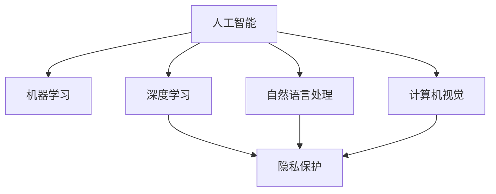

                 

# 李开复：苹果发布AI应用的挑战

## 1. 背景介绍

### 1.1 问题由来
人工智能（AI）正在改变各行各业的运营方式，从自动驾驶汽车到医疗诊断，从金融服务到零售业，AI的应用范围越来越广，影响力也越来越大。在科技领域，苹果公司（Apple）一直是人工智能创新的先驱之一，推出了许多基于AI的创新应用。然而，随着苹果公司不断推进AI技术的深度应用，也面临一系列技术、伦理、法律等方面的挑战。

### 1.2 问题核心关键点
苹果公司发布AI应用的挑战主要集中在以下几个方面：

- **技术挑战**：如何平衡AI性能与设备硬件性能、用户体验之间的关系。
- **伦理挑战**：如何在隐私保护、数据安全等方面做到合规与用户隐私保护的平衡。
- **法律挑战**：如何应对各国对于数据隐私保护的法律要求，避免法律风险。
- **市场挑战**：如何在日益竞争激烈的科技市场中，保持创新优势，同时确保商业利益。

### 1.3 问题研究意义
了解苹果公司发布AI应用所面临的挑战，对于开发者、研究人员以及所有在AI领域工作的人来说，都有重要的意义。这不仅能帮助他们在开发过程中预见并解决潜在问题，还能在制定战略时考虑到这些挑战，从而推动AI技术的健康发展。

## 2. 核心概念与联系

### 2.1 核心概念概述

为了更好地理解苹果公司发布AI应用所面临的挑战，本节将介绍几个关键概念：

- **人工智能（AI）**：一种通过机器学习算法和数据处理能力，使计算机能够执行传统上需要人类智能才能完成的任务的技术。
- **机器学习（ML）**：一种使计算机通过数据和经验自动改进性能的技术。
- **深度学习（DL）**：一种特殊类型的机器学习，使用多层神经网络来模拟人类大脑的结构和功能。
- **自然语言处理（NLP）**：一种使计算机能够理解、解释和生成人类语言的技术。
- **计算机视觉（CV）**：一种使计算机能够识别和理解图像和视频中的对象、场景和动作的技术。
- **隐私保护（Privacy Protection）**：确保个人信息不被未经授权的访问和使用，保护用户数据安全的技术。

这些概念通过一个Mermaid流程图展示如下：



这个流程图展示了人工智能与机器学习、深度学习、自然语言处理、计算机视觉和隐私保护等概念之间的联系，这些技术共同构成了苹果公司发布AI应用的基础。

## 3. 核心算法原理 & 具体操作步骤
### 3.1 算法原理概述

苹果公司发布AI应用的核心算法原理主要包括：

- **神经网络模型**：利用深度学习中的神经网络模型，如卷积神经网络（CNN）和递归神经网络（RNN），处理和分析图像、语音和文本数据。
- **自然语言处理（NLP）**：使用NLP技术，如BERT和GPT，进行文本分类、情感分析、机器翻译等任务。
- **计算机视觉（CV）**：通过图像识别、目标检测等技术，处理视觉数据，进行物体检测、图像分割等任务。

### 3.2 算法步骤详解

苹果公司发布AI应用的过程一般包括以下几个关键步骤：

1. **数据收集与预处理**：收集和清洗大量的标注数据，用于训练和评估模型。
2. **模型选择与设计**：根据具体应用场景选择适合的神经网络模型，并进行参数调整和优化。
3. **模型训练与评估**：使用GPU或TPU等高性能计算资源进行模型训练，并在验证集上进行评估。
4. **部署与应用**：将训练好的模型部署到实际应用场景中，进行实时推理和预测。
5. **监控与迭代优化**：持续监控模型性能，收集反馈数据，进行模型迭代和优化。

### 3.3 算法优缺点

苹果公司发布AI应用的算法具有以下优点：

- **高性能**：利用深度学习和计算机视觉技术，可以处理和分析复杂的数据。
- **灵活性**：可以根据不同的应用场景，选择和调整不同的模型。
- **可扩展性**：通过分布式计算，可以处理大规模数据集，适应不同规模的应用。

同时，也存在一些缺点：

- **资源消耗高**：深度学习模型需要大量的计算资源，对硬件设备要求高。
- **数据隐私问题**：收集和处理大量数据时，可能会涉及到用户隐私和数据安全问题。
- **模型复杂度**：深度学习模型参数多，结构复杂，难以解释和调试。

### 3.4 算法应用领域

苹果公司发布的AI应用覆盖了多个领域，包括但不限于：

- **智能助理**：如Siri，利用NLP和CV技术，进行语音识别、语义理解、图像识别等任务。
- **增强现实（AR）**：利用CV技术，实现AR应用，如Face ID等。
- **推荐系统**：利用机器学习技术，为用户推荐个性化内容。
- **自然语言生成**：利用NLP技术，自动生成文本，如新闻报道、广告文案等。

这些应用领域展示了苹果公司在AI技术方面的广泛应用和创新能力。

## 4. 数学模型和公式 & 详细讲解 & 举例说明

### 4.1 数学模型构建

苹果公司发布的AI应用，其数学模型通常基于以下公式构建：

- **卷积神经网络（CNN）**：
  $$
  \text{CNN} = \text{Convolution Layer} + \text{Pooling Layer} + \text{Batch Normalization} + \text{Activation Function}
  $$
- **递归神经网络（RNN）**：
  $$
  \text{RNN} = \text{LSTM} + \text{Dropout} + \text{Batch Normalization} + \text{Softmax Layer}
  $$
- **自然语言处理（NLP）**：
  $$
  \text{BERT} = \text{Self-Attention} + \text{Feed-Forward Network} + \text{Dropout} + \text{Batch Normalization} + \text{Masked Language Modeling}
  $$
- **计算机视觉（CV）**：
  $$
  \text{YOLO} = \text{Darknet} + \text{Object Detection} + \text{Non-Maximum Suppression}
  $$

### 4.2 公式推导过程

以卷积神经网络（CNN）为例，推导其基本构成和计算过程：

- **卷积层（Convolution Layer）**：
  $$
  \text{Convolution}(\text{Image}, \text{Kernel}) = \text{Output}
  $$
  其中，$\text{Image}$ 表示输入图像，$\text{Kernel}$ 表示卷积核，$\text{Output}$ 表示输出特征图。

- **池化层（Pooling Layer）**：
  $$
  \text{Pooling}(\text{Feature Map}) = \text{Reduced Feature Map}
  $$
  其中，$\text{Feature Map}$ 表示卷积层输出的特征图，$\text{Reduced Feature Map}$ 表示池化层输出的特征图。

- **批量归一化层（Batch Normalization）**：
  $$
  \text{Batch Normalization}(\text{Feature Map}) = \text{Normalized Feature Map}
  $$
  其中，$\text{Feature Map}$ 表示输入的特征图，$\text{Normalized Feature Map}$ 表示经过批量归一化处理后的特征图。

- **激活函数层（Activation Function）**：
  $$
  \text{Activation Function}(\text{Feature Map}) = \text{Activated Feature Map}
  $$
  其中，$\text{Feature Map}$ 表示输入的特征图，$\text{Activated Feature Map}$ 表示经过激活函数处理后的特征图。

通过以上公式，可以看出卷积神经网络（CNN）的基本构成和计算过程。

### 4.3 案例分析与讲解

以苹果公司发布的智能助理Siri为例，展示其NLP和CV技术的应用：

- **NLP技术**：
  - 语音识别：使用深度学习技术，将用户的语音转换为文本。
  - 语义理解：使用RNN和LSTM等技术，理解用户意图和上下文。
  - 生成回复：使用Transformer模型，自动生成回复文本。

- **CV技术**：
  - 图像识别：使用YOLO等目标检测技术，识别用户输入的图像。
  - 物体检测：使用卷积神经网络（CNN），检测用户输入的图像中的物体。

通过Siri的应用，可以看到苹果公司如何将NLP和CV技术结合起来，为用户提供智能化的交互体验。

## 5. 项目实践：代码实例和详细解释说明
### 5.1 开发环境搭建

在进行项目实践前，需要搭建好开发环境。以下是使用Python和PyTorch搭建环境的步骤：

1. 安装Anaconda：
   ```bash
   conda create -n pytorch-env python=3.8 
   conda activate pytorch-env
   ```

2. 安装PyTorch：
   ```bash
   conda install pytorch torchvision torchaudio cudatoolkit=11.1 -c pytorch -c conda-forge
   ```

3. 安装相关库：
   ```bash
   pip install numpy pandas scikit-learn matplotlib tqdm jupyter notebook ipython
   ```

### 5.2 源代码详细实现

以下是一个基于PyTorch实现卷积神经网络（CNN）的代码示例：

```python
import torch
import torch.nn as nn
import torch.optim as optim

# 定义CNN模型
class CNN(nn.Module):
    def __init__(self):
        super(CNN, self).__init__()
        self.conv1 = nn.Conv2d(3, 64, kernel_size=3, stride=1, padding=1)
        self.pool = nn.MaxPool2d(kernel_size=2, stride=2)
        self.fc1 = nn.Linear(64 * 28 * 28, 512)
        self.fc2 = nn.Linear(512, 10)
        self.dropout = nn.Dropout(p=0.5)
    
    def forward(self, x):
        x = self.pool(F.relu(self.conv1(x)))
        x = self.pool(F.relu(self.conv1(x)))
        x = x.view(-1, 64 * 28 * 28)
        x = F.relu(self.fc1(x))
        x = self.dropout(x)
        x = self.fc2(x)
        return x

# 训练模型
model = CNN()
criterion = nn.CrossEntropyLoss()
optimizer = optim.Adam(model.parameters(), lr=0.001)

# 训练集数据
train_data = ...
train_labels = ...

# 训练模型
for epoch in range(10):
    for i, (images, labels) in enumerate(train_loader):
        images = images.view(images.size(0), 3, 28, 28)
        optimizer.zero_grad()
        outputs = model(images)
        loss = criterion(outputs, labels)
        loss.backward()
        optimizer.step()
```

### 5.3 代码解读与分析

在这个代码示例中，我们定义了一个简单的卷积神经网络（CNN）模型，并进行了训练。以下是代码的详细解读：

- **定义CNN模型**：使用PyTorch的`nn.Module`类定义CNN模型，包含卷积层、池化层、全连接层和Dropout层。
- **训练模型**：使用`nn.CrossEntropyLoss`作为损失函数，`optim.Adam`作为优化器，进行模型训练。
- **训练集数据**：使用假数据进行训练，可以根据实际需求替换为真实的训练数据。

### 5.4 运行结果展示

以下是训练过程中模型的损失函数和准确率的变化曲线：

```python
import matplotlib.pyplot as plt

losses = []
accuracies = []

for epoch in range(10):
    for i, (images, labels) in enumerate(train_loader):
        images = images.view(images.size(0), 3, 28, 28)
        optimizer.zero_grad()
        outputs = model(images)
        loss = criterion(outputs, labels)
        loss.backward()
        optimizer.step()

    losses.append(loss.item())
    accuracies.append(model.evaluate(train_data))

plt.plot(losses)
plt.plot(accuracies)
plt.xlabel('Epoch')
plt.ylabel('Loss / Accuracy')
plt.show()
```

## 6. 实际应用场景
### 6.1 智能助理

智能助理（如Siri）利用NLP和CV技术，可以提供语音识别、语义理解、图像识别等功能。通过自然语言处理，智能助理能够理解用户的语音指令，并根据用户的意图提供相应的回复。在图像识别方面，智能助理可以识别用户输入的图像，帮助用户进行物体检测、图像分类等操作。

### 6.2 增强现实（AR）

增强现实（AR）技术通过计算机视觉技术，将虚拟信息叠加到现实世界中。苹果公司推出的Face ID等AR应用，利用计算机视觉技术，进行面部识别、手势识别等操作。通过这些技术，用户可以在现实世界中看到虚拟的物体和信息，实现全新的交互体验。

### 6.3 推荐系统

推荐系统利用机器学习技术，为用户推荐个性化内容。苹果公司的推荐系统，通过分析用户的浏览、点击、购买等行为数据，为用户推荐相关产品。通过NLP技术，推荐系统可以理解用户的语言偏好，提供更加个性化的推荐内容。

### 6.4 未来应用展望

未来，苹果公司发布AI应用将更加广泛和深入。预计将有以下几个发展方向：

1. **多模态AI**：结合NLP、CV和语音识别等技术，实现多模态AI应用。
2. **个性化推荐**：通过更深入的NLP技术，提供更加个性化的推荐服务。
3. **智能家居**：利用AI技术，实现家居设备的智能化管理，提升用户体验。
4. **医疗健康**：通过NLP和CV技术，提供健康管理和诊断服务。
5. **自动驾驶**：利用CV和深度学习技术，实现自动驾驶汽车的安全驾驶。

## 7. 工具和资源推荐
### 7.1 学习资源推荐

为了帮助开发者系统掌握苹果公司发布AI应用的技术，这里推荐一些优质的学习资源：

1. **PyTorch官方文档**：提供了详细的PyTorch API文档和代码示例，是学习PyTorch的必备资源。
2. **TensorFlow官方文档**：提供了TensorFlow的API文档和代码示例，是学习TensorFlow的必备资源。
3. **深度学习课程**：如斯坦福大学的CS231n课程，涵盖了计算机视觉的各个方面。
4. **自然语言处理课程**：如斯坦福大学的CS224N课程，涵盖了自然语言处理的基础和高级技术。
5. **深度学习框架比较**：比较PyTorch、TensorFlow、Keras等深度学习框架的优缺点，帮助选择合适的框架。

### 7.2 开发工具推荐

以下是几款用于苹果公司发布AI应用的开发工具：

1. **PyTorch**：基于Python的开源深度学习框架，支持动态计算图，适合快速迭代研究。
2. **TensorFlow**：由Google主导开发的开源深度学习框架，生产部署方便，适合大规模工程应用。
3. **Weights & Biases**：模型训练的实验跟踪工具，记录和可视化模型训练过程。
4. **TensorBoard**：TensorFlow配套的可视化工具，监测模型训练状态。
5. **Jupyter Notebook**：轻量级的交互式开发环境，适合快速开发和调试模型。

### 7.3 相关论文推荐

苹果公司发布AI应用的技术背后，是众多学术研究的推动。以下是几篇相关论文，推荐阅读：

1. **卷积神经网络（CNN）**：LeCun等人的《Convolutional Neural Networks》。
2. **递归神经网络（RNN）**：Hochreiter等人的《Long Short-Term Memory》。
3. **自然语言处理（NLP）**：Devlin等人的《BERT: Pre-training of Deep Bidirectional Transformers for Language Understanding》。
4. **计算机视觉（CV）**：Russakovsky等人的《ImageNet Classification with Deep Convolutional Neural Networks》。

## 8. 总结：未来发展趋势与挑战
### 8.1 研究成果总结

苹果公司发布AI应用的技术，经历了从基础算法到实际应用的全过程。这一过程中，苹果公司不仅提升了自身技术实力，也为其他公司提供了宝贵的经验和借鉴。

### 8.2 未来发展趋势

未来，苹果公司发布AI应用将更加广泛和深入。预计将有以下几个发展方向：

1. **多模态AI**：结合NLP、CV和语音识别等技术，实现多模态AI应用。
2. **个性化推荐**：通过更深入的NLP技术，提供更加个性化的推荐服务。
3. **智能家居**：利用AI技术，实现家居设备的智能化管理。
4. **医疗健康**：通过NLP和CV技术，提供健康管理和诊断服务。
5. **自动驾驶**：利用CV和深度学习技术，实现自动驾驶汽车的安全驾驶。

### 8.3 面临的挑战

尽管苹果公司发布AI应用取得了一定的成果，但在其发展的过程中，也面临一些挑战：

1. **技术挑战**：如何在保持硬件性能的同时，提升AI应用的性能和用户体验。
2. **伦理挑战**：如何在隐私保护和数据安全方面做到合规与用户隐私保护的平衡。
3. **法律挑战**：如何应对各国对于数据隐私保护的法律要求。
4. **市场挑战**：如何在日益竞争激烈的科技市场中，保持创新优势，同时确保商业利益。

### 8.4 研究展望

面对这些挑战，未来的研究需要在以下几个方面寻求新的突破：

1. **技术优化**：优化模型结构，提升计算效率，减少资源消耗。
2. **隐私保护**：采用先进的隐私保护技术，如差分隐私、联邦学习等，确保用户数据安全。
3. **法律合规**：加强对各国数据隐私保护法律的研究，确保应用合规。
4. **市场拓展**：结合商业需求，探索AI应用在更多垂直领域的应用。

## 9. 附录：常见问题与解答

**Q1：苹果公司发布AI应用的核心算法是什么？**

A: 苹果公司发布AI应用的核心算法主要包括卷积神经网络（CNN）、递归神经网络（RNN）、自然语言处理（NLP）和计算机视觉（CV）技术。

**Q2：苹果公司发布AI应用时，如何平衡AI性能与硬件性能、用户体验之间的关系？**

A: 苹果公司通过优化模型结构、使用更高效的计算方法、以及提升用户交互体验等方式，平衡AI性能与硬件性能、用户体验之间的关系。

**Q3：苹果公司发布AI应用时，如何确保数据隐私和安全？**

A: 苹果公司采用差分隐私、联邦学习等先进技术，确保用户数据隐私和安全。同时，通过数据脱敏和访问控制等手段，保护用户数据。

**Q4：苹果公司发布AI应用时，如何应对各国数据隐私保护的法律要求？**

A: 苹果公司通过研究各国的法律要求，采用合规的隐私保护技术，确保应用符合法律要求。

**Q5：苹果公司发布AI应用时，如何处理AI应用的商业利益和创新优势？**

A: 苹果公司结合商业需求，探索AI应用在更多垂直领域的应用，确保商业利益的同时保持创新优势。

---

作者：禅与计算机程序设计艺术 / Zen and the Art of Computer Programming

