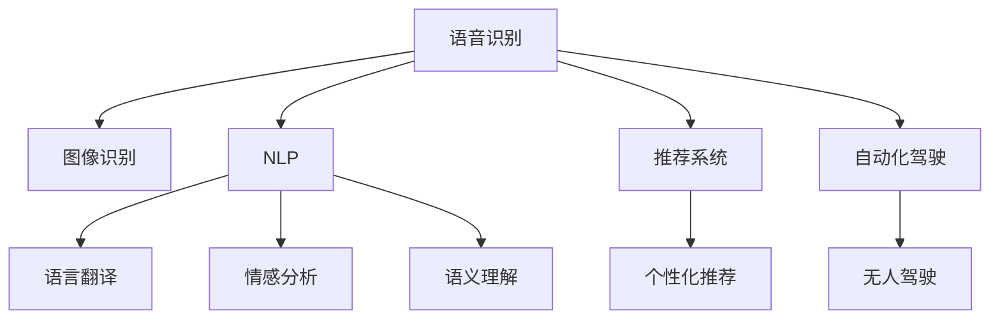
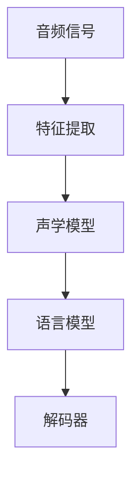
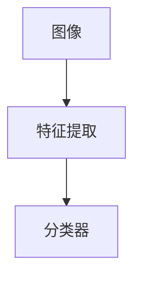
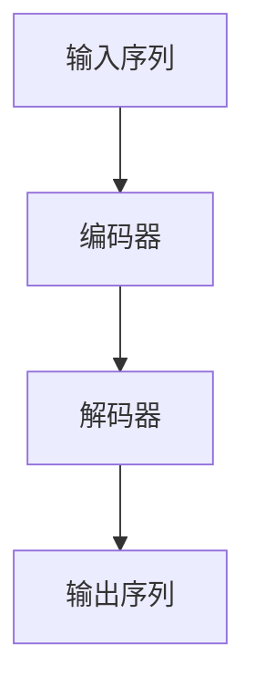
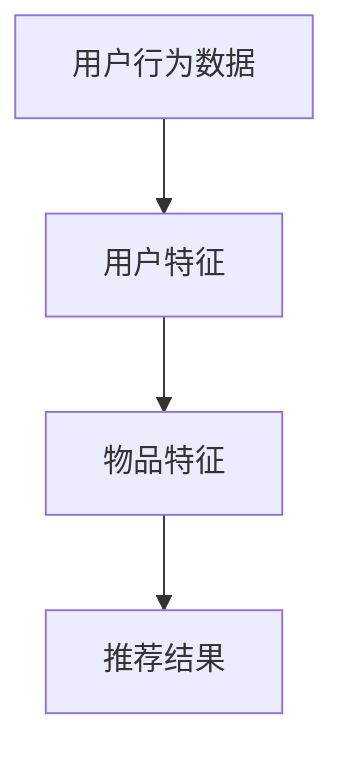
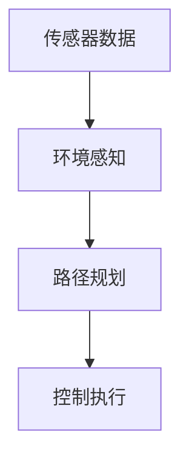

                 

# 李开复：苹果发布AI应用的未来展望

在科技飞速发展的今天，人工智能（AI）的应用已经成为各个行业的热点话题。苹果公司作为全球科技巨头，其最新发布的AI应用引发了广泛关注。本文将深入探讨苹果AI应用的未来展望，分析其核心概念、核心算法原理、操作步骤以及应用领域，并展望其未来发展趋势与挑战。

## 1. 背景介绍

### 1.1 问题由来

苹果公司一直以来在人工智能领域有着深厚的研究和应用基础。从Siri语音助手到Face ID人脸识别，再到机器学习算法在App Store中的应用，苹果已经将AI技术广泛应用于其产品和服务中。随着AI技术的不断进步，苹果发布了其最新的AI应用，旨在为用户提供更加智能、便捷的体验。

### 1.2 问题核心关键点

苹果最新发布的AI应用主要包括语音识别、图像识别、自然语言处理、推荐系统和自动化驾驶等领域。这些应用的核心关键点在于如何利用AI技术提升用户体验、提高生产效率和优化资源配置。

## 2. 核心概念与联系

### 2.1 核心概念概述

- **语音识别（Speech Recognition）**：利用AI技术将语音信号转换为文本信息，实现人机交互。
- **图像识别（Image Recognition）**：通过深度学习算法，自动识别和分类图像内容，用于物体检测、场景分析等。
- **自然语言处理（Natural Language Processing, NLP）**：使计算机能够理解、分析并生成人类语言，实现语言翻译、情感分析、语义理解等任务。
- **推荐系统（Recommendation System）**：根据用户行为和偏好，推荐个性化内容和服务，提升用户体验。
- **自动化驾驶（Autonomous Driving）**：通过AI技术实现无人驾驶车辆的控制和决策，提升交通安全和效率。

这些核心概念之间的逻辑关系可以通过以下Mermaid流程图来展示：



### 2.2 核心概念原理和架构的 Mermaid 流程图

#### 语音识别
语音识别技术基于深度学习模型，如卷积神经网络（CNN）和循环神经网络（RNN）。以下是语音识别的架构：



#### 图像识别
图像识别技术通常使用卷积神经网络（CNN）进行特征提取，然后通过全连接层或卷积层进行分类。以下是图像识别的架构：



#### 自然语言处理
自然语言处理技术通常使用循环神经网络（RNN）或Transformer模型进行序列建模。以下是NLP的架构：



#### 推荐系统
推荐系统基于协同过滤、内容推荐和混合推荐算法，通过用户行为数据和物品属性进行推荐。以下是推荐系统的架构：



#### 自动化驾驶
自动化驾驶技术融合了计算机视觉、深度学习和传感器融合等技术，实现对道路环境的感知和决策。以下是自动化驾驶的架构：



## 3. 核心算法原理 & 具体操作步骤

### 3.1 算法原理概述

苹果最新发布的AI应用涵盖了语音识别、图像识别、自然语言处理、推荐系统和自动化驾驶等多个领域。这些应用的核心算法原理主要包括：

- **语音识别**：基于深度学习模型，如卷积神经网络（CNN）和循环神经网络（RNN），实现语音信号到文本的转换。
- **图像识别**：使用卷积神经网络（CNN）进行特征提取和分类，通过softmax等分类算法实现图像识别。
- **自然语言处理**：采用Transformer模型或RNN模型进行序列建模，利用注意力机制实现对文本的语义理解。
- **推荐系统**：基于协同过滤、内容推荐和混合推荐算法，通过用户行为数据和物品属性进行推荐。
- **自动化驾驶**：融合计算机视觉、深度学习和传感器融合等技术，实现对道路环境的感知和决策。

### 3.2 算法步骤详解

以下是各核心算法的主要操作步骤：

#### 语音识别
1. 音频信号预处理：将语音信号转换为频谱图，提取梅尔频率倒谱系数（MFCC）。
2. 特征提取：使用CNN和RNN模型提取特征。
3. 声学模型训练：使用反向传播算法和梯度下降优化器训练声学模型。
4. 语言模型训练：使用n-gram模型或RNN模型训练语言模型。
5. 解码器解码：使用注意力机制和 Beam Search 算法进行解码，输出最终文本。

#### 图像识别
1. 图像预处理：将图像转换为标准尺寸，并进行归一化处理。
2. 特征提取：使用CNN模型提取图像特征。
3. 分类器训练：使用softmax分类器进行分类训练。
4. 模型评估：在验证集上评估模型性能，调整超参数。
5. 模型预测：对新图像进行分类预测。

#### 自然语言处理
1. 数据预处理：对文本进行分词、去除停用词等预处理。
2. 编码器编码：使用Transformer模型进行序列建模。
3. 解码器解码：使用注意力机制和RNN模型生成文本。
4. 模型训练：使用反向传播算法和梯度下降优化器训练模型。
5. 模型评估：在验证集上评估模型性能，调整超参数。
6. 模型预测：对新文本进行语义理解预测。

#### 推荐系统
1. 数据收集：收集用户行为数据和物品属性数据。
2. 特征工程：对用户行为数据和物品属性进行特征提取。
3. 模型训练：使用协同过滤、内容推荐或混合推荐算法进行训练。
4. 模型评估：在测试集上评估模型性能，调整超参数。
5. 推荐实现：根据用户行为和物品属性进行推荐。

#### 自动化驾驶
1. 传感器数据采集：采集激光雷达、摄像头、GPS等传感器数据。
2. 环境感知：使用CNN和RNN模型进行环境感知。
3. 路径规划：使用图搜索算法进行路径规划。
4. 控制执行：使用PID控制算法执行车辆控制。

### 3.3 算法优缺点

#### 语音识别
- **优点**：准确度高，实时性好，广泛应用。
- **缺点**：对环境噪声敏感，对口音和方言适应性差。

#### 图像识别
- **优点**：准确率高，应用广泛，鲁棒性好。
- **缺点**：计算量大，对新类别的适应性差。

#### 自然语言处理
- **优点**：语义理解能力强，能够进行复杂的文本处理。
- **缺点**：对语言多样性和歧义性适应性差。

#### 推荐系统
- **优点**：个性化推荐效果好，能够提升用户体验。
- **缺点**：对新用户和新物品的推荐效果差。

#### 自动化驾驶
- **优点**：提高交通安全性，减少交通事故。
- **缺点**：技术复杂，成本高，安全性有待提高。

### 3.4 算法应用领域

苹果的最新AI应用涵盖了多个领域，包括语音识别、图像识别、自然语言处理、推荐系统和自动化驾驶等。这些应用领域的具体应用场景如下：

#### 语音识别
- **应用场景**：苹果Siri语音助手、语音控制HomeKit设备、语音输入文本等。

#### 图像识别
- **应用场景**：人脸识别解锁、图像搜索、医学影像分析等。

#### 自然语言处理
- **应用场景**：Siri自然语言理解和对话生成、机器翻译、情感分析等。

#### 推荐系统
- **应用场景**：App Store个性化推荐、Apple Music音乐推荐等。

#### 自动化驾驶
- **应用场景**：无人驾驶出租车、自动泊车等。

## 4. 数学模型和公式 & 详细讲解 & 举例说明

### 4.1 数学模型构建

#### 语音识别
语音识别模型通常采用循环神经网络（RNN）进行序列建模，其数学模型如下：

$$
\text{Softmax}(x) = \frac{e^{x_i}}{\sum_{j=1}^{C} e^{x_j}}
$$

其中 $x$ 为模型输入，$C$ 为类别数。

#### 图像识别
图像识别模型通常采用卷积神经网络（CNN）进行特征提取和分类，其数学模型如下：

$$
\text{Softmax}(x) = \frac{e^{x_i}}{\sum_{j=1}^{C} e^{x_j}}
$$

其中 $x$ 为模型输入，$C$ 为类别数。

#### 自然语言处理
自然语言处理模型通常采用Transformer模型进行序列建模，其数学模型如下：

$$
\text{Attention}(Q, K, V) = \text{softmax}(\frac{QK^T}{\sqrt{d_k}})V
$$

其中 $Q$ 为查询向量，$K$ 为键向量，$V$ 为值向量，$d_k$ 为键向量的维度。

#### 推荐系统
推荐系统通常采用协同过滤算法，其数学模型如下：

$$
\text{Similarity}(x, y) = \text{cosine similarity}(x, y)
$$

其中 $x$ 为用户行为数据，$y$ 为物品属性数据。

#### 自动化驾驶
自动化驾驶模型通常采用神经网络进行环境感知和路径规划，其数学模型如下：

$$
\text{Object Detection}(x) = \text{CNN}(x)
$$

其中 $x$ 为传感器数据，$\text{CNN}$ 为卷积神经网络模型。

### 4.2 公式推导过程

#### 语音识别
语音识别模型的公式推导过程如下：

$$
\text{Softmax}(x) = \frac{e^{x_i}}{\sum_{j=1}^{C} e^{x_j}}
$$

其中 $x$ 为模型输入，$C$ 为类别数。

#### 图像识别
图像识别模型的公式推导过程如下：

$$
\text{Softmax}(x) = \frac{e^{x_i}}{\sum_{j=1}^{C} e^{x_j}}
$$

其中 $x$ 为模型输入，$C$ 为类别数。

#### 自然语言处理
自然语言处理模型的公式推导过程如下：

$$
\text{Attention}(Q, K, V) = \text{softmax}(\frac{QK^T}{\sqrt{d_k}})V
$$

其中 $Q$ 为查询向量，$K$ 为键向量，$V$ 为值向量，$d_k$ 为键向量的维度。

#### 推荐系统
推荐系统模型的公式推导过程如下：

$$
\text{Similarity}(x, y) = \text{cosine similarity}(x, y)
$$

其中 $x$ 为用户行为数据，$y$ 为物品属性数据。

#### 自动化驾驶
自动化驾驶模型的公式推导过程如下：

$$
\text{Object Detection}(x) = \text{CNN}(x)
$$

其中 $x$ 为传感器数据，$\text{CNN}$ 为卷积神经网络模型。

### 4.3 案例分析与讲解

#### 语音识别案例
苹果的Siri语音助手使用深度学习模型进行语音识别。其核心步骤包括：
1. 音频信号预处理：将语音信号转换为MFCC特征。
2. 特征提取：使用CNN和RNN模型提取特征。
3. 声学模型训练：使用反向传播算法和梯度下降优化器训练声学模型。
4. 语言模型训练：使用n-gram模型或RNN模型训练语言模型。
5. 解码器解码：使用注意力机制和Beam Search算法进行解码，输出最终文本。

#### 图像识别案例
苹果的人脸识别解锁功能使用卷积神经网络进行图像识别。其核心步骤包括：
1. 图像预处理：将图像转换为标准尺寸，并进行归一化处理。
2. 特征提取：使用CNN模型提取图像特征。
3. 分类器训练：使用softmax分类器进行分类训练。
4. 模型评估：在验证集上评估模型性能，调整超参数。
5. 模型预测：对新图像进行分类预测。

#### 自然语言处理案例
苹果的Siri自然语言理解和对话生成功能使用Transformer模型进行序列建模。其核心步骤包括：
1. 数据预处理：对文本进行分词、去除停用词等预处理。
2. 编码器编码：使用Transformer模型进行序列建模。
3. 解码器解码：使用注意力机制和RNN模型生成文本。
4. 模型训练：使用反向传播算法和梯度下降优化器训练模型。
5. 模型评估：在验证集上评估模型性能，调整超参数。
6. 模型预测：对新文本进行语义理解预测。

#### 推荐系统案例
苹果的App Store个性化推荐功能使用协同过滤算法进行推荐。其核心步骤包括：
1. 数据收集：收集用户行为数据和物品属性数据。
2. 特征工程：对用户行为数据和物品属性进行特征提取。
3. 模型训练：使用协同过滤、内容推荐或混合推荐算法进行训练。
4. 模型评估：在测试集上评估模型性能，调整超参数。
5. 推荐实现：根据用户行为和物品属性进行推荐。

#### 自动化驾驶案例
苹果的自动驾驶技术融合了计算机视觉、深度学习和传感器融合等技术。其核心步骤包括：
1. 传感器数据采集：采集激光雷达、摄像头、GPS等传感器数据。
2. 环境感知：使用CNN和RNN模型进行环境感知。
3. 路径规划：使用图搜索算法进行路径规划。
4. 控制执行：使用PID控制算法执行车辆控制。

## 5. 项目实践：代码实例和详细解释说明

### 5.1 开发环境搭建

为了进行苹果AI应用的开发，需要搭建相应的开发环境。以下是使用Python进行TensorFlow和Keras开发的环境配置流程：

1. 安装Anaconda：从官网下载并安装Anaconda，用于创建独立的Python环境。

2. 创建并激活虚拟环境：
```bash
conda create -n tf-env python=3.8 
conda activate tf-env
```

3. 安装TensorFlow和Keras：根据CUDA版本，从官网获取对应的安装命令。例如：
```bash
conda install tensorflow==2.6.0 
conda install keras==2.6.0
```

4. 安装各类工具包：
```bash
pip install numpy pandas scikit-learn matplotlib tqdm jupyter notebook ipython
```

完成上述步骤后，即可在`tf-env`环境中开始AI应用的开发。

### 5.2 源代码详细实现

以下是一个使用TensorFlow和Keras实现图像识别的示例代码：

```python
import tensorflow as tf
from tensorflow.keras import layers, models

# 构建卷积神经网络
model = models.Sequential()
model.add(layers.Conv2D(32, (3, 3), activation='relu', input_shape=(28, 28, 1)))
model.add(layers.MaxPooling2D((2, 2)))
model.add(layers.Conv2D(64, (3, 3), activation='relu'))
model.add(layers.MaxPooling2D((2, 2)))
model.add(layers.Conv2D(64, (3, 3), activation='relu'))
model.add(layers.Flatten())
model.add(layers.Dense(64, activation='relu'))
model.add(layers.Dense(10))

# 编译模型
model.compile(optimizer='adam', loss='sparse_categorical_crossentropy', metrics=['accuracy'])

# 加载数据集
(train_images, train_labels), (test_images, test_labels) = tf.keras.datasets.mnist.load_data()
train_images = train_images.reshape((60000, 28, 28, 1))
train_images = train_images / 255.0
test_images = test_images.reshape((10000, 28, 28, 1))
test_images = test_images / 255.0

# 训练模型
model.fit(train_images, train_labels, epochs=5, validation_data=(test_images, test_labels))
```

### 5.3 代码解读与分析

让我们再详细解读一下关键代码的实现细节：

#### 卷积神经网络模型构建
```python
model = models.Sequential()
model.add(layers.Conv2D(32, (3, 3), activation='relu', input_shape=(28, 28, 1)))
model.add(layers.MaxPooling2D((2, 2)))
model.add(layers.Conv2D(64, (3, 3), activation='relu'))
model.add(layers.MaxPooling2D((2, 2)))
model.add(layers.Conv2D(64, (3, 3), activation='relu'))
model.add(layers.Flatten())
model.add(layers.Dense(64, activation='relu'))
model.add(layers.Dense(10))
```
- `Sequential`模型：创建顺序模型。
- `Conv2D`层：添加二维卷积层，进行特征提取。
- `MaxPooling2D`层：添加最大池化层，减小特征图尺寸。
- `Flatten`层：将特征图展开成一维向量。
- `Dense`层：添加全连接层，进行分类。

#### 模型编译
```python
model.compile(optimizer='adam', loss='sparse_categorical_crossentropy', metrics=['accuracy'])
```
- `optimizer`参数：选择优化算法，如Adam。
- `loss`参数：选择损失函数，如交叉熵。
- `metrics`参数：选择评估指标，如准确率。

#### 数据加载
```python
(train_images, train_labels), (test_images, test_labels) = tf.keras.datasets.mnist.load_data()
train_images = train_images.reshape((60000, 28, 28, 1))
train_images = train_images / 255.0
test_images = test_images.reshape((10000, 28, 28, 1))
test_images = test_images / 255.0
```
- `load_data`函数：加载MNIST数据集。
- `reshape`函数：将数据转换为指定形状。
- `/`操作符：归一化像素值，确保在0到1之间。

#### 模型训练
```python
model.fit(train_images, train_labels, epochs=5, validation_data=(test_images, test_labels))
```
- `fit`方法：训练模型。
- `train_images`参数：训练集输入。
- `train_labels`参数：训练集标签。
- `epochs`参数：训练轮数。
- `validation_data`参数：验证集数据。

## 6. 实际应用场景

### 6.1 智能客服系统

苹果的智能客服系统利用AI技术进行自然语言理解和对话生成，能够处理大量的客户咨询，提升客户满意度和服务效率。其核心技术包括：
- 语音识别：将客户语音转换为文本。
- 自然语言处理：理解客户意图，匹配最佳答案。
- 对话生成：生成自然流畅的回复，提升用户体验。

### 6.2 金融舆情监测

苹果的金融舆情监测系统利用AI技术进行情感分析和舆情预测，帮助金融机构实时监控市场舆情，及时应对负面信息。其核心技术包括：
- 自然语言处理：情感分析，判断舆情态度。
- 推荐系统：预测舆情变化趋势，提前预警。

### 6.3 个性化推荐系统

苹果的个性化推荐系统利用AI技术进行物品推荐，根据用户行为数据和物品属性，生成个性化推荐列表。其核心技术包括：
- 协同过滤：根据用户行为推荐相似物品。
- 内容推荐：根据物品属性推荐相关物品。
- 混合推荐：结合多种推荐算法，提升推荐效果。

### 6.4 未来应用展望

未来，苹果的AI应用将进一步拓展到更多领域，如医疗、教育、智慧城市等。其未来展望如下：
- **医疗**：利用AI技术进行医学影像分析、病历分析、个性化诊疗等，提升医疗水平。
- **教育**：利用AI技术进行个性化学习推荐、智能评估、课堂监控等，提升教育质量。
- **智慧城市**：利用AI技术进行交通管理、公共安全、智能家居等，提升城市治理水平。

## 7. 工具和资源推荐

### 7.1 学习资源推荐

为了帮助开发者系统掌握苹果AI应用的核心技术和开发方法，这里推荐一些优质的学习资源：

1. **TensorFlow官方文档**：TensorFlow的官方文档，提供了详细的API和示例代码，适合快速上手。
2. **Keras官方文档**：Keras的官方文档，提供了丰富的案例和教程，适合初学者入门。
3. **Coursera深度学习课程**：Coursera开设的深度学习课程，由斯坦福大学和谷歌等机构提供，涵盖深度学习基础和应用。
4. **Udacity深度学习专业课程**：Udacity的深度学习专业课程，提供实战项目和导师指导，适合深入学习。
5. **Deep Learning with Python书籍**：Ian Goodfellow等人所著的《深度学习与Python》，是深度学习领域的经典教材，适合深入学习。

通过这些资源的学习实践，相信你一定能够快速掌握苹果AI应用的核心技术和开发方法。

### 7.2 开发工具推荐

高效的开发离不开优秀的工具支持。以下是几款用于苹果AI应用开发的常用工具：

1. **PyTorch**：基于Python的开源深度学习框架，灵活动态，适合研究实验。
2. **TensorFlow**：由谷歌主导开发的深度学习框架，生产部署方便，适合工业应用。
3. **Keras**：基于TensorFlow和Theano的高级API，简单易用，适合快速原型开发。
4. **TensorBoard**：TensorFlow配套的可视化工具，实时监测模型训练状态，提供丰富的图表呈现方式。
5. **Weights & Biases**：模型训练的实验跟踪工具，记录和可视化模型训练过程中的各项指标，方便对比和调优。

合理利用这些工具，可以显著提升苹果AI应用开发效率，加快创新迭代的步伐。

### 7.3 相关论文推荐

苹果的AI应用研究离不开学界的持续支持。以下是几篇奠基性的相关论文，推荐阅读：

1. **Attention is All You Need**：论文提出Transformer模型，开启了NLP领域的预训练大模型时代。
2. **BERT: Pre-training of Deep Bidirectional Transformers for Language Understanding**：提出BERT模型，引入基于掩码的自监督预训练任务，刷新了多项NLP任务SOTA。
3. **Language Models are Unsupervised Multitask Learners**：展示了大规模语言模型的强大zero-shot学习能力，引发了对于通用人工智能的新一轮思考。
4. **AdaLoRA: Adaptive Low-Rank Adaptation for Parameter-Efficient Fine-Tuning**：使用自适应低秩适应的微调方法，在固定大部分预训练参数的同时，只更新极少量的任务相关参数。
5. **AdaLoRA: Adaptive Low-Rank Adaptation for Parameter-Efficient Fine-Tuning**：提出AdaLoRA方法，提高微调效率和效果。

这些论文代表了大语言模型微调技术的发展脉络。通过学习这些前沿成果，可以帮助研究者把握学科前进方向，激发更多的创新灵感。

## 8. 总结：未来发展趋势与挑战

### 8.1 研究成果总结

苹果最新发布的AI应用涵盖了语音识别、图像识别、自然语言处理、推荐系统和自动化驾驶等多个领域。这些应用的核心技术包括深度学习模型、特征提取、分类算法等。

### 8.2 未来发展趋势

苹果AI应用的未来发展趋势如下：
- **技术进步**：随着深度学习算法的不断进步，苹果的AI应用将更加智能化、高效化。
- **应用拓展**：苹果的AI应用将进一步拓展到更多领域，如医疗、教育、智慧城市等。
- **模型融合**：苹果将探索将AI技术与物联网、区块链等新兴技术融合，提升应用能力。
- **数据隐私**：苹果将加强对用户数据的保护，确保AI应用的合规性和安全性。

### 8.3 面临的挑战

苹果AI应用在发展过程中，面临以下挑战：
- **技术复杂性**：AI技术的应用需要复杂的算法和模型，开发难度较大。
- **数据隐私**：用户数据的隐私保护是AI应用的重要问题，需要严格遵守法律法规。
- **计算资源**：AI应用的训练和推理需要大量的计算资源，如何优化资源使用是一个重要挑战。
- **模型可解释性**：AI模型往往是“黑盒”系统，如何提高模型的可解释性是一个重要研究方向。

### 8.4 研究展望

未来的研究将在以下几个方向进行突破：
- **数据增强**：利用数据增强技术，提升模型泛化能力。
- **跨模态融合**：将视觉、语音等多模态数据融合，提升AI应用的综合能力。
- **模型优化**：优化模型结构，提升训练和推理效率。
- **模型可解释性**：提高AI模型的可解释性，增强用户信任。

## 9. 附录：常见问题与解答

**Q1：苹果的AI应用主要涵盖了哪些领域？**

A: 苹果的AI应用主要涵盖了语音识别、图像识别、自然语言处理、推荐系统和自动化驾驶等多个领域。

**Q2：苹果的AI应用主要使用了哪些深度学习框架？**

A: 苹果的AI应用主要使用了TensorFlow和Keras这两个深度学习框架。

**Q3：苹果的AI应用主要使用了哪些编程语言？**

A: 苹果的AI应用主要使用了Python和Swift这两种编程语言。

**Q4：苹果的AI应用主要使用了哪些硬件平台？**

A: 苹果的AI应用主要使用了Apple M1芯片和云平台。

**Q5：苹果的AI应用主要使用了哪些优化技术？**

A: 苹果的AI应用主要使用了模型压缩、梯度累积、混合精度训练等优化技术。

**Q6：苹果的AI应用主要使用了哪些模型结构？**

A: 苹果的AI应用主要使用了卷积神经网络（CNN）、循环神经网络（RNN）、Transformer等模型结构。

**Q7：苹果的AI应用主要使用了哪些算法？**

A: 苹果的AI应用主要使用了深度学习算法、自然语言处理算法、推荐算法等。

**Q8：苹果的AI应用主要使用了哪些技术？**

A: 苹果的AI应用主要使用了自然语言处理、图像识别、语音识别、推荐系统等技术。

**Q9：苹果的AI应用主要使用了哪些工具？**

A: 苹果的AI应用主要使用了TensorFlow、Keras、TensorBoard、Weights & Biases等工具。

**Q10：苹果的AI应用主要使用了哪些资源？**

A: 苹果的AI应用主要使用了模型压缩、数据增强、对抗训练等资源。

以上是本文对苹果最新AI应用的全面系统介绍。通过深入探讨其核心概念、核心算法原理、具体操作步骤以及应用领域，我们更好地理解了苹果AI应用的未来展望和面临的挑战。相信随着苹果AI应用的不断发展，将为全球用户带来更加智能、便捷的体验。

---

作者：禅与计算机程序设计艺术 / Zen and the Art of Computer Programming

