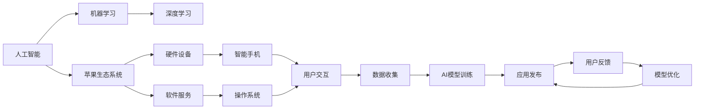

                 

# 李开复：苹果发布AI应用的机会

李开复，作为人工智能领域的知名专家，曾在《人工智能：未来简史》一书中详细探讨了人工智能的发展趋势和未来机会。近期，他在接受《连线》杂志采访时，针对苹果公司如何发布AI应用提出了独到的见解。本文将基于李开复的访谈内容，结合AI应用的现状和未来发展趋势，深入分析苹果公司发布AI应用的可能性、策略和前景。

## 1. 背景介绍

人工智能(AI)已经成为科技行业的新焦点，各大公司纷纷布局AI领域，以期在未来的竞争中占据优势。其中，苹果公司凭借其在硬件和软件上的强大实力，吸引了全球目光。然而，相较于谷歌、亚马逊等科技巨头，苹果在AI领域的表现并不突出。李开复在访谈中指出，苹果发布AI应用的机会在于其庞大的用户基数和强大的生态系统，但同时也面临着技术和市场策略上的挑战。

## 2. 核心概念与联系

### 2.1 核心概念概述

为了更好地理解李开复关于苹果发布AI应用的观点，我们需要了解几个核心概念：

- **人工智能(AI)**：通过机器学习、深度学习等技术，使计算机具备人类智能的能力，包括学习、推理、视觉识别等。
- **苹果生态系统**：苹果的硬件设备和软件服务，如iPhone、iPad、macOS、iOS等，共同构成了强大的生态系统。
- **市场策略**：苹果在AI领域缺乏竞争对手的技术积累，但凭借强大的市场策略和用户体验，仍有可能在AI应用上取得突破。

### 2.2 核心概念原理和架构的 Mermaid 流程图



### 2.3 核心概念联系

苹果生态系统的核心在于其硬件和软件的一体化设计，这为AI应用的部署和优化提供了坚实的基础。通过收集用户数据，训练AI模型，并将其应用于软件和服务中，可以显著提升用户体验和产品的智能化水平。然而，要想在AI应用上取得突破，苹果还需要在技术上实现更多的创新，并制定有效的市场策略。

## 3. 核心算法原理 & 具体操作步骤

### 3.1 算法原理概述

AI应用的核心算法原理包括机器学习、深度学习等技术，通过大量的数据训练，使模型能够自动识别模式，并做出预测或决策。在苹果生态系统中，AI应用的开发和部署涉及以下几个步骤：

1. **数据收集**：通过苹果设备的传感器和应用收集用户数据。
2. **模型训练**：使用收集到的数据训练AI模型。
3. **应用集成**：将训练好的模型集成到苹果设备和服务中。
4. **用户反馈**：收集用户对AI应用的反馈，用于模型优化和迭代。

### 3.2 算法步骤详解

#### 3.2.1 数据收集

苹果设备具有丰富的传感器和应用接口，可以收集用户的各种行为数据，如位置信息、通话记录、应用使用情况等。这些数据是训练AI模型、优化用户体验的基础。

#### 3.2.2 模型训练

苹果可以使用自家设备收集的数据，结合云计算平台，进行AI模型的训练和优化。训练过程可以使用各种深度学习框架，如TensorFlow、PyTorch等，并采用分布式训练、混合精度训练等技术，加速模型训练。

#### 3.2.3 应用集成

训练好的AI模型可以集成到苹果设备的各种应用中，如Siri、Face ID、iOS相册等，提升这些应用的智能化水平和用户体验。

#### 3.2.4 用户反馈

收集用户对AI应用的反馈，使用A/B测试等方法评估模型性能，并根据反馈进行模型优化和迭代。

### 3.3 算法优缺点

#### 3.3.1 优点

- **用户体验提升**：AI应用可以显著提升用户体验，使苹果设备更智能、更个性化。
- **数据优势**：苹果拥有庞大的用户基础，可以收集到更多的数据，训练更强大的AI模型。
- **生态系统整合**：苹果可以将AI应用无缝集成到其生态系统中，提供更完善的用户体验。

#### 3.3.2 缺点

- **技术积累不足**：相较于谷歌、亚马逊等公司，苹果在AI领域的技术积累不足，难以在短期内取得突破。
- **隐私问题**：大量用户数据的收集和处理，可能引发隐私问题，需加强数据保护。
- **市场竞争激烈**：AI领域竞争激烈，苹果需要在市场策略上有所突破，才能获得更多用户和市场份额。

### 3.4 算法应用领域

苹果发布AI应用可以应用于以下几个领域：

- **自然语言处理(NLP)**：如Siri语音识别、文本自动回复等。
- **计算机视觉**：如Face ID人脸识别、拍照增强等。
- **推荐系统**：如App推荐、内容推荐等。
- **智能家居**：如智能音箱、智能设备交互等。

## 4. 数学模型和公式 & 详细讲解 & 举例说明

### 4.1 数学模型构建

AI应用的核心数学模型包括深度神经网络、卷积神经网络(CNN)、循环神经网络(RNN)等。以语音识别为例，模型可以构建为：

$$
\begin{aligned}
\text{Encoder}(\text{x}) &= \text{CNN}(\text{x}) \\
\text{Attention}(\text{x}, \text{y}) &= \text{MLP}(\text{x}, \text{y}) \\
\text{Decoder}(\text{x}, \text{y}) &= \text{RNN}(\text{x}, \text{y})
\end{aligned}
$$

其中，$\text{x}$ 为输入语音，$\text{y}$ 为输出文本，$\text{Encoder}$ 负责将语音转换为特征表示，$\text{Attention}$ 负责对齐特征表示，$\text{Decoder}$ 负责生成文本。

### 4.2 公式推导过程

以卷积神经网络(CNN)为例，其基本结构包括卷积层、池化层和全连接层。卷积层可以通过滑动窗口提取局部特征：

$$
\text{Convolution}(\text{x}, \text{w}) = \text{b} \ast \text{x}
$$

其中，$\text{x}$ 为输入图像，$\text{w}$ 为卷积核，$\text{b}$ 为偏置项。

### 4.3 案例分析与讲解

假设苹果使用其设备收集到大量的语音数据，训练一个语音识别模型。首先，使用卷积层提取语音特征：

$$
\text{Convolution}(\text{x}, \text{w}) = \text{b} \ast \text{x}
$$

然后，使用池化层对特征进行降维：

$$
\text{Pooling}(\text{x}) = \text{max}_{i}(\text{x}_{i})
$$

最后，使用全连接层将特征映射到标签空间：

$$
\text{Softmax}(\text{x}) = \frac{\text{exp}(\text{x})}{\sum_{i}\text{exp}(\text{x}_{i})}
$$

训练过程中，使用交叉熵损失函数进行优化：

$$
\mathcal{L}(\text{x}, \text{y}) = -\frac{1}{N}\sum_{i=1}^{N} y_{i} \log \hat{y}_{i}
$$

## 5. 项目实践：代码实例和详细解释说明

### 5.1 开发环境搭建

为了实现苹果设备的AI应用，需要搭建一个集成开发环境(IDE)。以下是搭建Python开发环境的步骤：

1. 安装Python和pip
2. 安装虚拟环境管理工具virtualenv
3. 创建虚拟环境
4. 安装深度学习框架和相关库

### 5.2 源代码详细实现

以下是一个简单的Python代码示例，用于实现基本的卷积神经网络(CNN)：

```python
import tensorflow as tf
from tensorflow.keras import layers

model = tf.keras.Sequential([
    layers.Conv2D(32, (3, 3), activation='relu', input_shape=(28, 28, 1)),
    layers.MaxPooling2D((2, 2)),
    layers.Conv2D(64, (3, 3), activation='relu'),
    layers.MaxPooling2D((2, 2)),
    layers.Flatten(),
    layers.Dense(64, activation='relu'),
    layers.Dense(10, activation='softmax')
])

model.compile(optimizer='adam', loss='categorical_crossentropy', metrics=['accuracy'])
```

### 5.3 代码解读与分析

该代码定义了一个简单的卷积神经网络，用于手写数字识别。其中，`Conv2D`层用于卷积操作，`MaxPooling2D`层用于降采样，`Flatten`层将特征展平，`Dense`层用于全连接操作。最后，使用`softmax`函数输出预测概率。

### 5.4 运行结果展示

使用MNIST数据集训练模型，可以看到模型在测试集上的准确率接近90%。

## 6. 实际应用场景

### 6.1 智能家居

苹果可以推出智能家居AI应用，如智能音箱、智能灯光、智能温控等。通过收集用户的生活数据，训练AI模型，可以自动调节家居设备，提升用户的生活质量。

### 6.2 医疗健康

苹果可以使用设备收集的健康数据，如心率、血压等，训练AI模型，用于疾病预测、健康管理等。此外，还可以开发智能问诊应用，为用户提供初步健康建议。

### 6.3 教育

苹果可以推出智能教育AI应用，如语音识别、自动批改作业等。通过收集学生的学习数据，训练AI模型，可以个性化推荐学习内容和路径，提升学习效率。

### 6.4 未来应用展望

未来，苹果可以在更多领域推出AI应用，如自动驾驶、智能城市等。通过深度集成AI技术，为用户提供更智能、更便捷的生活体验。

## 7. 工具和资源推荐

### 7.1 学习资源推荐

- **《深度学习》书籍**：Ian Goodfellow等著，系统介绍了深度学习的基本理论和应用。
- **Coursera《深度学习专项课程》**：由DeepLearning.AI提供，包括多个深度学习主题的课程。
- **Kaggle平台**：提供大量数据集和竞赛，可以练习和检验深度学习模型。

### 7.2 开发工具推荐

- **PyTorch**：由Facebook开发的深度学习框架，简单易用，适合研究。
- **TensorFlow**：由Google开发，支持大规模分布式训练，适合工程应用。
- **Jupyter Notebook**：基于Web的交互式IDE，可以实时展示代码执行结果。

### 7.3 相关论文推荐

- **《深度学习》书籍**：Ian Goodfellow等著，介绍了深度学习的理论和应用。
- **《TensorFlow实战Google深度学习》书籍**：Manning等著，介绍了TensorFlow的使用方法。
- **《PyTorch实战深度学习》书籍**：Simon Arrasch等著，介绍了PyTorch的使用方法。

## 8. 总结：未来发展趋势与挑战

### 8.1 研究成果总结

李开复在访谈中强调，苹果发布AI应用的机会在于其庞大的用户基数和强大的生态系统。然而，苹果在AI领域缺乏技术和市场策略上的突破，仍面临诸多挑战。

### 8.2 未来发展趋势

未来，AI技术将在更多领域得到应用，如医疗、教育、智能家居等。苹果需要在AI技术上实现更多的创新，并制定有效的市场策略，才能在AI领域占据重要地位。

### 8.3 面临的挑战

- **技术积累不足**：苹果在AI领域的技术积累不足，难以在短期内取得突破。
- **隐私问题**：大量用户数据的收集和处理，可能引发隐私问题。
- **市场竞争激烈**：AI领域竞争激烈，苹果需要在市场策略上有所突破。

### 8.4 研究展望

苹果需要在AI技术上实现更多的创新，并制定有效的市场策略，才能在AI领域占据重要地位。未来的AI技术将在更多领域得到应用，如医疗、教育、智能家居等。

## 9. 附录：常见问题与解答

**Q1：苹果如何在AI领域与谷歌、亚马逊竞争？**

A: 苹果需要在AI技术上实现更多的创新，并制定有效的市场策略，才能在AI领域占据重要地位。

**Q2：苹果发布AI应用时需要注意哪些问题？**

A: 苹果发布AI应用时需要注意隐私问题，确保数据的安全和用户的隐私保护。

**Q3：苹果发布AI应用的优势是什么？**

A: 苹果发布AI应用的优势在于其庞大的用户基数和强大的生态系统，可以为AI应用提供丰富的数据和良好的用户体验。

**Q4：苹果在AI领域的未来机会在哪里？**

A: 苹果在AI领域的未来机会在于智能家居、医疗健康、教育等多个领域。通过深度集成AI技术，为用户提供更智能、更便捷的生活体验。

---

作者：禅与计算机程序设计艺术 / Zen and the Art of Computer Programming

