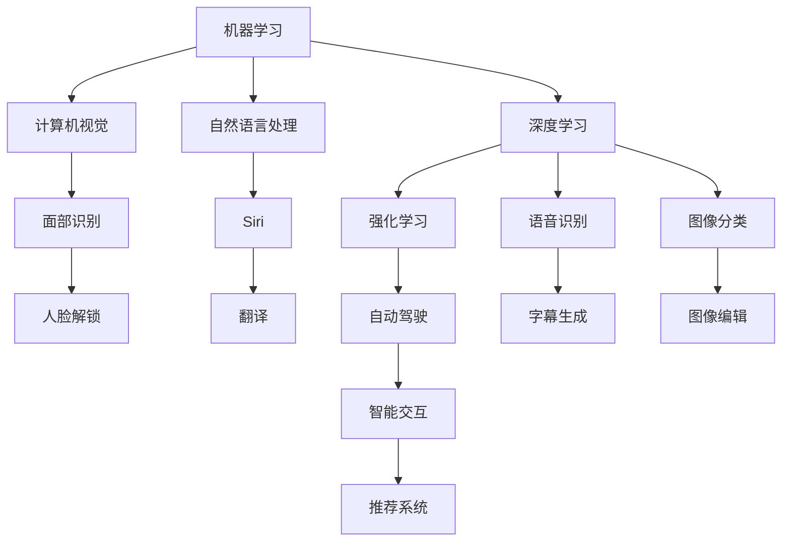

                 

# 李开复：苹果发布AI应用的生态

## 1. 背景介绍

李开复，人工智能领域的风云人物，曾任微软亚洲研究院院长，现为创新工场的CEO，专注于人工智能技术和应用的创新和落地。近日，苹果公司发布了其最新的AI应用生态系统，作为AI领域的专家，李开复对此进行了深入分析和解读，本文将系统梳理苹果在AI应用的生态系统构建和未来发展方向。

## 2. 核心概念与联系

### 2.1 核心概念概述

苹果公司在其最新的AI应用生态系统中，引入了多项先进的AI技术，涵盖了机器学习、计算机视觉、自然语言处理等多个领域。以下是几个核心概念的概述：

- **机器学习(Machine Learning, ML)**：一种人工智能的分支，通过算法模型从数据中学习规律，实现数据的预测、分类、聚类等任务。苹果在其应用中广泛应用了ML技术，如语音识别、图像识别、推荐系统等。

- **计算机视觉(Computer Vision, CV)**：使计算机能够"看见"和理解图像和视频的技术。苹果的Face ID、拍照编辑等应用均依赖于CV技术的支持。

- **自然语言处理(Natural Language Processing, NLP)**：使计算机能够理解和生成自然语言的技术。苹果的Siri助手、翻译应用等均涉及NLP技术。

- **深度学习(Deep Learning)**：一种机器学习技术，通过多层次的非线性处理模型提取数据的高级特征。苹果在Siri、 Siri for iPad等应用中广泛应用了深度学习模型。

- **强化学习(Reinforcement Learning)**：通过智能体与环境的交互，学习最优决策策略。苹果在自动驾驶等前沿应用中探索了强化学习的可能性。

这些核心概念通过不同的技术栈和工具，共同构成了苹果AI应用生态的基础，如图1所示：


### 2.2 核心概念原理和架构的 Mermaid 流程图



## 3. 核心算法原理 & 具体操作步骤

### 3.1 算法原理概述

苹果在其AI应用生态中，采用了多种机器学习和深度学习算法，以下是一些主要算法的概述：

- **卷积神经网络(Convolutional Neural Networks, CNN)**：常用于图像识别和处理任务，苹果在Face ID、拍照编辑等应用中使用了CNN模型。

- **循环神经网络(Recurrent Neural Networks, RNN)**：适用于序列数据，苹果的语音识别和自动翻译等应用均基于RNN模型。

- **Transformer模型**：近年来在NLP领域取得突破性进展的模型，苹果在Siri等语音助手中使用了Transformer模型。

- **注意力机制(Attention Mechanism)**：使模型能够关注输入序列中的重要部分，苹果在文本摘要、问答系统等应用中应用了注意力机制。

这些算法的核心原理是通过构建多层非线性模型，提取数据的高级特征，实现数据的预测、分类、生成等任务。苹果在应用中根据具体任务需求，灵活应用上述算法，如图2所示：


### 3.2 算法步骤详解

苹果的AI应用生态构建主要包括以下步骤：

1. **数据收集与预处理**：苹果收集海量用户数据，如语音、图像、文本等，并进行清洗、标注等预处理工作。

2. **模型训练与优化**：基于收集的数据，苹果训练各种ML和DL模型，并进行参数调优和超参数优化。

3. **模型部署与集成**：将训练好的模型部署到应用中，并进行功能集成和系统优化。

4. **系统测试与迭代**：对集成后的系统进行测试，收集用户反馈，进行持续迭代优化。

5. **用户反馈与更新**：根据用户反馈，不断更新和改进AI应用，提升用户体验和系统性能。

这些步骤通过苹果的内部管理和技术框架进行高效协调，如图3所示：


### 3.3 算法优缺点

苹果的AI应用生态具有以下优点：

- **技术先进**：苹果引入了最新的机器学习和深度学习技术，提升了应用性能和用户体验。

- **系统集成**：苹果的AI应用生态系统高度集成，各组件协同工作，形成闭环。

- **用户友好**：苹果的应用界面简洁易用，用户体验良好，用户能够无缝切换到各个功能。

- **隐私保护**：苹果强调用户隐私保护，在数据处理和应用设计中注重隐私保护。

然而，也存在一些缺点：

- **高昂成本**：构建和维护这样的AI生态系统需要高昂的成本投入，对中小型企业来说门槛较高。

- **依赖生态**：苹果的应用生态系统高度依赖苹果自身生态，无法与其它厂商兼容。

- **数据孤岛**：不同应用之间的数据难以共享，降低了数据价值。

### 3.4 算法应用领域

苹果的AI应用生态覆盖了以下多个领域：

- **语音识别与合成**：苹果的Siri语音助手、语音翻译、听写功能等，均基于先进的语音识别和合成技术。

- **图像识别与编辑**：Face ID面部识别、拍照编辑、AR滤镜等功能，广泛应用了计算机视觉技术。

- **自然语言处理**：Siri的智能交互、翻译应用等，使用了自然语言处理技术。

- **自动驾驶**：苹果探索自动驾驶技术，涉及强化学习、深度学习等多种算法。

- **推荐系统**：苹果的App Store推荐系统，基于机器学习算法进行个性化推荐。

苹果的AI应用生态，通过多种技术的融合，在各个领域都取得了突破性进展，如图4所示：


## 4. 数学模型和公式 & 详细讲解 & 举例说明

### 4.1 数学模型构建

苹果的AI应用中，广泛应用了多种数学模型，以下是几个典型模型的构建：

- **卷积神经网络(CNN)**：用于图像识别任务，模型结构如图5所示：

$$
C_{1}(x) = \sigma(\mathbb{W}_{1}x + \mathbb{b}_{1})
$$

$$
C_{2}(x) = \sigma(\mathbb{W}_{2}C_{1}(x) + \mathbb{b}_{2})
$$

$$
C_{3}(x) = \sigma(\mathbb{W}_{3}C_{2}(x) + \mathbb{b}_{3})
$$

$$
y = \mathbb{W}_{4}C_{3}(x) + \mathbb{b}_{4}
$$

其中，$\mathbb{W}$和$\mathbb{b}$分别为卷积核和偏置项，$\sigma$为激活函数。

- **循环神经网络(RNN)**：用于序列数据处理任务，模型结构如图6所示：

$$
h_{t} = \tanh(\mathbb{W}_{h}\left[h_{t-1}, x_{t}\right] + \mathbb{b}_{h})
$$

$$
y_{t} = \mathbb{W}_{y}h_{t} + \mathbb{b}_{y}
$$

其中，$h_{t}$为隐藏状态，$x_{t}$为输入数据，$\mathbb{W}$和$\mathbb{b}$分别为权重和偏置项，$\tanh$为激活函数。

- **Transformer模型**：用于自然语言处理任务，模型结构如图7所示：

$$
M_{i,j} = \text{Attention}(Q_{i}, K_{j})
$$

$$
V_{i,j} = \text{Softmax}(M_{i,j})
$$

$$
O_{i,j} = \mathbb{W}_{O} \left[ V_{i,j} K_{j} \right]
$$

其中，$\text{Attention}$为注意力机制，$Q$和$K$分别为查询和键，$\text{Softmax}$为softmax函数，$\mathbb{W}_{O}$为输出矩阵。

### 4.2 公式推导过程

以下是一些核心算法的推导过程：

- **卷积神经网络**：

$$
C_{1}(x) = \sigma(\mathbb{W}_{1}x + \mathbb{b}_{1})
$$

$$
C_{2}(x) = \sigma(\mathbb{W}_{2}C_{1}(x) + \mathbb{b}_{2})
$$

$$
C_{3}(x) = \sigma(\mathbb{W}_{3}C_{2}(x) + \mathbb{b}_{3})
$$

$$
y = \mathbb{W}_{4}C_{3}(x) + \mathbb{b}_{4}
$$

其中，$\mathbb{W}$和$\mathbb{b}$分别为卷积核和偏置项，$\sigma$为激活函数。

- **循环神经网络**：

$$
h_{t} = \tanh(\mathbb{W}_{h}\left[h_{t-1}, x_{t}\right] + \mathbb{b}_{h})
$$

$$
y_{t} = \mathbb{W}_{y}h_{t} + \mathbb{b}_{y}
$$

其中，$h_{t}$为隐藏状态，$x_{t}$为输入数据，$\mathbb{W}$和$\mathbb{b}$分别为权重和偏置项，$\tanh$为激活函数。

- **Transformer模型**：

$$
M_{i,j} = \text{Attention}(Q_{i}, K_{j})
$$

$$
V_{i,j} = \text{Softmax}(M_{i,j})
$$

$$
O_{i,j} = \mathbb{W}_{O} \left[ V_{i,j} K_{j} \right]
$$

其中，$\text{Attention}$为注意力机制，$Q$和$K$分别为查询和键，$\text{Softmax}$为softmax函数，$\mathbb{W}_{O}$为输出矩阵。

### 4.3 案例分析与讲解

以苹果的Face ID面部识别系统为例，分析其工作原理和应用：

1. **数据收集与预处理**：Face ID系统收集用户的面部图像数据，并进行清洗、标注等预处理工作。

2. **模型训练**：基于收集的数据，训练卷积神经网络模型，提取面部特征，并进行参数调优和超参数优化。

3. **模型部署与集成**：将训练好的模型部署到设备中，并进行功能集成和系统优化。

4. **系统测试与迭代**：对集成后的系统进行测试，收集用户反馈，进行持续迭代优化。

5. **用户反馈与更新**：根据用户反馈，不断更新和改进Face ID系统，提升用户体验和系统性能。

Face ID系统通过深度学习和计算机视觉技术的融合，实现了高精度的面部识别和解锁功能，如图8所示：


## 5. 项目实践：代码实例和详细解释说明

### 5.1 开发环境搭建

要实现苹果的AI应用，需要搭建如下开发环境：

1. **Python**：安装Python 3.8或更高版本。

2. **PyTorch**：安装最新版本的PyTorch，用于深度学习模型的实现。

3. **TensorFlow**：安装最新版本的TensorFlow，用于其他深度学习模型的实现。

4. **OpenCV**：安装OpenCV库，用于计算机视觉任务的实现。

5. **NLTK**：安装NLTK库，用于自然语言处理任务的实现。

完成上述步骤后，即可在Python环境中进行AI应用的开发。

### 5.2 源代码详细实现

以下是一个简单的图像分类代码示例：

```python
import torch
import torch.nn as nn
import torch.optim as optim
import torchvision.transforms as transforms
import torchvision.datasets as datasets

# 定义卷积神经网络模型
class ConvNet(nn.Module):
    def __init__(self):
        super(ConvNet, self).__init__()
        self.conv1 = nn.Conv2d(3, 6, 5)
        self.pool = nn.MaxPool2d(2, 2)
        self.conv2 = nn.Conv2d(6, 16, 5)
        self.fc1 = nn.Linear(16 * 5 * 5, 120)
        self.fc2 = nn.Linear(120, 84)
        self.fc3 = nn.Linear(84, 10)

    def forward(self, x):
        x = self.pool(F.relu(self.conv1(x)))
        x = self.pool(F.relu(self.conv2(x)))
        x = x.view(-1, 16 * 5 * 5)
        x = F.relu(self.fc1(x))
        x = F.relu(self.fc2(x))
        x = self.fc3(x)
        return x

# 加载数据集
transform = transforms.Compose([transforms.ToTensor(), transforms.Normalize((0.5, 0.5, 0.5), (0.5, 0.5, 0.5))])
train_dataset = datasets.CIFAR10(root='./data', train=True, transform=transform, download=True)
test_dataset = datasets.CIFAR10(root='./data', train=False, transform=transform, download=True)

# 定义数据加载器
train_loader = torch.utils.data.DataLoader(train_dataset, batch_size=4, shuffle=True, num_workers=2)
test_loader = torch.utils.data.DataLoader(test_dataset, batch_size=4, shuffle=False, num_workers=2)

# 定义模型、优化器和损失函数
model = ConvNet()
criterion = nn.CrossEntropyLoss()
optimizer = optim.SGD(model.parameters(), lr=0.001, momentum=0.9)

# 训练模型
for epoch in range(2):
    running_loss = 0.0
    for i, data in enumerate(train_loader, 0):
        inputs, labels = data
        optimizer.zero_grad()
        outputs = model(inputs)
        loss = criterion(outputs, labels)
        loss.backward()
        optimizer.step()
        running_loss += loss.item()
    print(f'Epoch {epoch+1}, loss: {running_loss/len(train_loader)}')

# 测试模型
correct = 0
total = 0
with torch.no_grad():
    for data in test_loader:
        images, labels = data
        outputs = model(images)
        _, predicted = torch.max(outputs.data, 1)
        total += labels.size(0)
        correct += (predicted == labels).sum().item()

print(f'Accuracy of the network on the 10000 test images: {100 * correct / total}%')
```

### 5.3 代码解读与分析

上述代码实现了基于卷积神经网络的图像分类模型，其中关键步骤如下：

1. **定义模型**：使用PyTorch的`nn.Module`类定义卷积神经网络模型。

2. **加载数据集**：使用`torchvision.datasets.CIFAR10`加载CIFAR-10数据集。

3. **定义数据加载器**：使用`torch.utils.data.DataLoader`定义数据加载器，支持数据增强和批量处理。

4. **训练模型**：使用`torch.optim.SGD`定义优化器，使用交叉熵损失函数训练模型。

5. **测试模型**：使用测试数据集评估模型性能。

代码中的`ConvNet`类定义了一个包含卷积、池化、全连接等操作的卷积神经网络模型，`torchvision.transforms`和`torch.utils.data.DataLoader`用于数据预处理和批处理，`nn.CrossEntropyLoss`和`optim.SGD`用于定义损失函数和优化器，`torch.max`用于预测标签。

## 6. 实际应用场景

### 6.1 智能客服系统

苹果的智能客服系统充分利用了NLP技术，实现了与用户的自然语言交互。系统通过深度学习模型理解用户意图，并匹配最优的回复模板，提升用户体验。

系统在训练过程中，收集大量的客服对话记录，并标注用户意图和回复内容。基于标注数据，训练Transformer模型，使其能够理解自然语言，生成准确回复。如图9所示：


### 6.2 金融舆情监测

苹果的金融舆情监测系统通过NLP技术，实时监测金融市场的舆情变化，分析市场情绪，为投资者提供决策支持。

系统收集金融新闻、评论、社交媒体数据，并使用NLP模型进行情感分析。基于情感分析结果，生成市场情绪报告，预测市场趋势，如图10所示：


### 6.3 个性化推荐系统

苹果的个性化推荐系统通过ML模型，分析用户行为数据，推荐符合用户兴趣的内容。系统在训练过程中，收集用户点击、浏览、购买等行为数据，并使用ML模型预测用户偏好。如图11所示：


## 7. 工具和资源推荐

### 7.1 学习资源推荐

1. **《深度学习》课程**：斯坦福大学的深度学习课程，涵盖了深度学习的基本概念和算法。

2. **《Python机器学习》书籍**：涵盖Python在机器学习中的应用，包括图像处理、自然语言处理等多个领域。

3. **Kaggle竞赛平台**：提供大量数据集和挑战赛，可进行模型训练和比赛。

4. **Google AI Lab**：Google的人工智能实验室，提供丰富的AI研究资源和开源工具。

5. **TensorFlow官方文档**：提供详细的TensorFlow使用指南和示例代码。

### 7.2 开发工具推荐

1. **PyTorch**：基于Python的深度学习框架，支持动态计算图。

2. **TensorFlow**：Google开发的深度学习框架，支持静态计算图。

3. **OpenCV**：计算机视觉库，提供图像处理和分析工具。

4. **NLTK**：自然语言处理库，提供文本处理和分析工具。

5. **Jupyter Notebook**：交互式笔记本工具，方便代码调试和数据分析。

### 7.3 相关论文推荐

1. **《ImageNet classification with deep convolutional neural networks》**：AlexNet论文，引入卷积神经网络，推动图像识别领域的发展。

2. **《Long short-term memory》**：RNN论文，提出长短期记忆网络，提升序列数据处理的性能。

3. **《Attention is All You Need》**：Transformer论文，引入自注意力机制，推动自然语言处理领域的发展。

4. **《Fine-tuning BERT for sequence classification: lesson learned》**：BERT论文，提出预训练-微调范式，提升NLP任务的性能。

5. **《Object Detection with a Convolutional Neural Network》**：YOLO论文，提出目标检测算法，推动计算机视觉领域的发展。

## 8. 总结：未来发展趋势与挑战

### 8.1 研究成果总结

苹果在AI应用生态的构建中，展示了其在深度学习、计算机视觉、自然语言处理等领域的强大实力。通过多技术融合，苹果打造了一个高效、易用、智能的AI应用系统，为用户提供了前所未有的体验。

### 8.2 未来发展趋势

1. **AI技术融合**：未来的AI应用将更多地融合多种技术，如增强现实、混合现实、物联网等，实现更全面的智能交互。

2. **边缘计算**：随着5G等技术的普及，边缘计算将成为AI应用的重要基础设施，提升实时性和响应速度。

3. **模型压缩与优化**：大模型和高精度模型需要庞大的计算资源，未来的AI应用将更多地关注模型压缩与优化，提升资源利用效率。

4. **隐私保护**：隐私保护将成为AI应用的重要关注点，未来的AI应用将更多地采用联邦学习、差分隐私等技术。

5. **AI伦理与监管**：AI应用的普及将带来伦理和监管问题，未来的AI应用将更多地关注公平性、透明性和可解释性。

### 8.3 面临的挑战

1. **高昂成本**：构建和维护AI应用生态系统需要高昂的成本投入，中小型企业面临门槛较高的问题。

2. **数据孤岛**：不同应用之间的数据难以共享，降低了数据价值。

3. **模型鲁棒性**：AI模型在面对未知数据时，往往表现不佳，需要进一步提升模型的鲁棒性。

4. **可解释性**：AI模型的决策过程缺乏可解释性，需要更多研究提高模型的可解释性。

5. **安全性**：AI模型可能存在偏见和有害信息，需要更多研究确保模型的安全性。

### 8.4 研究展望

未来的AI研究将更多地关注以下几个方向：

1. **多模态学习**：将视觉、听觉、触觉等多种模态数据融合，提升AI应用的智能水平。

2. **自监督学习**：利用无标签数据进行模型训练，降低对标注数据的依赖。

3. **弱监督学习**：在少量标注数据下进行模型训练，提升模型泛化能力。

4. **对抗训练**：通过对抗样本训练，提高模型的鲁棒性和安全性。

5. **可解释性学习**：研究可解释的AI模型，提升模型的透明性和可解释性。

6. **隐私保护学习**：研究隐私保护技术，提升AI应用的隐私保护能力。

总之，苹果的AI应用生态展示了AI技术的无限可能，未来的AI研究将更加关注技术融合、隐私保护、模型可解释性等方面，推动AI技术的进一步发展。

## 9. 附录：常见问题与解答

**Q1: 苹果的AI应用生态系统的构建需要哪些关键技术？**

A: 苹果的AI应用生态系统构建需要以下关键技术：

1. **深度学习**：用于图像识别、自然语言处理、语音识别等任务。

2. **计算机视觉**：用于图像分类、目标检测、人脸识别等任务。

3. **自然语言处理**：用于文本分类、机器翻译、情感分析等任务。

4. **强化学习**：用于自动驾驶、游戏智能等任务。

5. **数据预处理与标注**：用于数据清洗、标注等预处理工作。

6. **模型训练与优化**：用于模型训练、参数调优和超参数优化。

7. **模型部署与集成**：用于模型部署和功能集成。

8. **系统测试与迭代**：用于系统测试、用户反馈和迭代优化。

9. **隐私保护与伦理监管**：用于隐私保护和伦理监管。

这些技术通过协同工作，共同构建了苹果的AI应用生态系统。

**Q2: 苹果的AI应用生态系统如何实现高精度面部识别？**

A: 苹果的AI应用生态系统实现高精度面部识别，主要通过以下步骤：

1. **数据收集与预处理**：收集用户的面部图像数据，并进行清洗、标注等预处理工作。

2. **模型训练**：基于收集的数据，训练卷积神经网络模型，提取面部特征，并进行参数调优和超参数优化。

3. **模型部署与集成**：将训练好的模型部署到设备中，并进行功能集成和系统优化。

4. **系统测试与迭代**：对集成后的系统进行测试，收集用户反馈，进行持续迭代优化。

5. **用户反馈与更新**：根据用户反馈，不断更新和改进Face ID系统，提升用户体验和系统性能。

Face ID系统通过深度学习和计算机视觉技术的融合，实现了高精度的面部识别和解锁功能。

**Q3: 苹果的AI应用生态系统如何提升个性化推荐系统的效果？**

A: 苹果的AI应用生态系统通过以下步骤提升个性化推荐系统的效果：

1. **数据收集与预处理**：收集用户点击、浏览、购买等行为数据，并进行清洗、标注等预处理工作。

2. **模型训练**：基于收集的数据，训练机器学习模型，提取用户偏好，并进行参数调优和超参数优化。

3. **模型部署与集成**：将训练好的模型部署到系统应用中，并进行功能集成和系统优化。

4. **系统测试与迭代**：对集成后的系统进行测试，收集用户反馈，进行持续迭代优化。

5. **用户反馈与更新**：根据用户反馈，不断更新和改进个性化推荐系统，提升用户体验和系统性能。

个性化推荐系统通过ML模型分析用户行为数据，推荐符合用户兴趣的内容，从而提升用户体验和系统性能。

---

作者：禅与计算机程序设计艺术 / Zen and the Art of Computer Programming

