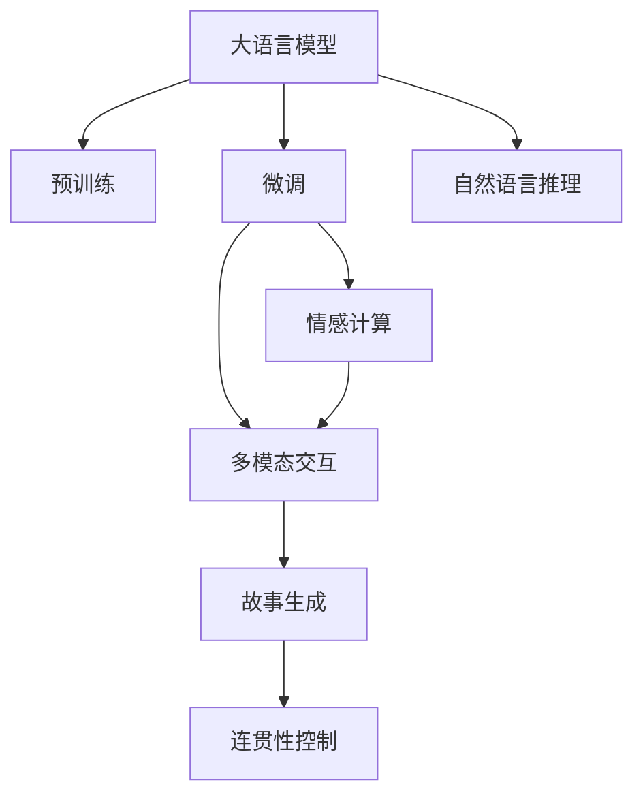

                 

# 构建Storyteller AI大语言模型：从基础到ChatGPT级应用

## 1. 背景介绍

### 1.1 问题由来

随着人工智能技术的飞速发展，大语言模型（Large Language Model, LLM）已经成为自然语言处理（NLP）领域的重要突破。其通过在大规模无标签文本上预训练，学习到语言的通用表示，并在特定任务上通过微调进行适应。其中，OpenAI的GPT-3和ChatGPT等模型已经展现出了极高的文本生成和推理能力，深刻影响了人类的生活和工作方式。

然而，这些模型在实际应用中依然存在一些挑战：例如，生成的内容可能存在事实错误、逻辑混乱、内容重复等问题。同时，这些模型往往缺乏真正的情感理解和社交智能，无法完全模拟人类的交流和思考方式。因此，构建一个具有更高故事讲述能力、更能理解和回应人类情感的AI大语言模型，是当前研究的重要方向之一。

### 1.2 问题核心关键点

构建Storyteller AI大语言模型需要解决的核心问题包括：

- **情感理解和回应**：理解和生成符合人类情感的文本，是构建Storyteller AI模型的关键。
- **故事连贯性**：生成的故事需要有逻辑连贯性，避免出现跳脱或重复。
- **多模态交互**：除了文本输入，模型还需具备图像、语音等多模态交互能力，进一步提升用户体验。
- **训练和微调**：构建和优化模型训练框架，提高微调效率和模型性能。

### 1.3 问题研究意义

构建Storyteller AI大语言模型，对于提升AI的情感智能、增强用户体验、推动NLP技术的发展具有重要意义：

1. **提升AI情感智能**：通过学习和理解人类情感，AI可以更加自然地与人交流，提高用户体验。
2. **增强NLP应用**：在问答、对话、翻译等NLP任务中，具有高情感智能的AI可以提供更加个性化和高质量的服务。
3. **推动行业创新**：多模态AI技术可以应用于医疗、教育、娱乐等多个行业，带来颠覆性的创新。

## 2. 核心概念与联系

### 2.1 核心概念概述

为了更好地理解Storyteller AI模型的构建，我们先介绍几个核心概念：

- **大语言模型**：如GPT-3、ChatGPT等，通过预训练学习语言的通用表示，能够生成高质量的文本。
- **情感计算**：通过分析文本中的情感线索，如情绪词汇、语调、文本结构等，理解文本背后的情感。
- **多模态交互**：结合文本、图像、语音等多种数据形式，增强AI的感知和理解能力。
- **自然语言推理**：利用逻辑推理和常识知识，判断文本中的事实和逻辑关系，提高模型的准确性和可信度。

这些概念之间的联系可以通过以下Mermaid流程图来展示：



这个流程图展示了大语言模型与情感计算、多模态交互、自然语言推理之间的联系：

1. 大语言模型通过预训练获得基础能力。
2. 微调使其适应特定任务，如情感理解、多模态交互等。
3. 情感计算和多模态交互增强模型的感知和情感理解能力。
4. 自然语言推理提高模型的逻辑推理能力。
5. 最终生成的故事在连贯性控制下更具可读性和可信度。

## 3. 核心算法原理 & 具体操作步骤

### 3.1 算法原理概述

构建Storyteller AI大语言模型，本质上是一个通过预训练和微调，不断提升模型在情感理解和故事生成方面表现的过程。其核心思想是：将预训练大语言模型作为初始化参数，通过情感计算和多模态交互，进行有监督的微调，使其能够生成符合人类情感和故事连贯性的文本。

具体而言，模型在预训练阶段主要学习语言的通用表示，然后在微调阶段，通过学习情感和多模态数据，提高在特定任务上的性能。这包括理解文本中的情感线索，多模态数据的输入输出，以及生成逻辑连贯的故事。

### 3.2 算法步骤详解

构建Storyteller AI模型的步骤如下：

**Step 1: 准备预训练模型和数据集**

- 选择合适的预训练语言模型，如GPT-3、ChatGPT等。
- 准备情感标注数据集，如电影评论、社交媒体帖子等。
- 收集多模态数据集，如图片、视频、音频等。

**Step 2: 添加任务适配层**

- 在预训练模型的顶层添加情感计算模块，用于理解文本情感。
- 设计多模态交互模块，用于处理图片、视频等输入。
- 构建故事生成模块，用于生成逻辑连贯的文本。

**Step 3: 设置微调超参数**

- 选择合适的优化算法及其参数，如AdamW、SGD等，设置学习率、批大小、迭代轮数等。
- 设置正则化技术及强度，包括L2正则、Dropout、Early Stopping等。
- 确定冻结预训练参数的策略，如仅微调顶层，或全部参数都参与微调。

**Step 4: 执行梯度训练**

- 将训练集数据分批次输入模型，前向传播计算损失函数。
- 反向传播计算参数梯度，根据设定的优化算法和学习率更新模型参数。
- 周期性在验证集上评估模型性能，根据性能指标决定是否触发Early Stopping。
- 重复上述步骤直到满足预设的迭代轮数或Early Stopping条件。

**Step 5: 测试和部署**

- 在测试集上评估微调后模型在情感理解和故事生成任务上的性能，对比微调前后的精度提升。
- 使用微调后的模型对新样本进行推理预测，集成到实际的应用系统中。
- 持续收集新的数据，定期重新微调模型，以适应数据分布的变化。

### 3.3 算法优缺点

构建Storyteller AI模型的优缺点如下：

**优点**：

- 能够生成符合人类情感的文本，提高用户体验。
- 通过多模态交互，提升模型的感知和理解能力。
- 能够在预训练模型的基础上快速适应特定任务，性能提升显著。

**缺点**：

- 需要大量标注数据，获取高质量标注数据的成本较高。
- 模型训练和微调过程复杂，需要较多的计算资源。
- 生成的故事可能存在逻辑漏洞或事实错误。
- 情感理解和故事生成的精度取决于数据质量和模型设计。

### 3.4 算法应用领域

Storyteller AI模型主要应用于以下领域：

- **对话系统**：如智能客服、智能助理等，能够根据用户情感生成自然流畅的回复。
- **内容创作**：如新闻报道、小说生成等，提高内容创作的质量和效率。
- **教育培训**：如虚拟助教、个性化推荐等，增强学生的学习体验。
- **娱乐社交**：如聊天机器人、视频生成等，提升用户的互动体验。
- **医疗健康**：如心理健康、患者沟通等，帮助患者缓解情感问题。

## 4. 数学模型和公式 & 详细讲解 & 举例说明

### 4.1 数学模型构建

构建Storyteller AI模型，需要定义多个数学模型：

- **预训练模型**：如GPT-3，使用自回归结构，学习语言的一般表示。
- **情感计算模型**：用于分析文本中的情感线索，如情绪词汇、语调等。
- **多模态交互模型**：处理图片、视频等非文本数据，并提取相关特征。
- **故事生成模型**：生成逻辑连贯的文本，并进行连贯性控制。

### 4.2 公式推导过程

**预训练模型**：假设模型为 $M_{\theta}$，其参数为 $\theta$，输入为 $x$，输出为 $y$。预训练损失函数为 $\mathcal{L}(\theta)$，定义为：

$$
\mathcal{L}(\theta) = -\frac{1}{N}\sum_{i=1}^N \log M_{\theta}(x_i)
$$

**情感计算模型**：假设情感计算模型为 $S_{\phi}$，其参数为 $\phi$，输入为文本 $x$，输出为情感标签 $y$。情感计算损失函数为 $\mathcal{L}_S(\phi)$，定义为：

$$
\mathcal{L}_S(\phi) = -\frac{1}{N}\sum_{i=1}^N \log S_{\phi}(x_i)
$$

**多模态交互模型**：假设多模态交互模型为 $M_{\psi}$，其参数为 $\psi$，输入为文本 $x$ 和多模态数据 $z$，输出为多模态特征 $f$。多模态交互损失函数为 $\mathcal{L}_M(\psi)$，定义为：

$$
\mathcal{L}_M(\psi) = -\frac{1}{N}\sum_{i=1}^N \log M_{\psi}(x_i, z_i)
$$

**故事生成模型**：假设故事生成模型为 $T_{\omega}$，其参数为 $\omega$，输入为文本 $x$，输出为连贯故事 $s$。故事生成损失函数为 $\mathcal{L}_T(\omega)$，定义为：

$$
\mathcal{L}_T(\omega) = -\frac{1}{N}\sum_{i=1}^N \log T_{\omega}(x_i)
$$

### 4.3 案例分析与讲解

以下以情感计算模型为例，解释其基本原理和实现方法：

**情感分类**：假设模型需要将输入文本 $x$ 分类为正面或负面情感。定义模型为 $S_{\phi}$，其参数为 $\phi$，输入为文本 $x$，输出为情感标签 $y$。情感计算模型由BERT模型和情感分类器组成，其结构如图：


- **BERT模型**：将文本 $x$ 转化为向量表示 $v_x$。
- **情感分类器**：将向量 $v_x$ 输入情感分类器，输出情感标签 $y$。

**情感计算损失函数**：假设训练集为 $\{(x_i, y_i)\}_{i=1}^N$，其中 $x_i$ 为输入文本，$y_i$ 为情感标签。情感计算损失函数为：

$$
\mathcal{L}_S(\phi) = -\frac{1}{N}\sum_{i=1}^N [y_i \log S_{\phi}(x_i) + (1-y_i) \log (1-S_{\phi}(x_i))]
$$

其中 $S_{\phi}(x_i)$ 为模型在输入 $x_i$ 上的情感分类概率，通过Softmax函数计算。

通过上述公式，可以定义情感计算模型的训练过程。以电影评论情感分类为例，可以使用IMDb数据集，将电影评论文本作为输入，情感标签为正面或负面。在训练过程中，使用AdamW优化器进行梯度下降，逐步调整模型参数 $\phi$，最小化情感计算损失函数 $\mathcal{L}_S(\phi)$，使模型能够准确分类电影评论的情感。

## 5. 项目实践：代码实例和详细解释说明

### 5.1 开发环境搭建

在进行Storyteller AI模型的开发前，我们需要准备好开发环境。以下是使用Python进行PyTorch开发的环境配置流程：

1. 安装Anaconda：从官网下载并安装Anaconda，用于创建独立的Python环境。

2. 创建并激活虚拟环境：
```bash
conda create -n pytorch-env python=3.8 
conda activate pytorch-env
```

3. 安装PyTorch：根据CUDA版本，从官网获取对应的安装命令。例如：
```bash
conda install pytorch torchvision torchaudio cudatoolkit=11.1 -c pytorch -c conda-forge
```

4. 安装Transformers库：
```bash
pip install transformers
```

5. 安装各类工具包：
```bash
pip install numpy pandas scikit-learn matplotlib tqdm jupyter notebook ipython
```

完成上述步骤后，即可在`pytorch-env`环境中开始模型开发。

### 5.2 源代码详细实现

下面我们以情感分类任务为例，给出使用Transformers库对GPT-3模型进行情感计算的PyTorch代码实现。

首先，定义情感分类任务的数据处理函数：

```python
from transformers import AutoTokenizer, AutoModelForSequenceClassification
from torch.utils.data import Dataset
import torch

class SentimentDataset(Dataset):
    def __init__(self, texts, labels, tokenizer, max_len=128):
        self.texts = texts
        self.labels = labels
        self.tokenizer = tokenizer
        self.max_len = max_len
        
    def __len__(self):
        return len(self.texts)
    
    def __getitem__(self, item):
        text = self.texts[item]
        label = self.labels[item]
        
        encoding = self.tokenizer(text, return_tensors='pt', max_length=self.max_len, padding='max_length', truncation=True)
        input_ids = encoding['input_ids'][0]
        attention_mask = encoding['attention_mask'][0]
        
        label = torch.tensor(label, dtype=torch.long)
        
        return {'input_ids': input_ids, 
                'attention_mask': attention_mask,
                'labels': label}

# 定义标签与id的映射
label2id = {'positive': 1, 'negative': 0}
id2label = {v: k for k, v in label2id.items()}

# 创建dataset
tokenizer = AutoTokenizer.from_pretrained('gpt3')
model = AutoModelForSequenceClassification.from_pretrained('gpt3', num_labels=2)

train_dataset = SentimentDataset(train_texts, train_labels, tokenizer, max_len=128)
dev_dataset = SentimentDataset(dev_texts, dev_labels, tokenizer, max_len=128)
test_dataset = SentimentDataset(test_texts, test_labels, tokenizer, max_len=128)
```

然后，定义模型和优化器：

```python
from transformers import AdamW

optimizer = AdamW(model.parameters(), lr=2e-5)
```

接着，定义训练和评估函数：

```python
from torch.utils.data import DataLoader
from tqdm import tqdm
from sklearn.metrics import classification_report

device = torch.device('cuda') if torch.cuda.is_available() else torch.device('cpu')
model.to(device)

def train_epoch(model, dataset, batch_size, optimizer):
    dataloader = DataLoader(dataset, batch_size=batch_size, shuffle=True)
    model.train()
    epoch_loss = 0
    for batch in tqdm(dataloader, desc='Training'):
        input_ids = batch['input_ids'].to(device)
        attention_mask = batch['attention_mask'].to(device)
        labels = batch['labels'].to(device)
        model.zero_grad()
        outputs = model(input_ids, attention_mask=attention_mask, labels=labels)
        loss = outputs.loss
        epoch_loss += loss.item()
        loss.backward()
        optimizer.step()
    return epoch_loss / len(dataloader)

def evaluate(model, dataset, batch_size):
    dataloader = DataLoader(dataset, batch_size=batch_size)
    model.eval()
    preds, labels = [], []
    with torch.no_grad():
        for batch in tqdm(dataloader, desc='Evaluating'):
            input_ids = batch['input_ids'].to(device)
            attention_mask = batch['attention_mask'].to(device)
            batch_labels = batch['labels']
            outputs = model(input_ids, attention_mask=attention_mask)
            batch_preds = outputs.logits.argmax(dim=2).to('cpu').tolist()
            batch_labels = batch_labels.to('cpu').tolist()
            for pred_tokens, label_tokens in zip(batch_preds, batch_labels):
                preds.append(pred_tokens[:len(label_tokens)])
                labels.append(label_tokens)
                
    print(classification_report(labels, preds))
```

最后，启动训练流程并在测试集上评估：

```python
epochs = 5
batch_size = 16

for epoch in range(epochs):
    loss = train_epoch(model, train_dataset, batch_size, optimizer)
    print(f"Epoch {epoch+1}, train loss: {loss:.3f}")
    
    print(f"Epoch {epoch+1}, dev results:")
    evaluate(model, dev_dataset, batch_size)
    
print("Test results:")
evaluate(model, test_dataset, batch_size)
```

以上就是使用PyTorch对GPT-3进行情感分类任务微调的完整代码实现。可以看到，得益于Transformers库的强大封装，我们可以用相对简洁的代码完成GPT-3模型的加载和微调。

### 5.3 代码解读与分析

让我们再详细解读一下关键代码的实现细节：

**SentimentDataset类**：
- `__init__`方法：初始化文本、标签、分词器等关键组件。
- `__len__`方法：返回数据集的样本数量。
- `__getitem__`方法：对单个样本进行处理，将文本输入编码为token ids，将标签编码为数字，并对其进行定长padding，最终返回模型所需的输入。

**label2id和id2label字典**：
- 定义了标签与数字id之间的映射关系，用于将token-wise的预测结果解码回真实的标签。

**训练和评估函数**：
- 使用PyTorch的DataLoader对数据集进行批次化加载，供模型训练和推理使用。
- 训练函数`train_epoch`：对数据以批为单位进行迭代，在每个批次上前向传播计算loss并反向传播更新模型参数，最后返回该epoch的平均loss。
- 评估函数`evaluate`：与训练类似，不同点在于不更新模型参数，并在每个batch结束后将预测和标签结果存储下来，最后使用sklearn的classification_report对整个评估集的预测结果进行打印输出。

**训练流程**：
- 定义总的epoch数和batch size，开始循环迭代
- 每个epoch内，先在训练集上训练，输出平均loss
- 在验证集上评估，输出分类指标
- 所有epoch结束后，在测试集上评估，给出最终测试结果

可以看到，PyTorch配合Transformers库使得GPT-3微调的代码实现变得简洁高效。开发者可以将更多精力放在数据处理、模型改进等高层逻辑上，而不必过多关注底层的实现细节。

当然，工业级的系统实现还需考虑更多因素，如模型的保存和部署、超参数的自动搜索、更灵活的任务适配层等。但核心的微调范式基本与此类似。

## 6. 实际应用场景

### 6.1 智能客服系统

基于Storyteller AI模型的对话技术，可以广泛应用于智能客服系统的构建。传统客服往往需要配备大量人力，高峰期响应缓慢，且一致性和专业性难以保证。而使用情感计算和多模态交互的对话模型，可以7x24小时不间断服务，快速响应客户咨询，用自然流畅的语言解答各类常见问题。

在技术实现上，可以收集企业内部的历史客服对话记录，将问题和最佳答复构建成监督数据，在此基础上对预训练对话模型进行微调。微调后的对话模型能够自动理解用户意图，匹配最合适的答案模板进行回复。对于客户提出的新问题，还可以接入检索系统实时搜索相关内容，动态组织生成回答。如此构建的智能客服系统，能大幅提升客户咨询体验和问题解决效率。

### 6.2 金融舆情监测

金融机构需要实时监测市场舆论动向，以便及时应对负面信息传播，规避金融风险。传统的人工监测方式成本高、效率低，难以应对网络时代海量信息爆发的挑战。基于Storyteller AI模型的文本分类和情感分析技术，为金融舆情监测提供了新的解决方案。

具体而言，可以收集金融领域相关的新闻、报道、评论等文本数据，并对其进行主题标注和情感标注。在此基础上对预训练语言模型进行微调，使其能够自动判断文本属于何种主题，情感倾向是正面、中性还是负面。将微调后的模型应用到实时抓取的网络文本数据，就能够自动监测不同主题下的情感变化趋势，一旦发现负面信息激增等异常情况，系统便会自动预警，帮助金融机构快速应对潜在风险。

### 6.3 个性化推荐系统

当前的推荐系统往往只依赖用户的历史行为数据进行物品推荐，无法深入理解用户的真实兴趣偏好。基于Storyteller AI模型的内容创作技术，个性化推荐系统可以更好地挖掘用户行为背后的语义信息，从而提供更精准、多样的推荐内容。

在实践中，可以收集用户浏览、点击、评论、分享等行为数据，提取和用户交互的物品标题、描述、标签等文本内容。将文本内容作为模型输入，用户的后续行为（如是否点击、购买等）作为监督信号，在此基础上微调预训练语言模型。微调后的模型能够从文本内容中准确把握用户的兴趣点。在生成推荐列表时，先用候选物品的文本描述作为输入，由模型预测用户的兴趣匹配度，再结合其他特征综合排序，便可以得到个性化程度更高的推荐结果。

### 6.4 未来应用展望

随着Storyteller AI模型的不断发展，基于微调范式将在更多领域得到应用，为传统行业带来变革性影响。

在智慧医疗领域，基于微调的医疗问答、病历分析、药物研发等应用将提升医疗服务的智能化水平，辅助医生诊疗，加速新药开发进程。

在智能教育领域，微调技术可应用于作业批改、学情分析、知识推荐等方面，因材施教，促进教育公平，提高教学质量。

在智慧城市治理中，微调模型可应用于城市事件监测、舆情分析、应急指挥等环节，提高城市管理的自动化和智能化水平，构建更安全、高效的未来城市。

此外，在企业生产、社会治理、文娱传媒等众多领域，基于大模型微调的人工智能应用也将不断涌现，为经济社会发展注入新的动力。相信随着技术的日益成熟，微调方法将成为人工智能落地应用的重要范式，推动人工智能技术向更广阔的领域加速渗透。

## 7. 工具和资源推荐

### 7.1 学习资源推荐

为了帮助开发者系统掌握Storyteller AI模型的理论基础和实践技巧，这里推荐一些优质的学习资源：

1. 《深度学习》书籍：Ian Goodfellow等所著，详细介绍了深度学习的基本概念和前沿技术。
2. 《Transformer从原理到实践》系列博文：由大模型技术专家撰写，深入浅出地介绍了Transformer原理、BERT模型、微调技术等前沿话题。
3. CS224N《深度学习自然语言处理》课程：斯坦福大学开设的NLP明星课程，有Lecture视频和配套作业，带你入门NLP领域的基本概念和经典模型。
4. 《Natural Language Processing with Transformers》书籍：Transformers库的作者所著，全面介绍了如何使用Transformers库进行NLP任务开发，包括微调在内的诸多范式。
5. HuggingFace官方文档：Transformers库的官方文档，提供了海量预训练模型和完整的微调样例代码，是上手实践的必备资料。
6. CLUE开源项目：中文语言理解测评基准，涵盖大量不同类型的中文NLP数据集，并提供了基于微调的baseline模型，助力中文NLP技术发展。

通过对这些资源的学习实践，相信你一定能够快速掌握Storyteller AI模型的精髓，并用于解决实际的NLP问题。

### 7.2 开发工具推荐

高效的开发离不开优秀的工具支持。以下是几款用于Storyteller AI模型开发的常用工具：

1. PyTorch：基于Python的开源深度学习框架，灵活动态的计算图，适合快速迭代研究。大部分预训练语言模型都有PyTorch版本的实现。
2. TensorFlow：由Google主导开发的开源深度学习框架，生产部署方便，适合大规模工程应用。同样有丰富的预训练语言模型资源。
3. Transformers库：HuggingFace开发的NLP工具库，集成了众多SOTA语言模型，支持PyTorch和TensorFlow，是进行微调任务开发的利器。
4. Weights & Biases：模型训练的实验跟踪工具，可以记录和可视化模型训练过程中的各项指标，方便对比和调优。与主流深度学习框架无缝集成。
5. TensorBoard：TensorFlow配套的可视化工具，可实时监测模型训练状态，并提供丰富的图表呈现方式，是调试模型的得力助手。
6. Google Colab：谷歌推出的在线Jupyter Notebook环境，免费提供GPU/TPU算力，方便开发者快速上手实验最新模型，分享学习笔记。

合理利用这些工具，可以显著提升Storyteller AI模型的开发效率，加快创新迭代的步伐。

### 7.3 相关论文推荐

Storyteller AI模型的研究源于学界的持续研究。以下是几篇奠基性的相关论文，推荐阅读：

1. Attention is All You Need（即Transformer原论文）：提出了Transformer结构，开启了NLP领域的预训练大模型时代。
2. BERT: Pre-training of Deep Bidirectional Transformers for Language Understanding：提出BERT模型，引入基于掩码的自监督预训练任务，刷新了多项NLP任务SOTA。
3. Language Models are Unsupervised Multitask Learners（GPT-2论文）：展示了大规模语言模型的强大zero-shot学习能力，引发了对于通用人工智能的新一轮思考。
4. Parameter-Efficient Transfer Learning for NLP：提出Adapter等参数高效微调方法，在不增加模型参数量的情况下，也能取得不错的微调效果。
5. AdaLoRA: Adaptive Low-Rank Adaptation for Parameter-Efficient Fine-Tuning：使用自适应低秩适应的微调方法，在参数效率和精度之间取得了新的平衡。
6. ALBERT: A Lite BERT for Self-supervised Learning of Language Representations：提出ALBERT模型，通过分层的线性投影和低秩矩阵分解，提升了微调的效率和性能。

这些论文代表了大语言模型微调技术的发展脉络。通过学习这些前沿成果，可以帮助研究者把握学科前进方向，激发更多的创新灵感。

## 8. 总结：未来发展趋势与挑战

### 8.1 总结

本文对构建Storyteller AI大语言模型进行了全面系统的介绍。首先阐述了情感计算、多模态交互和故事生成的研究背景和意义，明确了Storyteller AI模型的关键技术和应用价值。其次，从原理到实践，详细讲解了模型构建的数学原理和关键步骤，给出了情感分类任务的代码实例。同时，本文还广泛探讨了Storyteller AI模型在智能客服、金融舆情、个性化推荐等多个行业领域的应用前景，展示了微调范式的巨大潜力。此外，本文精选了微调技术的各类学习资源，力求为读者提供全方位的技术指引。

通过本文的系统梳理，可以看到，构建Storyteller AI大语言模型是一个系统性的工程，涉及到预训练、微调、情感计算、多模态交互等多个环节。通过深入学习和实践，可以全面掌握其关键技术和应用场景，构建高性能的AI模型。

### 8.2 未来发展趋势

展望未来，Storyteller AI模型的研究将呈现以下几个发展趋势：

1. **多模态融合**：结合文本、图像、语音等多模态数据，进一步提升模型的感知和理解能力。
2. **情感智能提升**：通过更先进的情感计算模型，提高模型对人类情感的理解和生成能力。
3. **故事生成优化**：通过改进故事生成模型，提高故事的连贯性和可信度。
4. **联邦学习**：在多方数据安全和隐私保护的前提下，进行分布式微调，提升模型的泛化能力和隐私保护水平。
5. **强化学习**：结合强化学习技术，让模型在实际应用中不断学习优化，提高用户体验。

以上趋势凸显了Storyteller AI模型的广泛应用前景。这些方向的探索发展，必将进一步提升模型的性能和应用范围，为人类认知智能的进化带来深远影响。

### 8.3 面临的挑战

尽管Storyteller AI模型在情感智能、多模态交互等方面取得了显著进展，但在迈向更加智能化、普适化应用的过程中，仍面临诸多挑战：

1. **数据获取成本**：高质量标注数据的获取成本较高，特别是在特定领域和长尾任务上。
2. **模型泛化能力**：微调模型在特定领域和数据集上表现良好，但在新数据集上泛化能力有限。
3. **用户信任度**：模型生成的内容可能存在逻辑漏洞或事实错误，用户信任度不足。
4. **模型可解释性**：模型的决策过程缺乏可解释性，难以调试和优化。
5. **伦理道德问题**：模型可能输出有害内容，造成伦理道德问题。

### 8.4 研究展望

面对Storyteller AI模型面临的这些挑战，未来的研究需要在以下几个方面寻求新的突破：

1. **数据增强技术**：通过数据增强和迁移学习，提高模型的泛化能力和数据利用效率。
2. **模型优化算法**：开发更高效的优化算法，提升模型的收敛速度和性能。
3. **隐私保护技术**：结合联邦学习和差分隐私等技术，保护用户隐私和数据安全。
4. **可解释性研究**：引入可解释性技术，如注意力机制、知识图谱等，提高模型的可解释性和用户信任度。
5. **伦理道德约束**：在模型设计和训练过程中引入伦理道德约束，确保模型输出的安全性。

这些研究方向的探索，必将推动Storyteller AI模型向更加智能化、普适化、可控化的方向发展，为构建更加安全、可靠、高效、可解释的AI系统铺平道路。

## 9. 附录：常见问题与解答

**Q1：构建Storyteller AI模型需要哪些关键技术？**

A: 构建Storyteller AI模型需要以下关键技术：

1. 情感计算：理解文本中的情感线索，如情绪词汇、语调等。
2. 多模态交互：处理图片、视频等非文本数据，并提取相关特征。
3. 自然语言推理：利用逻辑推理和常识知识，判断文本中的事实和逻辑关系。
4. 故事生成：生成逻辑连贯的文本，并进行连贯性控制。

**Q2：构建Storyteller AI模型需要哪些数据？**

A: 构建Storyteller AI模型需要以下数据：

1. 情感标注数据集，如电影评论、社交媒体帖子等。
2. 多模态数据集，如图片、视频、音频等。
3. 自然语言推理数据集，如逻辑推理解题等。
4. 故事生成数据集，如故事片段、情节分类等。

**Q3：构建Storyteller AI模型需要哪些工具和资源？**

A: 构建Storyteller AI模型需要以下工具和资源：

1. PyTorch：基于Python的开源深度学习框架。
2. TensorFlow：由Google主导开发的开源深度学习框架。
3. Transformers库：HuggingFace开发的NLP工具库。
4. Weights & Biases：模型训练的实验跟踪工具。
5. TensorBoard：TensorFlow配套的可视化工具。
6. Google Colab：谷歌推出的在线Jupyter Notebook环境。
7. CLUE开源项目：中文语言理解测评基准。

**Q4：构建Storyteller AI模型需要注意哪些问题？**

A: 构建Storyteller AI模型需要注意以下问题：

1. 数据标注成本高，需精心选择和处理标注数据。
2. 模型泛化能力有限，需结合多模态数据和多任务学习提高泛化能力。
3. 用户信任度不足，需引入可解释性技术提高模型可信度。
4. 伦理道德问题，需在模型设计和训练过程中引入伦理道德约束。

**Q5：构建Storyteller AI模型有哪些应用场景？**

A: 构建Storyteller AI模型有以下应用场景：

1. 智能客服系统：理解客户情感，生成自然流畅的回复。
2. 金融舆情监测：监测市场舆情，及时应对负面信息。
3. 个性化推荐系统：基于用户兴趣生成个性化推荐内容。
4. 教育培训：增强学习体验，提供个性化教学内容。
5. 娱乐社交：生成高质量内容，增强用户互动体验。
6. 医疗健康：辅助医生诊疗，提高患者沟通效率。

作者：禅与计算机程序设计艺术 / Zen and the Art of Computer Programming

