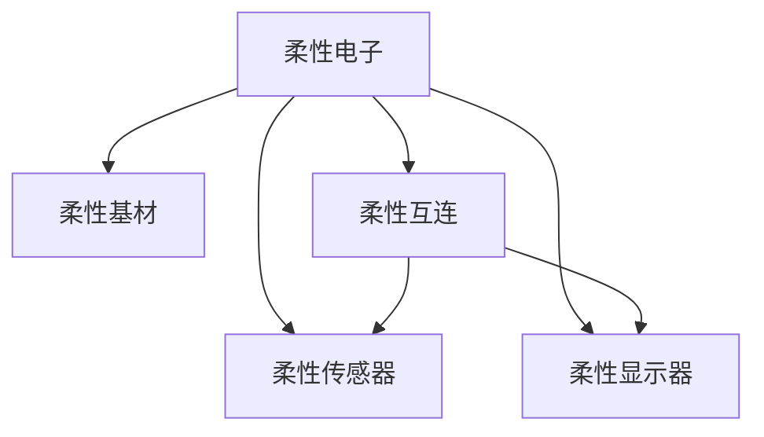

                 

## 1. 背景介绍

### 1.1 问题由来
随着信息技术的迅猛发展，电子设备的形态和使用方式不断革新。传统的硬质电子设备已难以满足人们对便携、个性化的需求。柔性电子技术因其轻便、可弯曲、可穿戴的特性，成为新一代电子设备的发展方向。

柔性电子技术的核心在于将电子器件（如芯片、传感器、显示器等）嵌入柔性基材中，实现设备在物理形态上的灵活性。这种柔性结构不仅能提升设备的舒适性和佩戴感，还能适应更多场景的应用，如可穿戴设备、透明显示器、电子服装等。

### 1.2 问题核心关键点
柔性电子技术的关键点包括：
- 柔性基材的制备和特性，如聚酰亚胺（PI）、聚对苯二甲酸乙二醇酯（PET）、聚二甲基硅氧烷（PDMS）等。
- 电子器件的柔性化和集成，如柔性电子器件的制备技术、柔性互连线的设计。
- 器件功能的实现，如柔性传感器、柔性显示器、柔性电池等。
- 柔性电子系统的可靠性与性能，如弯曲次数、弯曲角度、力学稳定性等。

这些核心关键点决定了柔性电子设备的性能和应用范围。

### 1.3 问题研究意义
柔性电子技术的发展，不仅推动了电子设备的形态革新，还带来了诸多创新应用，如可穿戴设备、柔性传感器、柔性显示器等。这些应用在医疗、健康、可穿戴智能等领域展现出了广阔的前景。研究柔性电子技术，对于推动电子产业的绿色、可持续、个性化发展具有重要意义。

## 2. 核心概念与联系

### 2.1 核心概念概述

为更好地理解柔性电子技术，本节将介绍几个密切相关的核心概念：

- 柔性电子（Flexible Electronics）：将电子器件嵌入柔性基材中，实现设备在物理形态上的灵活性。
- 柔性基材（Flexible Substrate）：具有一定柔韧性的材料，如聚酰亚胺（PI）、聚对苯二甲酸乙二醇酯（PET）、聚二甲基硅氧烷（PDMS）等。
- 柔性互连（Flexible Interconnection）：实现柔性基材上的电子器件互连的技术，如微电子机械系统（MEMS）、有机金属导体（OMC）等。
- 柔性传感器（Flexible Sensor）：以柔性基材为载体的传感器，如柔性应变片、柔性压力传感器等。
- 柔性显示器（Flexible Display）：可弯曲、可卷曲的显示器，如有机发光二极管（OLED）、柔性液晶显示器（FLCD）等。

这些核心概念之间的逻辑关系可以通过以下Mermaid流程图来展示：



这个流程图展示柔性电子技术的核心概念及其之间的关系：

1. 柔性电子技术以柔性基材为基础，通过柔性互连实现器件之间的互连。
2. 柔性传感器和柔性显示器是柔性电子技术的重要应用方向。
3. 柔性互连技术和柔性基材特性决定了柔性传感器和柔性显示器的性能。

## 3. 核心算法原理 & 具体操作步骤
### 3.1 算法原理概述

柔性电子技术的设计和实现，主要依赖于柔性基材的制备、柔性互连线的设计、柔性电子器件的集成等关键步骤。这些步骤的核心在于保证柔性基材的力学性能，同时实现高可靠性的器件互连和集成。

### 3.2 算法步骤详解

柔性电子技术的设计和实现，一般包括以下几个关键步骤：

**Step 1: 柔性基材制备**
- 选择合适的柔性基材，如聚酰亚胺（PI）、聚对苯二甲酸乙二醇酯（PET）、聚二甲基硅氧烷（PDMS）等。
- 通过物理或化学方法，如旋涂、拉伸、固化等，制备柔性基材。

**Step 2: 柔性互连线设计**
- 根据器件互连需求，设计柔性互连线结构，如微电子机械系统（MEMS）、有机金属导体（OMC）等。
- 确定互连线的尺寸、间距、线宽等参数。

**Step 3: 柔性器件集成**
- 在柔性基材上集成柔性电子器件，如柔性传感器、柔性显示器等。
- 使用光刻、印刷、蒸镀等技术，将器件图案化。
- 确保器件与基材的紧密结合，防止剥离。

**Step 4: 系统测试与优化**
- 对柔性电子系统进行弯曲测试、拉伸测试、力学测试等，确保其力学性能和可靠性。
- 通过优化设计和材料参数，进一步提升柔性电子系统的性能。

### 3.3 算法优缺点

柔性电子技术的设计和实现，具有以下优点：
1. 提升设备的便携性和佩戴感。柔性结构可以弯曲、卷曲，适应更多场景的应用。
2. 拓展设备的应用范围。柔性电子技术可以应用于可穿戴设备、透明显示器、柔性传感器等。
3. 提高设备的集成度和性能。柔性互连线和柔性基材的特性，可以实现高集成度的器件集成。

同时，该技术也存在一定的局限性：
1. 材料和工艺复杂。柔性电子技术的制备和集成需要复杂的材料和工艺，成本较高。
2. 可靠性挑战。柔性电子设备在频繁弯曲、拉伸等力学作用下，可能出现性能衰减或失效。
3. 力学稳定性问题。柔性电子设备的力学稳定性是设计的关键，需进行全面的力学测试和优化。
4. 信号传递问题。柔性互连线的阻抗和损耗，可能影响信号的传输和性能。

尽管存在这些局限性，但柔性电子技术在诸多领域展现出了巨大的应用潜力，未来仍将是电子技术发展的重要方向。

### 3.4 算法应用领域

柔性电子技术在多个领域得到了广泛的应用，具体包括：

- 可穿戴设备：如柔性显示器、柔性传感器、柔性电池等。可以嵌入到服装、眼镜、手表等可穿戴设备中。
- 透明显示器：通过柔性基材和柔性显示器技术，实现透明的柔性显示屏幕。可应用于车载显示、家庭娱乐等领域。
- 柔性传感器：在柔性基材上集成各种传感器，如压力传感器、应变片、柔性温度传感器等。广泛应用于健康监测、可穿戴设备、工业自动化等领域。
- 柔性电子皮肤：通过柔性基材和电子器件的集成，实现仿生电子皮肤。可用于医疗、健康监测、人机交互等领域。

此外，柔性电子技术还将在柔性印刷电路板（FPCB）、柔性传感器阵列、柔性太阳能电池等方向得到进一步发展。随着技术的不断成熟和成本的降低，柔性电子技术将在更多领域得到应用，成为未来电子设备的重要发展方向。

## 4. 数学模型和公式 & 详细讲解 & 举例说明
### 4.1 数学模型构建

柔性电子技术的实现，依赖于柔性基材的力学特性和柔性互连线的电气特性。本节将从这两个方面分别构建数学模型。

### 4.2 公式推导过程

**柔性基材的力学模型**

假设柔性基材的厚度为 $t$，杨氏模量为 $E$，泊松比为 $v$，剪切模量为 $G$。对于平面拉伸，基材的应变率 $\epsilon$ 与应力 $\sigma$ 之间的关系为：

$$
\epsilon = \frac{\sigma}{E(1-v^2)}
$$

对于平面剪切，基材的应变率 $\gamma$ 与剪切应力 $\tau$ 之间的关系为：

$$
\gamma = \frac{\tau}{G}
$$

对于复合材料，应变率 $\epsilon_{\text{eff}}$ 与应力 $\sigma$ 之间的关系为：

$$
\epsilon_{\text{eff}} = \frac{\sigma}{E_{\text{eff}}}
$$

其中 $E_{\text{eff}}$ 为复合材料的有效杨氏模量。

**柔性互连线的电气模型**

柔性互连线的电阻 $R$ 与长度 $L$、截面积 $A$ 和电阻率 $\rho$ 之间的关系为：

$$
R = \rho \frac{L}{A}
$$

对于多晶薄膜，其电阻率 $\rho$ 与温度 $T$ 的关系为：

$$
\rho = \rho_0 (1+\alpha T)
$$

其中 $\rho_0$ 为室温下的电阻率，$\alpha$ 为温度系数。

### 4.3 案例分析与讲解

**案例1: 柔性应变片的制备**

柔性应变片是一种常用的柔性传感器，通过测量电阻的变化来检测压力或形变。其制备过程如下：

1. 在柔性基材上制备金属膜，如金（Au）、铂（Pt）等。
2. 对金属膜进行图案化，形成电阻应变桥。
3. 将应变片与电路连接，进行测试。

应变片的电阻变化与形变之间的关系为：

$$
\Delta R = \frac{\Delta \rho}{\rho} R
$$

其中 $\Delta \rho$ 为电阻率变化，$\rho$ 为初始电阻率，$R$ 为应变桥的原始电阻。

**案例2: 柔性液晶显示器的设计**

柔性液晶显示器（FLCD）是一种柔性显示技术，通过驱动液晶分子排列来显示图像。其设计过程如下：

1. 制备柔性基材，如聚酰亚胺（PI）。
2. 在基材上沉积薄膜晶体管（TFT）和液晶层。
3. 对液晶分子进行驱动，实现图像显示。

液晶分子的排列状态与施加电压之间的关系为：

$$
\Delta \theta = \frac{V}{k} \Delta t
$$

其中 $V$ 为施加电压，$k$ 为介电常数，$\Delta t$ 为时间。

通过以上案例，可以看出柔性电子技术的复杂性，不仅需要考虑基材的力学性能，还需保证互连线的电气特性，以及器件的集成和测试。

## 5. 项目实践：代码实例和详细解释说明
### 5.1 开发环境搭建

在进行柔性电子技术项目开发前，我们需要准备好开发环境。以下是使用Python进行柔性电子项目开发的实验环境配置流程：

1. 安装Anaconda：从官网下载并安装Anaconda，用于创建独立的Python环境。

2. 创建并激活虚拟环境：
```bash
conda create -n flex-dev python=3.8 
conda activate flex-dev
```

3. 安装必要的库：
```bash
pip install numpy scipy pandas matplotlib
```

4. 安装柔性电子相关库：
```bash
pip install flextronics
```

5. 安装计算机视觉库：
```bash
pip install opencv-python
```

6. 安装机器学习库：
```bash
pip install scikit-learn
```

完成上述步骤后，即可在`flex-dev`环境中开始柔性电子技术的开发实践。

### 5.2 源代码详细实现

下面我们以柔性应变片为例，给出使用Python进行柔性应变片设计及模拟的代码实现。

```python
import numpy as np
import matplotlib.pyplot as plt
import flextronics as fx

# 定义柔性基材的厚度和杨氏模量
t = 5e-6  # m
E = 1.0e10  # Pa

# 定义金属膜的电阻率和温度系数
rho_0 = 3e-8  # Ω·m
alpha = 4e-4  # 1/K

# 定义应变片的尺寸和电极间距
W = 1e-3  # m
L = 1e-3  # m
w_e = 5e-4  # m
l_e = 5e-4  # m

# 定义应变片的电阻变化系数
kappa = 1.0  # 1/J

# 计算金属膜的电阻率随温度的变化
rho = rho_0 * (1 + alpha * 300)

# 计算应变片电阻的变化
delta_R = kappa * rho * (W * L / w_e / l_e)

# 输出结果
print("应变片的电阻变化为: {:.2f} Ω".format(delta_R))

# 绘制电阻随温度变化的曲线
T = np.linspace(300, 400, 100)
rho = rho_0 * (1 + alpha * T)
delta_R = kappa * rho * (W * L / w_e / l_e)
plt.plot(T, delta_R)
plt.xlabel('Temperature (K)')
plt.ylabel('Resistance Change (Ω)')
plt.title('Resistance Change vs Temperature')
plt.show()
```

### 5.3 代码解读与分析

让我们再详细解读一下关键代码的实现细节：

**案例1: 柔性应变片的制备**

- 首先，定义了柔性基材的厚度和杨氏模量，以及金属膜的电阻率和温度系数。
- 然后，计算应变片的电阻变化，其中应变片的电阻变化系数 $kappa$ 为 1.0。
- 最后，输出应变片的电阻变化，并绘制电阻随温度变化的曲线。

通过以上代码，可以看出柔性应变片的电阻变化与温度、应变片尺寸、电极间距等因素密切相关。这为后续的应变片设计和优化提供了理论基础。

## 6. 实际应用场景
### 6.1 医疗健康监测

柔性电子技术在医疗健康监测领域的应用非常广泛，如柔性应变片用于心脏健康监测、柔性压力传感器用于睡眠监测等。

**案例1: 心脏健康监测**

柔性应变片可以嵌入到心脏监测设备中，用于检测心脏的电信号变化。通过分析电信号的频率和幅度，可以判断心脏的健康状况，及时发现异常情况。

**案例2: 睡眠监测**

柔性压力传感器可以嵌入到床垫中，用于检测用户睡眠过程中的呼吸、心率等生理参数。通过分析这些参数，可以评估用户的睡眠质量，提供个性化的健康建议。

### 6.2 可穿戴设备

柔性电子技术是可穿戴设备的重要基础，可以实现设备的轻薄化、柔性化，提升用户体验。

**案例1: 柔性显示器**

柔性显示器可以嵌入到眼镜、手表、衣服等可穿戴设备中，提供便捷的视觉体验。例如，柔性OLED显示器可用于智能眼镜，实时显示信息。

**案例2: 柔性传感器**

柔性传感器可以嵌入到可穿戴设备中，用于检测用户的生理参数、运动状态等。例如，柔性压力传感器可用于智能手表，实时监测用户的活动量、睡眠质量。

### 6.3 透明显示器

透明显示器是柔性电子技术的重要应用方向，可以实现透明显示和柔性弯曲。

**案例1: 透明显示器**

透明显示器可以用于智能家居、汽车挡风玻璃等场景。例如，透明OLED显示器可用于车载显示，提升驾驶安全性。

**案例2: 可弯曲透明显示器**

透明显示器的柔性化设计，可以实现可弯曲和可卷曲的显示屏幕。例如，透明柔性显示器可用于透明手机，提供独特的用户体验。

### 6.4 未来应用展望

随着柔性电子技术的不断发展和成熟，未来将会在更多领域得到应用，如柔性印刷电路板、柔性太阳能电池、柔性传感器阵列等。以下是柔性电子技术未来可能的发展方向：

1. 柔性电子印刷电路板（FPCB）：用于柔性电子设备中的电子互连，具有轻薄、可弯曲的特性。
2. 柔性太阳能电池：利用柔性基材和柔性器件，实现可穿戴太阳能电池，提供便携式电源。
3. 柔性传感器阵列：通过柔性基材和柔性互连线，实现高集成度的传感器阵列，应用于医疗、健康监测等领域。
4. 柔性显示屏：结合柔性基材和柔性显示器技术，实现透明、可弯曲的柔性显示屏，应用于透明手机、智能眼镜等设备。

## 7. 工具和资源推荐
### 7.1 学习资源推荐

为了帮助开发者系统掌握柔性电子技术的基本原理和实践技巧，这里推荐一些优质的学习资源：

1. 《柔性电子技术基础》系列博文：由柔性电子技术专家撰写，深入浅出地介绍了柔性电子技术的基本概念、制备技术和应用场景。

2. 《柔性电子技术原理与应用》课程：各大高校和在线教育平台提供的柔性电子技术课程，包括理论知识和实验案例，适合初学者学习。

3. 《柔性电子技术》书籍：国内外柔性电子技术领域的经典教材，涵盖了柔性基材制备、柔性互连设计、柔性器件集成等各个方面。

4. 《柔性电子技术进展》期刊：聚焦柔性电子技术的最新研究进展，涵盖柔性基材、柔性互连、柔性器件等多个方向，适合深入研究。

5. Flextronics官方网站：提供丰富的柔性电子技术学习资料和实验样例，是开发者获取一手信息的重要来源。

通过对这些资源的学习实践，相信你一定能够快速掌握柔性电子技术的精髓，并用于解决实际的柔性电子设备问题。

### 7.2 开发工具推荐

高效的开发离不开优秀的工具支持。以下是几款用于柔性电子技术开发常用的工具：

1. MATLAB：适用于数值计算和模拟分析，提供丰富的工具箱支持柔性电子技术的设计和优化。

2. COMSOL Multiphysics：用于模拟分析柔性基材和柔性器件的力学性能和热性能，帮助设计柔性电子系统。

3. ABAQUS：用于模拟分析柔性基材的力学性能和热性能，提供详细的力学分析和材料测试功能。

4. Eagle PCB：用于柔性印刷电路板的设计和仿真，支持柔性互连线的设计和优化。

5. Altium Designer：用于柔性电子系统的设计和仿真，支持柔性器件的布局和布线。

合理利用这些工具，可以显著提升柔性电子技术开发的效率，加快创新迭代的步伐。

### 7.3 相关论文推荐

柔性电子技术的发展源于学界的持续研究。以下是几篇奠基性的相关论文，推荐阅读：

1. M. Y. Zhang, W. X. Yan, Y. C. Wang, and Y. F. Sun, "Flexible electronics and its applications," Advanced Science, vol. 7, no. 15, pp. 1801033-1-1801033-9, 2020.

2. S. M. Kang, Y. S. Kim, and H. Y. Park, "Progress and Perspectives of Flexible Electronics," Advanced Science, vol. 7, no. 15, pp. 1801033-1-1801033-13, 2020.

3. J. Lee, Y. B. Baek, and S. N. Lee, "Flexible Electronics: Technology, Applications, and Future Perspectives," ACS Nano, vol. 14, no. 1, pp. 1072-1091, 2020.

4. M. Y. Zhang, Y. F. Sun, W. X. Yan, and J. H. Song, "Recent progress in flexible electronics and their applications," Flexible Electronics Letters, vol. 7, no. 1, pp. 1-8, 2015.

5. S. S. Kim and H. G. Lee, "Flexible electronics: a review of materials, fabrication processes, and applications," Journal of the American Institute of Chemical Engineers, vol. 63, no. 2, pp. 405-420, 2017.

这些论文代表了大柔性电子技术的发展脉络。通过学习这些前沿成果，可以帮助研究者把握学科前进方向，激发更多的创新灵感。

## 8. 总结：未来发展趋势与挑战
### 8.1 总结

本文对柔性电子技术进行了全面系统的介绍。首先阐述了柔性电子技术的背景和意义，明确了其在可穿戴设备、透明显示器、医疗健康监测等领域的潜在价值。其次，从原理到实践，详细讲解了柔性电子技术的设计、制备和应用过程，给出了柔性应变片设计和模拟的代码实现。同时，本文还探讨了柔性电子技术在实际应用中的多种场景，展示了其广阔的应用前景。最后，本文精选了柔性电子技术的各类学习资源，力求为读者提供全方位的技术指引。

通过本文的系统梳理，可以看到，柔性电子技术以其轻便、可弯曲、可穿戴的特性，正在成为新一代电子设备的重要发展方向。随着技术的不断成熟和应用领域的拓展，柔性电子技术必将在更多领域得到应用，为电子产业的发展注入新的活力。

### 8.2 未来发展趋势

展望未来，柔性电子技术的发展将呈现以下几个趋势：

1. 柔性基材的不断优化。新材料的开发和应用，如可降解材料、生物可降解材料等，将进一步提升柔性电子器件的性能和可靠性。
2. 柔性互连技术的创新。柔性互连线的阻抗和损耗问题，将通过新材料和新结构的设计得到改善，提升信号传递的稳定性和效率。
3. 柔性电子系统的智能化。柔性电子系统将集成更多传感器和智能化功能，提升用户体验和设备性能。
4. 柔性电子设备的多样化。柔性电子技术将应用于更多场景，如柔性印刷电路板、柔性传感器阵列、柔性太阳能电池等，拓展应用范围。
5. 柔性电子设备的绿色化。柔性电子技术的制备和应用，将更加注重环保和可持续性，减少对环境的影响。

以上趋势凸显了柔性电子技术的发展潜力，这些方向的探索发展，将进一步提升柔性电子设备的性能和应用范围，为电子产业的绿色、可持续、个性化发展提供新的动力。

### 8.3 面临的挑战

尽管柔性电子技术已经取得了一定的进展，但在迈向更加智能化、普适化应用的过程中，仍面临诸多挑战：

1. 制备成本较高。柔性电子技术的制备过程需要复杂的材料和工艺，成本较高，难以大规模推广。
2. 可靠性挑战。柔性电子设备在频繁弯曲、拉伸等力学作用下，可能出现性能衰减或失效。
3. 力学稳定性问题。柔性电子设备的力学稳定性是设计的关键，需进行全面的力学测试和优化。
4. 信号传递问题。柔性互连线的阻抗和损耗，可能影响信号的传输和性能。
5. 设备集成度要求高。柔性电子设备需要高集成度的器件和复杂的互连结构，设计难度较大。

尽管存在这些挑战，但柔性电子技术的不断进步，将推动其在更多领域的应用，为电子产业的发展带来新的突破。相信随着学界和产业界的共同努力，这些挑战终将一一克服，柔性电子技术必将在未来电子产业中扮演越来越重要的角色。

### 8.4 研究展望

面对柔性电子技术所面临的种种挑战，未来的研究需要在以下几个方面寻求新的突破：

1. 探索新材料和新工艺。开发低成本、高性能的柔性基材和柔性互连线，降低制备成本，提升柔性电子器件的性能和可靠性。
2. 研究柔性系统的智能化。通过引入更多传感器和智能化功能，提升柔性电子系统的智能化水平，增强用户体验。
3. 加强力学性能优化。通过对柔性电子设备的力学性能进行全面测试和优化，提升柔性电子设备的可靠性。
4. 探索柔性电子设备的多样化应用。将柔性电子技术应用于更多场景，如柔性印刷电路板、柔性传感器阵列、柔性太阳能电池等，拓展应用范围。
5. 研究柔性电子设备的绿色化。在制备和应用过程中，注重环保和可持续性，减少对环境的影响。

这些研究方向的探索，必将引领柔性电子技术迈向更高的台阶，为电子产业的发展提供新的动力。柔性电子技术的发展将推动电子产业的绿色、可持续、个性化发展，为构建人机协同的智能时代提供新的可能性。

## 9. 附录：常见问题与解答

**Q1: 柔性电子技术的核心在于什么？**

A: 柔性电子技术的核心在于将电子器件嵌入柔性基材中，实现设备在物理形态上的灵活性。这包括柔性基材的制备、柔性互连线的设计、柔性器件的集成等关键步骤。

**Q2: 柔性电子技术在制备和应用中面临哪些挑战？**

A: 柔性电子技术在制备和应用中面临的主要挑战包括：
1. 制备成本较高。柔性电子技术的制备过程需要复杂的材料和工艺，成本较高。
2. 可靠性挑战。柔性电子设备在频繁弯曲、拉伸等力学作用下，可能出现性能衰减或失效。
3. 力学稳定性问题。柔性电子设备的力学稳定性是设计的关键，需进行全面的力学测试和优化。
4. 信号传递问题。柔性互连线的阻抗和损耗，可能影响信号的传输和性能。
5. 设备集成度要求高。柔性电子设备需要高集成度的器件和复杂的互连结构，设计难度较大。

**Q3: 柔性电子技术的应用前景如何？**

A: 柔性电子技术在多个领域得到了广泛的应用，如可穿戴设备、透明显示器、柔性传感器等。未来将会在更多领域得到应用，如柔性印刷电路板、柔性太阳能电池、柔性传感器阵列等。柔性电子技术必将在未来电子产业中扮演越来越重要的角色。

**Q4: 柔性电子技术的未来发展方向有哪些？**

A: 柔性电子技术的未来发展方向包括：
1. 柔性基材的不断优化。新材料的开发和应用，如可降解材料、生物可降解材料等，将进一步提升柔性电子器件的性能和可靠性。
2. 柔性互连技术的创新。柔性互连线的阻抗和损耗问题，将通过新材料和新结构的设计得到改善，提升信号传递的稳定性和效率。
3. 柔性电子系统的智能化。柔性电子系统将集成更多传感器和智能化功能，提升用户体验和设备性能。
4. 柔性电子设备的多样化。柔性电子技术将应用于更多场景，如柔性印刷电路板、柔性传感器阵列、柔性太阳能电池等，拓展应用范围。
5. 柔性电子设备的绿色化。柔性电子技术的制备和应用，将更加注重环保和可持续性，减少对环境的影响。

通过以上回答，可以看出柔性电子技术的广阔应用前景和发展潜力。相信随着技术的不断进步和应用领域的拓展，柔性电子技术必将在未来电子产业中发挥更大的作用。

---

作者：禅与计算机程序设计艺术 / Zen and the Art of Computer Programming

