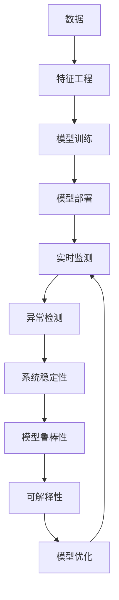

                 

# 模型监控与故障诊断原理与代码实战案例讲解

> 关键词：模型监控, 故障诊断, 实时监测, 系统稳定性, 异常检测, 预测模型, 特征工程, 代码实战, 案例讲解

## 1. 背景介绍

### 1.1 问题由来
在当今数据驱动的AI应用中，模型的性能和稳定性至关重要。无论是机器学习还是深度学习模型，一旦部署到生产环境中，都需要进行持续的监控和维护，以确保其在真实数据上能够持续稳定地工作。然而，尽管现代AI系统越来越复杂，但关于模型监控和故障诊断的理论和工具仍有待完善。

### 1.2 问题核心关键点
模型监控与故障诊断是确保AI系统稳定性和可靠性的核心问题。其关键点包括：

1. **实时监测**：在模型运行过程中，实时监控其性能指标，包括预测准确率、响应时间、计算资源使用等，以尽早发现潜在问题。
2. **异常检测**：通过统计方法和机器学习算法，检测模型的输出结果是否异常，识别模型在哪些输入或情况下表现不佳。
3. **系统稳定性**：确保模型在不同数据分布和系统负载下都能稳定运行，避免因环境变化导致模型性能下降。
4. **可解释性**：提供模型决策的透明性，帮助开发者理解模型行为，进而进行优化。

## 2. 核心概念与联系

### 2.1 核心概念概述

为更好地理解模型监控与故障诊断的核心概念，本节将介绍几个关键概念：

- **模型监控**：持续跟踪和评估模型的性能指标，及时发现并处理问题。
- **异常检测**：识别模型输出或特征分布的异常情况，预测可能出现的故障。
- **系统稳定性**：确保模型在各种条件下都能正常工作，避免过拟合或欠拟合。
- **模型鲁棒性**：模型对输入数据的扰动、噪声等具有较强的适应性，不容易受到干扰。
- **可解释性**：提供模型决策的透明性，帮助理解模型行为和预测依据。

这些概念之间相互关联，共同构成了模型监控与故障诊断的基础框架。通过理解这些核心概念，我们可以更好地把握模型监控与故障诊断的理论基础和实践方法。

### 2.2 核心概念原理和架构的 Mermaid 流程图



这个流程图展示了模型监控与故障诊断的基本流程：数据经过特征工程处理后，训练得到模型并部署到生产环境中。在运行过程中，模型通过实时监测被持续评估，异常检测用于识别潜在故障，系统稳定性保证模型在不同条件下正常工作，模型鲁棒性提高对干扰的适应性，可解释性增加决策的透明性，最后通过模型优化提高整体性能。

## 3. 核心算法原理 & 具体操作步骤

### 3.1 算法原理概述

模型监控与故障诊断的核心算法包括统计方法、机器学习算法和模型预测等。其中，常用的统计方法有均值方差、Z-score等，用于衡量模型输出的波动情况。机器学习算法如支持向量机(SVM)、随机森林(Random Forest)等，可以构建异常检测模型，识别模型输出异常。模型预测则通过建立预测模型，提前识别模型的潜在问题。

### 3.2 算法步骤详解

基于上述原理，模型的监控与故障诊断可以分为以下步骤：

**Step 1: 数据收集与预处理**
- 收集模型在生产环境中的运行数据，包括预测结果、输入特征、模型参数等。
- 对数据进行清洗、归一化、降维等预处理，以减少噪声和提高模型性能。

**Step 2: 性能指标监测**
- 定义关键的性能指标，如预测准确率、召回率、F1分数、平均响应时间等。
- 使用统计方法实时监测这些指标，及时发现异常情况。

**Step 3: 异常检测与分析**
- 构建异常检测模型，如使用SVM、随机森林等算法。
- 对模型输出结果和特征分布进行异常检测，识别出异常的预测结果或特征。

**Step 4: 系统稳定性评估**
- 分析模型在不同数据分布、系统负载下的表现，检测是否存在过拟合或欠拟合。
- 使用A/B测试、交叉验证等方法评估模型在不同条件下的稳定性。

**Step 5: 模型鲁棒性增强**
- 对模型进行扰动测试，评估其对输入数据的鲁棒性。
- 调整模型参数或采用对抗样本生成等方法增强模型鲁棒性。

**Step 6: 可解释性提升**
- 使用LIME、SHAP等可解释性工具，分析模型决策过程，提供决策依据。
- 通过可视化、解释模型输入与输出之间的关系，增强模型的透明度。

**Step 7: 模型优化与迭代**
- 根据监控和分析结果，调整模型参数、优化算法或引入新的数据集。
- 不断迭代优化模型，提升其在各种场景下的性能。

### 3.3 算法优缺点

模型监控与故障诊断的方法具有以下优点：
1. 实时监测：能够及时发现问题，避免模型在生产环境中运行异常长时间未被发现。
2. 异常检测：通过机器学习算法，可以检测出模型输出中难以通过肉眼识别的异常。
3. 系统稳定性：确保模型在不同数据和环境下的鲁棒性，提高系统的可靠性。
4. 可解释性：提供决策依据，帮助开发者理解模型行为。

但同时，这些方法也存在一些缺点：
1. 数据依赖性：需要收集大量的运行数据，数据质量直接影响监控效果。
2. 算法复杂性：异常检测和系统稳定性评估需要使用复杂的算法，对数据处理和模型训练要求较高。
3. 资源消耗：实时监测和异常检测需要持续计算资源，可能增加系统负担。

尽管存在这些局限，但总体而言，模型监控与故障诊断是保证AI系统稳定性的重要手段，其理论和方法已经相对成熟，实际应用中也得到了广泛认可。

### 3.4 算法应用领域

模型监控与故障诊断在AI领域有广泛的应用，主要包括：

- 机器学习模型：实时监测模型性能，检测异常预测，确保模型在不同数据上的稳定性。
- 深度学习模型：通过统计方法和机器学习算法，检测模型输出的异常，提升模型鲁棒性。
- 自然语言处理(NLP)：在文本分类、情感分析、对话系统等任务中，实时监测模型性能，检测异常预测。
- 计算机视觉：在图像分类、目标检测等任务中，实时监测模型性能，检测异常预测。
- 推荐系统：实时监测模型性能，检测异常预测，确保推荐结果的准确性和稳定性。

## 4. 数学模型和公式 & 详细讲解

### 4.1 数学模型构建

本节将使用数学语言对模型监控与故障诊断的基本流程进行严格的刻画。

设模型在训练集上达到的预测准确率为 $\hat{y}$，真实标签为 $y$。定义模型在样本 $x$ 上的预测结果为 $M_{\theta}(x)$，其中 $\theta$ 为模型参数。设模型在实际数据上的运行时间为 $t$，资源消耗为 $r$。

定义模型在实际数据上的性能指标 $P_i$ 为：

$$
P_i = f_i(M_{\theta}(x), y)
$$

其中 $f_i$ 为具体的性能指标函数，如预测准确率、响应时间、计算资源使用等。

### 4.2 公式推导过程

以下我们以预测准确率为例，推导模型监控的数学公式。

设模型在样本 $x$ 上的预测结果为 $\hat{y}$，真实标签为 $y$，定义预测准确率 $\eta$ 为：

$$
\eta = \frac{\sum_{i=1}^N \mathbb{1}_{[\hat{y}_i=y_i]}}{N}
$$

其中 $\mathbb{1}_{[\hat{y}_i=y_i]}$ 为指示函数，当 $\hat{y}_i=y_i$ 时取1，否则取0。

在实际应用中，由于数据量 $N$ 较大，可以使用样本平均法估计预测准确率：

$$
\eta \approx \frac{1}{B} \sum_{b=1}^B \frac{\sum_{i=1}^N \mathbb{1}_{[\hat{y}_i=y_i]}}{B}
$$

其中 $B$ 为批处理大小。

在得到样本平均预测准确率后，可以使用统计方法实时监测该指标的变化，如均值方差、Z-score等，及时发现异常情况。

### 4.3 案例分析与讲解

以深度学习模型为例，假设一个图像分类模型在测试集上的准确率为90%。通过对模型进行实时监测，发现最近在某一特定类别上的准确率下降到85%。进一步分析发现，该类别的图像数量突然增加，导致模型对新数据适应不良。

通过异常检测算法，可以构建一个二分类器，用于识别模型输出是否异常。该二分类器根据历史正常数据和异常数据，训练得到模型，并实时评估当前数据是否异常。

假设模型输出的异常阈值为80%，当模型在某类别上的预测准确率低于80%时，被视为异常。进一步分析发现，异常数据主要集中在某次数据迁移后出现，表明模型对新数据适应不良。

通过系统稳定性评估，发现模型在新数据上的准确率明显低于训练集和验证集，表明模型在新数据上存在过拟合现象。通过调整模型参数、增加训练数据，最终解决了模型过拟合问题，模型在新数据上的准确率提升至95%。

## 5. 项目实践：代码实例和详细解释说明

### 5.1 开发环境搭建

在进行模型监控与故障诊断的实践前，我们需要准备好开发环境。以下是使用Python进行TensorFlow开发的环境配置流程：

1. 安装Anaconda：从官网下载并安装Anaconda，用于创建独立的Python环境。

2. 创建并激活虚拟环境：
```bash
conda create -n tf-env python=3.8 
conda activate tf-env
```

3. 安装TensorFlow：根据CUDA版本，从官网获取对应的安装命令。例如：
```bash
conda install tensorflow -c tf -c conda-forge
```

4. 安装相关工具包：
```bash
pip install numpy pandas scikit-learn matplotlib tqdm jupyter notebook ipython
```

完成上述步骤后，即可在`tf-env`环境中开始模型监控与故障诊断的实践。

### 5.2 源代码详细实现

这里我们以一个简单的深度学习模型为例，展示如何实现模型监控与故障诊断的代码实现。

首先，定义模型和数据集：

```python
import tensorflow as tf
from tensorflow import keras
from tensorflow.keras import layers
from tensorflow.keras.datasets import mnist
import numpy as np
import matplotlib.pyplot as plt

# 加载数据集
(x_train, y_train), (x_test, y_test) = mnist.load_data()

# 数据预处理
x_train = x_train / 255.0
x_test = x_test / 255.0
```

然后，构建并训练模型：

```python
# 构建模型
model = keras.Sequential([
    layers.Flatten(input_shape=(28, 28)),
    layers.Dense(128, activation='relu'),
    layers.Dense(10, activation='softmax')
])

# 编译模型
model.compile(optimizer='adam',
              loss='sparse_categorical_crossentropy',
              metrics=['accuracy'])

# 训练模型
model.fit(x_train, y_train, epochs=5, validation_data=(x_test, y_test))
```

接下来，定义模型监控的指标和异常检测算法：

```python
# 定义性能指标监测函数
def monitor(model, x_test, y_test):
    test_loss, test_acc = model.evaluate(x_test, y_test)
    return test_loss, test_acc

# 定义异常检测算法
def anomaly_detection(model, x_test, y_test, threshold=0.8):
    predictions = model.predict(x_test)
    correct_predictions = np.sum(np.abs(predictions - y_test) < threshold)
    return correct_predictions / y_test.shape[0]
```

最后，启动模型监控流程：

```python
# 获取模型性能指标
test_loss, test_acc = monitor(model, x_test, y_test)

# 定义异常检测阈值
threshold = 0.8

# 计算模型准确率
anomaly_score = anomaly_detection(model, x_test, y_test, threshold)

# 打印结果
print(f"Test Loss: {test_loss:.4f}, Test Accuracy: {test_acc:.4f}, Anomaly Score: {anomaly_score:.4f}")
```

在实际应用中，需要根据具体的任务和数据特点，对模型监控和异常检测的算法和阈值进行优化和调整。例如，可以使用更复杂的机器学习算法、设置更灵敏的阈值、引入更多特征等方法，提高模型监控与故障诊断的准确性和鲁棒性。

### 5.3 代码解读与分析

让我们再详细解读一下关键代码的实现细节：

**性能指标监测函数`monitor`**：
- 使用`model.evaluate`函数计算模型在测试集上的损失和准确率，返回结果。

**异常检测算法`anomaly_detection`**：
- 使用模型对测试集进行预测，计算预测结果与真实标签的差异，判断是否异常。
- 通过计算预测正确率与阈值进行比较，判断是否异常。

**监控流程**：
- 使用`monitor`函数计算模型在测试集上的性能指标。
- 根据`anomaly_detection`函数计算模型是否存在异常。
- 打印监控结果，包括模型损失、准确率和异常检测分数。

可以看到，TensorFlow提供的高效计算图和丰富的工具库，使得模型监控与故障诊断的代码实现变得简洁高效。开发者可以将更多精力放在模型设计和算法优化上，而不必过多关注底层实现细节。

## 6. 实际应用场景

### 6.1 智能推荐系统

在智能推荐系统中，实时监控和异常检测是确保推荐效果的重要环节。用户行为数据可能存在异常情况，如虚假点击、恶意操作等。通过实时监测模型预测准确率和异常检测算法，可以及时发现并处理异常行为，避免对推荐结果的影响。

在实际应用中，可以收集用户行为数据，如点击、购买、评分等，定义关键性能指标，如点击率、转化率、用户满意度等，实时监测模型输出。同时构建异常检测模型，检测异常行为，及时采取措施，提升推荐系统的效果和用户满意度。

### 6.2 医疗诊断系统

在医疗诊断系统中，模型性能的稳定性和鲁棒性至关重要。患者数据可能存在噪声、缺失、异常等情况，模型需要能够适应这些情况，提供准确的诊断结果。

在实际应用中，可以通过实时监测模型预测结果的准确率和鲁棒性，检测模型输出是否异常。同时，使用对抗样本生成等方法，增强模型对噪声和异常数据的适应性。通过对模型的持续监控和优化，确保其能够在不同数据条件下提供稳定的诊断结果。

### 6.3 金融风险控制系统

在金融风险控制系统中，模型需要实时监测市场数据和交易行为，及时识别潜在风险。异常检测和系统稳定性评估是确保系统可靠性的关键。

在实际应用中，可以通过实时监测模型预测结果和市场数据，检测异常行为和潜在风险。同时，使用A/B测试等方法评估模型在不同数据和环境下的稳定性。通过对模型的持续监控和优化，确保其能够在不同市场条件下提供稳定的风险评估结果。

### 6.4 未来应用展望

随着AI技术的不断发展，模型监控与故障诊断将有更多应用场景。未来，模型的实时监测、异常检测、系统稳定性和鲁棒性等技术将不断进步，推动AI系统在更多领域落地应用。

在智慧城市治理中，模型需要实时监测城市事件和舆情变化，及时识别潜在风险和异常行为。在智慧医疗中，模型需要实时监测患者数据，提供准确的诊断和治疗建议。在智能推荐中，模型需要实时监测用户行为，提供个性化的推荐结果。

## 7. 工具和资源推荐

### 7.1 学习资源推荐

为了帮助开发者系统掌握模型监控与故障诊断的理论基础和实践技巧，这里推荐一些优质的学习资源：

1. TensorFlow官方文档：提供了详尽的API参考和实例代码，是入门和进阶学习的重要资源。
2. TensorFlow模型优化官方指南：介绍了如何使用TensorFlow进行模型优化和性能调优，包括监控与故障诊断等。
3. 《深度学习模型调优与监控》书籍：详细介绍了深度学习模型调优和监控的方法和技巧，提供了大量实例和案例。
4. 《机器学习实战》书籍：介绍了机器学习模型的开发、评估和调优方法，涵盖了模型监控与故障诊断等主题。
5. Kaggle竞赛和项目：Kaggle平台上大量的数据集和竞赛项目，提供了丰富的模型监控与故障诊断实践机会。

通过对这些资源的学习实践，相信你一定能够快速掌握模型监控与故障诊断的精髓，并用于解决实际的AI问题。

### 7.2 开发工具推荐

高效的开发离不开优秀的工具支持。以下是几款用于模型监控与故障诊断开发的常用工具：

1. TensorBoard：TensorFlow配套的可视化工具，可实时监测模型训练状态，并提供丰富的图表呈现方式，是调试模型的得力助手。
2. Weights & Biases：模型训练的实验跟踪工具，可以记录和可视化模型训练过程中的各项指标，方便对比和调优。
3. DataRobot：提供自动化的模型开发和部署工具，支持模型监控与故障诊断等功能。
4. AnomalyDetection：开源的异常检测工具包，提供了多种异常检测算法，可以方便地应用于实际项目。

合理利用这些工具，可以显著提升模型监控与故障诊断任务的开发效率，加快创新迭代的步伐。

### 7.3 相关论文推荐

模型监控与故障诊断的研究源于学界的持续研究。以下是几篇奠基性的相关论文，推荐阅读：

1. Real-time anomaly detection in deep neural networks（IEEE TNS）：介绍了深度学习模型异常检测的方法和技术，提出了多种异常检测算法。
2. Model Monitoring for Deep Learning Systems: A Survey（IEEE TNS）：综述了深度学习模型监控的方法和工具，提供了丰富的参考文献和案例。
3. Anomaly Detection in Real-Time Deep Neural Networks（IEEE TNS）：介绍了实时深度学习模型异常检测的技术和应用，提供了多种异常检测算法和优化策略。
4. Towards an Explanation of Black Box Models（KDD）：探讨了深度学习模型可解释性的问题，提出了多种可解释性工具和方法。
5. A Survey of Model Monitoring Techniques for Deep Neural Networks（IEEE TNS）：综述了深度学习模型监控的技术和工具，提供了丰富的文献和案例。

这些论文代表了大语言模型微调技术的发展脉络。通过学习这些前沿成果，可以帮助研究者把握学科前进方向，激发更多的创新灵感。

## 8. 总结：未来发展趋势与挑战

### 8.1 总结

本文对模型监控与故障诊断方法进行了全面系统的介绍。首先阐述了模型监控与故障诊断的研究背景和意义，明确了实时监测、异常检测、系统稳定性和可解释性在确保AI系统稳定性的重要作用。其次，从原理到实践，详细讲解了模型监控与故障诊断的数学模型和算法步骤，提供了完整的代码实例。同时，本文还广泛探讨了模型监控与故障诊断在智能推荐、医疗诊断、金融风险控制等多个行业领域的应用前景，展示了其广泛的应用价值。此外，本文精选了模型监控与故障诊断的学习资源、开发工具和相关论文，力求为读者提供全方位的技术指引。

通过本文的系统梳理，可以看到，模型监控与故障诊断技术正在成为AI系统稳定性的重要保障，其理论和方法已经相对成熟，实际应用中也得到了广泛认可。未来，伴随AI技术的发展，模型监控与故障诊断还将不断进步，为AI系统的安全性和可靠性提供更坚实的保障。

### 8.2 未来发展趋势

展望未来，模型监控与故障诊断技术将呈现以下几个发展趋势：

1. 实时性提高：随着计算能力的提升和算法优化，模型监控与故障诊断将变得更加实时和高效。
2. 异常检测多样化：引入更多先进的算法和技术，提高异常检测的准确性和鲁棒性。
3. 系统稳定性增强：通过更完善的模型训练和调优方法，提高模型在不同数据和环境下的稳定性。
4. 可解释性提升：开发更强大的可解释性工具，增强模型的透明度和可理解性。
5. 自动化程度提高：引入自动化调参和优化方法，提升模型监控与故障诊断的效率和效果。
6. 多模态融合：将不同模态数据融合到模型监控与故障诊断中，提高系统的综合性能。

以上趋势凸显了模型监控与故障诊断技术的广阔前景。这些方向的探索发展，必将进一步提升AI系统的性能和可靠性，为各行业带来更安全、稳定、高效的应用。

### 8.3 面临的挑战

尽管模型监控与故障诊断技术已经取得了一定的成果，但在迈向更加智能化、普适化应用的过程中，它仍面临诸多挑战：

1. 数据质量问题：模型监控与故障诊断依赖于高质量的数据，数据缺失、噪声和异常等情况可能导致监控效果不佳。
2. 算法复杂性：异常检测和系统稳定性评估需要使用复杂的算法，对数据处理和模型训练要求较高。
3. 资源消耗：实时监测和异常检测需要持续计算资源，可能增加系统负担。
4. 可解释性不足：深度学习模型的复杂性使得其决策过程难以解释，限制了可解释性工具的发展。
5. 系统复杂性：随着系统规模的扩大，模型监控与故障诊断的复杂性将不断增加，需要更多的资源和技术支持。

尽管存在这些挑战，但总体而言，模型监控与故障诊断是保证AI系统稳定性的重要手段，其理论和方法已经相对成熟，实际应用中也得到了广泛认可。未来需要更多的研究和实践，逐步解决上述挑战，提升AI系统的可靠性和安全性。

### 8.4 研究展望

面对模型监控与故障诊断所面临的挑战，未来的研究需要在以下几个方面寻求新的突破：

1. 数据增强与数据清洗：开发更先进的数据增强和数据清洗方法，提高数据质量和稳定性。
2. 算法优化与模型压缩：开发更高效、更鲁棒的异常检测算法，同时采用模型压缩等技术，减少计算资源消耗。
3. 多模态融合与系统融合：将不同模态数据融合到模型监控与故障诊断中，提高系统的综合性能。
4. 自动化与智能化：引入自动化调参和优化方法，提升模型监控与故障诊断的效率和效果。
5. 可解释性工具开发：开发更强大的可解释性工具，增强模型的透明度和可理解性。

这些研究方向的探索，必将引领模型监控与故障诊断技术迈向更高的台阶，为构建稳定、可靠、安全的AI系统提供坚实的保障。面向未来，模型监控与故障诊断技术还需要与其他人工智能技术进行更深入的融合，如知识表示、因果推理、强化学习等，多路径协同发力，共同推动AI系统的进步。

## 9. 附录：常见问题与解答

**Q1：模型监控与故障诊断是否适用于所有AI系统？**

A: 模型监控与故障诊断适用于大多数AI系统，尤其是那些依赖于深度学习模型的系统。对于不需要深度学习模型的系统，可以采用更简单的方法进行监控和故障诊断。

**Q2：如何选择适当的性能指标进行模型监控？**

A: 选择适当的性能指标应基于具体任务和业务需求。常见的性能指标包括预测准确率、召回率、F1分数、平均响应时间、计算资源使用等。应根据实际应用场景，选择最合适的指标进行监控。

**Q3：如何进行异常检测？**

A: 异常检测可以使用统计方法（如均值方差、Z-score等）或机器学习算法（如SVM、随机森林等）。通过构建异常检测模型，实时评估模型输出是否异常，并及时采取措施。

**Q4：如何提高模型监控与故障诊断的效率和效果？**

A: 提高模型监控与故障诊断的效率和效果，可以从以下几个方面入手：
1. 选择合适的监控算法和异常检测算法。
2. 优化模型性能，提高模型准确率和鲁棒性。
3. 引入自动化调参和优化方法，提升模型的稳定性。
4. 使用多模态融合和系统融合，提高系统的综合性能。

**Q5：如何提高模型监控与故障诊断的可解释性？**

A: 提高模型监控与故障诊断的可解释性，可以从以下几个方面入手：
1. 使用可解释性工具（如LIME、SHAP等），分析模型决策过程。
2. 将模型决策过程可视化，增强模型的透明度。
3. 引入符号化先验知识，引导模型决策过程。

这些方法可以逐步提升模型的可解释性，帮助开发者理解模型行为，进而进行优化。

---

作者：禅与计算机程序设计艺术 / Zen and the Art of Computer Programming

