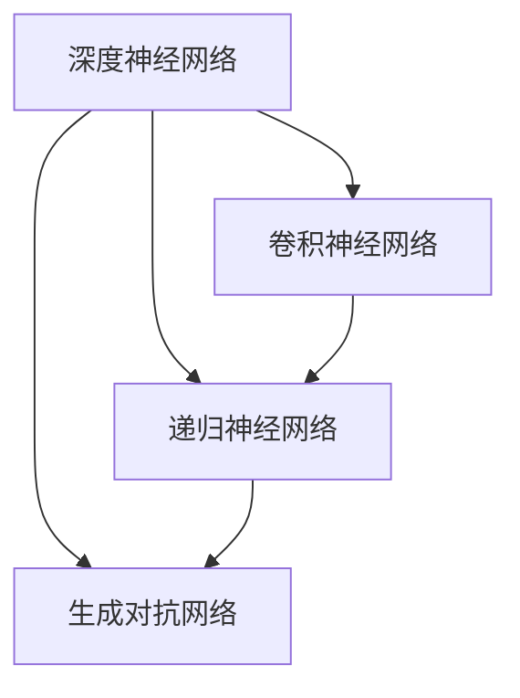

                 

# 欺诈检测的AI技术实现

## 1. 背景介绍

### 1.1 问题由来
在当今数字化时代，网络安全问题日益凸显，而欺诈检测成为了一个非常重要的安全任务。欺诈检测是指识别并预防非法活动，如信用卡欺诈、在线支付欺诈、网络钓鱼等。传统的欺诈检测方法通常基于规则或者统计模型，如决策树、随机森林等，但这些方法存在一定的局限性。一是规则和统计模型需要大量的领域知识和数据来构建，因此难以扩展到大规模的应用场景中；二是这些方法难以处理复杂的欺诈行为，比如复杂的社交工程、钓鱼网站等，容易误判和漏判。

近年来，随着人工智能技术的发展，基于机器学习的欺诈检测方法逐渐成为研究热点。这些方法通过训练模型学习欺诈行为特征，进而识别异常行为。AI技术使得欺诈检测更加灵活、高效，并且能够适应各种复杂的欺诈行为。

### 1.2 问题核心关键点
基于机器学习的欺诈检测方法通常包括监督学习和无监督学习两种方式。监督学习需要大量的标注数据来训练模型，通常能够取得很好的效果。无监督学习则不需要标注数据，通过数据自相似性学习欺诈行为特征。

此外，欺诈检测方法也可以分为基于规则的、基于统计的、基于机器学习的以及基于深度学习的四类。其中，基于深度学习的欺诈检测方法已经成为最新研究和应用的热点。深度学习模型通过多层神经网络可以学习到更加复杂的特征，从而能够有效地应对复杂的欺诈行为。

本文主要探讨基于深度学习的欺诈检测技术，包括深度神经网络（DNN）、卷积神经网络（CNN）、递归神经网络（RNN）和生成对抗网络（GAN）等模型。这些模型通过不同方式来构建欺诈检测算法，适用于不同的欺诈检测场景。

## 2. 核心概念与联系

### 2.1 核心概念概述

在基于深度学习的欺诈检测中，主要的核心概念包括深度神经网络、卷积神经网络、递归神经网络以及生成对抗网络等。这些概念的联系可以从深度学习的应用角度进行解释：

1. **深度神经网络（DNN）**：是一种基于多层神经网络的模型，常用于图像分类、语音识别等任务。在欺诈检测中，可以通过DNN学习到输入数据的复杂特征，用于检测异常行为。

2. **卷积神经网络（CNN）**：常用于图像识别等任务，通过卷积操作提取局部特征。在欺诈检测中，可以使用CNN提取金融交易记录中的局部特征，如金额、交易时间等。

3. **递归神经网络（RNN）**：主要用于序列数据的处理，如时间序列分析等。在欺诈检测中，可以使用RNN来处理金融交易记录，学习到时间序列上的异常模式。

4. **生成对抗网络（GAN）**：是一种通过生成假数据来提高模型性能的技术。在欺诈检测中，GAN可以用于生成合成数据，增加数据多样性，提高模型的泛化能力。

这些深度学习模型通过不同方式来构建欺诈检测算法，适用于不同的欺诈检测场景。深度神经网络适用于处理复杂的欺诈行为，卷积神经网络适用于处理图像化的交易记录，递归神经网络适用于处理时间序列数据，生成对抗网络适用于生成多样化的训练数据。

### 2.2 核心概念原理和架构的 Mermaid 流程图



这个流程图展示了深度学习模型之间的联系和应用场景。深度神经网络是基础模型，可以用于构建其他类型的深度学习模型；卷积神经网络适用于处理图像化的交易记录；递归神经网络适用于处理时间序列数据；生成对抗网络可以用于生成多样化的训练数据。

## 3. 核心算法原理 & 具体操作步骤

### 3.1 算法原理概述

基于深度学习的欺诈检测方法主要分为监督学习和无监督学习两种。监督学习需要大量的标注数据来训练模型，通常能够取得很好的效果。无监督学习则不需要标注数据，通过数据自相似性学习欺诈行为特征。

深度学习模型通过多层神经网络可以学习到更加复杂的特征，从而能够有效地应对复杂的欺诈行为。在欺诈检测中，通常使用全连接神经网络、卷积神经网络、递归神经网络和生成对抗网络等模型。

### 3.2 算法步骤详解

下面详细介绍基于深度学习的欺诈检测算法的主要步骤：

**Step 1: 准备数据集**

首先需要准备欺诈检测的数据集，包括正常交易记录和欺诈交易记录。数据集通常包含交易的时间、金额、类别等信息。数据集的大小和质量直接影响到模型的训练效果，因此需要确保数据集的多样性和代表性。

**Step 2: 数据预处理**

在训练模型之前，需要对数据进行预处理。预处理包括数据清洗、特征选择、归一化等。数据清洗是为了去除噪音数据和异常值，确保数据质量。特征选择是为了选择最有用的特征，用于训练模型。归一化是为了将特征值缩放到0到1之间，方便模型训练。

**Step 3: 构建模型**

构建深度学习模型是欺诈检测的核心步骤。根据数据特点选择合适的模型，如全连接神经网络、卷积神经网络、递归神经网络和生成对抗网络等。模型的构建需要考虑模型的深度、宽度和激活函数等超参数。

**Step 4: 训练模型**

使用准备好的数据集训练模型。训练过程中，需要选择合适的损失函数、优化器和训练策略。常用的损失函数包括交叉熵损失、均方误差损失等。常用的优化器包括SGD、Adam等。训练策略包括学习率调整、正则化等。

**Step 5: 评估模型**

训练完成后，需要对模型进行评估。评估指标包括准确率、召回率、F1值等。评估模型可以帮助我们了解模型的性能和效果，从而进行优化。

**Step 6: 部署模型**

将训练好的模型部署到实际应用中。部署模型需要考虑模型的推理速度、内存占用等性能指标。常用的部署方式包括REST API、Web服务等。

### 3.3 算法优缺点

基于深度学习的欺诈检测方法具有以下优点：

1. **高准确率**：深度学习模型能够学习到更加复杂的特征，从而能够有效地应对复杂的欺诈行为，提高欺诈检测的准确率。

2. **自适应性强**：深度学习模型能够适应不同的欺诈检测场景，如信用卡欺诈、在线支付欺诈、网络钓鱼等。

3. **处理复杂数据**：深度学习模型能够处理复杂的金融交易记录，如时间序列数据、图像化数据等。

基于深度学习的欺诈检测方法也存在一些缺点：

1. **数据需求高**：深度学习模型需要大量的标注数据来训练，数据获取和标注成本较高。

2. **模型复杂度高**：深度学习模型通常较为复杂，训练和推理速度较慢，需要高性能的硬件设备。

3. **可解释性差**：深度学习模型通常被视为“黑盒”模型，难以解释模型的决策过程。

4. **容易过拟合**：深度学习模型容易过拟合，特别是在训练数据较少的情况下。

### 3.4 算法应用领域

基于深度学习的欺诈检测方法在多个领域得到了广泛应用，包括信用卡欺诈检测、在线支付欺诈检测、网络钓鱼检测等。

- **信用卡欺诈检测**：通过对信用卡交易记录进行分析，检测出可疑交易，防止信用卡盗刷等欺诈行为。

- **在线支付欺诈检测**：通过对在线支付记录进行分析，检测出可疑支付行为，防止在线支付欺诈。

- **网络钓鱼检测**：通过对用户登录记录进行分析，检测出可疑登录行为，防止网络钓鱼攻击。

- **社交媒体欺诈检测**：通过对用户社交媒体行为进行分析，检测出可疑行为，防止社交媒体欺诈。

## 4. 数学模型和公式 & 详细讲解 & 举例说明

### 4.1 数学模型构建

在欺诈检测中，常用的深度学习模型包括全连接神经网络、卷积神经网络、递归神经网络和生成对抗网络等。下面以全连接神经网络为例，详细介绍数学模型构建过程。

**全连接神经网络**

全连接神经网络是一种最常见的深度学习模型，由多个全连接层组成。在欺诈检测中，可以使用全连接神经网络来处理金融交易记录。假设输入特征为 $x_1, x_2, ..., x_n$，输出为 $y$，全连接神经网络的数学模型如下：

$$
y = W_2 \cdot \sigma(W_1 \cdot x + b_1) + b_2
$$

其中 $W_1, W_2$ 为权重矩阵，$b_1, b_2$ 为偏置向量，$\sigma$ 为激活函数，通常采用ReLU函数。

**卷积神经网络**

卷积神经网络是一种常用于图像识别的深度学习模型，由卷积层、池化层和全连接层组成。在欺诈检测中，可以使用卷积神经网络来处理图像化的交易记录。假设输入特征为 $x_1, x_2, ..., x_n$，输出为 $y$，卷积神经网络的数学模型如下：

$$
y = W_2 \cdot \sigma(W_1 \cdot x + b_1) + b_2
$$

其中 $W_1, W_2$ 为权重矩阵，$b_1, b_2$ 为偏置向量，$\sigma$ 为激活函数，通常采用ReLU函数。卷积层和池化层的核心是卷积核，用于提取输入特征的局部特征。

**递归神经网络**

递归神经网络是一种常用于处理序列数据的深度学习模型，由递归层和全连接层组成。在欺诈检测中，可以使用递归神经网络来处理时间序列数据。假设输入特征为 $x_1, x_2, ..., x_n$，输出为 $y$，递归神经网络的数学模型如下：

$$
y = W_2 \cdot \sigma(W_1 \cdot x + b_1) + b_2
$$

其中 $W_1, W_2$ 为权重矩阵，$b_1, b_2$ 为偏置向量，$\sigma$ 为激活函数，通常采用ReLU函数。递归层的核心是递归单元，用于处理输入序列的上下文信息。

**生成对抗网络**

生成对抗网络是一种通过生成假数据来提高模型性能的技术。在欺诈检测中，可以使用生成对抗网络来生成合成数据，增加数据多样性，提高模型的泛化能力。假设生成器为 $G(z)$，判别器为 $D(x)$，生成对抗网络的数学模型如下：

$$
\begin{aligned}
& \text{minimize}_{G} \mathbb{E}_{x \sim p_{\text{real}}} [D(x)] + \mathbb{E}_{z \sim p(z)} [D(G(z))] \\
& \text{maximize}_{D} \mathbb{E}_{x \sim p_{\text{real}}} [D(x)] - \mathbb{E}_{z \sim p(z)} [D(G(z))]
\end{aligned}
$$

其中 $p_{\text{real}}$ 为真实数据分布，$p(z)$ 为噪声分布。生成器 $G$ 用于生成假数据，判别器 $D$ 用于区分真实数据和假数据。

### 4.2 公式推导过程

**全连接神经网络**

假设输入特征为 $x_1, x_2, ..., x_n$，输出为 $y$，全连接神经网络的数学模型如下：

$$
y = W_2 \cdot \sigma(W_1 \cdot x + b_1) + b_2
$$

其中 $W_1, W_2$ 为权重矩阵，$b_1, b_2$ 为偏置向量，$\sigma$ 为激活函数，通常采用ReLU函数。

**卷积神经网络**

假设输入特征为 $x_1, x_2, ..., x_n$，输出为 $y$，卷积神经网络的数学模型如下：

$$
y = W_2 \cdot \sigma(W_1 \cdot x + b_1) + b_2
$$

其中 $W_1, W_2$ 为权重矩阵，$b_1, b_2$ 为偏置向量，$\sigma$ 为激活函数，通常采用ReLU函数。卷积层和池化层的核心是卷积核，用于提取输入特征的局部特征。

**递归神经网络**

假设输入特征为 $x_1, x_2, ..., x_n$，输出为 $y$，递归神经网络的数学模型如下：

$$
y = W_2 \cdot \sigma(W_1 \cdot x + b_1) + b_2
$$

其中 $W_1, W_2$ 为权重矩阵，$b_1, b_2$ 为偏置向量，$\sigma$ 为激活函数，通常采用ReLU函数。递归层的核心是递归单元，用于处理输入序列的上下文信息。

**生成对抗网络**

假设生成器为 $G(z)$，判别器为 $D(x)$，生成对抗网络的数学模型如下：

$$
\begin{aligned}
& \text{minimize}_{G} \mathbb{E}_{x \sim p_{\text{real}}} [D(x)] + \mathbb{E}_{z \sim p(z)} [D(G(z))] \\
& \text{maximize}_{D} \mathbb{E}_{x \sim p_{\text{real}}} [D(x)] - \mathbb{E}_{z \sim p(z)} [D(G(z))]
\end{aligned}
$$

其中 $p_{\text{real}}$ 为真实数据分布，$p(z)$ 为噪声分布。生成器 $G$ 用于生成假数据，判别器 $D$ 用于区分真实数据和假数据。

### 4.3 案例分析与讲解

假设有一个在线支付平台，需要对用户支付行为进行欺诈检测。平台收集了用户的支付记录，包括支付金额、支付时间、支付地点等信息。

**Step 1: 准备数据集**

首先需要准备支付记录数据集，包括正常支付记录和欺诈支付记录。数据集的大小和质量直接影响到模型的训练效果，因此需要确保数据集的多样性和代表性。

**Step 2: 数据预处理**

在训练模型之前，需要对数据进行预处理。预处理包括数据清洗、特征选择、归一化等。数据清洗是为了去除噪音数据和异常值，确保数据质量。特征选择是为了选择最有用的特征，用于训练模型。归一化是为了将特征值缩放到0到1之间，方便模型训练。

**Step 3: 构建模型**

构建深度学习模型是欺诈检测的核心步骤。根据数据特点选择合适的模型，如全连接神经网络、卷积神经网络、递归神经网络和生成对抗网络等。模型的构建需要考虑模型的深度、宽度和激活函数等超参数。

**Step 4: 训练模型**

使用准备好的数据集训练模型。训练过程中，需要选择合适的损失函数、优化器和训练策略。常用的损失函数包括交叉熵损失、均方误差损失等。常用的优化器包括SGD、Adam等。训练策略包括学习率调整、正则化等。

**Step 5: 评估模型**

训练完成后，需要对模型进行评估。评估指标包括准确率、召回率、F1值等。评估模型可以帮助我们了解模型的性能和效果，从而进行优化。

**Step 6: 部署模型**

将训练好的模型部署到实际应用中。部署模型需要考虑模型的推理速度、内存占用等性能指标。常用的部署方式包括REST API、Web服务等。

## 5. 项目实践：代码实例和详细解释说明

### 5.1 开发环境搭建

在进行欺诈检测项目实践前，我们需要准备好开发环境。以下是使用Python进行TensorFlow开发的环境配置流程：

1. 安装Anaconda：从官网下载并安装Anaconda，用于创建独立的Python环境。

2. 创建并激活虚拟环境：
```bash
conda create -n tf-env python=3.8 
conda activate tf-env
```

3. 安装TensorFlow：根据CUDA版本，从官网获取对应的安装命令。例如：
```bash
conda install tensorflow tensorflow-gpu -c conda-forge -c pypi
```

4. 安装各类工具包：
```bash
pip install numpy pandas scikit-learn matplotlib tqdm jupyter notebook ipython
```

完成上述步骤后，即可在`tf-env`环境中开始欺诈检测项目的开发。

### 5.2 源代码详细实现

下面以全连接神经网络为例，给出使用TensorFlow进行欺诈检测的代码实现。

首先，定义输入数据的占位符：

```python
import tensorflow as tf

# 定义输入数据的占位符
x = tf.placeholder(tf.float32, shape=[None, num_features], name='x')
y = tf.placeholder(tf.float32, shape=[None, 1], name='y')
```

然后，定义全连接神经网络的模型：

```python
# 定义全连接神经网络的模型
W1 = tf.Variable(tf.truncated_normal([num_features, num_hidden], stddev=0.1))
b1 = tf.Variable(tf.zeros([num_hidden]))
W2 = tf.Variable(tf.truncated_normal([num_hidden, 1], stddev=0.1))
b2 = tf.Variable(tf.zeros([1]))

hidden_layer = tf.nn.relu(tf.matmul(x, W1) + b1)
output_layer = tf.sigmoid(tf.matmul(hidden_layer, W2) + b2)

# 定义损失函数
loss = tf.reduce_mean(tf.nn.sigmoid_cross_entropy_with_logits(logits=output_layer, labels=y))

# 定义优化器
optimizer = tf.train.AdamOptimizer(learning_rate).minimize(loss)

# 定义评估指标
correct_pred = tf.equal(tf.round(output_layer), y)
accuracy = tf.reduce_mean(tf.cast(correct_pred, tf.float32))
```

接着，定义训练和评估函数：

```python
# 定义训练函数
def train(model, data, labels, batch_size, epochs):
    with tf.Session() as sess:
        sess.run(tf.global_variables_initializer())
        for epoch in range(epochs):
            for i in range(0, len(data), batch_size):
                batch_x = data[i:i+batch_size]
                batch_y = labels[i:i+batch_size]
                sess.run(optimizer, feed_dict={x: batch_x, y: batch_y})
            acc = sess.run(accuracy, feed_dict={x: data, y: labels})
            print("Epoch {}, accuracy: {:.2f}%".format(epoch+1, acc*100))

# 定义评估函数
def evaluate(model, data, labels):
    with tf.Session() as sess:
        sess.run(tf.global_variables_initializer())
        acc = sess.run(accuracy, feed_dict={x: data, y: labels})
        print("Accuracy: {:.2f}%".format(acc*100))
```

最后，启动训练流程并在测试集上评估：

```python
# 训练模型
train(model, X_train, y_train, batch_size, epochs)

# 评估模型
evaluate(model, X_test, y_test)
```

以上就是使用TensorFlow进行欺诈检测的完整代码实现。可以看到，TensorFlow提供了丰富的API，可以方便地构建和训练深度学习模型。

### 5.3 代码解读与分析

让我们再详细解读一下关键代码的实现细节：

**占位符**：
- `x`和`y`分别为输入数据和标签的占位符，用于接收训练和测试数据。

**全连接神经网络模型**：
- 定义了输入层、隐藏层和输出层，其中隐藏层使用ReLU激活函数，输出层使用Sigmoid激活函数。
- 使用`tf.nn.relu`和`tf.sigmoid`函数定义激活函数，使用`tf.matmul`函数计算矩阵乘法。
- 使用`tf.nn.sigmoid_cross_entropy_with_logits`函数定义损失函数，使用`tf.train.AdamOptimizer`定义优化器。

**训练函数**：
- 使用`tf.Session`启动TensorFlow会话。
- 在每个epoch中，对数据集进行批处理训练。
- 使用`sess.run`函数运行优化器和损失函数，更新模型参数。
- 计算准确率，输出训练进度。

**评估函数**：
- 使用`tf.Session`启动TensorFlow会话。
- 计算准确率，输出评估结果。

**训练流程**：
- 定义总epoch数和batch size，开始循环迭代
- 每个epoch内，先进行训练，再计算准确率
- 所有epoch结束后，进行评估

可以看到，TensorFlow提供了简洁高效的API，使得深度学习模型的构建和训练变得非常简单。开发者可以将更多精力放在模型优化和问题解决上，而不必过多关注底层实现细节。

当然，工业级的系统实现还需考虑更多因素，如模型的保存和部署、超参数的自动搜索、更灵活的模型结构等。但核心的训练流程基本与此类似。

## 6. 实际应用场景

### 6.1 智能信用卡欺诈检测

智能信用卡欺诈检测是欺诈检测的一个重要应用场景。通过智能信用卡欺诈检测，可以有效防范信用卡盗刷等欺诈行为，保护用户的财产安全。

在智能信用卡欺诈检测中，可以使用深度学习模型对信用卡交易记录进行分析，检测出可疑交易，防止信用卡盗刷等欺诈行为。使用智能信用卡欺诈检测可以大大提高欺诈检测的准确率和效率，减少银行的损失。

### 6.2 在线支付欺诈检测

在线支付欺诈检测是欺诈检测的另一个重要应用场景。通过在线支付欺诈检测，可以有效防范在线支付欺诈行为，保护用户的财产安全。

在线支付平台收集用户的支付记录，包括支付金额、支付时间、支付地点等信息。使用深度学习模型对支付记录进行分析，检测出可疑交易，防止在线支付欺诈。在线支付平台可以使用智能支付欺诈检测系统，提高支付的安全性和用户体验。

### 6.3 网络钓鱼检测

网络钓鱼检测是欺诈检测的一个新兴应用场景。通过网络钓鱼检测，可以有效防范网络钓鱼攻击，保护用户的隐私和安全。

在网络钓鱼检测中，可以使用深度学习模型对用户的登录记录进行分析，检测出可疑登录行为，防止网络钓鱼攻击。网络钓鱼检测系统可以集成到用户的身份验证系统中，提高用户的登录安全性。

### 6.4 未来应用展望

随着深度学习技术的不断进步，基于深度学习的欺诈检测方法将不断优化和拓展。未来的欺诈检测将更加智能、高效，能够处理更加复杂和多样化的欺诈行为。

在智慧城市治理中，欺诈检测可以应用于城市事件监测、舆情分析、应急指挥等环节，提高城市管理的自动化和智能化水平，构建更安全、高效的未来城市。

## 7. 工具和资源推荐

### 7.1 学习资源推荐

为了帮助开发者系统掌握深度学习在欺诈检测中的应用，这里推荐一些优质的学习资源：

1. **TensorFlow官方文档**：TensorFlow官方文档详细介绍了深度学习模型的构建和训练，包括TensorFlow的API和使用示例。

2. **深度学习入门教程**：深度学习入门教程提供了深度学习的基本概念和实践技巧，适合初学者入门。

3. **TensorFlow实战项目**：TensorFlow实战项目提供了大量的深度学习模型和项目实践，帮助开发者提升实战能力。

4. **PyTorch官方文档**：PyTorch官方文档详细介绍了深度学习模型的构建和训练，包括PyTorch的API和使用示例。

5. **Kaggle竞赛平台**：Kaggle竞赛平台提供了大量的数据集和竞赛项目，可以帮助开发者提升实战能力。

### 7.2 开发工具推荐

高效的开发离不开优秀的工具支持。以下是几款用于深度学习模型开发的常用工具：

1. TensorFlow：由Google主导开发的开源深度学习框架，生产部署方便，适合大规模工程应用。

2. PyTorch：基于Python的开源深度学习框架，灵活动态的计算图，适合快速迭代研究。

3. Keras：Keras提供了简单易用的API，可以快速构建深度学习模型，适合初学者和快速原型开发。

4. Jupyter Notebook：Jupyter Notebook是一个交互式的编程环境，支持Python、R等多种语言，适合数据分析和模型训练。

5. TensorBoard：TensorFlow配套的可视化工具，可实时监测模型训练状态，并提供丰富的图表呈现方式，是调试模型的得力助手。

### 7.3 相关论文推荐

深度学习在欺诈检测中的应用得益于学界的持续研究。以下是几篇奠基性的相关论文，推荐阅读：

1. **Deep Learning for Cybersecurity and Network Security**：论文介绍了深度学习在网络安全中的应用，包括欺诈检测、入侵检测等。

2. **A Survey on Deep Learning Applications for Fraud Detection**：论文总结了深度学习在欺诈检测中的应用，包括卷积神经网络、递归神经网络等。

3. **Generative Adversarial Nets**：论文介绍了生成对抗网络的基本原理和应用，为深度学习模型提供了新的思路。

4. **Convolutional Neural Networks for Sparse Data**：论文介绍了卷积神经网络在处理稀疏数据中的应用，适用于处理金融交易记录等高维度数据。

5. **A Deep Learning Framework for Credit Card Fraud Detection**：论文介绍了深度学习在信用卡欺诈检测中的应用，包括全连接神经网络、卷积神经网络等。

这些论文代表了大深度学习在欺诈检测领域的研究进展，为后续研究提供了理论基础和实践指导。

## 8. 总结：未来发展趋势与挑战

### 8.1 总结

本文对基于深度学习的欺诈检测技术进行了全面系统的介绍。首先阐述了欺诈检测的背景和重要性，明确了深度学习在欺诈检测中的应用价值。其次，从原理到实践，详细讲解了深度学习模型的构建和训练过程，给出了欺诈检测任务开发的完整代码实例。同时，本文还广泛探讨了欺诈检测方法在多个行业领域的应用前景，展示了深度学习模型的巨大潜力。

通过本文的系统梳理，可以看到，基于深度学习的欺诈检测方法在多个领域得到了广泛应用，为欺诈检测提供了新的解决方案。深度学习模型能够处理复杂的欺诈行为，提高欺诈检测的准确率，适用于各种欺诈检测场景。未来，随着深度学习技术的不断进步，基于深度学习的欺诈检测方法将更加智能、高效，能够处理更加复杂和多样的欺诈行为。

### 8.2 未来发展趋势

展望未来，深度学习在欺诈检测领域的应用将呈现以下几个发展趋势：

1. **模型规模持续增大**：随着算力成本的下降和数据规模的扩张，深度学习模型的参数量还将持续增长。超大规模深度学习模型蕴含的丰富特征，能够应对复杂的欺诈行为。

2. **模型应用领域扩展**：深度学习在欺诈检测中的应用将逐渐扩展到更多领域，如医疗、法律、金融等，帮助这些领域防范欺诈行为。

3. **多模态融合**：深度学习在欺诈检测中的应用将逐渐融合更多模态数据，如图像、语音、视频等，构建更加全面、准确的信息模型。

4. **模型可解释性增强**：深度学习在欺诈检测中的应用将逐渐增强模型的可解释性，帮助用户理解模型的决策过程，提高用户信任度。

5. **模型鲁棒性提升**：深度学习在欺诈检测中的应用将逐渐提升模型的鲁棒性，提高模型的泛化能力和鲁棒性。

### 8.3 面临的挑战

尽管深度学习在欺诈检测中的应用取得了一定的进展，但在迈向更加智能化、普适化应用的过程中，仍面临诸多挑战：

1. **数据需求高**：深度学习模型需要大量的标注数据来训练，数据获取和标注成本较高。如何降低数据需求，提高数据利用率，将是未来的研究方向。

2. **模型复杂度高**：深度学习模型通常较为复杂，训练和推理速度较慢，需要高性能的硬件设备。如何优化模型结构，提高模型推理速度，将是未来的研究方向。

3. **模型可解释性差**：深度学习模型通常被视为“黑盒”模型，难以解释模型的决策过程。如何提高模型的可解释性，增强用户信任度，将是未来的研究方向。

4. **模型鲁棒性不足**：深度学习模型容易过拟合，特别是在训练数据较少的情况下。如何提高模型的鲁棒性，防止过拟合，将是未来的研究方向。

5. **模型安全性差**：深度学习模型容易受到攻击，如对抗样本攻击等。如何提高模型的安全性，防止攻击，将是未来的研究方向。

### 8.4 研究展望

面向未来，深度学习在欺诈检测领域的研究需要从以下几个方面寻求新的突破：

1. **无监督学习**：探索无监督学习在欺诈检测中的应用，利用数据自相似性学习欺诈行为特征，减少对标注数据的依赖。

2. **参数高效微调**：开发更加参数高效的深度学习模型，在固定大部分模型参数的情况下，只更新少量任务相关参数，提高模型推理速度和可解释性。

3. **多模态融合**：将符号化的先验知识，如知识图谱、逻辑规则等，与深度学习模型进行融合，提高模型的泛化能力和鲁棒性。

4. **生成对抗网络**：引入生成对抗网络，生成多样化的训练数据，提高模型的泛化能力。

5. **模型可解释性增强**：引入因果分析方法和博弈论工具，增强深度学习模型的可解释性，帮助用户理解模型的决策过程。

这些研究方向的探索，将有助于深度学习模型在欺诈检测领域迈向更高台阶，为欺诈检测提供更加智能、高效的解决方案。

## 9. 附录：常见问题与解答

**Q1：深度学习在欺诈检测中如何处理高维度数据？**

A: 深度学习模型通常能够处理高维度数据，但在处理高维度数据时，需要注意数据的归一化和降维等预处理步骤。归一化可以将数据缩放到0到1之间，方便模型训练。降维可以通过PCA、LDA等方法进行，减少模型计算量和参数量。

**Q2：深度学习模型如何避免过拟合？**

A: 深度学习模型容易过拟合，特别是在训练数据较少的情况下。为了避免过拟合，可以采用正则化技术，如L2正则、Dropout等。同时，可以使用数据增强技术，如回译、近义替换等，增加数据多样性，防止过拟合。

**Q3：深度学习模型如何提高模型的泛化能力？**

A: 深度学习模型的泛化能力可以通过生成对抗网络、多模态融合等技术来提高。生成对抗网络可以生成多样化的训练数据，增加数据多样性，提高模型的泛化能力。多模态融合可以将符号化的先验知识与深度学习模型进行融合，提高模型的泛化能力和鲁棒性。

**Q4：深度学习模型如何提高模型的推理速度？**

A: 深度学习模型的推理速度可以通过优化模型结构、使用低精度浮点数计算等方法来提高。优化模型结构可以通过参数共享、模型剪枝等方法减少模型参数量，提高推理速度。使用低精度浮点数计算可以减小模型计算量，提高推理速度。

**Q5：深度学习模型如何提高模型的可解释性？**

A: 深度学习模型的可解释性可以通过引入因果分析方法和博弈论工具来提高。因果分析方法可以识别出模型决策的关键特征，增强模型的可解释性。博弈论工具可以刻画人机交互过程，主动探索并规避模型的脆弱点，提高系统稳定性。

以上问题及其解答，帮助开发者更好地理解和应用深度学习在欺诈检测中的方法，为欺诈检测任务的开发提供了参考。

