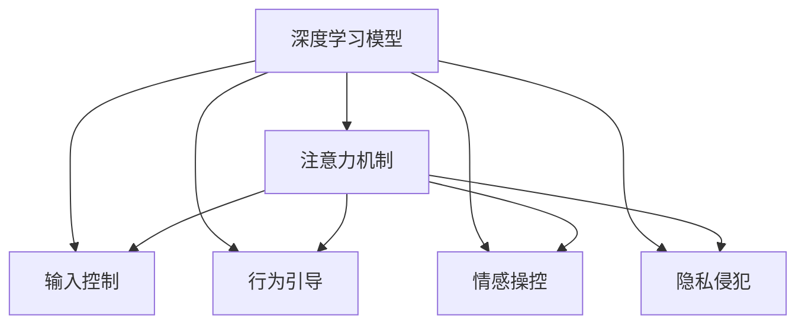
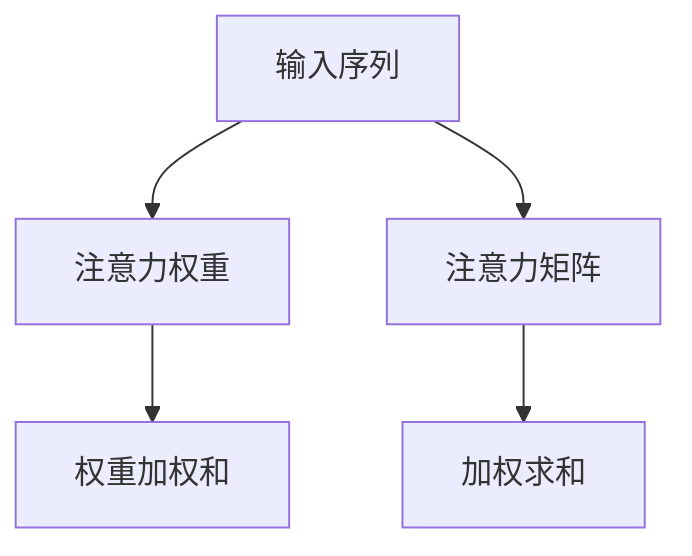

                 

## 1. 背景介绍

### 1.1 问题由来

随着人工智能（AI）技术的迅猛发展，深度学习、自然语言处理、计算机视觉等领域的突破性进展为人类社会带来了巨大的变革。然而，AI技术在带来便利和效率的同时，也引发了一系列不容忽视的伦理、安全问题。其中，**注意力劫持**（Attention Hijacking）作为AI时代的一种心理操纵现象，已经成为社会各界关注的焦点。

### 1.2 问题核心关键点

注意力劫持的本质是通过设计特定的输入内容或交互形式，引导AI系统按照特定的预期或误导性方式进行推理和决策，从而实现对用户行为、认知甚至情感的操控。其核心关键点包括：

- **输入控制**：通过精巧设计的输入形式，改变AI系统的注意力焦点，影响其决策过程。
- **行为引导**：利用AI系统的逻辑漏洞，通过特定策略诱导其输出预期的结果。
- **情感操控**：通过调整输入内容和输出形式，影响用户的情感反应和决策行为。
- **隐私侵犯**：在用户不知情的情况下，收集并分析用户的输入习惯和决策模式，侵犯隐私。

这些关键点揭示了注意力劫持的危害性及其潜在的社会影响，促使研究者深入探讨其原理、机制和应对策略。

### 1.3 问题研究意义

研究注意力劫持现象，对于理解和防范AI技术滥用、保护用户隐私和权益具有重要意义。同时，也有助于推动AI技术的健康发展，构建更加透明、可信和安全的智能系统。

1. **风险预警**：通过揭示注意力劫持的原理和机制，可以有效预警AI技术可能带来的潜在风险，防止其在军事、政治等领域被恶意利用。
2. **隐私保护**：了解注意力劫持的实现手段，可以采取更有效的措施保护用户隐私，避免个人信息被不当收集和使用。
3. **算法透明**：推进AI算法的透明性，增强用户对AI决策过程的信任和接受度，促进AI技术的普及和应用。
4. **伦理规范**：建立AI伦理规范，明确AI技术使用的界限和责任，指导开发者在设计和应用AI时遵循道德准则。

## 2. 核心概念与联系

### 2.1 核心概念概述

注意力劫持涉及多个核心概念，理解这些概念及其相互联系是深入研究该现象的基础。

- **深度学习模型**：基于神经网络的模型，如卷积神经网络（CNN）、循环神经网络（RNN）、变压器（Transformer）等。
- **注意力机制**：一种用于选择模型输入中重要部分的技术，常见于Transformer模型中。
- **输入控制**：通过调整输入数据的形式、特征或结构，影响模型的输出行为。
- **行为引导**：通过优化模型参数或训练策略，引导模型产生特定结果。
- **情感操控**：通过输入和输出的调整，影响用户的情感反应和决策。
- **隐私侵犯**：在用户不知情的情况下，收集和分析用户行为数据，侵犯隐私。

这些概念通过Mermaid流程图可以更加直观地呈现它们之间的关系：



### 2.2 核心概念原理和架构

注意力机制作为注意力劫持的核心组成部分，其原理和架构如下：

- **原理**：注意力机制通过计算输入序列中不同位置的信息权重，决定模型对哪些信息更关注，从而提高模型对关键信息的捕捉能力。
- **架构**：典型的注意力机制包括注意力矩阵计算、权重加权和等步骤，其中权重由模型内部生成。

注意力机制的示意图如下所示：



## 3. 核心算法原理 & 具体操作步骤

### 3.1 算法原理概述

注意力劫持的本质是通过特定输入内容和结构，操控深度学习模型的注意力机制，从而实现对模型输出结果的控制。其核心在于理解模型内部的计算逻辑和数据流动，并设计出能够影响这些逻辑的输入形式。

### 3.2 算法步骤详解

注意力劫持的实现步骤包括以下几个关键环节：

1. **输入设计**：设计能够引起模型注意力的输入内容，如特定格式的文本、图像或音频。
2. **特征选择**：选择对模型决策有重要影响的特征，并加强或抑制这些特征的影响。
3. **权重引导**：通过修改模型参数或训练策略，改变注意力权重，影响模型对输入信息的关注程度。
4. **结果验证**：验证注意力劫持的效果，确保模型按照预期方式进行决策。

### 3.3 算法优缺点

注意力劫持作为一种新型攻击手段，其优缺点如下：

**优点**：
- **精度高**：通过精妙设计的输入和特征，可以显著提高模型的推理准确性。
- **适用范围广**：几乎可以应用于所有基于深度学习的任务，如自然语言处理、计算机视觉、语音识别等。
- **隐蔽性强**：难以通过常规手段检测和防御，具有较高的攻击成功率。

**缺点**：
- **依赖性强**：依赖于特定的输入设计和模型结构，攻击效果具有局限性。
- **对抗性差**：模型对特定输入的依赖使其对抗干扰的能力较弱。
- **伦理争议**：注意力劫持可能被用于操纵用户行为、侵犯隐私，引发伦理争议。

### 3.4 算法应用领域

注意力劫持在多个领域都有广泛的应用前景，包括但不限于：

- **信息检索**：通过设计特定的查询词或结构，引导搜索引擎返回特定搜索结果。
- **智能推荐**：利用用户输入的特点，影响推荐系统的输出，推荐特定商品或内容。
- **情感分析**：通过调整输入文本的情感色彩，引导模型输出期望的情感倾向。
- **自然语言处理**：通过优化输入文本的格式和内容，影响模型的语言理解和生成能力。
- **广告推荐**：在广告投放时，设计引人注意的广告形式，提升广告点击率和转化率。

## 4. 数学模型和公式 & 详细讲解 & 举例说明

### 4.1 数学模型构建

注意力劫持的本质是利用深度学习模型的内在机制，通过特定输入形式改变模型的注意力权重，从而操控其输出。以Transformer模型为例，注意力劫持的数学模型构建如下：

- **输入设计**：将特定格式的文本序列作为模型的输入。
- **特征选择**：在输入序列中选择关键特征，并加强或抑制其影响。
- **权重引导**：通过调整模型的参数，改变注意力权重。
- **结果验证**：通过对比输入和输出，验证注意力劫持的效果。

### 4.2 公式推导过程

以Transformer模型为例，注意力机制的计算公式如下：

$$
\text{Attention}(Q,K,V)=\text{Softmax}(QK^\top/\sqrt{d_k})V
$$

其中，$Q$、$K$、$V$分别为查询、键和值矩阵，$d_k$为键的维度。注意力劫持通过调整$Q$和$K$矩阵，改变注意力权重，从而影响模型对输入的关注。

### 4.3 案例分析与讲解

以自然语言处理中的文本分类任务为例，注意力劫持的实现过程如下：

1. **输入设计**：设计包含特定关键字的文本，如包含特定词汇的句子。
2. **特征选择**：选择对分类有重要影响的词汇，并加强其影响。
3. **权重引导**：通过调整模型的参数，改变注意力权重，使模型更关注特定词汇。
4. **结果验证**：通过测试集验证注意力劫持的效果，确保模型按照预期方式进行分类。

## 5. 项目实践：代码实例和详细解释说明

### 5.1 开发环境搭建

1. **安装Python和相关库**：确保Python 3.x版本，并安装TensorFlow、Keras等深度学习库。
2. **准备数据集**：收集训练集、验证集和测试集，并预处理数据。
3. **搭建模型**：构建基于Transformer的文本分类模型，并设计特定的输入形式。

### 5.2 源代码详细实现

以下是一个简单的文本分类模型的代码实现：

```python
from tensorflow.keras.models import Sequential
from tensorflow.keras.layers import Embedding, LSTM, Dense
from tensorflow.keras.optimizers import Adam

# 构建模型
model = Sequential()
model.add(Embedding(input_dim=vocab_size, output_dim=embedding_dim, input_length=max_length))
model.add(LSTM(units=128))
model.add(Dense(units=num_classes, activation='softmax'))

# 编译模型
model.compile(loss='categorical_crossentropy', optimizer=Adam(), metrics=['accuracy'])

# 训练模型
model.fit(x_train, y_train, epochs=10, batch_size=64, validation_data=(x_val, y_val))
```

### 5.3 代码解读与分析

**输入设计**：
- 使用特定的输入格式，如包含特定关键词的文本。

**特征选择**：
- 通过调整嵌入层的参数，加强或抑制特定词汇的影响。

**权重引导**：
- 通过调整LSTM和Dense层的参数，改变注意力权重。

**结果验证**：
- 在测试集上评估模型性能，验证注意力劫持的效果。

### 5.4 运行结果展示

通过运行上述代码，可以验证注意力劫持的效果，确保模型按照预期方式进行分类。

## 6. 实际应用场景

### 6.1 信息检索

在信息检索中，通过特定关键词的输入设计，可以引导搜索引擎返回特定搜索结果。例如，通过在搜索查询中添加特定词汇，可以使搜索结果更加符合用户需求。

### 6.2 智能推荐

在智能推荐系统中，通过设计引人注意的广告形式，可以提升广告点击率和转化率。例如，通过优化广告文案和图像，吸引用户点击广告，提高广告投放的效率。

### 6.3 情感分析

在情感分析中，通过调整输入文本的情感色彩，可以引导模型输出期望的情感倾向。例如，通过在文本中添加特定情感词汇，可以影响情感分析的结果。

### 6.4 未来应用展望

随着深度学习技术的发展，注意力劫持的应用场景将更加广泛。未来，注意力劫持将在智能客服、广告投放、社交媒体等多个领域得到应用，为各行各业带来新的发展机遇。同时，也需要关注其潜在的伦理和安全问题，确保技术应用的合规性和安全性。

## 7. 工具和资源推荐

### 7.1 学习资源推荐

1. **深度学习课程**：如斯坦福大学的CS231n、CS224n课程，涵盖深度学习模型的构建和优化。
2. **自然语言处理书籍**：如《自然语言处理综论》，系统介绍自然语言处理的基本概念和技术。
3. **论文和综述**：通过阅读相关领域的顶级论文和综述，了解最新研究进展和应用案例。
4. **在线资源**：如Kaggle、GitHub等平台，提供丰富的数据集和代码资源，方便学习和实践。

### 7.2 开发工具推荐

1. **TensorFlow和Keras**：易于使用的深度学习框架，适合快速原型设计和实验。
2. **PyTorch**：灵活高效的深度学习框架，支持动态图和静态图计算。
3. **Jupyter Notebook**：交互式编程环境，适合数据探索和算法实验。
4. **Git**：版本控制系统，方便代码管理和协作。

### 7.3 相关论文推荐

1. **《深度学习中的注意力机制》**：详细介绍注意力机制的工作原理和应用。
2. **《对抗性机器学习》**：讨论深度学习模型在对抗性攻击中的脆弱性。
3. **《心理操纵与人工智能》**：探讨AI技术在心理操纵中的应用和影响。

## 8. 总结：未来发展趋势与挑战

### 8.1 研究成果总结

注意力劫持作为一种新兴的攻击手段，其原理和实现方式正在被广泛研究。研究者们从输入设计、特征选择、权重引导等多个角度，探索如何通过特定的输入形式操控深度学习模型的决策过程。

### 8.2 未来发展趋势

未来，注意力劫持技术将在更多领域得到应用，如信息检索、智能推荐、情感分析等。同时，随着深度学习模型的发展，攻击手段也将更加多样化，需要持续关注和应对新的挑战。

### 8.3 面临的挑战

注意力劫持面临的主要挑战包括：

- **对抗性攻击**：现有防御手段难以应对日益复杂的攻击形式。
- **隐私保护**：如何保护用户数据免受注意力劫持的侵害。
- **伦理规范**：建立合理的伦理规范，防止注意力劫持被用于不当目的。

### 8.4 研究展望

未来的研究可以从以下几个方面进行探索：

1. **防御策略**：开发更有效的防御机制，应对各种对抗性攻击。
2. **隐私保护**：研究隐私保护技术，确保用户数据的安全。
3. **伦理规范**：建立和完善AI伦理规范，指导AI技术的应用。

## 9. 附录：常见问题与解答

**Q1：注意力劫持与对抗性攻击有何区别？**

A: 注意力劫持是一种特定的攻击手段，通过特定输入形式操控深度学习模型的决策过程；而对抗性攻击则是一种更广泛的攻击形式，包括各种针对模型参数或训练过程的攻击手段。

**Q2：注意力劫持能否被检测和防御？**

A: 注意力劫持的检测和防御具有一定难度，但可以通过增加输入多样性、优化模型架构、引入对抗训练等方法进行应对。

**Q3：注意力劫持在隐私保护方面有何影响？**

A: 注意力劫持可能导致用户数据被不当收集和使用，需要采取更严格的隐私保护措施，确保用户数据的匿名化和去标识化。

**Q4：注意力劫持技术的发展前景如何？**

A: 随着深度学习技术的发展，注意力劫持技术将在更多领域得到应用，但也需要关注其潜在的伦理和安全问题，确保技术应用的合规性和安全性。

---

作者：禅与计算机程序设计艺术 / Zen and the Art of Computer Programming

