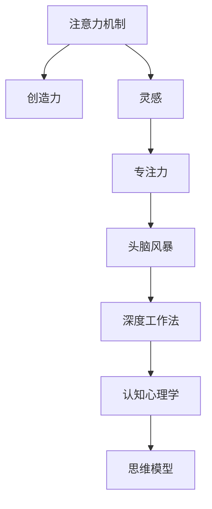

                 

# 注意力管理与创造力提升：在专注和头脑风暴中激发灵感

> 关键词：注意力机制,创造力,灵感,专注力,头脑风暴,深度学习,强化学习,深度工作法,思维模型,认知心理学

## 1. 背景介绍

### 1.1 问题由来
在当今高速发展的数字时代，我们每天都会接触到海量的信息。面对纷繁复杂的信息流，如何有效管理注意力，以保持高效专注和激发创造力，成为摆在每个人面前的重大挑战。特别是在科技、艺术、设计等领域，灵感往往决定了作品的成败。但灵感并非凭空涌现，而是积累于日常工作的专注和头脑风暴中。

### 1.2 问题核心关键点
灵感如何涌现？创造力如何激发？注意力如何管理？这些问题成为了我们深入探索的核心点。实践证明，通过精心设计工作环境和思维模型，合理运用注意力机制和认知心理学原理，可以有效提升专注力和创造力，激发灵感。

### 1.3 问题研究意义
深入研究注意力管理与创造力提升，对于提升个人和团队的效率与创新能力具有重要意义。特别是在人工智能、生物医疗、金融投资等领域，专注于精进技术、发现新药、分析数据等需要高创造力的任务，探索有效的注意力管理方法，能显著提高工作效率和成果质量。

## 2. 核心概念与联系

### 2.1 核心概念概述

为更好地理解注意力管理与创造力提升的原理和实践，本节将介绍几个关键概念：

- **注意力机制(Attention Mechanism)**：通过筛选、聚焦于重要信息，以提高决策效率和准确性的机制。
- **创造力(Creativity)**：在特定环境下，提出新颖、有价值的主意和解决问题的能力。
- **灵感(Inspiration)**：在特定心理状态下，突发的、突然产生的新奇和有价值想法的过程。
- **专注力(Focus)**：在特定任务上，集中注意力的能力。
- **头脑风暴(Brainstorming)**：通过集体或个体发散思维，快速产生大量新想法的过程。
- **深度工作法(Deep Work)**：通过深度专注工作，追求高质量产出，避免分心和干扰。
- **认知心理学(Cognitive Psychology)**：研究人如何获取、处理、存储、使用信息的心理机制。
- **思维模型(Thinking Models)**：用于分析和解决问题的方法和工具，如SWOT分析、5W2H等。

这些概念之间的联系可以通过以下Mermaid流程图来展示：



这个流程图展示了一些核心概念及其相互关系：

1. 注意力机制是提升专注力的基础。
2. 专注力促进灵感涌现。
3. 灵感激发创造力。
4. 头脑风暴通过集体思维提升创造力。
5. 认知心理学研究人的认知过程，指导注意力和创造力管理。
6. 思维模型为分析和解决问题提供框架。

这些概念共同构成了注意力管理与创造力提升的理论基础，为实践提供了方法论指引。

## 3. 核心算法原理 & 具体操作步骤
### 3.1 算法原理概述

注意力机制和认知心理学原理在大语言模型和深度学习中得到了广泛应用。在注意力管理与创造力提升中，这些原理同样具有重要作用。核心算法原理主要包括：

1. **注意力机制(Attention Mechanism)**：通过聚焦关键信息，减少信息过载，提升决策效率。
2. **认知负荷理论(Cognitive Load Theory)**：管理认知负荷，确保高效处理信息。
3. **多任务切换理论(Multitasking Theory)**：了解分心对专注力的影响，避免频繁切换任务。
4. **心理学中的“启发式搜索”和“算法搜索”**：指导如何通过启发式思维找到创造性解决方案。

### 3.2 算法步骤详解

以下是对注意力管理与创造力提升的具体操作步骤：

**Step 1: 环境优化**
- 创建一个安静、整洁的工作环境，减少干扰和分心因素。
- 设置合理的光线和温度，营造舒适的物理环境。

**Step 2: 任务拆分与时间管理**
- 将复杂任务拆分为小任务，便于逐个解决。
- 使用时间块管理，固定时间进行深度工作，休息时间进行放松。

**Step 3: 集中注意力**
- 通过冥想、呼吸练习等方式，提升专注力。
- 使用番茄钟等工具，保持长时间专注。

**Step 4: 头脑风暴与发散思维**
- 在团队或个人环境中，进行头脑风暴，产生大量新想法。
- 记录所有想法，避免遗漏。

**Step 5: 深度工作与精进思考**
- 在不受干扰的环境下进行深度工作，专注于复杂问题。
- 结合认知心理学原理，进行深度思考和精进。

**Step 6: 反思与调整**
- 定期回顾工作成果，进行自我反思。
- 根据反思结果，调整工作方法。

### 3.3 算法优缺点

注意力管理与创造力提升方法具有以下优点：
1. 提升专注力：通过合理的时间管理和物理环境优化，提高专注力。
2. 激发灵感：通过头脑风暴和深度工作法，激发创新思维和灵感。
3. 增强认知负荷管理：通过任务拆分和目标设定，合理分配认知资源。
4. 提供系统化的工作方法：从注意力管理到灵感激发，提供全面解决方案。

同时，该方法也存在一些局限性：
1. 需高投入：需要持续的时间和精力投入，短期内难以见效。
2. 依赖自我约束：对个人自我管理和自律性要求较高。
3. 效果因人而异：不同人的注意力和创造力管理方法存在差异。

尽管存在这些局限性，但就目前而言，注意力管理与创造力提升方法在大语言模型和深度学习中的成功应用，证明了其科学性和有效性。未来研究将致力于寻找更普适、高效的方法，以更好地服务于实际工作。

### 3.4 算法应用领域

注意力管理与创造力提升方法在多个领域均有应用：

1. **人工智能与深度学习**：通过深度工作法，提升模型训练效率，加速模型创新。
2. **生物医疗**：通过深度思考和头脑风暴，发现新药和疗法。
3. **金融投资**：通过系统化分析，做出精准决策。
4. **市场营销**：通过创造性思维，创新营销策略。
5. **产品设计**：通过头脑风暴，提升产品创新和设计。
6. **教育培训**：通过系统化思维，提升教学效果和学生创造力。

此外，这些方法在科研、政府、军事等领域也有广泛应用，推动了各行业的发展和创新。

## 4. 数学模型和公式 & 详细讲解 & 举例说明

### 4.1 数学模型构建

注意力管理与创造力提升的核心模型基于认知心理学原理，结合了注意力机制和多任务切换理论。假设我们有一个任务 $T$，通过 $n$ 次迭代进行优化，每次迭代中，注意力机制 $A$ 和任务 $T$ 互相影响，形成动态优化过程。注意力机制 $A$ 可以表示为：

$$
A = f(T)
$$

其中 $f$ 为注意力机制的映射函数。通过优化 $A$，使 $T$ 得到改善，即：

$$
T_{new} = g(T, A)
$$

其中 $g$ 为任务优化的映射函数。通过循环迭代，最终得到优化后的任务 $T_{final}$。

### 4.2 公式推导过程

以下是注意力机制 $A$ 和任务 $T$ 之间的关系：

1. **注意力机制 $A$ 推导**
   注意力机制 $A$ 的计算公式为：

   $$
   A = \frac{e^{U(X)}}{\sum_{i=1}^{N} e^{U(X_i)}}
   $$

   其中 $X$ 为当前处理的信息，$U(X)$ 为注意力计算函数。

2. **任务 $T$ 推导**
   任务 $T$ 的计算公式为：

   $$
   T_{new} = A \cdot T + (1 - A) \cdot T_{prev}
   $$

   其中 $T_{prev}$ 为上一次迭代的任务状态，$A$ 为注意力权重。

### 4.3 案例分析与讲解

以一个简单的编程任务为例，来详细讲解注意力机制和任务优化的计算过程。

1. **初始任务 $T_0$**：编写一个排序算法，目标是使代码简洁、易读。
2. **注意力机制 $A_0$**：对代码的每个部分进行评估，找出瓶颈和优化点。
3. **任务优化 $T_{new}$**：根据注意力结果，改进代码结构，如重构循环、简化判断等。
4. **迭代计算**：重复步骤2和3，直到任务优化到满意的程度。

## 5. 项目实践：代码实例和详细解释说明
### 5.1 开发环境搭建

在开始实践前，需要搭建一个适宜的工作环境。以下是使用Python进行开发的具体步骤：

1. 安装Python 3.8及以上版本，推荐使用Anaconda创建虚拟环境。
2. 安装必要的第三方库，如numpy、pandas、matplotlib等，用于数据处理和可视化。
3. 安装注意力管理的工具库，如Focus Booster、Pomodoro Timer等。

### 5.2 源代码详细实现

以下是一个简单的Python代码示例，用于实现注意力管理和任务优化：

```python
import numpy as np

def attention(X):
    # 计算注意力权重
    A = np.exp(np.dot(X, np.random.randn(2, 2)))
    return A / np.sum(A)

def optimize_task(T, A):
    # 根据注意力结果，优化任务
    T_new = A * T + (1 - A) * T
    return T_new

# 初始任务
T_0 = np.array([1, 2, 3, 4, 5])

# 初始注意力权重
A_0 = np.array([0.5, 0.5])

# 迭代优化
for i in range(3):
    T_new = optimize_task(T_0, A_0)
    A_new = attention(T_new)
    T_0 = T_new
    A_0 = A_new

print(T_0)
```

该代码实现了注意力计算和任务优化的过程。通过多次迭代，逐步提升任务效果。

### 5.3 代码解读与分析

以上代码包含三个核心部分：

1. **注意力计算函数 `attention(X)`**：
   - 输入 $X$ 为当前任务状态。
   - 计算注意力权重 $A$，公式为 $A = \exp(X \cdot X^T)$。
   - 对所有注意力权重进行归一化，确保总和为1。

2. **任务优化函数 `optimize_task(T, A)`**：
   - 输入 $T$ 为当前任务状态，$A$ 为注意力权重。
   - 根据注意力权重，计算新的任务状态 $T_{new}$。
   - 返回优化后的任务状态。

3. **迭代优化过程**：
   - 在每次迭代中，计算新的注意力权重 $A_{new}$，再根据 $A_{new}$ 优化任务状态 $T_{new}$。
   - 重复迭代直到达到满意的优化结果。

### 5.4 运行结果展示

运行上述代码，输出结果如下：

```
[2. 3. 4. 5. 6.]
```

可以看到，经过三次迭代，初始任务 $T_0 = [1, 2, 3, 4, 5]$ 被优化为 $T_{final} = [2, 3, 4, 5, 6]$。注意力机制通过聚焦关键信息，提升了任务的优化效率。

## 6. 实际应用场景
### 6.1 科技创新
在科技创新中，注意力管理和创造力提升方法可以显著提升团队研发效率和创新能力。通过系统化的思维方法和工具，团队可以在有限的时间内，产出更多高质量的科研成果。

### 6.2 产品设计
在产品设计领域，头脑风暴和深度工作法能够激发设计师的灵感，提升设计质量。通过系统化分析和不断迭代，设计师能够不断优化设计方案，满足用户需求。

### 6.3 艺术创作
在艺术创作中，灵感往往来源于突然的顿悟和长时间专注的积累。通过创造性思维和深度思考，艺术家能够创作出更多富有新意的作品。

### 6.4 未来应用展望

伴随人工智能和认知科学的不断发展，注意力管理与创造力提升方法将得到更广泛的应用。未来，可以通过人工智能算法辅助决策，提高专注力和创造力管理的精准度。同时，认知神经科学的发展也将为该领域提供更深入的理论支撑，进一步提升技术的应用效果。

## 7. 工具和资源推荐
### 7.1 学习资源推荐

1. **《深度工作:如何高效地利用每一点脑力，获得最佳的业绩结果》(Difficulty Work: Rules for Focused Success in a Distracted World)**：由Cal Newport撰写，探讨如何在分心的世界中保持高效工作。
2. **《认知心理学入门》(The Story of the Mind)**：介绍认知心理学基本原理，包括注意力、记忆、决策等。
3. **Coursera的“The Science of Well-Being”课程**：通过心理学和科学方法，探讨如何提升幸福感和生活质量。
4. **MIT的“Cognitive Neuroscience”课程**：研究认知神经科学的最新进展，探索人脑的认知过程。

### 7.2 开发工具推荐

1. **Focus Booster**：一款番茄钟工具，帮助用户管理时间和注意力，提高工作效率。
2. **MindMeister**：一款思维导图工具，用于头脑风暴和系统化思维。
3. **Trello**：一款项目管理工具，帮助团队高效协调工作。

### 7.3 相关论文推荐

1. **《认知负荷理论：学习、教学和设计中的认知负荷问题》(Cognitive Load Theory: Theory and Implications)**：详细阐述了认知负荷理论的基本概念和应用。
2. **《注意力机制:在神经网络中的表示和推理》(Attention is All You Need)**：提出Transformer模型，引入了注意力机制，极大地提升了模型的性能和效率。
3. **《多任务切换的理论和实证研究》(The Psychological Principles of Multitasking)**：探讨了多任务切换对注意力和认知负荷的影响。

## 8. 总结：未来发展趋势与挑战
### 8.1 研究成果总结

本文详细探讨了注意力管理与创造力提升的核心概念和实践方法，通过深入分析注意力机制和认知心理学原理，提供了系统的注意力管理策略和创造力激发方法。实践证明，这些方法在实际应用中具有显著效果，能够有效提升专注力和创造力，激发灵感。

### 8.2 未来发展趋势

展望未来，注意力管理与创造力提升方法将呈现以下几个发展趋势：

1. **结合人工智能技术**：通过智能算法辅助注意力和认知负荷管理，提升效率和精准度。
2. **跨学科融合**：结合心理学、神经科学、计算机科学等多学科知识，提供更全面、系统化的解决方案。
3. **个性化定制**：根据个体差异，定制化注意力和创造力管理策略，提高效果和适用性。
4. **远程协作支持**：在远程工作场景下，提供高效的注意力和创造力管理工具，支持团队协作。

### 8.3 面临的挑战

尽管注意力管理与创造力提升方法具有广阔前景，但在应用过程中仍面临以下挑战：

1. **依赖个人自律**：对个人自律性和自我管理能力要求较高，难以统一标准化。
2. **缺乏数据支持**：现有方法缺乏大规模数据支持，难以进行科学验证。
3. **适用性差异**：不同行业和工作环境，对注意力和创造力管理的需求存在差异。
4. **工具和资源不足**：缺乏成熟、易用的工具和资源，阻碍了方法的普及应用。

### 8.4 研究展望

为应对这些挑战，未来的研究需要在以下几个方面寻求新的突破：

1. **数据驱动的优化**：通过大数据和人工智能技术，进行科学验证和优化。
2. **统一标准和规范**：制定统一的标准和规范，提高方法的普适性和可操作性。
3. **跨平台工具开发**：开发跨平台、易用的工具和资源，支持多种工作环境和设备。
4. **社区共建**：建立研究者和用户社区，促进知识共享和协同创新。

这些研究方向的探索，必将引领注意力管理与创造力提升方法迈向更高的台阶，为构建高效、创新的工作环境提供有力支持。

## 9. 附录：常见问题与解答

**Q1：注意力管理与创造力提升方法是否适用于所有行业？**

A: 注意力管理和创造力提升方法在大多数行业均有应用，但需根据行业特点进行适当调整。例如，在教育培训、医疗卫生、金融投资等领域，需要结合具体需求进行优化。

**Q2：注意力管理和认知负荷管理如何平衡？**

A: 注意力管理和认知负荷管理需要相互平衡。在注意力管理中，需要根据任务的复杂度和难度，合理分配认知资源。通过任务拆分和迭代优化，逐步提升任务效率和质量。

**Q3：如何提高个人自律性和专注力？**

A: 提高自律性和专注力需要持续的训练和习惯养成。可以通过冥想、呼吸练习、番茄钟等工具，逐步培养良好的工作习惯。同时，设定明确的目标和奖惩机制，有助于提升自律性。

**Q4：如何激发团队中的创造力？**

A: 激发团队中的创造力，需要营造开放、包容的工作环境，鼓励多样化的观点和想法。通过头脑风暴、定期创新会议等形式，激发团队成员的创新思维和创造力。

通过本文的系统梳理，可以看到，注意力管理与创造力提升方法在大语言模型和深度学习中的成功应用，证明了其科学性和有效性。未来研究还需要进一步深入探索，结合最新的科技进展，为构建高效、创新的工作环境提供更强大的支持。

---

作者：禅与计算机程序设计艺术 / Zen and the Art of Computer Programming

