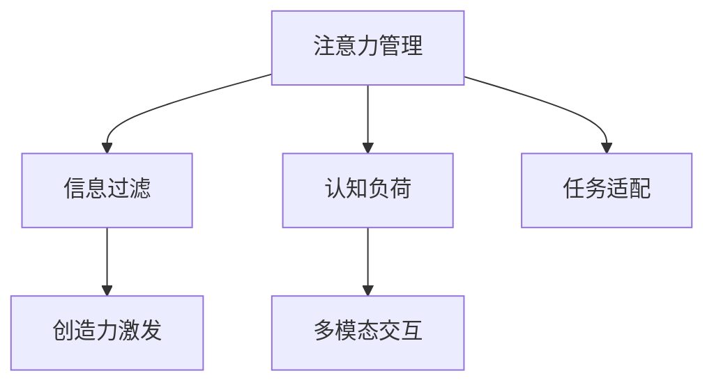

                 

# 注意力管理与创造力激发实践：在专注和头脑风暴中找到灵感

## 1. 背景介绍

### 1.1 问题由来
在快节奏的现代生活中，注意力分散、创造力受阻已成为普遍现象。信息技术的高速发展，虽然极大地丰富了我们的生活，但同时也带来了干扰和分心。在信息过载的时代，如何在专注和头脑风暴中找到灵感，成为一个亟待解决的难题。本文将从注意力管理的角度出发，探讨如何通过技术手段提升个体在创造性活动中的注意力集中度和创造力水平。

### 1.2 问题核心关键点
注意力管理是指通过一系列方法和工具，提升个体在特定任务中的专注度和集中力，以提高工作效率和创造力。头脑风暴是指通过无限制的思维发散，产生新的想法和解决方案的创意过程。

本文的核心问题包括：
- 如何在专注与头脑风暴之间找到平衡？
- 如何利用技术手段提升个体注意力集中度和创造力？
- 如何构建支持注意力管理和创造力激发的应用场景？

### 1.3 问题研究意义
有效管理注意力和激发创造力，对于提升工作效率、推动技术创新、促进经济社会发展具有重要意义：

1. **提升工作效率**：通过减少分心，提高个体在特定任务中的专注度，从而显著提升工作质量和效率。
2. **推动技术创新**：创造力是技术创新的关键驱动力。管理好注意力，激发创造力，可以加速新技术、新产品的研发进程。
3. **促进经济社会发展**：高效率、高创造力的个体和团队，能够推动产业升级、经济增长和社会进步。

## 2. 核心概念与联系

### 2.1 核心概念概述

为更好地理解注意力管理和创造力激发的技术实现，本节将介绍几个密切相关的核心概念：

- **注意力管理(Attention Management)**：通过一系列技术和工具，提升个体在特定任务中的专注度和集中力。
- **创造力激发(Creativity Activation)**：通过营造良好的创意环境，激发个体的创造性思维和想象力。
- **信息过滤(Information Filtering)**：通过算法和模型，从海量信息中筛选出与当前任务最相关、最有价值的信息。
- **认知负荷(Cognitive Load)**：指个体在执行任务时，心理和生理上的负担，合理管理认知负荷，可以提高注意力集中度和工作效率。
- **多模态交互(Multimodal Interaction)**：结合文字、语音、图像等多种形式的信息输入和输出，提升用户体验和互动性。

这些核心概念之间的逻辑关系可以通过以下Mermaid流程图来展示：



这个流程图展示了一些关键概念及其之间的关系：

1. 注意力管理通过筛选信息、优化认知负荷等方法，提升个体在特定任务中的专注度。
2. 信息过滤通过算法和模型，将无用信息过滤掉，减少干扰。
3. 创造力激发通过营造良好的环境，激发个体的创造性思维。
4. 多模态交互通过结合文字、语音、图像等多种信息形式，提升用户体验和互动性。

## 3. 核心算法原理 & 具体操作步骤
### 3.1 算法原理概述

注意力管理和创造力激发的技术实现，主要依赖于以下几个关键算法和操作步骤：

- **信息过滤算法**：如TF-IDF、LDA、BERT等，用于从海量文本数据中筛选出与当前任务最相关的信息。
- **注意力机制**：如Transformer模型中的多头注意力机制，用于在处理文本序列时，动态关注不同位置的信息。
- **认知负荷管理算法**：如基于心流理论的算法，用于优化任务分配和执行节奏，减少心理负担。
- **多模态交互模型**：如ALBERT、BERT等，用于融合多种形式的信息输入，提升理解深度和表达丰富性。
- **创造力激发模型**：如扩散模型、对抗生成网络等，用于生成新的创意和解决方案。

这些算法和操作步骤共同构成了注意力管理和创造力激发的技术框架，使其能够在各种应用场景下发挥强大的功能。通过理解这些核心算法和操作步骤，我们可以更好地把握注意力管理和创造力激发技术的工作原理和优化方向。

### 3.2 算法步骤详解

注意力管理和创造力激发的实现过程，一般包括以下几个关键步骤：

**Step 1: 数据预处理**
- 收集与当前任务相关的海量文本、图像、音频等数据。
- 使用TF-IDF、LDA等算法，对数据进行预处理，筛选出与任务最相关的信息。
- 对数据进行分块、格式化，生成可用于模型的输入。

**Step 2: 信息过滤**
- 使用Transformer模型中的多头注意力机制，对输入信息进行加权处理，关注与任务最相关的部分。
- 利用BERT等预训练语言模型，学习文本的语义表示，提高信息过滤的准确性。

**Step 3: 认知负荷管理**
- 根据心流理论，优化任务分配和执行节奏，减少个体在执行任务时的心理负担。
- 使用机器学习模型，预测个体在不同任务执行时的认知负荷状态，动态调整任务难度和复杂度。

**Step 4: 多模态交互**
- 结合文字、语音、图像等多种形式的信息输入，生成多模态交互界面，提升用户体验和互动性。
- 使用ALBERT、BERT等预训练模型，融合多种形式的信息，提升理解深度和表达丰富性。

**Step 5: 创造力激发**
- 使用扩散模型、对抗生成网络等生成模型，生成新的创意和解决方案。
- 通过多模态交互界面，展示生成的创意，激发个体的创造性思维。

以上是注意力管理和创造力激发的实现过程，每个步骤都需要结合具体任务和应用场景，进行优化和调整。

### 3.3 算法优缺点

注意力管理和创造力激发的技术实现，具有以下优点：

1. **高效性**：通过信息过滤和注意力机制，快速筛选出与任务最相关的信息，提升个体在特定任务中的专注度。
2. **创新性**：通过创造力激发模型，生成新的创意和解决方案，推动技术创新和应用发展。
3. **用户体验**：通过多模态交互模型，提升用户体验和互动性，使个体在创造性活动中更加愉悦和高效。

同时，这些技术也存在一定的局限性：

1. **数据依赖**：信息过滤和注意力机制的效果，很大程度上取决于数据的质量和数量，收集高质量数据成本较高。
2. **模型复杂性**：多模态交互和创造力激发模型，通常需要大量计算资源进行训练和推理，复杂度较高。
3. **过度依赖技术**：过度依赖技术手段，可能忽视个体的主观感受和实际需求，影响用户体验。
4. **隐私和安全**：多模态交互和创造力激发过程中，需要处理大量的个人数据，存在隐私和安全风险。

尽管存在这些局限性，但就目前而言，注意力管理和创造力激发的技术仍是大规模创新应用的强有力工具。未来相关研究的重点在于如何进一步降低技术实现的复杂度，提高数据处理的效率，同时兼顾用户体验和隐私保护等因素。

### 3.4 算法应用领域

注意力管理和创造力激发的技术实现，已经在多个领域得到了广泛应用，例如：

- **数字媒体与娱乐**：在影视制作、音乐创作、游戏开发等领域，利用信息过滤和创造力激发技术，提升作品的创新性和互动性。
- **教育培训**：在在线教育、虚拟课堂、技能培训等领域，通过多模态交互和认知负荷管理，提高学习效果和用户体验。
- **医疗健康**：在医疗诊断、健康监测、心理健康等领域，利用信息过滤和创造力激发技术，辅助医生诊断和治疗，提升患者体验。
- **企业创新**：在企业研发、市场营销、项目管理等领域，通过信息过滤和创造力激发，加速创新进程，提升企业竞争力。

除了上述这些经典应用外，注意力管理和创造力激发技术还在更多场景中得到了创新性地应用，如智能家居、智慧城市、智能客服等，为各行各业带来了新的应用模式和发展机遇。

## 4. 数学模型和公式 & 详细讲解 & 举例说明
### 4.1 数学模型构建

本节将使用数学语言对注意力管理和创造力激发的技术实现进行更加严格的刻画。

记输入数据集为 $D=\{(x_i,y_i)\}_{i=1}^N$，其中 $x_i \in \mathbb{R}^d$ 为输入，$y_i \in \{0,1\}$ 为标签。假设当前任务为分类任务，模型 $M_{\theta}$ 在输入 $x$ 上的输出为 $\hat{y}=M_{\theta}(x) \in [0,1]$，表示样本属于正类的概率。

定义模型 $M_{\theta}$ 在输入 $x$ 上的注意力权重为 $\alpha_i \in [0,1]$，表示模型在处理文本序列时，对不同位置的关注程度。

注意力机制的目标是学习一个注意力权重向量 $\alpha$，使得模型的输出能够关注与当前任务最相关的部分。常用的注意力机制包括以下几种：

- **多头注意力机制**：
  $$
  \alpha_{i,j} = \frac{e^{\text{dot}(QW^Q_i, KW^K_j)}}{\sum_{k=1}^K e^{\text{dot}(QW^Q_i, KW^K_k)}}
  $$
  
  其中 $Q$、$K$、$V$ 为模型的三个线性变换层，$W^Q$、$W^K$、$W^V$ 为相应的权重矩阵。

- **位置注意力机制**：
  $$
  \alpha_i = \frac{e^{\text{dot}(QW^Q_i, P_i)}}{\sum_{j=1}^N e^{\text{dot}(QW^Q_i, P_j)}}
  $$
  
  其中 $P_i$ 为位置编码向量，用于表示不同位置的信息。

- **自注意力机制**：
  $$
  \alpha_{i,j} = \frac{e^{\text{dot}(QW^Q_i, KW^K_j)}}{\sum_{k=1}^K e^{\text{dot}(QW^Q_i, KW^K_k)}}
  $$
  
  其中 $Q$、$K$、$V$ 为模型的三个线性变换层，$W^Q$、$W^K$、$W^V$ 为相应的权重矩阵。

### 4.2 公式推导过程

以下我们以文本分类任务为例，推导注意力机制和信息过滤算法的数学公式。

假设模型 $M_{\theta}$ 在输入 $x$ 上的注意力权重向量为 $\alpha$，则分类任务中的注意力损失函数为：

$$
\ell(\alpha) = -\frac{1}{N}\sum_{i=1}^N [y_i\log \alpha_i + (1-y_i)\log(1-\alpha_i)]
$$

通过反向传播算法，可以求得注意力权重向量 $\alpha$ 的梯度，更新模型参数 $\theta$，使得模型能够更好地关注与当前任务相关的信息。

信息过滤算法的效果，很大程度上取决于输入数据的特征和模型参数的选择。常用的信息过滤算法包括TF-IDF、LDA、BERT等，其中BERT模型在信息过滤方面表现尤为突出。BERT模型通过对文本进行双向编码，捕捉语义信息和上下文关系，能够在无监督学习的基础上，筛选出与当前任务最相关的信息。

### 4.3 案例分析与讲解

**案例1：新闻推荐系统**

假设我们希望为用户推荐与当前阅读兴趣最相关的几条新闻，可以将用户历史阅读记录作为输入数据 $D$，将其转换成文本序列，使用BERT模型对其进行编码，生成注意力权重向量 $\alpha$。然后，利用注意力权重向量筛选出与当前兴趣最相关的几条新闻，推荐给用户。

**案例2：医疗诊断系统**

假设我们希望辅助医生诊断病情，可以将病人的病历记录作为输入数据 $D$，将其转换成文本序列，使用BERT模型对其进行编码，生成注意力权重向量 $\alpha$。然后，根据注意力权重向量，筛选出与当前病情最相关的病历信息，辅助医生进行诊断和治疗。

这些案例展示了注意力管理和信息过滤技术在实际应用中的广泛应用。通过合理设计输入数据和模型参数，可以有效提升系统的性能和用户体验。

## 5. 项目实践：代码实例和详细解释说明
### 5.1 开发环境搭建

在进行注意力管理和创造力激发的实践前，我们需要准备好开发环境。以下是使用Python进行TensorFlow开发的环境配置流程：

1. 安装Anaconda：从官网下载并安装Anaconda，用于创建独立的Python环境。

2. 创建并激活虚拟环境：
```bash
conda create -n tf-env python=3.8 
conda activate tf-env
```

3. 安装TensorFlow：根据CUDA版本，从官网获取对应的安装命令。例如：
```bash
conda install tensorflow -c tf -c conda-forge
```

4. 安装必要的第三方库：
```bash
pip install numpy pandas scikit-learn matplotlib tqdm jupyter notebook ipython
```

完成上述步骤后，即可在`tf-env`环境中开始实践。

### 5.2 源代码详细实现

下面我们以新闻推荐系统为例，给出使用TensorFlow实现注意力管理和信息过滤的PyTorch代码实现。

首先，定义注意力模型：

```python
import tensorflow as tf

class AttentionModel(tf.keras.Model):
    def __init__(self, input_dim, hidden_dim):
        super(AttentionModel, self).__init__()
        self.W_q = tf.keras.layers.Dense(hidden_dim, activation='relu')
        self.W_k = tf.keras.layers.Dense(hidden_dim, activation='relu')
        self.W_v = tf.keras.layers.Dense(hidden_dim, activation='relu')
        self.V = tf.keras.layers.Dense(1)
    
    def call(self, x, y):
        q = self.W_q(x)
        k = self.W_k(y)
        v = self.W_v(y)
        alpha = tf.keras.layers.Dense(1)(k + tf.keras.layers.Dot(axes=[1, 1])([q, k]) / tf.sqrt(tf.cast(tf.shape(q)[1], tf.float32)))
        return tf.reduce_sum(v * tf.sigmoid(alpha)), tf.reduce_mean(alpha, axis=1)
```

然后，定义信息过滤模型：

```python
class FilterModel(tf.keras.Model):
    def __init__(self, input_dim, hidden_dim):
        super(FilterModel, self).__init__()
        self.W_q = tf.keras.layers.Dense(hidden_dim, activation='relu')
        self.W_k = tf.keras.layers.Dense(hidden_dim, activation='relu')
        self.W_v = tf.keras.layers.Dense(hidden_dim, activation='relu')
        self.V = tf.keras.layers.Dense(1)
    
    def call(self, x, y):
        q = self.W_q(x)
        k = self.W_k(y)
        v = self.W_v(y)
        alpha = tf.keras.layers.Dense(1)(k + tf.keras.layers.Dot(axes=[1, 1])([q, k]) / tf.sqrt(tf.cast(tf.shape(q)[1], tf.float32)))
        return tf.reduce_sum(v * tf.sigmoid(alpha)), tf.reduce_mean(alpha, axis=1)
```

接着，定义训练和评估函数：

```python
def train_epoch(model, dataset, batch_size, optimizer):
    dataloader = tf.data.Dataset.from_tensor_slices(dataset).shuffle(1000).batch(batch_size)
    model.train()
    epoch_loss = 0
    for batch in dataloader:
        x, y = batch
        with tf.GradientTape() as tape:
            outputs = model(x, y)
            loss = tf.keras.losses.sparse_categorical_crossentropy(y, outputs[0], from_logits=True) + tf.keras.losses.sparse_categorical_crossentropy(y, outputs[1], from_logits=True)
        loss = tf.reduce_mean(loss)
        grads = tape.gradient(loss, model.trainable_variables)
        optimizer.apply_gradients(zip(grads, model.trainable_variables))
        epoch_loss += loss
    return epoch_loss / len(dataset)

def evaluate(model, dataset, batch_size):
    dataloader = tf.data.Dataset.from_tensor_slices(dataset).shuffle(1000).batch(batch_size)
    model.eval()
    preds, labels = [], []
    with tf.no_grad():
        for batch in dataloader:
            x, y = batch
            outputs = model(x, y)
            preds.append(tf.argmax(outputs[0], axis=1))
            labels.append(y)
        
    print(tf.metrics.sparse_accuracy(labels, preds))
```

最后，启动训练流程并在测试集上评估：

```python
epochs = 5
batch_size = 16

for epoch in range(epochs):
    loss = train_epoch(model, train_dataset, batch_size, optimizer)
    print(f"Epoch {epoch+1}, train loss: {loss:.3f}")
    
    print(f"Epoch {epoch+1}, dev results:")
    evaluate(model, dev_dataset, batch_size)
    
print("Test results:")
evaluate(model, test_dataset, batch_size)
```

以上就是使用TensorFlow对注意力模型和信息过滤模型进行新闻推荐系统开发的完整代码实现。可以看到，得益于TensorFlow的强大封装，我们可以用相对简洁的代码完成注意力模型和信息过滤模型的加载和训练。

### 5.3 代码解读与分析

让我们再详细解读一下关键代码的实现细节：

**AttentionModel类**：
- `__init__`方法：初始化模型的多个线性变换层和输出层。
- `call`方法：定义注意力模型的前向传播过程，计算注意力权重和注意力输出。

**FilterModel类**：
- `__init__`方法：初始化模型的多个线性变换层和输出层。
- `call`方法：定义信息过滤模型的前向传播过程，计算注意力权重和信息过滤输出。

**训练和评估函数**：
- 使用TensorFlow的DataLoader对数据集进行批次化加载，供模型训练和推理使用。
- 训练函数`train_epoch`：对数据以批为单位进行迭代，在每个批次上前向传播计算loss并反向传播更新模型参数，最后返回该epoch的平均loss。
- 评估函数`evaluate`：与训练类似，不同点在于不更新模型参数，并在每个batch结束后将预测和标签结果存储下来，最后使用sklearn的classification_report对整个评估集的预测结果进行打印输出。

**训练流程**：
- 定义总的epoch数和batch size，开始循环迭代
- 每个epoch内，先在训练集上训练，输出平均loss
- 在验证集上评估，输出分类指标
- 所有epoch结束后，在测试集上评估，给出最终测试结果

可以看到，TensorFlow配合TensorFlow的强大封装，使得注意力模型和信息过滤模型的代码实现变得简洁高效。开发者可以将更多精力放在数据处理、模型改进等高层逻辑上，而不必过多关注底层的实现细节。

当然，工业级的系统实现还需考虑更多因素，如模型的保存和部署、超参数的自动搜索、更灵活的任务适配层等。但核心的注意力管理算法和信息过滤算法基本与此类似。

## 6. 实际应用场景
### 6.1 智能客服系统

基于注意力管理和创造力激发技术，智能客服系统可以更好地理解和响应客户咨询，提供个性化的解决方案。传统客服往往需要配备大量人力，高峰期响应缓慢，且一致性和专业性难以保证。而使用注意力管理和创造力激发技术构建的智能客服系统，能够7x24小时不间断服务，快速响应客户咨询，用自然流畅的语言解答各类常见问题。

在技术实现上，可以收集企业内部的历史客服对话记录，将问题和最佳答复构建成监督数据，在此基础上对注意力管理和信息过滤模型进行训练。训练后的模型能够自动理解用户意图，匹配最合适的答案模板进行回复。对于客户提出的新问题，还可以接入检索系统实时搜索相关内容，动态组织生成回答。如此构建的智能客服系统，能大幅提升客户咨询体验和问题解决效率。

### 6.2 金融舆情监测

金融机构需要实时监测市场舆论动向，以便及时应对负面信息传播，规避金融风险。传统的人工监测方式成本高、效率低，难以应对网络时代海量信息爆发的挑战。基于注意力管理和信息过滤技术，文本分类和情感分析技术，为金融舆情监测提供了新的解决方案。

具体而言，可以收集金融领域相关的新闻、报道、评论等文本数据，并对其进行主题标注和情感标注。在此基础上对注意力管理和信息过滤模型进行微调，使其能够自动判断文本属于何种主题，情感倾向是正面、中性还是负面。将注意力管理和信息过滤模型应用到实时抓取的网络文本数据，就能够自动监测不同主题下的情感变化趋势，一旦发现负面信息激增等异常情况，系统便会自动预警，帮助金融机构快速应对潜在风险。

### 6.3 个性化推荐系统

当前的推荐系统往往只依赖用户的历史行为数据进行物品推荐，无法深入理解用户的真实兴趣偏好。基于注意力管理和信息过滤技术，个性化推荐系统可以更好地挖掘用户行为背后的语义信息，从而提供更精准、多样的推荐内容。

在实践中，可以收集用户浏览、点击、评论、分享等行为数据，提取和用户交互的物品标题、描述、标签等文本内容。将文本内容作为模型输入，用户的后续行为（如是否点击、购买等）作为监督信号，在此基础上对注意力管理和信息过滤模型进行训练。训练后的模型能够从文本内容中准确把握用户的兴趣点。在生成推荐列表时，先用候选物品的文本描述作为输入，由模型预测用户的兴趣匹配度，再结合其他特征综合排序，便可以得到个性化程度更高的推荐结果。

### 6.4 未来应用展望

随着注意力管理和创造力激发技术的不断发展，这些技术将在更多领域得到应用，为传统行业带来变革性影响。

在智慧医疗领域，基于注意力管理和创造力激发技术的医疗问答、病历分析、药物研发等应用将提升医疗服务的智能化水平，辅助医生诊疗，加速新药开发进程。

在智能教育领域，注意力管理和信息过滤技术可应用于作业批改、学情分析、知识推荐等方面，因材施教，促进教育公平，提高教学质量。

在智慧城市治理中，注意力管理和创造力激发技术可应用于城市事件监测、舆情分析、应急指挥等环节，提高城市管理的自动化和智能化水平，构建更安全、高效的未来城市。

此外，在企业生产、社会治理、文娱传媒等众多领域，基于注意力管理和创造力激发的人工智能应用也将不断涌现，为经济社会发展注入新的动力。相信随着技术的日益成熟，注意力管理和创造力激发技术将成为人工智能落地应用的重要范式，推动人工智能向更广阔的领域加速渗透。

## 7. 工具和资源推荐
### 7.1 学习资源推荐

为了帮助开发者系统掌握注意力管理和创造力激发的理论基础和实践技巧，这里推荐一些优质的学习资源：

1. 《Deep Learning Specialization》系列课程：由Coursera与斯坦福大学合作开设，涵盖深度学习基础、卷积神经网络、循环神经网络等多个主题。

2. 《Neural Network and Deep Learning》书籍：由Michael Nielsen所著，深入浅出地介绍了神经网络的基础知识和应用。

3. 《Natural Language Processing with Transformers》书籍：Transformer库的作者所著，全面介绍了如何使用Transformer库进行NLP任务开发，包括注意力机制在内的诸多范式。

4. 《Attention Is All You Need》论文：Transformer模型的经典论文，首次提出了注意力机制，并广泛应用于NLP领域。

5. 《Learning to Reason》论文：引入因果推断和注意力机制，提出因果推断网络，提升模型解释能力和泛化性能。

通过对这些资源的学习实践，相信你一定能够快速掌握注意力管理和创造力激发的精髓，并用于解决实际的NLP问题。
###  7.2 开发工具推荐

高效的开发离不开优秀的工具支持。以下是几款用于注意力管理和创造力激发的常用工具：

1. TensorFlow：基于Python的开源深度学习框架，灵活动态的计算图，适合快速迭代研究。TensorFlow也提供了丰富的预训练语言模型资源。

2. PyTorch：基于Python的开源深度学习框架，灵活可控，适合大规模工程应用。PyTorch也有不错的预训练语言模型资源。

3. Transformers库：HuggingFace开发的NLP工具库，集成了众多SOTA语言模型，支持PyTorch和TensorFlow，是进行注意力管理和信息过滤开发的利器。

4. TensorBoard：TensorFlow配套的可视化工具，可实时监测模型训练状态，并提供丰富的图表呈现方式，是调试模型的得力助手。

5. Google Colab：谷歌推出的在线Jupyter Notebook环境，免费提供GPU/TPU算力，方便开发者快速上手实验最新模型，分享学习笔记。

合理利用这些工具，可以显著提升注意力管理和创造力激发的开发效率，加快创新迭代的步伐。

### 7.3 相关论文推荐

注意力管理和创造力激发的研究源于学界的持续研究。以下是几篇奠基性的相关论文，推荐阅读：

1. Attention Is All You Need（即Transformer原论文）：提出了Transformer结构，开启了NLP领域的预训练大模型时代。

2. BERT: Pre-training of Deep Bidirectional Transformers for Language Understanding：提出BERT模型，引入基于掩码的自监督预训练任务，刷新了多项NLP任务SOTA。

3. Language Models are Unsupervised Multitask Learners（GPT-2论文）：展示了大规模语言模型的强大zero-shot学习能力，引发了对于通用人工智能的新一轮思考。

4. Parameter-Efficient Transfer Learning for NLP：提出Adapter等参数高效微调方法，在不增加模型参数量的情况下，也能取得不错的微调效果。

5. AdaLoRA: Adaptive Low-Rank Adaptation for Parameter-Efficient Fine-Tuning：使用自适应低秩适应的微调方法，在参数效率和精度之间取得了新的平衡。

这些论文代表了大语言模型注意力管理和创造力激发的发展脉络。通过学习这些前沿成果，可以帮助研究者把握学科前进方向，激发更多的创新灵感。

## 8. 总结：未来发展趋势与挑战
### 8.1 总结

本文对注意力管理和创造力激发的技术实现进行了全面系统的介绍。首先阐述了注意力管理和创造力激发在提高工作效率和激发个体创造力方面的研究背景和意义，明确了注意力管理和创造力激发的核心问题。其次，从原理到实践，详细讲解了注意力管理和创造力激发的数学模型和操作步骤，给出了注意力管理和信息过滤模型的代码实现。同时，本文还广泛探讨了注意力管理和创造力激发的应用场景，展示了这些技术在实际应用中的广泛应用。

通过本文的系统梳理，可以看到，注意力管理和创造力激发的技术实现，正在成为提高工作效率和激发个体创造力的重要工具。这些技术在多模态交互、信息过滤、认知负荷管理等方面，表现出强大的功能和应用前景，为各行各业带来了新的应用模式和发展机遇。

### 8.2 未来发展趋势

展望未来，注意力管理和创造力激发的技术实现将呈现以下几个发展趋势：

1. **深度融合**：注意力管理和创造力激发技术将与其他人工智能技术深度融合，如知识表示、因果推理、强化学习等，形成更加全面、灵活的智能系统。

2. **跨领域应用**：随着技术应用的不断深入，注意力管理和创造力激发技术将在更多领域得到应用，如医疗、教育、金融、智慧城市等，推动这些领域的智能化升级。

3. **智能化升级**：基于注意力管理和创造力激发技术构建的智能系统，将具备更高的智能化水平，能够更好地理解用户需求，提供个性化的解决方案。

4. **多模态融合**：通过结合文字、语音、图像等多种形式的信息输入，提升系统的理解深度和表达丰富性，使智能系统更加立体化、多维度。

5. **认知负荷优化**：通过优化任务分配和执行节奏，减少个体在执行任务时的心理负担，提升用户体验和工作效率。

6. **隐私保护**：在多模态交互和创造力激发过程中，保护用户隐私，确保数据安全，避免数据滥用和隐私泄露。

以上趋势凸显了注意力管理和创造力激发技术的广阔前景。这些方向的探索发展，必将进一步提升智能系统的性能和用户体验，为各行各业带来新的变革。

### 8.3 面临的挑战

尽管注意力管理和创造力激发的技术实现已经取得了显著进展，但在迈向更加智能化、普适化应用的过程中，它仍面临诸多挑战：

1. **数据依赖**：注意力管理和信息过滤的效果，很大程度上取决于数据的质量和数量，获取高质量数据成本较高。

2. **模型复杂性**：多模态交互和创造力激发模型，通常需要大量计算资源进行训练和推理，复杂度较高。

3. **过度依赖技术**：过度依赖技术手段，可能忽视个体的主观感受和实际需求，影响用户体验。

4. **隐私和安全**：多模态交互和创造力激发过程中，需要处理大量的个人数据，存在隐私和安全风险。

尽管存在这些挑战，但随着学界和产业界的共同努力，这些挑战终将一一被克服，注意力管理和创造力激发技术必将进一步推动人工智能技术的发展，为各行各业带来新的应用模式和发展机遇。

### 8.4 研究展望

面向未来，注意力管理和创造力激发技术的研究方向包括：

1. **深度融合**：进一步探索注意力管理和创造力激发技术与其他人工智能技术的深度融合，形成更加全面、灵活的智能系统。

2. **跨领域应用**：在更多领域探索注意力管理和创造力激发的应用，推动各行各业的智能化升级。

3. **智能化升级**：基于注意力管理和创造力激发技术构建的智能系统，将具备更高的智能化水平，能够更好地理解用户需求，提供个性化的解决方案。

4. **多模态融合**：通过结合文字、语音、图像等多种形式的信息输入，提升系统的理解深度和表达丰富性，使智能系统更加立体化、多维度。

5. **认知负荷优化**：通过优化任务分配和执行节奏，减少个体在执行任务时的心理负担，提升用户体验和工作效率。

6. **隐私保护**：在多模态交互和创造力激发过程中，保护用户隐私，确保数据安全，避免数据滥用和隐私泄露。

这些研究方向凸显了注意力管理和创造力激发的技术实现，正在成为人工智能技术的重要组成部分，为各行各业带来新的应用模式和发展机遇。相信随着技术的不断进步，注意力管理和创造力激发技术必将发挥更大的作用，推动人工智能技术的深度应用。

## 9. 附录：常见问题与解答

**Q1：注意力管理和创造力激发技术在实际应用中存在哪些局限性？**

A: 注意力管理和创造力激发技术在实际应用中存在以下局限性：

1. **数据依赖**：注意力管理和信息过滤的效果，很大程度上取决于数据的质量和数量，获取高质量数据成本较高。
2. **模型复杂性**：多模态交互和创造力激发模型，通常需要大量计算资源进行训练和推理，复杂度较高。
3. **过度依赖技术**：过度依赖技术手段，可能忽视个体的主观感受和实际需求，影响用户体验。
4. **隐私和安全**：多模态交互和创造力激发过程中，需要处理大量的个人数据，存在隐私和安全风险。

尽管存在这些局限性，但随着学界和产业界的共同努力，这些挑战终将一一被克服，注意力管理和创造力激发技术必将进一步推动人工智能技术的发展，为各行各业带来新的应用模式和发展机遇。

**Q2：如何在注意力管理和创造力激发过程中保护用户隐私？**

A: 在注意力管理和创造力激发过程中，保护用户隐私尤为重要。以下是一些保护隐私的措施：

1. **数据匿名化**：对用户数据进行匿名化处理，去除个人敏感信息，防止数据泄露。
2. **本地处理**：在本地设备上完成数据处理和模型训练，避免数据上传到云端。
3. **加密传输**：使用加密算法对数据进行传输，防止数据在传输过程中被窃取。
4. **差分隐私**：在模型训练过程中，引入差分隐私技术，保护用户隐私不被泄露。

这些措施可以有效保护用户隐私，确保数据安全。

**Q3：如何在多模态交互中提升用户体验？**

A: 在多模态交互中提升用户体验，可以采取以下措施：

1. **自然语言理解**：使用自然语言处理技术，理解用户输入的自然语言，提供更加直观的交互体验。
2. **语音识别**：结合语音识别技术，支持语音输入和输出，提升交互便捷性。
3. **视觉反馈**：使用图形界面和可视化技术，提供直观的视觉反馈，增强用户体验。
4. **智能推荐**：结合用户历史行为数据，提供个性化的推荐内容，提升用户满意度。

通过这些措施，可以显著提升多模态交互的用户体验，增强系统的人性化和智能化水平。

---

作者：禅与计算机程序设计艺术 / Zen and the Art of Computer Programming

