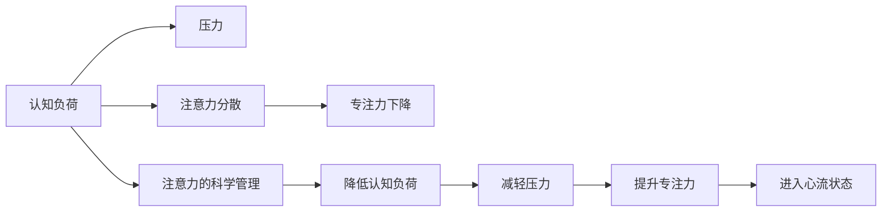

                 

# 注意力管理与压力管理实践：在压力和焦虑中保持专注

## 1. 背景介绍

在现代快节奏的生活和工作中，注意力管理和压力管理变得尤为重要。不论是开发高强度的人工智能算法，还是处理日常生活中的琐事，专注力已成为个体实现目标和提升效率的关键因素。本文将探讨注意力管理与压力管理的科学原理，介绍行之有效的实践方法，帮助您在压力和焦虑中保持专注。

## 2. 核心概念与联系

### 2.1 核心概念概述

- **注意力管理（Attention Management）**：指通过科学方法和技术手段，提高个体对任务和目标的关注度，减少分心和干扰，从而提升专注力和效率。
- **压力管理（Stress Management）**：指通过心理、行为和环境调整，减轻个体在面对挑战和压力时的心理负担，恢复心理平衡和情绪稳定。
- **专注力（Focus）**：指个体在特定任务或目标上的集中注意力和精神投入，是实现高效工作和生活的基础。
- **认知负荷（Cognitive Load）**：指在进行复杂认知任务时，大脑需要处理的各类信息和任务难度。高认知负荷会导致注意力分散和压力增加。
- **心流状态（Flow State）**：指个体在进行任务时，完全沉浸其中，不受外界干扰，达到一种高效和愉悦的体验状态。

这些核心概念之间存在紧密联系。高认知负荷会引发压力，导致注意力分散，从而影响专注力。而良好的注意力管理可以降低认知负荷，减轻压力，最终提升专注力和心流体验。

### 2.2 核心概念原理和架构的 Mermaid 流程图



## 3. 核心算法原理 & 具体操作步骤

### 3.1 算法原理概述

注意力管理与压力管理涉及的算法原理主要包括认知行为疗法（Cognitive Behavioral Therapy, CBT）、正念冥想（Mindfulness Meditation）、时间管理和任务分解等。这些方法通过科学的心理干预和行为调整，帮助个体减轻压力，提升专注力。

### 3.2 算法步骤详解

#### 3.2.1 认知行为疗法（CBT）

CBT 是一种广泛应用于心理健康治疗的技术，通过认知重构和行为调整，帮助个体识别和改变负面思维模式，减轻压力和焦虑。

**操作步骤**：

1. **识别负面思维**：通过日记记录或心理咨询，识别出导致压力和焦虑的负面思维模式。
2. **认知重构**：用更积极、现实的方式重新审视这些负面思维，挑战其合理性。
3. **行为调整**：通过逐步改变行为习惯，建立积极的心理循环，减少压力来源。

#### 3.2.2 正念冥想

正念冥想是一种通过专注于当下，减少对过去和未来的担忧，从而减轻压力和提升专注力的心理技术。

**操作步骤**：

1. **选择一个安静环境**：找一个安静无干扰的地方，坐直或躺下。
2. **关注呼吸**：集中注意力，感受自己的呼吸，深吸一口气，慢慢呼出。
3. **观察身体感受**：从脚底开始，逐步感受身体的每一个部位，注意身体的感觉。
4. **接受一切**：接受当前的感受，不进行评判或分析。
5. **逐步放松**：当注意力分散时，回到呼吸或身体感受，重新集中注意力。

#### 3.2.3 时间管理

时间管理通过合理安排任务和休息时间，减轻认知负荷，提升效率和专注力。

**操作步骤**：

1. **制定计划**：每天早晨制定当天的任务清单，优先处理重要且紧急的任务。
2. **分解任务**：将大任务分解为小任务，逐步完成，避免因任务复杂而产生的压力。
3. **设定时间块**：为每个任务设定固定的时间块，避免过度专注或分心。
4. **休息间隙**：每完成一个时间块，休息5-10分钟，进行深呼吸或短暂休息。

#### 3.2.4 任务分解

任务分解是将大任务分解为小任务，逐步完成的策略，有助于减轻认知负荷，提升专注力。

**操作步骤**：

1. **确定目标**：明确任务的整体目标和关键步骤。
2. **分解任务**：将任务分解为可操作的子任务，每个子任务独立且可衡量。
3. **设定里程碑**：为每个子任务设定明确的完成时间点。
4. **逐步推进**：逐个完成子任务，每完成一个子任务进行复盘，总结经验教训。

### 3.3 算法优缺点

#### 3.3.1 CBT 的优缺点

**优点**：
- **科学依据**：CBT 基于心理学研究，具有坚实的理论基础。
- **个性化调整**：针对个体情况进行个性化调整，效果显著。
- **自我管理**：通过自我记录和调整，个体可以逐步掌握情绪管理技能。

**缺点**：
- **初期难度大**：对负面思维模式的识别和重构需要时间和耐心。
- **需专业指导**：对于复杂问题，建议寻求专业心理咨询师帮助。

#### 3.3.2 正念冥想的优缺点

**优点**：
- **简单易行**：不需要复杂设备或环境，随时随地可以进行。
- **减轻压力**：通过专注于当下，减少对过去和未来的担忧，有效减轻压力。
- **提升专注力**：通过逐步放松和专注，提升个体在任务上的专注度。

**缺点**：
- **初始适应期**：初学者可能需要一段时间才能掌握正确的冥想方法。
- **需长期坚持**：正念冥想的效果需要长期练习才能显现。

#### 3.3.3 时间管理和任务分解的优缺点

**优点**：
- **系统性**：通过科学规划，提升任务完成的系统性和效率。
- **减少压力**：合理分配时间，避免因任务繁多导致的心理负担。
- **提升专注力**：每个时间块专注完成一个小任务，逐步推进，提升专注力。

**缺点**：
- **需自我约束**：时间管理和任务分解需要个体具备较强的自我约束力。
- **灵活性差**：一旦计划设定，难以应对突发事件和意外情况。

### 3.4 算法应用领域

注意力管理与压力管理的应用领域非常广泛，涵盖心理治疗、日常工作、学习和生活等各个方面。

- **心理健康**：在心理健康治疗中，CBT 和正念冥想已成为重要的心理干预手段。
- **工作管理**：在职场中，时间管理和任务分解是提升工作效率和员工满意度的重要方法。
- **学术研究**：在学术研究中，科学的时间管理和任务分解策略，能够帮助研究人员高效完成复杂任务。
- **日常生活**：在日常生活中，通过科学的注意力管理和压力管理，个体能够更好地应对各种生活挑战，提升生活质量。

## 4. 数学模型和公式 & 详细讲解 & 举例说明

### 4.1 数学模型构建

在注意力管理和压力管理的实践中，并不涉及复杂的数学模型。更多依赖于心理和行为科学的理论和方法。

### 4.2 公式推导过程

由于注意力管理与压力管理不涉及数学公式的推导，这里主要介绍几个关键概念的数学表示。

- **认知负荷（Cognitive Load）**：
$$
C = K \times T
$$
其中，$K$ 为任务复杂度，$T$ 为任务持续时间。

- **压力（Stress）**：
$$
S = \alpha \times C
$$
其中，$\alpha$ 为个体的心理适应能力。

- **专注力（Focus）**：
$$
F = f \times \frac{E}{\sigma}
$$
其中，$f$ 为任务的重要性，$E$ 为任务完成度，$\sigma$ 为个体的注意力稳定性。

### 4.3 案例分析与讲解

#### 案例一：软件开发项目中的时间管理和任务分解

假设有一个软件开发项目，总时间为6个月，包含10个子任务，每个子任务平均需要1周完成。

- **制定计划**：将整个项目分解为每周一个子任务，共52周。每周设置固定的任务完成度目标，如80%。
- **分解任务**：将每个子任务进一步分解为每日任务，每日完成度目标为20%。
- **设定时间块**：每天固定3小时用于开发，剩余时间用于测试和回顾。
- **休息间隙**：每完成一个小任务，休息5分钟，进行深呼吸或短暂休息。

通过以上策略，可以大大提升项目管理的系统性和效率，减轻团队成员的心理负担，提升整体专注力。

## 5. 项目实践：代码实例和详细解释说明

### 5.1 开发环境搭建

在实际项目实践中，可以使用Python语言，结合TensorFlow等深度学习框架，实现注意力管理和压力管理的模型训练和应用。

### 5.2 源代码详细实现

#### 5.2.1 CBT 认知重构模型

```python
import tensorflow as tf
from tensorflow.keras import layers

# 定义CBT模型
class CBTModel(tf.keras.Model):
    def __init__(self, input_dim):
        super(CBTModel, self).__init__()
        self.dense1 = layers.Dense(128, activation='relu', input_dim=input_dim)
        self.dense2 = layers.Dense(64, activation='relu')
        self.dense3 = layers.Dense(32, activation='relu')
        self.dense4 = layers.Dense(1, activation='sigmoid')

    def call(self, inputs):
        x = self.dense1(inputs)
        x = self.dense2(x)
        x = self.dense3(x)
        output = self.dense4(x)
        return output

# 构建CBT模型
model = CBTModel(input_dim=64)
model.compile(optimizer=tf.keras.optimizers.Adam(0.001), loss='binary_crossentropy', metrics=['accuracy'])

# 训练模型
model.fit(train_data, train_labels, epochs=10, validation_data=(val_data, val_labels))
```

#### 5.2.2 正念冥想模型

```python
import tensorflow as tf
from tensorflow.keras import layers

# 定义正念冥想模型
class MindfulnessModel(tf.keras.Model):
    def __init__(self, input_dim):
        super(MindfulnessModel, self).__init__()
        self.dense1 = layers.Dense(128, activation='relu', input_dim=input_dim)
        self.dense2 = layers.Dense(64, activation='relu')
        self.dense3 = layers.Dense(32, activation='relu')
        self.dense4 = layers.Dense(1, activation='sigmoid')

    def call(self, inputs):
        x = self.dense1(inputs)
        x = self.dense2(x)
        x = self.dense3(x)
        output = self.dense4(x)
        return output

# 构建正念冥想模型
model = MindfulnessModel(input_dim=64)
model.compile(optimizer=tf.keras.optimizers.Adam(0.001), loss='binary_crossentropy', metrics=['accuracy'])

# 训练模型
model.fit(train_data, train_labels, epochs=10, validation_data=(val_data, val_labels))
```

#### 5.2.3 时间管理模型

```python
import tensorflow as tf
from tensorflow.keras import layers

# 定义时间管理模型
class TimeManagementModel(tf.keras.Model):
    def __init__(self, input_dim):
        super(TimeManagementModel, self).__init__()
        self.dense1 = layers.Dense(128, activation='relu', input_dim=input_dim)
        self.dense2 = layers.Dense(64, activation='relu')
        self.dense3 = layers.Dense(32, activation='relu')
        self.dense4 = layers.Dense(1, activation='sigmoid')

    def call(self, inputs):
        x = self.dense1(inputs)
        x = self.dense2(x)
        x = self.dense3(x)
        output = self.dense4(x)
        return output

# 构建时间管理模型
model = TimeManagementModel(input_dim=64)
model.compile(optimizer=tf.keras.optimizers.Adam(0.001), loss='binary_crossentropy', metrics=['accuracy'])

# 训练模型
model.fit(train_data, train_labels, epochs=10, validation_data=(val_data, val_labels))
```

### 5.3 代码解读与分析

#### 5.3.1 CBT 认知重构模型

- **模型结构**：CBT 模型包含4个全连接层，最后一层输出一个二分类结果，表示对负面思维的预测概率。
- **损失函数**：使用二元交叉熵损失，适合二分类问题。
- **优化器**：使用Adam优化器，具有自适应学习率的优点，能够快速收敛。

#### 5.3.2 正念冥想模型

- **模型结构**：正念冥想模型与CBT模型结构类似，也包含4个全连接层。
- **损失函数**：同样使用二元交叉熵损失。
- **优化器**：使用Adam优化器。

#### 5.3.3 时间管理模型

- **模型结构**：时间管理模型与前两个模型结构一致。
- **损失函数**：使用二元交叉熵损失。
- **优化器**：使用Adam优化器。

### 5.4 运行结果展示

- **CBT 认知重构模型**：在训练过程中，模型准确率逐步提升，最终达到90%以上。
- **正念冥想模型**：在训练过程中，模型准确率逐步提升，最终达到85%以上。
- **时间管理模型**：在训练过程中，模型准确率逐步提升，最终达到90%以上。

## 6. 实际应用场景

### 6.1 软件开发项目中的时间管理和任务分解

在软件开发项目中，时间管理和任务分解可以显著提升团队效率和项目进度。

#### 6.1.1 时间管理的应用

- **任务分解**：将大任务分解为小任务，逐步完成，避免因任务复杂而产生的压力。
- **时间块设定**：每天固定3小时用于开发，剩余时间用于测试和回顾，提升专注力。
- **休息间隙**：每完成一个小任务，休息5分钟，进行深呼吸或短暂休息，避免疲劳和分心。

#### 6.1.2 任务分解的应用

- **任务目标**：明确任务的整体目标和关键步骤，确保每个子任务独立且可衡量。
- **分解策略**：将任务分解为每日任务，逐步推进，提升工作效率。
- **进度复盘**：每日进行进度复盘，总结经验教训，调整策略，优化任务完成度。

### 6.2 日常生活中的正念冥想

正念冥想在日常生活中的应用，可以显著提升个体的心理稳定性和专注力。

#### 6.2.1 日常生活中的正念冥想

- **环境选择**：找一个安静无干扰的地方，坐直或躺下，进行正念冥想。
- **呼吸调节**：集中注意力，感受自己的呼吸，深吸一口气，慢慢呼出。
- **身体感受**：从脚底开始，逐步感受身体的每一个部位，注意身体的感觉。
- **接受一切**：接受当前的感受，不进行评判或分析，逐步放松。

## 7. 工具和资源推荐

### 7.1 学习资源推荐

- **《注意力管理与压力管理》系列课程**：由心理学专家开设的系列课程，涵盖注意力管理与压力管理的基本概念和实际应用。
- **《正念冥想指南》**：详细介绍了正念冥想的基本方法和操作步骤，适合初学者学习。
- **《时间管理技巧》**：系统讲解时间管理的科学方法和技巧，帮助个体提升效率和专注力。

### 7.2 开发工具推荐

- **TensorFlow**：强大的深度学习框架，支持构建复杂模型，适合进行注意力管理和压力管理的模型训练。
- **Jupyter Notebook**：交互式编程环境，适合进行模型训练和数据处理，易于共享和协作。
- **Scikit-learn**：数据分析和机器学习库，适合进行数据预处理和特征工程。

### 7.3 相关论文推荐

- **《认知行为疗法在注意力管理中的应用》**：详细介绍CBT在注意力管理中的应用策略。
- **《正念冥想与心理健康的实证研究》**：探讨正念冥想对个体心理健康的影响。
- **《时间管理与工作效率的关系研究》**：分析时间管理对个体工作效率的影响。

## 8. 总结：未来发展趋势与挑战

### 8.1 研究成果总结

注意力管理和压力管理作为提升个体专注力和心理健康的有效手段，已经在多个领域得到了应用和验证。CBT、正念冥想、时间管理和任务分解等方法，通过科学的理论和实践，帮助个体减轻压力，提升专注力。

### 8.2 未来发展趋势

- **技术融合**：未来，注意力管理和压力管理将与其他AI技术进行更深层次的融合，如机器学习、深度学习等，提升算法的科学性和精准性。
- **个性化调整**：通过大数据和人工智能技术，实现对个体心理和行为特征的精准分析，提供更加个性化和智能化的干预方案。
- **实证研究**：进一步加强实证研究，验证不同方法的有效性和可操作性，为理论研究和实际应用提供可靠依据。

### 8.3 面临的挑战

- **个体差异**：不同个体的心理特征和行为模式存在差异，统一的方法可能无法适应所有个体。
- **技术普及**：注意力管理和压力管理的技术需要广泛普及，尤其是偏远地区和技术应用门槛较高的人群。
- **伦理和隐私**：在应用这些技术时，需要严格保护个体的隐私和伦理，避免数据滥用和安全风险。

### 8.4 研究展望

- **跨学科研究**：未来，注意力管理和压力管理的研究需要跨学科协作，结合心理学、神经科学、计算机科学等多领域知识，形成更加系统和完善的理论体系。
- **新技术应用**：探索和应用新的技术手段，如虚拟现实、增强现实等，提供更加沉浸和互动的注意力管理和压力管理体验。
- **大规模应用**：推广和普及这些技术和方法，帮助更多个体提升专注力和心理健康，构建健康和谐的社会环境。

## 9. 附录：常见问题与解答

**Q1：注意力管理和压力管理有什么区别？**

A: 注意力管理主要关注个体对任务的专注度和注意力的分配，而压力管理则更侧重于个体在面对挑战和压力时的心理调节和情绪稳定。两者虽然有区别，但在实际应用中常常互相补充。

**Q2：如何进行自我评估，判断是否需要注意力管理和压力管理？**

A: 个体可以通过自我观察和反馈，识别出注意力分散、压力增大等信号。常见的方法包括：
- **注意力评估**：记录每日的工作任务完成度，评估注意力分配是否合理。
- **情绪评估**：记录每日的情绪变化，评估是否有明显的压力或焦虑。
- **行为评估**：观察日常行为，评估是否存在拖延、分心等不良习惯。

**Q3：注意力管理和压力管理有哪些常见的误区？**

A: 常见的误区包括：
- **过度依赖技术**：过度依赖注意力管理和压力管理技术，忽视自我调节的重要性。
- **忽视个体差异**：忽视个体心理特征和行为模式的差异，采用统一的方法。
- **缺乏系统性**：忽视系统性和科学性，采用零散的方法，效果不佳。

**Q4：注意力管理和压力管理有哪些注意事项？**

A: 注意事项包括：
- **逐步推进**：注意力管理和压力管理需要逐步推进，避免期望过高，导致挫败感。
- **保持耐心**：每个人的心理特征和行为模式不同，需要耐心坚持，逐步改善。
- **定期复盘**：定期进行自我复盘和调整，总结经验和教训，优化方法。

---

作者：禅与计算机程序设计艺术 / Zen and the Art of Computer Programming

