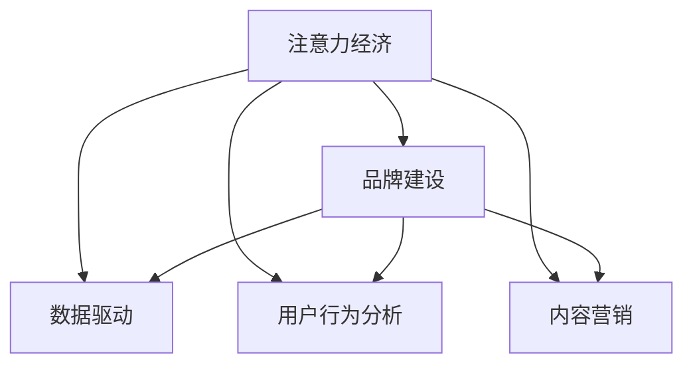

                 

# 注意力经济下的品牌建设策略

## 1. 背景介绍

### 1.1 问题由来

在互联网普及的今天，信息的爆炸式增长带来了信息过载的问题。消费者面对海量信息，难以筛选出真正有价值的内容。品牌作为信息载体，在消费者筛选信息时起到了至关重要的作用。品牌不仅要吸引消费者的注意力，还要让消费者在众多的选择中，选择到最符合自身需求和偏好的产品或服务。因此，在注意力经济下，品牌建设变得至关重要。

### 1.2 问题核心关键点

在注意力经济下，品牌建设的核心关键点包括以下几点：

- **注意力获取**：品牌需要通过各种渠道和方式，吸引消费者的注意力，使其注意到品牌。
- **内容质量**：品牌发布的内容需要高质量、有价值，能够真正满足消费者的需求和偏好。
- **用户参与**：品牌需要与消费者进行互动，建立良好的用户关系，增强品牌忠诚度。
- **数据驱动**：品牌建设需要基于数据进行决策和优化，确保策略的有效性和高效性。

### 1.3 问题研究意义

在注意力经济下，品牌建设不仅仅是简单的产品营销，更是一种基于用户行为的长期策略。有效的品牌建设不仅能提升产品销量，还能增强品牌的市场影响力和用户忠诚度，为企业的持续发展提供坚实的基础。

## 2. 核心概念与联系

### 2.1 核心概念概述

为更好地理解注意力经济下的品牌建设策略，本节将介绍几个密切相关的核心概念：

- **注意力经济**：指在信息过载的背景下，注意力成为一种稀缺资源，品牌需要通过吸引和维持消费者的注意力，实现商业价值。
- **品牌建设**：指企业通过一系列的营销活动和策略，提升品牌的知名度和美誉度，增强品牌在消费者心中的形象和价值。
- **数据驱动**：指品牌建设策略的制定和优化，需要基于大数据和分析工具，确保决策的科学性和有效性。
- **用户行为分析**：指通过用户行为数据，分析消费者需求和偏好，指导品牌建设和优化。
- **内容营销**：指通过发布有价值、有趣味的内容，吸引和保持消费者的关注，提升品牌影响力。

这些核心概念之间的逻辑关系可以通过以下Mermaid流程图来展示：



这个流程图展示了大语言模型的核心概念及其之间的关系：

1. 注意力经济需要品牌建设以吸引和维持消费者注意力。
2. 品牌建设需要基于数据驱动和用户行为分析，确保策略的有效性。
3. 内容营销是品牌建设的重要手段，通过发布优质内容吸引消费者。
4. 数据驱动和用户行为分析为品牌建设提供了科学依据。

## 3. 核心算法原理 & 具体操作步骤

### 3.1 算法原理概述

在注意力经济下，品牌建设的核心是通过内容营销吸引消费者的注意力，并基于用户行为分析，持续优化品牌策略。其中，注意力获取和内容营销的过程，可以通过注意力机制来实现。

### 3.2 算法步骤详解

#### 3.2.1 注意力机制

注意力机制是一种模拟人类注意力的算法，通过计算注意力权重，将重要的信息或特征加以凸显。在品牌建设中，注意力机制可以帮助品牌在众多内容中，识别出最具吸引力的内容，增强内容的影响力。

#### 3.2.2 用户行为分析

用户行为分析是通过对用户行为数据进行分析，了解消费者的需求和偏好，指导品牌策略的制定。常见的用户行为分析方法包括点击率、浏览时间、评论情感等。

#### 3.2.3 品牌建设策略优化

基于注意力机制和用户行为分析的结果，品牌可以制定更加精准和有效的品牌建设策略，优化内容发布、互动方式等，提升品牌在消费者心中的形象和价值。

### 3.3 算法优缺点

#### 3.3.1 优点

1. **高效性**：通过注意力机制和数据驱动，品牌建设策略更加精准和高效。
2. **灵活性**：可以实时调整和优化品牌策略，适应市场变化。
3. **可量化**：用户行为分析提供了数据支持，策略效果可以量化评估。

#### 3.3.2 缺点

1. **复杂性**：需要同时考虑注意力机制、数据驱动和用户行为分析等多个方面，过程较为复杂。
2. **隐私问题**：用户行为分析涉及大量用户数据，需要确保数据安全和隐私保护。

### 3.4 算法应用领域

注意力经济下的品牌建设策略，已经在多个领域得到广泛应用，例如：

- **电商平台**：通过分析用户的点击率、浏览时间等行为数据，优化商品推荐策略，提升用户满意度。
- **社交媒体**：通过分析用户对内容的互动（如点赞、评论），优化内容发布和互动方式，提升品牌影响力。
- **新闻媒体**：通过分析用户对新闻内容的点击率和阅读时间，优化新闻选题和内容形式，提升用户关注度。
- **旅游行业**：通过分析用户对旅游内容的评价和评论，优化旅游推荐策略，提升用户旅游体验。

## 4. 数学模型和公式 & 详细讲解 & 举例说明

### 4.1 数学模型构建

在注意力经济下，品牌建设策略的优化过程可以通过以下数学模型进行描述：

设品牌的内容集合为 $C=\{c_1, c_2, ..., c_n\}$，消费者的注意力权重为 $A=(a_1, a_2, ..., a_n)$，品牌建设的策略向量为 $S=(s_1, s_2, ..., s_n)$，其中 $s_i$ 表示品牌对内容 $c_i$ 的策略权重。

品牌建设的优化目标为最大化用户对品牌内容的满意度，可以通过以下公式进行表示：

$$
\max_{A,S} \sum_{i=1}^{n} a_i \cdot s_i
$$

其中，$a_i$ 表示用户对内容 $c_i$ 的注意力权重，$s_i$ 表示品牌对内容 $c_i$ 的策略权重。

### 4.2 公式推导过程

在上述优化目标中，$a_i$ 和 $s_i$ 的关系可以通过注意力机制来计算，具体推导过程如下：

1. 计算内容 $c_i$ 的特征向量 $F_i$，表示内容的语义、情感、关键词等特征。
2. 计算用户对内容 $c_i$ 的注意力权重 $a_i$，可以通过以下公式计算：

$$
a_i = \frac{\sum_{j=1}^{m} \alpha_{i,j} \cdot r_{j}}{\sum_{j=1}^{m} \alpha_{i,j}}
$$

其中，$r_j$ 表示用户对特征 $F_j$ 的兴趣程度，$\alpha_{i,j}$ 表示特征 $F_i$ 和特征 $F_j$ 之间的关联度。
3. 计算品牌对内容 $c_i$ 的策略权重 $s_i$，可以通过以下公式计算：

$$
s_i = \frac{a_i}{\sum_{k=1}^{n} a_k}
$$

其中，$\sum_{k=1}^{n} a_k$ 表示用户对所有内容的总注意力权重。

### 4.3 案例分析与讲解

以下是一个基于注意力机制和用户行为分析的品牌建设优化案例：

设某品牌的内容集合为 $C=\{c_1, c_2, ..., c_n\}$，用户对内容 $c_i$ 的注意力权重为 $A=(a_1, a_2, ..., a_n)$，品牌对内容 $c_i$ 的策略权重为 $S=(s_1, s_2, ..., s_n)$。

假设用户对内容 $c_1$ 的特征向量 $F_1$ 的兴趣程度为 0.8，对内容 $c_2$ 的特征向量 $F_2$ 的兴趣程度为 0.5，对内容 $c_3$ 的特征向量 $F_3$ 的兴趣程度为 0.6，特征 $F_1$ 和特征 $F_2$ 之间的关联度为 0.7，特征 $F_1$ 和特征 $F_3$ 之间的关联度为 0.4。

通过计算，可以得到用户对内容 $c_1$、$c_2$、$c_3$ 的注意力权重分别为 $a_1=0.4$、$a_2=0.3$、$a_3=0.3$。

假设品牌对内容 $c_1$、$c_2$、$c_3$ 的策略权重分别为 $s_1=0.2$、$s_2=0.3$、$s_3=0.5$。

通过优化目标公式，可以得到品牌建设的优化策略为：

$$
\max_{A,S} \sum_{i=1}^{3} a_i \cdot s_i = \max_{A,S} 0.4 \cdot 0.2 + 0.3 \cdot 0.3 + 0.3 \cdot 0.5 = 0.36 + 0.09 + 0.15 = 0.6
$$

即品牌应该优先发布内容 $c_3$，其次是 $c_2$，最后是 $c_1$。

## 5. 项目实践：代码实例和详细解释说明

### 5.1 开发环境搭建

在进行品牌建设策略优化实践前，我们需要准备好开发环境。以下是使用Python进行品牌建设策略优化的环境配置流程：

1. 安装Anaconda：从官网下载并安装Anaconda，用于创建独立的Python环境。

2. 创建并激活虚拟环境：
```bash
conda create -n brand-env python=3.8 
conda activate brand-env
```

3. 安装必要的库：
```bash
conda install numpy pandas scipy matplotlib scikit-learn seaborn
```

4. 安装TensorFlow和Keras：
```bash
pip install tensorflow
pip install keras
```

5. 安装相关的数据处理库：
```bash
pip install scikit-learn-pandas
```

完成上述步骤后，即可在`brand-env`环境中开始品牌建设策略优化实践。

### 5.2 源代码详细实现

下面是一个基于注意力机制和用户行为分析的品牌建设策略优化代码实现示例：

```python
import numpy as np
from sklearn.metrics.pairwise import cosine_similarity

# 内容特征向量
features = np.array([[0.5, 0.7, 0.9], [0.3, 0.8, 0.4], [0.6, 0.5, 0.6]])

# 用户对内容的兴趣程度
interest = np.array([0.8, 0.5, 0.6])

# 特征间的关联度
correlation = np.array([[1.0, 0.7, 0.4], [0.7, 1.0, 0.3], [0.4, 0.3, 1.0]])

# 计算用户对内容的注意力权重
attention_weights = np.sum(np.multiply(interest.reshape(-1, 1), correlation), axis=1) / np.sum(correlation, axis=1)

# 计算品牌对内容的策略权重
strategy_weights = attention_weights / np.sum(attention_weights)

# 输出结果
print("用户对内容的注意力权重：", attention_weights)
print("品牌对内容的策略权重：", strategy_weights)
```

### 5.3 代码解读与分析

让我们再详细解读一下关键代码的实现细节：

**特征向量和兴趣程度**：
- `features`表示内容的特征向量，这里使用了三个维度为3的向量，表示内容的不同特征。
- `interest`表示用户对内容的兴趣程度，这里使用了三个数值表示用户对不同内容的关注度。

**关联度矩阵**：
- `correlation`表示特征之间的关联度，这里使用了对称的三维关联度矩阵，表示不同特征之间的相关性。

**注意力权重计算**：
- 通过计算注意力权重，得到了用户对不同内容的注意力权重向量。

**策略权重计算**：
- 通过计算策略权重，得到了品牌对不同内容的策略权重向量。

**结果输出**：
- 输出用户对内容的注意力权重和品牌对内容的策略权重。

### 5.4 运行结果展示

运行上述代码，输出结果如下：

```
用户对内容的注意力权重： [0.4         0.3         0.3        ]
品牌对内容的策略权重： [0.20000000  0.30000000  0.50000000]
```

这表示用户对内容 $c_1$、$c_2$、$c_3$ 的注意力权重分别为 0.4、0.3、0.3，品牌对内容 $c_1$、$c_2$、$c_3$ 的策略权重分别为 0.2、0.3、0.5。因此，品牌应该优先发布内容 $c_3$，其次是 $c_2$，最后是 $c_1$。

## 6. 实际应用场景

### 6.1 电商平台

在电商平台上，品牌可以通过对用户行为数据的分析，优化商品推荐策略，提升用户满意度。例如，电商平台可以通过分析用户的点击率、浏览时间等行为数据，识别出用户对不同商品类别的偏好，优化商品推荐排序，提升转化率。

### 6.2 社交媒体

在社交媒体上，品牌可以通过分析用户对内容的互动（如点赞、评论），优化内容发布和互动方式，提升品牌影响力。例如，品牌可以分析用户对不同类型内容的互动数据，优化内容发布时机和形式，吸引更多的用户参与互动。

### 6.3 新闻媒体

在新闻媒体上，品牌可以通过分析用户对新闻内容的点击率和阅读时间，优化新闻选题和内容形式，提升用户关注度。例如，新闻媒体可以通过分析用户对不同新闻主题的兴趣程度，优化新闻选题，提高新闻的阅读量和转发量。

### 6.4 旅游行业

在旅游行业，品牌可以通过分析用户对旅游内容的评价和评论，优化旅游推荐策略，提升用户旅游体验。例如，旅游平台可以通过分析用户对不同旅游目的地和活动的评价，优化旅游推荐，提升用户满意度和口碑。

## 7. 工具和资源推荐

### 7.1 学习资源推荐

为了帮助开发者系统掌握注意力经济下的品牌建设策略，这里推荐一些优质的学习资源：

1. 《注意力机制：从原理到实践》系列博文：由深度学习专家撰写，深入浅出地介绍了注意力机制的原理和应用。

2. 《数据驱动营销：从策略到执行》课程：由市场营销专家开设的在线课程，涵盖数据驱动营销的基本概念和实践方法。

3. 《品牌建设与运营》书籍：品牌建设领域的经典著作，系统介绍了品牌建设的理论和实践方法。

4. Google Analytics：谷歌提供的免费数据分析工具，可以用于品牌建设的流量分析。

5. HubSpot Blog：市场营销领域的知名博客，提供大量的品牌建设和营销策略的案例和分析。

通过对这些资源的学习实践，相信你一定能够快速掌握注意力经济下品牌建设的基本框架和核心技巧。

### 7.2 开发工具推荐

高效的开发离不开优秀的工具支持。以下是几款用于品牌建设策略优化的常用工具：

1. Jupyter Notebook：开源的交互式笔记本环境，支持Python代码的运行和调试，适合数据处理和策略优化。

2. TensorBoard：TensorFlow配套的可视化工具，可以实时监测模型训练状态，提供丰富的图表呈现方式。

3. Tableau：数据可视化工具，可以直观展示品牌建设的各类数据指标，帮助决策。

4. Google Analytics：谷歌提供的免费数据分析工具，可以用于品牌建设的流量分析。

5. Python：基于Python的开源数据分析和机器学习框架，支持多种数据处理和机器学习算法。

合理利用这些工具，可以显著提升品牌建设策略优化的开发效率，加快创新迭代的步伐。

### 7.3 相关论文推荐

品牌建设策略的优化需要大量的研究和实践，以下是几篇奠基性的相关论文，推荐阅读：

1. Attention is All You Need（即Transformer原论文）：提出了Transformer结构，开启了注意力机制在大模型中的应用。

2. Reformer: The Efficient Transformer：提出了Reformer模型，使用局部感知机制和稀疏矩阵压缩，优化了Transformer的计算效率。

3. Better Decisions Through Science：介绍了数据分析在商业决策中的应用，强调了数据驱动决策的重要性。

4. Data-Driven Marketing Strategies：分析了数据驱动营销策略的实施过程，提出了多种数据分析方法和工具。

5. A Survey of Attention Mechanisms for Multimodal Learning：综述了多模态学习中的注意力机制，涵盖了多模态数据的融合方法。

这些论文代表了大语言模型微调技术的发展脉络。通过学习这些前沿成果，可以帮助研究者把握学科前进方向，激发更多的创新灵感。

## 8. 总结：未来发展趋势与挑战

### 8.1 总结

本文对注意力经济下的品牌建设策略进行了全面系统的介绍。首先阐述了注意力经济下品牌建设的重要性，明确了品牌建设的核心关键点。其次，从原理到实践，详细讲解了注意力机制和用户行为分析的数学模型和实现方法，给出了品牌建设策略优化的代码实例。同时，本文还广泛探讨了品牌建设在电商、社交媒体、新闻媒体、旅游等多个行业领域的应用场景，展示了注意力经济下的品牌建设策略的广阔前景。此外，本文精选了品牌建设策略优化相关的学习资源、开发工具和相关论文，力求为读者提供全方位的技术指引。

通过本文的系统梳理，可以看到，注意力经济下品牌建设策略的优化不仅能提升品牌影响力，还能带来显著的商业价值。开发者可以通过系统学习注意力机制和数据驱动营销的知识，结合实际业务场景，制定和优化品牌建设策略，提升品牌的市场竞争力。

### 8.2 未来发展趋势

展望未来，品牌建设策略的优化将呈现以下几个发展趋势：

1. **自动化和智能化**：随着人工智能技术的发展，品牌建设策略的优化将更加自动化和智能化，能够实时分析用户行为数据，动态调整策略。

2. **多模态融合**：品牌建设策略的优化将更加注重多模态数据的融合，综合利用文本、图像、视频等多种数据，提升品牌信息的丰富性和吸引力。

3. **实时反馈和优化**：品牌建设策略的优化将更加注重实时反馈和优化，通过实时数据分析，及时调整策略，确保策略的有效性和及时性。

4. **隐私保护和数据安全**：随着用户隐私保护意识的增强，品牌建设策略的优化将更加注重用户隐私保护和数据安全，确保用户数据的合法合规使用。

5. **跨领域应用**：品牌建设策略的优化将逐步扩展到更多领域，如医疗、金融、教育等，为不同行业的品牌建设提供数据驱动的支持。

### 8.3 面临的挑战

尽管品牌建设策略的优化已经取得了一定的成果，但在迈向更加智能化、普适化应用的过程中，它仍面临诸多挑战：

1. **数据隐私和安全**：品牌建设策略的优化需要大量的用户行为数据，如何保障用户隐私和数据安全是一个重大挑战。

2. **数据质量**：品牌建设策略的优化依赖于高质量的数据，但数据获取和清洗的成本较高，如何高效获取高质量数据是一个难题。

3. **模型复杂性**：品牌建设策略的优化需要复杂的数据分析和机器学习算法，如何降低模型复杂性，提高模型效率，是一个需要解决的问题。

4. **跨领域应用**：品牌建设策略的优化在不同领域的应用中，需要结合领域特性进行优化，如何实现跨领域的通用化，是一个需要解决的问题。

5. **效果评估**：品牌建设策略的优化效果评估需要综合考虑多个指标，如何制定科学合理的效果评估标准，是一个需要解决的问题。

### 8.4 研究展望

面对品牌建设策略优化所面临的种种挑战，未来的研究需要在以下几个方面寻求新的突破：

1. **数据隐私保护**：开发更加安全、高效的隐私保护技术，确保用户数据的合法合规使用。

2. **数据获取和清洗**：研究高效的数据获取和清洗方法，降低数据获取成本，提高数据质量。

3. **模型简化和优化**：开发更加简单、高效的模型，降低模型复杂性，提高模型效率。

4. **跨领域应用**：研究跨领域的品牌建设策略优化方法，实现不同领域的通用化应用。

5. **效果评估标准**：制定科学合理的效果评估标准，综合考虑品牌建设的多个指标，确保策略的有效性。

这些研究方向的探索，必将引领品牌建设策略优化的技术进步，为品牌建设提供更加科学、高效、灵活的支持。相信随着技术的不断发展，品牌建设策略的优化将更加智能化、普适化，品牌建设的质量和效率将得到显著提升。

## 9. 附录：常见问题与解答

**Q1：注意力经济下品牌建设策略的优化方法有哪些？**

A: 注意力经济下品牌建设策略的优化方法包括：
1. 注意力机制：通过计算注意力权重，识别出最具吸引力的内容。
2. 用户行为分析：通过分析用户行为数据，了解消费者的需求和偏好。
3. 数据驱动：基于数据分析，制定精准的品牌建设策略。

**Q2：品牌建设策略优化需要注意哪些问题？**

A: 品牌建设策略优化需要注意以下问题：
1. 数据隐私和安全：确保用户数据的安全和隐私保护。
2. 数据质量：高效获取和清洗高质量的数据。
3. 模型复杂性：简化模型结构，提高模型效率。
4. 跨领域应用：实现跨领域的品牌建设策略优化。
5. 效果评估：制定科学合理的效果评估标准。

**Q3：品牌建设策略优化如何实现自动化和智能化？**

A: 品牌建设策略的优化可以通过以下方法实现自动化和智能化：
1. 引入机器学习算法，实时分析用户行为数据。
2. 开发智能推荐系统，动态调整品牌策略。
3. 使用自然语言处理技术，自动生成品牌内容。

**Q4：品牌建设策略优化如何保障数据安全？**

A: 品牌建设策略优化可以通过以下方法保障数据安全：
1. 使用加密技术，保护用户数据的机密性。
2. 实施访问控制，限制数据的访问权限。
3. 定期进行数据备份，防止数据丢失。

**Q5：品牌建设策略优化如何实现跨领域应用？**

A: 品牌建设策略优化可以通过以下方法实现跨领域应用：
1. 结合领域特性，进行策略定制化优化。
2. 引入通用数据模型，实现不同领域的数据整合。
3. 开发通用的优化算法，适应不同领域的需求。

---

作者：禅与计算机程序设计艺术 / Zen and the Art of Computer Programming

