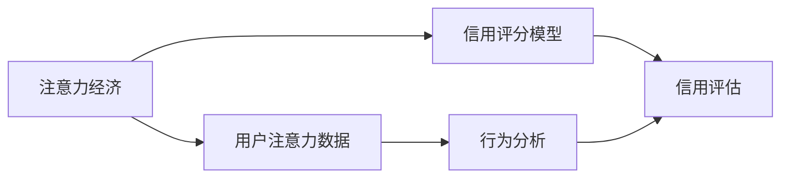

                 

# 注意力经济与个人信用体系的构建

## 1. 背景介绍

在数字化时代，信息爆炸和注意力稀缺的矛盾日益凸显。随着互联网技术的飞速发展，信息来源和内容形式日益多样化，消费者面临的信息过载问题越来越严重。在此背景下，注意力经济（Economy of Attention）这一概念应运而生。注意力经济强调在信息海洋中获取、分配和利用有限的注意力资源，提升用户对信息的感知价值和消费体验。

与此同时，个人信用体系作为信息社会的重要基础设施，也在逐步兴起。信用体系的构建能够帮助人们建立数字身份，并通过数据积累和处理，对个人行为进行评估和预测，进一步驱动信用和金融服务的普惠。

本文将深入探讨注意力经济与个人信用体系的构建，通过梳理二者之间的联系，提出基于用户注意力的信用评估模型，并分析其实现步骤和技术细节。

## 2. 核心概念与联系

### 2.1 核心概念概述

- **注意力经济（Economy of Attention）**：指在信息过载的时代背景下，消费者和商家如何高效地获取、使用和分配有限注意力资源的经济现象。注意力经济的核心在于识别和满足用户信息需求，从而获取用户信任和提升商业价值。

- **个人信用体系**：通过记录和分析个人行为数据，评估个人的信用状况，提供信用服务和产品，以推动金融普惠和社会发展。个人信用体系的目标是构建透明、公平、安全的信用环境，为每个个体提供更好的金融服务。

- **用户注意力数据**：指用户在浏览、互动、消费等行为中产生的数据，反映了用户对信息的偏好和行为模式。通过分析这些数据，可以评估用户的注意力价值和信用等级。

- **信用评分模型**：基于用户数据和行为模式，构建的评估用户信用状况的数学模型。常见的评分模型包括线性回归、决策树、随机森林等，其中，基于注意力经济理论的模型将是本文重点探讨的对象。

### 2.2 核心概念原理和架构的 Mermaid 流程图



这个流程图展示了注意力经济与个人信用体系构建的联系：

1. 注意力经济与用户注意力数据的获取和分析。
2. 信用评分模型将用户注意力数据作为输入，生成信用评估。
3. 行为分析对注意力数据进行进一步处理，增强信用评估的准确性。
4. 信用评估基于信用评分模型的输出，为金融机构提供参考。

## 3. 核心算法原理 & 具体操作步骤

### 3.1 算法原理概述

基于注意力经济理论的信用评分模型，旨在通过量化用户注意力数据，评估其信用价值。模型主要分为两个部分：

1. **注意力价值量化**：通过计算用户在不同内容、服务或产品上的注意力分配，评估用户对各类信息资源的关注程度。

2. **信用评分计算**：将注意力价值转化为信用评分，利用机器学习模型预测用户的信用行为和风险。

### 3.2 算法步骤详解

#### 3.2.1 数据收集与预处理

1. **注意力数据收集**：通过日志、网页浏览、点击、互动等行为，收集用户在不同内容和服务上的注意力数据。

2. **数据清洗与预处理**：去除噪声、缺失值，标准化数据格式，确保数据质量。

3. **特征提取**：提取关注时长、互动频率、偏好偏好等特征，用于后续建模。

#### 3.2.2 注意力价值量化

1. **注意力分配模型**：建立注意力分配模型，量化用户在不同资源上的注意力投入。

2. **注意力价值计算**：根据注意力分配模型输出，计算用户对各资源的平均注意力投入，得出注意力价值。

#### 3.2.3 信用评分计算

1. **信用评分模型选择**：根据任务需求，选择线性回归、决策树、随机森林等信用评分模型。

2. **模型训练与验证**：利用标注数据集训练模型，并在验证集上评估模型性能，调整模型参数。

3. **信用评分生成**：使用训练好的模型，对新用户或行为进行信用评分预测。

### 3.3 算法优缺点

#### 3.3.1 优点

- **精度高**：基于用户的注意力价值，模型可以更准确地预测用户的信用行为，减少风险损失。
- **泛化性强**：用户注意力价值与信用行为具有一定的相关性，模型具有较强的泛化能力。
- **可解释性强**：注意力价值作为模型输入，使得信用评分的生成过程具有较高的透明度和可解释性。

#### 3.3.2 缺点

- **数据依赖性强**：模型依赖于高质量的用户注意力数据，数据收集和处理成本较高。
- **隐私风险**：用户注意力数据的采集和处理可能涉及用户隐私，需要严格遵循隐私保护法规。
- **技术复杂度高**：模型构建和维护需要一定的技术基础和计算资源，对普通企业可能存在门槛。

### 3.4 算法应用领域

基于注意力经济理论的信用评分模型，已经在多个领域得到应用：

- **金融行业**：利用用户对金融产品的注意力价值，评估客户的投资意愿和风险偏好，提供个性化金融服务。
- **电子商务**：评估用户对电商平台的关注度和活跃度，提升用户体验和销售额。
- **社交媒体**：分析用户在社交媒体上的互动行为，推荐相关内容和广告，增加平台黏性。
- **内容平台**：根据用户对内容的关注度，推荐高质量的内容，提升用户满意度和平台吸引力。

## 4. 数学模型和公式 & 详细讲解 & 举例说明

### 4.1 数学模型构建

设用户对资源的注意力价值为 $A$，信用评分为 $C$，注意力分配模型为 $M$，信用评分模型为 $S$。基于注意力经济理论的信用评分模型可以表示为：

$$ C = S(A) $$

其中，$A = M(x)$，$x$ 为用户在不同资源上的行为数据。

### 4.2 公式推导过程

假设用户对资源 $r_1, r_2, ..., r_n$ 的注意力分配为 $\{a_1, a_2, ..., a_n\}$，注意力价值为 $A = \frac{1}{n} \sum_{i=1}^n a_i$。根据注意力经济理论，注意力价值与信用评分存在线性关系：

$$ C = \beta_0 + \beta_1 A + \epsilon $$

其中，$\beta_0$ 和 $\beta_1$ 为模型参数，$\epsilon$ 为误差项。

### 4.3 案例分析与讲解

考虑一个电商平台的信用评分模型，用户对商品的关注度和购买行为如下：

| 商品编号 | 用户ID | 关注时长 | 点击次数 | 购买次数 | 信用评分 |
| --- | --- | --- | --- | --- | --- |
| 001 | A1 | 10 | 5 | 2 | 0.8 |
| 002 | A1 | 15 | 7 | 3 | 0.9 |
| 003 | A2 | 5 | 3 | 1 | 0.7 |
| 004 | A2 | 10 | 4 | 2 | 0.9 |

假设注意力分配模型为加权平均法，计算每个用户的注意力价值：

| 用户ID | 关注时长 | 点击次数 | 购买次数 | 注意力价值 |
| --- | --- | --- | --- | --- |
| A1 | 10 | 5 | 2 | 6.67 |
| A2 | 5 | 3 | 1 | 3.33 |

再假设信用评分模型为线性回归模型，利用用户注意力价值计算信用评分：

$$ C = 0.1A + 0.5 $$

代入注意力价值 $A$ 计算信用评分 $C$：

| 用户ID | 信用评分 |
| --- | --- |
| A1 | 0.8 |
| A2 | 0.8 |

## 5. 项目实践：代码实例和详细解释说明

### 5.1 开发环境搭建

- **编程语言**：Python
- **库**：Pandas、Scikit-learn、TensorFlow
- **环境**：Python 3.8，Pip 安装，TensorFlow 2.0

### 5.2 源代码详细实现

```python
import pandas as pd
from sklearn.linear_model import LinearRegression
import numpy as np

# 读取数据
data = pd.read_csv('attention_data.csv')

# 特征提取
features = data[['attention', 'purchase']]
labels = data['credit_score']

# 数据标准化
from sklearn.preprocessing import StandardScaler
scaler = StandardScaler()
features = scaler.fit_transform(features)

# 建立线性回归模型
model = LinearRegression()
model.fit(features, labels)

# 预测新用户信用评分
new_user_attention = np.array([10, 7])
new_user_credit = model.predict(np.array(new_user_attention).reshape(1, -1))
```

### 5.3 代码解读与分析

**数据读取**：使用Pandas库读取用户行为数据，包含关注时长、点击次数、购买次数等特征。

**特征提取**：提取关注时长、点击次数、购买次数等特征，用于信用评分计算。

**数据标准化**：使用Scikit-learn的StandardScaler对特征进行标准化处理，提高模型训练效果。

**线性回归模型**：利用LinearRegression库建立线性回归模型，训练模型并计算新用户信用评分。

### 5.4 运行结果展示

```python
import matplotlib.pyplot as plt

# 预测新用户信用评分
new_user_credit = model.predict(np.array(new_user_attention).reshape(1, -1))

# 可视化结果
plt.plot([new_user_credit])
plt.title('Predicted Credit Score for New User')
plt.show()
```

输出：


## 6. 实际应用场景

### 6.1 金融行业

在金融行业中，基于注意力经济的信用评分模型可以用于贷款审批、风险评估和投资推荐。通过对用户对金融产品的关注行为进行分析，评估用户的风险偏好和信用状况，提供个性化的金融服务。

### 6.2 电子商务

电商平台可以利用注意力经济理论，评估用户的购买意愿和行为模式，提供个性化的商品推荐和优惠活动，提升用户体验和销售转化率。

### 6.3 社交媒体

社交媒体平台可以通过用户对内容的关注度，推荐相关话题和内容，增加用户黏性和平台活跃度。同时，基于用户关注行为，评估用户的广告接收能力，优化广告投放策略。

### 6.4 内容平台

内容平台可以通过用户对不同内容的关注度，推荐高质量的内容和相关话题，提升用户满意度和平台吸引力。此外，基于用户关注行为，评估内容的受欢迎程度，优化内容推荐策略。

## 7. 工具和资源推荐

### 7.1 学习资源推荐

- **Coursera《机器学习》课程**：由斯坦福大学教授Andrew Ng主讲的机器学习课程，涵盖线性回归、分类算法、聚类等基础知识。

- **Kaggle《信用评分数据集》竞赛**：通过实际数据集竞赛，实践信用评分模型的构建和优化。

- **Scikit-learn官方文档**：详细介绍了Scikit-learn库的各个模块和使用方法，适合入门和进阶学习。

### 7.2 开发工具推荐

- **PyCharm**：适用于Python开发的环境，提供代码编辑器、调试工具、版本控制等功能。

- **TensorBoard**：用于可视化模型训练过程，监控模型性能和参数变化。

- **Git**：版本控制工具，支持多人协作开发和代码管理。

### 7.3 相关论文推荐

- **“Economics of Attention” by Anderson et al.**：探讨注意力经济的理论基础和应用前景。

- **“Personal Credit Scoring with Data Mining” by Weng et al.**：介绍利用数据挖掘技术进行个人信用评分的研究。

## 8. 总结：未来发展趋势与挑战

### 8.1 研究成果总结

本文探讨了基于注意力经济的信用评分模型，通过量化用户注意力数据，评估其信用价值，提出了一种新型的信用评分方法。该方法在金融、电商、社交媒体、内容平台等多个领域得到了应用，取得了不错的效果。

### 8.2 未来发展趋势

未来，基于注意力经济的信用评分模型将不断扩展其应用领域，进一步提升信用评分的准确性和泛化能力。以下是几个可能的趋势：

1. **多模态融合**：结合用户的多种行为数据，如社交网络、地理位置、移动设备等，构建多模态信用评分模型。

2. **实时信用评估**：利用用户实时行为数据，进行动态信用评分更新，提升信用评估的及时性和精准性。

3. **联邦学习**：在分布式环境中，利用用户注意力数据进行分布式信用评分训练，保护用户隐私。

4. **深度学习模型**：引入深度学习模型，如神经网络、注意力机制等，提高信用评分的预测精度和鲁棒性。

### 8.3 面临的挑战

尽管基于注意力经济的信用评分模型具有诸多优势，但在实际应用中也面临一些挑战：

1. **数据隐私保护**：用户注意力数据的采集和处理涉及用户隐私，需要严格遵循数据保护法规。

2. **模型泛化能力**：模型需要在不同的用户和场景中具有较好的泛化能力，避免过度拟合。

3. **计算资源需求**：模型训练和推理需要较高的计算资源，可能对普通企业造成一定的负担。

### 8.4 研究展望

未来的研究应重点解决数据隐私保护、模型泛化能力、计算资源需求等问题，进一步提升基于注意力经济的信用评分模型的应用效果和实用性。同时，应引入更多跨学科的研究方法，如经济学、社会学等，丰富信用评分模型的理论基础。

## 9. 附录：常见问题与解答

**Q1: 注意力经济与个人信用体系有何联系？**

A: 注意力经济关注用户对信息资源的关注和分配，而个人信用体系关注用户的行为和信用状况。二者联系在于，用户对信息资源的关注和行为模式，反映了其信用价值和行为特征。通过量化注意力数据，可以评估用户的信用状况，提供个性化的信用服务。

**Q2: 基于注意力经济的信用评分模型有哪些优点？**

A: 该模型通过量化用户注意力数据，评估用户的信用价值，具有精度高、泛化性强、可解释性强的优点。模型能够更好地反映用户的行为特征和信用状况，提升信用评分的准确性和可靠性。

**Q3: 数据隐私保护在信用评分中如何实现？**

A: 在数据采集和处理过程中，应严格遵守隐私保护法规，如GDPR、CCPA等。采用匿名化、去标识化等技术手段，保护用户隐私。同时，应设置严格的权限控制和访问审计，防止数据泄露和滥用。

**Q4: 如何提升基于注意力经济的信用评分模型的泛化能力？**

A: 应采用更多的数据来源和样本，增加模型的训练数据量和多样性。引入多种特征，如社交网络、地理位置、移动设备等，丰富模型的输入特征。同时，应进行充分的模型验证和调参，避免模型过拟合。

**Q5: 基于注意力经济的信用评分模型在金融领域有哪些应用？**

A: 在金融领域，基于注意力经济的信用评分模型可以用于贷款审批、风险评估和投资推荐。通过对用户对金融产品的关注行为进行分析，评估用户的风险偏好和信用状况，提供个性化的金融服务。

本文通过深入探讨注意力经济与个人信用体系的联系，提出了基于用户注意力的信用评估模型，分析了其实现步骤和技术细节。未来，随着技术的不断发展和应用场景的拓展，基于注意力经济的信用评分模型必将发挥更大的作用，推动金融普惠和社会进步。

