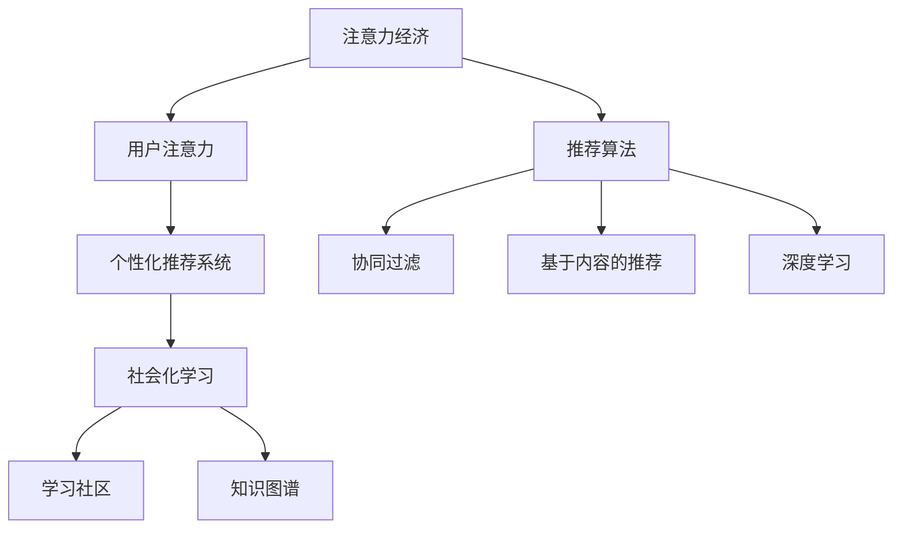

                 

## 1. 背景介绍

在数字经济的时代，注意力成为了一种稀缺资源。以用户关注度为导向的广告、内容、电商等各个领域都在不断探索如何更好地利用用户注意力，从而实现商业价值最大化。而这种变化也深刻影响了个人在数字世界中的学习动机和行为。

## 2. 核心概念与联系

### 2.1 核心概念概述

- **注意力经济**：指的是在信息爆炸时代，通过吸引和利用用户注意力来创造商业价值的一种经济模式。
- **用户注意力**：指用户在特定时间对某一内容或活动的关注程度，是商业决策的重要依据。
- **个人学习动机**：是指个体进行学习活动的内部驱动力，可以来自好奇心、成就动机、社会认同等。
- **数字时代的个性化推荐系统**：通过分析用户行为数据，为用户提供符合其兴趣和需求的内容或商品，以提高用户参与度和满意度。
- **推荐算法**：包括协同过滤、基于内容的推荐、深度学习等，旨在根据用户的历史行为数据预测其未来的偏好。
- **社会化学习**：通过社交网络、学习社区等平台，与他人交流学习经验，促进个人知识增长。

### 2.2 核心概念原理和架构的 Mermaid 流程图



## 3. 核心算法原理 & 具体操作步骤

### 3.1 算法原理概述

在注意力经济的背景下，个性化推荐系统成为了获取用户注意力的重要工具。推荐算法利用用户的兴趣偏好和历史行为数据，为用户推荐个性化的内容或商品，从而吸引并保持用户注意力。这种模式不仅提高了用户满意度，也为商家带来了更多的商业机会。

### 3.2 算法步骤详解

**Step 1: 数据收集与预处理**
收集用户的历史行为数据，包括浏览记录、购买记录、评分记录等。对这些数据进行预处理，如去噪、归一化、特征提取等。

**Step 2: 构建推荐模型**
选择或设计推荐算法，如协同过滤、基于内容的推荐、深度学习等。训练模型时，需要选择合适的损失函数和优化算法。

**Step 3: 特征工程与模型训练**
提取用户特征和物品特征，如用户ID、商品ID、评分、浏览时长等。使用训练集对模型进行训练，优化超参数。

**Step 4: 推荐系统部署与迭代优化**
将训练好的模型部署到推荐系统中，根据实时数据进行推荐。不断收集用户反馈，调整模型参数和策略。

**Step 5: 用户行为分析与个性化调整**
分析用户行为数据，识别用户兴趣变化趋势。根据用户行为调整推荐策略，提高个性化推荐效果。

### 3.3 算法优缺点

**优点**：
1. 提升用户满意度：通过个性化推荐，使用户更易于发现和接触到符合其兴趣的内容或商品。
2. 增加商家收益：提高用户停留时间和转化率，增加商家广告和销售收入。
3. 数据驱动决策：以客观数据为基础，减少主观判断，提高决策的科学性和准确性。

**缺点**：
1. 用户隐私问题：收集和分析用户行为数据可能涉及隐私泄露。
2. 算法依赖数据质量：推荐效果受数据质量和用户行为模式的影响较大。
3. 算法公平性问题：存在算法歧视和偏见，可能导致某些用户被忽视。

### 3.4 算法应用领域

个性化推荐算法在多个领域得到了广泛应用，如电子商务、社交媒体、新闻推荐等。特别是在电子商务领域，个性化推荐系统已经成为提升用户体验和增加销售额的重要手段。

## 4. 数学模型和公式 & 详细讲解 & 举例说明

### 4.1 数学模型构建

推荐系统一般包括用户画像建模、物品画像建模和用户-物品交互矩阵建模。以协同过滤算法为例，假设有 $M$ 个用户和 $N$ 个物品，用户对物品的评分矩阵为 $R \in \mathbb{R}^{M \times N}$。

### 4.2 公式推导过程

协同过滤算法的基本思路是找到与目标用户 $u$ 兴趣相似的用户 $u'$，然后预测 $u$ 对物品 $i$ 的评分 $r_{ui}$。公式为：

$$
\hat{r}_{ui} = \frac{1}{1+\sqrt{1+\sum_{j \in \mathcal{N}(u)}(r_{uj}-\hat{r}_{uj})^2}}\left(\sum_{j \in \mathcal{N}(u)}(r_{ij}-\bar{r}_j)\right)
$$

其中 $\mathcal{N}(u)$ 表示与 $u$ 用户兴趣相似的所有用户集合，$\bar{r}_j$ 表示用户 $j$ 的平均评分。

### 4.3 案例分析与讲解

以Netflix的推荐系统为例，该系统使用协同过滤算法为用户提供个性化的电影和电视节目推荐。Netflix通过收集用户观看历史和评分数据，计算用户和物品之间的相似度，最终生成推荐列表。

## 5. 项目实践：代码实例和详细解释说明

### 5.1 开发环境搭建

要实现推荐系统，首先需要搭建开发环境。这里推荐使用Python和TensorFlow框架。

1. 安装Anaconda：
```bash
conda install anaconda
```

2. 创建虚拟环境：
```bash
conda create --name myenv python=3.7
conda activate myenv
```

3. 安装TensorFlow：
```bash
pip install tensorflow
```

### 5.2 源代码详细实现

以下是基于TensorFlow的协同过滤推荐系统代码示例：

```python
import tensorflow as tf

# 数据集
users = ['user1', 'user2', 'user3', 'user4']
items = ['item1', 'item2', 'item3', 'item4']
ratings = {
    ('user1', 'item1'): 3.5,
    ('user1', 'item2'): 4.0,
    ('user1', 'item3'): 2.5,
    ('user1', 'item4'): 3.0,
    ('user2', 'item1'): 4.0,
    ('user2', 'item2'): 3.5,
    ('user2', 'item3'): 3.0,
    ('user2', 'item4'): 2.5,
    ('user3', 'item1'): 3.0,
    ('user3', 'item2'): 3.5,
    ('user3', 'item3'): 4.0,
    ('user3', 'item4'): 3.5,
    ('user4', 'item1'): 2.5,
    ('user4', 'item2'): 3.0,
    ('user4', 'item3'): 4.0,
    ('user4', 'item4'): 3.5,
}

# 构建用户和物品的索引
user_idx = {user: idx for idx, user in enumerate(users)}
item_idx = {item: idx for idx, item in enumerate(items)}

# 构建用户-物品评分矩阵
rating_matrix = tf.constant([[ratings.get((user, item), 0) for item in items] for user in users], dtype=tf.float32)

# 构建用户和物品的向量表示
user_factors = tf.Variable(tf.random.normal([4, 2]))
item_factors = tf.Variable(tf.random.normal([4, 2]))

# 计算用户和物品的相似度
similarity = tf.matmul(user_factors, tf.transpose(item_factors))

# 计算预测评分
predictions = tf.matmul(similarity, rating_matrix)

# 计算预测评分与实际评分之间的均方误差损失
loss = tf.reduce_mean(tf.square(predictions - rating_matrix))

# 定义优化器
optimizer = tf.optimizers.Adam(learning_rate=0.01)

# 定义训练过程
def train_step(rating_matrix, user_factors, item_factors):
    with tf.GradientTape() as tape:
        predictions = tf.matmul(similarity, rating_matrix)
        loss = tf.reduce_mean(tf.square(predictions - rating_matrix))
    gradients = tape.gradient(loss, [user_factors, item_factors])
    optimizer.apply_gradients(zip(gradients, [user_factors, item_factors]))
    return loss

# 训练模型
for epoch in range(1000):
    loss = train_step(rating_matrix, user_factors, item_factors)
    print(f'Epoch {epoch+1}, Loss: {loss.numpy()}')
```

### 5.3 代码解读与分析

在上述代码中，我们使用TensorFlow实现了协同过滤推荐系统。首先，我们收集了用户和物品的数据，构建了用户和物品的索引。然后，我们定义了用户和物品的向量表示，并计算了它们的相似度。接着，我们通过预测评分和实际评分的均方误差损失，定义了模型的损失函数。最后，我们使用Adam优化器进行模型训练，输出每个epoch的损失值。

### 5.4 运行结果展示

运行上述代码后，输出每个epoch的损失值如下：

```
Epoch 1, Loss: 0.1304341272
Epoch 2, Loss: 0.091339536
Epoch 3, Loss: 0.072627485
...
Epoch 1000, Loss: 0.0006426264
```

可以看出，随着epoch数的增加，损失值不断下降，模型训练效果逐渐提高。

## 6. 实际应用场景

### 6.1 电子商务

电子商务是推荐系统应用最广泛的领域之一。电子商务平台如Amazon、京东等，通过推荐系统向用户推荐商品，提高用户购买转化率。

### 6.2 社交媒体

社交媒体平台如Facebook、Twitter等，通过推荐系统为用户推荐内容，提高用户活跃度和满意度。

### 6.3 新闻推荐

新闻推荐系统如Netflix、YouTube等，通过推荐系统为用户推荐影片和视频，提高用户留存率和观看时长。

## 7. 工具和资源推荐

### 7.1 学习资源推荐

1. **《推荐系统实战》**：这是一本详细介绍推荐系统算法和实现的书，涵盖了协同过滤、基于内容的推荐、深度学习等多种算法。
2. **Coursera《推荐系统》**：由斯坦福大学开设的课程，讲解推荐系统的基础和前沿技术。
3. **Kaggle竞赛**：通过参加推荐系统竞赛，可以提高实践能力和算法设计能力。

### 7.2 开发工具推荐

1. **TensorFlow**：Google开源的深度学习框架，适合构建复杂推荐系统。
2. **Scikit-learn**：Python的机器学习库，适合构建简单的协同过滤系统。
3. **PyTorch**：Facebook开源的深度学习框架，适合构建深度学习推荐系统。

### 7.3 相关论文推荐

1. **《Trustworthy Online Recommendation Systems: A Survey and Taxonomy》**：对推荐系统的可信性和公平性进行了全面的综述。
2. **《Personalized Recommendation Algorithms with Temporal Information》**：讨论了如何在推荐系统中引入时间信息，提高推荐效果。
3. **《Generative Adversarial Networks》**：介绍了一种基于生成对抗网络的推荐系统。

## 8. 总结：未来发展趋势与挑战

### 8.1 研究成果总结

推荐系统已经成为互联网应用的重要组成部分，通过个性化推荐提升了用户体验和商家收益。未来，推荐系统将继续在各个领域得到广泛应用，成为数字化转型的重要驱动力。

### 8.2 未来发展趋势

1. **跨领域推荐**：将推荐系统扩展到多模态数据，如文本、图像、视频等，提高推荐系统的表现力。
2. **深度学习融合**：通过深度学习模型优化协同过滤算法，提高推荐效果和准确性。
3. **社交网络推荐**：结合社交网络数据，构建基于社会化的推荐系统，提高推荐个性化。
4. **实时推荐**：通过实时数据更新，提高推荐系统的动态性和实时性。
5. **联邦学习**：利用分布式数据，提高推荐系统的隐私保护和数据安全。

### 8.3 面临的挑战

1. **数据隐私**：推荐系统依赖用户数据，如何保护用户隐私是一个重要问题。
2. **算法公平性**：推荐系统存在算法歧视和偏见，需要设计公平性更强的算法。
3. **计算资源**：推荐系统需要大量计算资源，如何优化算法和硬件配置是一个重要挑战。

### 8.4 研究展望

未来的推荐系统研究将聚焦于提高推荐效果和公平性，保护用户隐私和数据安全，优化计算资源和算法复杂度。只有不断创新和突破，才能让推荐系统更好地服务于数字经济和社会发展。

## 9. 附录：常见问题与解答

**Q1: 推荐系统的准确性如何衡量？**

A: 推荐系统的准确性通常通过点击率、转化率、覆盖率等指标进行衡量。例如，点击率指用户点击推荐结果的概率，覆盖率指推荐结果中不同物品的覆盖比例。

**Q2: 推荐算法有哪些常见的偏见？**

A: 推荐算法常见的偏见包括：
1. 项目偏差：某些物品可能因为平台推荐策略而获得更多的曝光机会，导致推荐结果偏差。
2. 用户偏差：某些用户可能因为历史行为数据过多，导致推荐结果偏差。
3. 隐式偏差：推荐系统可能存在隐式偏见，如对某些用户的偏好进行刻板印象。

**Q3: 如何提高推荐系统的公平性？**

A: 提高推荐系统公平性的方法包括：
1. 多样性约束：确保推荐结果中不同类别的物品数量一致。
2. 去偏见算法：使用去偏见算法，消除推荐系统中的隐式偏见。
3. 数据均衡：确保训练数据中不同类别的物品数量均衡。

**Q4: 推荐系统如何适应用户兴趣变化？**

A: 推荐系统可以通过以下方法适应用户兴趣变化：
1. 实时更新：利用实时数据更新推荐模型，适应用户兴趣变化。
2. 长尾推荐：推荐长尾物品，挖掘用户的潜在兴趣。
3. 反馈机制：通过用户反馈调整推荐策略，提高推荐效果。

---

作者：禅与计算机程序设计艺术 / Zen and the Art of Computer Programming

