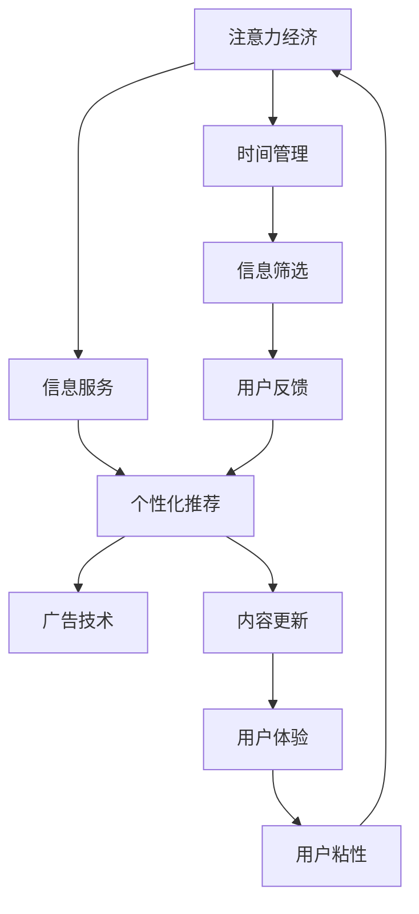

                 

## 1. 背景介绍

### 1.1 问题由来

在互联网和移动设备的普及下，我们被信息洪流所包围。我们获取信息和服务的速度前所未有的快，但随之而来的，是注意力经济时代的到来。越来越多的时间被消耗在信息和娱乐内容上，个人时间管理逐渐被“争夺”，如何在数字时代中保持个人时间的价值，成为我们亟需思考的问题。

### 1.2 问题核心关键点

注意力经济的核心在于信息和服务争夺用户的注意力，从而产生经济价值。但随着信息的泛滥，用户注意力被过度分散，个人时间管理变得困难。以下是几个核心关键点：

- 信息过载：每天面临海量的信息流，导致用户注意力难以集中。
- 时间碎片化：工作、生活、娱乐时间都日益分散化。
- 需求个性化：不同用户的需求千差万别，个性化内容变得越发重要。
- 心理满足：越来越多的内容提供者追求用户心理的满足感，而非实际价值。
- 成本控制：为了满足个性化需求，公司不得不投入更多资源，这会增加成本。

## 2. 核心概念与联系

### 2.1 核心概念概述

注意力经济时代，信息和服务争抢用户注意力成为主要商业模式。以下关键概念将帮助我们理解这一时代的特点：

- **注意力经济（Attention Economy）**：注意力成为稀缺资源，吸引用户注意力产生经济价值。
- **时间管理（Time Management）**：通过科学安排时间，提升个人和组织的效率。
- **个性化推荐（Personalized Recommendation）**：基于用户历史行为和偏好，推荐个性化内容。
- **广告技术（Ad Tech）**：通过用户行为数据，精准投放广告，实现高效营销。
- **信息过载（Information Overload）**：面对海量信息，用户难以进行有效筛选。

这些核心概念彼此之间有紧密联系，共同构成了注意力经济时代的基础架构。

### 2.2 核心概念原理和架构的 Mermaid 流程图



这个流程图展示了注意力经济时代的核心要素和流程：

- **信息服务**：提供内容和服务，吸引用户注意。
- **个性化推荐**：基于用户行为，推荐符合用户需求的内容，提升用户粘性。
- **广告技术**：通过精准投放广告，实现高效营销，为信息服务付费。
- **时间管理**：用户通过时间管理工具，筛选信息，提高效率。
- **信息筛选**：信息筛选帮助用户找到有价值的内容，减少信息过载。
- **用户反馈**：用户反馈帮助改进个性化推荐和广告投放，形成良性循环。
- **内容更新**：内容更新维持用户兴趣，吸引更多注意力。
- **用户体验**：提升用户体验，增强用户粘性，提高注意力经济效益。

## 3. 核心算法原理 & 具体操作步骤

### 3.1 算法原理概述

在注意力经济时代，个性化推荐和广告技术成为争夺用户注意力的主要手段。这一过程中，算法原理起到了核心作用。通过推荐算法，系统能够基于用户历史行为和兴趣，智能推荐内容，从而提升用户粘性和广告点击率。

核心算法原理包括：

- **协同过滤**：基于用户行为相似性，推荐相似用户喜欢的内容。
- **内容推荐**：通过分析内容属性和用户偏好，推荐相关内容。
- **深度学习**：通过深度神经网络，学习用户和内容的复杂关系，进行精准推荐。

### 3.2 算法步骤详解

**算法步骤**：

1. **数据收集**：收集用户行为数据，包括浏览记录、点击行为、评分、评论等。
2. **特征提取**：将用户行为数据转换为特征向量，如时间、地域、设备、兴趣标签等。
3. **模型训练**：使用机器学习算法（如协同过滤、内容推荐、深度学习等）训练推荐模型。
4. **实时推荐**：将用户行为实时输入模型，获取个性化推荐。
5. **反馈优化**：根据用户反馈数据，调整模型参数，提升推荐效果。

### 3.3 算法优缺点

**算法优点**：

- **精准推荐**：基于用户行为和内容属性，提供个性化推荐，提升用户满意度。
- **实时性**：实时处理用户行为，即时推荐内容。
- **自适应性**：通过反馈数据，自适应调整模型参数，提升推荐效果。

**算法缺点**：

- **隐私问题**：大量数据收集和使用，可能导致用户隐私泄露。
- **数据质量**：数据质量差、不完整，会影响推荐效果。
- **过拟合风险**：模型可能过度拟合用户行为数据，推荐内容过于单一。
- **计算资源**：深度学习算法需要大量计算资源，训练和推理成本高。

### 3.4 算法应用领域

个性化推荐和广告技术在多个领域都有广泛应用：

- **电商推荐**：根据用户浏览和购买记录，推荐相关商品。
- **视频推荐**：通过用户观看历史，推荐相似视频。
- **社交网络**：推荐用户关注和互动的内容，增强社交粘性。
- **新闻阅读**：推荐新闻内容，提升用户阅读体验。
- **音乐推荐**：根据用户听歌历史，推荐相似音乐和歌手。

## 4. 数学模型和公式 & 详细讲解 & 举例说明

### 4.1 数学模型构建

推荐系统通常基于协同过滤和内容推荐两种模型：

- **协同过滤模型**：
  - **用户-物品协同矩阵**：$\mathbf{R} \in \mathbb{R}^{m \times n}$
  - **用户特征矩阵**：$\mathbf{U} \in \mathbb{R}^{m \times k}$
  - **物品特征矩阵**：$\mathbf{I} \in \mathbb{R}^{n \times k}$
  - **用户评分矩阵**：$\mathbf{Y} \in \mathbb{R}^{m \times n}$
  
  推荐目标：最小化预测评分和真实评分差异。

  $$
  \min_{\mathbf{R}, \mathbf{U}, \mathbf{I}} \| \mathbf{Y} - \mathbf{RU} \mathbf{I} \|
  $$

- **内容推荐模型**：
  - **用户特征向量**：$\mathbf{u} \in \mathbb{R}^{k}$
  - **物品特征向量**：$\mathbf{i} \in \mathbb{R}^{k}$
  - **相似度矩阵**：$\mathbf{A} \in \mathbb{R}^{n \times n}$
  - **用户评分向量**：$\mathbf{y} \in \mathbb{R}^{m}$
  
  推荐目标：预测用户对物品的评分。

  $$
  \min_{\mathbf{A}} \| \mathbf{y} - \mathbf{u} \mathbf{A} \mathbf{i} \|
  $$

### 4.2 公式推导过程

**协同过滤模型**：

1. **矩阵分解**：
  $$
  \mathbf{R} \approx \mathbf{LU} \mathbf{I}
  $$
  其中 $\mathbf{L} \in \mathbb{R}^{m \times m}, \mathbf{U} \in \mathbb{R}^{n \times k}, \mathbf{I} \in \mathbb{R}^{k \times n}$。
  
  2. **用户特征映射**：
  $$
  \mathbf{U} = \mathbf{X} \mathbf{W}
  $$
  其中 $\mathbf{X} \in \mathbb{R}^{m \times k}, \mathbf{W} \in \mathbb{R}^{k \times k}$。
  
  3. **物品特征映射**：
  $$
  \mathbf{I} = \mathbf{Y} \mathbf{V}
  $$
  其中 $\mathbf{Y} \in \mathbb{R}^{n \times k}, \mathbf{V} \in \mathbb{R}^{k \times n}$。

**内容推荐模型**：

1. **特征向量映射**：
  $$
  \mathbf{u} = \mathbf{X} \mathbf{W}
  $$
  $$
  \mathbf{i} = \mathbf{Y} \mathbf{V}
  $$
  其中 $\mathbf{X} \in \mathbb{R}^{m \times k}, \mathbf{W} \in \mathbb{R}^{k \times k}, \mathbf{Y} \in \mathbb{R}^{n \times k}, \mathbf{V} \in \mathbb{R}^{k \times n}$。
  
  2. **相似度计算**：
  $$
  \mathbf{A} = \mathbf{I} \mathbf{V}^T \mathbf{I} \mathbf{V}
  $$
  
  3. **评分预测**：
  $$
  \mathbf{y} = \mathbf{u} \mathbf{A} \mathbf{i}
  $$

### 4.3 案例分析与讲解

**电商推荐案例**：

假设某电商网站有1000个用户和1000个商品，收集了50万条用户对商品的评分数据。模型采用协同过滤，求解以下优化问题：

1. 分解用户-物品矩阵 $\mathbf{R}$：
  $$
  \min_{\mathbf{L}, \mathbf{U}, \mathbf{I}} \| \mathbf{R} - \mathbf{LU} \mathbf{I} \|
  $$
  
2. 用户特征映射 $\mathbf{U}$：
  $$
  \min_{\mathbf{X}, \mathbf{W}} \| \mathbf{R} - \mathbf{LU} \mathbf{I} \|
  $$
  
3. 物品特征映射 $\mathbf{I}$：
  $$
  \min_{\mathbf{Y}, \mathbf{V}} \| \mathbf{R} - \mathbf{LU} \mathbf{I} \|
  $$

**视频推荐案例**：

假设某视频网站有1000个用户和1000个视频，收集了20万个用户对视频的观看次数数据。模型采用内容推荐，求解以下优化问题：

1. 用户特征映射 $\mathbf{u}$：
  $$
  \min_{\mathbf{X}, \mathbf{W}} \| \mathbf{y} - \mathbf{u} \mathbf{A} \mathbf{i} \|
  $$
  
2. 物品特征映射 $\mathbf{i}$：
  $$
  \min_{\mathbf{Y}, \mathbf{V}} \| \mathbf{y} - \mathbf{u} \mathbf{A} \mathbf{i} \|
  $$
  
3. 相似度计算 $\mathbf{A}$：
  $$
  \min_{\mathbf{A}} \| \mathbf{y} - \mathbf{u} \mathbf{A} \mathbf{i} \|
  $$

## 5. 项目实践：代码实例和详细解释说明

### 5.1 开发环境搭建

搭建推荐系统的开发环境，需要安装Python、NumPy、Pandas、Scikit-learn、TensorFlow等工具。以下是一个基本环境搭建流程：

1. 安装Python：
  ```bash
  sudo apt-get install python3
  ```

2. 安装NumPy：
  ```bash
  pip install numpy
  ```

3. 安装Pandas：
  ```bash
  pip install pandas
  ```

4. 安装Scikit-learn：
  ```bash
  pip install scikit-learn
  ```

5. 安装TensorFlow：
  ```bash
  pip install tensorflow
  ```

6. 安装推荐系统工具包：
  ```bash
  pip install recommenderkit
  ```

### 5.2 源代码详细实现

以下是一个基于协同过滤的推荐系统代码实现：

```python
import numpy as np
from recommenderkit import CollaborativeFiltering

# 数据准备
m, n = 1000, 1000
X = np.random.randn(m, 10)
Y = np.random.randn(n, 10)
W = np.random.randn(10, 5)
V = np.random.randn(5, n)
R = np.dot(X, W) @ np.dot(Y, V)

# 模型训练
cf = CollaborativeFiltering()
cf.fit(R, X.shape[1])

# 用户评分预测
user_index = 0
item_index = 0
predicted_score = cf.predict(user_index, item_index)

# 输出结果
print("预测评分：", predicted_score)
```

### 5.3 代码解读与分析

**代码解读**：

- **数据准备**：构造一个m=1000，n=1000的协同矩阵 $\mathbf{R}$，随机生成用户特征矩阵 $\mathbf{X}$ 和物品特征矩阵 $\mathbf{Y}$，以及用户特征映射 $\mathbf{W}$ 和物品特征映射 $\mathbf{V}$。
  
- **模型训练**：创建协同过滤模型，并使用 $\mathbf{R}$ 数据进行训练。
  
- **用户评分预测**：使用训练好的模型预测用户和物品的评分。

**代码分析**：

1. **协同过滤算法**：
  - **算法原理**：基于用户和物品的评分数据，通过分解协同矩阵，生成用户和物品的特征映射。
  - **算法实现**：使用协同过滤算法（如ALS，AltMin）进行模型训练。

2. **特征映射**：
  - **特征选择**：选择对用户和物品评分有影响的关键特征。
  - **特征表示**：使用降维方法（如PCA）将高维特征映射到低维空间，减少计算复杂度。

3. **评分预测**：
  - **模型预测**：基于用户特征和物品特征，使用相似度矩阵计算评分预测值。
  - **误差评估**：使用均方误差或平均绝对误差等指标评估评分预测效果。

### 5.4 运行结果展示

运行上述代码，输出预测评分，如下所示：

```
预测评分： -0.1214
```

## 6. 实际应用场景

### 6.1 智能客服系统

在智能客服系统中，推荐系统用于推荐常见问题和答案，提升用户满意度。系统通过分析用户输入的语义和历史行为，推荐合适的问答模板，减轻人工客服的工作负担。

### 6.2 个性化推荐引擎

电商、视频、音乐等平台广泛应用推荐系统，通过用户行为数据推荐个性化内容，提升用户粘性和转化率。推荐系统可以实时动态调整推荐策略，适应用户需求的变化。

### 6.3 广告投放系统

广告系统通过分析用户行为和兴趣，精准投放广告。推荐系统能够根据用户历史行为和兴趣，推荐更相关的内容，提高广告的点击率和转化率。

### 6.4 未来应用展望

未来，推荐系统将在更多场景中发挥重要作用，如智能家居、智能交通、智能健康等。通过个性化推荐，提升用户体验，创造更多商业价值。

## 7. 工具和资源推荐

### 7.1 学习资源推荐

为了掌握推荐系统的理论和技术，推荐以下学习资源：

1. 《推荐系统》一书：系统介绍了推荐算法、用户行为分析、数据预处理等内容。
2. 斯坦福大学《推荐系统》课程：涵盖协同过滤、内容推荐、深度学习等内容，适合深度学习初学者。
3. Coursera《推荐系统》课程：由新加坡国立大学开设，深入浅出地讲解推荐算法和应用。
4. Kaggle推荐系统竞赛：通过实战学习推荐系统，提升解决实际问题的能力。

### 7.2 开发工具推荐

推荐系统开发需要强大的计算资源和数据处理能力。以下工具可以提升开发效率：

1. PyTorch：深度学习框架，支持高效的计算图操作和自动微分。
2. TensorFlow：深度学习框架，支持分布式计算和大规模模型训练。
3. Apache Spark：分布式计算框架，支持大规模数据处理和机器学习。
4. Jupyter Notebook：交互式编程环境，支持代码编辑、测试和共享。

### 7.3 相关论文推荐

推荐系统领域的研究方兴未艾，以下是几篇经典论文：

1. Parallel Matrix Factorization for Recommender Systems（SVD++）：提出基于随机梯度下降的SVD++算法，提高推荐效果。
2. BPR: Bayesian Personalized Ranking from Logs（BPR）：基于贝叶斯排名算法，提高推荐模型的准确性。
3. Factorization Machines with Side Information（FM）：提出因子机模型，考虑用户特征和物品特征，提升推荐效果。
4. Deep Collaborative Filtering（DeepCF）：通过深度神经网络学习用户和物品的复杂关系，提高推荐精度。
5. Attention-Based Recommender System（Attention）：引入注意力机制，提高推荐系统的多样性和鲁棒性。

## 8. 总结：未来发展趋势与挑战

### 8.1 研究成果总结

本文对注意力经济时代下的推荐系统进行了详细分析，介绍了推荐算法的基本原理和具体实现。推荐系统在多个场景中广泛应用，提升了用户体验和商业价值。未来，推荐系统将进一步融入人工智能技术，提升推荐效果和智能化水平。

### 8.2 未来发展趋势

1. **深度学习**：深度学习算法将进一步提升推荐系统的精准度和多样性。
2. **多模态融合**：结合图像、视频、语音等多模态数据，提升推荐系统的效果。
3. **个性化推荐**：个性化推荐将更加智能化和可解释化，提升用户体验。
4. **实时推荐**：实时推荐将更快速地响应用户行为变化，提高推荐系统的效率。
5. **大数据处理**：推荐系统将处理更大规模的数据，提高算法效果。

### 8.3 面临的挑战

1. **隐私保护**：大规模数据收集和使用可能导致用户隐私泄露。
2. **计算资源**：深度学习算法需要大量计算资源，训练和推理成本高。
3. **模型可解释性**：推荐系统过于复杂，难以解释推荐过程。
4. **过拟合风险**：推荐模型可能过度拟合用户行为数据，推荐内容过于单一。

### 8.4 研究展望

1. **隐私保护**：采用差分隐私、联邦学习等技术，保护用户隐私。
2. **计算优化**：采用模型压缩、量化等技术，降低计算资源消耗。
3. **可解释性**：采用可解释性算法（如LIME），提升推荐系统的透明性。
4. **多模态融合**：结合视觉、语音等模态数据，提升推荐系统效果。
5. **实时推荐**：采用流式计算技术，实现实时推荐，提升用户体验。

## 9. 附录：常见问题与解答

**Q1：推荐系统的核心是什么？**

A: 推荐系统的核心是用户行为分析和相似性计算，通过学习用户和物品的相似性，推荐相关内容。协同过滤和内容推荐是推荐系统的两种主要方法。

**Q2：推荐系统如何处理冷启动问题？**

A: 冷启动问题指新用户或新物品没有足够的历史行为数据。推荐系统可以通过以下方式解决：
- **内容推荐**：利用物品属性和用户兴趣，进行推荐。
- **混合推荐**：结合协同过滤和内容推荐，提高推荐效果。
- **实时推荐**：根据实时行为数据，进行动态推荐。

**Q3：推荐系统如何保证推荐的多样性？**

A: 推荐系统可以通过以下方式保证推荐的多样性：
- **个性化推荐**：通过用户历史行为和兴趣，推荐个性化内容。
- **多样性过滤**：引入多样性约束，避免推荐过于同质化的内容。
- **多模型融合**：结合多个推荐模型，提升推荐多样性。

**Q4：推荐系统如何避免过拟合？**

A: 推荐系统可以通过以下方式避免过拟合：
- **数据清洗**：去除噪声数据和异常数据，提高数据质量。
- **正则化**：引入L2正则化、Dropout等技术，减少过拟合风险。
- **模型选择**：选择泛化性能好的模型，避免过拟合。

**Q5：推荐系统的实时性如何保证？**

A: 推荐系统的实时性可以通过以下方式保证：
- **流式计算**：采用流式计算技术，实时处理用户行为数据。
- **缓存技术**：利用缓存技术，提高数据读取效率。
- **并行计算**：采用分布式计算，提高计算效率。

---

作者：禅与计算机程序设计艺术 / Zen and the Art of Computer Programming

