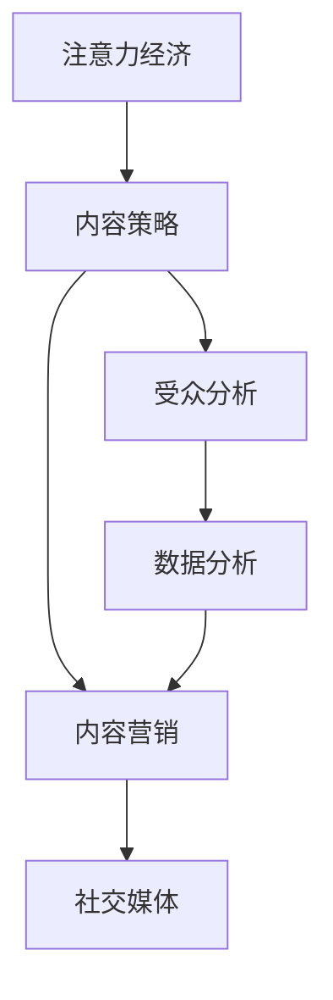

                 

# 注意力经济与内容策略规划与实施：为受众创建有影响力的内容

> 关键词：注意力经济, 内容策略, 内容营销, 受众分析, 社交媒体, 数据分析

## 1. 背景介绍

### 1.1 问题由来

在信息爆炸的时代，如何吸引并留住受众的注意力成为企业面临的最大挑战。随着社交媒体和数字平台的兴起，如何有效管理和利用注意力，成为现代营销的核心议题。注意力经济（Attention Economy）成为了一个热门话题，企业纷纷寻求通过优质内容策略来提升品牌知名度和用户粘性。

### 1.2 问题核心关键点

注意力经济的核心在于如何通过优质的内容吸引受众的注意力，并转化为实际的商业价值。内容策略规划与实施是实现这一目标的关键步骤。具体而言，包括以下几个关键点：

- **受众分析**：理解目标受众的兴趣、需求和行为模式，提供符合他们期待的内容。
- **内容创作**：基于受众分析结果，制作有吸引力、相关性强的内容。
- **渠道选择**：确定内容发布的最佳平台，以最大化曝光和互动。
- **数据分析**：通过数据监控和分析，持续优化内容策略，确保效果最大化。

### 1.3 问题研究意义

了解和掌握注意力经济的内容策略规划与实施，对企业来说具有重要的战略意义：

1. **提升品牌价值**：通过吸引受众的注意力，企业可以提升品牌知名度和美誉度，构建强大的品牌形象。
2. **增强用户粘性**：优质的内容可以增强用户对品牌的信任感和依赖性，提高用户留存率。
3. **驱动销售转化**：吸引受众注意力后，企业可以通过引导和促销策略，将注意力转化为实际的购买行为。
4. **数据驱动决策**：通过数据监控和分析，企业可以更加精准地制定内容策略，实现高效的营销效果。

## 2. 核心概念与联系

### 2.1 核心概念概述

为了更好地理解注意力经济的内容策略规划与实施，本节将介绍几个核心概念：

- **注意力经济（Attention Economy）**：指在信息过载的环境中，如何通过优质内容吸引并保持受众的注意力，从而提升商业价值。
- **内容策略（Content Strategy）**：是指企业为了达到特定营销目标，有计划地创造、发布和管理内容的过程。
- **内容营销（Content Marketing）**：是指通过创建和分发有价值、相关且一致的内容，吸引并留住明确受众，最终驱动盈利性的客户行为的一种营销方法。
- **受众分析（Audience Analysis）**：是指通过数据分析和研究，了解受众的兴趣、需求和行为模式，以指导内容创作和策略实施。
- **社交媒体（Social Media）**：是指用户基于公共、半公共及私人平台进行沟通交流的互联网应用，是内容策略实施的重要渠道。
- **数据分析（Data Analytics）**：是指通过收集、处理和分析数据，以获得有用的信息和知识，用于支持决策和优化策略。

这些核心概念之间的逻辑关系可以通过以下Mermaid流程图来展示：



这个流程图展示了几者之间的关系：

1. 注意力经济是企业追求的目标。
2. 内容策略是实现注意力经济的手段。
3. 内容营销是内容策略的具体实施方式。
4. 受众分析是内容策略制定的依据。
5. 数据分析是内容策略优化和评估的关键工具。
6. 社交媒体是内容营销的主要渠道。

## 3. 核心算法原理 & 具体操作步骤

### 3.1 算法原理概述

注意力经济的内容策略规划与实施，其核心在于如何通过内容吸引和保持受众的注意力，并转化为商业价值。这一过程主要涉及以下几个关键环节：

1. **受众分析**：通过数据收集和分析，了解受众的兴趣、需求和行为模式。
2. **内容创作**：基于受众分析结果，制作有吸引力、相关性强的内容。
3. **渠道选择**：确定内容发布的最佳平台，以最大化曝光和互动。
4. **数据分析**：通过数据监控和分析，持续优化内容策略，确保效果最大化。

### 3.2 算法步骤详解

基于注意力经济的内容策略规划与实施，一般包括以下几个关键步骤：

**Step 1: 受众分析**

- **数据收集**：收集受众的基本信息、兴趣点、行为数据等，可以通过问卷调查、在线跟踪和第三方数据获取。
- **数据分析**：对收集到的数据进行统计分析，挖掘受众的共性需求和偏好。
- **受众画像**：基于分析结果，创建详细的受众画像，描述受众的特征和行为模式。

**Step 2: 内容创作**

- **主题确定**：根据受众画像，确定内容的创作主题和方向。
- **内容制作**：制作与受众需求和兴趣相关的内容，包括文章、视频、图片等。
- **质量控制**：确保内容的高质量，遵守相关法规和标准。

**Step 3: 渠道选择**

- **平台分析**：分析各社交媒体平台的用户特征和内容表现，确定发布渠道。
- **内容适配**：根据不同平台的特点，适配内容形式和分发策略。
- **发布计划**：制定详细的内容发布计划，安排发布时间和频率。

**Step 4: 数据分析**

- **效果监测**：通过数据分析工具监控内容的表现，包括曝光量、互动率等关键指标。
- **性能评估**：评估内容的实际效果，比较预期与实际表现。
- **策略优化**：基于评估结果，调整内容策略和发布计划。

### 3.3 算法优缺点

注意力经济的内容策略规划与实施方法具有以下优点：

1. **精准定位受众**：通过受众分析，可以精准了解目标受众的需求和兴趣，提供更相关、有价值的内容。
2. **提升品牌知名度**：优质内容能够吸引更多受众的注意力，提升品牌知名度和美誉度。
3. **增强用户粘性**：有吸引力的内容可以增强用户对品牌的信任感和依赖性，提高用户留存率。
4. **数据驱动决策**：通过数据分析，可以持续优化内容策略，确保效果最大化。

同时，该方法也存在一定的局限性：

1. **数据质量依赖**：内容策略的成功在很大程度上依赖于高质量的数据，数据获取和分析成本较高。
2. **内容制作难度大**：制作高水平的内容需要一定的专业知识和创意，难以快速产出。
3. **渠道竞争激烈**：社交媒体平台众多，内容竞争激烈，需要持续创新和优化。
4. **效果评估复杂**：数据指标众多，不同内容的效果评估标准难以统一。

尽管存在这些局限性，但就目前而言，基于注意力经济的内容策略规划与实施方法仍然是主流的内容营销手段。未来相关研究重点在于如何进一步提高数据质量、降低内容制作成本、优化数据分析方法，同时兼顾内容的创意和质量。

### 3.4 算法应用领域

注意力经济的内容策略规划与实施方法，在多个领域得到了广泛的应用，包括但不限于：

- **电子商务**：通过优质内容吸引消费者，提高销售额和用户粘性。
- **旅游行业**：通过吸引受众注意力，提升旅游产品的知名度和吸引力。
- **教育培训**：通过教育内容吸引学生和家长，提高品牌声誉和招生效果。
- **娱乐传媒**：通过娱乐内容吸引受众，提升关注度和订阅量。
- **科技行业**：通过技术分享和知识传播，提升品牌权威性和用户参与度。

除了这些经典应用外，注意力经济的内容策略还在医疗、金融、政府公共服务等多个领域发挥着重要作用，为各行各业带来新的增长点和创新点。

## 4. 数学模型和公式 & 详细讲解 & 举例说明

### 4.1 数学模型构建

本节将使用数学语言对注意力经济的内容策略规划与实施过程进行更加严格的刻画。

假设受众分析数据集为 $D=\{(x_i, y_i)\}_{i=1}^N, x_i \in \mathcal{X}, y_i \in \mathcal{Y}$，其中 $x_i$ 为受众特征向量，$y_i$ 为受众兴趣标签。

**受众特征**：
- **用户基本信息**：如年龄、性别、职业等。
- **行为数据**：如浏览记录、点击行为、购买记录等。

**受众兴趣标签**：
- **兴趣类型**：如娱乐、科技、财经等。
- **兴趣程度**：如高、中、低。

定义受众特征向量 $x$ 与兴趣标签 $y$ 之间的关系为 $f(x)$，假设 $f(x)$ 为线性函数，则数学模型为：

$$
y_i = f(x_i) + \epsilon_i
$$

其中 $\epsilon_i$ 为随机误差项。

### 4.2 公式推导过程

以下我们以用户兴趣预测为例，推导线性回归模型的具体形式：

假设用户基本信息向量 $x_i = (x_{i1}, x_{i2}, \ldots, x_{in})$，兴趣程度标签 $y_i$ 与兴趣类型标签 $y_i$ 为二分类标签。通过线性回归模型进行用户兴趣预测，公式为：

$$
y_i = \alpha_0 + \sum_{j=1}^n \alpha_j x_{ij} + \epsilon_i
$$

其中 $\alpha_0$ 为截距，$\alpha_j$ 为回归系数，$n$ 为特征维度。

通过最小二乘法，求解最优的 $\alpha_0$ 和 $\alpha_j$：

$$
\alpha_0, \alpha_j = \mathop{\arg\min}_{\alpha_0, \alpha_j} \sum_{i=1}^N (y_i - (\alpha_0 + \sum_{j=1}^n \alpha_j x_{ij}))^2
$$

通过求解上述最小化问题，得到线性回归模型的参数。在实际应用中，可以通过Python的scikit-learn库进行模型训练和预测。

### 4.3 案例分析与讲解

假设某电子商务平台希望通过内容策略提升用户购买率。首先，平台收集了用户的浏览历史、购买记录等数据，并通过数据挖掘和统计分析，获取用户的基本信息（如年龄、性别）和兴趣类型（如时尚、电子产品等）。

接着，平台使用线性回归模型对用户兴趣进行预测，确定不同类型用户对不同商品的兴趣程度。基于预测结果，平台制定了精准的用户推荐策略，并通过社交媒体渠道发布相关内容。

最后，平台通过数据分析工具，实时监控推荐内容的效果，调整优化推荐算法和内容策略。经过一段时间的运营，平台的用户粘性显著提升，销售额和用户满意度也显著提高。

## 5. 项目实践：代码实例和详细解释说明

### 5.1 开发环境搭建

在进行内容策略规划与实施的实践前，我们需要准备好开发环境。以下是使用Python进行scikit-learn开发的典型环境配置流程：

1. 安装Anaconda：从官网下载并安装Anaconda，用于创建独立的Python环境。

2. 创建并激活虚拟环境：
```bash
conda create -n sklearn-env python=3.8 
conda activate sklearn-env
```

3. 安装scikit-learn和其他相关工具：
```bash
pip install scikit-learn pandas matplotlib jupyter notebook
```

完成上述步骤后，即可在`sklearn-env`环境中开始内容策略的开发实践。

### 5.2 源代码详细实现

下面我们以用户兴趣预测为例，给出使用scikit-learn库进行线性回归的PyTorch代码实现。

首先，定义用户数据集和线性回归模型：

```python
from sklearn.linear_model import LinearRegression
from sklearn.metrics import mean_squared_error
import pandas as pd

# 读取用户数据
data = pd.read_csv('user_data.csv')

# 定义特征和标签
features = data[['age', 'gender', 'buy_frequency']]
labels = data['interest_type']

# 划分训练集和测试集
train_features = features[:1000]
train_labels = labels[:1000]
test_features = features[1000:]
test_labels = labels[1000:]

# 定义线性回归模型
model = LinearRegression()

# 训练模型
model.fit(train_features, train_labels)

# 预测测试集
predictions = model.predict(test_features)
```

然后，评估模型效果：

```python
# 计算均方误差
mse = mean_squared_error(test_labels, predictions)
print(f'Mean Squared Error: {mse:.2f}')

# 可视化预测结果
import matplotlib.pyplot as plt

plt.scatter(test_features['age'], test_labels)
plt.plot(test_features['age'], predictions, color='red')
plt.xlabel('Age')
plt.ylabel('Interest')
plt.show()
```

最后，输出模型结果：

```python
# 输出预测结果
print(f'Interest prediction for user with age 25: {model.predict([[25]])}')
```

以上就是使用scikit-learn进行用户兴趣预测的完整代码实现。可以看到，scikit-learn提供了简单易用的API，使得线性回归模型的训练和评估变得非常简单。

### 5.3 代码解读与分析

让我们再详细解读一下关键代码的实现细节：

**用户数据集**：
- 通过Pandas库读取用户数据，包含年龄、性别、购买频率等特征，以及兴趣类型标签。

**线性回归模型**：
- 使用scikit-learn库的LinearRegression模型进行用户兴趣预测。
- 通过均方误差（MSE）评估模型效果。

**数据可视化**：
- 使用Matplotlib库绘制预测结果，通过散点图和拟合直线直观展示预测效果。

**模型输出**：
- 通过模型对特定用户年龄进行预测，输出其兴趣类型。

可以看到，scikit-learn库提供了强大的数据处理和模型训练功能，使得内容策略规划与实施的实践变得更加简单高效。开发者可以将更多精力放在数据处理、模型改进等高层逻辑上，而不必过多关注底层的实现细节。

当然，实际应用中还需考虑更多因素，如用户隐私保护、数据分布平衡、模型超参数调优等，需要综合考虑和优化。

## 6. 实际应用场景

### 6.1 电商平台的个性化推荐

电商平台的个性化推荐是注意力经济的重要应用场景之一。通过分析用户的浏览和购买行为，平台可以精准推荐符合用户兴趣的商品，提升用户购物体验和转化率。

在技术实现上，平台可以收集用户的浏览记录、购买记录、评价反馈等数据，利用机器学习模型进行用户画像和兴趣预测。基于预测结果，平台可以设计个性化推荐算法，实现有针对性的商品推荐。此外，平台还可以利用社交媒体等渠道，通过优质内容吸引用户关注，进一步提高推荐效果。

### 6.2 旅游行业的精准营销

旅游行业的精准营销也是注意力经济的重要应用场景。平台可以通过分析用户的历史预订记录、浏览记录、搜索历史等数据，了解用户对旅游目的地的兴趣和偏好。基于这些数据，平台可以设计精准的营销策略，通过社交媒体等渠道发布相关内容，吸引用户预订旅游产品。

### 6.3 教育行业的知识共享

教育行业的知识共享也是注意力经济的重要应用场景。平台可以通过分析学生的学习记录、测试成绩、兴趣偏好等数据，提供个性化的学习资源和辅导服务。同时，平台还可以通过社交媒体等渠道，发布教育相关的优质内容，吸引更多学生和家长的关注和参与。

### 6.4 未来应用展望

随着数据技术和机器学习模型的不断进步，注意力经济的内容策略规划与实施将在更多领域得到应用，为各行各业带来变革性影响。

在智慧医疗领域，基于用户健康数据的分析，可以为患者提供个性化的健康建议和治疗方案，提高医疗服务的效率和质量。

在智能城市治理中，通过分析市民的行为数据，可以优化城市资源配置，提高城市管理的智能化水平，构建更安全、高效的未来城市。

在智慧金融领域，通过分析用户的财务数据和投资行为，可以为投资者提供个性化的投资建议和理财服务，提升金融服务的智能性和安全性。

此外，在教育、文化、娱乐等多个领域，基于注意力经济的内容策略也将不断涌现，为各行各业带来新的增长点和创新点。相信随着技术的日益成熟，注意力经济的内容策略必将在构建人机协同的智能时代中扮演越来越重要的角色。

## 7. 工具和资源推荐

### 7.1 学习资源推荐

为了帮助开发者系统掌握注意力经济的内容策略规划与实施的理论基础和实践技巧，这里推荐一些优质的学习资源：

1. 《内容策略入门与实践》系列博文：由内容营销专家撰写，深入浅出地介绍了内容策略的基本概念和实践方法。

2. 《数据科学基础》课程：Coursera等平台开设的入门级数据科学课程，帮助理解数据处理和机器学习的基本原理。

3. 《机器学习实战》书籍：Hands-On Machine Learning with Scikit-Learn、TensorFlow等实践性强的书籍，提供丰富的代码实现案例。

4. HubSpot Academy：提供系统的内容营销培训课程，涵盖内容策略、数据分析、社交媒体等多个方面。

5. Google Analytics Academy：提供Google Analytics的培训课程，帮助理解用户行为数据和内容效果分析。

通过对这些资源的学习实践，相信你一定能够快速掌握注意力经济的内容策略规划与实施的精髓，并用于解决实际的商业问题。

### 7.2 开发工具推荐

高效的开发离不开优秀的工具支持。以下是几款用于注意力经济内容策略开发的常用工具：

1. Python：作为数据科学和机器学习的主流编程语言，Python拥有丰富的第三方库和社区支持，非常适合内容策略的开发和实践。

2. scikit-learn：机器学习模型的封装库，提供了简单易用的API，适合快速迭代研究。

3. TensorFlow：Google开发的深度学习框架，支持分布式计算，适用于大规模数据处理和模型训练。

4. Jupyter Notebook：交互式编程环境，方便开发者进行代码实验和数据分析。

5. Google Analytics：用于监控和分析用户行为数据的工具，帮助理解受众需求和内容效果。

合理利用这些工具，可以显著提升注意力经济内容策略的开发效率，加快创新迭代的步伐。

### 7.3 相关论文推荐

注意力经济的内容策略规划与实施的研究源于学界的持续研究。以下是几篇奠基性的相关论文，推荐阅读：

1. 《Attention is All You Need》：Transformer论文，提出了自注意力机制，开启了深度学习模型的注意力机制研究。

2. 《Deep Learning for Content Recommendation》：介绍了基于深度学习的内容推荐系统，探讨了各种模型架构和优化方法。

3. 《User Interest Prediction and Personalized Recommendation Based on Collaborative Filtering》：介绍了基于协同过滤的用户兴趣预测和个性化推荐算法，提供了多种评价指标和优化策略。

4. 《Data-Driven Content Strategy》：介绍如何利用大数据和机器学习技术，进行内容策略的优化和调整。

5. 《Towards a Data-Driven Content Strategy》：探讨了如何通过数据监控和分析，不断优化内容策略，提升内容效果。

这些论文代表了大语言模型微调技术的发展脉络。通过学习这些前沿成果，可以帮助研究者把握学科前进方向，激发更多的创新灵感。

## 8. 总结：未来发展趋势与挑战

### 8.1 总结

本文对注意力经济的内容策略规划与实施方法进行了全面系统的介绍。首先阐述了注意力经济的内容策略规划与实施的背景和意义，明确了内容策略在拓展品牌影响、提升用户粘性、驱动销售转化等方面的独特价值。其次，从原理到实践，详细讲解了内容策略的数学模型和关键步骤，给出了内容策略开发的完整代码实例。同时，本文还广泛探讨了内容策略在电商、旅游、教育等多个行业领域的应用前景，展示了内容策略范式的巨大潜力。此外，本文精选了内容策略的相关学习资源，力求为读者提供全方位的技术指引。

通过本文的系统梳理，可以看到，注意力经济的内容策略规划与实施方法正在成为现代营销的重要范式，极大地拓展了品牌和内容的表现形式，提升了用户体验和商业价值。未来，伴随数据技术和机器学习模型的不断进步，内容策略将变得更加智能化、精准化和自动化，为构建人机协同的智能时代提供强有力的支撑。

### 8.2 未来发展趋势

展望未来，注意力经济的内容策略规划与实施将呈现以下几个发展趋势：

1. **数据质量提升**：随着数据收集和处理技术的进步，数据质量将进一步提升，内容策略将更加精准和个性化。
2. **内容自动化生成**：利用自然语言处理和生成对抗网络（GAN）等技术，自动生成高质量的内容，降低内容制作成本。
3. **多渠道整合**：内容策略将不再局限于单一渠道，而是整合多种渠道进行综合推广，提升效果和覆盖面。
4. **智能推荐系统**：基于用户行为和偏好，智能推荐个性化内容，提高用户满意度和转化率。
5. **情感分析**：通过情感分析技术，理解用户情感倾向，优化内容策略，提高用户互动和忠诚度。
6. **隐私保护**：随着数据隐私保护的重视，内容策略将更加注重数据隐私和安全，确保用户信息的安全。

以上趋势凸显了注意力经济的内容策略规划与实施的广阔前景。这些方向的探索发展，必将进一步提升内容策略的效果和应用范围，为各行业带来新的增长点和创新点。

### 8.3 面临的挑战

尽管注意力经济的内容策略规划与实施技术已经取得了瞩目成就，但在迈向更加智能化、普适化应用的过程中，它仍面临着诸多挑战：

1. **数据获取难度大**：高质量的数据获取和处理成本较高，特别是在数据隐私保护日益严格的背景下，数据获取难度更大。
2. **模型复杂度高**：内容策略涉及的模型复杂度高，需要大量的计算资源和专业知识。
3. **内容质量控制**：高质量的内容制作需要创意和经验，难以快速产出。
4. **用户多样性**：不同用户群体的需求和偏好差异大，内容策略难以全面覆盖。
5. **效果评估复杂**：内容策略的效果评估标准复杂多样，难以统一和量化。

尽管存在这些挑战，但就目前而言，基于注意力经济的内容策略规划与实施方法仍然是主流的内容营销手段。未来相关研究重点在于如何进一步提高数据质量、降低内容制作成本、优化模型效果，同时兼顾内容的创意和质量。

### 8.4 研究展望

面对注意力经济的内容策略面临的种种挑战，未来的研究需要在以下几个方面寻求新的突破：

1. **数据增强和补全**：通过数据增强和补全技术，提升数据质量和数量，降低数据获取成本。
2. **内容自动化生成**：研究自动化内容生成技术，降低内容制作难度和成本，提高内容产出速度。
3. **多模态内容融合**：研究多模态内容融合技术，将文本、图像、视频等多模态信息结合，提升内容的表现力和吸引力。
4. **用户行为分析**：通过深入分析用户行为，理解用户需求和兴趣，制定更加精准的内容策略。
5. **情感识别与反馈**：研究情感识别和反馈技术，优化内容策略，提高用户互动和忠诚度。
6. **隐私保护与数据安全**：研究隐私保护和数据安全技术，确保用户信息的安全和合规。

这些研究方向的探索，必将引领注意力经济的内容策略规划与实施技术迈向更高的台阶，为构建安全、可靠、可解释、可控的内容营销系统铺平道路。面向未来，内容策略需要与其他人工智能技术进行更深入的融合，如知识表示、因果推理、强化学习等，多路径协同发力，共同推动内容营销技术的进步。只有勇于创新、敢于突破，才能不断拓展内容策略的边界，让内容营销技术更好地造福各行各业。

## 9. 附录：常见问题与解答

**Q1：如何制定有效的内容策略？**

A: 制定有效的内容策略需要考虑以下几个关键因素：

1. **受众分析**：通过数据收集和分析，了解受众的基本信息、兴趣和行为模式。
2. **内容定位**：基于受众分析结果，确定内容的创作方向和主题。
3. **渠道选择**：选择合适的社交媒体平台，并根据平台特点调整内容形式和分发策略。
4. **效果评估**：通过数据分析工具监控内容表现，评估内容效果，不断优化内容策略。

**Q2：如何提升内容策略的效果？**

A: 提升内容策略的效果主要从以下几个方面入手：

1. **数据质量**：提升数据收集和处理的质量，确保内容策略的精准性。
2. **内容质量**：制作高质量、有吸引力的内容，提升用户互动和满意度。
3. **多渠道整合**：整合多种渠道进行综合推广，提升内容覆盖面和效果。
4. **用户反馈**：积极收集用户反馈，根据反馈不断优化内容策略。

**Q3：内容策略实施过程中需要注意哪些问题？**

A: 内容策略实施过程中需要注意以下问题：

1. **数据隐私**：确保用户数据的安全和隐私保护，避免数据泄露和滥用。
2. **内容多样性**：关注不同用户群体的需求和偏好，制定多样化的内容策略。
3. **效果评估**：使用科学合理的评估指标，确保内容策略的效果可量化和可比。
4. **资源投入**：合理分配资源，确保内容策略的顺利实施和效果提升。

通过回答这些问题，希望能为关注和实践内容策略的读者提供有用的指导和建议。

---

作者：禅与计算机程序设计艺术 / Zen and the Art of Computer Programming

