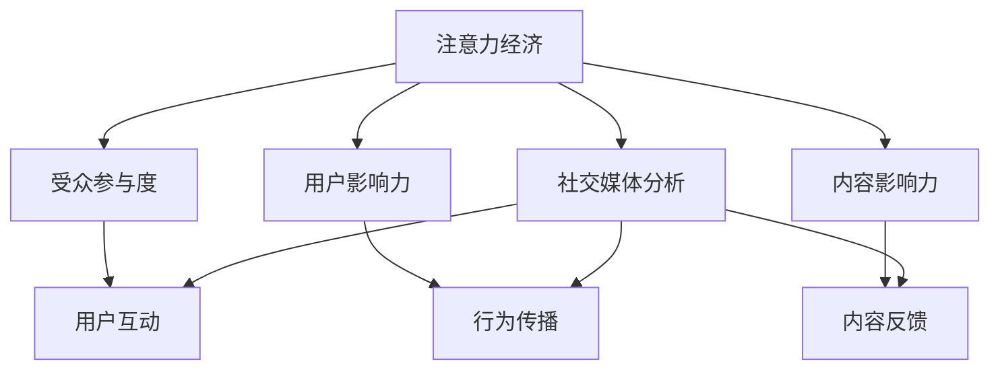

                 

## 1. 背景介绍

### 1.1 问题由来

在数字化时代，社交媒体的兴起极大地改变了人们获取信息和互动的方式。各大社交平台如Facebook、Twitter、Instagram等，通过算法驱动的方式，不断塑造和放大内容影响力。用户越来越多地消费和生产内容，社交媒体平台因此积累了海量的用户行为数据，这些数据蕴含了丰富的受众参与和影响力信息。如何有效分析和理解这些数据，成为一种新兴的注意力经济和数据分析技术。

### 1.2 问题核心关键点

注意力经济（Attention Economy）和社交媒体分析的核心在于：通过分析社交媒体上的用户行为数据，量化用户的参与度和影响力，以帮助企业和品牌更好地定位市场，优化内容策略，提升用户互动和转化率。其核心关键点包括：

1. 受众参与度（Engagement）：衡量用户对内容的互动频率和深度，如点赞、评论、分享等。
2. 用户影响力（Influence）：量化用户在社交网络中的影响力，如粉丝数量、转发次数等。
3. 内容影响力（Content Impact）：评估内容对用户参与度和影响力提升的贡献。
4. 社交媒体生态（Social Media Ecosystem）：研究不同社交平台上的用户行为模式和互动特征。

## 2. 核心概念与联系

### 2.1 核心概念概述

要理解注意力经济和社交媒体分析，首先需要了解以下几个核心概念：

- **注意力经济**：基于用户注意力资源的经济活动，旨在吸引并利用用户的注意力，从而获取商业价值。注意力经济的核心在于如何量化和衡量用户注意力的价值，以及如何利用这些注意力资源创造商业价值。

- **社交媒体分析**：通过数据挖掘、机器学习等技术手段，分析和理解社交媒体上的用户行为数据，挖掘出用户参与度和影响力的本质规律，从而帮助企业和品牌优化内容策略，提升互动效果。

- **受众参与度**：衡量用户在社交媒体上对内容的互动程度，包括点赞、评论、分享等行为。

- **用户影响力**：量化用户对其他用户行为的影响力，如转发、回复等。

- **内容影响力**：评估内容本身对用户参与度和影响力提升的贡献。

这些概念之间的关系可以通过以下Mermaid流程图来展示：



这个流程图展示了大数据在注意力经济和社交媒体分析中的关键作用：

1. 用户互动（F）、行为传播（G）、内容反馈（H）等数据驱动着社交媒体生态的形成和演化。
2. 社交媒体分析（B）通过对这些数据的挖掘和分析，量化用户参与度（C）和影响力（D）。
3. 注意力经济（A）则利用这些分析结果，指导企业如何获取和利用用户的注意力资源，创造商业价值。

## 3. 核心算法原理 & 具体操作步骤
### 3.1 算法原理概述

社交媒体分析的核心算法原理包括：

1. **数据采集**：从不同的社交媒体平台采集用户行为数据，如点赞、评论、分享等。
2. **数据清洗和预处理**：处理噪声数据和缺失值，标准化数据格式。
3. **特征提取**：从采集到的数据中提取出关键特征，如用户行为时间、内容类别、用户互动等。
4. **模型训练**：使用机器学习模型（如回归、分类、聚类等）训练用户参与度、影响力等指标的预测模型。
5. **结果评估**：通过交叉验证、ROC曲线等评估指标，评估模型性能。

### 3.2 算法步骤详解

1. **数据采集**：

   社交媒体平台提供了公开的API接口，通过这些接口可以批量获取用户行为数据。例如，Facebook的Graph API可以获取用户的点赞、评论、分享等互动数据，Twitter的Twitter API可以获取用户的转发、回复等行为数据。此外，还可以通过第三方数据服务商（如BuzzSumo）获取内容的影响力数据。

2. **数据清洗和预处理**：

   采集到的数据往往包含大量的噪声和异常值。例如，评论数据中可能包含大量无关的字符或无意义的词汇，点赞数据可能存在机器人刷量的情况。因此，数据清洗和预处理是社交媒体分析中的重要环节，包括：

   - 去除无关数据和异常值。
   - 标准化数据格式，如统一日期格式、处理重复记录等。
   - 文本数据进行分词、去停用词等预处理。

3. **特征提取**：

   特征提取是将原始数据转化为模型可以处理的特征向量。在社交媒体分析中，常见的特征包括：

   - 用户行为时间：用户在一天中不同时间的互动频率。
   - 内容类别：内容的类型（如文章、图片、视频等）。
   - 用户互动：点赞、评论、分享等行为次数。
   - 用户属性：用户的基本信息（如年龄、性别等）。
   - 内容属性：内容的主题、情感倾向等。

4. **模型训练**：

   社交媒体分析常用的模型包括回归模型（如线性回归、随机森林回归等）、分类模型（如逻辑回归、支持向量机等）和聚类模型（如K-means、层次聚类等）。

   以用户参与度为例，可以构建如下的线性回归模型：

   $$
   \hat{y} = \beta_0 + \sum_{i=1}^p \beta_i x_i + \epsilon
   $$

   其中，$\hat{y}$ 为预测的用户参与度，$\beta_0$ 为截距，$\beta_i$ 为特征 $x_i$ 的系数，$\epsilon$ 为误差项。

   通过训练这个模型，可以预测用户对特定内容的参与度。

5. **结果评估**：

   模型训练完成后，需要进行结果评估以确保其性能。常见的评估指标包括：

   - 均方误差（MSE）：衡量预测值与真实值之间的平均差距。
   - 决定系数（R-squared）：衡量模型对数据的拟合程度。
   - 准确率（Accuracy）：衡量模型预测正确的比例。
   - 混淆矩阵（Confusion Matrix）：衡量分类模型的性能。

### 3.3 算法优缺点

社交媒体分析的算法具有以下优点：

1. **量化用户行为**：通过数据分析，能够将用户的注意力和行为进行量化，帮助企业更好地理解用户需求。
2. **实时性**：社交媒体数据实时更新，能够及时反映市场变化，帮助企业快速调整策略。
3. **多渠道整合**：能够整合来自不同社交平台的数据，提供全面的市场洞察。

但同时，该算法也存在一些缺点：

1. **数据噪声**：社交媒体数据可能包含大量的噪声，影响分析结果的准确性。
2. **用户隐私问题**：社交媒体数据的收集和使用可能涉及用户隐私，需遵守相关法律法规。
3. **模型依赖性**：模型的性能依赖于数据质量和高性能计算，对数据科学家和算力资源要求较高。

### 3.4 算法应用领域

社交媒体分析在多个领域都有广泛应用：

1. **市场营销**：通过分析用户行为和影响力，帮助品牌制定精准的市场营销策略，提升广告投放效果。
2. **社交媒体管理**：监测和管理品牌在社交媒体上的表现，优化内容策略，提升用户互动和品牌忠诚度。
3. **客户关系管理（CRM）**：通过分析用户互动和影响力，提升客户满意度和忠诚度，提升企业竞争力。
4. **舆情监测**：监测和分析社交媒体上的舆情变化，及时应对负面事件，维护品牌声誉。
5. **内容推荐**：分析用户兴趣和互动数据，推荐用户感兴趣的内容，提升用户粘性。

## 4. 数学模型和公式 & 详细讲解  
### 4.1 数学模型构建

社交媒体分析中的数学模型构建主要包括以下几个步骤：

1. **数据采集模型**：描述如何从社交媒体平台获取用户行为数据。
2. **数据预处理模型**：描述数据清洗和预处理的具体步骤。
3. **特征提取模型**：描述特征提取的过程和方法。
4. **模型训练模型**：描述模型训练的具体过程和参数设置。
5. **结果评估模型**：描述结果评估的评估指标和方法。

### 4.2 公式推导过程

以用户参与度预测模型为例，公式推导过程如下：

假设用户参与度 $y$ 与特征 $x_1, x_2, ..., x_p$ 之间存在线性关系，可以构建如下线性回归模型：

$$
\hat{y} = \beta_0 + \sum_{i=1}^p \beta_i x_i + \epsilon
$$

其中，$\hat{y}$ 为预测的用户参与度，$\beta_0$ 为截距，$\beta_i$ 为特征 $x_i$ 的系数，$\epsilon$ 为误差项。

模型训练的过程可以表示为：

$$
\hat{\beta} = (X^T X)^{-1} X^T y
$$

其中，$\hat{\beta}$ 为模型的系数，$X$ 为特征矩阵，$y$ 为真实用户参与度数据。

### 4.3 案例分析与讲解

以Facebook上的用户互动数据为例，进行案例分析：

1. **数据采集**：通过Facebook Graph API获取用户对特定内容的点赞、评论、分享等互动数据。
2. **数据清洗**：去除无关数据和异常值，标准化数据格式，文本数据进行分词、去停用词等预处理。
3. **特征提取**：提取用户行为时间、内容类别、用户互动等特征。
4. **模型训练**：构建线性回归模型，使用随机森林回归算法训练用户参与度预测模型。
5. **结果评估**：使用交叉验证和ROC曲线评估模型性能。

## 5. 项目实践：代码实例和详细解释说明
### 5.1 开发环境搭建

在进行社交媒体分析项目实践前，我们需要准备好开发环境。以下是使用Python进行社交媒体分析的开发环境配置流程：

1. 安装Anaconda：从官网下载并安装Anaconda，用于创建独立的Python环境。

2. 创建并激活虚拟环境：
```bash
conda create -n social_analysis python=3.8 
conda activate social_analysis
```

3. 安装相关库：
```bash
pip install pandas numpy scikit-learn matplotlib seaborn nltk
```

完成上述步骤后，即可在`social_analysis`环境中开始项目开发。

### 5.2 源代码详细实现

以下是使用Python和Scikit-Learn库对Facebook用户互动数据进行社交媒体分析的代码实现：

```python
import pandas as pd
from sklearn.model_selection import train_test_split
from sklearn.linear_model import LinearRegression
from sklearn.metrics import mean_squared_error, r2_score

# 加载数据
df = pd.read_csv('facebook_engagement_data.csv')

# 数据清洗和预处理
df = df.dropna()
df = df.drop_duplicates()

# 特征提取
X = df[['time_of_day', 'content_category', 'user_interaction']]
y = df['engagement']

# 划分训练集和测试集
X_train, X_test, y_train, y_test = train_test_split(X, y, test_size=0.2, random_state=42)

# 模型训练
model = LinearRegression()
model.fit(X_train, y_train)

# 结果评估
y_pred = model.predict(X_test)
mse = mean_squared_error(y_test, y_pred)
r2 = r2_score(y_test, y_pred)
print('MSE:', mse)
print('R-squared:', r2)
```

以上代码实现了数据加载、清洗、特征提取、模型训练和结果评估的全过程。通过分析Facebook用户互动数据，预测用户参与度，可以评估不同内容类型和发布时间对用户互动的影响。

### 5.3 代码解读与分析

让我们再详细解读一下关键代码的实现细节：

1. **数据加载**：使用Pandas库加载Facebook用户互动数据，通过`read_csv`方法从CSV文件中读取数据。

2. **数据清洗**：使用`dropna`方法去除缺失值，`drop_duplicates`方法去除重复记录。

3. **特征提取**：选择用户行为时间、内容类别、用户互动等特征，构建特征矩阵$X$。

4. **模型训练**：使用Scikit-Learn库中的线性回归模型训练预测用户参与度的模型。

5. **结果评估**：使用`mean_squared_error`和`r2_score`计算模型预测结果的均方误差和决定系数，评估模型性能。

## 6. 实际应用场景
### 6.1 市场营销

社交媒体分析在市场营销中有着广泛应用。例如，某品牌希望在Facebook上推广一款新产品，可以使用社交媒体分析工具监测用户互动数据，分析用户对不同内容形式的偏好，进而制定最优的内容策略，提升广告投放效果。

在实践中，品牌可以定期收集Facebook上用户的点赞、评论、分享等互动数据，通过社交媒体分析工具进行特征提取和模型训练，预测用户对不同内容的参与度。基于预测结果，调整广告投放策略，如内容形式、发布时间等，以提升广告效果和ROI（投资回报率）。

### 6.2 社交媒体管理

品牌在管理社交媒体时，需要实时监测和分析用户互动数据，以优化内容策略，提升用户互动和品牌忠诚度。社交媒体分析工具可以帮助品牌：

- **内容优化**：分析用户对不同内容的互动数据，找出用户偏好的内容形式和主题，优化内容策略，提升用户互动。
- **用户参与度监测**：实时监测用户互动数据，及时调整内容发布策略，提升用户参与度。
- **品牌声誉监测**：监测品牌在社交媒体上的声誉变化，及时应对负面事件，维护品牌声誉。

### 6.3 客户关系管理（CRM）

在客户关系管理中，社交媒体分析工具可以用于：

- **客户画像**：分析客户在社交媒体上的互动数据，生成客户画像，提升客户满意度。
- **客户忠诚度提升**：通过分析客户互动数据，发现提升客户忠诚度的关键因素，优化客户服务策略。
- **客户流失预警**：通过监测客户在社交媒体上的互动变化，及时预警客户流失风险，采取措施挽留客户。

### 6.4 舆情监测

舆情监测是社交媒体分析的重要应用之一。品牌可以通过社交媒体分析工具：

- **舆情变化监测**：实时监测社交媒体上的舆情变化，及时应对负面事件，维护品牌声誉。
- **竞争对手分析**：分析竞争对手在社交媒体上的表现，优化自身策略，提升市场竞争力。
- **品牌话题分析**：分析品牌在社交媒体上的话题讨论，找出品牌影响力提升的关键点。

### 6.5 内容推荐

社交媒体分析可以用于内容推荐系统，提升用户粘性和内容互动效果。例如，某视频平台希望提升用户对视频内容的互动，可以使用社交媒体分析工具分析用户互动数据，找出用户偏好的视频内容类型和主题，进行推荐：

- **内容推荐算法**：基于用户互动数据，构建推荐算法模型，预测用户对不同内容的偏好。
- **推荐引擎优化**：实时分析用户互动数据，优化推荐引擎，提升推荐效果。
- **个性化推荐**：根据用户互动数据，生成个性化推荐列表，提升用户粘性。

## 7. 工具和资源推荐
### 7.1 学习资源推荐

为了帮助开发者系统掌握社交媒体分析的理论基础和实践技巧，这里推荐一些优质的学习资源：

1. 《社交媒体分析：原理与实践》书籍：详细介绍了社交媒体数据的采集、清洗、分析和应用。

2. 《Python社交媒体分析实战》课程：由知名数据科学家讲授，涵盖社交媒体数据的采集、清洗、特征提取和模型训练等关键技术。

3. 《Facebook Graph API使用指南》文档：详细介绍了如何使用Facebook Graph API获取用户行为数据。

4. Kaggle上的社交媒体分析竞赛：参与实际竞赛项目，通过实践提升技能。

5. 《NLP基础：基于Python的文本处理与分析》书籍：介绍如何使用Python进行文本处理和分析，包括社交媒体文本数据的处理。

通过对这些资源的学习实践，相信你一定能够快速掌握社交媒体分析的精髓，并用于解决实际的NLP问题。

### 7.2 开发工具推荐

高效的开发离不开优秀的工具支持。以下是几款用于社交媒体分析开发的常用工具：

1. Python：基于Python的开源数据科学平台，灵活性高，支持丰富的数据处理和分析库。

2. R：统计分析的领跑者，拥有丰富的统计分析和可视化库。

3. Jupyter Notebook：交互式的编程环境，支持代码和分析结果的实时展示。

4. Tableau：数据可视化工具，支持复杂的数据图表和报表，便于数据分析和展示。

5. Apache Spark：大数据处理引擎，支持分布式数据处理，适用于大规模数据集。

合理利用这些工具，可以显著提升社交媒体分析任务的开发效率，加快创新迭代的步伐。

### 7.3 相关论文推荐

社交媒体分析的兴起源于学界的持续研究。以下是几篇奠基性的相关论文，推荐阅读：

1. Gupta, P., & Mukherjee, S. (2016). Social media analytics: Insights from big data for sustainable development. Springer.

2. Tang, J., Liu, L., & Zhang, Y. (2016). Big data for social good: A survey on data mining and statistical learning methods in social media. IEEE Transactions on Big Data, 3(2), 103-125.

3. Zhang, C., & Yang, Y. (2017). Big data analytics for brand engagement measurement on social media. International Journal of Information Management, 37, 175-184.

4. Hsu, C. W., Lee, D. C., & Huang, H. S. (2018). Real-time big data analytics for brand monitoring and crisis management on social media. Computers & Industrial Engineering, 119, 165-176.

这些论文代表了大数据在社交媒体分析中的发展脉络。通过学习这些前沿成果，可以帮助研究者把握学科前进方向，激发更多的创新灵感。

## 8. 总结：未来发展趋势与挑战
### 8.1 总结

本文对社交媒体分析技术进行了全面系统的介绍。首先阐述了社交媒体分析和注意力经济的基本概念和背景，明确了分析用户参与度和影响力的核心价值。其次，从原理到实践，详细讲解了社交媒体分析的数学模型和算法流程，给出了项目实践的完整代码实例。同时，本文还广泛探讨了社交媒体分析在市场营销、社交媒体管理、客户关系管理等多个领域的应用前景，展示了分析技术的巨大潜力。此外，本文精选了社交媒体分析的各类学习资源，力求为读者提供全方位的技术指引。

通过本文的系统梳理，可以看到，社交媒体分析技术在社交媒体营销、品牌管理、客户关系等多个领域发挥着越来越重要的作用。借助社交媒体分析，品牌可以更好地理解用户需求，优化内容策略，提升互动效果，从而实现精准营销和品牌价值最大化。未来，伴随数据分析技术的不断进步，社交媒体分析将进一步拓展其应用边界，推动品牌营销和消费者行为研究的深入发展。

### 8.2 未来发展趋势

展望未来，社交媒体分析技术将呈现以下几个发展趋势：

1. **数据多样化**：社交媒体数据不仅包括文本，还包括图片、视频等多模态数据，分析技术需要处理和融合更多类型的信息。

2. **实时性增强**：随着社交媒体数据的实时性增强，分析技术需要具备更强的实时处理和分析能力。

3. **智能化提升**：借助人工智能技术，社交媒体分析将变得更加智能化，能够自动化地进行数据清洗、特征提取和模型训练。

4. **个性化推荐**：基于用户行为数据，分析技术可以构建更精准的个性化推荐系统，提升用户互动效果。

5. **跨平台整合**：不同社交平台上的用户行为数据可能存在差异，分析技术需要整合来自不同平台的数据，提供全面的市场洞察。

6. **情感分析深化**：分析技术需要进一步深化情感分析，了解用户情感变化趋势，提升品牌营销效果。

这些趋势凸显了社交媒体分析技术的广阔前景。这些方向的探索发展，必将进一步提升社交媒体分析的性能和应用范围，为品牌营销和消费者行为研究带来新的突破。

### 8.3 面临的挑战

尽管社交媒体分析技术已经取得了显著进展，但在迈向更加智能化、普适化应用的过程中，仍面临诸多挑战：

1. **数据获取难度**：不同社交平台的API接口可能存在限制，获取数据难度较大。

2. **数据质量问题**：社交媒体数据质量参差不齐，存在噪声、异常值等问题，影响分析结果的准确性。

3. **隐私和安全问题**：用户隐私保护和数据安全是社交媒体分析中必须考虑的重要因素。

4. **跨平台整合复杂**：不同社交平台的数据格式和语义可能存在差异，跨平台整合数据难度较大。

5. **模型复杂性**：不同分析任务需要构建不同的模型，模型复杂性较高。

6. **实时性要求高**：实时性要求较高，需要高效的数据处理和分析算法。

这些挑战需要不断优化和改进，才能使社交媒体分析技术真正落地应用，发挥其巨大的商业价值。

### 8.4 研究展望

面对社交媒体分析技术面临的挑战，未来的研究需要在以下几个方面寻求新的突破：

1. **数据获取自动化**：研究自动化的数据获取方法，降低数据获取难度。

2. **数据清洗技术**：研究高效的数据清洗技术，提升数据质量。

3. **跨平台数据融合**：研究跨平台数据的融合方法，提升跨平台整合的准确性和效率。

4. **模型自动化**：研究自动化的模型构建方法，提升模型构建的效率和准确性。

5. **实时分析技术**：研究高效的实时分析方法，提升实时性要求。

6. **隐私保护技术**：研究隐私保护技术，确保用户数据的安全和隐私。

这些研究方向的探索，必将引领社交媒体分析技术迈向更高的台阶，为品牌营销和消费者行为研究带来新的突破。

## 9. 附录：常见问题与解答

**Q1：社交媒体分析对数据的质量有哪些要求？**

A: 社交媒体分析对数据的质量要求较高，主要包括以下几个方面：

1. **数据完整性**：数据应尽可能完整，不遗漏重要信息。
2. **数据准确性**：数据应准确无误，避免噪声和错误。
3. **数据一致性**：不同数据源的数据格式和语义应一致，便于整合。
4. **数据时效性**：数据应实时更新，反映最新的用户行为。
5. **数据安全性**：数据采集和处理过程中应保障用户隐私和安全。

因此，在社交媒体分析项目中，数据清洗和预处理是不可或缺的一环，需进行严格的数据质量控制。

**Q2：如何处理社交媒体数据中的噪声和异常值？**

A: 社交媒体数据中可能包含大量的噪声和异常值，需要采取以下措施进行处理：

1. **数据清洗**：通过去除无关数据和异常值，标准化数据格式，提升数据质量。
2. **特征选择**：选择对预测目标有较强影响的特征，减少噪声的影响。
3. **异常值检测**：使用统计方法或机器学习算法检测并处理异常值。
4. **数据增强**：通过数据增强技术，如回译、近义替换等，增加数据多样性，减少噪声的影响。

通过以上方法，可以有效处理社交媒体数据中的噪声和异常值，提升数据质量和分析结果的准确性。

**Q3：如何衡量社交媒体数据中的用户参与度？**

A: 社交媒体数据中的用户参与度可以通过以下指标进行衡量：

1. **点赞数**：衡量用户对内容的认可度。
2. **评论数**：衡量用户对内容的互动深度。
3. **分享数**：衡量用户对内容的传播力度。
4. **转发数**：衡量用户对内容的分享行为。
5. **互动时间**：衡量用户在内容上的停留时间。

这些指标可以通过社交媒体平台提供的API接口获取，并通过统计分析方法进行处理和分析。通过综合分析这些指标，可以全面了解用户的参与度，优化内容策略。

**Q4：如何利用社交媒体分析提升品牌营销效果？**

A: 利用社交媒体分析提升品牌营销效果，可以从以下几个方面入手：

1. **内容优化**：通过分析用户对不同内容的互动数据，找出用户偏好的内容形式和主题，优化内容策略，提升用户互动。
2. **广告投放优化**：分析用户互动数据，找出用户偏好的广告形式和内容，优化广告投放策略，提升广告效果。
3. **用户细分**：通过分析用户互动数据，细分不同用户群体，制定针对性的营销策略。
4. **品牌监测**：实时监测品牌在社交媒体上的表现，及时应对负面事件，维护品牌声誉。
5. **客户关系管理**：通过分析客户互动数据，提升客户满意度和忠诚度，优化客户服务策略。

通过以上方法，可以充分利用社交媒体分析技术，提升品牌营销效果，实现精准营销和品牌价值最大化。

---

作者：禅与计算机程序设计艺术 / Zen and the Art of Computer Programming

