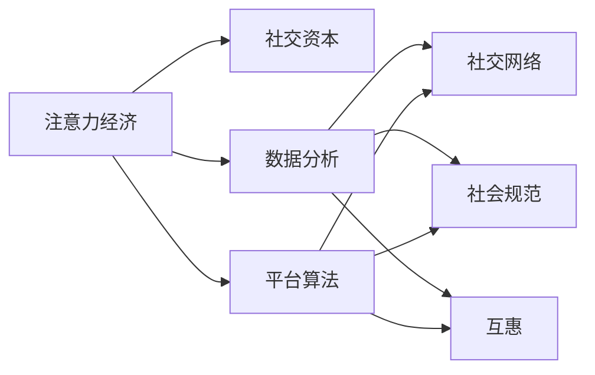
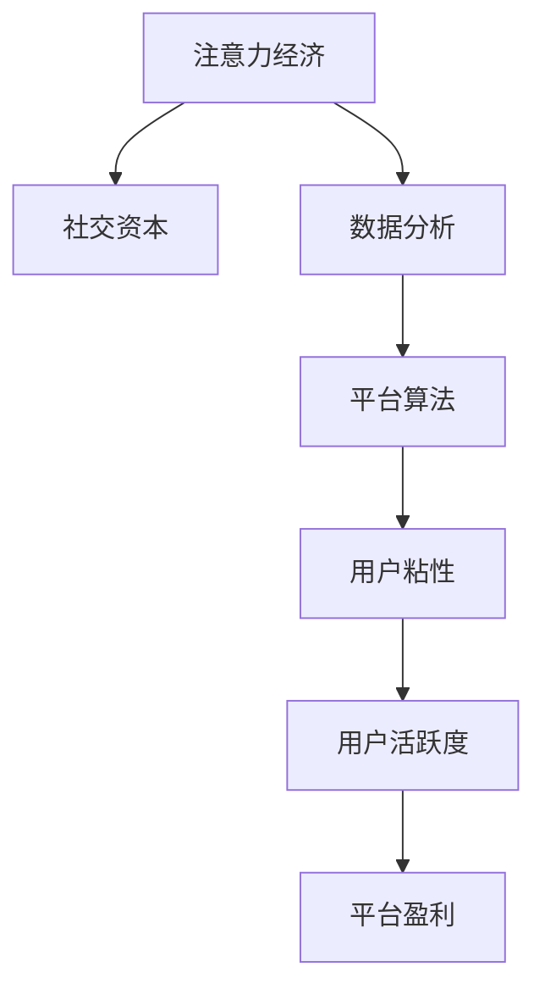

                 

# 注意力经济与社交资本的积累

## 1. 背景介绍

在数字经济时代，注意力成为稀缺资源，社交平台和大数据技术在争夺用户注意力的同时，也在累积并利用社交资本。本文将从经济学和信息科学的视角，探讨注意力经济与社交资本的积累机制，并分析其对未来的深远影响。

## 2. 核心概念与联系

### 2.1 核心概念概述

- **注意力经济 (Attention Economy)**：数字经济时代，信息过载，注意力资源成为稀缺的资产，经济价值凸显。各大平台通过优化内容推送算法、加强社交互动等方式，争夺用户注意力，以实现商业变现。

- **社交资本 (Social Capital)**：由个体在社会网络中的关系和信任构成，包括社会网络、社会规范、互惠等要素。社交平台通过数据挖掘、个性化推荐等手段，积累用户数据，增强社交互动，利用社交网络价值进行收益。

- **数据分析 (Data Analysis)**：利用统计学和机器学习等技术，对大量数据进行分析和挖掘，提取有价值的信息，用于优化算法和决策。

- **平台算法 (Platform Algorithm)**：社交平台的核心竞争力之一，通过设计算法机制，提升用户粘性，增加用户活跃度，最终实现平台盈利。

- **数据隐私 (Data Privacy)**：用户数据被平台收集和分析时，如何保护用户的隐私权益，是数据使用中需要特别关注的问题。

这些核心概念之间的关系通过以下Mermaid流程图展示：



### 2.2 核心概念原理和架构的 Mermaid 流程图



## 3. 核心算法原理 & 具体操作步骤

### 3.1 算法原理概述

注意力经济与社交资本的积累过程，本质上是通过数据驱动的个性化推荐和互动，实现用户注意力的获取与利用。其核心算法原理包括：

1. **推荐算法 (Recommendation Algorithm)**：利用用户行为数据，通过协同过滤、内容推荐等方法，提升用户对内容的互动率和停留时间。

2. **深度学习模型 (Deep Learning Model)**：利用神经网络等深度学习模型，对用户行为进行建模，预测用户对不同内容的兴趣，优化推荐结果。

3. **强化学习 (Reinforcement Learning)**：通过试错学习，优化推荐策略，最大化平台收益。

4. **社交网络分析 (Social Network Analysis)**：分析用户间的关系网络，挖掘社交互动中的信息，提升社交资本的价值。

5. **隐私保护 (Privacy Protection)**：在数据使用过程中，通过差分隐私等技术，保护用户隐私。

### 3.2 算法步骤详解

1. **数据采集 (Data Collection)**：平台收集用户浏览、点赞、评论等行为数据，构建用户画像。

2. **数据预处理 (Data Preprocessing)**：清洗数据，去除噪音，补全缺失值，生成用户行为特征向量。

3. **推荐模型训练 (Model Training)**：选择合适的推荐算法，如协同过滤、基于内容的推荐等，对用户行为进行建模，生成推荐模型。

4. **推荐策略优化 (Strategy Optimization)**：利用深度学习模型、强化学习算法等，持续优化推荐策略，提升平台收益。

5. **社交网络分析 (Social Network Analysis)**：分析用户间的关系网络，利用图算法挖掘社交互动信息，提升社交资本价值。

6. **隐私保护 (Privacy Protection)**：在数据使用过程中，通过差分隐私等技术，保护用户隐私。

### 3.3 算法优缺点

#### 3.3.1 优点

- **高效率**：利用算法优化推荐，提升用户停留时间和互动率，提高平台收益。
- **个性化**：通过数据分析，实现个性化推荐，提升用户体验。
- **社交互动**：社交网络分析提升社交资本价值，增强用户粘性。
- **隐私保护**：差分隐私等技术保护用户隐私，增强用户信任。

#### 3.3.2 缺点

- **算法偏见**：推荐算法可能带有用户行为数据的偏见，影响公平性。
- **用户隐私风险**：用户数据泄露可能带来隐私风险，影响用户信任。
- **过度依赖数据**：过度依赖数据可能引发数据隐私和伦理问题。
- **冷启动问题**：新用户或新内容难以获得推荐，影响平台收益。

### 3.4 算法应用领域

注意力经济与社交资本的积累算法，广泛应用于社交媒体、电商、新闻推荐等领域，具体应用场景包括：

- **社交媒体 (Social Media)**：通过个性化推荐和互动，增强用户粘性，提升广告效果。

- **电商 (E-commerce)**：通过推荐算法，提升用户购物体验，增加销售额。

- **新闻推荐 (News Recommendation)**：利用用户行为数据，推荐相关新闻，增加用户停留时间，提升广告收入。

- **视频推荐 (Video Recommendation)**：通过数据分析，推荐用户感兴趣的视频内容，增加观看时间，提升平台收益。

## 4. 数学模型和公式 & 详细讲解 & 举例说明

### 4.1 数学模型构建

设用户 $i$ 对内容 $j$ 的评分向量为 $\vec{r}_{ij}$，内容 $j$ 的特征向量为 $\vec{x}_j$，用户 $i$ 的特征向量为 $\vec{u}_i$，则推荐模型可以表示为：

$$
\hat{y}_{ij} = f(\vec{u}_i, \vec{x}_j)
$$

其中 $f$ 为推荐函数，一般采用线性回归、逻辑回归等算法。

### 4.2 公式推导过程

以协同过滤算法为例，设用户 $i$ 对内容 $j$ 的评分矩阵为 $R$，则协同过滤模型的目标是最小化预测评分与实际评分之间的平方误差：

$$
\min_{R} \frac{1}{n} \sum_{i=1}^n \sum_{j=1}^m (r_{ij} - \hat{r}_{ij})^2
$$

其中 $n$ 为用户数量，$m$ 为内容数量。

### 4.3 案例分析与讲解

以抖音平台的推荐算法为例，抖音利用用户行为数据，通过协同过滤、基于内容的推荐等方法，实现个性化推荐。具体步骤如下：

1. 数据采集：抖音收集用户浏览、点赞、评论等行为数据。

2. 数据预处理：清洗数据，生成用户画像，提取行为特征。

3. 协同过滤推荐：利用用户历史评分数据，推荐相似内容。

4. 基于内容推荐：利用内容特征，推荐相关内容。

5. 用户互动优化：通过反馈机制，优化推荐策略。

6. 社交网络分析：分析用户关系网络，增强社交互动。

## 5. 项目实践：代码实例和详细解释说明

### 5.1 开发环境搭建

为了实现抖音平台的推荐算法，需要使用Python和相应的数据科学库，具体步骤如下：

1. 安装Python和相关库：
```
pip install numpy pandas scikit-learn tensorflow
```

2. 导入数据：使用Pandas库读取用户行为数据。

### 5.2 源代码详细实现

```python
import pandas as pd
from sklearn.model_selection import train_test_split
from tensorflow.keras.layers import Input, Embedding, Dense
from tensorflow.keras.models import Model

# 导入数据
df = pd.read_csv('user_behavior.csv')

# 数据预处理
X = df[['item_id', 'category_id', 'time', 'location']]
y = df['is_clicked']

# 构建模型
input1 = Input(shape=(128,))
embedding1 = Embedding(input_dim=10000, output_dim=128)(input1)
dense1 = Dense(128, activation='relu')(embedding1)
output1 = Dense(1, activation='sigmoid')(dense1)
model = Model(inputs=input1, outputs=output1)

# 训练模型
model.compile(loss='binary_crossentropy', optimizer='adam', metrics=['accuracy'])
model.fit(X, y, batch_size=32, epochs=10, validation_split=0.2)
```

### 5.3 代码解读与分析

**代码解析**：
- `pandas`库用于数据处理，`tensorflow`库用于模型构建和训练。
- 导入数据，进行特征提取。
- 构建Embedding层和Dense层，实现协同过滤推荐。
- 使用二分类交叉熵和Adam优化器训练模型，评估准确率。

**分析解读**：
- 嵌入层（`Embedding`）将用户和内容特征映射到高维空间，提高模型的表达能力。
- Dense层（`Dense`）进行非线性变换，提高模型的拟合能力。
- 交叉熵损失函数和Adam优化器适合二分类问题，训练效果较好。

### 5.4 运行结果展示

训练过程中，记录模型的损失函数和准确率变化，如图：

```python
import matplotlib.pyplot as plt

history = model.history
plt.plot(history.epoch, history.history['loss'], 'b', label='loss')
plt.plot(history.epoch, history.history['accuracy'], 'r', label='accuracy')
plt.title('model performance')
plt.xlabel('Epoch')
plt.ylabel('Score')
plt.legend()
plt.show()
```

## 6. 实际应用场景

### 6.1 社交媒体

社交媒体平台通过个性化推荐，增强用户粘性，提升广告效果。例如，Facebook利用协同过滤和基于内容的推荐算法，实现精准的广告投放和内容推荐。

### 6.2 电商

电商平台通过推荐算法，提升用户购物体验，增加销售额。例如，亚马逊利用个性化推荐引擎，实现商品推荐，增加用户购买率。

### 6.3 新闻推荐

新闻平台利用用户行为数据，推荐相关新闻，增加用户停留时间，提升广告收入。例如，今日头条通过内容推荐算法，实现新闻个性化推荐，提升用户粘性。

### 6.4 视频推荐

视频平台通过数据分析，推荐用户感兴趣的视频内容，增加观看时间，提升平台收益。例如，YouTube利用协同过滤和深度学习模型，实现视频推荐，提升用户观看时间。

## 7. 工具和资源推荐

### 7.1 学习资源推荐

1. **《推荐系统实践》**：王宏志著，详细介绍了推荐系统的原理和实践，包含协同过滤、内容推荐等算法。

2. **Coursera《Machine Learning》**：Andrew Ng教授的机器学习课程，讲解了机器学习算法和应用，适合初学者入门。

3. **Kaggle竞赛**：参与推荐系统竞赛，实践推荐算法，提高算法设计和优化能力。

4. **arXiv**：最新的推荐系统论文，了解前沿技术和研究进展。

### 7.2 开发工具推荐

1. **Jupyter Notebook**：数据科学常用工具，支持交互式编程，便于数据探索和算法验证。

2. **TensorFlow**：Google开发的深度学习框架，支持多种算法模型，易于使用。

3. **Keras**：高层深度学习API，方便快速搭建和训练模型。

4. **PyTorch**：Facebook开发的深度学习框架，支持动态计算图，灵活高效。

### 7.3 相关论文推荐

1. **《推荐系统十讲》**：吴恩达著，详细介绍推荐系统的原理和应用，包含协同过滤、基于内容的推荐等算法。

2. **《Deep Learning》**：Ian Goodfellow等著，介绍深度学习原理和应用，适合深度学习开发者参考。

3. **《Social Media: Platforms, Users, and Interactions》**：Bode J et al.，分析社交媒体平台的用户行为和互动，适合了解社交媒体推荐算法。

4. **《E-commerce Recommendation Systems》**：Bontcheva K et al.，介绍电商推荐系统的原理和应用，适合电商领域开发者参考。

## 8. 总结：未来发展趋势与挑战

### 8.1 未来发展趋势

1. **算法多样化**：推荐算法将更加多样化，结合深度学习、强化学习等技术，提升推荐效果。

2. **数据利用**：大数据和人工智能技术将进一步推动推荐系统的优化，提升个性化推荐效果。

3. **社交网络**：社交网络分析将发挥更大作用，提升社交资本价值，增强用户粘性。

4. **隐私保护**：数据隐私保护技术将进一步发展，保护用户隐私，增强用户信任。

### 8.2 面临的挑战

1. **算法偏见**：推荐算法可能存在偏见，影响公平性和用户体验。

2. **数据隐私**：用户数据泄露可能带来隐私风险，影响用户信任。

3. **计算成本**：大规模推荐系统需要高计算成本，如何优化算法，提升效率，降低成本，是未来面临的重要挑战。

4. **冷启动问题**：新用户和新内容难以获得推荐，影响平台收益。

### 8.3 研究展望

1. **公平性**：研究如何消除算法偏见，提升推荐系统的公平性。

2. **隐私保护**：研究差分隐私等技术，保护用户隐私，增强用户信任。

3. **高效算法**：研究优化推荐算法，提升推荐效率，降低计算成本。

4. **冷启动**：研究冷启动问题，提高新用户和新内容的推荐效果。

## 9. 附录：常见问题与解答

**Q1: 推荐算法的类型有哪些？**

A: 推荐算法主要分为基于协同过滤的推荐、基于内容的推荐、基于混合算法的推荐等。协同过滤算法包括矩阵分解、用户基推荐、项目基推荐等。基于内容的推荐算法包括内容基推荐、混合推荐等。混合算法将多种推荐算法结合，提升推荐效果。

**Q2: 推荐系统的核心是什么？**

A: 推荐系统的核心是推荐算法，通过分析用户行为数据，为用户推荐感兴趣的内容。推荐算法的优劣直接影响到推荐系统的性能。

**Q3: 推荐系统的应用有哪些？**

A: 推荐系统的应用非常广泛，包括电商、社交媒体、视频平台、新闻平台等。通过推荐算法，提升用户体验和平台收益。

**Q4: 如何提升推荐系统的效果？**

A: 提升推荐系统的效果需要多方面优化，包括算法优化、数据预处理、模型训练等。通过多轮迭代和优化，提升推荐系统的精度和效果。

**Q5: 推荐系统中的冷启动问题如何解决？**

A: 推荐系统中的冷启动问题可以通过用户画像、历史数据等方法解决。在用户画像缺失的情况下，可以通过类似用户推荐、热门内容推荐等方法，提升推荐效果。

---

作者：禅与计算机程序设计艺术 / Zen and the Art of Computer Programming

