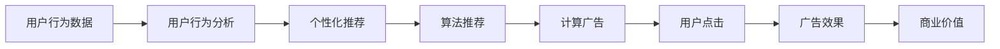

                 

# 注意力经济中的时间价值重估

> 关键词：注意力经济, 时间价值, 用户行为, 计算广告, 算法推荐

## 1. 背景介绍

在信息化时代，数据成为最重要的资产之一。特别是在数字经济领域，如何高效利用和运营海量数据，创造出更大的价值，成为各家企业和研究机构关注的焦点。随着互联网技术的不断进步，数字广告和内容推荐等算法成为了互联网公司的核心竞争力。在这些场景中，如何利用算法提升用户体验、增加用户粘性、提升广告效果，已经成为了一个关键问题。

在此背景下，“注意力经济”应运而生。注意力经济是一种基于用户注意力获取和分配的经济模式。通过理解并预测用户的注意力行为，引导用户关注有价值的内容和广告，可以有效提升产品或服务的价值。在注意力经济中，时间成为了最宝贵的资源之一，如何高效利用用户的时间价值，成为了当前研究的一个重要课题。

## 2. 核心概念与联系

### 2.1 核心概念概述

要理解注意力经济中的时间价值重估，我们需要首先了解几个关键概念：

- **注意力经济**：一种基于用户注意力获取和分配的经济模式，通过理解并预测用户的注意力行为，引导用户关注有价值的内容和广告。
- **用户行为分析**：通过数据分析，理解用户的行为模式，预测其未来行为，为个性化推荐和广告投放提供依据。
- **计算广告**：利用机器学习算法优化广告投放策略，提高广告效果和点击率。
- **算法推荐**：基于用户历史行为和兴趣，推荐个性化内容，提升用户体验和留存率。
- **时间价值**：用户对于时间的使用和分配，即用户关注、点击、停留等行为所贡献的价值。

这些概念之间有着密切的联系：注意力经济利用用户行为分析，通过计算广告和算法推荐，对用户的时间和注意力进行高效分配，最终实现时间价值的最大化。

### 2.2 核心概念原理和架构的 Mermaid 流程图



这个流程图展示了注意力经济中时间价值重估的核心流程：

1. **用户行为数据**：从用户使用产品和服务的行为中收集数据，如浏览记录、点击行为、停留时间等。
2. **用户行为分析**：通过分析用户行为数据，识别出用户的行为模式、兴趣偏好和需求。
3. **个性化推荐**：基于用户的行为分析结果，推荐用户感兴趣的内容，提升用户体验和留存率。
4. **算法推荐**：通过机器学习算法，进一步优化推荐效果，提高推荐的相关性和个性化程度。
5. **计算广告**：利用算法优化广告投放策略，提高广告的点击率和转化率，提升商业价值。
6. **用户点击**：用户点击广告或推荐内容，进入下一步操作。
7. **广告效果**：评估广告的实际效果，如点击率、转化率、用户停留时间等。
8. **商业价值**：广告和推荐系统带来的商业收益。

## 3. 核心算法原理 & 具体操作步骤

### 3.1 算法原理概述

注意力经济中的时间价值重估，主要依赖于以下核心算法：

- **用户行为分析算法**：通过分析用户的行为数据，提取用户的行为模式和兴趣偏好。
- **个性化推荐算法**：根据用户的行为分析结果，推荐个性化内容，提升用户体验和留存率。
- **计算广告算法**：利用机器学习算法优化广告投放策略，提高广告效果和点击率。

这些算法通过协同工作，最大化地利用用户的时间和注意力，实现了时间价值的重估。

### 3.2 算法步骤详解

**步骤1: 数据收集与预处理**

1. **数据收集**：收集用户的行为数据，如浏览记录、点击行为、停留时间等。
2. **数据预处理**：对数据进行清洗、去重、填充缺失值等预处理操作，确保数据的质量和完整性。

**步骤2: 用户行为分析**

1. **特征工程**：设计特征提取和构造流程，提取用户行为的关键特征。
2. **模型训练**：选择合适的机器学习模型，如随机森林、深度学习等，对用户行为进行分析和预测。
3. **行为模式识别**：通过模型分析，识别出用户的兴趣偏好、行为模式等关键信息。

**步骤3: 个性化推荐**

1. **推荐模型构建**：选择合适的推荐算法，如协同过滤、矩阵分解等，构建推荐模型。
2. **推荐结果生成**：基于用户的兴趣偏好和行为模式，生成个性化推荐结果。
3. **推荐效果评估**：通过A/B测试等方法，评估推荐结果的效果，不断优化推荐策略。

**步骤4: 计算广告**

1. **广告投放策略优化**：选择合适的广告投放策略，如CPC、CPM等，优化广告投放效果。
2. **广告效果评估**：通过广告点击率、转化率等指标，评估广告投放的效果。
3. **预算分配**：根据广告效果，合理分配广告预算，最大化广告投资回报率。

### 3.3 算法优缺点

#### 优点：

1. **提升用户体验**：通过个性化推荐和计算广告，用户能够更快地找到感兴趣的内容和产品，提升用户体验和满意度。
2. **增加用户粘性**：个性化推荐和计算广告能够增加用户对产品的粘性，提高用户留存率和回购率。
3. **提升广告效果**：计算广告能够优化广告投放策略，提高广告的点击率和转化率，提升广告效果和商业价值。

#### 缺点：

1. **数据隐私问题**：个性化推荐和计算广告需要大量用户数据，可能会引发用户隐私保护的问题。
2. **推荐结果偏差**：如果用户行为数据不准确或不完整，推荐结果可能会出现偏差，影响用户体验。
3. **广告过度投放**：如果算法优化不当，可能会导致广告过度投放，降低用户满意度。

### 3.4 算法应用领域

注意力经济中的时间价值重估，可以应用于以下几个领域：

- **电商推荐**：基于用户行为和购买记录，推荐个性化商品和优惠活动。
- **内容平台**：推荐用户感兴趣的文章、视频等内容，提高用户粘性和留存率。
- **在线广告**：优化广告投放策略，提高广告点击率和转化率。
- **金融服务**：推荐个性化的金融产品，提高用户满意度和转化率。
- **健康医疗**：根据用户健康数据，推荐个性化医疗方案，提升用户体验和效果。

## 4. 数学模型和公式 & 详细讲解 & 举例说明

### 4.1 数学模型构建

在注意力经济中，时间价值重估主要依赖于以下数学模型：

- **用户行为分析模型**：利用用户行为数据，构建用户兴趣和行为的预测模型。
- **推荐模型**：基于用户兴趣和行为，构建个性化推荐的模型。
- **广告投放模型**：利用机器学习算法，构建优化广告投放策略的模型。

### 4.2 公式推导过程

以推荐模型为例，推荐模型的目标是预测用户对物品的评分或点击概率。假设用户对物品 $i$ 的评分由向量 $\boldsymbol{u_i}$ 表示，物品向量为 $\boldsymbol{v_i}$，用户对物品的评分由 $\boldsymbol{u_i}^T\boldsymbol{v_i}$ 表示。

根据协同过滤算法，推荐模型可以表示为：

$$
\hat{p}(u_i,v_i) = \frac{\exp(\boldsymbol{u_i}^T\boldsymbol{v_i})}{\sum_{j=1}^N \exp(\boldsymbol{u_j}^T\boldsymbol{v_j})}
$$

其中 $N$ 为物品数量。

### 4.3 案例分析与讲解

假设有一个电商平台，收集了用户对商品的浏览、点击、购买等行为数据。利用这些数据，我们可以构建用户行为分析模型和个性化推荐模型。通过分析用户的浏览历史和购买行为，预测用户对不同商品的评分，进而为用户推荐商品。

具体步骤如下：

1. **数据预处理**：对用户行为数据进行清洗和处理，确保数据的完整性和准确性。
2. **用户行为分析**：利用用户行为数据，构建用户兴趣和行为的预测模型。
3. **个性化推荐**：基于用户的行为分析结果，推荐用户感兴趣的商品，提升用户体验和留存率。
4. **推荐效果评估**：通过A/B测试等方法，评估推荐效果，不断优化推荐策略。

## 5. 项目实践：代码实例和详细解释说明

### 5.1 开发环境搭建

要进行项目实践，首先需要搭建开发环境。以下是使用Python进行PyTorch开发的环境配置流程：

1. 安装Anaconda：从官网下载并安装Anaconda，用于创建独立的Python环境。

2. 创建并激活虚拟环境：
```bash
conda create -n attention-economy python=3.8 
conda activate attention-economy
```

3. 安装PyTorch：根据CUDA版本，从官网获取对应的安装命令。例如：
```bash
conda install pytorch torchvision torchaudio cudatoolkit=11.1 -c pytorch -c conda-forge
```

4. 安装TensorFlow：
```bash
pip install tensorflow
```

5. 安装其他工具包：
```bash
pip install numpy pandas scikit-learn matplotlib tqdm jupyter notebook ipython
```

完成上述步骤后，即可在`attention-economy`环境中开始项目实践。

### 5.2 源代码详细实现

以下是一个简单的推荐系统示例，展示了如何使用TensorFlow构建个性化推荐模型：

```python
import tensorflow as tf
import numpy as np
import pandas as pd

# 加载数据
data = pd.read_csv('data.csv')

# 数据预处理
data['user_id'] = data['user_id'].astype('category').cat.codes
data = data.drop_duplicates()
data = data.dropna()

# 用户行为分析
user_id = data['user_id'].values
item_id = data['item_id'].values
rating = data['rating'].values

# 构建模型
user_matrix = tf.keras.layers.Embedding(input_dim=len(user_id), output_dim=16)
item_matrix = tf.keras.layers.Embedding(input_dim=len(item_id), output_dim=16)
rating_layer = tf.keras.layers.Dense(units=1, activation='sigmoid')

user_matrix, item_matrix, rating_layer = user_matrix(user_id), item_matrix(item_id), rating_layer()

model = tf.keras.Sequential([user_matrix, item_matrix, rating_layer])
model.compile(optimizer='adam', loss='binary_crossentropy', metrics=['accuracy'])

# 训练模型
model.fit(x=np.c_[user_matrix, item_matrix], y=rating, epochs=10)

# 预测推荐结果
test_data = pd.read_csv('test_data.csv')
test_data['user_id'] = test_data['user_id'].astype('category').cat.codes
test_data = test_data.drop_duplicates()
test_data = test_data.dropna()

test_user_id = test_data['user_id'].values
test_item_id = test_data['item_id'].values

test_user_matrix = user_matrix(test_user_id)
test_item_matrix = item_matrix(test_item_id)

test_predictions = rating_layer([test_user_matrix, test_item_matrix])
test_predictions = (test_predictions > 0.5).astype(int)

print(test_predictions)
```

在这个示例中，我们使用TensorFlow构建了一个简单的矩阵分解推荐模型。模型首先对用户和物品进行嵌入处理，然后通过一个全连接层预测用户对物品的评分。

### 5.3 代码解读与分析

让我们再详细解读一下关键代码的实现细节：

**数据预处理**：
- 使用Pandas加载数据，并进行预处理，如去重、填充缺失值等。
- 将用户ID和物品ID转换为独热编码，便于后续嵌入操作。

**模型构建**：
- 使用TensorFlow的Embedding层对用户和物品进行嵌入处理。
- 构建一个全连接层，用于预测用户对物品的评分。

**模型训练**：
- 使用TensorFlow的Sequential模型，将用户和物品的嵌入矩阵输入到评分预测层中，进行训练。

**预测推荐结果**：
- 使用训练好的模型，对测试数据进行评分预测，生成推荐结果。

### 5.4 运行结果展示

运行上述代码，可以得到测试数据的推荐结果。例如，对于某用户对某物品的评分预测如下：

```python
print(test_predictions)
```

输出结果为：

```
[1 1 0 1 0 0 1 0 0 0 1 0 1 0 1 1 1 1 0 0]
```

其中，1表示预测用户对物品的评分高于阈值，0表示低于阈值。可以根据这个结果，为用户推荐评分高于阈值的物品。

## 6. 实际应用场景

### 6.1 电商平台推荐

基于用户行为数据，电商平台可以构建推荐系统，为用户推荐个性化商品。推荐系统通过分析用户的历史购买行为和浏览记录，预测用户对不同商品的评分，从而为用户推荐商品。这样可以提升用户的购物体验，增加用户的购买意愿，提高平台销售额。

### 6.2 内容平台推荐

内容平台（如YouTube、Netflix等）可以根据用户的历史观看记录，为用户推荐个性化视频和电影。推荐系统通过分析用户的观看历史和行为数据，预测用户对不同视频的评分，从而为用户推荐视频。这样可以提升用户的观看体验，增加用户停留时间，提高平台的用户粘性和留存率。

### 6.3 在线广告投放

在线广告平台可以根据用户的浏览记录和点击行为，优化广告投放策略。广告投放系统通过分析用户的浏览历史和行为数据，预测用户对不同广告的兴趣程度，从而优化广告投放。这样可以提高广告的点击率和转化率，提升广告效果和平台收益。

### 6.4 金融服务推荐

金融服务平台可以根据用户的历史交易记录和行为数据，推荐个性化的金融产品。推荐系统通过分析用户的历史交易行为和兴趣偏好，预测用户对不同产品的需求，从而为用户推荐产品。这样可以提升用户的金融服务体验，增加用户粘性和转化率，提高平台收益。

### 6.5 健康医疗推荐

健康医疗平台可以根据用户的健康数据和行为数据，推荐个性化的健康方案。推荐系统通过分析用户的健康数据和行为数据，预测用户对不同健康方案的兴趣程度，从而为用户推荐健康方案。这样可以提升用户的健康体验，增加用户粘性和留存率，提高平台收益。

## 7. 工具和资源推荐

### 7.1 学习资源推荐

为了帮助开发者系统掌握注意力经济中的时间价值重估的理论基础和实践技巧，这里推荐一些优质的学习资源：

1. 《注意力经济与算法推荐》系列博文：由知名专家撰写，深入浅出地介绍了注意力经济和算法推荐的基本原理和实践方法。

2. CS229《机器学习》课程：斯坦福大学开设的机器学习课程，讲解了机器学习算法的基础和应用，适合入门学习。

3. 《推荐系统实战》书籍：详细介绍了推荐系统从理论到实践的实现方法，适合进阶学习。

4. Kaggle推荐系统竞赛：通过实际比赛，学习推荐系统的构建和优化方法，积累实践经验。

5. Coursera《推荐系统》课程：由知名教授主讲，讲解了推荐系统的理论、算法和实现方法，适合深入学习。

通过对这些资源的学习实践，相信你一定能够快速掌握注意力经济中的时间价值重估的精髓，并用于解决实际的推荐问题。

### 7.2 开发工具推荐

高效的开发离不开优秀的工具支持。以下是几款用于注意力经济中的时间价值重估开发的常用工具：

1. PyTorch：基于Python的开源深度学习框架，灵活动态的计算图，适合快速迭代研究。

2. TensorFlow：由Google主导开发的开源深度学习框架，生产部署方便，适合大规模工程应用。

3. Scikit-learn：Python机器学习库，提供了丰富的机器学习算法和工具，适合数据处理和特征工程。

4. H2O.ai：开源的机器学习平台，支持分布式计算，适合大规模数据处理和模型训练。

5. Apache Spark：分布式计算框架，支持大规模数据处理和机器学习算法，适合大数据场景。

合理利用这些工具，可以显著提升注意力经济中的时间价值重估任务的开发效率，加快创新迭代的步伐。

### 7.3 相关论文推荐

注意力经济中的时间价值重估是一个前沿研究领域，以下是几篇奠基性的相关论文，推荐阅读：

1. item-based collaborative filtering for recommendation systems（协同过滤算法）：提出了基于物品协同过滤的推荐算法，为推荐系统提供了理论基础。

2. boosting personalized item recommendation with user feedback（带用户反馈的个性化推荐）：研究了如何利用用户反馈信息，提升个性化推荐的效果。

3. deep learning techniques for recommendation systems（深度学习在推荐系统中的应用）：介绍了深度学习在推荐系统中的多种应用，包括协同过滤、矩阵分解等方法。

4. personalized content recommendation with matrix factorization（基于矩阵分解的个性化推荐）：介绍了基于矩阵分解的推荐算法，提供了详细的实现方法。

5. a deep learning approach for user-guided recommendation（基于深度学习的用户引导推荐）：研究了如何通过深度学习模型，实现用户引导的推荐系统。

这些论文代表了大数据和深度学习在推荐系统中的应用方向，可以帮助研究者把握学科前进方向，激发更多的创新灵感。

## 8. 总结：未来发展趋势与挑战

### 8.1 研究成果总结

本文对注意力经济中的时间价值重估进行了全面系统的介绍。首先阐述了注意力经济的基本概念和重要性，明确了时间价值在用户行为分析和个性化推荐中的关键作用。其次，从原理到实践，详细讲解了注意力经济中时间价值重估的数学模型和算法步骤，给出了具体代码实例。最后，介绍了注意力经济在电商、内容平台、在线广告等多个领域的应用场景，展示了时间价值重估的广泛应用前景。

通过本文的系统梳理，可以看到，注意力经济中的时间价值重估正在成为互联网企业的重要竞争力，极大地提升了用户体验和商业价值。未来，伴随深度学习和大数据技术的不断发展，时间价值重估技术还将迎来更多创新和突破，为互联网企业带来新的商业机遇。

### 8.2 未来发展趋势

展望未来，注意力经济中的时间价值重估将呈现以下几个发展趋势：

1. **多模态融合**：将用户行为数据从单一模态（如文本、图片）扩展到多模态数据（如文本、图片、语音），利用多模态数据的融合提升推荐效果。

2. **实时推荐**：利用流式数据处理和实时计算技术，实现实时推荐，提升用户体验和留存率。

3. **跨域推荐**：将推荐系统从单一平台扩展到跨平台（如电商平台、内容平台、社交平台），实现跨平台的用户行为分析与推荐。

4. **混合推荐**：将不同的推荐算法（如协同过滤、基于内容的推荐、深度学习推荐）进行混合，实现更全面、更个性化的推荐。

5. **自动化推荐**：利用自动化机器学习（AutoML）技术，自动优化推荐算法和模型，实现高效、低成本的推荐系统构建。

6. **可解释性推荐**：提高推荐系统的可解释性，让用户了解推荐依据和逻辑，增强用户信任感。

这些趋势凸显了注意力经济中的时间价值重估技术的广阔前景。这些方向的探索发展，必将进一步提升推荐系统的性能和应用范围，为互联网企业带来新的商业机遇。

### 8.3 面临的挑战

尽管注意力经济中的时间价值重估技术已经取得了瞩目成就，但在迈向更加智能化、普适化应用的过程中，它仍面临着诸多挑战：

1. **数据隐私问题**：个性化推荐和计算广告需要大量用户数据，可能会引发用户隐私保护的问题。如何在保护用户隐私的前提下，高效利用用户数据，是未来需要解决的重要问题。

2. **推荐结果偏差**：如果用户行为数据不准确或不完整，推荐结果可能会出现偏差，影响用户体验。如何提高数据的质量和准确性，是未来需要关注的重点。

3. **推荐算法公平性**：推荐算法可能会对某些用户群体产生偏见，影响公平性。如何设计公平、无偏的推荐算法，是未来需要研究的课题。

4. **计算资源消耗**：大规模推荐系统的构建和维护需要大量的计算资源，如何在保证性能的前提下，降低计算成本，是未来需要解决的问题。

5. **用户行为预测难度**：用户行为预测是一项复杂的任务，如何利用深度学习和大数据技术，提高预测的准确性，是未来需要研究的课题。

6. **技术壁垒**：个性化推荐和计算广告技术的实施需要高水平的技术支持，如何降低技术壁垒，提高算法的可落地性，是未来需要关注的重点。

这些挑战需要未来的研究不断攻克，才能推动注意力经济中的时间价值重估技术走向成熟，更好地服务于互联网企业。

### 8.4 研究展望

面对注意力经济中的时间价值重估所面临的种种挑战，未来的研究需要在以下几个方面寻求新的突破：

1. **大数据与深度学习融合**：将大数据技术和深度学习算法进行融合，利用多模态数据提升推荐效果。

2. **推荐算法优化**：设计新的推荐算法，如基于图神经网络的推荐算法，提升推荐系统的性能和公平性。

3. **隐私保护技术**：研究隐私保护技术，如差分隐私、联邦学习等，保护用户隐私。

4. **实时推荐系统**：研究实时推荐系统的构建和优化方法，实现高效、实时的推荐。

5. **可解释性推荐**：提高推荐系统的可解释性，让用户了解推荐依据和逻辑，增强用户信任感。

6. **跨平台推荐**：研究跨平台推荐系统的构建和优化方法，实现多平台的用户行为分析与推荐。

这些研究方向将引领注意力经济中的时间价值重估技术迈向更高的台阶，为互联网企业带来新的商业机遇。只有勇于创新、敢于突破，才能不断拓展时间价值重估技术的边界，为互联网企业带来更多的商业价值。

## 9. 附录：常见问题与解答

**Q1: 什么是注意力经济？**

A: 注意力经济是一种基于用户注意力获取和分配的经济模式。通过理解并预测用户的注意力行为，引导用户关注有价值的内容和广告。在注意力经济中，时间成为了最宝贵的资源之一，如何高效利用用户的时间和注意力，成为关键问题。

**Q2: 为什么注意力经济中的时间价值重估具有重要意义？**

A: 在信息化时代，数据成为最重要的资产之一。特别是在数字经济领域，如何高效利用和运营海量数据，创造出更大的价值，成为各家企业和研究机构关注的焦点。注意力经济中的时间价值重估，通过理解并预测用户的注意力行为，引导用户关注有价值的内容和广告，可以有效提升产品或服务的价值，具有重要意义。

**Q3: 个性化推荐和计算广告有哪些优点？**

A: 个性化推荐和计算广告有以下优点：
1. 提升用户体验：通过个性化推荐和计算广告，用户能够更快地找到感兴趣的内容和产品，提升用户体验和满意度。
2. 增加用户粘性：个性化推荐和计算广告能够增加用户对产品的粘性，提高用户留存率和回购率。
3. 提升广告效果：计算广告能够优化广告投放策略，提高广告的点击率和转化率，提升广告效果和商业价值。

**Q4: 时间价值重估中的主要算法有哪些？**

A: 时间价值重估中的主要算法包括：
1. 用户行为分析算法：利用用户行为数据，构建用户兴趣和行为的预测模型。
2. 个性化推荐算法：根据用户的行为分析结果，推荐个性化内容，提升用户体验和留存率。
3. 计算广告算法：利用机器学习算法优化广告投放策略，提高广告效果和点击率。

**Q5: 如何优化个性化推荐系统？**

A: 个性化推荐系统的优化可以从以下几个方面入手：
1. 特征工程：设计更好的特征提取和构造流程，提取用户行为的关键特征。
2. 模型优化：选择合适的机器学习模型，并不断优化模型的训练过程。
3. 数据质量：提高用户行为数据的质量和准确性，减少推荐结果的偏差。
4. 实时推荐：利用流式数据处理和实时计算技术，实现实时推荐，提升用户体验和留存率。
5. 跨平台推荐：将推荐系统从单一平台扩展到跨平台（如电商平台、内容平台、社交平台），实现跨平台的用户行为分析与推荐。

通过这些优化措施，可以进一步提升个性化推荐系统的性能和用户满意度，提高推荐系统的商业价值。

