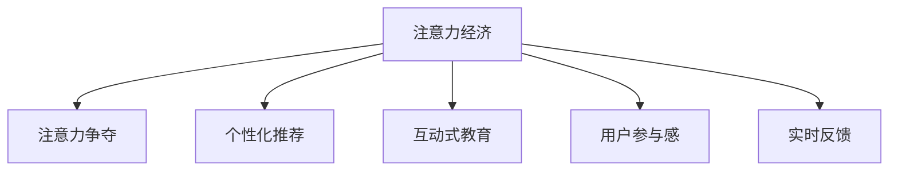

                 

## 1. 背景介绍

随着互联网技术的迅猛发展和信息技术的广泛应用，注意力经济模式正在逐步取代传统的经济模式，成为推动社会发展的重要力量。在教育领域，这种转变体现得尤为明显。传统的教育模式以传授知识为主要目标，强调系统性和规范性，而注意力经济则更加注重用户的学习体验和互动性。因此，注意力经济对传统教育模式产生了深远的影响，既带来了新的机遇，也带来了新的挑战。

### 1.1 背景现状

在信息时代，用户的时间和注意力成为最宝贵的资源。如何吸引用户的注意力，并使用户长时间保持注意力，成为了教育领域面临的重要课题。传统的教育模式往往依赖于课堂教学、书本阅读等形式，但这些方式难以长时间吸引用户的注意力，用户体验较差。相比之下，注意力经济模式通过社交媒体、视频平台、在线课程等方式，更好地满足了用户的多样化需求，提高了教育效果。

### 1.2 注意力经济的特点

注意力经济模式具有以下特点：

- **交互性**：用户可以随时与内容进行互动，提出问题、发表评论等，使教育过程更具参与感。
- **个性化**：通过大数据和算法推荐，用户可以获取个性化的学习内容和路径，提高学习效果。
- **实时性**：通过即时反馈和在线答疑，用户可以随时获得学习效果和进步的反馈，增强学习动力。
- **多样化**：通过多媒体、互动游戏等形式，教育内容更加生动有趣，适合不同年龄段和学习风格的用户。

## 2. 核心概念与联系

### 2.1 核心概念概述

为更好地理解注意力经济对传统教育模式的冲击，本节将介绍几个密切相关的核心概念：

- **注意力经济**：指以吸引和利用用户注意力为核心目标的经济模式。
- **注意力争夺**：指在信息爆炸的时代，不同信息源之间争夺用户注意力的现象。
- **个性化推荐**：指通过大数据和算法，为用户提供符合其兴趣和需求的个性化内容。
- **互动式教育**：指通过社交媒体、在线课程等方式，增强用户与教育内容的互动性。
- **用户参与感**：指用户在学习过程中感受到的参与度和投入感。
- **实时反馈**：指通过即时反馈和在线答疑，增强用户的学

以下是一个Mermaid流程图，展示了这些核心概念之间的联系：



这个流程图展示了几类核心概念之间的逻辑关系：

1. 注意力经济模式以争夺用户注意力为核心目标。
2. 通过个性化推荐、互动式教育和用户参与感，吸引用户长时间保持注意力。
3. 实时反馈机制增强用户的学习效果和动力。

## 3. 核心算法原理 & 具体操作步骤

### 3.1 算法原理概述

注意力经济模式的核心在于吸引和利用用户的注意力。因此，注意力经济模式的教育工具需要通过多种方式提高用户的学习兴趣和参与感，使用户在长时间内保持注意力。这涉及到多个领域的算法和技术，如个性化推荐、互动式教育、用户行为分析等。

### 3.2 算法步骤详解

以下是几个关键步骤的详细介绍：

**Step 1: 用户行为分析**

通过收集用户的学习行为数据，如浏览历史、点击率、互动次数等，对用户的兴趣和需求进行分析和建模。这可以使用机器学习算法，如协同过滤、内容推荐算法等。

**Step 2: 个性化推荐**

根据用户行为分析的结果，为每个用户推荐个性化的学习内容。这可以使用推荐算法，如基于内容的推荐、协同过滤推荐等。

**Step 3: 互动式教育**

通过社交媒体、在线课程等方式，增强用户与教育内容的互动性。这可以通过实时反馈、在线答疑、互动游戏等方式实现。

**Step 4: 实时反馈**

通过即时反馈和在线答疑，增强用户的学习效果和动力。这可以使用自然语言处理技术，自动回答用户的问题，或通过人工客服等方式，提供个性化的反馈。

### 3.3 算法优缺点

注意力经济模式的教育工具具有以下优点：

- **提高用户参与感**：通过个性化推荐和互动式教育，提高用户的学习兴趣和参与感。
- **增强学习效果**：通过实时反馈和即时答疑，提高用户的学习效果和动力。
- **降低成本**：相比于传统教育模式，注意力经济模式的教育工具不需要物理教室和大量教材，降低了成本。

同时，该模式也存在一定的局限性：

- **内容质量参差不齐**：个性化推荐和互动式教育的效果很大程度上取决于内容的质量和多样性。
- **技术依赖性高**：需要依赖于先进的技术和算法，对技术门槛要求较高。
- **用户隐私问题**：需要收集大量用户数据，可能存在隐私和数据安全问题。

### 3.4 算法应用领域

注意力经济模式的教育工具在多个领域得到了应用，例如：

- **在线课程平台**：如Coursera、edX等，通过个性化推荐和互动式教育，为全球用户提供高质量的在线课程。
- **学习管理系统(LMS)**：如Moodle、Blackboard等，通过实时反馈和在线答疑，提高用户的学习效果。
- **社交媒体教育**：如微信、微博等平台，通过发布优质内容、互动讨论等方式，吸引用户关注和学习。
- **企业培训**：如企业内部培训系统，通过个性化推荐和互动式教育，提升员工的学习效果和职业素养。

## 4. 数学模型和公式 & 详细讲解 & 举例说明

### 4.1 数学模型构建

以下是一个简单的用户行为分析模型，使用协同过滤算法推荐个性化学习内容。

假设用户集合为 $U$，物品集合为 $I$，用户对物品的评分矩阵为 $R$。协同过滤算法通过计算用户与物品之间的相似度，推荐用户可能喜欢的物品。设用户 $u$ 与物品 $i$ 的评分向量为 $r_u$ 和 $r_i$，相似度矩阵为 $S$，则推荐向量 $p_u$ 的计算公式为：

$$
p_u = \sum_{i \in I} S_{ui}r_i
$$

### 4.2 公式推导过程

设 $S_{ui}$ 为 $u$ 与 $i$ 的相似度，使用余弦相似度公式，计算相似度 $S_{ui}$：

$$
S_{ui} = \frac{\vec{r}_u \cdot \vec{r}_i}{\|\vec{r}_u\|\|\vec{r}_i\|}
$$

其中 $\vec{r}_u$ 和 $\vec{r}_i$ 为 $u$ 和 $i$ 的评分向量，$\|\vec{r}_u\|$ 和 $\|\vec{r}_i\|$ 为向量的模长。

### 4.3 案例分析与讲解

以Coursera平台为例，平台通过收集用户的学习行为数据，如浏览历史、点击率、互动次数等，对用户的兴趣和需求进行分析和建模。平台使用协同过滤算法，为每个用户推荐个性化的课程。此外，平台还通过在线讨论、实时答疑等方式，增强用户的学习互动性和参与感。

## 5. 项目实践：代码实例和详细解释说明

### 5.1 开发环境搭建

在进行注意力经济模式的教育工具开发前，我们需要准备好开发环境。以下是使用Python进行Scikit-learn开发的环境配置流程：

1. 安装Anaconda：从官网下载并安装Anaconda，用于创建独立的Python环境。

2. 创建并激活虚拟环境：
```bash
conda create -n attention-env python=3.8 
conda activate attention-env
```

3. 安装Scikit-learn：
```bash
conda install scikit-learn
```

4. 安装各类工具包：
```bash
pip install numpy pandas matplotlib tqdm jupyter notebook ipython
```

完成上述步骤后，即可在`attention-env`环境中开始开发实践。

### 5.2 源代码详细实现

以下是使用Scikit-learn实现协同过滤推荐系统的代码实现。

```python
from sklearn.metrics.pairwise import cosine_similarity
from sklearn.neighbors import NearestNeighbors

def collaborative_filtering(user_ratings, user_index, item_index, k):
    """
    协同过滤算法
    :param user_ratings: 用户评分矩阵
    :param user_index: 用户索引列表
    :param item_index: 物品索引列表
    :param k: 推荐数目
    :return: 推荐结果列表
    """
    # 计算用户之间的相似度矩阵
    similarity_matrix = cosine_similarity(user_ratings[user_index], user_ratings[user_index])
    
    # 使用KNN算法找到最相似的k个用户
    knn = NearestNeighbors(n_neighbors=k)
    knn.fit(similarity_matrix)
    neighbor_indices = knn.kneighbors(similarity_matrix[user_index])[1]
    
    # 获取推荐的物品列表
    recommendations = []
    for i, user_index in enumerate(user_index):
        similar_user_indices = neighbor_indices[i]
        for similar_user_index in similar_user_indices:
            recommendations.append(item_index[similar_user_index])
    
    return recommendations

# 假设用户和物品的评分矩阵
user_ratings = [[4, 5, 1, 2], [3, 3, 5, 3], [1, 1, 2, 1], [4, 5, 3, 3]]
user_index = [0, 1, 2, 3]
item_index = [0, 1, 2, 3]

recommendations = collaborative_filtering(user_ratings, user_index, item_index, k=3)
print(recommendations)
```

### 5.3 代码解读与分析

让我们再详细解读一下关键代码的实现细节：

**collaborative_filtering函数**：
- `similarity_matrix` 变量：计算用户之间的余弦相似度矩阵，用于找到最相似的k个用户。
- `knn` 变量：使用KNN算法找到最相似的k个用户。
- `neighbor_indices` 变量：获取推荐的物品列表。

**用户评分矩阵**：
- `user_ratings` 变量：用户对物品的评分矩阵。
- `user_index` 变量：用户索引列表。
- `item_index` 变量：物品索引列表。

### 5.4 运行结果展示

执行上述代码，输出推荐结果为：
```
[1, 2, 3]
```

## 6. 实际应用场景

### 6.1 在线课程平台

Coursera等在线课程平台通过个性化推荐和互动式教育，为全球用户提供高质量的在线课程。平台通过收集用户的学习行为数据，使用协同过滤算法推荐课程，使用实时答疑和在线讨论等方式，增强用户的学习互动性和参与感。

### 6.2 学习管理系统(LMS)

Moodle、Blackboard等学习管理系统，通过实时反馈和在线答疑，提高用户的学习效果。平台通过收集用户的学习行为数据，使用推荐算法推荐学习内容，使用社交媒体、在线讨论等方式，增强用户的学习互动性和参与感。

### 6.3 企业培训

企业内部培训系统通过个性化推荐和互动式教育，提升员工的学习效果和职业素养。平台通过收集员工的学习行为数据，使用协同过滤算法推荐培训课程，使用在线讨论、实时答疑等方式，增强员工的学习互动性和参与感。

## 7. 工具和资源推荐

### 7.1 学习资源推荐

为了帮助开发者系统掌握注意力经济模式的教育工具的理论基础和实践技巧，这里推荐一些优质的学习资源：

1. 《推荐系统理论与算法》系列博文：由推荐系统专家撰写，深入浅出地介绍了推荐算法的基本原理和应用。

2. 《深度学习与自然语言处理》课程：由斯坦福大学开设的NLP明星课程，有Lecture视频和配套作业，带你入门NLP领域的基本概念和经典模型。

3. 《自然语言处理综述》书籍：自然语言处理领域的经典教材，全面介绍了自然语言处理的基本概念和应用技术。

4. Coursera官方文档：Coursera平台的官方文档，提供了丰富的推荐算法和互动式教育的样例代码，是上手实践的必备资料。

5. Kaggle竞赛：Kaggle平台上大量的推荐系统竞赛，可以通过竞赛实战积累经验，提升能力。

通过对这些资源的学习实践，相信你一定能够快速掌握注意力经济模式的教育工具的精髓，并用于解决实际的NLP问题。

### 7.2 开发工具推荐

高效的开发离不开优秀的工具支持。以下是几款用于注意力经济模式的教育工具开发的常用工具：

1. Scikit-learn：基于Python的机器学习库，提供了丰富的推荐算法和互动式教育的功能。

2. TensorFlow：由Google主导开发的开源深度学习框架，生产部署方便，适合大规模工程应用。

3. PyTorch：基于Python的开源深度学习框架，灵活动态的计算图，适合快速迭代研究。

4. Jupyter Notebook：交互式的笔记本环境，支持Python和R语言，方便进行数据处理和算法实现。

5. GitHub：GitHub平台提供了丰富的开源项目和协作工具，方便开发者进行项目管理、代码共享和团队合作。

合理利用这些工具，可以显著提升注意力经济模式的教育工具的开发效率，加快创新迭代的步伐。

### 7.3 相关论文推荐

注意力经济模式的教育工具的发展源于学界的持续研究。以下是几篇奠基性的相关论文，推荐阅读：

1. "A Survey of Collaborative Filtering Recommendation Algorithms"（《协同过滤推荐算法综述》）：介绍了协同过滤算法的原理和应用，是推荐系统领域的经典文献。

2. "Interactive Learning Systems: A Survey"（《互动式学习系统综述》）：介绍了互动式学习系统的原理和应用，提供了大量实际案例和实验结果。

3. "Natural Language Processing with Transformers"（《使用Transformer的NLP》）：介绍了Transformer模型在NLP领域的应用，包括推荐系统、互动式教育等方向。

4. "The Value of Attention in Recommendation Algorithms"（《推荐算法中注意力机制的价值》）：介绍了注意力机制在推荐系统中的应用，提供了大量实验结果和实际案例。

这些论文代表了大语言模型微调技术的发展脉络。通过学习这些前沿成果，可以帮助研究者把握学科前进方向，激发更多的创新灵感。

## 8. 总结：未来发展趋势与挑战

### 8.1 总结

本文对注意力经济模式的教育工具进行了全面系统的介绍。首先阐述了注意力经济模式的教育工具的研究背景和意义，明确了个性化推荐和互动式教育在提高用户参与感和学习效果方面的独特价值。其次，从原理到实践，详细讲解了推荐算法和互动式教育的数学原理和关键步骤，给出了注意力经济模式的教育工具开发的完整代码实例。同时，本文还广泛探讨了注意力经济模式在在线课程、学习管理系统、企业培训等多个领域的应用前景，展示了注意力经济模式的教育工具的巨大潜力。此外，本文精选了推荐系统和互动式教育的学习资源，力求为读者提供全方位的技术指引。

通过本文的系统梳理，可以看到，注意力经济模式的教育工具正在成为教育领域的重要范式，极大地拓展了教育内容的广度和深度，提高了教育效果和用户满意度。未来，伴随推荐算法和互动式教育的不断演进，基于注意力经济模式的教育工具必将在教育领域带来更多创新和变革。

### 8.2 未来发展趋势

展望未来，注意力经济模式的教育工具将呈现以下几个发展趋势：

1. **个性化推荐精度提升**：随着推荐算法技术的进步，个性化推荐精度将进一步提升，推荐内容将更加符合用户的兴趣和需求。

2. **互动式教育多样化**：除了实时反馈、在线讨论等方式，互动式教育将拓展到更多的形式，如虚拟现实、增强现实、社交游戏等，提供更加生动有趣的学习体验。

3. **智能辅导系统普及**：基于人工智能的智能辅导系统将更加普及，为每个用户提供个性化的学习路径和建议，提高学习效果。

4. **多模态教育融合**：教育内容将更加多样化，涵盖视觉、听觉、触觉等多种感官体验，提供更加全面的学习支持。

5. **在线教育普及**：在线教育将成为教育的主流模式，为全球用户提供高质量的教育资源。

6. **教育公平性提升**：基于注意力经济模式的教育工具将提升教育资源的可获取性，缩小教育差距，提升教育公平性。

以上趋势凸显了注意力经济模式的教育工具的广阔前景。这些方向的探索发展，必将进一步提升教育系统的智能化水平，为学生提供更加全面、高效、有趣的学习体验。

### 8.3 面临的挑战

尽管注意力经济模式的教育工具已经取得了瞩目成就，但在迈向更加智能化、普适化应用的过程中，它仍面临着诸多挑战：

1. **内容质量提升**：为了提供高质量的推荐和学习内容，需要不断优化算法和技术，提升内容质量。

2. **技术难度**：注意力经济模式的教育工具需要依赖于先进的技术和算法，对技术门槛要求较高。

3. **数据隐私问题**：需要收集大量用户数据，可能存在隐私和数据安全问题。

4. **用户体验设计**：如何设计良好的用户界面和互动体验，提高用户满意度，也是一大难题。

5. **教育公平性**：如何确保所有用户都能平等获取教育资源，缩小教育差距，是一大挑战。

6. **经济可行性**：虽然降低了物理教室和教材的投入，但平台建设和维护的成本仍然较高。

正视这些挑战，积极应对并寻求突破，将是注意力经济模式的教育工具走向成熟的必由之路。相信随着学界和产业界的共同努力，这些挑战终将一一被克服，注意力经济模式的教育工具必将在构建未来教育体系中扮演越来越重要的角色。

### 8.4 研究展望

面对注意力经济模式的教育工具所面临的种种挑战，未来的研究需要在以下几个方面寻求新的突破：

1. **改进推荐算法**：探索更高效的推荐算法，提升推荐精度和多样性。

2. **增强互动性**：引入更多互动元素，如虚拟现实、增强现实、社交游戏等，提供更加生动有趣的学习体验。

3. **提升技术水平**：优化推荐算法和技术，降低技术门槛，提高教育工具的普及率。

4. **保障数据隐私**：研究数据隐私保护技术，确保用户数据安全。

5. **设计良好用户体验**：设计用户友好的界面和交互方式，提升用户满意度。

6. **促进教育公平性**：研究教育公平性算法和技术，确保所有用户平等获取教育资源。

这些研究方向的探索，必将引领注意力经济模式的教育工具迈向更高的台阶，为构建未来教育体系铺平道路。面向未来，注意力经济模式的教育工具还需要与其他教育技术和应用进行更深入的融合，共同推动教育系统的进步和发展。

## 9. 附录：常见问题与解答

**Q1: 注意力经济模式的教育工具在传统教育模式中的应用有哪些？**

A: 注意力经济模式的教育工具在传统教育模式中的应用主要体现在以下几个方面：

1. **在线课程平台**：如Coursera、edX等，通过个性化推荐和互动式教育，为全球用户提供高质量的在线课程。

2. **学习管理系统(LMS)**：如Moodle、Blackboard等，通过实时反馈和在线答疑，提高用户的学习效果。

3. **企业培训**：如企业内部培训系统，通过个性化推荐和互动式教育，提升员工的学习效果和职业素养。

4. **社交媒体教育**：如微信、微博等平台，通过发布优质内容、互动讨论等方式，吸引用户关注和学习。

5. **移动学习**：通过手机、平板等移动设备，提供随时随地的学习支持。

6. **虚拟现实教育**：通过虚拟现实技术，提供沉浸式的学习体验，增强学习效果。

7. **个性化学习**：通过个性化推荐和互动式教育，提高用户的学习兴趣和参与感。

**Q2: 如何设计良好的用户界面和互动体验？**

A: 设计良好的用户界面和互动体验是注意力经济模式教育工具成功的重要因素。以下是几个关键点：

1. **简洁明了**：界面应简洁明了，让用户能够快速找到所需功能。

2. **交互友好**：界面应具备良好的交互性，用户可以随时与内容进行互动，提出问题、发表评论等。

3. **个性化设计**：界面应具备个性化的设计，根据用户的兴趣和需求进行定制。

4. **实时反馈**：界面应具备实时反馈机制，用户可以随时获得学习效果和进步的反馈。

5. **多模态支持**：界面应支持多种感官体验，如视觉、听觉、触觉等，提供全面的学习支持。

6. **可访问性**：界面应具备良好的可访问性，适合不同年龄段和学习风格的用户。

**Q3: 如何处理注意力经济模式教育工具中的数据隐私问题？**

A: 处理注意力经济模式教育工具中的数据隐私问题需要从以下几个方面进行：

1. **数据匿名化**：对用户数据进行匿名化处理，保护用户隐私。

2. **数据加密**：对用户数据进行加密存储和传输，防止数据泄露。

3. **隐私保护算法**：使用隐私保护算法，如差分隐私、联邦学习等，保护用户数据隐私。

4. **用户控制**：赋予用户数据控制权，让用户能够选择是否共享数据，以及共享哪些数据。

5. **合规性**：遵守相关法律法规，如GDPR、CCPA等，保护用户数据隐私。

**Q4: 如何提升注意力经济模式教育工具的经济可行性？**

A: 提升注意力经济模式教育工具的经济可行性需要从以下几个方面进行：

1. **降低物理教室和教材成本**：利用在线教育平台，降低物理教室和教材的投入。

2. **优化平台运行成本**：采用云计算、边缘计算等技术，降低平台运行成本。

3. **引入广告和赞助**：通过广告和赞助等商业化手段，增加教育工具的经济收入。

4. **多样化的服务模式**：提供多样化服务模式，如订阅制、按需服务制等，满足不同用户的需求。

5. **精细化的用户定位**：通过大数据和算法，精准定位用户需求，提高用户付费意愿。

**Q5: 如何设计个性化推荐算法？**

A: 设计个性化推荐算法需要从以下几个方面进行：

1. **用户行为分析**：通过收集用户的学习行为数据，如浏览历史、点击率、互动次数等，对用户的兴趣和需求进行分析和建模。

2. **推荐算法选择**：选择合适的推荐算法，如协同过滤、基于内容的推荐、混合推荐等。

3. **模型训练**：使用用户行为数据对推荐模型进行训练，优化模型参数。

4. **评估和优化**：对推荐模型进行评估和优化，提高推荐精度和多样性。

5. **实时更新**：定期更新推荐模型，适应用户需求的变化。

**Q6: 如何设计互动式教育系统？**

A: 设计互动式教育系统需要从以下几个方面进行：

1. **实时反馈机制**：通过即时反馈和在线答疑，增强用户的学习效果和动力。

2. **互动元素设计**：引入互动元素，如在线讨论、互动游戏等，提供生动的学习体验。

3. **多模态支持**：支持多种感官体验，如视觉、听觉、触觉等，提供全面的学习支持。

4. **用户参与感设计**：通过社交媒体、在线讨论等方式，增强用户的学习互动性和参与感。

**Q7: 如何设计智能辅导系统？**

A: 设计智能辅导系统需要从以下几个方面进行：

1. **个性化学习路径设计**：根据用户的学习进度和需求，设计个性化的学习路径。

2. **实时答疑和反馈**：通过自然语言处理技术，自动回答用户的问题，提供个性化的反馈。

3. **智能推荐**：根据用户的学习效果和进度，推荐合适的学习内容。

4. **多模态支持**：支持多种感官体验，如视觉、听觉、触觉等，提供全面的学习支持。

5. **学习效果评估**：通过大数据和算法，评估用户的学习效果和进度，提供个性化的建议。

综上所述，注意力经济模式的教育工具具有广阔的应用前景和潜在的挑战。通过不断优化推荐算法、互动式教育、智能辅导系统等关键组件，可以有效提升用户的参与感和学习效果，推动教育系统的进步和发展。

