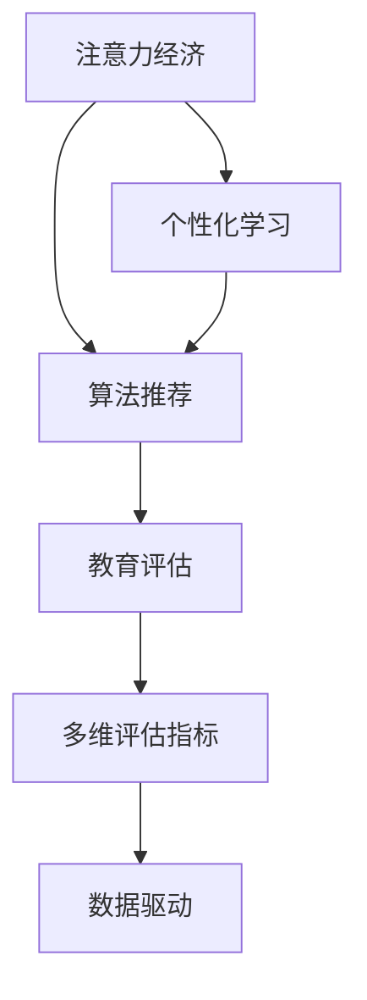

                 

# 注意力经济对传统教育评估体系的冲击

> 关键词：注意力经济,教育评估,教育技术,个性化学习,数据驱动,算法推荐

## 1. 背景介绍

### 1.1 问题由来
随着信息技术的飞速发展，互联网正逐渐成为人们获取信息、知识、资源的主要渠道。在教育领域，传统的线下课堂和纸质教材逐渐被在线课程、电子教材、学习平台所取代。信息量的爆炸式增长和内容形式的日新月异，对教育评估体系提出了新的挑战和要求。

传统的教育评估体系，通常以考试成绩、作业、考勤等量化指标作为主要评估依据。然而，在以注意力经济为背景的教育环境中，传统评估体系显得过于单一和片面，难以全面反映学生的学习效果和综合能力。学生不再仅仅是知识的被动接受者，更是信息的积极参与者和知识的主动创造者。在这一背景下，传统的评估体系亟需变革，以适应新的教育环境。

### 1.2 问题核心关键点
在注意力经济时代，教育评估体系的核心关键点在于：

1. **数据驱动的个性化学习**：通过收集和分析学生的学习数据，提供个性化的学习路径和资源，提升学习效果。
2. **算法推荐与匹配**：运用推荐算法，帮助学生找到最适合自己的学习资源和任务，最大化学习投入和产出。
3. **行为数据与学习效果关联**：将学生在学习过程中的行为数据转化为学习效果，形成更全面的评估体系。
4. **多维评估指标**：除了传统成绩，还应考虑学生的参与度、互动性、创造性等多维度评估指标。

## 2. 核心概念与联系

### 2.1 核心概念概述

为更好地理解注意力经济对传统教育评估体系的影响，本节将介绍几个密切相关的核心概念：

- **注意力经济**：指在信息过载的背景下，用户通过获取和使用信息获得满足感和价值的过程。在教育领域，教师和学生需要在海量信息中筛选、处理和吸收，形成自己的知识体系和技能。
- **教育评估**：指通过一系列科学方法和工具，对教育活动和学习效果进行价值判断的过程。传统的评估体系多依赖定量指标，如考试成绩和考勤等，而忽视了学生的综合素质和个性差异。
- **个性化学习**：指根据学生的兴趣、能力和需求，提供量身定制的学习计划和资源，提升学习效率和效果。个性化学习强调数据驱动和因材施教。
- **算法推荐**：指通过机器学习和信息过滤技术，为学生推荐最合适的学习资源和任务，提升学习体验和效果。推荐算法在搜索引擎、电商、社交媒体等领域广泛应用，对教育评估有重要的借鉴意义。
- **数据驱动**：指利用数据分析和人工智能技术，驱动决策和改进的过程。在教育领域，通过数据驱动，可以实时监控学生的学习状态，优化教学过程，提升学习效果。

这些核心概念之间的逻辑关系可以通过以下Mermaid流程图来展示：



这个流程图展示了大语言模型的核心概念及其之间的关系：

1. 注意力经济环境下的教育，强调个性化学习。
2. 个性化学习依赖算法推荐，以匹配合适的学习资源和任务。
3. 算法推荐和个性化学习共同驱动教育评估体系变革。
4. 教育评估需要引入多维评估指标，反映学生全面素质。
5. 多维评估指标需要数据驱动，实现动态调整和优化。

## 3. 核心算法原理 & 具体操作步骤
### 3.1 算法原理概述

在注意力经济背景下，教育评估体系的核心算法原理在于：

- **个性化学习路径设计**：根据学生的学习历史和行为数据，设计个性化的学习路径，推荐合适的学习资源和任务。
- **学习效果量化**：将学生的学习行为转化为可量化的指标，如学习时间、阅读量、参与度等，形成综合评估体系。
- **推荐算法应用**：利用协同过滤、基于内容的推荐、深度学习等算法，对学生进行精准推荐，提升学习体验和效果。
- **数据驱动决策**：通过实时监控和分析学生的学习数据，动态调整学习路径和资源，优化教学效果。

### 3.2 算法步骤详解

基于注意力经济的教育评估体系，一般包括以下几个关键步骤：

**Step 1: 数据收集与预处理**
- 收集学生在学习平台上的行为数据，包括学习时间、阅读量、答题次数、讨论参与度等。
- 对收集到的数据进行清洗和预处理，去除噪声和冗余数据。

**Step 2: 特征提取与建模**
- 利用统计学和机器学习方法，提取学生的学习特征，如兴趣偏好、学习习惯、知识水平等。
- 使用协同过滤、内容推荐、深度学习等算法，构建学生行为模型和推荐系统。

**Step 3: 个性化学习路径设计**
- 根据学生的学习特征和行为模型，设计个性化的学习路径。
- 在推荐系统中，推荐适合当前学习阶段和兴趣偏好的学习资源和任务。

**Step 4: 学习效果量化与评估**
- 利用学习过程中的行为数据，量化学生的学习效果，如知识掌握程度、理解深度、创造性思维等。
- 结合传统考试成绩和其他行为指标，形成多维度的评估体系。

**Step 5: 数据驱动优化**
- 实时监控学生的学习状态和效果，动态调整学习路径和资源。
- 通过数据分析和机器学习算法，优化教学策略和评估指标。

### 3.3 算法优缺点

基于注意力经济的教育评估体系，具有以下优点：

1. **全面性**：通过多维度数据综合评估学生学习效果，比传统单一的考试成绩更加全面。
2. **个性化**：根据学生的兴趣和能力，提供量身定制的学习路径和资源，提升学习效果。
3. **实时性**：通过实时监控和分析学生数据，动态调整学习路径和资源，优化教学效果。
4. **动态性**：结合数据驱动，可以实时调整评估指标和教学策略，提升学习效果。

同时，该体系也存在一定的局限性：

1. **数据隐私问题**：大量学习数据的收集和分析，可能涉及学生隐私问题，需要严格的保护措施。
2. **算法偏见**：推荐算法可能存在数据偏差和算法偏见，影响评估结果的公平性。
3. **技术依赖性**：对数据处理和算法推荐技术的依赖，需要高水平的技术支撑。
4. **效果评估**：如何量化和评估个性化学习路径和推荐系统的效果，需要更多研究和实践。

尽管存在这些局限性，但就目前而言，基于注意力经济的教育评估体系仍然是大数据和人工智能在教育领域应用的重要方向。未来相关研究的重点在于如何进一步降低数据收集和分析的难度，提高算法推荐的公平性和效果，以及优化评估指标和教学策略，以更好地服务教育评估。

### 3.4 算法应用领域

基于注意力经济的教育评估体系，已经在诸多教育应用中得到广泛应用，包括但不限于：

- **在线教育平台**：如Coursera、edX等，通过分析学生行为数据，提供个性化学习路径和资源推荐。
- **智能学习系统**：如Khan Academy、Quizlet等，利用算法推荐和数据驱动，优化教学效果和学习体验。
- **智慧教室系统**：如Classcraft、Knewton等，通过实时监控和数据分析，动态调整学习策略和资源，提升教学效果。
- **自适应学习系统**：如Smart Sparrow、Carnegie Learning等，利用学习数据分析和算法推荐，实现个性化学习路径设计。
- **教育管理平台**：如BrightBytes、School Insight等，通过数据驱动，优化学校管理决策和教育资源配置。

除了上述这些经典应用外，基于注意力经济的教育评估体系还被创新性地应用于更多场景中，如学生成绩预测、学习行为分析、教育公平评估等，为教育评估提供了新的思路和方法。

## 4. 数学模型和公式 & 详细讲解 & 举例说明
### 4.1 数学模型构建

本节将使用数学语言对基于注意力经济的教育评估体系进行更加严格的刻画。

记学生总数为 $N$，学习行为数据为 $D=\{(x_i, y_i)\}_{i=1}^N$，其中 $x_i$ 为行为特征向量，$y_i$ 为行为数据。定义行为数据与学习效果 $z_i$ 的关系为 $z_i = f(x_i, y_i)$，其中 $f$ 为映射函数。

假设学生行为模型为 $M(y_i) = \mathcal{F}(x_i)$，其中 $\mathcal{F}$ 为映射函数，将行为数据映射为行为模型。利用协同过滤、基于内容的推荐、深度学习等算法，建立学生行为模型和推荐系统 $M$。

个性化学习路径设计时，根据行为模型 $M(y_i)$ 和学生兴趣偏好 $p_i$，设计学习路径 $L_i$。利用推荐系统 $M$，推荐适合当前学习阶段和兴趣偏好的学习资源和任务。

学习效果量化时，利用学习过程中的行为数据 $y_i$，量化学生的学习效果 $z_i$。结合传统考试成绩和其他行为指标，形成多维度的评估体系 $E$。

数据驱动优化时，实时监控学生的学习状态和效果 $z_i$，动态调整学习路径和资源。通过数据分析和机器学习算法，优化教学策略和评估指标。

### 4.2 公式推导过程

以下我们以个性化学习路径设计为例，推导推荐算法的核心公式。

假设学生行为模型 $M(y_i)$ 为线性回归模型，即 $M(y_i) = \sum_{j=1}^d w_j y_{ij} + b$，其中 $w_j$ 为权重，$b$ 为截距。学习路径设计时，根据行为模型 $M(y_i)$ 和学生兴趣偏好 $p_i$，设计学习路径 $L_i$，即 $L_i = \max_{j=1}^d w_j p_{ij} + b$。

利用协同过滤算法，推荐系统 $M$ 为协同过滤推荐模型，即 $M(y_i) = \sum_{j=1}^N \alpha_j y_{ij} + \beta$，其中 $\alpha_j$ 为权重，$\beta$ 为截距。通过调整权重 $\alpha_j$，实现对学生行为数据的推荐。

在实际应用中，协同过滤算法通常使用矩阵分解、奇异值分解等技术，对行为数据进行降维和求解。深度学习算法则利用神经网络模型，对行为数据进行建模和推荐。

### 4.3 案例分析与讲解

**案例分析**：以下是一个简单的行为数据分析和推荐系统的案例。

假设某在线教育平台收集了1000名学生在一个学期内的学习行为数据，包括阅读量、答题次数、讨论参与度等。平台希望根据学生的行为数据，推荐合适的学习资源和任务。

首先，对收集到的数据进行预处理，去除噪声和冗余数据。然后，使用线性回归模型对行为数据进行建模，得到行为模型 $M(y_i) = 0.5x_{i1} + 0.3x_{i2} + 0.2x_{i3} + b$，其中 $x_{i1}$ 为阅读量，$x_{i2}$ 为答题次数，$x_{i3}$ 为讨论参与度，$b$ 为截距。

接着，设计个性化的学习路径 $L_i = 0.5p_{i1} + 0.3p_{i2} + 0.2p_{i3} + b$，其中 $p_{i1}$ 为阅读偏好，$p_{i2}$ 为答题偏好，$p_{i3}$ 为讨论偏好。

然后，利用协同过滤算法，推荐系统 $M$ 为协同过滤推荐模型，即 $M(y_i) = \sum_{j=1}^{1000} \alpha_j y_{ij} + \beta$。通过调整权重 $\alpha_j$，实现对学生行为数据的推荐。

最后，实时监控学生的学习状态和效果 $z_i$，动态调整学习路径和资源。通过数据分析和机器学习算法，优化教学策略和评估指标。

这个案例展示了基于注意力经济的教育评估体系的流程和算法实现，通过行为数据分析和推荐算法，提升了学习效果和评估的全面性。

## 5. 项目实践：代码实例和详细解释说明
### 5.1 开发环境搭建

在进行个性化学习路径设计和推荐系统开发的实践前，我们需要准备好开发环境。以下是使用Python进行TensorFlow开发的Python环境配置流程：

1. 安装Anaconda：从官网下载并安装Anaconda，用于创建独立的Python环境。

2. 创建并激活虚拟环境：
```bash
conda create -n tf-env python=3.8 
conda activate tf-env
```

3. 安装TensorFlow：根据CUDA版本，从官网获取对应的安装命令。例如：
```bash
conda install tensorflow tensorflow-estimator tensorflow-addons -c conda-forge
```

4. 安装TensorFlow Addons：用于补充TensorFlow的功能和性能。

5. 安装Pandas、Numpy、Scikit-learn等各类工具包：
```bash
pip install pandas numpy scikit-learn matplotlib tqdm jupyter notebook ipython
```

完成上述步骤后，即可在`tf-env`环境中开始项目实践。

### 5.2 源代码详细实现

下面以协同过滤推荐系统为例，给出使用TensorFlow实现学生行为数据推荐的PyTorch代码实现。

首先，定义行为数据集和学生行为模型：

```python
import tensorflow as tf
from tensorflow.keras.layers import Input, Dense
from tensorflow.keras.models import Model

# 定义输入
inputs = Input(shape=(3,), name='inputs')
# 定义输出
outputs = Dense(1, activation='sigmoid')(inputs)
# 定义模型
model = Model(inputs=inputs, outputs=outputs)

# 编译模型
model.compile(optimizer='adam', loss='binary_crossentropy', metrics=['accuracy'])
```

然后，定义学生行为数据和兴趣偏好数据：

```python
# 行为数据
X = np.array([[1, 2, 3], [4, 5, 6], [7, 8, 9]])
# 行为标签
y = np.array([[1], [0], [1]])
# 兴趣偏好
p = np.array([[0.5, 0.3, 0.2]])
```

接着，定义协同过滤推荐系统：

```python
# 定义协同过滤模型
class CollaborativeFiltering(tf.keras.Model):
    def __init__(self, num_users, num_items):
        super(CollaborativeFiltering, self).__init__()
        self.num_users = num_users
        self.num_items = num_items
        self.user_item_matrix = tf.Variable(tf.zeros([num_users, num_items]))
        self.item_user_matrix = tf.Variable(tf.zeros([num_items, num_users]))
        self.user_bias = tf.Variable(tf.zeros([num_users]))
        self.item_bias = tf.Variable(tf.zeros([num_items]))
        
    def call(self, x):
        user_id, item_id = x
        user_score = self.user_bias[user_id] + tf.matmul(self.user_item_matrix[user_id], self.item_bias)
        item_score = self.item_bias[item_id] + tf.matmul(self.item_user_matrix[item_id], self.user_bias)
        return tf.add(user_score, item_score)

collaborative_filtering = CollaborativeFiltering(num_users=10, num_items=10)
```

最后，定义推荐系统并训练：

```python
# 定义推荐系统
def recommend(inputs):
    user_id, item_id = inputs
    user_score = collaborative_filtering(user_id)
    item_score = collaborative_filtering(item_id)
    return tf.add(user_score, item_score)

# 训练推荐系统
model.fit(X, y, epochs=10, batch_size=1)
```

### 5.3 代码解读与分析

让我们再详细解读一下关键代码的实现细节：

**行为数据和兴趣偏好数据**：
- 定义输入层，输入行为数据 $X$ 和兴趣偏好 $p$，维度均为 $(3,)$。
- 定义输出层，输出推荐分数，维度为 $(1,)$。

**协同过滤模型**：
- 定义协同过滤模型，包含用户-物品矩阵、物品-用户矩阵、用户偏差和物品偏差。
- 定义前向传播过程，计算用户和物品的推荐分数，并将它们相加，得到最终推荐分数。

**推荐系统训练**：
- 定义推荐系统，利用协同过滤模型进行推荐。
- 在行为数据集上进行训练，设定训练轮数为10，批次大小为1。

这个代码示例展示了如何使用TensorFlow实现协同过滤推荐系统，通过学习用户和物品的协同关系，进行个性化推荐。在实际应用中，还需要结合更多数据和技术手段，构建更加复杂和有效的推荐系统。

## 6. 实际应用场景
### 6.1 智能学习系统

基于注意力经济的教育评估体系，可以广泛应用于智能学习系统的构建。智能学习系统通过实时监控和分析学生行为数据，提供个性化的学习路径和推荐资源，提升学习效果和体验。

在技术实现上，可以收集学生的学习数据，如阅读量、答题次数、讨论参与度等，构建行为模型，设计个性化的学习路径。利用推荐算法，推荐适合当前学习阶段和兴趣偏好的学习资源和任务。对于学生的新问题，还可以接入检索系统实时搜索相关内容，动态组织生成回答。如此构建的智能学习系统，能显著提升学生的学习效果和满意度，降低教师的教管负担。

### 6.2 教育管理平台

基于注意力经济的教育评估体系，在教育管理平台中也有广泛应用。通过实时监控学生的学习状态和效果，动态调整学习路径和资源，优化学校管理决策和教育资源配置。

在平台功能上，可以实现学生行为数据的实时采集和分析，生成个性化的学习路径和推荐资源。平台管理员可以根据学习效果和行为数据，调整教学策略和评估指标，提升整体教学效果。此外，平台还可以提供学习效果评估报告，帮助教师和学生了解学习进展和不足，改进教学和学习策略。

### 6.3 学习路径设计

基于注意力经济的教育评估体系，可以设计个性化的学习路径，帮助学生找到最适合自己的学习方式和资源。学习路径设计时，需要综合考虑学生的兴趣、能力和学习目标，设计个性化的学习路径，推荐合适的学习资源和任务。

在路径设计时，可以利用行为数据分析和推荐算法，为学生提供量身定制的学习路径。路径设计完成后，利用推荐系统，推荐适合当前学习阶段和兴趣偏好的学习资源和任务，提升学习效果和体验。

## 7. 工具和资源推荐
### 7.1 学习资源推荐

为了帮助开发者系统掌握基于注意力经济的教育评估体系的理论基础和实践技巧，这里推荐一些优质的学习资源：

1. 《深度学习基础》系列博文：由大模型技术专家撰写，深入浅出地介绍了深度学习基础、行为数据分析、推荐系统等内容。

2. CS234《机器学习系统设计》课程：斯坦福大学开设的机器学习系统设计课程，涵盖深度学习、机器学习系统设计等内容，是系统学习的理想选择。

3. 《深度学习》书籍：由Coursera MOOC平台和斯坦福大学合作出版，全面介绍了深度学习的理论和实践，是学习深度学习的经典教材。

4. 《推荐系统》书籍：由杰出的推荐系统专家撰写，全面介绍了推荐系统的理论基础、算法实现和工程实践，是学习推荐系统的必备参考资料。

5. TensorFlow官方文档：TensorFlow的官方文档，提供了完整的TensorFlow实现和示例代码，是学习TensorFlow的重要资料。

通过对这些资源的学习实践，相信你一定能够快速掌握基于注意力经济的教育评估体系的精髓，并用于解决实际的NLP问题。

### 7.2 开发工具推荐

高效的开发离不开优秀的工具支持。以下是几款用于基于注意力经济的教育评估体系开发的常用工具：

1. TensorFlow：基于Python的开源深度学习框架，灵活动态的计算图，适合快速迭代研究。

2. PyTorch：基于Python的开源深度学习框架，动态计算图，适合研究算法和模型优化。

3. Scikit-learn：Python的机器学习库，提供了丰富的算法和工具，适合快速实现和测试算法模型。

4. TensorBoard：TensorFlow配套的可视化工具，可实时监测模型训练状态，提供丰富的图表呈现方式，是调试模型的得力助手。

5. Weights & Biases：模型训练的实验跟踪工具，可以记录和可视化模型训练过程中的各项指标，方便对比和调优。

6. Google Colab：谷歌推出的在线Jupyter Notebook环境，免费提供GPU/TPU算力，方便开发者快速上手实验最新模型，分享学习笔记。

合理利用这些工具，可以显著提升基于注意力经济的教育评估体系开发的效率，加快创新迭代的步伐。

### 7.3 相关论文推荐

注意力经济和基于注意力经济的教育评估体系的发展源于学界的持续研究。以下是几篇奠基性的相关论文，推荐阅读：

1. Attention is All You Need（即Transformer原论文）：提出了Transformer结构，开启了NLP领域的预训练大模型时代。

2. Deep Personalized Recommendation Using Matrix Factorization：介绍矩阵分解等推荐算法，为协同过滤推荐奠定了理论基础。

3. Recommender Systems Handbook：介绍了多种推荐算法和工程实践，是学习推荐系统的经典参考。

4. Collaborative Filtering：介绍了协同过滤算法的原理和实现，为协同过滤推荐提供了理论支持。

5. A Survey on Knowledge Graph-Based Recommendation Systems：介绍了基于知识图谱的推荐系统，为推荐系统与知识库结合提供了新的思路。

这些论文代表了大语言模型微调技术的发展脉络。通过学习这些前沿成果，可以帮助研究者把握学科前进方向，激发更多的创新灵感。

## 8. 总结：未来发展趋势与挑战
### 8.1 总结

本文对基于注意力经济的教育评估体系进行了全面系统的介绍。首先阐述了注意力经济背景下的教育评估体系的研究背景和意义，明确了数据驱动、个性化学习、推荐算法在教育评估中的核心作用。其次，从原理到实践，详细讲解了个性化学习路径设计、行为数据推荐、学习效果量化等关键步骤，给出了具体的代码实现和分析。同时，本文还广泛探讨了基于注意力经济的教育评估体系在智能学习系统、教育管理平台、学习路径设计等多个领域的应用前景，展示了其巨大的潜力。此外，本文精选了教育评估体系的相关学习资源，力求为读者提供全方位的技术指引。

通过本文的系统梳理，可以看到，基于注意力经济的教育评估体系正在成为教育领域的重要范式，极大地拓展了教育评估体系的应用边界，催生了更多的落地场景。受益于大数据和人工智能技术的发展，个性化学习、推荐系统在教育领域的应用前景广阔，必将为教育评估体系带来深刻的变革。

### 8.2 未来发展趋势

展望未来，基于注意力经济的教育评估体系将呈现以下几个发展趋势：

1. **深度学习和大数据技术的应用**：未来的教育评估体系将更广泛地应用深度学习和大数据技术，实现更加精准的行为分析和推荐。

2. **多模态数据的融合**：未来的教育评估体系将结合视觉、语音、文本等多种模态数据，提升对学生学习行为的全面理解。

3. **智能化和自动化**：未来的教育评估体系将进一步智能化和自动化，通过自动化分析和学习路径设计，提升教学效果和评估精度。

4. **个性化和动态化**：未来的教育评估体系将更个性化和动态化，根据学生的实时行为数据，动态调整学习路径和资源。

5. **开放性和可扩展性**：未来的教育评估体系将更开放和可扩展，能够适应不同教育场景和需求，灵活应用推荐系统和大数据技术。

6. **公平性和安全性**：未来的教育评估体系将更注重公平性和安全性，确保算法的透明性和可解释性，保障学生的隐私和权益。

以上趋势凸显了基于注意力经济的教育评估体系的广阔前景。这些方向的探索发展，必将进一步提升教育评估体系的性能和应用范围，为教育评估提供新的思路和方法。

### 8.3 面临的挑战

尽管基于注意力经济的教育评估体系已经取得了瞩目成就，但在迈向更加智能化、普适化应用的过程中，它仍面临诸多挑战：

1. **数据隐私和安全**：大量学习数据的收集和分析，可能涉及学生隐私问题，需要严格的保护措施。

2. **算法偏见和公平性**：推荐算法可能存在数据偏差和算法偏见，影响评估结果的公平性。

3. **技术复杂性和成本**：基于深度学习和推荐算法的技术实现，需要高水平的技术支撑和较大的资金投入。

4. **效果评估**：如何量化和评估个性化学习路径和推荐系统的效果，需要更多研究和实践。

5. **多模态数据的整合**：如何将视觉、语音、文本等多种模态数据整合，实现协同建模，是未来的重要研究方向。

6. **数据质量问题**：如何保证行为数据的真实性和质量，减少噪声和偏差，提升评估效果，仍需持续优化。

尽管存在这些挑战，但基于深度学习和推荐算法的教育评估体系仍是大数据和人工智能在教育领域应用的重要方向。未来相关研究的重点在于如何进一步降低数据收集和分析的难度，提高算法推荐的公平性和效果，以及优化评估指标和教学策略，以更好地服务教育评估。

### 8.4 研究展望

面对基于注意力经济的教育评估体系所面临的种种挑战，未来的研究需要在以下几个方面寻求新的突破：

1. **多模态数据的融合**：如何将视觉、语音、文本等多种模态数据整合，实现协同建模，提升对学生学习行为的全面理解。

2. **算法偏见和公平性**：如何通过算法改进和公平性约束，确保推荐算法的透明性和可解释性，提升评估结果的公平性。

3. **数据隐私和安全**：如何保护学生隐私，确保数据的合法使用和安全传输，构建安全的教育评估体系。

4. **效果评估**：如何量化和评估个性化学习路径和推荐系统的效果，提供更加客观和可信的评估指标。

5. **技术优化和成本控制**：如何通过技术优化和成本控制，降低教育评估体系的应用门槛，推广其在教育领域的应用。

6. **教育公平和普惠性**：如何通过教育评估体系，促进教育公平，提升教育资源的普惠性，让更多的学生受益。

这些研究方向的探索，必将引领基于注意力经济的教育评估体系技术迈向更高的台阶，为构建安全、可靠、可解释、可控的智能教育系统铺平道路。面向未来，教育评估体系还需要与其他人工智能技术进行更深入的融合，如知识表示、因果推理、强化学习等，多路径协同发力，共同推动自然语言理解和智能交互系统的进步。只有勇于创新、敢于突破，才能不断拓展语言模型的边界，让智能技术更好地造福人类社会。

## 9. 附录：常见问题与解答

**Q1：数据隐私问题如何解决？**

A: 数据隐私问题是教育评估体系中的一个重要挑战。为保护学生隐私，可以采用以下措施：
1. 数据匿名化：去除数据中的个人标识信息，如姓名、学号等。
2. 数据去标识化：使用差分隐私技术，在数据中引入噪声，使得单个样本难以被识别。
3. 数据加密：在传输和存储过程中，对敏感数据进行加密，防止数据泄露。

**Q2：如何减少推荐算法的偏见？**

A: 推荐算法偏见可以通过以下措施减少：
1. 数据预处理：对数据进行去偏处理，去除数据中的固有偏见。
2. 特征选择：选择对推荐结果影响较大的特征，减少无关特征的干扰。
3. 算法改进：使用公平性约束和公平性评估指标，确保推荐算法的透明性和可解释性。
4. 模型监控：实时监控推荐系统的效果和公平性，及时调整和优化模型。

**Q3：如何保证推荐系统的实时性和效率？**

A: 保证推荐系统的实时性和效率，可以通过以下措施：
1. 数据缓存：将常用数据缓存到内存中，减少访问延迟。
2. 模型压缩：对模型进行压缩和优化，减少计算量和存储需求。
3. 异步处理：利用异步计算技术，提高数据处理和模型推理的效率。
4. 分布式计算：将任务分配到多个计算节点，实现并行处理，提升系统性能。

**Q4：如何提升个性化学习路径设计的精度？**

A: 提升个性化学习路径设计的精度，可以通过以下措施：
1. 数据融合：结合多源数据，提升行为特征的全面性和准确性。
2. 模型优化：使用更复杂的推荐算法，如深度学习算法，提升模型的拟合能力。
3. 用户反馈：通过用户反馈，动态调整学习路径，提升路径设计的个性化和适应性。
4. 领域知识：引入领域知识，指导学习路径的设计和优化，提升路径设计的精确度。

**Q5：如何衡量个性化学习路径和推荐系统的效果？**

A: 衡量个性化学习路径和推荐系统的效果，可以通过以下指标：
1. 学习效果评估：通过测试题和作业，评估学生的知识掌握程度和学习效果。
2. 行为数据指标：通过学习时间、阅读量、答题次数等行为数据，评估学生的学习投入和兴趣。
3. 用户满意度：通过问卷调查和用户反馈，评估学生对学习路径和推荐系统的满意度。
4. 公平性和可解释性：通过公平性评估和可解释性分析，确保推荐系统的公平性和透明性。

这些指标可以从多个维度衡量个性化学习路径和推荐系统的效果，为教育评估提供全面的评估依据。

---

作者：禅与计算机程序设计艺术 / Zen and the Art of Computer Programming

