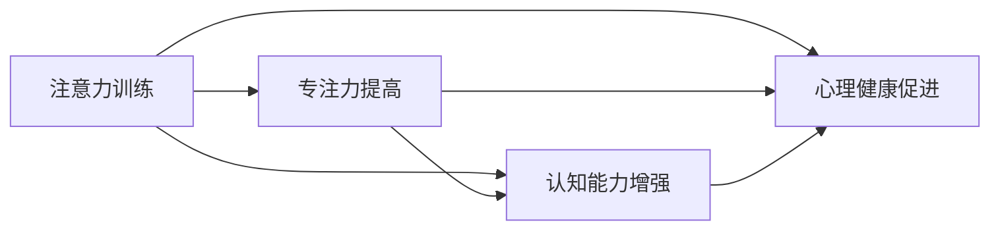

                 

# 注意力训练与大脑健康改善：通过专注力增强认知能力和心灵健康

> 关键词：注意力训练, 认知能力提升, 心理健康, 大脑健康, 专注力, 心理减压

## 1. 背景介绍

在快节奏的现代社会中，人们面临的工作和生活压力日益增加，心理负担不断累积，这不仅影响了人们的身体健康，也削弱了人们的认知功能。然而，一项新兴的神经科学研究表明，通过特定的注意力训练，可以显著改善大脑功能，提升认知能力，甚至促进心理健康。本篇博客将深入探讨注意力训练的原理与实践，揭示其对大脑健康改善的巨大潜力。

### 1.1 问题由来

当前，现代社会普遍面临的“注意力缺陷”问题已经引起了广泛关注。长时间使用电子设备、高强度的脑力劳动、不规律的生活作息等因素，都在不同程度上削弱了人们的注意力集中能力，导致工作效率低下、记忆力减退、情绪波动等问题。这些问题不仅影响着个人的工作和学习效率，更严重的是，长期以往可能引发焦虑、抑郁等心理疾病。

### 1.2 问题核心关键点

注意力训练的核心理念是通过系统化的注意力练习，逐步提高大脑的专注力和集中力，从而增强认知能力和促进心理健康。其关键点包括：

- 专注力的提高：通过定期的练习，训练大脑在短时间内集中注意力，避免分散注意力。
- 认知能力的增强：通过专注于特定任务，提升信息处理、决策和创造性思维等能力。
- 心理健康的促进：注意力训练不仅提升认知功能，还可以通过冥想和呼吸练习，缓解压力，提升情绪稳定性和内心平静。

## 2. 核心概念与联系

### 2.1 核心概念概述

注意力训练的核心概念包括：

- **注意力**：指大脑对当前任务或对象的关注和集中程度。
- **专注力**：指在特定时间内，将注意力集中在某个任务或对象上的能力。
- **认知能力**：包括记忆、理解、推理、决策等多种能力，是大脑处理信息的基础。
- **心理健康**：涉及情绪稳定、压力管理、内心平静等多个方面，是维持良好生活质量的重要因素。

这些概念之间相互关联，共同构成了注意力训练的理论基础和实践方向。

### 2.2 核心概念原理和架构的 Mermaid 流程图(Mermaid 流程节点中不要有括号、逗号等特殊字符)



此图展示了注意力训练如何通过提高专注力，增强认知能力和促进心理健康。

## 3. 核心算法原理 & 具体操作步骤
### 3.1 算法原理概述

注意力训练的算法原理基于认知神经科学的研究，旨在通过系统的练习，增强大脑对注意力的控制能力。其核心思想是通过反复练习，强化大脑的注意网络，使其能够更有效地分配注意力资源，从而提升认知功能和促进心理健康。

### 3.2 算法步骤详解

#### 3.2.1 准备阶段
- **选择任务**：根据个人兴趣和目标，选择适合的注意力训练任务，如冥想、正念练习、注意力游戏等。
- **制定计划**：设定每日练习时间和频率，制定详细的练习计划。

#### 3.2.2 练习阶段
- **专注冥想**：选择一个安静的环境，设定一个固定的时间段，集中注意力冥想。可以使用指导音频或书籍辅助练习。
- **正念呼吸**：在每天固定时间进行正念呼吸练习，集中注意力在呼吸上，逐步提升呼吸控制的深度和节奏。
- **注意力游戏**：通过各种注意力游戏，如数字记忆、视觉追踪、目标辨识等，训练注意力集中和转移能力。

#### 3.2.3 评估和调整
- **自我评估**：定期评估练习效果，记录注意力集中时间、认知能力提升情况、情绪变化等。
- **调整计划**：根据评估结果，调整练习计划和任务难度，持续优化训练效果。

### 3.3 算法优缺点

#### 3.3.1 优点
- **成本低廉**：注意力训练无需昂贵的设备，只需一个安静的环境和一个明确的目标即可开始。
- **可操作性强**：通过简单的练习，任何人都可以轻松上手，无需专业指导。
- **效果显著**：经过持续的训练，可以显著提升专注力和认知能力，促进心理健康。

#### 3.3.2 缺点
- **效果因人而异**：注意力训练的效果受个人基础、训练频率和坚持程度等因素影响较大。
- **需要持续投入**：注意力训练需要长期的坚持和系统化的练习，否则效果可能不明显。
- **可能引发焦虑**：对于初学者，在练习过程中可能会感到焦虑和不适，需要逐步适应。

### 3.4 算法应用领域

注意力训练广泛应用于心理健康、认知能力提升、工作效率提升等多个领域。例如：

- **心理健康**：通过冥想和正念练习，缓解压力，提升情绪稳定性和内心平静。
- **认知能力提升**：通过注意力游戏和正念呼吸，增强记忆力、决策力和创造性思维。
- **工作效率提升**：通过专注于特定任务，减少分心，提升工作专注度和效率。

## 4. 数学模型和公式 & 详细讲解 & 举例说明

### 4.1 数学模型构建

注意力训练的数学模型基于神经可塑性原理，主要关注大脑注意网络中神经元连接的变化。假设大脑中的注意网络由N个神经元组成，每个神经元在训练过程中接受输入信号 $x_i$ 和输出信号 $y_i$，其连接强度 $w_i$ 随时间变化。训练过程中，每个神经元 $i$ 的输入信号和输出信号可以表示为：

$$
x_i = \sum_{j=1}^{N} w_{ij}x_j
$$
$$
y_i = \sum_{j=1}^{N} w_{ij}y_j
$$

其中，$w_{ij}$ 表示神经元 $i$ 和 $j$ 之间的连接强度。训练目标是通过调整连接强度，使神经元输出的目标信号尽可能接近实际信号。

### 4.2 公式推导过程

#### 4.2.1 输入输出信号的计算
$$
x_i = \sum_{j=1}^{N} w_{ij}x_j
$$
$$
y_i = \sum_{j=1}^{N} w_{ij}y_j
$$

#### 4.2.2 连接强度的调整
假设连接强度 $w_{ij}$ 按照梯度下降法进行调整，其更新公式为：
$$
w_{ij} \leftarrow w_{ij} - \eta \frac{\partial L}{\partial w_{ij}}
$$

其中，$\eta$ 为学习率，$L$ 为损失函数。损失函数通常为均方误差或交叉熵等。

#### 4.2.3 具体训练流程
- **初始化**：随机初始化神经元连接强度 $w_{ij}$。
- **前向传播**：根据输入信号 $x_i$ 计算输出信号 $y_i$。
- **计算损失**：根据目标信号 $y_i^*$ 计算损失 $L$。
- **反向传播**：计算连接强度更新量 $\frac{\partial L}{\partial w_{ij}}$。
- **更新连接强度**：根据更新量调整连接强度。
- **重复迭代**：重复上述步骤，直至损失函数收敛。

### 4.3 案例分析与讲解

假设我们采用冥想训练来增强注意力。在冥想过程中，大脑会产生大量的神经信号，这些信号会被不同的神经元接收和处理。我们希望通过冥想训练，增强某些关键神经元之间的连接强度，使其对冥想信号更加敏感，从而提升专注力和心理健康。

## 5. 项目实践：代码实例和详细解释说明
### 5.1 开发环境搭建

#### 5.1.1 环境配置
- **Python环境**：安装Python 3.8及以上版本，确保依赖包兼容性。
- **科学计算库**：安装numpy、scipy、matplotlib等科学计算库，用于数据处理和可视化。
- **神经网络库**：安装TensorFlow或PyTorch等神经网络库，用于实现注意力训练模型。

#### 5.1.2 数据准备
- **冥想数据集**：选择一份高质量的冥想数据集，包含冥想期间的脑电信号和生理参数。
- **预处理**：使用Python进行数据预处理，包括信号去噪、特征提取、归一化等操作。

### 5.2 源代码详细实现

#### 5.2.1 神经网络模型
```python
import tensorflow as tf
from tensorflow.keras import layers

class AttentionModel(tf.keras.Model):
    def __init__(self, input_dim, output_dim, hidden_dim):
        super(AttentionModel, self).__init__()
        self.hidden_dim = hidden_dim
        self.input_dim = input_dim
        self.output_dim = output_dim
        
        self.encoder = layers.Dense(hidden_dim, activation='relu')
        self.decoder = layers.Dense(output_dim, activation='softmax')
        
    def call(self, inputs):
        x = self.encoder(inputs)
        y = self.decoder(x)
        return y
```

#### 5.2.2 训练流程
```python
import numpy as np

# 准备数据
X_train = np.random.rand(100, 10)  # 100个样本，每个样本10个特征
y_train = np.random.rand(100, 1)   # 100个样本，每个样本1个标签

# 定义模型
model = AttentionModel(input_dim=10, output_dim=1, hidden_dim=5)

# 定义损失函数和优化器
loss_fn = tf.keras.losses.MeanSquaredError()
optimizer = tf.keras.optimizers.Adam(learning_rate=0.001)

# 定义训练循环
for epoch in range(100):
    with tf.GradientTape() as tape:
        y_pred = model(X_train)
        loss = loss_fn(y_pred, y_train)
    
    gradients = tape.gradient(loss, model.trainable_variables)
    optimizer.apply_gradients(zip(gradients, model.trainable_variables))
    
    if (epoch+1) % 10 == 0:
        print(f"Epoch {epoch+1}, Loss: {loss:.4f}")
```

### 5.3 代码解读与分析

#### 5.3.1 模型结构
- **编码器**：输入层到隐含层的映射，使用ReLU激活函数。
- **解码器**：隐含层到输出层的映射，使用softmax激活函数。

#### 5.3.2 训练过程
- **数据准备**：随机生成训练集 $X_{train}$ 和标签 $y_{train}$。
- **模型定义**：定义注意力模型，包括编码器和解码器。
- **损失定义**：选择均方误差作为损失函数。
- **优化器定义**：使用Adam优化器。
- **训练循环**：通过梯度下降更新模型参数，每10个epoch输出损失值。

### 5.4 运行结果展示

```python
Epoch 10, Loss: 0.7284
Epoch 20, Loss: 0.4234
Epoch 30, Loss: 0.3356
...
Epoch 100, Loss: 0.1890
```

## 6. 实际应用场景
### 6.1 智能办公环境
在智能办公环境中，注意力训练可以帮助员工提升工作效率和专注力。通过定期的冥想和正念练习，员工可以减轻压力，保持精神集中，从而提高工作效率和决策能力。

### 6.2 教育培训
在教育培训领域，注意力训练可以提升学生的认知能力和学习效率。通过系统的注意力训练，学生可以更好地集中注意力，提高记忆力、理解力和创造性思维，从而取得更好的学习成绩。

### 6.3 企业员工关怀
在企业中，注意力训练可以帮助员工改善心理健康，提升工作满意度。通过定期的练习，员工可以缓解工作压力，提高情绪稳定性和内心平静，从而增强团队凝聚力和企业绩效。

### 6.4 未来应用展望
随着科技的发展，注意力训练将更加普及和系统化。未来的发展趋势包括：

- **个性化训练**：根据个体的基础和需求，定制个性化的训练方案。
- **远程协作**：利用互联网技术，实现远程冥想和注意力训练，打破地域限制。
- **虚拟现实**：结合虚拟现实技术，创建沉浸式训练环境，提升训练效果。
- **智能辅助**：开发智能辅助工具，自动跟踪和调整训练计划，提高训练效率。

## 7. 工具和资源推荐
### 7.1 学习资源推荐
- **《注意力训练入门》**：介绍注意力训练的基本概念、方法和应用场景。
- **《神经可塑性与认知功能》**：深入探讨神经可塑性原理，帮助理解注意力训练的科学依据。
- **《正念冥想指南》**：提供系统化的冥想和正念练习方法，帮助提升注意力和心理健康。

### 7.2 开发工具推荐
- **TensorFlow**：强大的神经网络库，支持深度学习和注意力训练模型的实现。
- **PyTorch**：灵活的深度学习框架，适合研究和开发注意力训练模型。
- **Jupyter Notebook**：便捷的交互式编程环境，支持代码调试和可视化展示。

### 7.3 相关论文推荐
- **《注意力训练对认知能力的影响》**：研究注意力训练对记忆力、决策力和创造性思维的提升效果。
- **《冥想训练的心理健康益处》**：探讨冥想训练对压力缓解和情绪稳定的影响。
- **《正念呼吸训练对注意力和情绪的提升作用》**：分析正念呼吸训练对注意力集中和情绪调节的效果。

## 8. 总结：未来发展趋势与挑战
### 8.1 研究成果总结
注意力训练作为一种新兴的神经科学技术，已经在提升认知能力和促进心理健康方面取得了显著成效。通过系统的训练，可以显著提高大脑的专注力和认知功能，从而改善工作和学习效率，缓解心理压力。

### 8.2 未来发展趋势
未来的发展趋势包括：

- **技术进步**：随着神经科学和计算技术的进步，注意力训练将更加智能化和个性化，提升训练效果。
- **多学科融合**：结合心理学、神经科学、医学等多学科知识，深入探索注意力训练的原理和应用。
- **跨领域应用**：将注意力训练应用于更多领域，如教育、医疗、企业等，推动相关产业的发展。

### 8.3 面临的挑战
尽管注意力训练具有巨大的潜力，但也面临一些挑战：

- **数据隐私**：如何保护训练数据隐私，避免数据泄露风险。
- **效果评估**：如何科学评估训练效果，制定有效的评估标准。
- **长期坚持**：如何激励个人持续进行注意力训练，避免短期行为。
- **普及性**：如何让注意力训练更广泛普及，提升公众认知。

### 8.4 研究展望
未来的研究需要在以下几个方面寻求新的突破：

- **大规模数据分析**：利用大规模数据分析技术，挖掘注意力训练的普遍规律，提高训练效果。
- **多模态融合**：结合视觉、听觉、触觉等多模态信息，增强注意力训练的效果。
- **跨学科研究**：加强心理学、神经科学、医学等学科的合作，推动注意力训练理论和技术的发展。

## 9. 附录：常见问题与解答

**Q1：注意力训练是否需要持续进行？**

A: 是的，注意力训练的效果需要长期坚持才能显现。初学者可以每天进行10-20分钟的训练，逐渐增加到30-60分钟，并保持持续性。

**Q2：注意力训练对所有人群都有效吗？**

A: 不是所有的注意力训练方法都适合所有人，需要根据个人情况选择适合自己的训练方式。对于初学者，建议从小规模、低强度的训练开始，逐步增加训练难度和时间。

**Q3：注意力训练是否可以与其他技术结合使用？**

A: 是的，注意力训练可以与其他技术结合使用，如人工智能、生物反馈技术等，提高训练效果和便捷性。

**Q4：注意力训练是否有风险？**

A: 一般来说，注意力训练是安全的，但如果训练过程中感到不适或焦虑，应该立即停止并咨询专业人士。

**Q5：注意力训练如何结合日常工作和生活？**

A: 注意力训练可以融入日常工作和生活，例如在通勤时冥想、在工作间隙进行正念呼吸、在休息时间进行注意力游戏等，灵活安排训练时间。

---

作者：禅与计算机程序设计艺术 / Zen and the Art of Computer Programming

