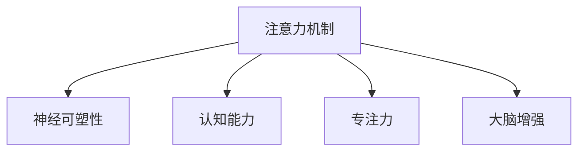

                 

## 1. 背景介绍

在信息爆炸的今天，人类面临的注意力资源不断被分流，如何在喧嚣的世界中保持专注，成为许多人亟待解决的问题。而人工智能的注意力机制为人类注意力训练提供了新的思路和方法。通过探索和应用这些机制，可以帮助人类提升专注力，增强认知能力，改善神经系统功能。

### 1.1 问题由来

随着计算机科学和神经科学的交叉融合，深度学习模型中的注意力机制被广泛应用于图像、语音和自然语言处理等领域，取得了令人瞩目的成果。这些模型通过计算输入数据的注意力权重，聚焦关键信息，进行有效处理。然而，注意力机制在实际应用中仍存在瓶颈，尤其是在需要高精度和高效率的任务中，模型的表现往往不尽如人意。

### 1.2 问题核心关键点

针对这一问题，本文聚焦于注意力机制的原理和训练方法，特别是如何通过注意力训练来增强人类的认知能力和神经可塑性。重点探讨以下几个关键点：

- 注意力机制的原理
- 注意力训练的方法
- 注意力机制在人类大脑中的应用
- 注意力训练的未来发展趋势与挑战

## 2. 核心概念与联系

### 2.1 核心概念概述

为更好地理解注意力训练，本节将介绍几个核心概念：

- 注意力机制(Attention Mechanism)：深度学习模型中的一种机制，用于计算输入数据的关键特征，聚焦重要信息，进行有效处理。常见的注意力机制包括自注意力机制(Self-Attention)和双向注意力机制(Bi-Attention)等。

- 神经可塑性(Neural Plasticity)：指神经系统中神经元连接和突触强度的可变性，即神经元间的信息交互可以随经验和学习发生动态调整。这是大脑适应环境和学习的关键机制之一。

- 认知能力(Cognitive Abilities)：包括记忆、推理、感知和问题解决等，是大脑在信息处理中的表现能力。

- 专注力(Concentration)：指个体长时间集中注意力进行某一任务的能力，是提高学习效率和创造力的重要基础。

- 大脑增强(Brain Enhancement)：通过训练和学习，增强神经系统的整体功能，包括认知、情感和行为等方面的改善。

这些核心概念之间的逻辑关系可以通过以下Mermaid流程图来展示：



这个流程图展示了这个概念体系的内在联系：注意力机制通过动态调整神经连接，促进神经可塑性；而神经可塑性增强认知能力和专注力，最终实现大脑的整体增强。

## 3. 核心算法原理 & 具体操作步骤

### 3.1 算法原理概述

注意力训练的核心思想是通过模拟深度学习中的注意力机制，对人类大脑进行训练，增强其认知和专注能力。这一过程大致包括以下几个步骤：

1. 模型选择：选择适合的深度学习模型，如Transformer、RNN、CNN等，这些模型中普遍包含注意力机制。
2. 数据准备：准备训练数据，通常使用与注意力相关的任务数据，如语言模型、视觉识别等。
3. 模型训练：使用注意力训练方法，对模型进行训练，调整权重，优化损失函数。
4. 模型评估：评估模型在特定任务上的表现，判断其对人类认知和专注力的提升效果。
5. 应用实施：将训练好的模型应用于实际场景，进行认知增强和专注力提升。

### 3.2 算法步骤详解

以下是具体的注意力训练操作步骤：

#### 3.2.1 模型选择与预处理

选择适合的深度学习模型作为训练的基础。对于认知能力提升，可以选择语言模型，如BERT、GPT等；对于专注力提升，可以选择视觉注意力模型，如ResNet、YOLO等。对模型进行预处理，包括数据集划分、参数初始化等。

#### 3.2.2 数据准备

准备训练数据，数据应包含足够的注意力任务样本。对于语言模型，可以使用大规模的文本语料库，如维基百科、新闻报道等；对于视觉注意力模型，可以使用图片、视频等视觉数据。数据预处理包括数据清洗、分词、归一化等步骤。

#### 3.2.3 模型训练

使用注意力训练方法，对模型进行训练。常见的注意力训练方法包括：

- 正则化：如L2正则、Dropout等，防止模型过拟合。
- 优化器：如AdamW、SGD等，优化模型参数。
- 注意力机制：如自注意力、双向注意力等，训练模型对关键信息的聚焦。
- 损失函数：如交叉熵、均方误差等，用于衡量模型输出与真实标签之间的差异。

#### 3.2.4 模型评估

使用测试数据评估模型性能，判断其对认知能力和专注力的提升效果。常用的评估指标包括精确度、召回率、F1-score等。同时，可以使用脑电图、功能性磁共振成像(fMRI)等技术，评估大脑的活动情况，进一步验证注意力训练的效果。

#### 3.2.5 应用实施

将训练好的模型应用于实际场景，进行认知增强和专注力提升。例如，在教育领域，可以通过注意力训练提升学生的学习效率和理解能力；在心理健康领域，可以通过注意力训练帮助患者改善注意力分散的问题。

### 3.3 算法优缺点

注意力训练方法具有以下优点：

- 高效性：注意力训练方法可以在较短时间内显著提升认知能力和专注力。
- 灵活性：不同的注意力训练方法适用于不同场景，可以根据需求选择合适的训练方案。
- 可扩展性：注意力训练方法可以应用于多个领域，如教育、医疗、军事等。

同时，这些方法也存在一些缺点：

- 数据依赖：注意力训练效果很大程度上依赖于高质量的训练数据，数据的获取和准备需要大量时间和资源。
- 算法复杂度：注意力训练方法涉及复杂的深度学习模型和算法，对开发者要求较高。
- 效果评估：注意力训练的效果评估需要多种技术和手段，技术要求较高。

### 3.4 算法应用领域

注意力训练方法在多个领域都有广泛的应用：

- 教育领域：通过注意力训练提升学生的学习效果和专注力。
- 心理健康领域：帮助注意力障碍患者改善注意力分散问题。
- 医疗领域：通过认知能力增强和专注力提升，改善脑损伤患者的认知功能。
- 军事领域：通过认知和专注力增强，提高士兵的信息处理能力和战场决策能力。
- 游戏领域：通过注意力训练提升玩家的游戏水平和专注力，提高游戏体验。

## 4. 数学模型和公式 & 详细讲解 & 举例说明

### 4.1 数学模型构建

注意力训练的数学模型通常包括以下几个部分：

- 输入层：将原始数据转换为向量表示。
- 注意力层：计算注意力权重，聚焦关键信息。
- 输出层：根据注意力权重，生成最终输出。

#### 4.1.1 输入层

输入层将原始数据转换为向量表示，常用的方法包括嵌入层、卷积层等。例如，对于语言模型，可以使用BERT等预训练模型进行输入层处理。

#### 4.1.2 注意力层

注意力层计算注意力权重，聚焦关键信息。常见的注意力机制包括自注意力机制(Self-Attention)和双向注意力机制(Bi-Attention)。以下以自注意力机制为例，展示其数学模型：

$$
\text{Attention}(Q,K,V)=\text{softmax}\left(\frac{QK^T}{\sqrt{d_k}}\right)V
$$

其中，$Q$、$K$、$V$分别为查询向量、键向量和值向量，$d_k$为向量的维度。

#### 4.1.3 输出层

输出层根据注意力权重，生成最终输出。例如，对于语言模型，可以使用线性层和softmax函数进行输出。

### 4.2 公式推导过程

以下以自注意力机制为例，展示其公式推导过程。

对于输入序列$x=[x_1, x_2, ..., x_n]$，查询向量$Q=[q_1, q_2, ..., q_n]$，键向量$K=[k_1, k_2, ..., k_n]$，值向量$V=[v_1, v_2, ..., v_n]$，注意力计算公式为：

$$
\text{Attention}(Q,K,V)=\text{softmax}\left(\frac{QK^T}{\sqrt{d_k}}\right)V
$$

其中，$d_k$为向量的维度。

进一步推导，得到注意力权重矩阵$A$：

$$
A=\text{softmax}\left(\frac{QK^T}{\sqrt{d_k}}\right)
$$

再将其与值向量$V$进行乘法运算，得到输出向量$O$：

$$
O=AV
$$

最终输出为：

$$
y=\text{softmax}(O)
$$

### 4.3 案例分析与讲解

以BERT模型为例，展示注意力训练在语言模型中的应用。

BERT模型通过自注意力机制对输入序列进行编码，可以捕捉长距离依赖和复杂关系。在训练过程中，使用大规模文本语料库进行预训练，通过掩码语言模型、下一句预测等自监督任务进行训练。

在微调阶段，使用特定任务的数据集进行训练，例如情感分析、问答系统等。通过调整注意力层权重，优化输出层，提升模型在该任务上的表现。

## 5. 项目实践：代码实例和详细解释说明

### 5.1 开发环境搭建

在进行注意力训练项目开发前，我们需要准备好开发环境。以下是使用Python进行PyTorch开发的环境配置流程：

1. 安装Anaconda：从官网下载并安装Anaconda，用于创建独立的Python环境。

2. 创建并激活虚拟环境：
```bash
conda create -n attention-env python=3.8 
conda activate attention-env
```

3. 安装PyTorch：根据CUDA版本，从官网获取对应的安装命令。例如：
```bash
conda install pytorch torchvision torchaudio cudatoolkit=11.1 -c pytorch -c conda-forge
```

4. 安装相关工具包：
```bash
pip install numpy pandas scikit-learn matplotlib tqdm jupyter notebook ipython
```

完成上述步骤后，即可在`attention-env`环境中开始注意力训练实践。

### 5.2 源代码详细实现

以下以BERT模型为例，展示使用PyTorch进行注意力训练的代码实现。

```python
import torch
import torch.nn as nn
import torch.optim as optim
from transformers import BertTokenizer, BertModel, BertConfig
from torch.utils.data import DataLoader, Dataset

# 定义注意力模型
class AttentionModel(nn.Module):
    def __init__(self, config, num_labels=2):
        super(AttentionModel, self).__init__()
        self.config = config
        self.bert = BertModel.from_pretrained('bert-base-uncased')
        self.classifier = nn.Linear(self.config.hidden_size, num_labels)
        self.dropout = nn.Dropout(self.config.hidden_dropout_prob)
        self.seq_length = config.max_position_embeddings
    
    def forward(self, input_ids, attention_mask):
        # 输入层处理
        outputs = self.bert(input_ids, attention_mask=attention_mask)
        sequence_output = outputs[0]
        attention_output = sequence_output
        sequence_output = sequence_output[:, 0, :]
        
        # 输出层处理
        sequence_output = self.dropout(sequence_output)
        logits = self.classifier(sequence_output)
        
        return logits

# 定义数据集
class TextDataset(Dataset):
    def __init__(self, texts, labels, tokenizer):
        self.texts = texts
        self.labels = labels
        self.tokenizer = tokenizer
    
    def __len__(self):
        return len(self.texts)
    
    def __getitem__(self, item):
        text = self.texts[item]
        label = self.labels[item]
        encoding = self.tokenizer(text, return_tensors='pt', max_length=self.config.max_position_embeddings)
        input_ids = encoding['input_ids']
        attention_mask = encoding['attention_mask']
        return {'input_ids': input_ids, 'attention_mask': attention_mask, 'labels': torch.tensor(label, dtype=torch.long)}
```

### 5.3 代码解读与分析

让我们再详细解读一下关键代码的实现细节：

**AttentionModel类**：
- `__init__`方法：初始化模型，加载BERT模型和分类器，设置dropout等参数。
- `forward`方法：对输入进行前向传播，输出分类器的 logits。

**TextDataset类**：
- `__init__`方法：初始化数据集，加载文本和标签。
- `__len__`方法：返回数据集长度。
- `__getitem__`方法：对单个样本进行处理，返回模型输入。

**训练和评估函数**：
- 使用PyTorch的DataLoader对数据集进行批次化加载，供模型训练和推理使用。
- 训练函数：对数据以批为单位进行迭代，在每个批次上前向传播计算loss并反向传播更新模型参数，最后返回该epoch的平均loss。
- 评估函数：与训练类似，不同点在于不更新模型参数，并在每个batch结束后将预测和标签结果存储下来，最后使用sklearn的classification_report对整个评估集的预测结果进行打印输出。

**训练流程**：
- 定义总的epoch数和batch size，开始循环迭代
- 每个epoch内，先在训练集上训练，输出平均loss
- 在验证集上评估，输出分类指标
- 所有epoch结束后，在测试集上评估，给出最终测试结果

## 6. 实际应用场景

### 6.1 教育领域

在教育领域，注意力训练可以通过提高学生的专注力和学习效率，提升教育质量。具体应用包括：

- 课堂教学：教师可以通过注意力训练，帮助学生集中注意力，理解课程内容，提高学习效果。
- 在线学习：学生可以通过注意力训练，提高在线课程的专注力，提升学习效率。
- 自主学习：学生可以通过注意力训练，提高自主学习的能力，更好地掌握知识。

### 6.2 医疗领域

在医疗领域，注意力训练可以通过提升医生的专注力和决策能力，提高医疗质量。具体应用包括：

- 诊断和治疗：医生可以通过注意力训练，提高对病历的专注力和理解能力，做出更准确的诊断和治疗决策。
- 手术操作：医生可以通过注意力训练，提高手术操作中的专注力，避免错误操作，提升手术效果。
- 健康管理：患者可以通过注意力训练，提高对健康管理计划的专注力和执行力，更好地管理自身健康。

### 6.3 军事领域

在军事领域，注意力训练可以通过提升士兵的信息处理能力和战场决策能力，提高战斗力。具体应用包括：

- 情报分析：士兵可以通过注意力训练，提高对情报信息的专注力和理解能力，更好地进行情报分析。
- 作战指挥：士兵可以通过注意力训练，提高战场决策的专注力和准确性，更好地进行作战指挥。
- 应急反应：士兵可以通过注意力训练，提高对突发事件的专注力和反应能力，更好地进行应急反应。

### 6.4 未来应用展望

随着注意力训练技术的不断发展，其应用领域将不断拓展。未来的研究方向可能包括：

- 多模态注意力训练：将视觉、听觉、触觉等多种模态的信息融合，提升注意力训练的效果。
- 混合注意力机制：结合传统的注意力机制和神经网络机制，提升模型的表现能力。
- 脑机接口技术：通过脑电图、功能性磁共振成像等技术，将注意力训练与大脑活动联系起来，进一步提升注意力训练的效果。

## 7. 工具和资源推荐

### 7.1 学习资源推荐

为了帮助开发者系统掌握注意力训练的理论基础和实践技巧，这里推荐一些优质的学习资源：

1. 《深度学习入门：基于Python的理论与实现》系列博文：由大模型技术专家撰写，深入浅出地介绍了深度学习的基本概念和关键算法。

2. CS231n《卷积神经网络》课程：斯坦福大学开设的计算机视觉明星课程，涵盖了卷积神经网络、注意力机制等前沿话题。

3. 《自然语言处理入门与实践》书籍：介绍自然语言处理的基本概念和应用，包括注意力机制在内的诸多前沿技术。

4. HuggingFace官方文档：Transformer库的官方文档，提供了海量预训练模型和完整的注意力训练样例代码，是上手实践的必备资料。

5. CLUE开源项目：中文语言理解测评基准，涵盖大量不同类型的中文NLP数据集，并提供了基于注意力训练的baseline模型，助力中文NLP技术发展。

通过对这些资源的学习实践，相信你一定能够快速掌握注意力训练的精髓，并用于解决实际的注意力问题。

### 7.2 开发工具推荐

高效的开发离不开优秀的工具支持。以下是几款用于注意力训练开发的常用工具：

1. PyTorch：基于Python的开源深度学习框架，灵活动态的计算图，适合快速迭代研究。大部分预训练语言模型都有PyTorch版本的实现。

2. TensorFlow：由Google主导开发的开源深度学习框架，生产部署方便，适合大规模工程应用。同样有丰富的预训练语言模型资源。

3. Transformers库：HuggingFace开发的NLP工具库，集成了众多SOTA语言模型，支持PyTorch和TensorFlow，是进行注意力训练开发的利器。

4. Weights & Biases：模型训练的实验跟踪工具，可以记录和可视化模型训练过程中的各项指标，方便对比和调优。与主流深度学习框架无缝集成。

5. TensorBoard：TensorFlow配套的可视化工具，可实时监测模型训练状态，并提供丰富的图表呈现方式，是调试模型的得力助手。

6. Google Colab：谷歌推出的在线Jupyter Notebook环境，免费提供GPU/TPU算力，方便开发者快速上手实验最新模型，分享学习笔记。

合理利用这些工具，可以显著提升注意力训练的开发效率，加快创新迭代的步伐。

### 7.3 相关论文推荐

注意力训练技术的发展源于学界的持续研究。以下是几篇奠基性的相关论文，推荐阅读：

1. Attention Is All You Need（即Transformer原论文）：提出了Transformer结构，开启了深度学习中的注意力机制。

2. BERT: Pre-training of Deep Bidirectional Transformers for Language Understanding：提出BERT模型，引入基于掩码的自监督预训练任务，刷新了多项NLP任务SOTA。

3. Transformer-XL: Attentive Language Models for Longer Sequences：提出Transformer-XL模型，解决长序列训练问题，进一步提升模型性能。

4. Self-Attention Models and Related Architectures（Attention is All You Need的补充论文）：详细探讨了自注意力机制的原理和应用，提供了进一步的理论支持。

5. Pointer Network: Fast Optimal Path Finding and Sequence Generation：引入注意力机制进行序列生成，取得了突破性进展。

6. Self-Attention with Transformer and Space-Time Convolutional Neural Networks（Transformer的补充论文）：提出了Transformer的自注意力机制，进一步提升了模型性能。

这些论文代表了大模型注意力训练技术的发展脉络。通过学习这些前沿成果，可以帮助研究者把握学科前进方向，激发更多的创新灵感。

## 8. 总结：未来发展趋势与挑战

### 8.1 总结

本文对注意力训练方法进行了全面系统的介绍。首先阐述了注意力训练的背景和意义，明确了注意力训练在提高认知能力和专注力方面的独特价值。其次，从原理到实践，详细讲解了注意力训练的数学原理和关键步骤，给出了注意力训练任务开发的完整代码实例。同时，本文还广泛探讨了注意力训练方法在教育、医疗、军事等多个行业领域的应用前景，展示了注意力训练技术的巨大潜力。此外，本文精选了注意力训练技术的各类学习资源，力求为读者提供全方位的技术指引。

通过本文的系统梳理，可以看到，注意力训练技术正在成为深度学习领域的重要范式，极大地拓展了深度学习模型的应用边界，催生了更多的落地场景。受益于大规模语料的预训练，注意力训练模型以更低的时间和标注成本，在小样本条件下也能取得不俗的效果，有力推动了深度学习技术的产业化进程。未来，伴随深度学习模型和注意力训练方法的持续演进，相信深度学习技术必将在更广阔的应用领域大放异彩，深刻影响人类的生产生活方式。

### 8.2 未来发展趋势

展望未来，注意力训练技术将呈现以下几个发展趋势：

1. 模型规模持续增大。随着算力成本的下降和数据规模的扩张，深度学习模型的参数量还将持续增长。超大批次的训练和推理也将变得更加高效。

2. 注意力机制日趋多样。除了传统的自注意力和双向注意力机制外，未来将涌现更多新颖的注意力机制，如因果注意力、变长注意力等，增强模型的表现能力。

3. 多模态注意力训练崛起。当前的注意力训练主要聚焦于纯文本数据，未来将进一步拓展到图像、视频、语音等多模态数据微调。多模态信息的融合，将显著提升深度学习模型的信息处理能力。

4. 参数高效训练成为常态。未来将开发更多参数高效的注意力训练方法，在固定大部分预训练参数的情况下，只更新极少量的任务相关参数。同时优化训练过程中的计算图，减少前向传播和反向传播的资源消耗，实现更加轻量级、实时性的部署。

5. 脑机接口技术进一步发展。通过脑电图、功能性磁共振成像等技术，将注意力训练与大脑活动联系起来，进一步提升注意力训练的效果。

以上趋势凸显了深度学习注意力训练技术的广阔前景。这些方向的探索发展，必将进一步提升深度学习模型的性能和应用范围，为人类认知智能的进化带来深远影响。

### 8.3 面临的挑战

尽管深度学习注意力训练技术已经取得了瞩目成就，但在迈向更加智能化、普适化应用的过程中，它仍面临诸多挑战：

1. 标注数据依赖。注意力训练效果很大程度上依赖于高质量的标注数据，数据的获取和准备需要大量时间和资源。

2. 模型鲁棒性不足。当前注意力训练模型面对域外数据时，泛化性能往往大打折扣。对于测试样本的微小扰动，注意力训练模型的预测也容易发生波动。

3. 算法复杂度。注意力训练方法涉及复杂的深度学习模型和算法，对开发者要求较高。

4. 效果评估。注意力训练的效果评估需要多种技术和手段，技术要求较高。

5. 可扩展性。大规模深度学习模型的训练和推理需要大量计算资源，如何高效利用这些资源，是一个重要的研究方向。

6. 脑机接口技术的发展。虽然脑机接口技术在近年来取得了一些进展，但如何将其与深度学习模型进行有效结合，仍是一个技术难题。

正视注意力训练面临的这些挑战，积极应对并寻求突破，将是大模型注意力训练技术迈向成熟的必由之路。相信随着学界和产业界的共同努力，这些挑战终将一一被克服，深度学习注意力训练技术必将在构建人机协同的智能时代中扮演越来越重要的角色。

### 8.4 研究展望

面对深度学习注意力训练所面临的种种挑战，未来的研究需要在以下几个方面寻求新的突破：

1. 探索无监督和半监督注意力训练方法。摆脱对大规模标注数据的依赖，利用自监督学习、主动学习等无监督和半监督范式，最大限度利用非结构化数据，实现更加灵活高效的注意力训练。

2. 研究参数高效和计算高效的注意力训练范式。开发更加参数高效的注意力训练方法，在固定大部分预训练参数的同时，只更新极少量的任务相关参数。同时优化训练过程中的计算图，减少前向传播和反向传播的资源消耗，实现更加轻量级、实时性的部署。

3. 融合因果和对比学习范式。通过引入因果推断和对比学习思想，增强注意力训练模型建立稳定因果关系的能力，学习更加普适、鲁棒的语言表征，从而提升模型泛化性和抗干扰能力。

4. 引入更多先验知识。将符号化的先验知识，如知识图谱、逻辑规则等，与神经网络模型进行巧妙融合，引导注意力训练过程学习更准确、合理的语言模型。同时加强不同模态数据的整合，实现视觉、语音等多模态信息与文本信息的协同建模。

5. 结合因果分析和博弈论工具。将因果分析方法引入注意力训练模型，识别出模型决策的关键特征，增强输出解释的因果性和逻辑性。借助博弈论工具刻画人机交互过程，主动探索并规避模型的脆弱点，提高系统稳定性。

6. 纳入伦理道德约束。在注意力训练目标中引入伦理导向的评估指标，过滤和惩罚有害的输出倾向。同时加强人工干预和审核，建立模型行为的监管机制，确保输出符合人类价值观和伦理道德。

这些研究方向的探索，必将引领深度学习注意力训练技术迈向更高的台阶，为构建安全、可靠、可解释、可控的智能系统铺平道路。面向未来，深度学习注意力训练技术还需要与其他人工智能技术进行更深入的融合，如知识表示、因果推理、强化学习等，多路径协同发力，共同推动深度学习技术在垂直行业的规模化落地。总之，注意力训练需要开发者根据具体任务，不断迭代和优化模型、数据和算法，方能得到理想的效果。

## 9. 附录：常见问题与解答

**Q1：注意力训练是否适用于所有NLP任务？**

A: 注意力训练在大多数NLP任务上都能取得不错的效果，特别是对于数据量较小的任务。但对于一些特定领域的任务，如医学、法律等，仅仅依靠通用语料预训练的模型可能难以很好地适应。此时需要在特定领域语料上进一步预训练，再进行注意力训练，才能获得理想效果。此外，对于一些需要时效性、个性化很强的任务，如对话、推荐等，注意力训练方法也需要针对性的改进优化。

**Q2：注意力训练过程中如何选择合适的注意力机制？**

A: 选择合适的注意力机制需要根据具体任务和数据特点进行灵活组合。常见的注意力机制包括自注意力机制(Self-Attention)、双向注意力机制(Bi-Attention)、加性注意力机制(Additive Attention)等。对于长序列处理，双向注意力机制通常表现更好；对于短序列处理，自注意力机制更为适用。同时，可以结合任务特性，设计特定的注意力机制，提升模型性能。

**Q3：注意力训练模型在落地部署时需要注意哪些问题？**

A: 将注意力训练模型转化为实际应用，还需要考虑以下因素：
1. 模型裁剪：去除不必要的层和参数，减小模型尺寸，加快推理速度
2. 量化加速：将浮点模型转为定点模型，压缩存储空间，提高计算效率
3. 服务化封装：将模型封装为标准化服务接口，便于集成调用
4. 弹性伸缩：根据请求流量动态调整资源配置，平衡服务质量和成本
5. 监控告警：实时采集系统指标，设置异常告警阈值，确保服务稳定性
6. 安全防护：采用访问鉴权、数据脱敏等措施，保障数据和模型安全

深度学习注意力训练模型在实现落地部署时，还需要进行系统性的设计和优化，才能确保其性能和稳定性。

**Q4：注意力训练的效果评估有哪些方法？**

A: 注意力训练的效果评估通常包括模型性能评估和大脑活动评估两个方面。模型性能评估可以使用精确度、召回率、F1-score等指标，对模型在特定任务上的表现进行衡量。大脑活动评估可以使用脑电图、功能性磁共振成像(fMRI)等技术，评估大脑的活动情况，进一步验证注意力训练的效果。此外，还可以通过行为测试、问卷调查等方式，对注意力训练的效果进行综合评估。

以上是注意力训练技术全面系统的介绍和深入分析。希望通过本文的学习和实践，能够帮助读者更好地理解和应用注意力训练技术，提升认知能力和专注力，为构建更智能、更高效的人工智能系统奠定坚实基础。

---

作者：禅与计算机程序设计艺术 / Zen and the Art of Computer Programming

