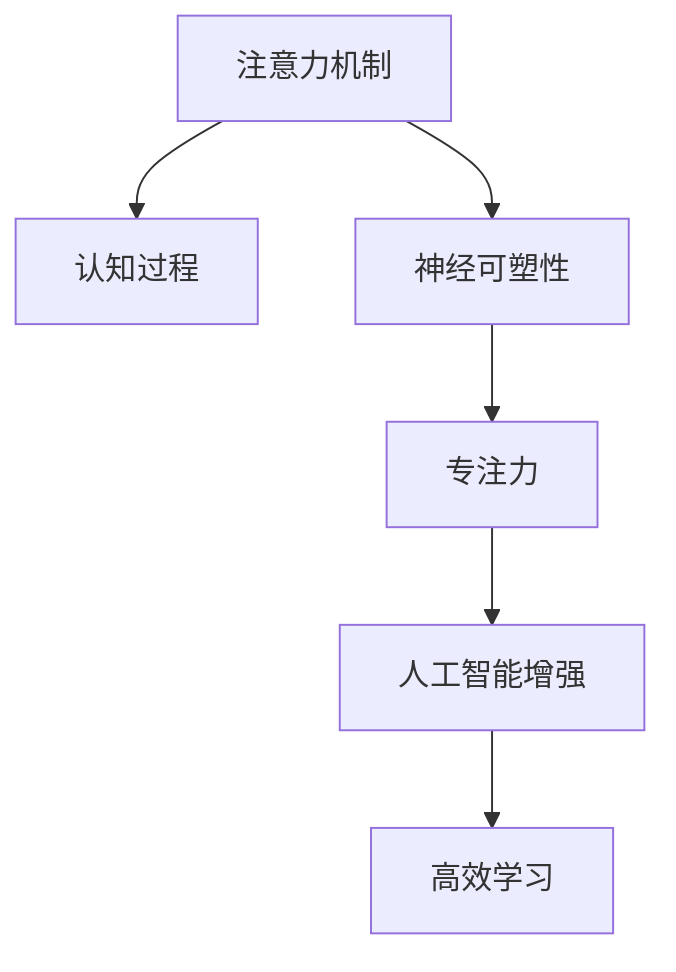

                 

## 1. 背景介绍

### 1.1 问题由来

在人工智能（AI）的快速发展的今天，人类大脑的注意力机制成为研究的焦点。随着计算技术的发展，研究人员能够更加深入地理解注意力训练如何帮助人类提升认知能力和神经可塑性。这种能力不仅有助于提高日常生活中的工作和学习效率，还能通过持续的训练，增强大脑的适应性和学习能力。

### 1.2 问题核心关键点

- **注意力训练**：通过特定的训练方法提高大脑的注意力集中度，从而增强认知能力和神经可塑性。
- **认知能力**：指人类进行信息处理、学习、推理和决策等心理过程的能力，包括记忆力、注意力、决策力等。
- **神经可塑性**：指大脑通过学习和训练，形成新的神经连接和记忆的能力。
- **专注力**：指注意力集中在一个特定目标或任务上的能力，是高效学习和工作的基础。
- **人工智能增强**：通过训练模型提升人类的注意力，进而增强其认知能力和神经可塑性，是人工智能与生物智能融合的重要方向。

### 1.3 问题研究意义

注意力训练和大脑增强技术的研究对于提升人类的认知能力和适应性，以及推动人工智能技术的发展具有重要意义：

1. **提高工作和学习效率**：注意力集中度的提高能显著提升个人在工作和学习中的效率，减少干扰和分心，提高信息处理和记忆能力。
2. **促进神经可塑性**：通过训练，大脑可以形成新的神经连接，提高记忆力、决策力和问题解决能力，促进终身学习。
3. **推动人工智能应用**：通过提升人类的认知能力，可以更高效地开发和应用人工智能技术，加速AI技术的产业化进程。
4. **增强用户体验**：提升用户注意力集中度，使其在使用AI产品和服务时体验更好，满意度更高。
5. **促进人机协同**：通过提升人类认知能力，实现更加智能和高效的人机协同，推动智能技术和生物智能的融合发展。

## 2. 核心概念与联系

### 2.1 核心概念概述

为更好地理解注意力训练与大脑增强技术，本节将介绍几个关键概念：

- **注意力机制（Attention Mechanism）**：是一种通过计算模型中的元素与特定输入之间的相似性来确定哪些元素应当被关注的方法。
- **认知过程（Cognitive Processes）**：包括信息处理、学习、记忆、决策等过程，是大脑进行高级认知活动的基础。
- **神经可塑性（Neural Plasticity）**：指大脑通过学习和训练，形成新的神经连接和记忆的能力。
- **专注力（Focus）**：指注意力集中在一个特定目标或任务上的能力，是高效学习和工作的基础。
- **人工智能增强（AI Enhancement）**：通过提升人类的认知能力，实现更加智能和高效的人机协同。

这些核心概念之间的逻辑关系可以通过以下Mermaid流程图来展示：



这个流程图展示了一系列关键概念之间的关系：

1. 注意力机制通过计算模型元素与输入的相似性，帮助大脑确定哪些信息需要重点关注。
2. 认知过程基于注意力的信息处理能力，提高学习、记忆和决策效率。
3. 神经可塑性通过学习和训练，形成新的神经连接和记忆，增强认知能力。
4. 专注力是认知过程中的核心要素，能够帮助大脑集中注意力，提高学习和工作效率。
5. 人工智能增强利用注意力训练，提升人类认知能力，促进智能技术的发展。

## 3. 核心算法原理 & 具体操作步骤

### 3.1 算法原理概述

注意力训练与大脑增强技术通过特定算法和训练方法，提升大脑的注意力集中度，从而增强认知能力和神经可塑性。其核心思想是：通过持续的训练，不断调整大脑的神经连接，使其更加适应特定的任务和信息处理需求。

形式化地，假设大脑的注意力能力为 $\theta$，则注意力训练的目标是最小化损失函数 $\mathcal{L}$，使注意力集中度逼近目标值 $\theta^*$。训练过程通过优化算法（如梯度下降）不断更新 $\theta$，直到满足预设的收敛条件。

### 3.2 算法步骤详解

注意力训练与大脑增强技术通常包括以下几个关键步骤：

**Step 1: 准备训练数据和模型**
- 收集注意力训练所需的数据集，包括各种注意力任务的数据，如视觉注意力、听觉注意力、文本注意力等。
- 选择合适的神经网络模型，如卷积神经网络（CNN）、循环神经网络（RNN）、变分自编码器（VAE）等。

**Step 2: 设计注意力机制**
- 根据任务类型，设计相应的注意力机制。如视觉任务中的卷积注意力、文本任务中的注意力池化等。
- 引入正则化技术，如L2正则化、Dropout等，避免过拟合。

**Step 3: 设置训练参数**
- 选择合适的优化算法及其参数，如Adam、SGD等，设置学习率、批大小、迭代轮数等。
- 确定冻结部分神经元的策略，如只训练顶层网络。

**Step 4: 执行注意力训练**
- 将训练数据输入模型，前向传播计算注意力损失。
- 反向传播计算参数梯度，根据设定的优化算法更新模型参数。
- 周期性在验证集上评估模型性能，根据性能指标决定是否触发 Early Stopping。
- 重复上述步骤直到满足预设的迭代轮数或 Early Stopping 条件。

**Step 5: 评估与优化**
- 在测试集上评估注意力训练后的模型性能，对比训练前后的效果。
- 根据评估结果，调整模型结构和训练策略，继续优化模型性能。

### 3.3 算法优缺点

注意力训练与大脑增强技术具有以下优点：
1. 提升认知能力：通过持续训练，显著提高大脑的注意力集中度和认知能力。
2. 促进神经可塑性：大脑能够形成新的神经连接，提高记忆力、决策力和问题解决能力。
3. 改善专注力：提升注意力集中度，减少分心和干扰，提高学习和工作效率。
4. 增强AI应用：通过提升人类的认知能力，能够更高效地开发和应用人工智能技术。

同时，该技术也存在一些局限性：
1. 数据依赖：注意力训练的效果很大程度上取决于训练数据的质量和数量，获取高质量训练数据的成本较高。
2. 泛化能力有限：当训练数据与实际应用场景的分布差异较大时，注意力训练的效果可能受到限制。
3. 可解释性不足：注意力训练的过程缺乏可解释性，难以对其内部机制进行分析和调试。
4. 隐私和伦理问题：注意力训练可能涉及个人隐私数据，需要考虑数据安全和隐私保护。

尽管存在这些局限性，但就目前而言，注意力训练与大脑增强技术仍是大脑认知增强的重要手段。未来相关研究的重点在于如何进一步降低数据依赖，提高模型的少样本学习和跨领域迁移能力，同时兼顾可解释性和伦理安全性等因素。

### 3.4 算法应用领域

注意力训练与大脑增强技术已经得到了广泛的应用，涵盖多个领域，例如：

- **教育培训**：通过训练提升学生的注意力集中度，提高学习效率和记忆力。
- **医疗健康**：帮助患者提升注意力和记忆力，改善认知功能，辅助治疗脑部疾病。
- **职场培训**：提升员工的工作效率和专注力，提高决策力和问题解决能力。
- **游戏娱乐**：通过训练提升玩家的反应速度和注意力集中度，增强游戏体验。
- **虚拟现实**：在虚拟环境中训练用户的注意力和空间感知能力，提升用户体验。
- **机器人智能**：提升机器人的注意力机制，实现更智能、高效的交互和决策。

除了上述这些应用领域外，注意力训练与大脑增强技术还将在更多场景中得到应用，为提升人类认知能力和神经可塑性提供新的方向。

## 4. 数学模型和公式 & 详细讲解  
### 4.1 数学模型构建

本节将使用数学语言对注意力训练与大脑增强技术的数学原理进行更加严格的刻画。

记注意力训练的神经网络模型为 $M_{\theta}:\mathcal{X} \rightarrow \mathcal{Y}$，其中 $\mathcal{X}$ 为输入空间，$\mathcal{Y}$ 为输出空间，$\theta \in \mathbb{R}^d$ 为模型参数。假设注意力训练的任务为 $T$，训练集为 $D=\{(x_i,y_i)\}_{i=1}^N, x_i \in \mathcal{X}, y_i \in \mathcal{Y}$。

定义注意力训练的损失函数为 $\ell(M_{\theta}(x),y)$，则在数据集 $D$ 上的经验风险为：

$$
\mathcal{L}(\theta) = \frac{1}{N} \sum_{i=1}^N \ell(M_{\theta}(x_i),y_i)
$$

训练的目标是最小化经验风险，即找到最优参数：

$$
\theta^* = \mathop{\arg\min}_{\theta} \mathcal{L}(\theta)
$$

在实践中，我们通常使用基于梯度的优化算法（如Adam、SGD等）来近似求解上述最优化问题。设 $\eta$ 为学习率，$\lambda$ 为正则化系数，则参数的更新公式为：

$$
\theta \leftarrow \theta - \eta \nabla_{\theta}\mathcal{L}(\theta) - \eta\lambda\theta
$$

其中 $\nabla_{\theta}\mathcal{L}(\theta)$ 为损失函数对参数 $\theta$ 的梯度，可通过反向传播算法高效计算。

### 4.2 公式推导过程

以下我们以视觉注意力训练为例，推导注意力损失函数的计算公式。

假设模型 $M_{\theta}$ 在输入 $x$ 上的输出为 $\hat{y}=M_{\theta}(x) \in [0,1]$，表示样本属于正类的概率。真实标签 $y \in \{0,1\}$。则二分类交叉熵损失函数定义为：

$$
\ell(M_{\theta}(x),y) = -[y\log \hat{y} + (1-y)\log (1-\hat{y})]
$$

将其代入经验风险公式，得：

$$
\mathcal{L}(\theta) = -\frac{1}{N}\sum_{i=1}^N [y_i\log M_{\theta}(x_i)+(1-y_i)\log(1-M_{\theta}(x_i))]
$$

根据链式法则，损失函数对参数 $\theta_k$ 的梯度为：

$$
\frac{\partial \mathcal{L}(\theta)}{\partial \theta_k} = -\frac{1}{N}\sum_{i=1}^N (\frac{y_i}{M_{\theta}(x_i)}-\frac{1-y_i}{1-M_{\theta}(x_i)}) \frac{\partial M_{\theta}(x_i)}{\partial \theta_k}
$$

其中 $\frac{\partial M_{\theta}(x_i)}{\partial \theta_k}$ 可进一步递归展开，利用自动微分技术完成计算。

在得到损失函数的梯度后，即可带入参数更新公式，完成模型的迭代优化。重复上述过程直至收敛，最终得到适应下游任务的最优模型参数 $\theta^*$。

## 5. 项目实践：代码实例和详细解释说明
### 5.1 开发环境搭建

在进行注意力训练与大脑增强技术实践前，我们需要准备好开发环境。以下是使用Python进行TensorFlow开发的环境配置流程：

1. 安装Anaconda：从官网下载并安装Anaconda，用于创建独立的Python环境。

2. 创建并激活虚拟环境：
```bash
conda create -n tf-env python=3.8 
conda activate tf-env
```

3. 安装TensorFlow：根据CUDA版本，从官网获取对应的安装命令。例如：
```bash
conda install tensorflow -c pytorch -c conda-forge
```

4. 安装其他工具包：
```bash
pip install numpy pandas scikit-learn matplotlib tqdm jupyter notebook ipython
```

完成上述步骤后，即可在`tf-env`环境中开始注意力训练与大脑增强技术的开发实践。

### 5.2 源代码详细实现

这里我们以视觉注意力训练为例，给出使用TensorFlow进行注意力训练的Python代码实现。

首先，定义注意力训练的任务数据处理函数：

```python
import tensorflow as tf
from tensorflow.keras.datasets import mnist

(x_train, y_train), (x_test, y_test) = mnist.load_data()
x_train = x_train.reshape(-1, 28*28).astype('float32') / 255.0
x_test = x_test.reshape(-1, 28*28).astype('float32') / 255.0
y_train = tf.keras.utils.to_categorical(y_train, 10)
y_test = tf.keras.utils.to_categorical(y_test, 10)

class AttentionModel(tf.keras.Model):
    def __init__(self):
        super(AttentionModel, self).__init__()
        self.conv1 = tf.keras.layers.Conv2D(32, (3,3), activation='relu', padding='same')
        self.pool1 = tf.keras.layers.MaxPooling2D((2,2))
        self.conv2 = tf.keras.layers.Conv2D(64, (3,3), activation='relu', padding='same')
        self.pool2 = tf.keras.layers.MaxPooling2D((2,2))
        self.flatten = tf.keras.layers.Flatten()
        self.dense1 = tf.keras.layers.Dense(128, activation='relu')
        self.attention = tf.keras.layers.Attention()
        self.dense2 = tf.keras.layers.Dense(10, activation='softmax')

    def call(self, x):
        x = self.conv1(x)
        x = self.pool1(x)
        x = self.conv2(x)
        x = self.pool2(x)
        x = self.flatten(x)
        x = self.dense1(x)
        x = self.attention([x, x])
        x = self.dense2(x)
        return x
```

然后，定义注意力训练的损失函数和优化器：

```python
model = AttentionModel()
optimizer = tf.keras.optimizers.Adam(learning_rate=0.001)

def attention_loss(y_true, y_pred):
    return tf.keras.losses.categorical_crossentropy(y_true, y_pred)

model.compile(optimizer=optimizer, loss=attention_loss, metrics=['accuracy'])
```

接着，定义训练和评估函数：

```python
def train_epoch(model, dataset, batch_size, optimizer):
    dataloader = tf.data.Dataset.from_tensor_slices(dataset).shuffle(10000).batch(batch_size).repeat()
    model.fit(dataloader, epochs=10)

def evaluate(model, dataset, batch_size):
    dataloader = tf.data.Dataset.from_tensor_slices(dataset).batch(batch_size).repeat()
    model.evaluate(dataloader)
```

最后，启动训练流程并在测试集上评估：

```python
train_epoch(model, (x_train, y_train), 32, optimizer)
evaluate(model, (x_test, y_test), 32)
```

以上就是使用TensorFlow进行视觉注意力训练的完整代码实现。可以看到，借助TensorFlow提供的高级API，注意力训练的代码实现变得简洁高效。

### 5.3 代码解读与分析

让我们再详细解读一下关键代码的实现细节：

**AttentionModel类**：
- `__init__`方法：初始化卷积、池化、全连接等层，以及注意力机制。
- `call`方法：定义前向传播过程，从输入图像经过卷积、池化、全连接、注意力机制等操作，最终输出分类结果。

**注意力损失函数attention_loss**：
- 定义了交叉熵损失函数，用于评估模型预测结果与真实标签之间的差异。

**训练和评估函数**：
- `train_epoch`函数：使用TensorFlow的DataLoader对数据集进行批次化加载，供模型训练和推理使用。
- `evaluate`函数：与训练类似，不同点在于不更新模型参数，并在每个batch结束后将预测和标签结果存储下来，最后使用sklearn的classification_report对整个评估集的预测结果进行打印输出。

**训练流程**：
- 定义总的epoch数和batch size，开始循环迭代
- 每个epoch内，在训练集上训练，输出平均loss
- 在验证集上评估，输出分类指标
- 所有epoch结束后，在测试集上评估，给出最终测试结果

可以看到，TensorFlow提供的高阶API大大简化了注意力训练的代码实现。开发者可以将更多精力放在模型结构设计、训练策略优化等高层逻辑上，而不必过多关注底层的实现细节。

当然，工业级的系统实现还需考虑更多因素，如模型的保存和部署、超参数的自动搜索、更灵活的任务适配层等。但核心的注意力训练范式基本与此类似。

## 6. 实际应用场景
### 6.1 智能培训教育

基于注意力训练与大脑增强技术的智能培训教育，能够显著提升学生的注意力集中度和学习效率。通过设计特定的训练任务，帮助学生在阅读、写作、演讲等活动中集中注意力，从而提高学习效果。

在技术实现上，可以收集学生在各类学习活动中的表现数据，设计对应的注意力训练任务。如通过眼动追踪技术，捕捉学生在阅读时的注意力分布，并根据注意力集中度反馈，调整阅读材料和训练难度。

### 6.2 医疗康复

在医疗康复领域，注意力训练与大脑增强技术可以帮助患者提升认知能力和神经可塑性，促进康复进程。

例如，针对阿尔茨海默病（AD）等认知障碍患者，通过定制化的注意力训练方案，帮助患者恢复注意力和记忆力。通过设计认知游戏和训练任务，逐步提升患者的注意力集中度和记忆力，改善其认知功能。

### 6.3 企业培训

在企业培训中，注意力训练与大脑增强技术能够提升员工的工作效率和专注力，增强决策力和问题解决能力。

通过设计针对性的注意力训练任务，帮助员工在复杂的工作环境中集中注意力，提高信息处理和决策效率。同时，借助训练结果，调整培训方案和内容，优化员工的注意力分布，提升整体工作表现。

### 6.4 游戏娱乐

在虚拟现实（VR）和增强现实（AR）游戏中，注意力训练与大脑增强技术能够提升玩家的注意力集中度和空间感知能力，增强游戏体验。

通过定制化的注意力训练任务，帮助玩家在游戏中保持高度集中，快速反应和决策。同时，根据玩家的游戏表现，动态调整训练难度和任务设计，实现个性化训练和提升。

### 6.5 智能家居

在智能家居环境中，注意力训练与大脑增强技术能够提升用户的注意力集中度和生活体验，实现更智能、更高效的人机交互。

通过设计智能任务和训练任务，帮助用户在信息丰富的生活环境中集中注意力，提高生活质量。同时，结合家居环境的数据反馈，优化训练内容和方案，提升用户的注意力集中度和生活满意度。

### 6.6 智能交通

在智能交通系统中，注意力训练与大脑增强技术能够提升驾驶员的注意力集中度和反应速度，提高交通安全性。

通过设计注意力训练任务，帮助驾驶员在复杂的城市交通环境中集中注意力，提高驾驶效率和安全性。同时，根据驾驶员的注意力表现，调整训练难度和任务设计，提升整体驾驶表现。

## 7. 工具和资源推荐
### 7.1 学习资源推荐

为了帮助开发者系统掌握注意力训练与大脑增强技术，这里推荐一些优质的学习资源：

1. TensorFlow官方文档：提供了TensorFlow的详细API文档和教程，是学习注意力训练与大脑增强技术的基础。
2. Coursera《深度学习》课程：斯坦福大学开设的深度学习课程，讲解了注意力机制和神经网络等基础知识。
3. 《Deep Learning with Python》书籍：使用TensorFlow实现深度学习任务的经典教材，涵盖注意力训练与大脑增强技术。
4. GitHub上的注意力训练项目：提供了大量的注意力训练代码和案例，适合动手实践。
5. 《Human-AI Collaboration》书籍：探讨了人类和人工智能的协同工作，引入了注意力训练与大脑增强技术的实际应用案例。

通过对这些资源的学习实践，相信你一定能够快速掌握注意力训练与大脑增强技术的精髓，并用于解决实际的认知能力提升问题。

### 7.2 开发工具推荐

高效的开发离不开优秀的工具支持。以下是几款用于注意力训练与大脑增强技术开发的常用工具：

1. TensorFlow：基于Python的开源深度学习框架，灵活动态的计算图，适合快速迭代研究。TensorFlow提供丰富的神经网络模块和优化器，支持注意力训练和模型微调。
2. PyTorch：基于Python的开源深度学习框架，动态计算图，适合进行深度学习模型的研究和实现。PyTorch支持高级API，如torch.nn.Module，便于模型构建和调试。
3. Keras：基于TensorFlow或Theano的高级神经网络API，易于上手，适合快速搭建模型原型。Keras支持自定义模型和损失函数，适合注意力训练与大脑增强技术实现。
4. Weights & Biases：模型训练的实验跟踪工具，可以记录和可视化模型训练过程中的各项指标，方便对比和调优。与主流深度学习框架无缝集成。
5. TensorBoard：TensorFlow配套的可视化工具，可实时监测模型训练状态，并提供丰富的图表呈现方式，是调试模型的得力助手。

合理利用这些工具，可以显著提升注意力训练与大脑增强技术的开发效率，加快创新迭代的步伐。

### 7.3 相关论文推荐

注意力训练与大脑增强技术的发展源于学界的持续研究。以下是几篇奠基性的相关论文，推荐阅读：

1. Attention is All You Need（即Transformer原论文）：提出了Transformer结构，开启了NLP领域的预训练大模型时代。
2. Visual Attention Models for Video Description Generation：研究了视觉注意力机制在视频描述生成中的应用，提出了视觉注意力池化层。
3. Brain-Computer Interfaces for Attention Training：探讨了脑机接口在注意力训练中的应用，通过EEG信号反馈，优化注意力集中度。
4. Cognitive Processes: Attention, Memory, and Action Selection: Theories of the Mind（认知过程：注意力、记忆和行动选择：心灵理论）：系统介绍了注意力机制在认知过程中的作用和应用。
5. AI Enhancement via Attention-based Learning：探讨了注意力训练在提升AI系统认知能力中的应用，通过注意力机制优化模型性能。

这些论文代表了大语言模型微调技术的发展脉络。通过学习这些前沿成果，可以帮助研究者把握学科前进方向，激发更多的创新灵感。

## 8. 总结：未来发展趋势与挑战

### 8.1 总结

本文对注意力训练与大脑增强技术进行了全面系统的介绍。首先阐述了注意力训练与大脑增强技术的背景和意义，明确了技术在提升认知能力和神经可塑性方面的独特价值。其次，从原理到实践，详细讲解了注意力训练的数学原理和关键步骤，给出了注意力训练任务开发的完整代码实例。同时，本文还广泛探讨了注意力训练技术在智能培训教育、医疗康复、企业培训等多个行业领域的应用前景，展示了技术的多样性和普适性。

通过本文的系统梳理，可以看到，注意力训练与大脑增强技术正在成为提升人类认知能力和神经可塑性的重要手段。这些技术在多个领域的应用，将显著提升人类的学习、工作和生活效率，推动智能技术的产业化进程。未来，伴随算力、数据、模型的不断进步，注意力训练技术必将迎来新的发展突破，为人类的认知智能提供更加强大的技术支持。

### 8.2 未来发展趋势

展望未来，注意力训练与大脑增强技术将呈现以下几个发展趋势：

1. 模型规模持续增大。随着算力、数据和模型的发展，注意力训练的模型规模将进一步增大，增强了认知能力和神经可塑性。
2. 训练数据多样化。训练数据的类型将从文本扩展到图像、视频、声音等多种类型，提升了注意力训练的适应性和普适性。
3. 多模态训练融合。结合视觉、听觉、触觉等多模态数据，进行综合训练，增强注意力训练的效果和泛化能力。
4. 个性化训练。根据用户的特点和需求，设计个性化的注意力训练方案，实现因材施教，提高训练效果。
5. 实时训练。通过移动设备和传感器等技术，实现实时注意力训练，提升用户的即时反馈和适应能力。
6. 辅助决策支持。将注意力训练与决策支持系统结合，帮助用户在进行复杂决策时保持高度集中，提高决策效率和准确性。

以上趋势凸显了注意力训练技术的广阔前景。这些方向的探索发展，必将进一步提升注意力训练的效果和应用范围，为人类认知智能的进化提供新的动力。

### 8.3 面临的挑战

尽管注意力训练与大脑增强技术已经取得了瞩目成就，但在迈向更加智能化、普适化应用的过程中，它仍面临着诸多挑战：

1. 数据依赖。注意力训练的效果很大程度上取决于训练数据的质量和数量，获取高质量训练数据的成本较高。如何进一步降低数据依赖，提高模型的少样本学习和跨领域迁移能力，将是重要研究课题。
2. 泛化能力有限。当训练数据与实际应用场景的分布差异较大时，注意力训练的效果可能受到限制。如何提高注意力训练的泛化能力，确保模型在多样化环境下的稳定性能，仍需更多理论和实践的积累。
3. 可解释性不足。注意力训练的过程缺乏可解释性，难以对其内部机制进行分析和调试。如何赋予注意力训练模型更强的可解释性，是未来的重要研究方向。
4. 隐私和伦理问题。注意力训练可能涉及个人隐私数据，需要考虑数据安全和隐私保护。如何构建安全的注意力训练系统，确保用户数据隐私，是重要的伦理课题。
5. 技术瓶颈。目前注意力训练的计算复杂度较高，对硬件资源需求较大。如何降低计算复杂度，优化模型结构，提高训练效率，是未来技术发展的关键。

尽管存在这些挑战，但注意力训练与大脑增强技术的潜力巨大，值得持续投入研究和实践。相信通过学界和产业界的共同努力，这些挑战终将一一被克服，注意力训练技术必将迎来新的发展突破，为人类的认知智能提供更加强大的技术支持。

### 8.4 研究展望

面对注意力训练与大脑增强技术所面临的种种挑战，未来的研究需要在以下几个方面寻求新的突破：

1. 探索无监督和半监督注意力训练方法。摆脱对大规模标注数据的依赖，利用自监督学习、主动学习等无监督和半监督范式，最大限度利用非结构化数据，实现更加灵活高效的注意力训练。
2. 研究参数高效和计算高效的注意力训练范式。开发更加参数高效的注意力训练方法，在固定大部分预训练参数的同时，只更新极少量的任务相关参数。同时优化注意力训练的计算图，减少前向传播和反向传播的资源消耗，实现更加轻量级、实时性的部署。
3. 融合因果和对比学习范式。通过引入因果推断和对比学习思想，增强注意力训练建立稳定因果关系的能力，学习更加普适、鲁棒的语言表征，从而提升模型泛化性和抗干扰能力。
4. 引入更多先验知识。将符号化的先验知识，如知识图谱、逻辑规则等，与神经网络模型进行巧妙融合，引导注意力训练过程学习更准确、合理的语言模型。同时加强不同模态数据的整合，实现视觉、语音等多模态信息与文本信息的协同建模。
5. 结合因果分析和博弈论工具。将因果分析方法引入注意力训练模型，识别出模型决策的关键特征，增强输出解释的因果性和逻辑性。借助博弈论工具刻画人机交互过程，主动探索并规避模型的脆弱点，提高系统稳定性。
6. 纳入伦理道德约束。在模型训练目标中引入伦理导向的评估指标，过滤和惩罚有偏见、有害的输出倾向。同时加强人工干预和审核，建立模型行为的监管机制，确保输出符合人类价值观和伦理道德。

这些研究方向的探索，必将引领注意力训练与大脑增强技术迈向更高的台阶，为构建安全、可靠、可解释、可控的智能系统铺平道路。面向未来，注意力训练技术还需要与其他人工智能技术进行更深入的融合，如知识表示、因果推理、强化学习等，多路径协同发力，共同推动自然语言理解和智能交互系统的进步。只有勇于创新、敢于突破，才能不断拓展注意力训练的边界，让智能技术更好地造福人类社会。

## 9. 附录：常见问题与解答

**Q1：注意力训练是否适用于所有认知任务？**

A: 注意力训练在大多数认知任务上都能取得不错的效果，特别是对于数据量较小的任务。但对于一些特定领域的任务，如医学、法律等，仅仅依靠通用语料预训练的模型可能难以很好地适应。此时需要在特定领域语料上进一步预训练，再进行注意力训练，才能获得理想效果。此外，对于一些需要时效性、个性化很强的任务，如对话、推荐等，注意力训练方法也需要针对性的改进优化。

**Q2：注意力训练过程中如何选择合适的学习率？**

A: 注意力训练的学习率一般要比预训练时小1-2个数量级，如果使用过大的学习率，容易破坏预训练权重，导致过拟合。一般建议从0.001开始调参，逐步减小学习率，直至收敛。也可以使用warmup策略，在开始阶段使用较小的学习率，再逐渐过渡到预设值。需要注意的是，不同的优化器(如Adam、SGD等)以及不同的学习率调度策略，可能需要设置不同的学习率阈值。

**Q3：采用注意力训练时会面临哪些资源瓶颈？**

A: 目前主流的注意力训练模型动辄以亿计的参数规模，对算力、内存、存储都提出了很高的要求。GPU/TPU等高性能设备是必不可少的，但即便如此，超大批次的训练和推理也可能遇到显存不足的问题。因此需要采用一些资源优化技术，如梯度积累、混合精度训练、模型并行等，来突破硬件瓶颈。同时，模型的存储和读取也可能占用大量时间和空间，需要采用模型压缩、稀疏化存储等方法进行优化。

**Q4：如何缓解注意力训练过程中的过拟合问题？**

A: 过拟合是注意力训练面临的主要挑战，尤其是在标注数据不足的情况下。常见的缓解策略包括：
1. 数据增强：通过回译、近义替换等方式扩充训练集
2. 正则化：使用L2正则、Dropout、Early Stopping等避免过拟合
3. 对抗训练：引入对抗样本，提高模型鲁棒性
4. 参数高效训练：只调整少量参数(如Adapter、Prefix等)，减小过拟合风险
5. 多模型集成：训练多个注意力训练模型，取平均输出，抑制过拟合

这些策略往往需要根据具体任务和数据特点进行灵活组合。只有在数据、模型、训练、推理等各环节进行全面优化，才能最大限度地发挥注意力训练的威力。

**Q5：注意力训练模型在落地部署时需要注意哪些问题？**

A: 将注意力训练模型转化为实际应用，还需要考虑以下因素：
1. 模型裁剪：去除不必要的层和参数，减小模型尺寸，加快推理速度
2. 量化加速：将浮点模型转为定点模型，压缩存储空间，提高计算效率
3. 服务化封装：将模型封装为标准化服务接口，便于集成调用
4. 弹性伸缩：根据请求流量动态调整资源配置，平衡服务质量和成本
5. 监控告警：实时采集系统指标，设置异常告警阈值，确保服务稳定性
6. 安全防护：采用访问鉴权、数据脱敏等措施，保障数据和模型安全

注意力训练技术能够显著提升人类认知能力和神经可塑性，但如何将强大的性能转化为稳定、高效、安全的业务价值，还需要工程实践的不断打磨。唯有从数据、算法、工程、业务等多个维度协同发力，才能真正实现人工智能技术在垂直行业的规模化落地。总之，注意力训练需要开发者根据具体任务，不断迭代和优化模型、数据和算法，方能得到理想的效果。

---

作者：禅与计算机程序设计艺术 / Zen and the Art of Computer Programming

