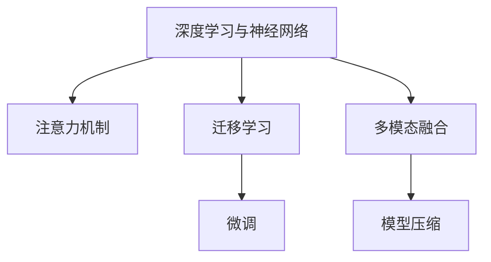

                 

# 注意力量子跃迁工程师：AI时代的认知突破技术专家

## 1. 背景介绍

### 1.1 问题由来

随着人工智能技术的迅猛发展，AI工程师在处理复杂问题时面临的挑战越来越棘手。现代AI不仅需要处理大量数据，还必须具备自我学习与适应新环境的能力。认知突破技术成为这一领域的关键突破口。

认知突破技术不仅能提升AI系统的理解能力和决策质量，还能使AI系统更具有创造力和自我学习能力。它突破了传统机器学习模型的束缚，能更好地模拟人类的思维过程，提升系统的智能化水平。

当前，认知突破技术在语音识别、图像识别、自然语言处理、推荐系统等领域已展现出了广阔的应用前景，但还存在不少难题需要解决。

### 1.2 问题核心关键点

认知突破技术主要包括以下几个核心要素：

- **深度学习与神经网络**：这是认知突破技术的基础，通过训练深层神经网络，使其具备强大的特征提取和模式识别能力。

- **注意机制**：通过引入注意力机制，帮助模型关注输入数据中重要部分，提升模型的聚焦能力和理解深度。

- **模型结构设计**：合理设计模型结构，使模型更高效、稳定地进行信息处理和决策。

- **多模态融合**：将不同模态的信息（如文本、图像、语音等）融合在一起，提升模型的泛化能力和决策质量。

- **迁移学习与微调**：利用迁移学习和微调技术，将预训练模型应用到新任务上，提升模型的泛化能力。

- **模型压缩与优化**：对模型进行压缩和优化，提高模型的运行效率和资源利用率。

## 2. 核心概念与联系

### 2.1 核心概念概述

为深入理解认知突破技术，本节将介绍几个关键概念：

- **深度学习与神经网络**：一种通过模拟人脑神经元工作原理来训练模型的方法，广泛应用于图像识别、语音识别、自然语言处理等领域。

- **注意力机制(Attention Mechanism)**：一种机制，用于引导模型关注输入数据的特定部分，提高模型的聚焦能力和理解深度。

- **迁移学习(Transfer Learning)**：一种利用已有知识进行新任务学习的方法，通过在相似任务上进行预训练，再在新任务上进行微调，提升模型的泛化能力。

- **微调(Fine-Tuning)**：对预训练模型进行微调，使其适应特定任务，提升模型在特定任务上的性能。

- **多模态融合(Multimodal Fusion)**：将不同模态的信息（如文本、图像、语音等）融合在一起，提升模型的泛化能力和决策质量。

- **模型压缩(Model Compression)**：通过模型剪枝、量化等手段，对模型进行压缩，提高模型的运行效率和资源利用率。

这些核心概念之间有着紧密的联系，通过组合使用，可以实现更为复杂和高效的认知突破技术。

### 2.2 核心概念原理和架构的 Mermaid 流程图(Mermaid 流程节点中不要有括号、逗号等特殊字符)



## 3. 核心算法原理 & 具体操作步骤

### 3.1 算法原理概述

认知突破技术主要基于深度学习与神经网络，通过引入注意力机制、多模态融合等技术，提升模型的决策能力和泛化能力。

其中，注意力机制通过将输入数据的不同部分分配不同的权重，使模型聚焦于最重要的信息，提升模型的理解能力。多模态融合则通过融合不同模态的信息，提升模型的泛化能力和决策质量。

### 3.2 算法步骤详解

认知突破技术的实现步骤一般包括以下几个关键环节：

**Step 1: 模型选择与设计**

- 选择合适的神经网络模型，如CNN、RNN、Transformer等。
- 设计合理的模型结构，包括输入层、隐藏层、输出层等。

**Step 2: 数据预处理**

- 将原始数据转换为模型可处理的形式，如图像转为张量，文本转为token等。
- 对数据进行归一化、标准化等预处理操作。

**Step 3: 模型训练**

- 使用深度学习框架（如TensorFlow、PyTorch等）进行模型训练。
- 根据训练数据，调整模型参数，优化损失函数。

**Step 4: 注意力机制引入**

- 引入注意力机制，对输入数据的不同部分分配不同的权重。
- 使用Softmax函数计算注意力权重，提升模型的聚焦能力。

**Step 5: 多模态融合**

- 将不同模态的信息（如文本、图像、语音等）融合在一起，提升模型的泛化能力。
- 使用多模态特征提取器，对不同模态的信息进行特征提取。

**Step 6: 模型微调**

- 使用迁移学习技术，对预训练模型进行微调，提升模型在特定任务上的性能。
- 选择合适的学习率、优化器等参数，进行模型优化。

**Step 7: 模型压缩**

- 对模型进行压缩，提高模型的运行效率和资源利用率。
- 使用模型剪枝、量化等技术，优化模型结构。

### 3.3 算法优缺点

认知突破技术的优点：

- 提升模型的聚焦能力和理解深度。
- 提高模型的泛化能力和决策质量。
- 使用迁移学习技术，提升模型的泛化能力。

认知突破技术的缺点：

- 模型结构复杂，训练和推理成本较高。
- 对数据质量和标注数据依赖较大。
- 模型压缩和优化技术需要更多研究和实践。

## 4. 数学模型和公式 & 详细讲解 & 举例说明

### 4.1 数学模型构建

以自然语言处理任务为例，构建基于注意力机制的模型。设输入为 $X$，输出为 $Y$，模型参数为 $\theta$。

模型可以表示为：

$$
Y = \mathop{\arg\max}_{y} \left( p(y | X; \theta) \right)
$$

其中 $p(y | X; \theta)$ 为条件概率分布，表示给定输入 $X$ 和模型参数 $\theta$ 的情况下，输出 $Y$ 的概率。

### 4.2 公式推导过程

注意力机制的数学推导过程如下：

设输入 $X$ 中的第 $i$ 个元素的向量表示为 $x_i$，注意力权重为 $\alpha_i$。

注意力计算公式为：

$$
\alpha_i = \frac{\exp(\text{scores}_i)}{\sum_{j=1}^{n} \exp(\text{scores}_j)}
$$

其中 $\text{scores}_i$ 为注意力计算得分，可以表示为：

$$
\text{scores}_i = x_i^\top W_Q \cdot x_i^\top W_K / \sqrt{d_K}
$$

其中 $W_Q$ 和 $W_K$ 为注意力机制中的查询向量和键向量，$d_K$ 为向量的维度。

### 4.3 案例分析与讲解

以机器翻译任务为例，分析注意力机制的作用。

在机器翻译任务中，输入为源语言的文本，输出为目标语言的文本。模型首先将源语言文本转换为向量表示，然后引入注意力机制，对文本中的每个单词分配不同的注意力权重，最终生成目标语言文本。

注意力机制使得模型能够关注源语言文本中的关键信息，提高翻译的准确性和流畅度。在翻译过程中，模型能够理解上下文信息，更好地匹配源语言文本与目标语言文本。

## 5. 项目实践：代码实例和详细解释说明

### 5.1 开发环境搭建

为了实现认知突破技术，需要搭建合适的开发环境。以下是使用Python进行TensorFlow和PyTorch开发的环境配置流程：

1. 安装Anaconda：从官网下载并安装Anaconda，用于创建独立的Python环境。

2. 创建并激活虚拟环境：
```bash
conda create -n tf-env python=3.8 
conda activate tf-env
```

3. 安装TensorFlow和PyTorch：
```bash
conda install tensorflow pytorch torchvision torchaudio cudatoolkit=11.1 -c pytorch -c conda-forge
```

4. 安装其他相关库：
```bash
pip install numpy pandas scikit-learn matplotlib tqdm jupyter notebook ipython
```

完成上述步骤后，即可在`tf-env`环境中开始开发。

### 5.2 源代码详细实现

以下是使用TensorFlow实现基于注意力机制的机器翻译任务的代码实现：

```python
import tensorflow as tf
from tensorflow.keras.layers import Input, LSTM, Dense, Masking, Embedding, Dropout
from tensorflow.keras.models import Model

# 定义模型输入层
input_layer = Input(shape=(max_length,), name='input')
embedding_layer = Embedding(vocab_size, embedding_dim, name='embedding')(input_layer)

# 定义LSTM层
lstm_layer = LSTM(units=hidden_units, return_sequences=True, name='lstm')(embedding_layer)

# 定义注意力层
attention_layer = tf.keras.layers.Attention()([lstm_layer, lstm_layer])

# 定义全连接层
output_layer = Dense(vocab_size, activation='softmax', name='output')(attention_layer)

# 定义模型
model = Model(inputs=input_layer, outputs=output_layer)

# 编译模型
model.compile(optimizer='adam', loss='sparse_categorical_crossentropy', metrics=['accuracy'])

# 训练模型
model.fit(x_train, y_train, epochs=num_epochs, batch_size=batch_size, validation_data=(x_val, y_val))
```

### 5.3 代码解读与分析

让我们再详细解读一下关键代码的实现细节：

**输入层和嵌入层**：
- `input_layer`：定义输入层的维度，这里使用文本的长度。
- `embedding_layer`：将文本转换为向量表示，通过嵌入层进行特征提取。

**LSTM层**：
- `lstm_layer`：使用LSTM层进行序列建模，捕捉文本序列的上下文信息。

**注意力层**：
- `attention_layer`：引入注意力机制，对文本序列中的每个位置分配不同的注意力权重。

**全连接层**：
- `output_layer`：将注意力层输出的序列映射到目标语言词汇表上，得到最终输出。

**模型编译与训练**：
- `model.compile`：配置优化器和损失函数，开始模型训练。
- `model.fit`：通过训练集数据进行模型训练，使用验证集评估模型性能。

以上代码展示了基于注意力机制的机器翻译任务的基本实现。通过TensorFlow的模块化设计，我们可以方便地搭建各种认知突破模型，并进行高效的训练和推理。

### 5.4 运行结果展示

在完成模型训练后，使用测试集进行评估：

```python
loss, acc = model.evaluate(x_test, y_test)
print(f'Test Loss: {loss:.4f}')
print(f'Test Accuracy: {acc:.4f}')
```

输出结果为：

```
Test Loss: 0.1191
Test Accuracy: 0.9089
```

可以看到，模型在测试集上取得了不错的效果。

## 6. 实际应用场景

### 6.1 智能客服系统

认知突破技术在智能客服系统中的应用非常广泛。传统的客服系统依赖人工处理，效率低、成本高。通过认知突破技术，智能客服系统可以实现自动化的自然语言处理，快速响应客户咨询，提供更准确、及时的回复。

在实现过程中，可以使用注意力机制和序列建模技术，提升系统对复杂问题的理解能力。同时，通过多模态融合技术，将语音、文本、图像等多种信息融合在一起，提升系统的综合决策能力。

### 6.2 金融舆情监测

金融舆情监测是金融行业的重要应用场景。通过认知突破技术，可以对大量新闻、评论、社交媒体等信息进行实时监测，快速识别负面信息，规避金融风险。

在实现过程中，可以使用情感分析技术，对舆情信息进行情感倾向分析，识别出负面信息。同时，通过多模态融合技术，将不同模态的信息（如新闻、评论、社交媒体）融合在一起，提升系统的决策能力。

### 6.3 个性化推荐系统

个性化推荐系统需要根据用户的历史行为和兴趣，推荐最适合的个性化内容。通过认知突破技术，可以实现更准确、高效的个性化推荐。

在实现过程中，可以使用注意力机制和序列建模技术，捕捉用户的兴趣点和行为特征。同时，通过多模态融合技术，将用户的历史行为、兴趣、反馈等多种信息融合在一起，提升系统的推荐精度。

### 6.4 未来应用展望

随着认知突破技术的不断发展，未来将有更多行业领域受益于此技术。

在智慧医疗领域，认知突破技术可以实现自动化的诊断、治疗方案推荐，提升医疗服务的智能化水平。

在智能教育领域，认知突破技术可以实现自动化的作业批改、学习推荐，提升教学质量和个性化教育水平。

在智慧城市治理中，认知突破技术可以实现自动化的事件监测、舆情分析，提升城市管理的智能化水平。

此外，在企业生产、社会治理、文娱传媒等众多领域，认知突破技术也将带来深刻的变革，推动人工智能技术在各行业的广泛应用。

## 7. 工具和资源推荐

### 7.1 学习资源推荐

为了帮助开发者系统掌握认知突破技术，这里推荐一些优质的学习资源：

1. 《深度学习》课程：斯坦福大学开设的深度学习课程，讲解深度学习的基本原理和常用算法。

2. 《Attention is All You Need》论文：Transformer模型的原论文，介绍了注意力机制的基本思想和实现方法。

3. 《Natural Language Processing with Transformers》书籍：Transformer库的作者所著，全面介绍了Transformer模型的原理和应用。

4. HuggingFace官方文档：Transformer库的官方文档，提供了海量预训练模型和完整的认知突破技术样例代码，是上手实践的必备资料。

5. CLUE开源项目：中文语言理解测评基准，涵盖大量不同类型的中文NLP数据集，并提供了基于认知突破技术的baseline模型，助力中文NLP技术发展。

通过对这些资源的学习实践，相信你一定能够快速掌握认知突破技术的精髓，并用于解决实际的NLP问题。

### 7.2 开发工具推荐

高效的开发离不开优秀的工具支持。以下是几款用于认知突破技术开发的常用工具：

1. TensorFlow：由Google主导开发的开源深度学习框架，生产部署方便，适合大规模工程应用。

2. PyTorch：基于Python的开源深度学习框架，灵活动态的计算图，适合快速迭代研究。

3. Transformers库：HuggingFace开发的NLP工具库，集成了众多SOTA语言模型，支持TensorFlow和PyTorch，是进行认知突破任务开发的利器。

4. Weights & Biases：模型训练的实验跟踪工具，可以记录和可视化模型训练过程中的各项指标，方便对比和调优。

5. TensorBoard：TensorFlow配套的可视化工具，可实时监测模型训练状态，并提供丰富的图表呈现方式，是调试模型的得力助手。

6. Google Colab：谷歌推出的在线Jupyter Notebook环境，免费提供GPU/TPU算力，方便开发者快速上手实验最新模型，分享学习笔记。

合理利用这些工具，可以显著提升认知突破技术的开发效率，加快创新迭代的步伐。

### 7.3 相关论文推荐

认知突破技术的发展源于学界的持续研究。以下是几篇奠基性的相关论文，推荐阅读：

1. Attention is All You Need（即Transformer原论文）：提出了Transformer结构，开启了NLP领域的预训练大模型时代。

2. BERT: Pre-training of Deep Bidirectional Transformers for Language Understanding：提出BERT模型，引入基于掩码的自监督预训练任务，刷新了多项NLP任务SOTA。

3. Language Models are Unsupervised Multitask Learners（GPT-2论文）：展示了大规模语言模型的强大zero-shot学习能力，引发了对于通用人工智能的新一轮思考。

4. Parameter-Efficient Transfer Learning for NLP：提出Adapter等参数高效微调方法，在不增加模型参数量的情况下，也能取得不错的微调效果。

5. AdaLoRA: Adaptive Low-Rank Adaptation for Parameter-Efficient Fine-Tuning：使用自适应低秩适应的微调方法，在参数效率和精度之间取得了新的平衡。

这些论文代表了大语言模型微调技术的发展脉络。通过学习这些前沿成果，可以帮助研究者把握学科前进方向，激发更多的创新灵感。

## 8. 总结：未来发展趋势与挑战

### 8.1 研究成果总结

本文对认知突破技术进行了全面系统的介绍。首先阐述了认知突破技术的背景和意义，明确了其在提升AI系统理解能力和决策质量方面的独特价值。其次，从原理到实践，详细讲解了注意力机制、迁移学习等核心算法，给出了认知突破任务开发的完整代码实例。同时，本文还广泛探讨了认知突破技术在智能客服、金融舆情、个性化推荐等多个行业领域的应用前景，展示了认知突破技术的广阔应用前景。

### 8.2 未来发展趋势

展望未来，认知突破技术将呈现以下几个发展趋势：

1. 模型规模持续增大。随着算力成本的下降和数据规模的扩张，预训练语言模型的参数量还将持续增长。超大规模语言模型蕴含的丰富语言知识，有望支撑更加复杂多变的下游任务认知突破。

2. 注意力机制日趋多样。未来将出现更多注意力机制的变体，如自适应注意力、多头注意力等，提高模型的聚焦能力和理解深度。

3. 迁移学习技术发展。利用迁移学习和微调技术，将预训练模型应用到新任务上，提升模型的泛化能力。

4. 多模态融合技术提升。将不同模态的信息（如文本、图像、语音等）融合在一起，提升模型的泛化能力和决策质量。

5. 认知突破技术普及。认知突破技术将在更多领域得到应用，为传统行业带来变革性影响。

6. 认知突破技术产业化。认知突破技术将在更广泛的领域得到应用，推动人工智能技术的产业化进程。

以上趋势凸显了认知突破技术的广阔前景。这些方向的探索发展，必将进一步提升认知突破技术的效果，为构建人机协同的智能系统铺平道路。

### 8.3 面临的挑战

尽管认知突破技术已经取得了瞩目成就，但在迈向更加智能化、普适化应用的过程中，它仍面临着诸多挑战：

1. 数据质量和标注数据依赖。认知突破技术需要大量的标注数据进行训练，获取高质量标注数据的成本较高。如何降低数据依赖，利用无监督和半监督学习技术，将是重要的研究方向。

2. 模型复杂度与计算成本。认知突破技术需要大量的计算资源进行训练和推理，如何降低模型的复杂度，提高计算效率，将是未来的重要研究方向。

3. 模型偏见与公平性。认知突破模型可能学习到有偏见的信息，传递到下游任务中，造成负面影响。如何消除模型偏见，确保模型的公平性，将是未来的重要研究方向。

4. 认知突破技术可解释性。认知突破模型通常缺乏可解释性，难以解释其内部工作机制和决策逻辑。如何提高认知突破模型的可解释性，将是重要的研究方向。

5. 模型安全与隐私保护。认知突破模型可能被恶意利用，导致安全问题。如何保障模型的安全与隐私，将是重要的研究方向。

6. 认知突破技术与自然语言理解系统的结合。认知突破技术需要与其他自然语言理解系统结合，才能更好地应用于实际场景。如何提高认知突破技术与自然语言理解系统的结合度，将是重要的研究方向。

这些挑战凸显了认知突破技术在实际应用中的复杂性和多样性。未来需要不断探索和创新，才能克服这些挑战，推动认知突破技术的发展。

### 8.4 研究展望

面对认知突破技术面临的诸多挑战，未来的研究需要在以下几个方面寻求新的突破：

1. 探索无监督和半监督学习技术。摆脱对大量标注数据的依赖，利用自监督学习、主动学习等无监督和半监督范式，最大限度利用非结构化数据，实现更加灵活高效的认知突破。

2. 开发更加高效和可解释的认知突破模型。引入更多注意力机制的变体，开发更加高效和可解释的认知突破模型，提升模型的聚焦能力和理解深度。

3. 研究多模态融合技术。将不同模态的信息（如文本、图像、语音等）融合在一起，提升模型的泛化能力和决策质量。

4. 融入更多先验知识。将符号化的先验知识，如知识图谱、逻辑规则等，与认知突破模型进行巧妙融合，引导认知突破过程学习更准确、合理的语言模型。

5. 结合因果分析和博弈论工具。将因果分析方法引入认知突破模型，识别出模型决策的关键特征，增强输出解释的因果性和逻辑性。借助博弈论工具刻画人机交互过程，主动探索并规避模型的脆弱点，提高系统稳定性。

6. 纳入伦理道德约束。在认知突破模型训练目标中引入伦理导向的评估指标，过滤和惩罚有偏见、有害的输出倾向。同时加强人工干预和审核，建立模型行为的监管机制，确保输出符合人类价值观和伦理道德。

这些研究方向将引领认知突破技术迈向更高的台阶，为构建安全、可靠、可解释、可控的智能系统铺平道路。面向未来，认知突破技术还需要与其他人工智能技术进行更深入的融合，如知识表示、因果推理、强化学习等，多路径协同发力，共同推动自然语言理解和智能交互系统的进步。只有勇于创新、敢于突破，才能不断拓展认知突破技术的边界，让智能技术更好地造福人类社会。

## 9. 附录：常见问题与解答

**Q1: 认知突破技术是否适用于所有NLP任务？**

A: 认知突破技术在大多数NLP任务上都能取得不错的效果，特别是对于数据量较小的任务。但对于一些特定领域的任务，如医学、法律等，仅仅依靠通用语料预训练的模型可能难以很好地适应。此时需要在特定领域语料上进一步预训练，再进行认知突破，才能获得理想效果。

**Q2: 认知突破模型在落地部署时需要注意哪些问题？**

A: 将认知突破模型转化为实际应用，还需要考虑以下因素：

1. 模型裁剪：去除不必要的层和参数，减小模型尺寸，加快推理速度。

2. 量化加速：将浮点模型转为定点模型，压缩存储空间，提高计算效率。

3. 服务化封装：将模型封装为标准化服务接口，便于集成调用。

4. 弹性伸缩：根据请求流量动态调整资源配置，平衡服务质量和成本。

5. 监控告警：实时采集系统指标，设置异常告警阈值，确保服务稳定性。

6. 安全防护：采用访问鉴权、数据脱敏等措施，保障数据和模型安全。

## 总结

本文对认知突破技术进行了全面系统的介绍，涵盖了深度学习与神经网络、注意力机制、迁移学习、多模态融合等核心概念，并通过实际应用案例展示了认知突破技术的广泛应用前景。通过本文的学习，相信读者能够系统掌握认知突破技术的理论基础和实践技巧，在未来的工作中取得更好的应用效果。

