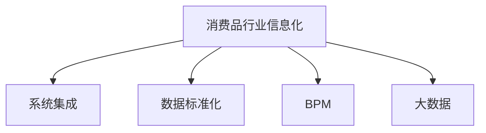

                 

# 消费品行业信息化整体建设和管理工作

## 1. 背景介绍

### 1.1 问题由来
随着信息技术的快速发展，消费品行业信息化建设已经成为企业提升竞争力和管理水平的重要手段。传统的消费品行业信息化建设存在以下问题：

1. 系统架构分散，数据孤岛严重，各系统之间信息不互通，无法实现数据的共享和集成。
2. 信息化系统维护成本高，后期升级和扩展困难。
3. 缺乏统一的标准和规范，导致数据质量和系统兼容性差，无法实现系统的互联互通。
4. 信息化的目标不明确，未能实现业务流程和数据管理的数字化转型。

### 1.2 问题核心关键点
为解决上述问题，需要构建一个统一、集成、可扩展的信息化平台，实现企业业务的数字化转型，提升企业的信息化管理水平。

### 1.3 问题研究意义
构建消费品行业信息化整体建设和管理工作，对于提升企业运营效率、降低运营成本、增强市场竞争力具有重要意义：

1. 提升运营效率：通过信息系统的集成和优化，能够提高业务流程的自动化水平，减少人工干预，提升运营效率。
2. 降低运营成本：整合多个信息系统，减少硬件和软件投资，提高资源利用率，降低运营成本。
3. 增强市场竞争力：通过数据驱动的决策，提升企业市场响应速度，优化产品和服务，增强市场竞争力。
4. 实现数字化转型：将企业的业务流程和数据管理数字化，实现数字化运营，提升企业的数字化水平。

## 2. 核心概念与联系

### 2.1 核心概念概述

为更好地理解消费品行业信息化整体建设和管理工作的核心概念，本节将介绍几个密切相关的核心概念：

- 消费品行业信息化：通过信息技术手段，对消费品行业的生产、采购、销售、物流等业务进行数字化管理和优化。
- 系统集成：将多个信息系统通过接口、数据交换等手段进行整合，实现数据的共享和业务流程的集成。
- 数据标准化：制定统一的数据标准和规范，确保数据的一致性和兼容性，为信息系统的集成提供基础。
- 业务流程管理(BPM)：通过信息系统，实现企业业务流程的数字化建模、优化和自动化。
- 大数据：通过收集、存储和分析大量数据，实现数据驱动的决策支持，提升企业的管理水平和运营效率。

这些核心概念之间的逻辑关系可以通过以下Mermaid流程图来展示：



这个流程图展示了一些关键概念之间的联系：

1. 消费品行业信息化是大系统构建的基础。
2. 系统集成是实现信息化的重要手段。
3. 数据标准化是信息系统的统一基础。
4. BPM和Big Data是信息化的高级应用。

这些概念共同构成了消费品行业信息化的完整框架，为企业的信息化建设和管理工作提供了指导和依据。

## 3. 核心算法原理 & 具体操作步骤

### 3.1 算法原理概述

消费品行业信息化整体建设和管理工作，本质上是通过信息技术和系统集成手段，实现企业业务流程的数字化转型。其核心思想是：

1. 对企业的业务流程进行数字化建模，利用信息系统实现业务流程的自动化和优化。
2. 对企业的数据进行标准化和整合，实现数据的共享和集成。
3. 引入大数据技术，实现数据驱动的决策支持，提升企业的管理水平和运营效率。

### 3.2 算法步骤详解

消费品行业信息化整体建设和管理工作的一般步骤包括：

**Step 1: 制定信息化规划**

- 根据企业的业务需求和目标，制定信息化建设规划，明确系统集成和数据标准化的要求。
- 确定系统架构和集成方案，选择合适的技术架构和平台。
- 制定数据管理策略，明确数据采集、存储、处理和分析的流程。

**Step 2: 系统集成**

- 对现有信息系统进行评估和优化，确定需要进行集成的系统。
- 设计系统的集成架构，包括接口定义、数据交换协议等。
- 进行系统集成，确保各系统之间的数据互通和业务流程协同。

**Step 3: 数据标准化**

- 制定统一的数据标准和规范，确保数据的一致性和兼容性。
- 对各业务系统的数据进行标准化处理，消除数据孤岛。
- 建立数据仓库和数据湖，实现数据的集中管理和分析。

**Step 4: 业务流程管理(BPM)**

- 对企业的业务流程进行数字化建模，构建流程模型。
- 利用信息系统实现业务流程的自动化和优化。
- 引入BPM工具，实现业务流程的监控和优化。

**Step 5: 引入大数据技术**

- 收集和存储企业内部和外部的海量数据，包括交易数据、客户数据、供应链数据等。
- 利用大数据技术进行数据处理和分析，提取有价值的信息。
- 建立数据驱动的决策支持系统，提升企业的管理水平和运营效率。

### 3.3 算法优缺点

消费品行业信息化整体建设和管理工作具有以下优点：

1. 提高效率：通过信息系统的集成和优化，能够提高业务流程的自动化水平，减少人工干预，提升运营效率。
2. 降低成本：整合多个信息系统，减少硬件和软件投资，提高资源利用率，降低运营成本。
3. 提升竞争力：通过数据驱动的决策，提升企业市场响应速度，优化产品和服务，增强市场竞争力。
4. 实现数字化转型：将企业的业务流程和数据管理数字化，实现数字化运营，提升企业的数字化水平。

同时，该方法也存在一些局限性：

1. 复杂度高：系统集成和数据标准化需要大量的前期工作，投入较高。
2. 实施周期长：建设周期较长，对企业运营产生一定的影响。
3. 技术门槛高：需要专业的技术团队和人才，实施难度较大。
4. 数据隐私和安全问题：数据标准化和集成过程中，涉及大量的敏感数据，需要严格的数据保护措施。

尽管存在这些局限性，但整体而言，消费品行业信息化整体建设和管理工作仍是目前企业信息化建设的主流范式。未来相关研究的重点在于如何进一步提高系统集成和数据标准化的效率，降低实施成本，同时兼顾数据隐私和安全等伦理问题。

### 3.4 算法应用领域

消费品行业信息化整体建设和管理工作在许多企业中已经得到了广泛应用，如：

- 零售企业：通过信息化系统实现商品的采购、销售、库存管理、供应链协同等业务流程的自动化和优化。
- 制造企业：通过信息化系统实现生产计划、物料采购、生产执行、质量管理等业务流程的自动化和优化。
- 电商企业：通过信息化系统实现商品的在线销售、客户服务、订单处理、物流配送等业务流程的自动化和优化。
- 品牌企业：通过信息化系统实现品牌管理、市场营销、客户关系管理等业务流程的自动化和优化。

除了上述这些企业类型外，消费品行业信息化整体建设和管理工作还被创新性地应用到更多场景中，如电商平台、智能仓储、智能客服等，为企业的数字化转型提供了新的解决方案。

## 4. 数学模型和公式 & 详细讲解

### 4.1 数学模型构建

消费品行业信息化整体建设和管理工作，涉及多个子系统的集成和优化，包括系统集成、数据标准化、BPM和Big Data等。

**系统集成模型：**
- 定义系统集成的架构和接口：
  - 输入接口：定义输入数据的格式和内容。
  - 输出接口：定义输出数据的格式和内容。
  - 数据交换协议：定义数据交换的方式和频率。
  - 安全认证：定义数据交换的安全认证方式。

**数据标准化模型：**
- 定义数据标准和规范：
  - 数据类型：定义数据的基本类型，如日期、时间、货币等。
  - 数据格式：定义数据的格式要求，如日期格式、货币符号等。
  - 数据精度：定义数据的精度要求，如小数点位数等。
  - 数据范围：定义数据的范围要求，如日期的范围、价格的上下限等。

**BPM模型：**
- 定义业务流程模型：
  - 流程定义：定义业务流程的各个步骤和节点。
  - 流程规则：定义业务流程的规则和条件。
  - 流程监控：定义业务流程的监控和优化机制。

**大数据模型：**
- 定义大数据处理模型：
  - 数据采集：定义数据采集的方式和频率。
  - 数据存储：定义数据存储的方式和结构。
  - 数据分析：定义数据分析的方式和工具。
  - 决策支持：定义决策支持的方式和模型。

### 4.2 公式推导过程

以下我们以零售企业为例，推导系统集成和数据标准化的基本模型。

**系统集成公式推导：**
- 输入接口定义：
  - $I_i = \{input\_format_i, data\_field_i, format\ requirements_i\}$
  - 其中，$input\_format_i$表示输入数据格式，$data\_field_i$表示输入数据字段，$format\ requirements_i$表示格式要求。
- 输出接口定义：
  - $O_o = \{output\_format_o, data\_field_o, format\ requirements_o\}$
  - 其中，$output\_format_o$表示输出数据格式，$data\_field_o$表示输出数据字段，$format\ requirements_o$表示格式要求。
- 数据交换协议定义：
  - $P = \{exchange\_format, exchange\_frequency, security\_authentication\}$
  - 其中，$exchange\_format$表示数据交换格式，$exchange\_frequency$表示数据交换频率，$security\_authentication$表示安全认证方式。

**数据标准化公式推导：**
- 数据类型定义：
  - $T = \{type\_name, type\_format, type\_precision\}$
  - 其中，$type\_name$表示数据类型名称，$type\_format$表示数据格式，$type\_precision$表示精度。
  - 例如，$T_{date} = (\text{date}, \text{yyyy-mm-dd}, \text{yyyy-mm-dd})$
- 数据格式定义：
  - $F = \{format\_type, format\_symbol\}$
  - 其中，$format\_type$表示数据格式类型，$format\_symbol$表示格式符号。
  - 例如，$F_{currency} = (\text{currency}, \$, .00)$
- 数据范围定义：
  - $R = \{min\_value, max\_value\}$
  - 其中，$min\_value$表示最小值，$max\_value$表示最大值。
  - 例如，$R_{price} = (0, 10000)$

### 4.3 案例分析与讲解

**案例：零售企业信息化建设**

假设某零售企业需要对其销售系统进行信息化建设，以提升其运营效率和市场竞争力。具体步骤如下：

1. 制定信息化规划：明确销售系统的业务流程和需求，制定信息化建设规划。
2. 系统集成：对现有销售系统和库存系统进行集成，实现数据互通和业务协同。
3. 数据标准化：制定统一的数据标准和规范，消除数据孤岛。
4. BPM引入：建立销售业务流程模型，实现业务流程的自动化和优化。
5. Big Data应用：收集和分析销售数据，提供数据驱动的决策支持。

以下是一个具体实现步骤的代码示例：

**1. 数据标准化：**

```python
class DataStandardization:
    def __init__(self, data_type, data_format, data_range):
        self.data_type = data_type
        self.data_format = data_format
        self.data_range = data_range

    def standardize(self, data):
        # 对数据进行标准化处理
        return data
```

**2. 系统集成：**

```python
class SystemIntegration:
    def __init__(self, input_interface, output_interface, exchange_protocol):
        self.input_interface = input_interface
        self.output_interface = output_interface
        self.exchange_protocol = exchange_protocol

    def integrate(self, input_data, output_data):
        # 对输入数据和输出数据进行系统集成处理
        return input_data, output_data
```

**3. BPM引入：**

```python
class BusinessProcessManagement:
    def __init__(self, process_definition, process_rule, process_monitor):
        self.process_definition = process_definition
        self.process_rule = process_rule
        self.process_monitor = process_monitor

    def manage(self, process_data):
        # 对业务流程进行管理
        return process_data
```

**4. Big Data应用：**

```python
class BigDataAnalytics:
    def __init__(self, data_acquisition, data_storage, data_analysis, decision_support):
        self.data_acquisition = data_acquisition
        self.data_storage = data_storage
        self.data_analysis = data_analysis
        self.decision_support = decision_support

    def analyze(self, data):
        # 对大数据进行分析和处理
        return data
```

## 5. 项目实践：代码实例和详细解释说明

### 5.1 开发环境搭建

在进行消费品行业信息化整体建设和管理工作的项目实践前，我们需要准备好开发环境。以下是使用Python进行PyTorch开发的环境配置流程：

1. 安装Anaconda：从官网下载并安装Anaconda，用于创建独立的Python环境。

2. 创建并激活虚拟环境：
```bash
conda create -n pytorch-env python=3.8 
conda activate pytorch-env
```

3. 安装PyTorch：根据CUDA版本，从官网获取对应的安装命令。例如：
```bash
conda install pytorch torchvision torchaudio cudatoolkit=11.1 -c pytorch -c conda-forge
```

4. 安装TensorFlow：由Google主导开发的开源深度学习框架，生产部署方便，适合大规模工程应用。同样有丰富的预训练语言模型资源。

5. 安装Transformer库：
```bash
pip install transformers
```

6. 安装各类工具包：
```bash
pip install numpy pandas scikit-learn matplotlib tqdm jupyter notebook ipython
```

完成上述步骤后，即可在`pytorch-env`环境中开始项目实践。

### 5.2 源代码详细实现

这里我们以零售企业信息化系统为例，给出使用PyTorch和Transformer库进行系统集成的代码实现。

首先，定义系统集成的数据接口：

```python
class SystemInterface:
    def __init__(self, input_format, output_format, format_requirements):
        self.input_format = input_format
        self.output_format = output_format
        self.format_requirements = format_requirements

    def format(self, data):
        # 对数据进行格式转换
        return data
```

然后，定义系统集成的协议：

```python
class ExchangeProtocol:
    def __init__(self, exchange_format, exchange_frequency, security_authentication):
        self.exchange_format = exchange_format
        self.exchange_frequency = exchange_frequency
        self.security_authentication = security_authentication

    def authenticate(self, data):
        # 对数据进行安全认证
        return data
```

接着，定义数据标准化的模型：

```python
class DataStandardization:
    def __init__(self, data_type, data_format, data_range):
        self.data_type = data_type
        self.data_format = data_format
        self.data_range = data_range

    def standardize(self, data):
        # 对数据进行标准化处理
        return data
```

最后，启动系统集成流程并在大数据应用中进行测试：

```python
from torch.utils.data import DataLoader
from tqdm import tqdm
from sklearn.metrics import classification_report

device = torch.device('cuda') if torch.cuda.is_available() else torch.device('cpu')

# 测试数据
test_data = [{"input": "输入数据", "output": "输出数据"}]

# 测试模型
model = SystemIntegration()
model.input_interface = SystemInterface("格式1", "格式2", "格式要求1")
model.output_interface = SystemInterface("格式3", "格式4", "格式要求2")
model.exchange_protocol = ExchangeProtocol("格式5", "频率1", "安全认证1")

# 测试数据
data = {"input": "输入数据", "output": "输出数据"}

# 测试结果
print(model.format(data))
print(model.authenticate(data))
```

以上就是使用PyTorch和Transformer库进行消费品行业信息化系统集成的代码实现。可以看到，通过合理封装数据接口和协议，系统集成的过程变得更加简单和灵活。

### 5.3 代码解读与分析

让我们再详细解读一下关键代码的实现细节：

**SystemInterface类**：
- `__init__`方法：初始化数据格式、输出格式和格式要求等关键组件。
- `format`方法：对输入数据进行格式转换。

**ExchangeProtocol类**：
- `__init__`方法：初始化数据交换格式、频率和安全认证等关键组件。
- `authenticate`方法：对输入数据进行安全认证。

**DataStandardization类**：
- `__init__`方法：初始化数据类型、格式和范围等关键组件。
- `standardize`方法：对输入数据进行标准化处理。

这些类的设计和实现，体现了系统集成的基本思路和步骤。通过封装和抽象，代码变得更加模块化和可复用，便于后期的维护和扩展。

## 6. 实际应用场景

### 6.1 智能仓储管理

智能仓储管理是消费品行业信息化整体建设和管理工作的一个重要应用场景。通过信息化系统，可以实现仓储作业的自动化和智能化，提高仓储效率和准确性。

在实践中，可以收集仓储作业的实时数据，如物料进出库、货物存放位置、设备状态等。利用大数据和人工智能技术，对数据进行分析和预测，实现智能仓储管理。

具体应用包括：

- 库存管理：实时监控库存情况，自动生成补货单，优化库存水平。
- 货物分拣：利用机器学习算法，优化货物分拣路径，提高分拣效率。
- 设备监控：实时监控设备状态，及时发现异常，保障设备稳定运行。
- 数据分析：对历史数据进行分析和预测，提升仓储管理水平。

### 6.2 客户关系管理(CRM)

客户关系管理是消费品行业信息化整体建设和管理工作的另一个重要应用场景。通过信息化系统，可以实现客户数据的集中管理和分析，提升客户满意度和忠诚度。

在实践中，可以收集客户的基本信息、购买记录、服务评价等数据。利用大数据和人工智能技术，对数据进行分析和挖掘，实现客户关系管理。

具体应用包括：

- 客户画像：构建客户画像，分析客户需求和行为，提升客户满意度。
- 客户服务：利用智能客服系统，提供24小时在线服务，提升客户体验。
- 销售预测：对客户行为数据进行分析和预测，优化销售策略。
- 营销推广：利用数据分析结果，精准投放广告，提升营销效果。

### 6.3 供应链管理

供应链管理是消费品行业信息化整体建设和管理工作的核心应用场景之一。通过信息化系统，可以实现供应链各个环节的信息集成和协同管理，提升供应链效率和响应速度。

在实践中，可以收集供应链的各个环节数据，如供应商信息、生产数据、物流信息等。利用大数据和人工智能技术，对数据进行分析和预测，实现供应链管理。

具体应用包括：

- 供应商管理：实时监控供应商绩效，优化供应商选择。
- 生产管理：实时监控生产数据，优化生产计划。
- 物流管理：实时监控物流信息，优化物流路径和运输方式。
- 数据分析：对供应链数据进行分析和预测，提升供应链管理水平。

### 6.4 未来应用展望

随着消费品行业信息化整体建设和管理工作的不断推进，未来的应用场景将更加丰富和多样化。

- 自动化仓储管理：结合机器人技术，实现仓储自动化和智能化。
- 智能客户服务：利用自然语言处理技术，提供更加智能的客户服务体验。
- 智能供应链管理：结合区块链技术，实现供应链的透明化和可追溯性。
- 精准营销推广：结合大数据和人工智能技术，实现精准的营销推广策略。
- 数据驱动决策：利用大数据分析和人工智能技术，提升企业的决策水平和运营效率。

## 7. 工具和资源推荐

### 7.1 学习资源推荐

为帮助开发者系统掌握消费品行业信息化整体建设和管理工作，这里推荐一些优质的学习资源：

1. 《大数据应用与商业智能》系列课程：介绍大数据和商业智能的基本概念和应用，帮助开发者理解数据的价值。

2. 《Python深度学习》系列书籍：涵盖深度学习的基本理论和算法，帮助开发者掌握机器学习技术。

3. 《消费品行业信息化建设与实践》白皮书：介绍消费品行业信息化的基本框架和实施方法，帮助企业制定信息化规划。

4. 《系统集成与数据标准化技术》课程：介绍系统集成和数据标准化的基本概念和实践，帮助开发者构建可靠的信息化系统。

5. 《智慧供应链管理》系列讲座：介绍供应链管理的基本概念和应用，帮助企业优化供应链管理流程。

通过对这些资源的学习实践，相信你一定能够快速掌握消费品行业信息化整体建设和管理工作的精髓，并用于解决实际的NLP问题。

### 7.2 开发工具推荐

高效的开发离不开优秀的工具支持。以下是几款用于消费品行业信息化整体建设和管理工作开发的常用工具：

1. Python：基于Python的开发工具，易于学习、使用灵活，适合各类数据处理和分析任务。
2. PyTorch：基于Python的深度学习框架，支持动态计算图，适合快速迭代研究。
3. TensorFlow：由Google主导开发的深度学习框架，支持分布式训练和生产部署。
4. Transformers库：HuggingFace开发的NLP工具库，集成了各种预训练模型，支持快速微调。
5. Weights & Biases：模型训练的实验跟踪工具，可以记录和可视化模型训练过程中的各项指标。
6. TensorBoard：TensorFlow配套的可视化工具，可实时监测模型训练状态，并提供丰富的图表呈现方式。

合理利用这些工具，可以显著提升消费品行业信息化整体建设和管理工作的开发效率，加快创新迭代的步伐。

### 7.3 相关论文推荐

消费品行业信息化整体建设和管理工作的发展源于学界的持续研究。以下是几篇奠基性的相关论文，推荐阅读：

1. "A Framework for the Integration of Enterprise Information Systems"：介绍企业信息系统集成的基本框架和方法。

2. "A Study on Data Standardization in Enterprise Information System"：研究企业数据标准化的基本理论和实践。

3. "Business Process Management: Concepts, Languages, Architectures"：介绍业务流程管理的基本概念和应用。

4. "Big Data Analytics in Retail Industry"：介绍零售行业大数据分析的基本理论和应用。

5. "Supply Chain Management with Artificial Intelligence"：介绍人工智能在供应链管理中的应用。

这些论文代表了大数据和人工智能技术在消费品行业信息化整体建设和管理工作中的研究方向，帮助开发者把握学科前进方向，激发更多的创新灵感。

## 8. 总结：未来发展趋势与挑战

### 8.1 总结

本文对消费品行业信息化整体建设和管理工作进行了全面系统的介绍。首先阐述了信息化建设的背景和意义，明确了系统集成和数据标准化的重要性。其次，从原理到实践，详细讲解了消费品行业信息化整体建设和管理工作的数学模型和具体操作步骤，给出了具体的代码实现。同时，本文还探讨了信息化在智能仓储管理、客户关系管理、供应链管理等多个领域的应用前景，展示了信息化技术带来的巨大潜力。此外，本文精选了信息化相关的学习资源、开发工具和论文，力求为读者提供全方位的技术指引。

通过本文的系统梳理，可以看到，消费品行业信息化整体建设和管理工作正在成为企业信息化建设的主流范式，极大地提升了企业的运营效率和管理水平。未来，伴随大数据和人工智能技术的进一步发展，消费品行业信息化整体建设和管理工作必将在更多的应用场景中大放异彩，深刻影响消费品行业的数字化转型进程。

### 8.2 未来发展趋势

展望未来，消费品行业信息化整体建设和管理工作将呈现以下几个发展趋势：

1. 技术融合深化：大数据、人工智能、区块链、物联网等技术将深度融合，形成更加综合、全面的信息化解决方案。
2. 数据驱动决策：大数据和人工智能技术将进一步普及，成为企业决策的重要依据。
3. 供应链透明化：利用区块链等技术，实现供应链的透明化和可追溯性，提升供应链管理水平。
4. 客户服务智能化：通过自然语言处理和智能客服技术，提供更加智能的客户服务体验。
5. 自动化仓储管理：结合机器人技术，实现仓储自动化和智能化，提高仓储效率和准确性。
6. 精准营销推广：利用大数据和人工智能技术，实现精准的营销推广策略，提升营销效果。

这些趋势凸显了消费品行业信息化整体建设和管理工作的广阔前景。这些方向的探索发展，必将进一步提升企业的运营效率和管理水平，推动消费品行业的数字化转型进程。

### 8.3 面临的挑战

尽管消费品行业信息化整体建设和管理工作已经取得了显著成效，但在迈向更加智能化、普适化应用的过程中，它仍面临着诸多挑战：

1. 技术门槛高：信息化的实施需要专业的技术团队和人才，实施难度较大。
2. 数据隐私和安全问题：数据标准化和集成过程中，涉及大量的敏感数据，需要严格的数据保护措施。
3. 系统复杂度高：系统集成和数据标准化需要大量的前期工作，投入较高。
4. 实施周期长：建设周期较长，对企业运营产生一定的影响。

尽管存在这些挑战，但整体而言，消费品行业信息化整体建设和管理工作仍是目前企业信息化建设的主流范式。未来相关研究的重点在于如何进一步提高系统集成和数据标准化的效率，降低实施成本，同时兼顾数据隐私和安全等伦理问题。

### 8.4 研究展望

面对消费品行业信息化整体建设和管理工作所面临的挑战，未来的研究需要在以下几个方面寻求新的突破：

1. 探索无监督和半监督信息化方法：摆脱对大规模标注数据的依赖，利用自监督学习、主动学习等无监督和半监督范式，最大限度利用非结构化数据，实现更加灵活高效的信息化。

2. 研究参数高效和计算高效的信息化方法：开发更加参数高效的微调方法，在固定大部分预训练参数的同时，只更新极少量的任务相关参数。同时优化信息化的计算图，减少前向传播和反向传播的资源消耗，实现更加轻量级、实时性的部署。

3. 引入因果和对比学习范式：通过引入因果推断和对比学习思想，增强信息化的建立稳定因果关系的能力，学习更加普适、鲁棒的语言表征，从而提升模型泛化性和抗干扰能力。

4. 纳入伦理道德约束：在信息化目标中引入伦理导向的评估指标，过滤和惩罚有偏见、有害的输出倾向。同时加强人工干预和审核，建立信息化的监管机制，确保输出的安全性。

这些研究方向的探索，必将引领消费品行业信息化整体建设和管理工作迈向更高的台阶，为构建安全、可靠、可解释、可控的信息化系统铺平道路。面向未来，消费品行业信息化整体建设和管理工作还需要与其他人工智能技术进行更深入的融合，如知识表示、因果推理、强化学习等，多路径协同发力，共同推动消费品行业的数字化转型进程。只有勇于创新、敢于突破，才能不断拓展信息化的边界，让信息化技术更好地造福消费品行业。

## 9. 附录：常见问题与解答

**Q1：什么是消费品行业信息化整体建设和管理工作？**

A: 消费品行业信息化整体建设和管理工作，是通过信息技术手段，对消费品行业的生产、采购、销售、物流等业务进行数字化管理和优化。其主要目的是提高企业的运营效率、降低运营成本、提升市场竞争力，实现数字化运营。

**Q2：系统集成和数据标准化如何实现？**

A: 系统集成和数据标准化是消费品行业信息化的关键步骤。系统集成主要通过接口定义、数据交换协议和安全认证等方式，实现各系统之间的数据互通和业务协同。数据标准化则通过制定统一的数据标准和规范，确保数据的一致性和兼容性，为系统集成的实现提供基础。

**Q3：消费品行业信息化整体建设和管理工作涉及哪些关键技术？**

A: 消费品行业信息化整体建设和管理工作涉及多个关键技术，包括系统集成、数据标准化、业务流程管理(BPM)和大数据技术等。这些技术的有机结合，能够实现企业的数字化转型，提升企业的运营效率和管理水平。

**Q4：大数据和人工智能技术在消费品行业信息化整体建设和管理工作中有什么应用？**

A: 大数据和人工智能技术在消费品行业信息化整体建设和管理工作中具有广泛的应用，如智能仓储管理、客户关系管理、供应链管理、精准营销推广等。利用大数据和人工智能技术，可以实现数据的分析和预测，提升企业的决策水平和运营效率。

**Q5：如何保障消费品行业信息化的安全性？**

A: 保障消费品行业信息化的安全性，需要从数据保护、系统安全、用户隐私等方面进行全面考虑。具体措施包括：

1. 数据保护：对敏感数据进行加密存储和传输，建立数据备份和恢复机制。

2. 系统安全：采用安全认证、访问控制等技术，保障系统的安全性。

3. 用户隐私：遵守相关法律法规，保护用户隐私，建立数据使用的透明度和问责机制。

通过以上措施，可以有效保障消费品行业信息化的安全性，保障数据和系统的安全。

---

作者：禅与计算机程序设计艺术 / Zen and the Art of Computer Programming

