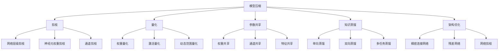

                 

# 深度学习模型轻量化技术综述

> 关键词：模型压缩,知识蒸馏,剪枝,量化,参数共享,架构优化,深度学习,机器学习

## 1. 背景介绍

在深度学习模型中，随着模型规模的不断扩大，模型参数量和计算资源的消耗也呈指数级增长。这对模型的训练、推理和部署都提出了更高的要求，同时也带来了计算资源的巨大浪费。轻量化技术即是一种专门针对模型复杂度的优化技术，旨在通过一系列算法和技术手段，减少模型的参数量，降低计算资源消耗，提高模型的训练、推理和部署效率。轻量化技术的兴起，与深度学习模型对计算资源的迫切需求，以及嵌入式设备、移动端等资源有限的应用场景，息息相关。

### 1.1 问题由来

随着深度学习模型在计算机视觉、自然语言处理、语音识别等领域的广泛应用，大模型的效果显著，但计算资源消耗巨大。模型的轻量化能够显著降低计算成本，提升模型应用效率，适用于资源受限的设备或场景。因此，轻量化技术成为了深度学习模型优化的重要方向之一。轻量化技术可以细分为模型压缩、知识蒸馏、剪枝、量化、参数共享和架构优化等多个分支，每一种技术都有其独特的优势和适用场景。

## 2. 核心概念与联系

### 2.1 核心概念概述

为更好地理解深度学习模型轻量化技术，本节将介绍几个密切相关的核心概念：

- 模型压缩(Model Compression)：通过去除模型中冗余信息，减少模型参数量和计算复杂度，从而实现模型的轻量化。常用的模型压缩技术包括剪枝(Pruning)、量化(Quantization)、参数共享(Parameter Sharing)等。

- 知识蒸馏(Knowledge Distillation)：通过教师模型(高精度模型)和学生模型(轻量化模型)之间的知识传递，使得学生模型能够学习到教师模型的高效表示能力。常见的蒸馏方法有单向蒸馏、双向蒸馏、多任务蒸馏等。

- 剪枝(Pruning)：通过删除模型中不必要的参数或神经元，减少模型复杂度，从而实现模型轻量化。剪枝方法通常包括网络层级剪枝、神经元权重剪枝、通道剪枝等。

- 量化(Quantization)：将高精度浮点参数转换为低精度参数，显著降低模型参数量，提高模型推理速度。量化方法包括权重量化、激活量化、动态范围量化等。

- 参数共享(Parameter Sharing)：通过共享模型参数，减少参数冗余，提高模型训练和推理效率。参数共享方法包括权重共享、通道共享、特征共享等。

- 架构优化(Architecture Optimization)：通过改进模型架构，如增加池化层、减少卷积层、采用更高效的网络结构等，降低模型复杂度，提高模型效率。架构优化方法包括稠密连接网络(DenseNet)、残差网络(ResNet)、网络剪枝(Net Pruning)等。

这些核心概念之间的逻辑关系可以通过以下Mermaid流程图来展示：



这个流程图展示了一系列模型轻量化技术及其相互关系：

1. 模型压缩通过剪枝、量化、参数共享等方法实现模型轻量化。
2. 知识蒸馏通过教师和学生模型之间的知识传递提升学生模型的准确性。
3. 架构优化通过改进模型架构降低计算复杂度，提升模型效率。

这些概念共同构成了深度学习模型轻量化的技术体系，从模型压缩到知识蒸馏，再到架构优化，各个环节相互配合，共同实现深度学习模型的轻量化。

## 3. 核心算法原理 & 具体操作步骤
### 3.1 算法原理概述

深度学习模型的轻量化主要是通过减少模型复杂度来实现的。常用的轻量化方法包括剪枝、量化、参数共享等。轻量化过程一般分为以下几个步骤：

1. 预处理：包括模型冻结、权重归一化、正则化等，保证模型稳定性和鲁棒性。
2. 剪枝：通过去除不必要的参数或神经元，减少模型复杂度。
3. 量化：将高精度参数转换为低精度参数，降低计算复杂度。
4. 参数共享：通过共享参数，减少参数冗余，提高模型效率。
5. 架构优化：改进模型结构，降低计算复杂度。

轻量化技术的核心在于如何平衡模型的精度和效率，既要保证模型性能，也要尽量减少计算资源的消耗。

### 3.2 算法步骤详解

以下是深度学习模型轻量化的一般步骤：

**Step 1: 模型预处理**
- 对原始模型进行预处理，包括模型冻结、权重归一化、正则化等。
- 通过分析模型参数分布，确定剪枝、量化、参数共享的具体方案。

**Step 2: 剪枝**
- 选择适当的剪枝策略，如网络层级剪枝、神经元权重剪枝、通道剪枝等。
- 根据剪枝策略，去除模型中的冗余参数，减小模型规模。

**Step 3: 量化**
- 选择合适的量化方法，如权重量化、激活量化、动态范围量化等。
- 对模型参数进行量化，减小模型计算量。

**Step 4: 参数共享**
- 选择适当的参数共享策略，如权重共享、通道共享、特征共享等。
- 通过共享参数，减少模型参数量，提高模型训练和推理效率。

**Step 5: 架构优化**
- 选择合适的架构优化方法，如稠密连接网络、残差网络、网络剪枝等。
- 对模型结构进行优化，降低计算复杂度。

**Step 6: 模型后处理**
- 对轻量化后的模型进行后处理，包括微调、精调等，提升模型性能。

### 3.3 算法优缺点

深度学习模型轻量化技术具有以下优点：

1. 模型压缩显著降低模型参数量和计算复杂度，提高模型的训练、推理和部署效率。
2. 通过剪枝和参数共享，减少模型资源消耗，提升模型性能。
3. 量化方法通过减小模型计算量，降低计算资源成本。

同时，这些技术也存在一些缺点：

1. 剪枝和量化可能会降低模型精度，影响模型效果。
2. 架构优化可能改变模型结构，影响模型的泛化能力。
3. 不同方法的应用需要大量的实验和调试，难以找到最优的平衡点。
4. 不同应用场景下，需要不同的优化策略，难以实现通用化。

尽管如此，轻量化技术仍在深度学习模型中占据重要地位，尤其在资源受限的设备或场景中发挥着重要作用。

### 3.4 算法应用领域

深度学习模型轻量化技术广泛应用于多个领域，包括：

- 计算机视觉：如图像分类、目标检测、图像分割等任务。通过轻量化技术，可以实现更高效、更快速的图像处理。
- 自然语言处理：如语言模型、机器翻译、情感分析等任务。通过轻量化技术，可以提高模型的推理速度，降低计算成本。
- 语音识别：如语音识别、语音合成等任务。通过轻量化技术，可以实现更高效的语音处理，提升语音交互体验。
- 移动设备：如智能手机、可穿戴设备等。通过轻量化技术，可以在资源受限的设备上实现高效的深度学习应用。
- 嵌入式系统：如自动驾驶、物联网等。通过轻量化技术，可以实现高效的实时处理和推理。

以上领域只是深度学习模型轻量化技术应用的一部分，随着技术的不断发展，轻量化技术将在更多领域发挥重要作用。

## 4. 数学模型和公式 & 详细讲解
### 4.1 数学模型构建

深度学习模型轻量化技术涉及多个数学模型和公式。以剪枝技术为例，可以通过对模型参数分布的分析，确定哪些参数应该被保留，哪些应该被去除。通常使用L1正则化、L2正则化等方法对参数进行约束，从而实现剪枝。

剪枝过程中，可以使用以下公式对模型参数进行约束：

$$
\theta = \arg\min_{\theta} \mathcal{L}(\theta) + \lambda \|\theta\|_1
$$

其中，$\mathcal{L}(\theta)$ 为模型损失函数，$\|\theta\|_1$ 为L1正则项，$\lambda$ 为正则化系数。

### 4.2 公式推导过程

以权重剪枝为例，推导剪枝过程中的目标函数。假设原始模型参数为 $\theta$，剪枝后保留的参数为 $\hat{\theta}$，则目标函数可以表示为：

$$
\hat{\theta} = \arg\min_{\hat{\theta}} \mathcal{L}(\hat{\theta}) + \lambda \|\theta - \hat{\theta}\|_2^2
$$

其中，$\mathcal{L}(\hat{\theta})$ 为剪枝后的模型损失函数，$\|\theta - \hat{\theta}\|_2^2$ 为剪枝惩罚项，$\lambda$ 为惩罚系数。

### 4.3 案例分析与讲解

以LeNet网络为例，分析剪枝和量化方法的应用。LeNet是一种经典的卷积神经网络，用于手写数字识别任务。假设原始模型有100个参数，通过剪枝方法去除30个参数，保留70个参数，则模型复杂度显著降低。同时，可以使用量化方法将模型参数转换为8位整数，显著降低计算复杂度。

在实际应用中，需要根据具体任务和模型结构，选择适当的剪枝和量化方法，以达到最优的轻量化效果。

## 5. 项目实践：代码实例和详细解释说明
### 5.1 开发环境搭建

在开始轻量化实践前，需要先准备好开发环境。以下是使用Python和PyTorch进行模型轻量化的环境配置流程：

1. 安装Anaconda：从官网下载并安装Anaconda，用于创建独立的Python环境。

2. 创建并激活虚拟环境：
```bash
conda create -n model_compression_env python=3.8 
conda activate model_compression_env
```

3. 安装PyTorch：根据CUDA版本，从官网获取对应的安装命令。例如：
```bash
conda install pytorch torchvision torchaudio cudatoolkit=11.1 -c pytorch -c conda-forge
```

4. 安装相关库：
```bash
pip install torch torchvision
```

5. 安装深度学习库：
```bash
pip install torch nn
```

完成上述步骤后，即可在`model_compression_env`环境中开始模型轻量化实践。

### 5.2 源代码详细实现

以下是一个使用剪枝和量化技术对LeNet网络进行轻量化的PyTorch代码实现：

```python
import torch
import torch.nn as nn
import torch.nn.init as init
import torch.nn.functional as F
import torchvision.transforms as transforms

# 定义LeNet网络
class LeNet(nn.Module):
    def __init__(self):
        super(LeNet, self).__init__()
        self.conv1 = nn.Conv2d(1, 6, 5)
        self.pool = nn.MaxPool2d(2, 2)
        self.conv2 = nn.Conv2d(6, 16, 5)
        self.fc1 = nn.Linear(16*5*5, 120)
        self.fc2 = nn.Linear(120, 84)
        self.fc3 = nn.Linear(84, 10)

    def forward(self, x):
        x = self.pool(F.relu(self.conv1(x)))
        x = self.pool(F.relu(self.conv2(x)))
        x = x.view(-1, 16*5*5)
        x = F.relu(self.fc1(x))
        x = F.relu(self.fc2(x))
        x = self.fc3(x)
        return x

# 定义剪枝方法
def pruning(model, ratio):
    pruned_model = nn.Sequential()
    pruned_params = []
    count = 0
    for name, param in model.named_parameters():
        if param.requires_grad:
            if count < int(len(list(model.parameters())) * ratio):
                pruned_params.append(param)
                count += 1
            else:
                pruned_model.add_module(name, param)
    for name, param in pruned_model.named_parameters():
        model.add_module(name, param)
    model.pruned_params = pruned_params

# 定义量化方法
def quantize(model):
    def quantize_weight(weights):
        q = torch.quantize_per_tensor(weights, scale=0.1, zero_point=0, dtype=torch.qint8)
        return q
    for name, param in model.named_parameters():
        if param.requires_grad:
            model.add_module(name, quantize_weight(param))
    model.quantized_params = list(model.parameters())

# 加载LeNet网络
model = LeNet()

# 定义剪枝和量化参数
pruning_ratio = 0.3
quantization_bit = 8

# 执行剪枝和量化
pruning(model, pruning_ratio)
quantize(model)

# 测试剪枝和量化后的模型
x = torch.randn(1, 1, 28, 28)
y = model(x)
print(y.shape)
```

上述代码中，`LeNet`是LeNet网络的实现，`pruning`和`quantize`函数分别实现了剪枝和量化方法。通过调用这两个函数，可以轻松对LeNet网络进行轻量化处理。

### 5.3 代码解读与分析

让我们再详细解读一下关键代码的实现细节：

**LeNet网络定义**：
- `nn.Conv2d`：定义卷积层。
- `nn.MaxPool2d`：定义池化层。
- `nn.Linear`：定义全连接层。
- `nn.Sequential`：定义网络模块。

**剪枝方法**：
- `pruning`函数：遍历模型参数，根据剪枝比例，保留部分参数。
- `count`变量：用于记录保留的参数个数。
- `pruned_model`：记录剪枝后的模型参数。
- `pruned_params`：记录被剪枝的参数。

**量化方法**：
- `quantize_weight`函数：对模型参数进行量化。
- `quantization_bit`：量化位宽。
- `q`变量：量化后的参数。

**剪枝和量化过程**：
- `pruning`函数和`quantize`函数分别对模型进行剪枝和量化处理。
- 调用这两个函数后，LeNet网络就被轻量化处理了。

**测试剪枝和量化后的模型**：
- `torch.randn`生成随机数据。
- `model(x)`将数据输入轻量化后的LeNet网络。
- 打印输出结果，显示模型输出的大小。

可以看到，使用PyTorch进行模型轻量化处理非常简单，只需要定义模型、选择剪枝和量化方法，调用对应的函数，即可实现模型轻量化。

## 6. 实际应用场景
### 6.1 嵌入式设备

深度学习模型在嵌入式设备上的应用需要考虑计算资源的限制。通过模型轻量化，可以显著降低计算复杂度，使得深度学习模型能够在资源受限的设备上运行。例如，在智能摄像头、智能家居设备、物联网设备等场景中，轻量化技术可以显著提升模型的响应速度和稳定性。

### 6.2 移动应用

移动设备在运行深度学习应用时，面临着计算资源有限的问题。通过模型轻量化，可以在保证模型性能的同时，减少计算量，提高模型在移动设备上的应用效率。例如，在智能手机应用中，轻量化技术可以提升图像识别、语音识别、自然语言处理等任务的响应速度和准确性。

### 6.3 边缘计算

边缘计算设备通常具有较低的计算能力和存储资源。通过轻量化技术，可以使得深度学习模型在边缘计算设备上运行，提升计算效率和实时性。例如，在自动驾驶、智能监控、工业控制等场景中，轻量化技术可以提升模型的推理速度和实时性，提升系统的稳定性和可靠性。

### 6.4 未来应用展望

未来，随着深度学习技术在各个领域的广泛应用，轻量化技术将发挥更大的作用。以下是几个可能的未来应用方向：

1. 实时视频处理：在实时视频流处理中，深度学习模型需要具备高效的推理速度。通过轻量化技术，可以实现更快速、更稳定的视频处理。
2. 可穿戴设备：在可穿戴设备上运行深度学习模型，需要考虑计算资源的限制。轻量化技术可以使得模型在资源受限的设备上运行，提升用户体验。
3. 智能家居：在智能家居设备中，深度学习模型需要具备高效的推理速度和稳定性。轻量化技术可以提升模型的响应速度和可靠性，提升用户的使用体验。
4. 无人驾驶：在无人驾驶中，深度学习模型需要具备高效的推理速度和实时性。轻量化技术可以提升模型的推理速度和稳定性，提升系统的安全性。

## 7. 工具和资源推荐
### 7.1 学习资源推荐

为了帮助开发者系统掌握深度学习模型轻量化技术，以下是一些优质的学习资源：

1. 《深度学习》课程（Andrew Ng教授）：斯坦福大学开设的深度学习课程，涵盖深度学习基础、模型优化、模型压缩等内容。

2. 《深度学习模型压缩》系列博文：由大模型技术专家撰写，深入浅出地介绍了模型压缩技术，包括剪枝、量化、参数共享等内容。

3. 《深度学习模型轻量化》书籍：系统介绍了模型压缩、知识蒸馏、剪枝、量化、参数共享等轻量化技术。

4. Weights & Biases：模型训练的实验跟踪工具，可以记录和可视化模型训练过程中的各项指标，方便对比和调优。

5. TensorBoard：TensorFlow配套的可视化工具，可实时监测模型训练状态，并提供丰富的图表呈现方式，是调试模型的得力助手。

通过对这些资源的学习实践，相信你一定能够快速掌握深度学习模型轻量化的精髓，并用于解决实际的模型优化问题。

### 7.2 开发工具推荐

高效的开发离不开优秀的工具支持。以下是几款用于深度学习模型轻量化开发的常用工具：

1. PyTorch：基于Python的开源深度学习框架，灵活动态的计算图，适合快速迭代研究。

2. TensorFlow：由Google主导开发的开源深度学习框架，生产部署方便，适合大规模工程应用。

3. Keras：高层深度学习框架，提供了简单易用的API，适合快速搭建模型和进行实验。

4. ONNX：一个开源的深度学习模型优化工具，可以将不同框架的模型进行转换，支持模型压缩和量化。

5. MXNet：由Apache开源的深度学习框架，支持分布式训练和优化，适合大规模工程应用。

合理利用这些工具，可以显著提升深度学习模型轻量化的开发效率，加快创新迭代的步伐。

### 7.3 相关论文推荐

深度学习模型轻量化技术的发展源于学界的持续研究。以下是几篇奠基性的相关论文，推荐阅读：

1. Learning both Weights and Connections for Efficient Neural Networks（剪枝技术）：提出网络层级剪枝方法，通过调整权重和连接，实现模型轻量化。

2. Quantization and Quantization-Aware Training with Dynamic Range Scaling（量化技术）：提出动态范围量化方法，通过改变权重范围，实现模型轻量化。

3. Compressing Deep Neural Networks using Vector Quantization（参数共享技术）：提出向量量化方法，通过参数共享，实现模型轻量化。

4. Distilling Knowledge with Depth-wise Adaptation and Cross-Level Knowledge Transfer（知识蒸馏技术）：提出双向蒸馏方法，通过教师和学生模型之间的知识传递，实现模型轻量化。

5. All-or-Nothing Networks：Incorporating Network Pruning into the Training Process（网络剪枝技术）：提出网络剪枝方法，通过剪枝网络中的神经元，实现模型轻量化。

这些论文代表了大模型轻量化技术的发展脉络。通过学习这些前沿成果，可以帮助研究者把握学科前进方向，激发更多的创新灵感。

## 8. 总结：未来发展趋势与挑战

### 8.1 总结

本文对深度学习模型轻量化技术进行了全面系统的介绍。首先阐述了模型轻量化的背景和意义，明确了轻量化技术在深度学习模型中的重要性。其次，从原理到实践，详细讲解了模型压缩、知识蒸馏、剪枝、量化、参数共享等轻量化方法，给出了模型轻量化的完整代码实例。同时，本文还探讨了轻量化技术在嵌入式设备、移动应用、边缘计算等多个领域的应用前景，展示了轻量化技术的巨大潜力。最后，本文精选了轻量化技术的各类学习资源，力求为读者提供全方位的技术指引。

通过本文的系统梳理，可以看到，深度学习模型轻量化技术在减少计算资源消耗、提升模型效率方面发挥着重要作用。未来，随着预训练语言模型的规模不断扩大，轻量化技术的应用将更加广泛，成为推动深度学习模型发展的关键技术之一。

### 8.2 未来发展趋势

展望未来，深度学习模型轻量化技术将呈现以下几个发展趋势：

1. 多任务蒸馏：通过教师模型和多个学生模型之间的知识传递，实现更高效的模型轻量化。
2. 动态量化：通过动态调整量化位宽，实现更精细的量化效果。
3. 自适应剪枝：通过动态剪枝策略，实现更高效的模型压缩。
4. 混合量化：结合量化和其他轻量化技术，实现更优的模型轻量化效果。
5. 端到端优化：通过联合优化训练和推理过程，实现更高效的模型轻量化。
6. 跨平台优化：实现深度学习模型在多平台之间的无缝转换和优化。

以上趋势凸显了深度学习模型轻量化技术的广阔前景。这些方向的探索发展，必将进一步提升深度学习模型的性能和应用范围，为深度学习技术的发展注入新的动力。

### 8.3 面临的挑战

尽管深度学习模型轻量化技术已经取得了显著进展，但在迈向更加智能化、普适化应用的过程中，它仍面临着诸多挑战：

1. 计算资源瓶颈：尽管模型轻量化技术可以在一定程度上减少计算资源消耗，但对于大规模深度学习模型，仍存在计算资源的限制。如何在资源受限的情况下，实现更高效的模型轻量化，还需要进一步探索。
2. 模型性能平衡：轻量化技术可能会降低模型精度，影响模型性能。如何在保证模型精度的同时，实现模型轻量化，是当前研究的重要课题。
3. 跨平台兼容性：深度学习模型在不同平台之间的兼容性和优化效果，仍存在较大差异。如何在多平台环境下，实现深度学习模型的轻量化优化，还需要更多研究。
4. 实际应用挑战：深度学习模型在实际应用中的效果和稳定性，仍存在不确定性。如何在实际应用中，保证轻量化模型的高效性和稳定性，还需要更多验证和优化。

尽管存在这些挑战，但深度学习模型轻量化技术仍然在不断进步，未来将发挥更大的作用，为深度学习技术的发展提供更多可能性。

### 8.4 研究展望

未来，深度学习模型轻量化技术的研究方向可能包括：

1. 新量化方法的探索：研究更高效的模型量化方法，实现更精细的量化效果。
2. 新剪枝方法的探索：研究更高效的模型剪枝方法，实现更高效的模型压缩。
3. 新混合优化方法：研究更高效的混合优化方法，实现更优的模型轻量化效果。
4. 新架构设计的探索：研究更高效的模型架构设计，实现更高效的模型轻量化。
5. 新应用场景的探索：研究深度学习模型在更多领域的应用，实现更广泛的模型轻量化。
6. 新评估指标的探索：研究更全面、更公正的模型评估指标，评估轻量化模型的性能和效果。

这些方向的研究将进一步推动深度学习模型轻量化技术的发展，带来更多创新和突破。

## 9. 附录：常见问题与解答

**Q1: 深度学习模型轻量化技术有哪些优势？**

A: 深度学习模型轻量化技术主要具有以下优势：
1. 显著降低计算资源消耗，提高模型训练、推理和部署效率。
2. 减少模型复杂度，降低存储需求，提升模型运行速度。
3. 适用于资源受限的设备或场景，如嵌入式设备、移动设备等。

**Q2: 深度学习模型轻量化技术有哪些常用方法？**

A: 深度学习模型轻量化技术常用的方法包括：
1. 剪枝(Pruning)：通过去除冗余参数，减少模型复杂度。
2. 量化(Quantization)：将高精度参数转换为低精度参数，减小计算量。
3. 参数共享(Parameter Sharing)：通过共享参数，减少参数冗余，提高模型效率。
4. 知识蒸馏(Knowledge Distillation)：通过教师模型和学生模型之间的知识传递，实现模型轻量化。
5. 架构优化(Architecture Optimization)：通过改进模型架构，降低计算复杂度。

**Q3: 深度学习模型轻量化技术如何保证模型性能？**

A: 深度学习模型轻量化技术可以通过以下方法保证模型性能：
1. 剪枝和量化方法的参数更新策略：通过优化参数更新策略，减少模型精度损失。
2. 网络剪枝和通道剪枝方法：通过选择适当的剪枝策略，保留重要参数，减少模型精度损失。
3. 混合量化方法：通过结合量化和其他轻量化技术，实现更优的模型轻量化效果。
4. 混合优化方法：通过联合优化训练和推理过程，实现更高效的模型轻量化。

**Q4: 深度学习模型轻量化技术如何应用于实际场景？**

A: 深度学习模型轻量化技术可以应用于以下实际场景：
1. 嵌入式设备：通过模型轻量化，实现高效、稳定的深度学习应用。
2. 移动应用：在移动设备上运行深度学习应用，提高计算效率。
3. 边缘计算：在边缘计算设备上运行深度学习模型，提升计算效率和实时性。
4. 实时视频处理：在实时视频流处理中，实现高效的推理速度。

**Q5: 深度学习模型轻量化技术面临哪些挑战？**

A: 深度学习模型轻量化技术面临以下挑战：
1. 计算资源瓶颈：轻量化技术仍存在计算资源限制，如何在资源受限情况下实现更高效的模型轻量化。
2. 模型性能平衡：轻量化技术可能会降低模型精度，如何在保证模型精度的同时实现模型轻量化。
3. 跨平台兼容性：深度学习模型在不同平台之间的兼容性和优化效果存在差异。
4. 实际应用挑战：轻量化模型在实际应用中的效果和稳定性仍存在不确定性。

**Q6: 深度学习模型轻量化技术有哪些推荐资源？**

A: 深度学习模型轻量化技术的推荐资源包括：
1. 《深度学习》课程（Andrew Ng教授）。
2. 《深度学习模型压缩》系列博文。
3. 《深度学习模型轻量化》书籍。
4. Weights & Biases：模型训练的实验跟踪工具。
5. TensorBoard：TensorFlow配套的可视化工具。

---

作者：禅与计算机程序设计艺术 / Zen and the Art of Computer Programming

