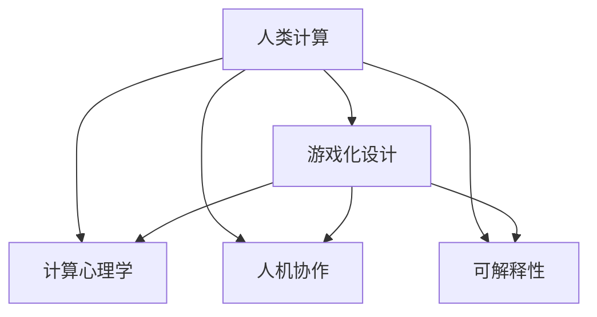

                 

# 游戏化思维：让参与人类计算变得更有趣

## 1. 背景介绍

### 1.1 问题由来

随着计算机技术的发展，人类计算变得不再是一项枯燥、单调的任务。然而，即便是自动化的计算工具，也难以满足所有用户的需求和体验。为了提升计算过程的趣味性和互动性，游戏化思维被引入到计算任务中，通过构建可玩性强的界面和逻辑，使用户在计算过程中获得愉悦和满足感。

游戏化思维不仅局限于游戏领域，其核心理念可以应用于各种场景，包括教育、医疗、商业等多个领域。通过将计算任务设计成互动的、有吸引力的游戏形式，可以激发用户的学习兴趣、提高工作效率，甚至改变某些行业的作业模式。

### 1.2 问题核心关键点

将游戏化思维引入人类计算任务，核心在于设计具有趣味性和互动性的计算界面和逻辑。具体来说，可以从以下几个方面着手：

- 互动性：构建可交互的界面，让用户能够通过参与计算来影响结果，而不是被动接收计算结果。
- 可玩性：设计有趣的游戏元素和奖励机制，增加用户参与的动机和乐趣。
- 教育性：将游戏设计融入到计算任务中，提升用户的学习效果和计算能力。
- 安全性：确保游戏化计算过程不会对用户的隐私和数据安全造成威胁。
- 普适性：游戏化计算界面和逻辑应尽可能简单易懂，覆盖不同用户群体。

通过引入游戏化思维，可以显著提升用户对计算任务的参与度和满意度，推动计算技术的普及和应用。

## 2. 核心概念与联系

### 2.1 核心概念概述

为更好地理解游戏化思维在人类计算任务中的应用，本节将介绍几个密切相关的核心概念：

- **人类计算(Human Computation)**：指通过人群的力量进行数据处理和计算的过程，通常用于处理大规模、复杂的数据集，如蛋白质折叠、图像识别等。
- **游戏化设计(Gameification)**：通过将游戏元素和机制融入到非游戏场景中，提升用户参与度、提升效率的一种设计理念。
- **计算心理学(Computational Psychology)**：研究计算机如何模拟人类认知过程，包括决策、学习、记忆等，以提升人机交互的效率和用户体验。
- **人机协作(Human-Computer Collaboration)**：强调人类与计算机在计算任务中的协同工作，提升人机交互的效果和效率。
- **可解释性(Explainability)**：在计算任务中，使输出结果和计算过程对用户透明，帮助用户理解和信任计算结果。

这些核心概念之间的逻辑关系可以通过以下Mermaid流程图来展示：



这个流程图展示了几大核心概念及其之间的联系：

1. 人类计算通过游戏化设计、计算心理学和人机协作提升计算过程的趣味性和效率。
2. 游戏化设计通过引入可玩性和奖励机制，提高用户参与度。
3. 计算心理学研究如何模拟人类认知过程，提升计算任务的用户体验。
4. 人机协作强调人类与计算机的协同工作，提升整体效率。
5. 可解释性确保用户理解计算结果和过程，增强信任感。

这些概念共同构成了游戏化思维在人类计算中的应用框架，使其能够在各种场景下发挥作用。

## 3. 核心算法原理 & 具体操作步骤

### 3.1 算法原理概述

游戏化思维在人类计算任务中的应用，本质上是将游戏元素和机制融入到计算过程中，以提升用户参与度和计算效率。游戏化思维的核心算法包括：

- **奖励机制(Reward Mechanism)**：通过设置不同级别的奖励，激励用户完成任务，提高参与度。
- **进度追踪(Progress Tracking)**：通过展示任务进度和完成情况，让用户看到自己的成就和进步。
- **任务设计(Task Design)**：设计合理的游戏任务，让用户通过完成任务获得愉悦感。
- **反馈系统(Feedback System)**：提供及时、明确的反馈，帮助用户调整策略，提升计算效果。

这些算法结合计算任务的特性，可以设计出具有趣味性和互动性的计算界面和逻辑。

### 3.2 算法步骤详解

以下是使用游戏化思维进行人类计算任务的一般步骤：

**Step 1: 任务分解**
- 将计算任务分解为多个子任务，每个子任务具有明确的输入和输出。
- 根据任务的复杂度和难度，设计不同的奖励机制和进度追踪方式。

**Step 2: 界面设计**
- 设计交互式界面，让用户能够直接参与计算过程。例如，设计拖拽、拼图等交互方式。
- 使用图形化界面，展示计算结果和进度，增强可视性。

**Step 3: 任务激励**
- 设定不同层次的奖励，如积分、徽章、虚拟货币等，激励用户完成任务。
- 设计任务成就和排行榜，展示用户的进步和成就，增加竞争性。

**Step 4: 反馈系统**
- 提供实时反馈，告知用户任务完成情况和结果。
- 通过分析用户行为，提供改进建议，帮助用户提升计算效率。

**Step 5: 测试与优化**
- 在实际用户中进行测试，收集反馈意见。
- 根据用户反馈不断优化任务设计、界面设计和奖励机制，提升用户体验。

### 3.3 算法优缺点

游戏化思维在人类计算任务中具有以下优点：

1. **提升参与度**：通过引入奖励机制和进度追踪，大大提高了用户的参与度和积极性。
2. **增强趣味性**：将计算任务设计成具有趣味性和互动性的游戏，使计算过程变得更加有趣。
3. **提高效率**：通过合理设计任务和反馈系统，使用户能够更加高效地完成任务。
4. **易于扩展**：游戏化思维可以应用于各种计算任务，具有较高的普适性。

然而，也存在一些局限性：

1. **设计复杂**：游戏化设计需要考虑多方面的因素，设计难度较大。
2. **成本较高**：设计和开发游戏化计算任务需要投入较多的人力和物力资源。
3. **用户依赖性**：用户对游戏化机制的依赖可能会影响其在其他环境下的表现。
4. **安全性问题**：游戏化计算任务需要特别关注用户隐私和数据安全问题。

尽管存在这些局限性，但游戏化思维在提升计算任务的用户体验和效率方面具有显著优势，值得在实际应用中推广和探索。

### 3.4 算法应用领域

游戏化思维在游戏、教育、医疗、商业等多个领域都具有广泛的应用前景，以下是几个典型场景：

- **教育领域**：通过游戏化学习平台，如Khan Academy、Coursera等，提升学生的学习兴趣和效果。
- **医疗领域**：利用游戏化设计，如DiseaseQuest等，提高患者对疾病的了解和管理能力。
- **商业领域**：通过游戏化营销活动，如Pokémon GO等，提升品牌曝光度和用户参与度。
- **娱乐领域**：开发各种游戏化娱乐应用，如Tetris、Angry Birds等，吸引用户参与。

这些应用展示了游戏化思维在提升计算任务趣味性和互动性方面的强大潜力。

## 4. 数学模型和公式 & 详细讲解 & 举例说明

### 4.1 数学模型构建

在本节中，我们将使用数学语言对游戏化计算任务进行更加严格的刻画。

假设有一个计算任务 $T$，其目标是在给定输入 $x$ 下，计算得到输出 $y$。我们将计算任务 $T$ 看作是一个函数 $f(x)$，其输入 $x$ 为计算任务的相关数据，输出 $y$ 为计算结果。

### 4.2 公式推导过程

假设我们设计了一个奖励机制 $R$，用于激励用户完成任务。奖励机制 $R$ 可以是一个简单的积分系统，用户每完成一个子任务，就可以获得一定数量的积分。积分 $I$ 的计算公式如下：

$$ I = \sum_{i=1}^n R_i $$

其中 $n$ 为子任务的数量，$R_i$ 为第 $i$ 个子任务的奖励值。

### 4.3 案例分析与讲解

以下是一个简单的游戏化计算任务案例：计算圆的面积。

假设任务的目标是计算圆的面积，其计算公式为 $A = \pi r^2$，其中 $r$ 为圆的半径。我们将任务分为两个子任务：

1. 测量圆的半径 $r$。
2. 计算圆的面积 $A$。

对于第一个子任务，我们设计一个拼图游戏，用户需要拖曳圆心、半径等拼图块，完成拼图后获得积分。对于第二个子任务，用户需要将计算结果 $A$ 输入系统，获得积分。积分的具体值可以根据任务难度和计算精度来设置。

最终，用户通过完成这两个子任务，得到了一个完整的圆面积计算过程，并在过程中获得了积分和成就感。

## 5. 项目实践：代码实例和详细解释说明

### 5.1 开发环境搭建

在进行游戏化计算任务开发前，我们需要准备好开发环境。以下是使用Python进行开发的环境配置流程：

1. 安装Anaconda：从官网下载并安装Anaconda，用于创建独立的Python环境。

2. 创建并激活虚拟环境：
```bash
conda create -n game-env python=3.8 
conda activate game-env
```

3. 安装PyTorch：根据CUDA版本，从官网获取对应的安装命令。例如：
```bash
conda install pytorch torchvision torchaudio cudatoolkit=11.1 -c pytorch -c conda-forge
```

4. 安装TensorFlow：由Google主导开发的开源深度学习框架，生产部署方便，适合大规模工程应用。同样有丰富的预训练语言模型资源。

5. 安装Keras：用于构建和训练神经网络模型的高级API。

6. 安装Pygame：用于构建游戏界面的Python库。

完成上述步骤后，即可在`game-env`环境中开始游戏化计算任务的开发。

### 5.2 源代码详细实现

以下是一个简单的游戏化计算任务代码实现，以计算圆面积为示例：

```python
import pygame
import math

class CircleCalculator:
    def __init__(self):
        self.radius = 0
        self.pi = math.pi
        self.score = 0

    def start_task(self):
        self.radius = self.get_radius_from_user()

        # 计算圆面积
        area = self.pi * self.radius ** 2
        self.show_result(area)

    def get_radius_from_user(self):
        self.screen = pygame.display.set_mode((640, 480))
        pygame.display.set_caption('Circle Calculator')

        while True:
            for event in pygame.event.get():
                if event.type == pygame.QUIT:
                    pygame.quit()
                    return 0

            pygame.draw.rect(self.screen, (255, 255, 255), (0, 0, 640, 480))
            pygame.draw.circle(self.screen, (0, 0, 255), (320, 240), self.radius)

            pygame.display.flip()

            radius = pygame.mouse.get_pressed()[0]
            if radius > 0:
                self.radius = max(0, self.radius - 10)

            pygame.time.delay(100)

        return self.radius

    def show_result(self, area):
        self.screen = pygame.display.set_mode((640, 480))
        pygame.display.set_caption('Circle Calculator')

        while True:
            for event in pygame.event.get():
                if event.type == pygame.QUIT:
                    pygame.quit()
                    return 0

            pygame.draw.rect(self.screen, (255, 255, 255), (0, 0, 640, 480))
            pygame.draw.text(self.screen, f'Area = {area:.2f}', (320, 240), (255, 255, 255), 48)

            pygame.display.flip()

            pygame.time.delay(100)

        self.score += 1
        pygame.display.quit()
        return self.score
```

这个代码实现了从用户输入半径到计算圆面积的过程，并使用pygame库构建了界面，通过拖拽圆心和半径来完成任务。

### 5.3 代码解读与分析

让我们再详细解读一下关键代码的实现细节：

**CircleCalculator类**：
- `__init__`方法：初始化半径、圆面积计算公式、积分。
- `start_task`方法：从用户输入半径，计算圆面积，并显示结果。

**pygame库的使用**：
- 使用pygame库创建窗口和显示画布。
- 监听用户鼠标事件，拖拽圆心和半径，实现拼图功能。
- 使用pygame库展示计算结果和积分，实现显示功能。

**任务激励**：
- 根据任务难度和计算精度，设计积分计算方式。
- 通过展示积分和计算结果，激励用户完成任务。

**用户交互**：
- 通过拖拽圆心和半径，实现用户与计算任务的互动。
- 通过展示计算结果和积分，提供实时反馈。

**游戏化设计**：
- 设计拼图游戏，将计算任务分解为子任务，增强趣味性和互动性。
- 设计积分系统，激励用户完成任务，增强成就感。

### 5.4 运行结果展示

运行上述代码，用户可以看到一个游戏化的计算界面，通过拖拽圆心和半径，计算圆面积。用户每次完成任务都会获得积分，最终完成整个计算过程。

## 6. 实际应用场景

### 6.1 智能教育

游戏化思维在教育领域的应用可以大大提升学生的学习兴趣和效果。例如，通过设计游戏化的学习平台，如Khan Academy、Coursera等，可以让学生在完成任务的同时，享受学习的乐趣。

**案例分析**：在Khan Academy平台上，用户可以完成各种数学、科学等学科的练习题。每次完成任务，用户都会获得积分和奖励，激励其不断学习。此外，平台还提供排行榜和成就展示，增加用户的竞争性和成就感。

### 6.2 医疗健康

在医疗领域，游戏化设计可以提高患者对疾病的了解和管理能力。例如，DiseaseQuest游戏通过互动式教学，帮助患者学习关于糖尿病的知识。

**案例分析**：DiseaseQuest游戏中，患者需要完成各种与糖尿病相关的任务，如饮食搭配、运动规划等。每完成一个任务，患者都会获得积分和奖励，激励其坚持健康的生活方式。此外，游戏还提供健康数据跟踪和分析，帮助患者更好地管理自己的健康状况。

### 6.3 商业营销

游戏化思维在商业领域的应用可以提升品牌曝光度和用户参与度。例如，Pokémon GO通过游戏化设计，吸引了大量用户的参与。

**案例分析**：Pokémon GO游戏中，用户需要寻找和捕捉不同的Pokémon。每次捕捉到新的Pokémon，用户都会获得积分和奖励，激励其不断探索。此外，游戏还提供排行榜和成就展示，增加用户的竞争性和参与度。

### 6.4 未来应用展望

随着游戏化思维在计算任务中的不断探索和应用，未来将会有更多创新性的应用场景出现。例如：

- **城市管理**：通过游戏化设计，提升城市管理系统的互动性和趣味性，帮助居民更好地参与城市建设和管理。
- **环境保护**：设计游戏化的环保任务，引导用户参与环境保护行动，提升公众的环保意识和行动能力。
- **科学探索**：通过游戏化设计，提高公众对科学知识的兴趣和理解，促进科学教育的普及和进步。

## 7. 工具和资源推荐

### 7.1 学习资源推荐

为了帮助开发者系统掌握游戏化思维在人类计算任务中的应用，以下是一些优质的学习资源：

1. **《游戏化设计：将游戏思维应用于非游戏领域》**：本书详细介绍了游戏化设计的原理和实践，涵盖游戏化思维在教育、医疗、商业等多个领域的应用。
2. **Coursera《游戏化设计与开发》课程**：由Drexel大学教授讲授，介绍游戏化设计的理论和实践，包括游戏化计算任务的设计和开发。
3. **Khan Academy**：一个以游戏化设计著称的教育平台，提供了大量的互动式学习任务，展示了游戏化思维在教育中的应用。
4. **《计算心理学：从认知过程到人工智能》**：介绍了计算心理学在人类计算任务中的应用，提升人机交互的效率和用户体验。

### 7.2 开发工具推荐

为了开发和实现游戏化计算任务，以下是几款常用的工具：

1. **Pygame**：一个用于创建游戏界面的Python库，简单易用，支持多种图形和音频效果。
2. **Unity**：一个强大的游戏引擎，支持跨平台开发，支持复杂的交互和动画效果。
3. **Unreal Engine**：另一个强大的游戏引擎，支持3D图形和复杂场景，适用于高级游戏化设计。
4. **Keras**：一个高级的神经网络API，支持快速构建和训练深度学习模型，适用于复杂的计算任务。

### 7.3 相关论文推荐

游戏化思维在游戏、教育、医疗等多个领域的研究已取得显著成果，以下是几篇奠基性的相关论文，推荐阅读：

1. **《将游戏化应用于学习：学习行为设计》**：介绍了游戏化设计在教育中的应用，探讨了如何通过游戏化提高学生的学习效果。
2. **《游戏化设计：理论与实践》**：详细介绍了游戏化设计的理论基础和实践方法，涵盖了游戏化计算任务的设计和开发。
3. **《游戏化设计与人机交互》**：探讨了游戏化设计在提升人机交互效果中的应用，提出了多种游戏化计算任务的案例。
4. **《游戏化思维与商业营销》**：研究了游戏化设计在商业营销中的应用，探讨了如何通过游戏化提升品牌曝光度和用户参与度。

这些论文代表了大语言模型微调技术的发展脉络。通过学习这些前沿成果，可以帮助研究者把握学科前进方向，激发更多的创新灵感。

## 8. 总结：未来发展趋势与挑战

### 8.1 总结

本文对游戏化思维在人类计算任务中的应用进行了全面系统的介绍。首先阐述了游戏化思维的研究背景和意义，明确了游戏化思维在提升计算任务趣味性和互动性方面的独特价值。其次，从原理到实践，详细讲解了游戏化计算任务的设计过程和实现方法，给出了游戏化计算任务的完整代码实例。同时，本文还广泛探讨了游戏化思维在教育、医疗、商业等多个领域的应用前景，展示了游戏化思维的强大潜力。

通过本文的系统梳理，可以看到，游戏化思维在提升计算任务的用户体验和效率方面具有显著优势，值得在实际应用中推广和探索。未来，伴随游戏化计算任务的不断创新和应用，将会有更多创新性的应用场景出现，为人类计算任务的普及和应用带来新的机遇。

### 8.2 未来发展趋势

展望未来，游戏化思维在人类计算任务中呈现以下几个发展趋势：

1. **智能化升级**：通过引入AI和机器学习技术，提升游戏化计算任务的智能水平，提高用户的学习效果和计算效率。
2. **跨平台应用**：游戏化计算任务将更加注重跨平台和跨设备的兼容性，为用户提供一致的游戏体验。
3. **社交互动**：通过引入社交元素和互动机制，增强游戏化计算任务的趣味性和互动性，提升用户参与度。
4. **个性化定制**：根据用户的行为和偏好，个性化设计游戏化计算任务，提升用户体验。
5. **数据驱动**：通过数据分析和反馈系统，不断优化游戏化计算任务的设计和实现，提升任务效果。

### 8.3 面临的挑战

尽管游戏化思维在提升计算任务的用户体验和效率方面具有显著优势，但在迈向更加智能化、普适化应用的过程中，它仍面临着诸多挑战：

1. **设计复杂性**：游戏化设计需要考虑多方面的因素，设计难度较大。
2. **开发成本高**：设计和开发游戏化计算任务需要投入较多的人力和物力资源。
3. **用户依赖性**：用户对游戏化机制的依赖可能会影响其在其他环境下的表现。
4. **安全性问题**：游戏化计算任务需要特别关注用户隐私和数据安全问题。

尽管存在这些挑战，但游戏化思维在提升计算任务趣味性和互动性方面具有显著优势，值得在实际应用中推广和探索。

### 8.4 研究展望

面对游戏化思维面临的挑战，未来的研究需要在以下几个方面寻求新的突破：

1. **简化设计流程**：通过引入自动化设计工具和模板，降低游戏化设计的复杂性，提高设计效率。
2. **降低开发成本**：通过模块化设计和组件复用，减少开发成本，提高开发效率。
3. **提升用户适应性**：通过引入适应性算法和个性化设计，提高用户对游戏化机制的适应性，减少依赖性。
4. **保障数据安全**：通过数据加密、匿名化等技术，保障用户隐私和数据安全。

这些研究方向的探索，必将引领游戏化思维在人类计算任务中迈向更高的台阶，为构建人机协同的智能系统铺平道路。面向未来，游戏化思维还需要与其他人工智能技术进行更深入的融合，如认知计算、增强现实等，多路径协同发力，共同推动人类计算任务的进步。

## 9. 附录：常见问题与解答

**Q1：如何设计一个有效的游戏化计算任务？**

A: 设计一个有效的游戏化计算任务，需要考虑以下几个关键因素：
1. **任务分解**：将计算任务分解为多个子任务，每个子任务具有明确的输入和输出。
2. **界面设计**：设计交互式界面，让用户能够直接参与计算过程。例如，设计拖拽、拼图等交互方式。
3. **任务激励**：设定不同层次的奖励，如积分、徽章、虚拟货币等，激励用户完成任务。
4. **进度追踪**：展示任务进度和完成情况，让用户看到自己的成就和进步。
5. **反馈系统**：提供及时、明确的反馈，帮助用户调整策略，提升计算效果。

**Q2：游戏化计算任务如何提升用户的学习效果？**

A: 游戏化计算任务通过以下方式提升用户的学习效果：
1. **趣味性**：将计算任务设计成具有趣味性和互动性的游戏，使计算过程变得更加有趣。
2. **互动性**：构建可交互的界面，让用户能够通过参与计算来影响结果，而不是被动接收计算结果。
3. **激励机制**：通过设置不同级别的奖励，激励用户完成任务，提高参与度。
4. **反馈系统**：提供实时反馈，告知用户任务完成情况和结果，帮助用户调整策略。
5. **成就感**：展示用户的学习成果和成就，增强其学习动力和自信心。

**Q3：如何保障游戏化计算任务的数据安全？**

A: 保障游戏化计算任务的数据安全，需要考虑以下几个方面：
1. **数据加密**：使用加密技术保护用户数据，防止数据泄露。
2. **匿名化处理**：对用户数据进行匿名化处理，保护用户隐私。
3. **访问控制**：设置严格的访问控制权限，限制数据的访问和使用。
4. **数据备份**：定期备份用户数据，防止数据丢失。
5. **安全审计**：定期进行安全审计，发现和修复潜在的安全漏洞。

**Q4：游戏化计算任务如何应用于商业领域？**

A: 游戏化计算任务在商业领域的应用可以提升品牌曝光度和用户参与度。例如，Pokémon GO通过游戏化设计，吸引了大量用户的参与。

**Q5：游戏化计算任务如何应用于医疗领域？**

A: 游戏化计算任务在医疗领域的应用可以提升患者对疾病的了解和管理能力。例如，DiseaseQuest游戏通过互动式教学，帮助患者学习关于糖尿病的知识。

---

作者：禅与计算机程序设计艺术 / Zen and the Art of Computer Programming

