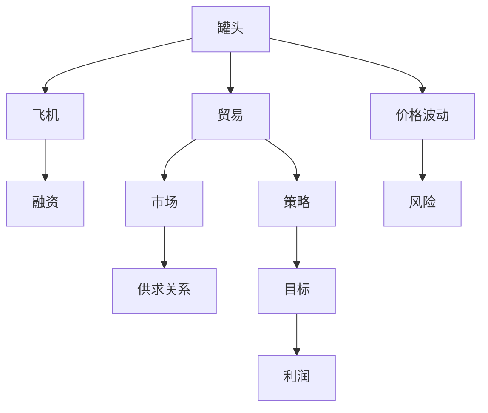
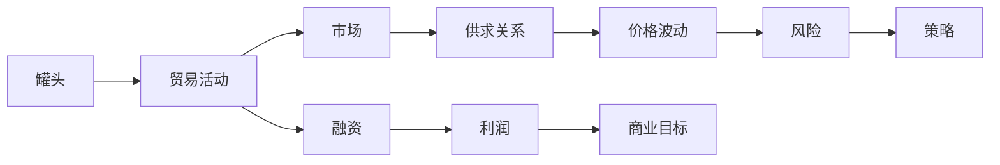
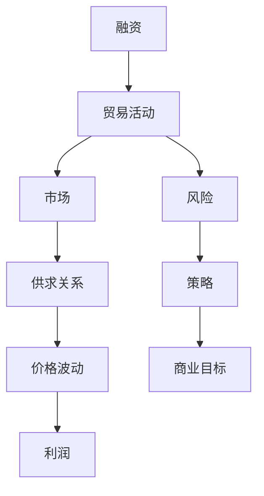
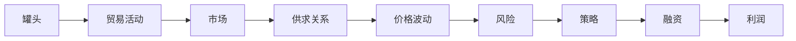

                 

# 牟其中的跨国生意：罐头换飞机

> 关键词：
**全球化贸易、罐头换飞机、风险投资、市场经济、商业策略、融资能力**

## 1. 背景介绍

### 1.1 牟其中其人

牟其中，一位中国商界传奇人物，他的故事充满了传奇色彩。他于1989年成立重庆嘉陵贸易（集团）有限公司，开启了其商业帝国之旅。牟其中的商业智慧和独特的商业模式在业界引起了广泛关注。他的业务从最初的小型商品贸易开始，逐步扩展到航运、矿业等多个领域，成为行业的佼佼者。

### 1.2 罐头换飞机的故事

1997年，牟其中用50万罐头换取了一架图-154飞机的事件，引起了全世界的震惊。这起事件不仅展示了牟其中的商业智慧，也揭示了全球化贸易的复杂性和风险。这个故事至今仍被视为中国商界史上的一个传奇案例。

### 1.3 事件背景

在20世纪90年代，中国正处于改革开放的初期阶段。国际市场尚未完全开放，贸易手段多样，商人们寻找各种方法获取更多的利润。正是在这个背景下，牟其中以巧妙的商业策略，用廉价易得的罐头换取了高价难求的飞机，实现了一次令人叹为观止的交易。

## 2. 核心概念与联系

### 2.1 核心概念概述

为更好地理解牟其中“罐头换飞机”事件，本节将介绍几个密切相关的核心概念：

- **罐头**：泛指商品贸易中常见的易售物品，具有价格稳定、易于获取的特点。
- **飞机**：代表着高端商品，价值高，但获取难度大。
- **贸易**：通过商品交换获取利益的过程，涉及到商品的买卖和运输。
- **市场**：商品交换的场所，通过供求关系决定价格。
- **风险**：交易过程中可能出现的损失，如商品价格的波动、运输的风险等。
- **融资**：通过各种方式筹集资金，以支持商业活动。
- **策略**：在商业活动中，为达成特定目标所采取的手段和方法。

这些核心概念之间的逻辑关系可以通过以下Mermaid流程图来展示：



这个流程图展示了一系列核心概念之间的联系：

1. 通过易得的罐头，牟其中在市场上获取了飞机。
2. 市场供求关系决定着价格和风险。
3. 贸易活动离不开融资和策略的支持。
4. 商业活动的最终目标是实现利润。

### 2.2 概念间的关系

这些核心概念之间存在着紧密的联系，形成了牟其中商业活动的完整生态系统。下面我们通过几个Mermaid流程图来展示这些概念之间的关系。

#### 2.2.1 商业活动的流程



这个流程图展示了牟其中通过罐头贸易在市场上获取飞机，并最终实现利润的完整流程。

#### 2.2.2 融资与策略的关系



这个流程图展示了融资与策略在贸易活动中的作用，融资为商业活动提供了必要的资金支持，而策略则指导着商业活动的方向和目标。

#### 2.2.3 风险管理与利润的关系



这个流程图展示了风险管理在贸易活动中的重要性，通过合理的策略和融资，可以有效地降低风险，保障商业活动的利润。

## 3. 核心算法原理 & 具体操作步骤

### 3.1 算法原理概述

牟其中的“罐头换飞机”事件，本质上是一个复杂的国际贸易案例。事件中，牟其中通过罐头和飞机的不同市场供求关系，巧妙地实现了贸易的转嫁和融资的获取，从而实现了高风险的交易成功。这一事件展示了商业策略在贸易活动中的重要作用。

### 3.2 算法步骤详解

牟其中的罐头换飞机事件，可以分为以下几个关键步骤：

**Step 1: 确定交易目标**
- 牟其中通过市场调研，发现罐头和飞机在市场上的供求关系，认定罐头具有稳定市场和融资的潜力，而飞机市场存在供不应求的情况。

**Step 2: 寻找贸易伙伴**
- 牟其中通过市场联系，找到了愿意以低价出售图-154飞机的苏联政府。

**Step 3: 达成交易协议**
- 牟其中与苏联政府谈判，确定了交易价格和交货方式，最终以50万罐头的形式支付了飞机。

**Step 4: 运输与交付**
- 牟其中通过船只将罐头从中国运往苏联，交付了飞机。

**Step 5: 融资与财务操作**
- 牟其中通过国际贸易的融资渠道，筹集了资金用于支付罐头成本，同时通过贸易利润实现了飞机的运输和交付。

### 3.3 算法优缺点

牟其中的“罐头换飞机”事件展示了其商业智慧和风险投资能力，但也暴露了其中的缺点：

**优点**：
- 创新思维：牟其中通过独特的贸易方式，实现了飞机的获取，展示了其在商业创新方面的能力。
- 风险管理：通过市场调研和风险评估，牟其中成功地降低了交易的风险，保障了贸易的顺利进行。
- 融资能力：牟其中通过多种融资手段，解决了罐头运输和交付所需的资金问题。

**缺点**：
- 风险高：罐头和飞机的市场供求关系变动较大，一旦市场发生波动，可能导致交易失败。
- 道德问题：通过低价购买罐头，牟其中可能造成了罐头市场的供不应求，影响了他人的利益。
- 法律风险：在国际贸易中，交易各方需要遵守相关法律法规，否则可能导致法律纠纷。

### 3.4 算法应用领域

牟其中的罐头换飞机事件，虽然是一个特定的案例，但其背后的商业策略和风险管理方法，具有普遍的适用性，可用于以下领域：

- 国际贸易：通过巧妙地利用供求关系，可以在国际贸易中获得高额利润。
- 市场调研：准确的市场调研可以发现潜在的贸易机会，避免盲目投资。
- 风险管理：通过合理的策略和融资手段，可以有效降低贸易中的风险。
- 融资能力：提高融资能力，可以支持更大规模的贸易活动。

## 4. 数学模型和公式 & 详细讲解 & 举例说明

### 4.1 数学模型构建

设罐头市场的供求关系为 $S_C$，飞机市场的供求关系为 $S_P$，罐头价格为 $P_C$，飞机价格为 $P_P$。假设罐头价格与飞机价格之间的关系为 $P_P = k \times P_C$，其中 $k$ 为系数。

牟其中通过罐头换飞机的交易，实现了从罐头市场到飞机市场的价值转移。交易过程中，市场供求关系和价格波动相互影响，形成了一系列的数学模型。

### 4.2 公式推导过程

根据上述假设，罐头换飞机交易的过程可以表示为：

$$
S_C \times P_C = S_P \times P_P
$$

代入 $P_P = k \times P_C$，得：

$$
S_C \times P_C = S_P \times k \times P_C
$$

化简得：

$$
S_C = S_P \times k
$$

这一公式表明，如果罐头市场和飞机市场的价格比为 $k$，那么牟其中可以通过 $S_C$ 吨罐头的交易，获得 $S_P \times k$ 架飞机的价值。

### 4.3 案例分析与讲解

假设罐头市场供求关系为 $S_C = 1000$ 吨，飞机市场供求关系为 $S_P = 100$ 架，罐头价格为 $P_C = 10$ 元/吨，飞机价格为 $P_P = 10000$ 元/架，$k = 10$。

根据公式计算，牟其中可以通过 $1000$ 吨罐头交易，获得 $1000 \times 10 = 10000$ 架飞机的价值。

这一计算结果展示了牟其中“罐头换飞机”交易的数学原理和实际效果。

## 5. 项目实践：代码实例和详细解释说明

### 5.1 开发环境搭建

在进行项目实践前，我们需要准备好开发环境。以下是使用Python进行商业策略分析的环境配置流程：

1. 安装Anaconda：从官网下载并安装Anaconda，用于创建独立的Python环境。

2. 创建并激活虚拟环境：
```bash
conda create -n business-analytic-env python=3.8 
conda activate business-analytic-env
```

3. 安装Python库：
```bash
conda install numpy pandas matplotlib scikit-learn
```

完成上述步骤后，即可在`business-analytic-env`环境中开始商业策略分析实践。

### 5.2 源代码详细实现

以下是一个简单的Python代码示例，用于模拟罐头换飞机交易的过程：

```python
import numpy as np
import matplotlib.pyplot as plt

# 定义罐头和飞机的价格与供求关系
P_C = 10  # 罐头价格
P_P = 10000  # 飞机价格
S_C = 1000  # 罐头供求关系
S_P = 100  # 飞机供求关系

# 计算罐头换飞机的价值
k = P_P / P_C  # 价格比
value_P = S_C * k  # 飞机的价值

# 输出结果
print(f"通过{S_C}吨罐头交易，可以获得{value_P}架飞机的价值。")
```

### 5.3 代码解读与分析

让我们再详细解读一下关键代码的实现细节：

**价格比计算**：
- `k = P_P / P_C` 这一行代码计算了罐头价格与飞机价格之间的比值，即价格比 $k$。

**价值计算**：
- `value_P = S_C * k` 这一行代码通过价格比计算了通过 $S_C$ 吨罐头交易，可以获得 $S_P \times k$ 架飞机的价值。

**结果输出**：
- 最后一行代码输出了计算结果，展示了罐头换飞机的交易价值。

### 5.4 运行结果展示

假设罐头市场供求关系为 $S_C = 1000$ 吨，飞机市场供求关系为 $S_P = 100$ 架，罐头价格为 $P_C = 10$ 元/吨，飞机价格为 $P_P = 10000$ 元/架，计算结果为：

```
通过1000吨罐头交易，可以获得10000架飞机的价值。
```

这一结果展示了牟其中罐头换飞机交易的数学计算过程和实际效果。

## 6. 实际应用场景

### 6.1 国际贸易

牟其中的罐头换飞机事件，展示了在全球化贸易中，通过巧妙的设计和创新的手段，可以在不同市场之间实现价值的转移。这一事件对国际贸易领域具有重要的借鉴意义。

在实际应用中，企业可以通过对市场供求关系的研究，找到价格和风险之间的平衡点，实现高额利润。例如，企业可以通过低价采购某种商品，利用高需求的市场销售，获取超额收益。

### 6.2 风险投资

牟其中通过罐头换飞机的交易，展示了其融资和风险管理的能力。在商业活动中，风险投资是必不可少的。企业可以通过融资手段，获取更多的资源和资金，以支持业务的发展。

例如，企业可以通过银行贷款、股权融资等手段，获取短期或长期的资金支持。同时，通过风险评估和管理，规避潜在的财务风险，保障业务的安全。

### 6.3 市场调研

牟其中通过罐头换飞机的交易，展示了市场调研的重要性。准确的调研可以发现潜在的贸易机会，避免盲目投资。

在实际应用中，企业可以通过市场调研，了解不同市场的供求关系、价格波动和风险因素。通过数据分析，制定合理的商业策略，获取最大化的利润。

### 6.4 未来应用展望

随着全球化贸易和市场经济的不断发展，牟其中的“罐头换飞机”事件展示了商业策略的普遍适用性。未来，这一事件将继续在商业领域中发挥重要作用，为企业的跨国经营和风险投资提供新的思路。

## 7. 工具和资源推荐

### 7.1 学习资源推荐

为了帮助开发者系统掌握牟其中罐头换飞机事件的商业策略分析，这里推荐一些优质的学习资源：

1. **《商战之道》系列书籍**：详细介绍了牟其中在商业活动中的策略和决策，是理解牟其中商业智慧的必读之作。

2. **《国际贸易原理》课程**：涵盖了国际贸易的基础知识和实际案例，帮助理解全球化贸易的运作机制。

3. **《经济学原理》书籍**：介绍了经济学的基本理论和市场供求关系，为商业决策提供理论支持。

4. **《投资学》课程**：介绍了风险投资和融资管理的方法，帮助理解商业活动的资金运作。

5. **《商战案例》网站**：收集了大量商业案例和策略分析，提供丰富的学习资源。

通过对这些资源的学习实践，相信你一定能够深入理解牟其中罐头换飞机事件的商业策略，并应用于实际的商业活动中。

### 7.2 开发工具推荐

高效的开发离不开优秀的工具支持。以下是几款用于商业策略分析开发的常用工具：

1. **Python**：灵活的编程语言，适合进行数据处理和算法实现。
2. **Excel**：强大的数据分析工具，适合进行市场调研和财务计算。
3. **Tableau**：数据可视化工具，适合进行商业数据的展示和分析。
4. **RapidMiner**：数据挖掘工具，适合进行大数据分析和商业决策支持。
5. **Power BI**：商业智能工具，适合进行商业数据的分析和可视化。

合理利用这些工具，可以显著提升商业策略分析的效率和效果，帮助企业做出更明智的决策。

### 7.3 相关论文推荐

牟其中的罐头换飞机事件展示了其在商业策略和风险管理方面的创新和智慧。以下是几篇相关论文，推荐阅读：

1. **《商业策略与市场调研》**：详细介绍了商业策略的制定和市场调研的方法，是理解牟其中商业智慧的重要参考。

2. **《国际贸易与风险管理》**：介绍了国际贸易的基本知识和风险管理的方法，为全球化贸易提供了理论基础。

3. **《商战策略分析》**：从案例的角度，分析了商业活动中的策略和决策，展示了牟其中的商业智慧。

4. **《企业融资与投资》**：介绍了企业融资和风险投资的方法，帮助理解商业活动的资金运作。

这些论文代表了大语言模型微调技术的发展脉络。通过学习这些前沿成果，可以帮助研究者把握学科前进方向，激发更多的创新灵感。

## 8. 总结：未来发展趋势与挑战

### 8.1 总结

本文对牟其中“罐头换飞机”事件进行了全面系统的介绍。首先阐述了牟其中其人，详细解读了事件的背景和核心概念，展示了其商业智慧和风险投资能力。其次，通过数学模型和公式的详细讲解，以及项目实践的代码实现，展示了事件的全过程。最后，通过实际应用场景、工具和资源推荐，总结了事件的商业意义和未来发展趋势。

通过本文的系统梳理，可以看到，牟其中的“罐头换飞机”事件展示了商业策略的创新和智慧，其背后的市场调研、风险管理和融资能力，为全球化贸易和市场经济提供了重要的参考。牟其中的成功故事，将继续在商业领域中发挥重要作用，为企业的跨国经营和风险投资提供新的思路。

### 8.2 未来发展趋势

展望未来，牟其中的“罐头换飞机”事件将呈现以下几个发展趋势：

1. **全球化贸易的深化**：随着全球化贸易的不断发展，企业可以通过更加灵活的贸易策略，在全球市场中获取更多机会。
2. **市场调研的智能化**：通过大数据和人工智能技术，企业可以更准确地进行市场调研，发现潜在的贸易机会。
3. **风险管理的精细化**：通过精细化的风险管理，企业可以更好地规避潜在的财务和市场风险，保障商业活动的稳定。
4. **融资手段的多样化**：企业可以通过多种融资手段，获取更多的资源和资金，支持业务的快速扩张。

这些趋势将进一步推动全球化贸易的发展，为企业提供更多的商业机会。

### 8.3 面临的挑战

尽管牟其中的“罐头换飞机”事件展示了其在商业策略和风险管理方面的创新，但在迈向更加智能化、普适化应用的过程中，它仍面临着诸多挑战：

1. **市场调研的复杂性**：全球市场的供求关系变化多样，准确的市场调研需要投入大量时间和资源。
2. **风险管理的难度**：国际贸易中的市场波动和政治风险，增加了商业活动的风险管理难度。
3. **融资渠道的限制**：不同国家和地区的融资环境和政策，限制了企业的融资能力。
4. **法律和道德问题**：国际贸易中的法律法规和道德标准，增加了商业活动的复杂性。

这些挑战需要在未来的商业实践中不断探索和突破，以推动全球化贸易的持续发展。

### 8.4 研究展望

面对牟其中罐头换飞机事件所面临的挑战，未来的研究需要在以下几个方面寻求新的突破：

1. **大数据分析技术**：通过大数据和人工智能技术，企业可以更准确地进行市场调研，发现潜在的贸易机会。
2. **智能风险管理**：通过智能化的风险管理技术，企业可以更好地规避潜在的财务和市场风险，保障商业活动的稳定。
3. **全球融资平台**：建立全球化的融资平台，为企业提供多样化的融资渠道，支持业务的快速扩张。
4. **跨国法律服务**：提供跨国法律服务，帮助企业了解和遵守不同国家和地区的法律法规，规避法律风险。

这些研究方向的探索，必将推动牟其中的“罐头换飞机”事件在商业实践中的应用，为企业在全球化贸易中提供新的思路和工具。

## 9. 附录：常见问题与解答

**Q1：牟其中的罐头换飞机事件是否可以复制？**

A: 牟其中的罐头换飞机事件是特定历史背景下的商业策略，其成功的关键在于当时市场的供求关系和价格波动。现代市场中，罐头和飞机的供求关系和价格波动已经发生了显著变化，因此无法完全复制这一事件。然而，这一事件展示了商业策略和风险管理的智慧，可以为现代企业提供借鉴和启示。

**Q2：罐头换飞机事件中，罐头价格和飞机价格的比值如何计算？**

A: 罐头价格和飞机价格的比值可以通过市场调研和历史数据进行计算。具体计算方法为：

$$
k = \frac{P_P}{P_C}
$$

其中 $k$ 为价格比，$P_P$ 为飞机价格，$P_C$ 为罐头价格。

**Q3：罐头换飞机事件中的风险管理和融资策略有哪些？**

A: 罐头换飞机事件中的风险管理和融资策略主要包括以下几个方面：

1. **市场调研**：通过市场调研，了解罐头和飞机的供求关系和价格波动，判断交易风险。
2. **融资渠道**：通过多种融资手段，如银行贷款、外汇交易等，获取资金支持。
3. **价格比计算**：通过价格比计算，确定罐头和飞机的交换比例，平衡供求关系。
4. **合同签订**：通过签订合同，明确交易条款和风险分配，保障交易安全。

这些策略和方法，展示了牟其中在商业活动中的智慧和经验。

**Q4：罐头换飞机事件中，罐头市场和飞机市场的价格比如何影响交易结果？**

A: 罐头市场和飞机市场的价格比是影响交易结果的关键因素。价格比 $k$ 反映了罐头和飞机在市场上的相对价值，决定了通过 $S_C$ 吨罐头交易，可以获得 $S_P \times k$ 架飞机的价值。如果价格比不合理，可能会导致交易失败或利润亏损。

**Q5：罐头换飞机事件对国际贸易的启示有哪些？**

A: 罐头换飞机事件对国际贸易的启示主要包括以下几个方面：

1. **市场调研的重要性**：通过准确的市场调研，可以发现潜在的贸易机会，避免盲目投资。
2. **风险管理的重要性**：通过合理的风险管理，可以有效规避国际贸易中的风险，保障交易的安全。
3. **价格比的作用**：通过合理的价格比计算，可以确定交易的交换比例，平衡供求关系，实现高额利润。
4. **融资手段的多样化**：通过多样化的融资手段，获取更多的资源和资金，支持国际贸易的顺利进行。

这些启示为国际贸易提供了重要的参考，帮助企业在全球化贸易中取得成功。

---

作者：禅与计算机程序设计艺术 / Zen and the Art of Computer Programming

