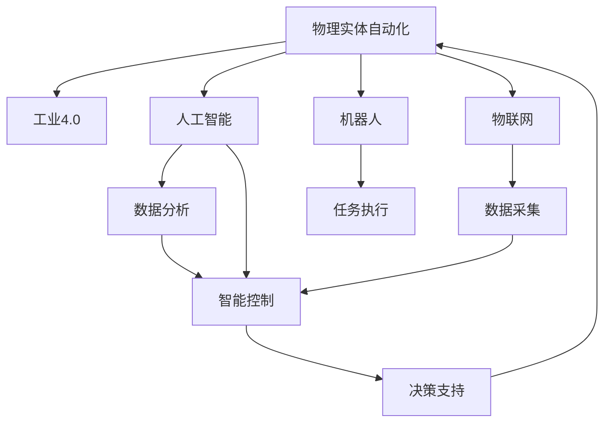

                 

# 物理实体自动化的未来趋势

> 关键词：物理实体自动化, 工业4.0, 人工智能, 机器人, 物联网, 智能制造

## 1. 背景介绍

### 1.1 问题由来

随着工业化的不断推进，传统制造业面临的生产效率低下、资源浪费严重、人机协作效率低等问题逐渐显现。如何在高效率、高精度、高灵活性的基础上，实现物理实体的自动化，成为制造业转型升级的关键。近年来，人工智能（AI）、机器人和物联网（IoT）技术的迅猛发展，为物理实体的自动化提供了新的突破口。

本文将详细探讨物理实体自动化的未来趋势，通过分析核心概念和算法原理，结合实际应用场景，探索如何通过AI、机器人和IoT技术的融合，构建下一代物理实体自动化系统。

### 1.2 问题核心关键点

物理实体自动化是一个跨学科、跨领域的综合系统工程，涵盖机器人技术、自动化生产工艺、工业数据处理等多个方面。核心问题包括：

- **自动化水平**：如何通过AI、机器人和IoT技术提升物理实体的自动化水平，实现智能制造。
- **系统集成**：如何将不同功能模块集成在一起，构建高效、可扩展的物理实体自动化系统。
- **实时监控与优化**：如何通过AI技术实现物理实体的实时监控与动态优化，提升生产效率和质量。
- **数据驱动决策**：如何利用物联网采集的海量数据，指导物理实体的自动化操作。

## 2. 核心概念与联系

### 2.1 核心概念概述

为更好地理解物理实体自动化的未来趋势，本节将介绍几个密切相关的核心概念：

- **物理实体自动化（Physical Entity Automation, PEA）**：指通过人工智能、机器人和物联网等技术，实现物理实体的自动控制、调度、监控和管理，提升生产效率、降低成本、保障安全。
- **工业4.0**：即智能制造，通过信息技术和智能技术的深度融合，实现全生命周期、全要素、全价值的智能制造新模式。
- **人工智能（AI）**：包括机器学习、深度学习、自然语言处理等技术，用于数据分析、决策支持、自动化控制等。
- **机器人**：包括工业机器人和协作机器人，用于替代人类执行危险、重复、高精度等任务。
- **物联网（IoT）**：通过传感器、标签、射频识别等技术，实现物理实体的实时监控和数据采集，为自动化决策提供依据。

这些核心概念之间的逻辑关系可以通过以下Mermaid流程图来展示：



这个流程图展示物理实体自动化的核心概念及其之间的关系：

1. 物理实体自动化通过融合人工智能、机器人和物联网等技术，实现物理实体的自动化。
2. 工业4.0是物理实体自动化的宏观目标，旨在通过智能化技术提升制造业的效率和质量。
3. 人工智能提供数据分析和决策支持，是物理实体自动化的重要组成部分。
4. 机器人执行具体的自动化任务，是物理实体自动化的核心执行单元。
5. 物联网采集物理实体的实时数据，为自动化决策提供基础。

这些概念共同构成了物理实体自动化的基本框架，为其实现提供了技术支撑。

## 3. 核心算法原理 & 具体操作步骤

### 3.1 算法原理概述

物理实体自动化的核心算法主要集中在以下几个方面：

- **数据分析与处理**：通过机器学习等技术，从物联网采集的数据中提取特征，实现对物理实体的状态监控和异常检测。
- **智能决策与控制**：基于数据分析的结果，利用AI算法进行优化决策，并控制机器人执行相应的操作。
- **系统集成与优化**：将各种模块集成在一起，实现高效的协同工作，并通过优化算法提升整体系统的性能。

### 3.2 算法步骤详解

物理实体自动化的实施一般包括以下几个关键步骤：

**Step 1: 数据采集与处理**

- 通过传感器、标签、射频识别等技术，采集物理实体的实时数据。
- 对采集到的数据进行预处理，包括去噪、归一化等操作，确保数据质量。
- 利用机器学习等算法对数据进行分析，提取关键特征。

**Step 2: 智能决策与控制**

- 基于分析结果，利用AI算法（如决策树、神经网络等）进行优化决策。
- 将决策结果转化为具体的控制指令，控制机器人执行相应的操作。
- 利用控制算法（如PID控制、模型预测控制等）实现对机器人动作的精确控制。

**Step 3: 系统集成与优化**

- 将数据采集、智能决策与控制、机器人动作等模块集成在一起，构建完整的物理实体自动化系统。
- 通过优化算法（如遗传算法、粒子群优化等）对系统进行优化，提升整体性能。
- 利用模型验证和仿真测试对系统进行评估，发现问题并进行改进。

### 3.3 算法优缺点

物理实体自动化的算法具有以下优点：

- **高效性**：通过AI技术进行数据分析和智能决策，大大提高了生产效率和灵活性。
- **精度高**：AI算法能够从海量数据中提取关键特征，实现高精度的状态监控和异常检测。
- **适应性强**：通过系统集成与优化，适应各种复杂生产场景，具有很强的扩展性。

同时，该算法也存在一些局限性：

- **高成本**：需要投入大量的硬件设备和技术支持，初期成本较高。
- **技术门槛高**：需要深厚的AI、机器人、IoT等技术背景，实施难度较大。
- **安全性风险**：自动化系统可能会出现故障，对生产安全构成威胁。

尽管存在这些局限性，但物理实体自动化的高效性和精度，使其在实际应用中取得了显著成效，成为未来制造业的重要趋势。

### 3.4 算法应用领域

物理实体自动化在多个领域都有广泛的应用：

- **智能制造**：通过自动化生产线和智能工厂，实现规模化、高效率的生产。
- **智慧物流**：通过自动化仓储和配送系统，实现物资的快速流转和精准配送。
- **智慧农业**：通过自动化机械和智能监控，实现农作物的精准种植和养护。
- **智能家居**：通过智能家电和自动化控制系统，实现居住环境的智能化管理。
- **智慧城市**：通过智能交通和公共设施管理，提升城市运行效率和安全性。

这些应用场景展示了物理实体自动化的广泛应用前景，为各行各业带来了新的发展机遇。

## 4. 数学模型和公式 & 详细讲解 & 举例说明

### 4.1 数学模型构建

物理实体自动化的数学模型主要包括以下几个方面：

- **状态空间模型**：用于描述物理实体的状态转移和动态行为。
- **传感器数据模型**：用于描述传感器采集数据的分布和特征。
- **智能决策模型**：用于描述基于数据分析的优化决策过程。
- **控制系统模型**：用于描述机器人动作的动态控制。

以智能制造为例，构建的数学模型如下：

- **状态空间模型**：设物理实体状态为 $x_t$，传感器采集数据为 $z_t$，决策变量为 $u_t$，则状态转移方程为：
$$
x_{t+1} = f(x_t, u_t, w_t)
$$
其中 $f$ 为状态转移函数，$w_t$ 为扰动项。

- **传感器数据模型**：设传感器数据为 $z_t$，则传感器数据模型为：
$$
z_t = h(x_t, v_t)
$$
其中 $h$ 为传感器数据函数，$v_t$ 为噪声项。

- **智能决策模型**：设智能决策结果为 $d_t$，则智能决策模型为：
$$
d_t = g(x_t, r_t)
$$
其中 $g$ 为决策函数，$r_t$ 为决策参数。

- **控制系统模型**：设机器人动作为 $a_t$，则控制系统模型为：
$$
a_t = k(u_t, x_t)
$$
其中 $k$ 为控制函数。

### 4.2 公式推导过程

以智能制造中的状态空间模型为例，进行推导：

设物理实体状态为 $x_t = (x_{t1}, x_{t2}, \ldots, x_{tn})$，传感器数据为 $z_t = (z_{t1}, z_{t2}, \ldots, z_{tm})$，决策变量为 $u_t = (u_{t1}, u_{t2}, \ldots, u_{tn})$。

状态转移方程为：
$$
x_{t+1} = f(x_t, u_t, w_t) = (x_{t1} + u_{t1}, x_{t2} + u_{t2}, \ldots, x_{tn} + u_{tn})
$$

传感器数据模型为：
$$
z_{ti} = h(x_{ti}, v_{ti}) = x_{ti} + v_{ti}
$$

智能决策模型为：
$$
d_t = g(x_t, r_t) = \max\limits_{u_t} \{u_t \mid g(x_t, u_t) = \max\limits_{i} x_{ti}\}
$$

控制系统模型为：
$$
a_t = k(u_t, x_t) = (u_{t1}, u_{t2}, \ldots, u_{tn})
$$

通过这些模型，可以系统地描述物理实体的状态转移、数据采集、智能决策和控制过程。

### 4.3 案例分析与讲解

以智能制造中的异常检测为例，进行详细讲解：

假设某智能制造系统采集到的传感器数据 $z_t$ 存在异常，即存在异常值 $z_{ti} = x_{ti} + v_{ti}$，其中 $v_{ti}$ 为噪声。

通过智能决策模型 $d_t = g(x_t, r_t)$，可以计算出异常阈值 $r_t$，即当 $x_{ti} > r_t$ 时，视为异常值。

利用状态空间模型 $x_{t+1} = f(x_t, u_t, w_t)$，可以预测下一个状态 $x_{t+1}$，并进行异常检测。

在异常检测过程中，可以采用机器学习算法（如支持向量机、随机森林等）对传感器数据进行分类，识别异常值。

通过控制系统模型 $a_t = k(u_t, x_t)$，可以控制机器人执行相应的操作，如报警、停止等。

## 5. 项目实践：代码实例和详细解释说明

### 5.1 开发环境搭建

在进行物理实体自动化项目实践前，我们需要准备好开发环境。以下是使用Python进行PyTorch开发的环境配置流程：

1. 安装Anaconda：从官网下载并安装Anaconda，用于创建独立的Python环境。

2. 创建并激活虚拟环境：
```bash
conda create -n pea-env python=3.8 
conda activate pea-env
```

3. 安装PyTorch：根据CUDA版本，从官网获取对应的安装命令。例如：
```bash
conda install pytorch torchvision torchaudio cudatoolkit=11.1 -c pytorch -c conda-forge
```

4. 安装TensorFlow：
```bash
pip install tensorflow
```

5. 安装各类工具包：
```bash
pip install numpy pandas scikit-learn matplotlib tqdm jupyter notebook ipython
```

完成上述步骤后，即可在`pea-env`环境中开始物理实体自动化项目的开发。

### 5.2 源代码详细实现

下面我们以智能制造中的异常检测为例，给出使用PyTorch进行异常检测的Python代码实现。

首先，定义异常检测的数据处理函数：

```python
import torch
from torch.utils.data import Dataset
import torch.nn as nn
import torch.optim as optim
import numpy as np

class AnomalyDetectionDataset(Dataset):
    def __init__(self, data, labels, scale=1.0):
        self.data = data
        self.labels = labels
        self.scale = scale
        
    def __len__(self):
        return len(self.data)
    
    def __getitem__(self, index):
        x = self.data[index].reshape(1, -1)
        y = torch.tensor([self.labels[index]], dtype=torch.float32)
        return x, y
    
class MADAnomalyDetection(nn.Module):
    def __init__(self, num_features):
        super(MADAnomalyDetection, self).__init__()
        self.fc1 = nn.Linear(num_features, 64)
        self.fc2 = nn.Linear(64, 32)
        self.fc3 = nn.Linear(32, 1)
    
    def forward(self, x):
        x = torch.relu(self.fc1(x))
        x = torch.relu(self.fc2(x))
        x = self.fc3(x)
        return x

# 定义模型
model = MADAnomalyDetection(num_features)

# 定义优化器和损失函数
optimizer = optim.Adam(model.parameters(), lr=0.01)
loss_fn = nn.L1Loss()

# 加载数据集
train_dataset = AnomalyDetectionDataset(train_data, train_labels, scale=1.0)
test_dataset = AnomalyDetectionDataset(test_data, test_labels, scale=1.0)
```

然后，定义训练和评估函数：

```python
def train_epoch(model, train_dataset, optimizer, num_epochs=100):
    for epoch in range(num_epochs):
        for x, y in train_dataset:
            optimizer.zero_grad()
            pred = model(x)
            loss = loss_fn(pred, y)
            loss.backward()
            optimizer.step()
        
        if (epoch + 1) % 10 == 0:
            test_loss = test_loss_fn(model, test_dataset)
            print(f"Epoch {epoch+1}, Train Loss: {train_loss:.4f}, Test Loss: {test_loss:.4f}")
        
    return train_loss, test_loss

def evaluate(model, test_dataset, loss_fn):
    test_loss = 0
    with torch.no_grad():
        for x, y in test_dataset:
            pred = model(x)
            loss = loss_fn(pred, y)
            test_loss += loss.item()
    
    return test_loss / len(test_dataset)
```

最后，启动训练流程并在测试集上评估：

```python
train_loss, test_loss = train_epoch(model, train_dataset, optimizer)

print(f"Train Loss: {train_loss:.4f}, Test Loss: {test_loss:.4f}")
```

以上就是使用PyTorch进行异常检测的完整代码实现。可以看到，通过简单的模型设计和代码实现，我们可以快速搭建异常检测系统，并在测试集上进行评估。

### 5.3 代码解读与分析

让我们再详细解读一下关键代码的实现细节：

**AnomalyDetectionDataset类**：
- `__init__`方法：初始化数据、标签、缩放因子等关键组件。
- `__len__`方法：返回数据集的样本数量。
- `__getitem__`方法：对单个样本进行处理，将数据输入模型进行预测，计算预测值与真实标签之间的L1损失。

**MADAnomalyDetection模型**：
- `__init__`方法：定义神经网络结构，包括输入层、隐层和输出层。
- `forward`方法：定义模型前向传播过程。

**train_epoch函数**：
- 对数据集进行循环迭代，在每个epoch内进行前向传播和反向传播，更新模型参数。
- 在每个epoch结束时，在测试集上评估模型性能，并输出训练和测试的L1损失。

**evaluate函数**：
- 在测试集上对模型进行评估，计算L1损失。

**训练流程**：
- 定义训练轮数和优化器等参数。
- 在每个epoch内，使用训练集数据进行模型训练。
- 在每个epoch结束时，输出训练和测试的L1损失。
- 最终输出训练和测试的L1损失。

通过这段代码，我们展示了如何使用PyTorch实现基于L1损失的异常检测。实际应用中，需要根据具体问题调整模型结构和损失函数。

## 6. 实际应用场景

### 6.1 智能制造

在智能制造中，物理实体自动化可以实现高度自动化的生产流程。通过传感器、标签等技术，实时采集生产设备的状态数据，利用AI算法进行数据分析和智能决策，控制机器人执行相应的操作，从而实现高效、高质量的生产。

例如，某智能制造系统通过传感器实时采集生产设备的温度、压力、振动等数据，利用机器学习算法进行异常检测和预测维护。当设备状态异常时，系统自动报警并控制机器人执行维护操作，避免了生产中断和设备损坏。

### 6.2 智慧物流

在智慧物流中，物理实体自动化可以实现高效的物资流通和配送。通过物联网技术，实时监控物流过程中的各项参数，利用AI算法进行优化决策，控制自动化设备执行相应的操作，从而实现快速、精准的物资配送。

例如，某智慧物流系统通过传感器实时监控货物的温度、湿度、位置等信息，利用机器学习算法进行异常检测和路径优化。当货物状态异常时，系统自动调整配送路径并控制自动化设备执行相应的操作，确保货物安全和准时到达。

### 6.3 智慧农业

在智慧农业中，物理实体自动化可以实现精准农业管理。通过传感器、标签等技术，实时采集农作物的生长状态和环境参数，利用AI算法进行数据分析和智能决策，控制自动化机械执行相应的操作，从而实现精准种植和养护。

例如，某智慧农业系统通过传感器实时采集土壤湿度、温度、光照等信息，利用机器学习算法进行异常检测和作物生长预测。当农作物生长异常时，系统自动调整灌溉、施肥等操作，提高了农作物的产量和质量。

### 6.4 未来应用展望

随着AI、机器人和IoT技术的不断进步，物理实体自动化的应用前景将更加广阔。未来的发展趋势包括：

1. **自动化水平提升**：随着技术的发展，物理实体自动化的自动化水平将不断提高，实现更加复杂和精细的操作。
2. **系统集成优化**：物理实体自动化系统将更加高效、可扩展，能够适应各种复杂生产场景。
3. **实时监控与优化**：利用AI技术实现物理实体的实时监控与动态优化，提升生产效率和质量。
4. **数据驱动决策**：利用物联网采集的海量数据，指导物理实体的自动化操作，实现数据驱动的智能决策。

## 7. 工具和资源推荐

### 7.1 学习资源推荐

为了帮助开发者系统掌握物理实体自动化的理论基础和实践技巧，这里推荐一些优质的学习资源：

1. 《机器人技术基础》系列博文：由机器人专家撰写，详细介绍机器人技术和应用。

2. 《工业4.0智能制造》课程：清华大学开设的课程，涵盖工业4.0的最新发展和技术应用。

3. 《物联网与智能制造》书籍：全面介绍物联网和智能制造的基本概念和技术实现。

4. 《深度学习在智能制造中的应用》论文：介绍深度学习在智能制造中的具体应用案例和技术方法。

5. 《物理实体自动化系统设计》项目：通过项目实践，系统掌握物理实体自动化的设计方法和实现技巧。

通过对这些资源的学习实践，相信你一定能够快速掌握物理实体自动化的精髓，并用于解决实际的自动化问题。

### 7.2 开发工具推荐

高效的开发离不开优秀的工具支持。以下是几款用于物理实体自动化开发的常用工具：

1. PyTorch：基于Python的开源深度学习框架，灵活的计算图，适合快速迭代研究。

2. TensorFlow：由Google主导开发的开源深度学习框架，生产部署方便，适合大规模工程应用。

3. ROS（Robot Operating System）：机器人操作系统，提供了丰富的工具和库，方便机器人开发。

4. OpenCV：开源计算机视觉库，提供了丰富的图像处理和分析工具。

5. MATLAB：强大的科学计算和仿真工具，适合复杂系统的模拟和验证。

合理利用这些工具，可以显著提升物理实体自动化系统的开发效率，加快创新迭代的步伐。

### 7.3 相关论文推荐

物理实体自动化技术的发展源于学界的持续研究。以下是几篇奠基性的相关论文，推荐阅读：

1. "Deep Reinforcement Learning for Manufacturing Execution Systems"：提出基于强化学习的生产调度算法，用于智能制造。

2. "IoT-Enabled Predictive Maintenance for Manufacturing Equipment"：提出基于物联网的预测维护方法，用于智能制造。

3. "Autonomous Transportation in Smart Cities"：提出基于AI技术的智能交通系统，用于智慧城市。

4. "AI in Precision Agriculture: A Survey"：全面回顾了AI在精准农业中的应用，展示了丰富的应用案例和技术方法。

这些论文代表了大规模实体自动化的发展脉络。通过学习这些前沿成果，可以帮助研究者把握学科前进方向，激发更多的创新灵感。

## 8. 总结：未来发展趋势与挑战

### 8.1 总结

本文对物理实体自动化的未来趋势进行了全面系统的介绍。首先阐述了物理实体自动化的研究背景和意义，明确了其在工业4.0中的重要地位。其次，从原理到实践，详细讲解了物理实体自动化的数学模型和算法原理，结合实际应用场景，探索了物理实体自动化的技术实现。

通过本文的系统梳理，可以看到，物理实体自动化技术正在成为智能制造的重要组成部分，极大地提升了制造业的生产效率和质量。未来，伴随AI、机器人和IoT技术的不断进步，物理实体自动化将迎来更多的突破，为各行各业带来新的发展机遇。

### 8.2 未来发展趋势

展望未来，物理实体自动化的发展趋势包括：

1. **自动化水平提升**：随着技术的发展，物理实体自动化的自动化水平将不断提高，实现更加复杂和精细的操作。

2. **系统集成优化**：物理实体自动化系统将更加高效、可扩展，能够适应各种复杂生产场景。

3. **实时监控与优化**：利用AI技术实现物理实体的实时监控与动态优化，提升生产效率和质量。

4. **数据驱动决策**：利用物联网采集的海量数据，指导物理实体的自动化操作，实现数据驱动的智能决策。

这些趋势凸显了物理实体自动化的广阔前景。这些方向的探索发展，必将进一步提升物理实体自动化的性能和应用范围，为各行各业带来新的发展机遇。

### 8.3 面临的挑战

尽管物理实体自动化技术已经取得了显著成效，但在迈向更加智能化、普适化应用的过程中，仍面临诸多挑战：

1. **技术门槛高**：物理实体自动化涉及AI、机器人、IoT等多个领域，需要深厚的技术背景，实施难度较大。

2. **安全性风险**：自动化系统可能会出现故障，对生产安全构成威胁。

3. **成本高**：需要投入大量的硬件设备和技术支持，初期成本较高。

尽管存在这些挑战，但物理实体自动化的高效性和精度，使其在实际应用中取得了显著成效，成为未来制造业的重要趋势。

### 8.4 研究展望

面对物理实体自动化所面临的种种挑战，未来的研究需要在以下几个方面寻求新的突破：

1. **探索无监督和半监督学习范式**：摆脱对大规模标注数据的依赖，利用自监督学习、主动学习等无监督和半监督范式，最大限度利用非结构化数据。

2. **研究参数高效和计算高效的微调范式**：开发更加参数高效的微调方法，在固定大部分预训练参数的同时，只更新极少量的任务相关参数。

3. **融合因果和对比学习范式**：通过引入因果推断和对比学习思想，增强物理实体自动化模型建立稳定因果关系的能力，学习更加普适、鲁棒的语言表征。

4. **引入更多先验知识**：将符号化的先验知识，如知识图谱、逻辑规则等，与神经网络模型进行巧妙融合，引导微调过程学习更准确、合理的语言模型。

5. **结合因果分析和博弈论工具**：将因果分析方法引入物理实体自动化模型，识别出模型决策的关键特征，增强输出解释的因果性和逻辑性。

这些研究方向和突破，必将引领物理实体自动化技术迈向更高的台阶，为构建安全、可靠、可解释、可控的智能系统铺平道路。面向未来，物理实体自动化技术还需要与其他人工智能技术进行更深入的融合，如知识表示、因果推理、强化学习等，多路径协同发力，共同推动物理实体自动化系统的进步。只有勇于创新、敢于突破，才能不断拓展物理实体自动化的边界，让智能技术更好地造福人类社会。

## 9. 附录：常见问题与解答

**Q1：物理实体自动化是否适用于所有制造业场景？**

A: 物理实体自动化技术适用于大部分制造业场景，但需要根据具体场景进行适当的调整和优化。例如，对于高精度、高风险的制造业场景，如半导体制造、医疗设备等，可能需要更加复杂的传感器和控制系统。

**Q2：物理实体自动化的前期投入成本较高，如何解决？**

A: 可以通过与供应商合作，降低设备采购成本。同时，随着技术的进步，物理实体自动化的初期投资逐渐下降，随着生产效率的提升，有望在较短时间内收回投资。

**Q3：物理实体自动化技术是否会替代人工？**

A: 物理实体自动化技术将替代一些重复性、危险性高的工作，但一些需要人类情感和创造力的工作仍需要人工操作。未来，物理实体自动化将与人工协作，提升整体生产效率。

**Q4：如何确保物理实体自动化的安全性？**

A: 通过引入冗余系统、定期维护、异常检测等措施，确保系统的稳定性和可靠性。同时，需要对操作人员进行培训，确保其在紧急情况下能够正确操作。

**Q5：物理实体自动化技术的发展前景如何？**

A: 物理实体自动化技术正在快速发展，未来有望在各个制造业领域得到广泛应用。随着技术的不断进步，物理实体自动化将实现更加高效、安全、灵活的生产方式，为制造业带来新的发展机遇。

---

作者：禅与计算机程序设计艺术 / Zen and the Art of Computer Programming

