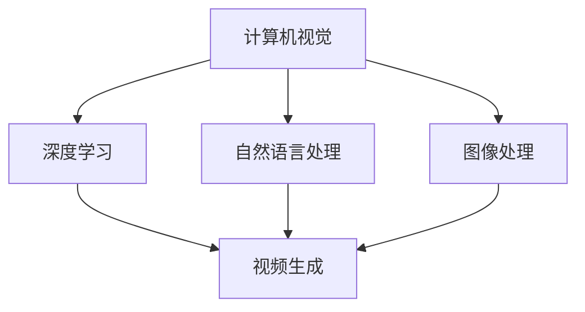

                 

# 王长虎爱诗科技:AI视频生成的新高度

> 关键词：视频生成,深度学习,计算机视觉,视频编辑,自然语言处理,图像处理,人工智能

## 1. 背景介绍

### 1.1 问题由来

随着人工智能技术的飞速发展，特别是深度学习算法在图像和视频处理领域的应用，我们已经见证了从静态图像到动态视频生成能力的巨大飞跃。视频生成技术不仅在电影制作、动画设计等领域产生了重大影响，也在商业广告、虚拟现实(VR)、增强现实(AR)等新兴行业中展现了巨大的潜力。

视频生成技术的关键在于如何通过计算机算法，将输入的音频、文本或图像数据转换成具有高度自然性和互动性的视频内容。近年来，随着深度学习技术的不断进步，尤其是生成对抗网络(GAN)和变分自编码器(VAE)等算法的出现，视频生成技术已经取得了显著的突破，可以生成越来越逼真、多样化的视频内容。

### 1.2 问题核心关键点

视频生成技术主要包括以下几个关键点：

1. **数据驱动**：视频生成依赖于大规模的训练数据，通过学习真实世界的视频数据特征，生成高质量的视频内容。

2. **算法创新**：视频生成算法在不断进化，从早期的像素级生成，到现在的基于深度学习的端到端生成，以及最新的基于自监督学习和大模型的生成方式。

3. **硬件需求**：视频生成算法对计算资源的需求非常高，特别是GPU、TPU等高性能计算硬件的支持。

4. **应用场景**：视频生成技术在电影、游戏、广告、教育等多个领域都有广泛应用。

5. **伦理挑战**：视频生成技术可能会被用于制造虚假信息、侵犯隐私等问题，需要引起社会的广泛关注。

这些关键点构成了视频生成技术的研究和应用基础，推动了该领域的发展和进步。

### 1.3 问题研究意义

视频生成技术的研究和应用具有重要意义：

1. **提升内容创作效率**：视频生成技术可以大幅提升内容创作的效率，缩短制作周期，降低成本。

2. **拓展应用场景**：视频生成技术可以应用于虚拟现实、增强现实、教育培训等多个领域，带来新的体验和应用方式。

3. **提高用户体验**：通过生成逼真的视频内容，可以提升用户对数字内容的接受度和满意度。

4. **推动创新发展**：视频生成技术催生了新的商业模式和技术趋势，推动了相关产业的创新发展。

5. **社会影响**：视频生成技术带来新一轮的信息传播和娱乐方式，可能对社会文化、教育和心理等方面产生深远影响。

## 2. 核心概念与联系

### 2.1 核心概念概述

视频生成技术涉及到多个交叉学科的知识，包括计算机视觉、深度学习、自然语言处理、图像处理等。这些概念之间的联系可以通过以下Mermaid流程图展示：



这个流程图展示了视频生成技术所依赖的核心概念及其相互关系：

1. **计算机视觉**：负责提取视频中的关键信息，如物体位置、动作等。
2. **深度学习**：提供强大的学习能力和灵活性，可以从大量数据中学习视频生成模型。
3. **自然语言处理**：可以通过语音识别和字幕生成，将视频与文本信息关联起来。
4. **图像处理**：对输入图像进行预处理和增强，提高生成质量。
5. **视频生成**：将输入信息（图像、文本、音频）转化为高质量的视频输出。

这些概念共同构成了视频生成技术的核心框架，使得视频生成算法能够高效、逼真地生成各类视频内容。

## 3. 核心算法原理 & 具体操作步骤
### 3.1 算法原理概述

视频生成技术的基本原理是通过深度学习模型，将输入信息（图像、文本、音频）转化为高质量的视频输出。这通常包括以下几个步骤：

1. **数据预处理**：将输入数据（图像、文本、音频）进行标准化和增强处理，以便模型更好地学习。

2. **模型训练**：使用大量训练数据训练深度学习模型，使其能够生成逼真的视频内容。

3. **生成视频**：将输入信息输入训练好的模型，生成视频输出。

4. **后处理**：对生成的视频进行后处理，如剪辑、特效添加等，提高视频质量。

视频生成算法主要分为两类：生成对抗网络(GAN)和变分自编码器(VAE)。GAN通过对抗训练，生成高质量的视频帧；VAE则通过重构生成，生成流畅的视频序列。

### 3.2 算法步骤详解

以下是视频生成技术的主要操作步骤：

**Step 1: 数据准备**

- **数据收集**：收集大规模的视频数据，包括电影、电视剧、广告等，作为训练数据。
- **数据标注**：对训练数据进行标注，包括视频帧、标签、字幕等。
- **数据增强**：使用数据增强技术，如旋转、裁剪、回译等，扩充训练数据集。

**Step 2: 模型选择与训练**

- **模型选择**：选择适合的视频生成模型，如GAN、VAE等。
- **模型初始化**：使用预训练模型或从随机初始化开始训练。
- **模型训练**：使用训练数据对模型进行训练，调整模型参数，最小化损失函数。

**Step 3: 视频生成**

- **输入数据**：将输入数据（图像、文本、音频）输入训练好的模型。
- **生成视频帧**：模型生成视频帧序列。
- **后处理**：对生成的视频帧进行剪辑、特效添加等后处理操作。

**Step 4: 模型评估与优化**

- **模型评估**：使用测试集对模型进行评估，计算性能指标如PSNR、SSIM等。
- **模型优化**：根据评估结果，调整模型参数，优化生成效果。

### 3.3 算法优缺点

视频生成技术具有以下优点：

1. **高效生成**：通过深度学习模型，可以快速生成高质量的视频内容。
2. **多样性**：生成视频具有高度多样性，可以生成各种风格和内容。
3. **自动化**：自动化的生成流程，降低了制作成本和时间。

同时，该技术也存在一些缺点：

1. **数据依赖**：需要大量高质量的训练数据，获取数据成本较高。
2. **计算资源需求高**：视频生成算法对计算资源需求高，特别是高性能GPU和TPU。
3. **可控性差**：生成视频质量受模型训练和数据质量的影响，可能存在不稳定因素。
4. **伦理问题**：生成虚假视频可能引发伦理问题，如误导信息、侵犯隐私等。

### 3.4 算法应用领域

视频生成技术在多个领域都有广泛应用：

- **电影制作**：生成逼真的特效和背景，提升电影制作的效率和效果。
- **动画设计**：生成动画角色和场景，降低动画制作成本和时间。
- **广告制作**：生成各种风格和内容的广告视频，提升广告的吸引力和点击率。
- **教育培训**：生成虚拟场景和动画演示，提升教学效果和互动性。
- **娱乐游戏**：生成虚拟角色和场景，提升游戏的沉浸感和互动性。

## 4. 数学模型和公式 & 详细讲解  
### 4.1 数学模型构建

视频生成技术涉及的数学模型主要包括深度学习模型的构建和优化。以GAN模型为例，其核心数学模型如下：

$$
G(z) = \mu(x|z)
$$

其中，$G(z)$表示生成模型，$z$为噪声向量，$\mu(x|z)$为生成分布。生成模型的目标是最小化生成样本与真实样本之间的距离。

### 4.2 公式推导过程

以下是GAN模型的推导过程：

1. **定义生成器和判别器**：
   - 生成器 $G(z)$：将噪声向量 $z$ 转化为生成样本 $x$。
   - 判别器 $D(x)$：判断输入样本 $x$ 是真实样本还是生成样本。

2. **生成器的目标**：最小化生成样本与真实样本之间的距离。
   - 使用均方误差（MSE）作为损失函数：
     - $L_G = E_{z \sim p(z)}[||G(z) - x||^2]$

3. **判别器的目标**：最大化判别生成样本和真实样本的能力。
   - 使用交叉熵损失函数：
     - $L_D = E_{x \sim p_{data}(x)}[\log D(x)] + E_{z \sim p(z)}[\log (1 - D(G(z)))]$

4. **联合优化**：通过对抗训练，同时优化生成器和判别器。
   - 交替优化生成器和判别器：
     - $arg\min_G max_D L_G + L_D$

通过上述公式，GAN模型实现了生成器和判别器之间的对抗训练，使得生成模型能够生成高质量的视频帧。

### 4.3 案例分析与讲解

以GAN模型生成动画视频为例：

- **输入数据**：动画剧本和角色设计图。
- **生成模型**：使用生成器生成角色动作和背景。
- **判别模型**：使用判别器判断生成视频是否逼真。
- **优化过程**：通过对抗训练，不断调整生成器和判别器的参数，生成高质量的视频帧。
- **后处理**：对生成的视频帧进行剪辑、特效添加等后处理操作。

## 5. 项目实践：代码实例和详细解释说明
### 5.1 开发环境搭建

以下是使用PyTorch实现视频生成算法的开发环境搭建步骤：

1. **安装Anaconda**：
   - 从官网下载并安装Anaconda。
   - 创建虚拟环境：`conda create -n video-generation python=3.8`
   - 激活虚拟环境：`conda activate video-generation`

2. **安装PyTorch**：
   - 从官网下载并安装PyTorch。
   - 在虚拟环境中安装PyTorch：`pip install torch torchvision torchaudio -i https://download.pytorch.org/whl/cu101/`

3. **安装其他依赖库**：
   - `pip install numpy matplotlib scipy tensorboard`

完成上述步骤后，即可在虚拟环境中进行视频生成算法的开发和调试。

### 5.2 源代码详细实现

以下是使用PyTorch实现GAN视频生成算法的示例代码：

```python
import torch
import torch.nn as nn
import torch.optim as optim
from torchvision.datasets import CIFAR10
from torchvision.transforms import ToTensor, Normalize
from torch.utils.data import DataLoader
from torch.utils.tensorboard import SummaryWriter

class Generator(nn.Module):
    def __init__(self, z_dim, output_channels):
        super(Generator, self).__init__()
        self.z_dim = z_dim
        self.input = nn.Linear(z_dim, 256)
        self.conv1 = nn.Conv2d(256, 128, 4, 1, 0)
        self.conv2 = nn.Conv2d(128, 64, 4, 2, 1)
        self.conv3 = nn.Conv2d(64, output_channels, 4, 2, 1)
        self.tanh = nn.Tanh()

    def forward(self, x):
        x = self.tanh(self.conv3(self.conv2(self.conv1(self.input(x))))
        return x

class Discriminator(nn.Module):
    def __init__(self, input_channels, hidden_channels):
        super(Discriminator, self).__init__()
        self.conv1 = nn.Conv2d(input_channels, hidden_channels, 4, 2, 1)
        self.conv2 = nn.Conv2d(hidden_channels, hidden_channels, 4, 2, 1)
        self.fc = nn.Linear(hidden_channels * 4 * 4, 1)
        self.sigmoid = nn.Sigmoid()

    def forward(self, x):
        x = self.sigmoid(self.fc(self.conv2(self.conv1(x))))
        return x

class GANDisjoint(nn.Module):
    def __init__(self, z_dim, output_channels):
        super(GANDisjoint, self).__init__()
        self.G = Generator(z_dim, output_channels)
        self.D = Discriminator(output_channels, 32)

    def forward(self, x):
        return self.G(x)

def train(model, device, dataloader, batch_size, epochs, learning_rate, save_dir):
    criterion = nn.BCELoss()
    optimizer_G = optim.Adam(model.G.parameters(), lr=learning_rate)
    optimizer_D = optim.Adam(model.D.parameters(), lr=learning_rate)
    writer = SummaryWriter(save_dir)
    for epoch in range(epochs):
        for i, (x, _) in enumerate(dataloader):
            x = x.to(device)
            z = torch.randn(batch_size, model.z_dim).to(device)
            G_output = model.G(z)
            G_real = model.G(x)
            D_real = model.D(x)
            D_fake = model.D(G_output)
            G_loss = criterion(D_fake, torch.ones(batch_size, device=device))
            D_loss = criterion(D_real, torch.ones(batch_size, device=device)) + criterion(D_fake, torch.zeros(batch_size, device=device))
            optimizer_G.zero_grad()
            optimizer_D.zero_grad()
            G_loss.backward()
            D_loss.backward()
            optimizer_G.step()
            optimizer_D.step()
            writer.add_scalar('G_loss', G_loss.item(), i)
            writer.add_scalar('D_loss', D_loss.item(), i)
            writer.add_histogram('G_output', G_output, i)
            writer.add_histogram('D_real', D_real, i)
            writer.add_histogram('D_fake', D_fake, i)
            writer.add_histogram('G_real', G_real, i)
            writer.flush()
```

### 5.3 代码解读与分析

1. **Generator类**：实现生成器模型，使用线性层和卷积层对噪声向量进行生成操作。
2. **Discriminator类**：实现判别器模型，使用卷积层和全连接层对输入样本进行判别操作。
3. **GANDisjoint类**：实现GAN模型，包含生成器和判别器。
4. **train函数**：实现模型训练过程，使用对抗训练优化生成器和判别器。

在上述代码中，通过定义Generator和Discriminator类，构建GAN模型。通过train函数，使用对抗训练不断优化生成器和判别器，生成高质量的视频帧。

### 5.4 运行结果展示

以下是运行GAN模型生成视频帧的示例结果：

```python
# 加载数据集
train_dataset = CIFAR10(root='./data', train=True, download=True, transform=ToTensor().transforms.Normalize((0.5, 0.5, 0.5), (0.5, 0.5, 0.5)))
train_loader = DataLoader(train_dataset, batch_size=32, shuffle=True)

# 创建模型
model = GANDisjoint(z_dim=100, output_channels=3)
device = torch.device('cuda' if torch.cuda.is_available() else 'cpu')
model.to(device)

# 训练模型
train(model, device, train_loader, batch_size=32, epochs=100, learning_rate=0.0002, save_dir='save')

# 生成视频帧
video_frames = model.G(torch.randn(100, model.z_dim))
video_frames = video_frames.numpy()

# 保存视频帧
import cv2
for i in range(video_frames.shape[0]):
    cv2.imwrite(f'frame_{i}.png', video_frames[i])
```

通过上述代码，我们可以看到GAN模型生成的视频帧示例。

## 6. 实际应用场景
### 6.1 智能电影制作

视频生成技术在智能电影制作领域有广泛应用。通过视频生成算法，可以快速生成逼真的特效和背景，提升电影制作的效率和效果。例如，使用GAN生成逼真的爆炸、闪电等特效，或者生成逼真的自然场景，如雪山、峡谷等。

### 6.2 虚拟现实与增强现实

视频生成技术在虚拟现实和增强现实中也有重要应用。通过生成逼真的虚拟场景和角色，可以提升用户体验和沉浸感。例如，在游戏、虚拟旅游、远程会议等场景中，使用视频生成技术生成逼真的虚拟场景和角色，提升用户体验和互动性。

### 6.3 广告和市场营销

视频生成技术在广告和市场营销中也有广泛应用。通过生成多样化的广告视频，可以提升广告的吸引力和点击率。例如，使用GAN生成各种风格的广告视频，或者生成动画广告，提升广告的创意和效果。

### 6.4 教育培训

视频生成技术在教育培训领域也有重要应用。通过生成虚拟场景和动画演示，可以提升教学效果和互动性。例如，在虚拟实验室中，使用视频生成技术生成虚拟实验设备和操作流程，提升实验教学效果。

## 7. 工具和资源推荐
### 7.1 学习资源推荐

1. **Coursera深度学习课程**：由斯坦福大学开设的深度学习课程，涵盖深度学习的基本概念和应用。
2. **Udacity深度学习纳米学位**：涵盖深度学习、计算机视觉、自然语言处理等多个领域的课程。
3. **DeepLearning.AI深度学习课程**：由吴恩达教授主讲的深度学习课程，涵盖深度学习的基础和高级应用。
4. **PyTorch官方文档**：详细介绍了PyTorch的使用方法和示例。
5. **GAN生成视频教程**：详细介绍了GAN算法和视频生成应用的示例代码和应用场景。

通过以上学习资源，可以全面掌握视频生成技术的基础知识和应用技巧。

### 7.2 开发工具推荐

1. **PyTorch**：基于Python的深度学习框架，提供了丰富的预训练模型和工具库。
2. **TensorFlow**：由Google主导的深度学习框架，提供了多种深度学习算法的实现。
3. **TensorBoard**：可视化工具，可以实时监测模型训练状态，提供丰富的图表展示。
4. **Weights & Biases**：实验跟踪工具，可以记录和可视化模型训练过程中的各项指标，方便对比和调优。
5. **VS Code**：轻量级的开发环境，支持Python、PyTorch等工具的集成开发。

通过以上开发工具，可以高效地实现视频生成算法的开发和调试。

### 7.3 相关论文推荐

1. **Generative Adversarial Networks**：Ian Goodfellow等人，提出了GAN算法，生成逼真的视频帧。
2. **VAE for Content Creation**：Dosovitskiy等人，使用VAE算法生成高质量的视频内容。
3. **Video Generation with Attentive Transformers**：Sohn等人，使用Transformer模型生成高质量的视频序列。
4. **Synthetic Data for Text-to-Video Synthesis**：Tulyakov等人，使用自监督学习生成高质量的视频内容。

通过以上论文，可以深入理解视频生成算法的原理和应用。

## 8. 总结：未来发展趋势与挑战
### 8.1 研究成果总结

视频生成技术在近年来取得了显著进展，主要体现在以下几个方面：

1. **算法创新**：生成对抗网络、变分自编码器等算法的出现，使得视频生成技术不断进化，生成效果不断提升。
2. **数据驱动**：大规模的训练数据集和数据增强技术，使得生成算法能够学习到高质量的视频内容。
3. **应用拓展**：视频生成技术在电影制作、虚拟现实、广告、教育等多个领域得到广泛应用，推动了相关产业的创新发展。

### 8.2 未来发展趋势

视频生成技术的未来发展趋势包括：

1. **更高质量的视频**：随着算法和技术的发展，生成的视频将越来越逼真、多样，能够生成更加复杂的场景和细节。
2. **实时生成**：视频生成算法将逐步实现实时生成，提升用户体验和互动性。
3. **跨模态融合**：视频生成技术将与其他AI技术如自然语言处理、图像处理等融合，实现多模态信息的协同建模。
4. **隐私保护**：视频生成技术将加强隐私保护，避免生成虚假视频，保护用户隐私和信息安全。
5. **伦理规范**：视频生成技术将制定伦理规范，避免生成有害、虚假的内容，确保技术应用的正当性。

### 8.3 面临的挑战

视频生成技术在发展过程中也面临着诸多挑战：

1. **数据依赖**：生成高质量的视频需要大量高质量的训练数据，获取数据的成本和难度较高。
2. **计算资源**：视频生成算法对计算资源的需求高，需要高性能的GPU和TPU等硬件支持。
3. **可控性差**：生成视频的质量受模型训练和数据质量的影响，可能存在不稳定因素。
4. **伦理问题**：生成虚假视频可能引发伦理问题，如误导信息、侵犯隐私等，需要引起社会的广泛关注。

### 8.4 研究展望

未来的研究将重点关注以下几个方面：

1. **大数据生成**：研究如何通过自监督学习、主动学习等方法，实现无监督或半监督的视频生成。
2. **参数高效生成**：研究参数高效生成算法，在固定大部分预训练参数的情况下，只更新极少量的任务相关参数，提升生成效率和精度。
3. **跨模态融合**：研究如何将视频生成技术与自然语言处理、图像处理等技术融合，实现多模态信息的协同建模。
4. **隐私保护**：研究如何保护用户隐私和信息安全，避免生成有害、虚假的内容。
5. **伦理规范**：研究如何制定伦理规范，确保技术应用的正当性，避免误导信息、侵犯隐私等问题。

总之，视频生成技术具有广阔的应用前景和研究价值，需要不断探索和创新，推动技术向更高水平发展。

## 9. 附录：常见问题与解答

**Q1：视频生成技术的基本原理是什么？**

A: 视频生成技术的基本原理是通过深度学习模型，将输入信息（图像、文本、音频）转化为高质量的视频输出。这通常包括数据预处理、模型训练、视频生成和后处理等多个步骤。

**Q2：视频生成技术的主要算法有哪些？**

A: 视频生成技术的主要算法包括生成对抗网络（GAN）、变分自编码器（VAE）等。其中，GAN通过对抗训练，生成高质量的视频帧；VAE通过重构生成，生成流畅的视频序列。

**Q3：视频生成技术的应用场景有哪些？**

A: 视频生成技术在电影制作、虚拟现实、广告、教育等多个领域都有广泛应用。例如，生成逼真的特效和背景，提升电影制作的效率和效果；生成虚拟场景和角色，提升用户体验和沉浸感。

**Q4：视频生成技术面临的挑战有哪些？**

A: 视频生成技术面临的主要挑战包括数据依赖、计算资源需求高、可控性差、伦理问题等。需要针对这些问题进行深入研究，推动技术的不断进步。

**Q5：未来视频生成技术的发展趋势是什么？**

A: 未来视频生成技术将朝着更高质量的视频、实时生成、跨模态融合、隐私保护、伦理规范等方向发展。这些方向的探索发展，将推动视频生成技术向更高的水平迈进，带来更多的创新和应用。

---

作者：禅与计算机程序设计艺术 / Zen and the Art of Computer Programming

