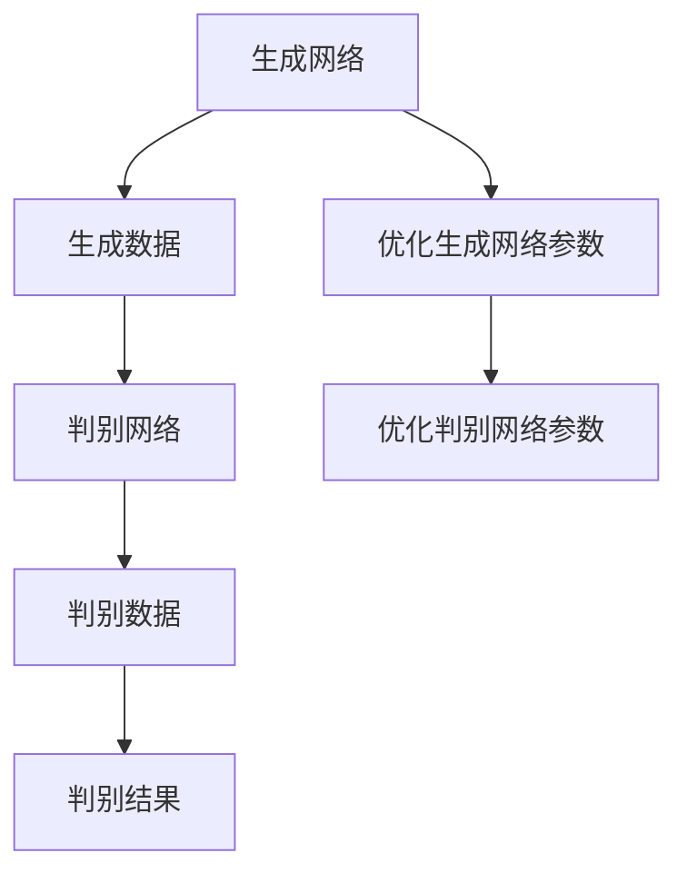

                 

# 生成对抗网络GAN原理与代码实例讲解

> 关键词：生成对抗网络, GANs, 生成模型, 判别模型, 损失函数, 图像生成, 深度学习

## 1. 背景介绍

生成对抗网络（Generative Adversarial Networks, GANs）是由Ian Goodfellow等人在2014年提出的深度学习模型，用于生成高质量的样本数据，如图像、音频、文本等。GANs通过两个神经网络（一个生成模型和另一个判别模型）相互博弈的方式，生成逼真的数据样本，具有广阔的应用前景，例如：

- 图像生成：从噪声或低分辨率图像生成高清晰度图像。
- 视频生成：从单帧生成完整的序列视频。
- 音频生成：从波形或文本生成音频信号。
- 自然语言处理：从噪声文本生成连贯的语句或段落。
- 图像编辑：对图像进行风格转换、去噪等操作。

GANs不仅在学术界引起了广泛关注，也被应用于实际应用，如虚拟现实、游戏开发、医学图像生成等。然而，GANs的训练过程复杂，需要精心设计算法和调整超参数。本文章将详细介绍GANs的基本原理和代码实现，并给出实际应用场景，帮助读者更好地理解GANs的训练和应用。

## 2. 核心概念与联系

### 2.1 核心概念概述

GANs由两个神经网络构成：生成网络（Generative Network）和判别网络（Discriminative Network）。生成网络的任务是生成与真实数据相似的假数据，判别网络的任务是区分真实数据和假数据。

- 生成网络（Generative Network）：负责生成与真实数据分布相似的数据。
- 判别网络（Discriminative Network）：负责判断数据是真实还是生成。
- 损失函数（Loss Function）：用于衡量生成网络和判别网络的性能。
- 对抗训练（Adversarial Training）：生成网络和判别网络通过博弈策略相互对抗，逐渐优化各自的参数。

这些核心概念之间的逻辑关系可以通过以下Mermaid流程图来展示：



该图展示了大GANs的核心概念及其之间的关系：

1. 生成网络将噪声或低分辨率数据转换为高分辨率、逼真的假数据。
2. 判别网络将数据判断为真实还是假，不断提升区分能力。
3. 损失函数衡量生成网络生成的假数据和判别网络的判别结果。
4. 生成网络和判别网络通过对抗训练不断优化。

### 2.2 核心概念原理和架构

GANs由生成网络（Generative Network）和判别网络（Discriminative Network）两部分构成。

**生成网络（Generative Network）**：
- 输入：随机噪声或低分辨率数据。
- 输出：生成与真实数据分布相似的高分辨率数据。
- 架构：常采用深度神经网络（如卷积神经网络CNN、生成对抗网络GAN等）。

**判别网络（Discriminative Network）**：
- 输入：数据（真实数据或假数据）。
- 输出：判别结果（0表示假，1表示真实）。
- 架构：常采用深度神经网络（如卷积神经网络CNN、生成对抗网络GAN等）。

生成网络的目标是生成与真实数据相似的假数据，判别网络的目标是准确判断数据是真实还是假。两者的博弈过程不断优化生成网络的性能，最终生成逼真的假数据。

## 3. 核心算法原理 & 具体操作步骤

### 3.1 算法原理概述

GANs的训练过程分为两个阶段：生成网络的训练和判别网络的训练。生成网络和判别网络通过对抗训练不断优化，生成网络生成逼真的假数据，判别网络能够准确区分真实数据和假数据。

### 3.2 算法步骤详解

**Step 1: 准备训练数据和超参数**

- 准备训练数据集：用于训练生成网络，可以是真实数据或低分辨率数据。
- 设置超参数：如学习率、批量大小、训练轮数等。

**Step 2: 初始化生成网络和判别网络**

- 随机初始化生成网络和判别网络的参数。

**Step 3: 生成网络和判别网络交替训练**

- 对于生成网络：给定随机噪声或低分辨率数据，生成高分辨率数据。
- 对于判别网络：输入数据，判断数据是真实还是假。
- 更新生成网络和判别网络的参数，使生成网络生成的假数据更逼真，判别网络能够更好地区分真实数据和假数据。

**Step 4: 计算损失函数**

- 生成损失函数：衡量生成网络生成的假数据与真实数据分布的差异。
- 判别损失函数：衡量判别网络对真实数据和假数据的判别能力。

**Step 5: 更新参数**

- 使用梯度下降等优化算法更新生成网络和判别网络的参数。

**Step 6: 重复迭代**

- 重复步骤3至步骤5，直到达到预设的训练轮数。

### 3.3 算法优缺点

**优点：**
1. 生成逼真的数据：GANs能够生成高质量、逼真的假数据，如图像、音频、文本等。
2. 应用广泛：GANs在图像生成、视频生成、自然语言处理等领域具有广泛应用。
3. 生成新数据：GANs可以生成新的数据样本，弥补数据不足的问题。

**缺点：**
1. 训练困难：GANs训练过程复杂，需要精心设计算法和调整超参数。
2. 生成样本质量不稳定：生成网络生成的假数据质量不稳定，有时出现模式崩溃等问题。
3. 计算量大：GANs需要大量计算资源，训练时间较长。

### 3.4 算法应用领域

GANs在多个领域都有广泛的应用，例如：

- 图像生成：如图像超分辨率、图像去噪、图像生成艺术作品等。
- 视频生成：如视频超分辨率、视频生成动画、视频风格转换等。
- 音频生成：如音频合成、音频去噪、音频生成音乐等。
- 自然语言处理：如文本生成、文本风格转换、对话生成等。
- 医学图像：如医学图像生成、医学图像增强等。

以上应用展示了GANs的广泛适用性，为多个领域带来了新的数据生成方法。随着GANs技术的不断进步，其应用领域还将进一步扩展。

## 4. 数学模型和公式 & 详细讲解 & 举例说明

### 4.1 数学模型构建

GANs的数学模型可以分为两部分：生成网络和判别网络的损失函数。

**生成网络的损失函数（Generator Loss）**：
- 目标：生成与真实数据分布相似的数据。
- 公式：$L_G = -\mathbb{E}_{x \sim p_{\text{real}}}[\log D(x)] + \mathbb{E}_{z \sim p_z}[\log(1 - D(G(z)))]$

**判别网络的损失函数（Discriminator Loss）**：
- 目标：准确区分真实数据和假数据。
- 公式：$L_D = \mathbb{E}_{x \sim p_{\text{real}}}[\log D(x)] + \mathbb{E}_{z \sim p_z}[\log(1 - D(G(z)))]$

其中，$G$ 表示生成网络，$D$ 表示判别网络，$z$ 表示随机噪声或低分辨率数据，$p_{\text{real}}$ 表示真实数据分布，$p_z$ 表示噪声数据分布。

### 4.2 公式推导过程

以下是GANs的数学模型推导过程：

**生成网络的损失函数推导**：
- 对于生成网络，输入随机噪声 $z$，生成高分辨率数据 $G(z)$。
- 生成网络的损失函数目标为：生成逼真的数据，使得判别网络难以区分真实数据和生成数据。
- 生成网络的损失函数可以表示为：$L_G = -\mathbb{E}_{x \sim p_{\text{real}}}[\log D(x)] + \mathbb{E}_{z \sim p_z}[\log(1 - D(G(z)))]$。
  - 第一项：确保生成数据逼真，使得判别网络难以区分真实数据和生成数据。
  - 第二项：确保生成网络生成的数据具有多样性，避免生成模式单一。

**判别网络的损失函数推导**：
- 对于判别网络，输入数据 $x$，输出判别结果 $D(x)$。
- 判别网络的损失函数目标为：准确区分真实数据和生成数据，使得生成网络难以生成逼真的假数据。
- 判别网络的损失函数可以表示为：$L_D = \mathbb{E}_{x \sim p_{\text{real}}}[\log D(x)] + \mathbb{E}_{z \sim p_z}[\log(1 - D(G(z)))]$。
  - 第一项：确保判别网络能够准确区分真实数据和生成数据。
  - 第二项：确保判别网络能够准确区分生成网络生成的假数据。

### 4.3 案例分析与讲解

**案例1：图像生成**

以MNIST数据集为例，训练一个生成对抗网络，生成逼真的手写数字图片。

**步骤1：准备数据和超参数**

- 准备MNIST数据集，分为训练集和测试集。
- 设置超参数：学习率、批量大小、训练轮数等。

**步骤2：初始化生成网络和判别网络**

- 随机初始化生成网络和判别网络的参数。

**步骤3：生成网络和判别网络交替训练**

- 对于生成网络：给定随机噪声或低分辨率数据，生成高分辨率图片。
- 对于判别网络：输入图片，判断图片是真实还是假。
- 更新生成网络和判别网络的参数，使生成网络生成的图片更逼真，判别网络能够更好地区分真实图片和假图片。

**步骤4：计算损失函数**

- 生成损失函数：衡量生成网络生成的图片与真实图片分布的差异。
- 判别损失函数：衡量判别网络对真实图片和生成图片的判别能力。

**步骤5：更新参数**

- 使用梯度下降等优化算法更新生成网络和判别网络的参数。

**步骤6：重复迭代**

- 重复步骤3至步骤5，直到达到预设的训练轮数。

**运行结果展示**

经过训练后，生成网络能够生成逼真的手写数字图片，判别网络能够准确区分真实图片和生成图片。生成的图片质量取决于超参数的调整和训练次数，需要不断优化才能得到理想结果。

## 5. 项目实践：代码实例和详细解释说明

### 5.1 开发环境搭建

在开始项目实践前，需要搭建好开发环境。以下是使用Python进行TensorFlow实现的GANs开发环境配置流程：

1. 安装Anaconda：从官网下载并安装Anaconda，用于创建独立的Python环境。

2. 创建并激活虚拟环境：
```bash
conda create -n gan-env python=3.8 
conda activate gan-env
```

3. 安装TensorFlow：
```bash
pip install tensorflow
```

4. 安装TensorBoard：
```bash
pip install tensorboard
```

5. 安装Matplotlib：
```bash
pip install matplotlib
```

完成上述步骤后，即可在`gan-env`环境中开始GANs的开发实践。

### 5.2 源代码详细实现

以下是使用TensorFlow实现GANs的代码示例：

```python
import tensorflow as tf
import numpy as np
import matplotlib.pyplot as plt

# 定义生成器和判别器的参数
latent_dim = 100
img_dim = 28 * 28 * 1
dlatent_dim = latent_dim

# 定义生成器和判别器的架构
class Generator(tf.keras.Model):
    def __init__(self):
        super(Generator, self).__init__()
        self.layers = []
        self.layers.append(tf.keras.layers.Dense(256, input_dim=latent_dim))
        self.layers.append(tf.keras.layers.LeakyReLU())
        self.layers.append(tf.keras.layers.Dense(img_dim))
        self.layers.append(tf.keras.layers.Reshape((28, 28, 1)))
        
    def call(self, inputs):
        for layer in self.layers:
            inputs = layer(inputs)
        return inputs

class Discriminator(tf.keras.Model):
    def __init__(self):
        super(Discriminator, self).__init__()
        self.layers = []
        self.layers.append(tf.keras.layers.Conv2D(64, (3, 3), strides=2, padding='same', input_shape=(28, 28, 1)))
        self.layers.append(tf.keras.layers.LeakyReLU())
        self.layers.append(tf.keras.layers.Conv2D(128, (3, 3), strides=2, padding='same'))
        self.layers.append(tf.keras.layers.LeakyReLU())
        self.layers.append(tf.keras.layers.Flatten())
        self.layers.append(tf.keras.layers.Dense(1, activation='sigmoid'))
        
    def call(self, inputs):
        for layer in self.layers:
            inputs = layer(inputs)
        return inputs

# 定义生成器和判别器的损失函数
def gen_loss(fake_images, discriminator_outputs, true_images, discriminator_outputs_true):
    real_loss = tf.reduce_mean(tf.nn.sigmoid_cross_entropy_with_logits(discriminator_outputs_true, tf.ones_like(discriminator_outputs_true)))
    fake_loss = tf.reduce_mean(tf.nn.sigmoid_cross_entropy_with_logits(discriminator_outputs, tf.zeros_like(discriminator_outputs)))
    return real_loss + fake_loss

def disc_loss(fake_images, discriminator_outputs, true_images, discriminator_outputs_true):
    real_loss = tf.reduce_mean(tf.nn.sigmoid_cross_entropy_with_logits(discriminator_outputs_true, tf.ones_like(discriminator_outputs_true)))
    fake_loss = tf.reduce_mean(tf.nn.sigmoid_cross_entropy_with_logits(discriminator_outputs, tf.zeros_like(discriminator_outputs)))
    return real_loss - fake_loss

# 训练函数
def train_step(model, generator, discriminator, true_images, batch_size):
    # 随机噪声
    z = tf.random.normal(shape=(batch_size, latent_dim))
    with tf.GradientTape() as gen_tape, tf.GradientTape() as disc_tape:
        # 生成器
        fake_images = generator(z)
        discriminator_outputs = discriminator(fake_images)
        # 判别器
        real_images = true_images[np.random.randint(0, len(true_images), size=batch_size)]
        real_images = tf.expand_dims(real_images, axis=3)
        discriminator_outputs_true = discriminator(real_images)
        # 计算损失
        gen_loss_value = gen_loss(fake_images, discriminator_outputs, real_images, discriminator_outputs_true)
        disc_loss_value = disc_loss(fake_images, discriminator_outputs, real_images, discriminator_outputs_true)
    # 更新参数
    gen_grads = gen_tape.gradient(gen_loss_value, generator.trainable_variables)
    disc_grads = disc_tape.gradient(disc_loss_value, discriminator.trainable_variables)
    optimizer.apply_gradients(zip(gen_grads, generator.trainable_variables))
    optimizer.apply_gradients(zip(disc_grads, discriminator.trainable_variables))
    return gen_loss_value, disc_loss_value

# 加载数据集
mnist = tf.keras.datasets.mnist
(x_train, _), (x_test, _) = mnist.load_data()
x_train = x_train / 255.0
x_test = x_test / 255.0
x_train = x_train.reshape(-1, 28 * 28)
x_test = x_test.reshape(-1, 28 * 28)

# 初始化模型和优化器
generator = Generator()
discriminator = Discriminator()
bce = tf.keras.losses.BinaryCrossentropy(from_logits=True)
optimizer = tf.keras.optimizers.Adam(learning_rate=0.0002)

# 训练GANs
epochs = 10000
batch_size = 64
for epoch in range(epochs):
    gen_loss_value, disc_loss_value = train_step(generator, discriminator, bce)
    if epoch % 500 == 0:
        # 生成一些图片
        z = tf.random.normal(shape=(64, latent_dim))
        fake_images = generator(z)
        fake_images = fake_images.numpy()
        plt.figure(figsize=(4, 4))
        for i in range(64):
            plt.subplot(8, 8, i+1)
            plt.imshow(fake_images[i, :, :, 0], cmap='gray')
            plt.axis('off')
        plt.show()
        print(f'Epoch: {epoch}, gen_loss: {gen_loss_value}, disc_loss: {disc_loss_value}')
```

### 5.3 代码解读与分析

让我们再详细解读一下关键代码的实现细节：

**Generator类**：
- 定义生成器的架构：包括全连接层、LeakyReLU激活函数、卷积层、Reshape层等。
- 调用全连接层和激活函数，生成高分辨率图片。

**Discriminator类**：
- 定义判别器的架构：包括卷积层、LeakyReLU激活函数、全连接层、Sigmoid激活函数等。
- 调用卷积层和激活函数，判断图片是真实还是假。

**gen_loss函数**：
- 计算生成器的损失函数：衡量生成网络生成的图片与真实图片分布的差异。
- 将真实图片和生成图片输入判别器，计算判别网络的损失函数。

**disc_loss函数**：
- 计算判别器的损失函数：衡量判别网络对真实图片和生成图片的判别能力。
- 将真实图片和生成图片输入判别器，计算判别网络的损失函数。

**train_step函数**：
- 随机生成噪声，调用生成器和判别器生成和判断图片。
- 计算生成器和判别器的损失函数。
- 使用梯度下降更新生成器和判别器的参数。

**训练过程**：
- 加载MNIST数据集，进行数据预处理。
- 初始化生成器和判别器，以及优化器。
- 循环迭代训练过程，不断更新生成器和判别器的参数。
- 每500个epoch输出生成器生成的图片，观察生成图片的质量。

**运行结果展示**

通过上述代码示例，可以生成逼真的手写数字图片，判别网络能够准确区分真实图片和生成图片。生成的图片质量取决于超参数的调整和训练次数，需要不断优化才能得到理想结果。

## 6. 实际应用场景

GANs在实际应用中具有广泛的应用前景，例如：

**图像生成**：如图像超分辨率、图像去噪、图像生成艺术作品等。GANs可以生成高质量、逼真的假数据，广泛应用于图像处理领域。

**视频生成**：如视频超分辨率、视频生成动画、视频风格转换等。GANs可以生成高质量、逼真的假数据，应用于视频处理领域。

**音频生成**：如音频合成、音频去噪、音频生成音乐等。GANs可以生成高质量、逼真的假数据，广泛应用于音频处理领域。

**自然语言处理**：如文本生成、文本风格转换、对话生成等。GANs可以生成高质量、逼真的假数据，应用于自然语言处理领域。

**医学图像**：如医学图像生成、医学图像增强等。GANs可以生成高质量、逼真的假数据，广泛应用于医学领域。

以上应用展示了GANs的广泛适用性，为多个领域带来了新的数据生成方法。随着GANs技术的不断进步，其应用领域还将进一步扩展。

## 7. 工具和资源推荐

### 7.1 学习资源推荐

为了帮助开发者系统掌握GANs的理论基础和实践技巧，这里推荐一些优质的学习资源：

1. 《生成对抗网络》（Generative Adversarial Networks）：由Ian Goodfellow等人合著的书籍，系统介绍了GANs的基本原理、算法细节、应用场景等。

2. Deep Learning Specialization（深度学习专项课程）：由Andrew Ng教授主讲的在线课程，涵盖深度学习的基本概念和算法，包括GANs的详细讲解。

3 《Deep Learning》（深度学习）：由Ian Goodfellow、Yoshua Bengio和Aaron Courville合著的书籍，涵盖深度学习的各个方面，包括GANs的理论和实践。

4 《Hands-On Machine Learning with Scikit-Learn, Keras, and TensorFlow》（Scikit-Learn、Keras和TensorFlow的实践入门）：由Aurélien Géron合著的书籍，涵盖深度学习的基本概念和算法，包括GANs的详细讲解。

5 TensorFlow官方文档：TensorFlow官方文档提供了GANs的详细讲解和代码实现，是学习GANs的重要参考。

通过对这些资源的学习实践，相信你一定能够快速掌握GANs的精髓，并用于解决实际的图像生成问题。

### 7.2 开发工具推荐

高效的开发离不开优秀的工具支持。以下是几款用于GANs开发的常用工具：

1. TensorFlow：由Google主导开发的深度学习框架，支持GPU/TPU加速，适用于大规模深度学习任务。

2. PyTorch：由Facebook主导开发的深度学习框架，支持动态计算图，适用于快速迭代研究。

3. Keras：基于TensorFlow和Theano等后端框架开发的深度学习框架，支持多种深度学习模型，易于使用。

4. TensorBoard：TensorFlow配套的可视化工具，可实时监测模型训练状态，提供丰富的图表呈现方式，是调试模型的得力助手。

5. Weights & Biases：模型训练的实验跟踪工具，可以记录和可视化模型训练过程中的各项指标，方便对比和调优。

6. Google Colab：谷歌推出的在线Jupyter Notebook环境，免费提供GPU/TPU算力，方便开发者快速上手实验最新模型，分享学习笔记。

合理利用这些工具，可以显著提升GANs的开发效率，加快创新迭代的步伐。

### 7.3 相关论文推荐

GANs在学术界引起了广泛关注，产生了大量高质量的论文。以下是几篇奠基性的相关论文，推荐阅读：

1. Generative Adversarial Nets（GANs原论文）：Ian Goodfellow等人在2014年提出的GANs，奠定了GANs的理论基础。

2 《Unsupervised Representation Learning with Deep Convolutional Generative Adversarial Networks》（DCGAN）：Alec Radford等人在2015年提出的DCGAN，使用卷积神经网络进行图像生成。

3 《Improved Techniques for Training GANs》：James Johnson等人在2017年提出的改进GANs的训练方法，包括生成对抗训练（GAN-GAN）、WGAN等。

4 《Training GANs with Limited Data》：Gustavus Victor Johnson等人在2018年提出的GANs在有限数据上的训练方法，包括WGAN-GP、MMD-GAN等。

5 《Spectral Normalization for Generative Adversarial Networks》：Ming-Mingblockcode Sun等人在2018年提出的GANs训练方法，提高模型的稳定性。

6 《Towards Better Understanding of GANs》：Dario Amodei等人在2019年提出的研究GANs的理论和实践，强调模型稳定性和鲁棒性。

这些论文代表了大GANs的发展脉络。通过学习这些前沿成果，可以帮助研究者把握学科前进方向，激发更多的创新灵感。

## 8. 总结：未来发展趋势与挑战

### 8.1 总结

本文对生成对抗网络GAN的基本原理和代码实现进行了全面系统的介绍。首先阐述了GANs的背景和应用，明确了GANs在图像生成、视频生成、音频生成、自然语言处理等领域的重要价值。其次，从原理到实践，详细讲解了GANs的数学模型和算法流程，给出了GANs的代码实现，并展示了实际应用场景。

通过本文的系统梳理，可以看到，GANs在生成逼真的数据样本方面具有强大的能力，能够广泛应用于多个领域。未来，随着GANs技术的不断进步，其在图像生成、视频生成、音频生成、自然语言处理等领域的应用将更加广泛和深入。

### 8.2 未来发展趋势

展望未来，GANs技术将呈现以下几个发展趋势：

1. 生成质量提升：GANs生成的数据样本质量将进一步提升，生成更多的高质量、逼真的假数据。

2. 应用领域拓展：GANs将广泛应用于更多领域，如图像处理、视频处理、自然语言处理、医学图像等。

3. 生成新数据：GANs可以生成新的数据样本，弥补数据不足的问题，促进数据驱动的科学研究。

4. 实时生成：GANs将实时生成高质量的数据样本，应用于实时系统，如自动驾驶、智能推荐等。

5. 跨领域融合：GANs将与其他深度学习技术进行融合，如知识表示、因果推理、强化学习等，形成更加全面、高效的应用。

以上趋势展示了GANs的广阔前景，为多个领域带来了新的数据生成方法。随着GANs技术的不断进步，其应用领域还将进一步扩展，为各个行业带来变革性影响。

### 8.3 面临的挑战

尽管GANs技术已经取得了瞩目成就，但在迈向更加智能化、普适化应用的过程中，它仍面临诸多挑战：

1. 训练过程复杂：GANs训练过程复杂，需要精心设计算法和调整超参数。

2. 生成样本质量不稳定：生成网络生成的假数据质量不稳定，有时出现模式崩溃等问题。

3. 计算量大：GANs需要大量计算资源，训练时间较长。

4. 样本多样性不足：GANs生成的数据样本多样性不足，容易陷入模式单一的问题。

5. 伦理道德问题：GANs生成的假数据可能带来伦理道德问题，如误导性、歧视性等。

6. 应用场景受限：GANs在特定领域的应用仍需改进，如图像生成、视频生成等。

正视GANs面临的这些挑战，积极应对并寻求突破，将是大GANs走向成熟的必由之路。相信随着学界和产业界的共同努力，这些挑战终将一一被克服，GANs必将在构建人机协同的智能时代中扮演越来越重要的角色。

### 8.4 研究展望

未来，GANs技术的研究方向可以从以下几个方面进行探讨：

1. 参数高效GANs：开发更加参数高效的GANs，在固定大部分预训练参数的同时，只更新极少量的任务相关参数。

2. 跨领域GANs：研究GANs在不同领域之间的迁移能力，提高GANs的泛化能力。

3 零样本和少样本GANs：研究GANs在无标注数据上的生成能力，探索零样本和少样本GANs的应用。

4 多模态GANs：研究GANs在多模态数据上的生成能力，探索视觉、语音等多模态信息的协同建模。

5 对抗性GANs：研究GANs在对抗样本上的生成能力，提高GANs的鲁棒性和安全性。

6 伦理道德GANs：研究GANs在伦理道德约束下的生成能力，确保生成的数据符合人类价值观和伦理道德。

这些研究方向将推动GANs技术向更加智能化、普适化、伦理化方向发展，为构建人机协同的智能系统铺平道路。面向未来，GANs技术需要与其他深度学习技术进行更深入的融合，共同推动自然语言理解和智能交互系统的进步。只有勇于创新、敢于突破，才能不断拓展GANs的边界，让生成对抗网络技术更好地造福人类社会。

## 9. 附录：常见问题与解答

**Q1：GANs训练过程中如何避免模式崩溃？**

A: 模式崩溃是GANs训练过程中常见的问题，可以通过以下方法避免：

1. 引入噪声：在生成网络的输入中添加噪声，提高生成网络的稳定性。

2 引入对抗样本：在训练过程中添加对抗样本，提高生成网络的鲁棒性。

3 调整生成网络架构：通过调整生成网络的架构，优化生成网络的性能。

4 调整生成网络参数：通过调整生成网络参数，优化生成网络的性能。

5 使用多尺度训练：通过多尺度训练，提高生成网络的鲁棒性。

这些方法可以有效避免GANs训练过程中的模式崩溃问题。

**Q2：GANs生成器的参数数量如何确定？**

A: GANs生成器的参数数量需要根据具体任务和数据集进行调整，通常可以从以下几个方面进行考虑：

1 数据集大小：数据集越大，生成器的参数数量可以相应增加，提高生成网络的性能。

2 任务复杂度：任务越复杂，生成器的参数数量可以相应增加，提高生成网络的性能。

3 计算资源：计算资源越多，生成器的参数数量可以相应增加，提高生成网络的性能。

4 生成质量：生成质量越高，生成器的参数数量可以相应增加，提高生成网络的性能。

5 稳定性：生成器越稳定，生成器的参数数量可以相应增加，提高生成网络的性能。

通过对这些因素进行综合考虑，可以确定生成器的最佳参数数量。

**Q3：GANs训练过程中如何处理数据集不平衡问题？**

A: 数据集不平衡是GANs训练过程中常见的问题，可以通过以下方法处理：

1 数据增强：通过数据增强方法，扩充少数类样本，减少数据集的不平衡。

2 加权损失函数：使用加权损失函数，对少数类样本进行加权处理，减少数据集的不平衡。

3 生成器重采样：通过生成器重采样方法，生成更多的少数类样本，减少数据集的不平衡。

4 判别器重采样：通过判别器重采样方法，减少少数类样本的误差，减少数据集的不平衡。

5 多尺度训练：通过多尺度训练，提高生成网络的鲁棒性，减少数据集的不平衡。

这些方法可以有效处理GANs训练过程中的数据集不平衡问题。

**Q4：GANs在生成图片时如何避免过度模糊或过度清晰？**

A: 在生成图片时，GANs模型可能会生成过度模糊或过度清晰的图片，可以通过以下方法避免：

1 调整生成网络参数：通过调整生成网络参数，优化生成网络的性能。

2 引入对抗样本：在训练过程中添加对抗样本，提高生成网络的鲁棒性。

3 调整生成网络架构：通过调整生成网络的架构，优化生成网络的性能。

4 使用多尺度训练：通过多尺度训练，提高生成网络的鲁棒性。

5 调整超参数：通过调整超参数，优化生成网络的性能。

这些方法可以有效避免GANs生成图片时过度模糊或过度清晰的问题。

**Q5：GANs训练过程中如何避免梯度消失或爆炸？**

A: 梯度消失或爆炸是GANs训练过程中常见的问题，可以通过以下方法避免：

1 调整生成网络参数：通过调整生成网络参数，优化生成网络的性能。

2 引入梯度裁剪：通过梯度裁剪方法，防止梯度爆炸。

3 使用优化算法：使用优化算法，如Adam、Adagrad等，优化生成网络的性能。

4 调整生成网络架构：通过调整生成网络的架构，优化生成网络的性能。

5 使用批量标准化：通过批量标准化方法，优化生成网络的性能。

这些方法可以有效避免GANs训练过程中的梯度消失或爆炸问题。

通过本文的系统梳理，可以看到，生成对抗网络GAN在生成高质量数据样本方面具有强大的能力，能够广泛应用于多个领域。未来，随着GANs技术的不断进步，其在图像生成、视频生成、音频生成、自然语言处理等领域的应用将更加广泛和深入。

