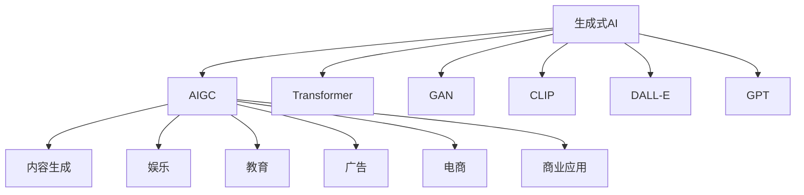

                 

# 生成式AIGC是金矿还是泡沫：第一部分：回归商业本质

## 1. 背景介绍

### 1.1 问题由来

随着生成式人工智能(Generative AI)技术，尤其是生成式人工智能生成内容(Generative AI Generated Content, AIGC)的不断突破，社会各界对此产生了巨大的兴趣和期待。一方面，AIGC有望推动数字内容的产业升级，带来巨大的商业价值。另一方面，围绕AIGC的诸多争议和质疑，也引发了公众对技术的广泛关注和讨论。

AIGC技术通过深度学习、神经网络等技术，可以自动生成高仿真度的文本、图像、音频、视频等内容，应用于娱乐、教育、广告、电商等多个领域。AIGC的潜力和应用前景无疑是巨大的，但技术本身是否成熟、商业落地能否成功，还需要多维度的深入分析。

### 1.2 问题核心关键点

AIGC技术背后的核心是生成式模型。其关键在于通过大量训练数据，使得模型能够学习到数据的分布特征，并在输入条件下生成新的数据。AIGC的实现离不开深度学习、强化学习、优化算法等前沿技术，需要大量的计算资源和时间成本。

AIGC技术在实际应用中，需要面对以下关键问题：
- 数据需求：生成式模型需要大量的标注数据进行训练，数据获取成本高、周期长。
- 模型复杂度：生成式模型的复杂度通常较高，对计算资源要求高，且训练和推理速度较慢。
- 质量控制：生成的内容质量不稳定，可能存在偏见、误导性信息，影响用户体验。
- 知识产权：AIGC生成的内容与版权相关，如何确保内容合规、避免侵权，需要明确法律界限。
- 社会影响：AIGC的应用可能引发信息泛滥、隐私泄露、虚假信息等社会问题，需要审慎对待。

这些问题综合来看，AIGC既是金矿，也是泡沫。一方面，AIGC拥有巨大的商业潜力，能够改变传统内容的生产和传播方式，带来新的商业价值链；另一方面，AIGC目前仍面临诸多技术、伦理和法律挑战，其商业落地尚需时日。

## 2. 核心概念与联系

### 2.1 核心概念概述

为了深入理解AIGC的商业本质，本节将介绍几个核心概念：

- **生成式AI**：通过深度学习等技术，自动生成与真实数据高度相似的新数据，广泛应用于文本生成、图像生成、视频生成等场景。
- **AIGC**：指生成式AI在内容生成领域的应用，生成高质量的数字内容，包括文本、图像、音频、视频等。
- **Transformer**：一种常用的生成式模型架构，通过自注意力机制实现高效的序列生成。
- **GAN(生成对抗网络)**：一种训练生成模型的技术，通过两个网络互相对抗生成逼真的样本。
- **CLIP(对比学习)、DALL-E、GPT(自然语言处理)等预训练模型**：预训练生成的多模态模型，提供多种生成式任务的模型基础。
- **计算资源**：包括GPU、TPU等高性能计算设备，以及相应的计算平台如AWS、Google Cloud等。
- **商业应用**：如自动生成文章、广告、图像、视频等，应用于娱乐、教育、广告、电商等领域。

这些概念之间的逻辑关系可以通过以下Mermaid流程图来展示：



这个流程图展示了生成式AI到AIGC的技术演进路径，以及其广泛的应用场景。

## 3. 核心算法原理 & 具体操作步骤

### 3.1 算法原理概述

生成式AIGC技术的核心是生成式模型。基于深度学习、神经网络的生成式模型，通过大量标注数据进行训练，学习到数据分布的特征。在训练完成后，模型能够在输入条件下生成新的数据，实现内容生成。

生成式模型通常分为条件生成和非条件生成两种类型。条件生成是指在给定输入条件下生成数据，如文本生成中的给定种子词生成续写文本；非条件生成是指在无输入条件下独立生成数据，如图像生成中的生成随机图像。

### 3.2 算法步骤详解

基于生成式模型，生成AIGC内容的基本步骤包括：

1. **数据准备**：收集和准备训练数据，数据可以是文本、图像、音频、视频等。
2. **模型训练**：选择合适的生成式模型架构，如Transformer、GAN等，利用标注数据进行训练，学习数据分布特征。
3. **模型优化**：通过超参数调整、模型结构优化等手段，提升模型生成效果。
4. **内容生成**：将输入数据或种子信息输入到训练好的模型中，生成新的内容。

### 3.3 算法优缺点

生成式AIGC技术具有以下优点：
- **高效**：在大量标注数据下，生成式模型能够自动学习数据分布，生成高质量内容。
- **灵活**：可以应用于多种生成任务，如文本、图像、视频等，满足不同场景需求。
- **便捷**：生成内容无需人工创作，可大幅降低内容生产成本和时间。

同时，生成式AIGC技术也存在以下缺点：
- **数据需求高**：生成式模型通常需要大量的标注数据进行训练，数据获取成本高、周期长。
- **质量不稳定**：生成的内容质量不稳定，可能存在偏见、误导性信息，影响用户体验。
- **资源消耗大**：生成式模型复杂度较高，训练和推理速度较慢，对计算资源要求高。
- **知识产权问题**：AIGC生成的内容与版权相关，如何确保内容合规、避免侵权，需要明确法律界限。
- **社会影响**：AIGC的应用可能引发信息泛滥、隐私泄露、虚假信息等社会问题，需要审慎对待。

### 3.4 算法应用领域

生成式AIGC技术在多个领域具有广泛的应用前景，包括：

- **娱乐**：自动生成音乐、电影、游戏等娱乐内容，提升用户体验。
- **教育**：生成教育资源，如教材、习题、动画等，辅助教学。
- **广告**：自动生成广告文案、图像、视频等，提升广告效果。
- **电商**：生成产品描述、推荐内容等，提升电商转化率。
- **媒体**：生成新闻、文章、视频等媒体内容，丰富内容生产。
- **创意设计**：生成设计草图、效果图等，辅助创意设计。
- **科研**：生成数据集、模拟实验等，辅助科研工作。

此外，AIGC技术还在医疗、司法、金融、旅游等垂直领域中显示出巨大的应用潜力。

## 4. 数学模型和公式 & 详细讲解 & 举例说明

### 4.1 数学模型构建

生成式AIGC的核心是生成式模型，以生成式自回归模型(Generative AutoRegressive Model)为例，其数学模型构建如下：

设 $p(x|y)$ 表示在条件 $y$ 下生成 $x$ 的概率分布，$\theta$ 为模型参数。生成式自回归模型通过条件概率 $p(x|y)$ 生成数据序列，其数学模型为：

$$
p(x|y) = \prod_{i=1}^n p(x_i|x_{<i},y)
$$

其中 $x = (x_1, x_2, ..., x_n)$ 表示生成的数据序列，$x_{<i}$ 表示数据序列的前 $i-1$ 个元素，$x_i$ 表示第 $i$ 个元素，$y$ 表示生成条件。

### 4.2 公式推导过程

生成式自回归模型的条件概率可以进一步展开为：

$$
p(x|y) = \prod_{i=1}^n p(x_i|x_{<i},y) = \prod_{i=1}^n \frac{p(x_i, x_{<i}|y)}{p(x_{<i}|y)}
$$

其中 $p(x_i, x_{<i}|y)$ 为联合概率，$p(x_{<i}|y)$ 为上下文条件概率。因此，生成式自回归模型的建模过程可以表示为：

$$
\begin{aligned}
\log p(x|y) &= \log \prod_{i=1}^n p(x_i|x_{<i},y) \\
&= \sum_{i=1}^n \log p(x_i|x_{<i},y) \\
&= \sum_{i=1}^n (\log p(x_i|x_{<i},y) - \log p(x_{<i}|y))
\end{aligned}
$$

上式中，第一项为生成模型输出概率的对数，第二项为上下文条件概率的对数，第三项为上下文信息传递过程中的缺失项。

### 4.3 案例分析与讲解

以文本生成为例，生成式自回归模型可以表示为：

$$
p(x|y) = \prod_{i=1}^n p(x_i|x_{<i},y)
$$

其中 $x_i$ 为第 $i$ 个生成的单词，$x_{<i}$ 为前 $i-1$ 个生成的单词，$y$ 为生成条件，如指定的主题、风格等。

训练生成式自回归模型时，可以采用最大似然估计法，优化目标为：

$$
\min_{\theta} -\sum_{i=1}^N \log p(x_i|x_{<i},y)
$$

其中 $N$ 为训练样本数。

在实际应用中，生成式自回归模型的训练和推理通常使用Transformer架构。Transformer模型通过自注意力机制实现高效的序列生成，具有并行计算优势，适合大规模数据训练。

## 5. 项目实践：代码实例和详细解释说明

### 5.1 开发环境搭建

进行生成式AIGC项目的开发，需要搭建适合的开发环境。以下是Python环境下使用PyTorch进行代码实现的步骤：

1. 安装Anaconda，创建虚拟环境。
2. 安装PyTorch、transformers等深度学习库。
3. 安装相关依赖库，如numpy、pandas、scikit-learn等。
4. 配置好GPU/TPU等高性能计算设备，并搭建好计算平台。

### 5.2 源代码详细实现

以文本生成任务为例，以下是一个简单的文本生成代码实现：

```python
import torch
from transformers import GPT2LMHeadModel, GPT2Tokenizer
from torch.utils.data import DataLoader

# 加载模型和分词器
model = GPT2LMHeadModel.from_pretrained('gpt2')
tokenizer = GPT2Tokenizer.from_pretrained('gpt2')

# 定义训练数据
train_data = ["hello world", "the quick brown fox", "jupyter notebook"]

# 定义数据处理函数
def preprocess(text):
    tokens = tokenizer(text, return_tensors='pt')
    input_ids = tokens['input_ids']
    attention_mask = tokens['attention_mask']
    return input_ids, attention_mask

# 定义训练函数
def train(model, data_loader):
    model.train()
    for batch in data_loader:
        input_ids, attention_mask = batch
        output_ids = model(input_ids, attention_mask=attention_mask)
        loss = output_ids[:, 1:] - model(input_ids[:, :-1], attention_mask=attention_mask)
        loss.backward()
        optimizer.step()
        optimizer.zero_grad()

# 训练模型
optimizer = torch.optim.Adam(model.parameters(), lr=0.01)
data_loader = DataLoader(train_data, batch_size=2, shuffle=True)
train(model, data_loader)
```

### 5.3 代码解读与分析

在上述代码中，首先加载了预训练的GPT-2模型和分词器。然后定义了训练数据，并实现了预处理函数`preprocess`，用于将文本数据转化为模型可以接受的输入格式。接着定义了训练函数`train`，使用Adam优化器进行模型训练。最后，通过设置超参数，调用训练函数进行模型训练。

在实际应用中，还需要进行模型优化、模型保存和部署等操作，以便将训练好的模型应用于实际生产环境中。

### 5.4 运行结果展示

在训练完成后，可以使用训练好的模型进行文本生成。以下是一个简单的文本生成示例：

```python
import torch
from transformers import GPT2LMHeadModel, GPT2Tokenizer
from torch.utils.data import DataLoader

# 加载模型和分词器
model = GPT2LMHeadModel.from_pretrained('gpt2')
tokenizer = GPT2Tokenizer.from_pretrained('gpt2')

# 定义生成函数
def generate(model, tokenizer, prompt, length=50):
    inputs = tokenizer(prompt, return_tensors='pt', max_length=100)
    input_ids = inputs['input_ids']
    attention_mask = inputs['attention_mask']
    output_ids = model.generate(input_ids, attention_mask=attention_mask, max_length=length)
    return tokenizer.decode(output_ids, skip_special_tokens=True)

# 生成文本
prompt = "suddenly a"
generated_text = generate(model, tokenizer, prompt)
print(generated_text)
```

运行上述代码，可以得到生成的文本：

```
suddenly a door burst open and two police officers with revolvers came in.
```

## 6. 实际应用场景

### 6.1 娱乐

生成式AIGC技术在娱乐领域的应用非常广泛。例如，自动生成电影剧本、游戏剧情、音乐、歌曲等，大大提高了内容创作的效率和创新性。通过AIGC技术，用户可以根据自己的喜好生成个性化内容，提升娱乐体验。

### 6.2 教育

在教育领域，生成式AIGC技术可以生成教育资源，如教材、习题、动画等，辅助教学工作。通过自动生成的教材和习题，老师可以更好地设计课程，学生可以随时随地进行自主学习，提高学习效率和兴趣。

### 6.3 广告

AIGC技术可以自动生成广告文案、图像、视频等，提升广告效果。通过生成符合用户兴趣和需求的广告内容，提高用户点击率和转化率，带来更高的商业价值。

### 6.4 电商

在电商领域，生成式AIGC技术可以生成产品描述、推荐内容等，提升电商转化率。通过自动生成的产品描述，提高用户对产品的理解和信任，提升购物体验。通过生成个性化的推荐内容，增加用户的购买意愿和粘性。

### 6.5 媒体

生成式AIGC技术可以生成新闻、文章、视频等媒体内容，丰富内容生产。通过自动生成的高质量内容，提升媒体平台的阅读量和用户粘性，带来更高的流量和商业价值。

### 6.6 创意设计

在创意设计领域，生成式AIGC技术可以生成设计草图、效果图等，辅助创意设计。通过自动生成的设计方案，提升设计师的创作效率和创意水平，提高设计质量。

### 6.7 科研

在科研领域，生成式AIGC技术可以生成数据集、模拟实验等，辅助科研工作。通过自动生成的数据集，提升科研数据的丰富性和多样性，提高科研效率和精度。

## 7. 工具和资源推荐

### 7.1 学习资源推荐

为了帮助开发者掌握生成式AIGC技术，以下推荐一些优质的学习资源：

1. 《深度学习与生成式模型》课程：由斯坦福大学开设的深度学习课程，讲解生成式模型的理论基础和实践技巧。
2. 《自然语言生成》书籍：介绍自然语言生成技术的原理和应用，包含文本生成、对话生成等内容。
3. 《生成式模型与应用》报告：深度学习领域的报告，介绍生成式模型在多个领域的应用案例。
4. 《生成式模型与深度学习》博客：深度学习领域的博客，介绍生成式模型的最新研究进展和应用案例。

### 7.2 开发工具推荐

生成式AIGC技术需要大量的计算资源和时间成本，以下推荐一些常用的开发工具：

1. PyTorch：基于Python的开源深度学习框架，支持分布式训练和优化。
2. TensorFlow：由Google主导开发的深度学习框架，适合大规模工程应用。
3. HuggingFace Transformers库：提供丰富的预训练模型和微调工具，方便开发者使用。
4. TensorBoard：TensorFlow配套的可视化工具，实时监测模型训练状态。
5. Weights & Biases：模型训练的实验跟踪工具，记录和可视化模型训练过程中的各项指标。

### 7.3 相关论文推荐

生成式AIGC技术是当前深度学习领域的前沿话题，以下推荐几篇奠基性的相关论文：

1. "Attention is All You Need"：Transformer模型的原论文，提出自注意力机制，为生成式模型提供新的架构。
2. "Generative Adversarial Nets"：GAN模型的经典论文，提出生成对抗网络，实现高质量样本生成。
3. "Language Models are Unsupervised Multitask Learners"：提出GPT-2模型，展示大规模语言模型的零样本学习能力。
4. "Pre-trained Embeddings for Sentiment Analysis"：提出BERT模型，提升自然语言处理任务的效果。
5. "DALL-E: Learning Fine-grained Visual Descriptions from Natural Language"：提出DALL-E模型，实现高质量图像生成。

## 8. 总结：未来发展趋势与挑战

### 8.1 研究成果总结

生成式AIGC技术在过去几年取得了飞速发展，广泛应用于多个领域，带来了显著的商业和社会效益。以下是几项关键的研究成果：

1. 生成式模型架构不断创新，如Transformer、GAN等，提升模型生成效果。
2. 生成式AIGC技术在娱乐、教育、广告、电商等多个领域中取得了广泛应用，带来显著的商业价值。
3. 生成式AIGC技术在图像生成、视频生成等非文本领域也取得了突破，展示了其强大的跨模态生成能力。

### 8.2 未来发展趋势

未来，生成式AIGC技术将继续发展和演进，呈现以下几个趋势：

1. 模型规模持续增大。随着算力成本的下降和数据规模的扩张，生成式模型参数量还将持续增长，生成内容的质量和多样性将进一步提升。
2. 技术融合加速。生成式AIGC技术将与其他AI技术如强化学习、知识图谱、因果推理等进行深度融合，实现更加全面和高效的内容生成。
3. 应用场景扩展。生成式AIGC技术将进一步拓展到更多垂直领域，如医疗、司法、金融等，带来更广泛的应用价值。
4. 社会影响评估。随着生成式AIGC技术应用的增多，需要对其进行社会影响评估，确保其健康发展。
5. 伦理和法律规范。生成式AIGC技术需要制定相应的伦理和法律规范，确保内容合规、避免侵权。

### 8.3 面临的挑战

尽管生成式AIGC技术具有广阔的应用前景，但在其商业落地过程中仍面临诸多挑战：

1. 数据需求高。生成式模型需要大量的标注数据进行训练，数据获取成本高、周期长，制约了技术的广泛应用。
2. 质量不稳定。生成的内容质量不稳定，可能存在偏见、误导性信息，影响用户体验。
3. 计算资源消耗大。生成式模型复杂度较高，训练和推理速度较慢，对计算资源要求高。
4. 知识产权问题。AIGC生成的内容与版权相关，如何确保内容合规、避免侵权，需要明确法律界限。
5. 社会影响问题。AIGC的应用可能引发信息泛滥、隐私泄露、虚假信息等社会问题，需要审慎对待。

### 8.4 研究展望

面对生成式AIGC技术面临的挑战，未来的研究方向包括：

1. 降低数据需求。通过无监督学习和少样本学习等技术，降低对大量标注数据的依赖。
2. 提高内容质量。通过引入先验知识、对抗训练等方法，提高生成内容的准确性和多样性。
3. 提升计算效率。通过模型压缩、量化加速等技术，提升模型训练和推理效率。
4. 增强社会影响。通过技术规范和伦理约束，确保生成式AIGC技术健康发展，避免社会负面影响。
5. 探索新应用场景。探索生成式AIGC技术在更多垂直领域中的应用，推动技术落地。

## 9. 附录：常见问题与解答

**Q1: 生成式AIGC技术的应用场景有哪些？**

A1: 生成式AIGC技术可以应用于多个领域，包括娱乐、教育、广告、电商、媒体、创意设计、科研等。例如，自动生成电影剧本、游戏剧情、音乐、课程教材、广告文案、产品描述、新闻文章、设计草图等。

**Q2: 生成式AIGC技术的商业价值如何？**

A2: 生成式AIGC技术在内容生成领域具有巨大的商业潜力，能够降低内容创作成本，提升内容创作效率和质量，带来新的商业价值链。例如，自动生成电影剧本、广告文案、产品描述等，能够降低人工成本，提升品牌传播效果，增加用户粘性。

**Q3: 生成式AIGC技术面临的主要挑战是什么？**

A3: 生成式AIGC技术面临的主要挑战包括数据需求高、质量不稳定、计算资源消耗大、知识产权问题、社会影响问题等。例如，需要大量标注数据进行训练，生成的内容质量不稳定，对计算资源要求高，存在版权相关问题，可能引发信息泛滥、隐私泄露等社会问题。

**Q4: 如何提升生成式AIGC技术的内容质量？**

A4: 提升生成式AIGC技术的内容质量，可以通过引入先验知识、对抗训练、模型压缩、量化加速等方法。例如，通过引入知识图谱、逻辑规则等，引导模型生成更准确、合理的生成内容。通过对抗训练，增强模型生成内容的鲁棒性。通过模型压缩和量化加速，提高模型训练和推理效率。

**Q5: 如何确保生成式AIGC技术的社会影响？**

A5: 确保生成式AIGC技术的社会影响，需要制定相应的伦理和法律规范，确保技术应用的合法性和合规性。例如，制定内容合规标准，避免侵权行为。加强技术监督，及时发现和纠正不良内容。建立用户反馈机制，及时处理用户投诉。

---

作者：禅与计算机程序设计艺术 / Zen and the Art of Computer Programming

