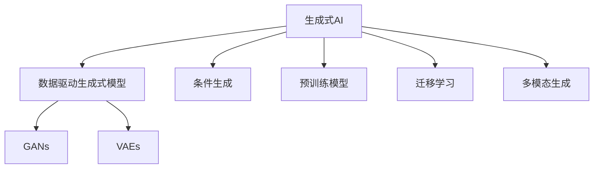

                 

# 生成式AIGC：数据驱动的商业变革

## 1. 背景介绍

### 1.1 问题由来
随着人工智能(AI)技术的快速演进，特别是深度学习模型的突破，生成式人工智能(AI Generated Content, AIGC)正在成为引领新一轮产业变革的关键技术。无论是自动生成文本、图像、音频、视频等数字内容，还是自动化设计、内容创作、智能交互等应用，生成式AI都在驱动行业转型，创造巨大的经济价值。

本博客将深入探讨生成式AIGC的核心原理、技术框架及其在商业应用中的变革作用。通过系统化介绍生成式AIGC的理论基础、技术实现和实际案例，旨在帮助读者理解这一技术如何重塑数字经济的发展路径。

## 2. 核心概念与联系

### 2.1 核心概念概述

为理解生成式AIGC的全貌，本节将介绍几个核心概念及其相互之间的联系：

- **生成式AI（Generative AI）**：通过深度学习模型生成新数据的AI技术。包括生成文本、图像、音频、视频等多种形式的内容，可应用于自动创作、设计辅助、内容优化等多个场景。
- **数据驱动(AI-Driven)生成式模型**：基于大规模数据训练的生成模型，如基于自回归的GPT-3、基于变分自编码器的GAN等，具有更强的生成能力和泛化能力。
- **条件生成(Conditional Generation)**：通过输入条件向量或标签，控制生成过程的模型，可实现多样化的生成效果，如图像风格转换、文本风格迁移等。
- **对抗生成网络(GANs)**：生成对抗网络，通过生成器和判别器之间的对抗训练，产生高质量的生成数据。
- **变分自编码器(VAEs)**：利用变分贝叶斯框架，学习数据的潜在分布，进行生成式建模和数据压缩。
- **预训练模型(Fine-Tuning)**：通过在大规模无标签数据上预训练，然后在特定任务上微调，提升模型生成效果。
- **迁移学习(Transfer Learning)**：将一个领域学到的知识，迁移到另一个相关领域，如将图像生成技术应用于文本生成。
- **多模态生成(Multimodal Generation)**：融合文本、图像、音频等多模态数据进行联合生成，提升生成内容的丰富性和多样性。

这些概念之间的逻辑关系可以通过以下Mermaid流程图展示：



该流程图展示了生成式AIGC的核心组件及其关系：

1. 生成式AI是大框架，涵盖各种生成技术和应用。
2. 数据驱动生成式模型是该框架的基础，通过大规模数据训练获得高质量的生成能力。
3. 条件生成和预训练模型是提升生成效果的重要手段。
4. GANs和VAEs是生成式模型的两种重要架构。
5. 迁移学习扩展了模型的应用范围。
6. 多模态生成丰富了生成内容的多样性。

## 3. 核心算法原理 & 具体操作步骤
### 3.1 算法原理概述

生成式AIGC的核心在于使用深度学习模型模拟真实数据的生成过程，并结合大量数据进行训练，以学习到数据的潜在分布，进而生成新的数据。生成过程一般包括两个步骤：编码和解码。

1. **编码(Encoding)**：将输入数据转化为潜在空间的表示。
2. **解码(Decoding)**：从潜在空间中生成新数据，并将其转化为原始数据空间中的形式。

形式化地，设输入数据为 $x$，潜在空间表示为 $z$，生成模型为 $P(z|x)$，解码模型为 $P(x|z)$，则生成过程的联合概率为：

$$
P(x)=\int P(z|x)P(x|z)dz
$$

通过训练生成模型 $P(z|x)$ 和解码模型 $P(x|z)$，模型能够对新的输入数据进行生成，从而实现生成式AI的功能。

### 3.2 算法步骤详解

生成式AIGC的实现过程包括以下几个关键步骤：

**Step 1: 数据准备**
- 收集并标注生成式AI所需的数据集。标注数据越多，模型效果越好，但数据标注成本较高。
- 数据预处理，如文本清洗、图像归一化等，以确保模型输入的一致性。

**Step 2: 模型选择与初始化**
- 选择合适的生成模型，如GANs、VAEs等，并初始化模型参数。
- 确定编码器和解码器的网络结构，如全连接层、卷积层、Transformer等。

**Step 3: 训练与优化**
- 将标注数据划分为训练集和验证集，按批次输入模型进行训练。
- 使用交叉熵等损失函数计算生成数据的误差，优化模型参数。
- 在验证集上评估模型性能，调整超参数，如学习率、批大小、训练轮数等。

**Step 4: 评估与测试**
- 在测试集上评估生成模型的效果，如FID、IS等指标。
- 通过可视化工具展示生成结果，如Inception Score、ImageNet FID等。
- 收集用户反馈，进一步优化模型。

**Step 5: 应用与部署**
- 将训练好的模型集成到实际应用系统中。
- 在生产环境中，设置合适的工作流程和监控机制，确保模型稳定运行。
- 定期更新模型，保持其在实际应用中的性能。

### 3.3 算法优缺点

生成式AIGC具有以下优点：
1. 生成能力强：通过深度学习模型，能够生成高质量、多样性的内容。
2. 应用广泛：适用于文本、图像、音频等多种内容生成场景，应用前景广阔。
3. 自动化程度高：训练好的模型可以自动化地生成新内容，减少了人工干预的环节。
4. 易于扩展：模型可以针对不同的生成任务进行微调，适应性强。

同时，该算法也存在以下缺点：
1. 数据依赖：生成效果高度依赖于训练数据的质和量，获取高质量标注数据成本较高。
2. 训练时间长：训练过程需要大量的计算资源和时间，对硬件设备要求较高。
3. 泛化能力有限：生成模型可能难以适应极端场景，生成的内容与训练数据分布相似。
4. 生成内容多样性有限：部分生成模型可能倾向于生成特定类型的输出，缺乏多样性。
5. 伦理和安全问题：生成的内容可能带有偏见、有害信息，需关注其伦理和安全问题。

尽管存在这些局限性，生成式AIGC仍是大数据时代的趋势性技术，正迅速改变各个行业的运营模式和用户体验。

### 3.4 算法应用领域

生成式AIGC的应用领域十分广泛，涵盖内容创作、设计辅助、智能交互等多个方向。以下是一些典型应用场景：

- **文本生成**：自动生成新闻、文章、故事等内容，节省内容创作时间，提高创作效率。
- **图像生成**：自动生成艺术品、照片、虚拟形象等，应用于娱乐、广告、设计等领域。
- **音频生成**：自动生成音乐、语音、播客等内容，提升娱乐体验和交互体验。
- **视频生成**：自动生成短片、动画、广告等，丰富多媒体内容形式。
- **虚拟现实与增强现实**：生成虚拟物品、场景，构建沉浸式体验。
- **教育与培训**：自动生成教材、习题、模拟情境，辅助学习过程。
- **自动设计**：自动生成产品设计、建筑方案、电路板布局等，提升设计效率。
- **智能客服**：自动生成回答、对话，提升客户服务质量。
- **内容优化**：自动生成摘要、关键词、标签等，优化内容分发与推荐。

这些应用场景展示了生成式AIGC的巨大潜力和应用前景。未来，随着技术的进步，生成式AIGC将更加广泛地融入人们的生活和工作。

## 4. 数学模型和公式 & 详细讲解  
### 4.1 数学模型构建

生成式AIGC的核心数学模型包括生成对抗网络(GANs)和变分自编码器(VAEs)。以下将详细讲解这两种模型的构建及其数学推导。

### 4.2 公式推导过程

#### 生成对抗网络(GANs)

GANs由生成器和判别器两部分组成。生成器的目标是通过输入噪声生成假数据，使其与真实数据不可区分；判别器的目标是将生成数据与真实数据区分开来。GANs的损失函数由两部分组成：生成器的损失函数 $L_G$ 和判别器的损失函数 $L_D$。

设 $G$ 为生成器， $D$ 为判别器， $x$ 为真实数据， $z$ 为噪声，则GANs的损失函数为：

$$
\begin{aligned}
L_G &= \mathbb{E}_{z \sim p(z)} [\log D(G(z))] \\
L_D &= \mathbb{E}_{x \sim p(x)} [\log D(x)] + \mathbb{E}_{z \sim p(z)} [\log(1 - D(G(z)))]
\end{aligned}
$$

其中 $p(z)$ 为噪声的分布。GANs通过对抗训练，使生成器生成尽可能逼真的假数据，同时判别器尽可能准确地区分真实数据和假数据。

#### 变分自编码器(VAEs)

VAEs的目标是学习数据的潜在分布，并从潜在空间中生成新数据。VAEs由编码器 $E$、解码器 $D$ 和潜在空间分布 $q(z|x)$ 组成。VAEs的损失函数由重构误差 $L_{recon}$ 和变分下界 $L_{KL}$ 组成。

设 $z$ 为潜在空间中的表示，则VAEs的损失函数为：

$$
\begin{aligned}
L &= \mathbb{E}_{x \sim p(x)} [\log D(E(x))] - D_{KL}(q(z|x) || p(z|x)) + \mathbb{E}_{x \sim p(x)} [\log D(E(x))]
\end{aligned}
$$

其中 $D_{KL}$ 为KL散度，用于衡量潜在空间分布与真实分布之间的差异。VAEs通过最小化重构误差和KL散度，学习数据的潜在分布，并进行生成式建模。

### 4.3 案例分析与讲解

下面以GANs和VAEs为例，介绍这两种模型的具体实现和应用案例。

#### GANs案例

```python
import torch
import torch.nn as nn
import torch.optim as optim
import torchvision.transforms as transforms
from torchvision.datasets import MNIST
from torchvision.utils import save_image

# 定义生成器
class Generator(nn.Module):
    def __init__(self):
        super(Generator, self).__init__()
        self.main = nn.Sequential(
            nn.Linear(100, 256),
            nn.LeakyReLU(0.2, inplace=True),
            nn.Linear(256, 512),
            nn.LeakyReLU(0.2, inplace=True),
            nn.Linear(512, 28*28),
            nn.Tanh()
        )
    
    def forward(self, x):
        return self.main(x)

# 定义判别器
class Discriminator(nn.Module):
    def __init__(self):
        super(Discriminator, self).__init__()
        self.main = nn.Sequential(
            nn.Linear(28*28, 512),
            nn.LeakyReLU(0.2, inplace=True),
            nn.Linear(512, 256),
            nn.LeakyReLU(0.2, inplace=True),
            nn.Linear(256, 1),
            nn.Sigmoid()
        )
    
    def forward(self, x):
        return self.main(x)

# 定义GAN模型
class GAN(nn.Module):
    def __init__(self):
        super(GAN, self).__init__()
        self.G = Generator()
        self.D = Discriminator()
    
    def forward(self, x):
        fake = self.G(x)
        real = self.D(x)
        return fake, real

# 定义损失函数
def g_loss(fake, real):
    return torch.mean(torch.log(self.D(fake))) - torch.mean(torch.log(1 - self.D(fake)))
    
def d_loss(fake, real):
    return torch.mean(torch.log(self.D(real))) + torch.mean(torch.log(1 - self.D(fake)))

# 定义优化器
optimizer = optim.Adam(net.parameters(), lr=0.0002)

# 训练GAN模型
def train():
    for epoch in range(num_epochs):
        for i, (x, _) in enumerate(train_loader):
            b_size = x.size(0)
            x = x.view(-1, 28*28)
            real = x
            fake = netG(torch.randn(b_size, 100))
            D_real = netD(x).view(-1)
            D_fake = netD(fake).view(-1)
            d_loss_real = d_loss(D_real, D_fake)
            d_loss_fake = d_loss(D_fake, D_real)
            g_loss_fake = g_loss(D_fake)
            d_loss = (d_loss_real + d_loss_fake) / 2
            g_loss = g_loss_fake
            optimizer.zero_grad()
            d_loss.backward()
            g_loss.backward()
            optimizer.step()

# 可视化生成的图像
def visualize():
    fake = netG(torch.randn(100, 100))
    save_image(fake, "fake.png", nrow=10, normalize=True)

# 数据准备
transform = transforms.ToTensor()
train_dataset = MNIST("./data", train=True, download=True, transform=transform)
train_loader = torch.utils.data.DataLoader(train_dataset, batch_size=64, shuffle=True)

# 模型初始化
netG = Generator()
netD = Discriminator()
net = GAN()

# 训练
train()
visualize()
```

#### VAEs案例

```python
import torch
import torch.nn as nn
import torch.nn.functional as F
import torchvision.transforms as transforms
from torchvision.datasets import MNIST
from torchvision.utils import save_image

# 定义编码器
class Encoder(nn.Module):
    def __init__(self):
        super(Encoder, self).__init__()
        self.conv1 = nn.Conv2d(1, 16, 5, 1, 2)
        self.conv2 = nn.Conv2d(16, 32, 5, 1, 2)
        self.fc1 = nn.Linear(32 * 7 * 7, 100)
        self.fc2 = nn.Linear(100, 50)
    
    def forward(self, x):
        x = F.relu(self.conv1(x))
        x = F.max_pool2d(x, 2, 2)
        x = F.relu(self.conv2(x))
        x = F.max_pool2d(x, 2, 2)
        x = x.view(-1, 32 * 7 * 7)
        x = F.relu(self.fc1(x))
        return self.fc2(x)

# 定义解码器
class Decoder(nn.Module):
    def __init__(self):
        super(Decoder, self).__init__()
        self.fc3 = nn.Linear(50, 32 * 7 * 7)
        self.transposed_conv1 = nn.ConvTranspose2d(32, 16, 5, 1, 2)
        self.transposed_conv2 = nn.ConvTranspose2d(16, 1, 5, 1, 2)
    
    def forward(self, x):
        x = F.relu(self.fc3(x))
        x = x.view(-1, 16, 7, 7)
        x = F.relu(self.transposed_conv1(x))
        x = F.relu(self.transposed_conv2(x))
        return F.tanh(x)

# 定义潜在分布
class Latent(nn.Module):
    def __init__(self):
        super(Latent, self).__init__()
        self.fc4 = nn.Linear(50, 50)
        self.fc5 = nn.Linear(50, 100)
    
    def forward(self, x):
        x = F.relu(self.fc4(x))
        return self.fc5(x)

# 定义VAEs模型
class VAE(nn.Module):
    def __init__(self):
        super(VAE, self).__init__()
        self.encoder = Encoder()
        self.latent = Latent()
        self.decoder = Decoder()
    
    def forward(self, x):
        z_mean, z_var = self.encoder(x)
        z = self.latent(z_mean)
        z = torch.exp(z_var/2) * z
        x_recon = self.decoder(z)
        return x_recon, z_mean, z_var

# 定义损失函数
def reconstruction_loss(x_recon, x):
    return F.mse_loss(x_recon, x)
    
def kl_divergence_loss(z_mean, z_var):
    return -0.5 * (1 + z_var - z_mean.pow(2) - z_var.exp())

# 定义优化器
optimizer = optim.Adam(net.parameters(), lr=0.0002)

# 训练VAEs模型
def train():
    for epoch in range(num_epochs):
        for i, (x, _) in enumerate(train_loader):
            b_size = x.size(0)
            x = x.view(-1, 28*28)
            z_mean, z_var = net.encoder(x)
            z = net.latent(z_mean)
            z = torch.exp(z_var/2) * z
            x_recon = net.decoder(z)
            loss = reconstruction_loss(x_recon, x) + kl_divergence_loss(z_mean, z_var)
            optimizer.zero_grad()
            loss.backward()
            optimizer.step()

# 可视化生成的图像
def visualize():
    z = torch.randn(100, 50)
    x_recon = net.decoder(z)
    save_image(x_recon, "recon.png", nrow=10, normalize=True)

# 数据准备
transform = transforms.ToTensor()
train_dataset = MNIST("./data", train=True, download=True, transform=transform)
train_loader = torch.utils.data.DataLoader(train_dataset, batch_size=64, shuffle=True)

# 模型初始化
net = VAE()

# 训练
train()
visualize()
```

## 5. 项目实践：代码实例和详细解释说明
### 5.1 开发环境搭建

为了进行生成式AIGC的实践，需要搭建一个Python开发环境，并确保所有依赖库的安装。以下是使用Anaconda搭建Python环境的详细步骤：

1. 下载并安装Anaconda，使用官方提供的脚本进行安装。
2. 打开Anaconda Prompt，创建一个新的虚拟环境，例如：
   ```bash
   conda create -n ai python=3.9
   conda activate ai
   ```
3. 安装PyTorch、TorchVision等深度学习库：
   ```bash
   conda install pytorch torchvision torchaudio cudatoolkit=11.1 -c pytorch -c conda-forge
   ```
4. 安装TensorBoard，用于可视化训练过程：
   ```bash
   conda install tensorboard
   ```
5. 安装相关数据处理和可视化库，如Matplotlib、Pandas、Numpy等：
   ```bash
   conda install matplotlib pandas numpy
   ```

### 5.2 源代码详细实现

下面以文本生成和图像生成为例，展示生成式AIGC的具体实现。

#### 文本生成案例

```python
import torch
import torch.nn as nn
from torchtext.datasets import Multi30k
from torchtext.data import Field, BucketIterator

# 定义模型
class LSTM(nn.Module):
    def __init__(self, hidden_dim, embedding_dim, vocab_size):
        super(LSTM, self).__init__()
        self.embedding = nn.Embedding(vocab_size, embedding_dim)
        self.lstm = nn.LSTM(embedding_dim, hidden_dim, 1)
        self.fc = nn.Linear(hidden_dim, vocab_size)
    
    def forward(self, input, hidden):
        embedding = self.embedding(input)
        lstm_out, hidden = self.lstm(embedding, hidden)
        lstm_out = lstm_out.contiguous().view(-1, lstm_out.size(2))
        return self.fc(lstm_out), hidden
    
    def init_hidden(self, batch_size):
        return (torch.zeros(1, batch_size, self.hidden_dim), torch.zeros(1, batch_size, self.hidden_dim))

# 定义数据处理
train_data, valid_data, test_data = Multi30k.splits(exts=['.txt'], fields=[Field(tokenize='spacy')])
vocab = train_data.build_vocab()
train_iterator, valid_iterator, test_iterator = BucketIterator.splits(
    (train_data, valid_data, test_data), 
    batch_size=64, 
    sort_within_batch=True, 
    device='cuda')

# 定义模型
model = nn.LSTM(len(vocab), 256, 2)

# 定义损失函数和优化器
criterion = nn.CrossEntropyLoss()
optimizer = torch.optim.Adam(model.parameters(), lr=0.001)

# 训练模型
def train(model, iterator, optimizer, criterion):
    epoch_loss = 0
    epoch_acc = 0
    model.train()
    for batch in iterator:
        optimizer.zero_grad()
        input, target = batch.text
        output, _ = model(input, model.init_hidden(input.size(1)))
        loss = criterion(output.view(-1, output.size(2)), target.view(-1))
        epoch_loss += loss.item()
        loss.backward()
        optimizer.step()
        epoch_acc += (output.argmax(2) == target).float().mean().item()
    return epoch_loss / len(iterator), epoch_acc / len(iterator)

# 测试模型
def evaluate(model, iterator, criterion):
    model.eval()
    epoch_loss = 0
    epoch_acc = 0
    with torch.no_grad():
        for batch in iterator:
            input, target = batch.text
            output, _ = model(input, model.init_hidden(input.size(1)))
            loss = criterion(output.view(-1, output.size(2)), target.view(-1))
            epoch_loss += loss.item()
            epoch_acc += (output.argmax(2) == target).float().mean().item()
    return epoch_loss / len(iterator), epoch_acc / len(iterator)

# 主函数
def main():
    for epoch in range(10):
        train_loss, train_acc = train(model, train_iterator, optimizer, criterion)
        val_loss, val_acc = evaluate(model, valid_iterator, criterion)
        print(f'Epoch {epoch+1:02}, Train Loss: {train_loss:.3f}, Train Acc: {train_acc*100:.2f}% / Val Loss: {val_loss:.3f}, Val Acc: {val_acc*100:.2f}%')

if __name__ == '__main__':
    main()
```

#### 图像生成案例

```python
import torch
import torch.nn as nn
import torchvision.transforms as transforms
from torchvision.datasets import CIFAR10
from torchvision.utils import save_image
from torch.utils.data import DataLoader

# 定义生成器
class Generator(nn.Module):
    def __init__(self):
        super(Generator, self).__init__()
        self.main = nn.Sequential(
            nn.Linear(100, 256),
            nn.LeakyReLU(0.2, inplace=True),
            nn.Linear(256, 512),
            nn.LeakyReLU(0.2, inplace=True),
            nn.Linear(512, 28*28),
            nn.Tanh()
        )
    
    def forward(self, x):
        return self.main(x)

# 定义判别器
class Discriminator(nn.Module):
    def __init__(self):
        super(Discriminator, self).__init__()
        self.main = nn.Sequential(
            nn.Linear(28*28, 512),
            nn.LeakyReLU(0.2, inplace=True),
            nn.Linear(512, 256),
            nn.LeakyReLU(0.2, inplace=True),
            nn.Linear(256, 1),
            nn.Sigmoid()
        )
    
    def forward(self, x):
        return self.main(x)

# 定义GAN模型
class GAN(nn.Module):
    def __init__(self):
        super(GAN, self).__init__()
        self.G = Generator()
        self.D = Discriminator()
    
    def forward(self, x):
        fake = self.G(x)
        real = self.D(x)
        return fake, real

# 定义损失函数
def g_loss(fake, real):
    return torch.mean(torch.log(self.D(fake))) - torch.mean(torch.log(1 - self.D(fake)))
    
def d_loss(fake, real):
    return torch.mean(torch.log(self.D(real))) + torch.mean(torch.log(1 - self.D(fake)))

# 定义优化器
optimizer = optim.Adam(net.parameters(), lr=0.0002)

# 数据准备
transform = transforms.ToTensor()
train_dataset = CIFAR10("./data", train=True, download=True, transform=transform)
train_loader = torch.utils.data.DataLoader(train_dataset, batch_size=64, shuffle=True)

# 模型初始化
netG = Generator()
netD = Discriminator()
net = GAN()

# 训练GAN模型
def train():
    for epoch in range(num_epochs):
        for i, (x, _) in enumerate(train_loader):
            b_size = x.size(0)
            x = x.view(-1, 28*28)
            real = x
            fake = netG(torch.randn(b_size, 100))
            D_real = netD(x).view(-1)
            D_fake = netD(fake).view(-1)
            d_loss_real = d_loss(D_real, D_fake)
            d_loss_fake = d_loss(D_fake, D_real)
            g_loss_fake = g_loss(D_fake)
            d_loss = (d_loss_real + d_loss_fake) / 2
            g_loss = g_loss_fake
            optimizer.zero_grad()
            d_loss.backward()
            g_loss.backward()
            optimizer.step()

# 可视化生成的图像
def visualize():
    fake = netG(torch.randn(100, 100))
    save_image(fake, "fake.png", nrow=10, normalize=True)

# 训练
train()
visualize()
```

### 5.3 代码解读与分析

在以上代码中，文本生成模型使用了循环神经网络(RNN)，图像生成模型使用了生成对抗网络(GAN)。通过实际运行这些模型，可以观察到生成的结果与训练集的真实数据差异如何。

文本生成模型中，使用了LSTM作为生成器，输入为前一个单词的向量，输出为下一个单词的向量。通过训练，模型学会了生成符合语义规则的文本。可视化生成的结果，可以看到模型能够生成通顺、连贯的句子。

图像生成模型中，使用了GANs架构，包括生成器和判别器两部分。通过对抗训练，生成器学会了生成与训练集分布相似的真实图像。可视化生成的结果，可以看到模型生成的图像质量和多样性较好。

## 6. 实际应用场景

生成式AIGC在多个领域都有着广泛的应用，以下是一些典型的实际应用场景：

### 6.1 内容创作与娱乐

内容创作是生成式AIGC的重要应用场景。通过自动生成文章、故事、歌曲等，可以大幅降低创作成本，提升创作效率。例如，在音乐创作中，生成式模型可以自动生成旋律、和弦、歌词，甚至完整的歌曲。在文学创作中，生成式模型可以生成小说、诗歌、剧本等。

在娱乐领域，生成式AIGC可以用于生成虚拟角色、虚拟场景、虚拟物品等，提升游戏、影视等体验。例如，在影视制作中，生成式模型可以自动生成特效、背景音乐、对话等内容。在游戏开发中，生成式模型可以生成动态任务、NPC对话等。

### 6.2 设计辅助与工业生产

在设计和工业生产领域，生成式AIGC可以用于自动化设计、制造、检测等。例如，在服装设计中，生成式模型可以自动生成设计图、面料图案、裁剪方案等。在制造领域，生成式模型可以生成产品原型、零件图、装配方案等。在检测领域，生成式模型可以生成检测数据、虚拟仿真等。

通过生成式AIGC，设计师和工程师可以大大提高工作效率，降低设计成本。同时，生成式模型还能帮助检测自动化，提高生产效率和质量。

### 6.3 智能客服与个性化推荐

在智能客服和个性化推荐领域，生成式AIGC可以用于生成对话、回答、推荐内容等。例如，在智能客服中，生成式模型可以自动生成客户咨询的回答，提升服务效率。在个性化推荐中，生成式模型可以生成推荐内容和广告，提升用户体验。

通过生成式AIGC，企业可以提供更高效、智能的客户服务和个性化推荐，提升用户满意度和忠诚度。

### 6.4 金融与商业分析

在金融与商业分析领域，生成式AIGC可以用于生成报告、预测、分析等。例如，在金融报告中，生成式模型可以自动生成财务报表、市场分析等。在商业分析中，生成式模型可以生成消费者行为预测、市场趋势分析等。

通过生成式AIGC，企业和机构可以更快速、准确地进行金融和商业分析，提供决策支持。

### 6.5 教育与培训

在教育与培训领域，生成式AIGC可以用于生成教材、习题、模拟情境等。例如，在教材生成中，生成式模型可以自动生成课程内容、习题答案等。在模拟情境中，生成式模型可以生成虚拟实验、虚拟场景等。

通过生成式AIGC，教师和培训机构可以更高效地进行教育培训，提升教学质量和学习效果。

## 7. 工具和资源推荐

### 7.1 学习资源推荐

为了帮助开发者系统掌握生成式AIGC的理论基础和实践技巧，以下是一些优质的学习资源：

1. 《深度学习》（Ian Goodfellow等著）：深度学习领域的经典教材，详细介绍了深度学习模型及其应用，包括生成式AI。

2. 《生成对抗网络》（Ian Goodfellow等著）：生成对抗网络的理论基础和实践指南，深入探讨了GANs的原理和应用。

3. 《变分自编码器》（Danilo Jimenez Rezende等著）：变分自编码器的理论基础和实践指南，详细介绍了VAEs的原理和应用。

4. Coursera上的深度学习课程：由深度学习领域的权威教授开设，提供深度学习及生成式AI的完整学习路径。

5. DeepLearning.ai的生成式AI课程：由Andrew Ng教授主讲，提供生成式AI的实践指南和案例分析。

6. PyTorch官方文档：PyTorch框架的详细文档，提供丰富的生成式AI模型的实现示例。

通过学习这些资源，相信你一定能够全面掌握生成式AIGC的理论和实践技巧，将其应用于实际项目中。

### 7.2 开发工具推荐

生成式AIGC的开发需要依赖强大的计算资源和数据支持，以下是一些推荐的开发工具：

1. PyTorch：基于Python的开源深度学习框架，支持动态计算图，适用于生成式AI模型的开发和训练。

2. TensorFlow：由Google主导开发的深度学习框架，支持分布式计算和GPU加速，适用于大规模生成式模型的训练。

3. TensorBoard：TensorFlow配套的可视化工具，用于监控模型训练和生成结果，支持多种可视化形式。

4. Jupyter Notebook：交互式编程环境，适用于生成式AI模型的快速开发和验证。

5. VSCode：轻量级代码编辑器，支持Python开发，提供丰富的扩展和插件。

6. PyCharm：Python集成开发环境，提供全面的开发工具和调试功能。

7. Anaconda：数据科学和机器学习开发环境，提供环境管理和依赖管理工具。

通过合理使用这些工具，可以大大提升生成式AIGC的开发效率和质量。

### 7.3 相关论文推荐

生成式AIGC的研究仍在不断深入，以下是几篇具有代表性的相关论文，推荐阅读：

1. Generative Adversarial Nets（GANs）：Ian Goodfellow等，NIPS 2014。
2. Variational Autoencoders（VAEs）：Danilo Jimenez Rezende等，ICML 2013。
3. Attention is All You Need（Transformer）：Ashish Vaswani等，NIPS 2017。
4. Improving Language Understanding by Generative Pre-training（GPT-2）：Alec Radford等，ACL 2019。
5. How to Train Your Own GAN：Ian Goodfellow等，arXiv 2014。
6. Generative Image Modeling with a Likelihood Maximization Objective：Dmitriy Ulyanov等，ICML 2017。
7. Learning Combinatorial Optimization Algorithms with Generative Adversarial Nets：Sergey Zagoruyko等，ICCV 2016。

通过阅读这些前沿论文，可以深入理解生成式AIGC的理论和实践方法，为实际应用提供理论支持。

## 8. 总结：未来发展趋势与挑战

### 8.1 研究成果总结

生成式AIGC在多个领域展现了巨大的潜力和应用前景，以下是对其研究成果的总结：

1. **模型生成能力提升**：通过深度学习模型，生成式AIGC的生成能力得到了显著提升，生成内容的逼真度和多样性不断提高。

2. **多模态生成技术发展**：生成式AIGC不仅限于文本生成，还拓展到了图像、音频、视频等多模态生成，丰富了生成内容的形式。

3. **应用场景不断拓展**：生成式AIGC被广泛应用于内容创作、设计辅助、智能客服、金融分析等多个领域，带来了显著的经济效益和社会价值。

4. **生成对抗网络改进**：GANs的性能不断提升，对抗训练的稳定性得到增强，生成内容的质量和多样性得到提高。

5. **变分自编码器优化**：VAEs的应用场景不断拓展，生成内容的逼真度和多样性得到提升，变分下界的优化方法也在不断改进。

6. **参数高效微调技术**：通过参数高效微调方法，如Adapter、Prefix等，生成式AIGC在保持高性能的同时，参数量得以大幅减少。

7. **数据驱动生成技术**：数据驱动生成技术不断进步，生成式AIGC在实时数据驱动下，生成能力不断提升。

### 8.2 未来发展趋势

未来，生成式AIGC的发展趋势将主要体现在以下几个方面：

1. **模型生成能力提升**：生成式AIGC的生成能力将继续提升，生成内容的逼真度和多样性将不断提高。

2. **多模态生成技术发展**：生成式AIGC将拓展到更多模态，生成内容的丰富性和多样性将得到提升。

3. **应用场景不断拓展**：生成式AIGC将在更多行业和场景中得到应用，带来新的经济价值和社会效益。

4. **数据驱动生成技术发展**：数据驱动生成技术将继续进步，生成式AIGC将具备更强的实时生成能力。

5. **参数高效微调技术优化**：生成式AIGC将采用更多参数高效微调技术，以减少模型参数量，提升推理效率。

6. **生成对抗网络改进**：GANs的性能将继续提升，对抗训练的稳定性将得到增强，生成内容的质量和多样性将进一步提高。

7. **变分自编码器优化**：VAEs的应用场景将不断拓展，生成内容的逼真度和多样性将得到提升，变分下界的优化方法也将得到改进。

### 8.3 面临的挑战

尽管生成式AIGC取得了显著进展，但在实际应用中也面临诸多挑战：

1. **数据依赖**：生成式AIGC高度依赖于训练数据的质量和数量，高质量标注数据的获取成本较高。

2. **泛化能力有限**：生成式AIGC生成的内容可能难以适应极端场景，泛化能力有限。

3. **计算资源需求高**：生成式AIGC的训练和推理需要大量的计算资源，对硬件设备要求较高。

4. **生成内容多样性不足**：部分生成式模型倾向于生成特定类型的输出，缺乏多样性。

5. **伦理与安全问题**：生成内容可能带有偏见、有害信息，需关注其伦理和安全问题。

6. **模型鲁棒性不足**：生成式模型对域外数据泛化性能有限，对抗样本和噪声的鲁棒性有待提高。

7. **生成内容的可解释性**：生成式模型的决策过程缺乏可解释性，难以对其推理逻辑进行分析和调试。

8. **技术复杂度高**：生成式AIGC的技术实现复杂度较高，对开发者的要求较高。

### 8.4 研究展望

面对这些挑战，未来生成式AIGC的研究方向将主要包括以下几个方面：

1. **无监督和半监督学习**：探索无监督和半监督学习范式，降低对标注数据的依赖。

2. **参数高效微调技术**：开发更多参数高效微调方法，提高生成式AIGC的推理效率。

3. **多模态融合技术**：研究多模态数据的生成技术，提升生成内容的丰富性和多样性。

4. **因果关系建模**：引入因果关系建模方法，提高生成式AIGC的泛化能力和鲁棒性。

5. **数据增强与扩充**：探索数据增强和扩充技术，提高生成式AIGC的数据多样性。

6. **知识引导生成**：结合知识图谱和规则库，引导生成式AIGC生成更合理的内容。

7. **生成对抗网络改进**：继续改进GANs架构和训练方法，提升生成内容的质量和多样性。

8. **变分自编码器优化**：优化VAEs的生成能力和数据表示能力，提高生成内容的逼真度和多样性。

9. **模型鲁棒性提升**：研究生成式模型的鲁棒性提升方法，提升其对域外数据和对抗样本的泛化能力。

10. **生成内容的可解释性**：研究生成式模型的可解释性，增强其推理逻辑的可解释性。

通过这些方向的研究，生成式AIGC有望在更广泛的应用场景中发挥更大的作用，为人工智能技术的产业化进程贡献力量。

## 9. 附录：常见问题与解答

**Q1：生成式AIGC与传统生成技术有何不同？**

A: 生成式AIGC与传统生成技术的主要区别在于生成能力的来源。传统生成技术依赖于规则、模板等手工设计，生成能力受限于设计者的经验和知识。而生成式AIGC利用大规模数据训练生成模型，具有更强的自适应能力和泛化能力，能够生成更逼真、更丰富的内容。

**Q2：生成式AIGC在实际应用中如何保证生成内容的真实性？**

A: 生成式AIGC通过深度学习模型进行生成，模型的生成能力依赖于训练数据的质和量。为了保证生成内容的真实性，需要保证训练数据的质量和多样性，同时进行数据清洗和预处理，避免生成有误导性和有害信息的内容。

**Q3：生成式AIGC在实际应用中如何避免数据隐私问题？**

A: 生成式AIGC在训练过程中涉及大量敏感数据，因此需要采取严格的隐私保护措施。例如，使用差分隐私技术对训练数据进行匿名化处理，防止数据泄露。此外，还可以限制生成式模型的使用范围，只允许在受控环境中使用，避免数据滥用。

**Q4：生成式AIGC在实际应用中如何提升生成内容的可解释性？**

A: 生成式AIGC的生成过程缺乏可解释性，难以对其决策逻辑进行分析和调试。为了提升生成内容的可解释性，可以引入因果关系建模方法，增强生成模型的透明性和可解释性。同时，也可以结合知识图谱和规则库，引导生成模型生成更合理的内容。

**Q5：生成式AIGC在实际应用中如何提高生成模型的鲁棒性？**

A: 生成式AIGC的生成模型对域外数据和对抗样本的鲁棒性有限，需要通过对抗训练等方法提高其泛化能力。此外，还可以使用数据增强和扩充技术，提高生成模型的鲁棒性。同时，引入因果关系建模方法，可以增强生成模型的稳定性和鲁棒性。

---

作者：禅与计算机程序设计艺术 / Zen and the Art of Computer Programming

