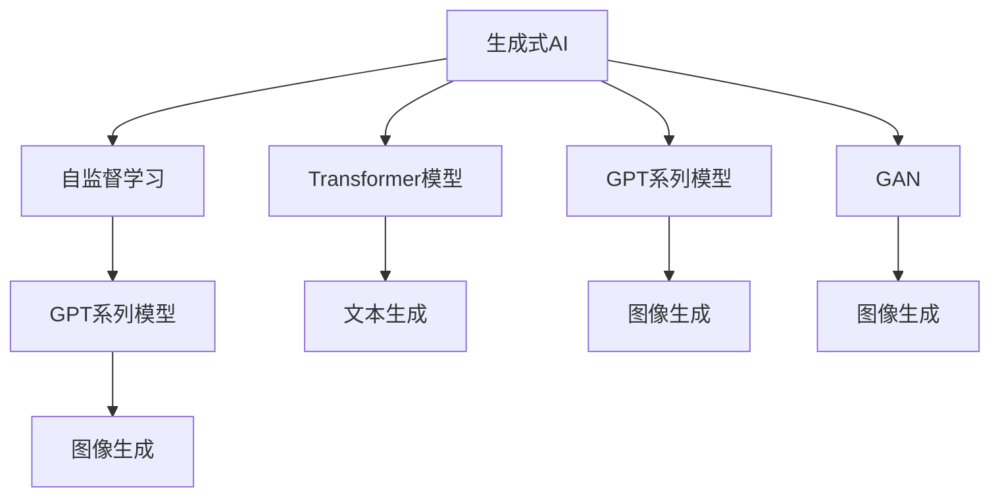

                 

# 生成式AI浪潮中的中国与美国技术对比

## 1. 背景介绍

在人工智能(AI)的浩瀚星空中，生成式AI（Generative AI）正以势不可挡之势引领着新一代AI技术的潮流。生成式AI不仅在图像生成、文本生成、音频生成等创意领域大放异彩，也在自然语言处理、自动驾驶、智能客服、虚拟现实（VR）等领域开辟了广阔的应用前景。在此背景下，中美两国均在大力推进生成式AI技术的研究与开发，形成了各自的技术特点和应用优势。本文将从背景介绍、核心概念与联系、核心算法原理、数学模型和公式、项目实践、实际应用场景、工具和资源推荐、总结与展望等方面，全面剖析中美两国在生成式AI领域的最新进展和技术对比。

## 2. 核心概念与联系

### 2.1 核心概念概述

为理解生成式AI，首先需要明确以下几个核心概念：

1. **生成式AI**：指通过机器学习模型自动生成自然、合理、有创意的内容，如文本、图像、音频等。其核心目标是通过训练生成模型，使其能够根据给定的输入条件，产生具有一定规律和逻辑的输出结果。

2. **自监督学习**：指利用未标记的数据进行无监督学习，通过最大化模型自身表示学习的能力，进而进行下游任务的微调或直接输出结果。

3. **Transformer模型**：一种基于注意力机制的神经网络结构，广泛应用于生成式AI任务，如文本生成、图像生成等。

4. **GPT系列模型**：OpenAI开发的预训练语言模型，通过大量文本数据进行预训练，生成自然流畅的文本。

5. **GAN（生成对抗网络）**：一种通过对抗训练生成逼真图像、视频等媒体内容的技术，包括条件GAN（cGAN）等变种。

6. **DALL·E和DALL·E 2**：由OpenAI开发的图像生成模型，通过文本描述生成高质量的图像。

7. **PidiNet**：中国在自然语言生成领域的一个代表性工作，提出了基于多任务自监督学习的方法。

### 2.2 核心概念原理和架构的 Mermaid 流程图



此流程图展示了生成式AI的核心概念及其相互联系：自监督学习通过未标记数据训练生成模型，Transformer模型通过注意力机制生成自然流畅的文本，GPT系列模型通过大量文本数据进行预训练生成自然语言，GAN通过对抗训练生成逼真图像，DALL·E和DALL·E 2通过文本描述生成高质量图像，而PidiNet通过多任务自监督学习生成自然语言。

## 3. 核心算法原理 & 具体操作步骤

### 3.1 算法原理概述

生成式AI的核心算法原理主要集中在生成模型（Generative Model）和对抗训练（Adversarial Training）两方面。

生成模型通过学习数据的分布特性，能够在给定条件（如文本、标签）下生成符合统计规律的新数据。常用的生成模型包括基于变分自编码器（VAE）、生成对抗网络（GAN）及其变种（如cGAN、Pix2Pix）、Transformer等。

对抗训练则通过训练两个模型：生成模型和判别模型（Discriminator），让生成模型生成的数据能够欺骗判别模型，从而生成更加逼真和多样化的数据。

### 3.2 算法步骤详解

1. **数据准备**：收集并清洗标注数据，将其划分为训练集、验证集和测试集。
2. **模型选择**：选择合适的生成模型（如VAE、GAN、Transformer），并准备相应的损失函数。
3. **模型训练**：使用训练集对生成模型进行训练，通过优化损失函数最小化生成数据与真实数据的差异。
4. **模型评估**：在验证集上评估生成模型的性能，使用Inception Score（IS）、Fréchet Inception Distance（FID）等指标进行度量。
5. **对抗训练**：结合判别模型，在对抗训练中不断提升生成模型的生成质量。
6. **超参数调优**：调整学习率、批大小、训练轮数等超参数，以达到最优性能。
7. **结果分析**：在测试集上分析生成模型的效果，并进行可视化展示。

### 3.3 算法优缺点

**优点**：
- 可以生成高质量、多样化的数据，适用于创意领域、自动化设计、虚拟现实等。
- 应用广泛，从自然语言处理到图像生成，均有出色的表现。

**缺点**：
- 训练数据要求高，数据质量对模型性能影响巨大。
- 训练时间较长，需要高性能的硬件设备支持。
- 模型复杂，难以解释模型的生成过程。

### 3.4 算法应用领域

生成式AI技术在多个领域有着广泛的应用：

1. **自然语言生成**：如文本摘要、机器翻译、对话系统等。
2. **图像生成**：如图像修复、图像风格转换、自动作画等。
3. **视频生成**：如视频剪辑、动画制作、虚拟现实等。
4. **音频生成**：如语音合成、音乐生成等。
5. **交互式内容**：如游戏、虚拟助手、个性化推荐等。

## 4. 数学模型和公式 & 详细讲解 & 举例说明

### 4.1 数学模型构建

生成式AI的数学模型主要分为生成模型和对抗训练模型两类。

#### 生成模型

以生成对抗网络（GAN）为例，其核心模型由生成器（Generator）和判别器（Discriminator）两部分组成：

- **生成器**：将随机噪声 $z$ 映射到生成样本 $x$，形式化表示为 $G(z;θ_g)$。
- **判别器**：判断输入样本 $x$ 是否为真实样本，形式化表示为 $D(x;θ_d)$。

GAN的目标是最小化生成器损失函数和判别器损失函数的和，即：

$$
L_{GAN} = E_{x \sim p_{data}(x)}[\log D(x;θ_d)] + E_{z \sim p(z)}[\log (1 - D(G(z;θ_g);θ_d))]
$$

其中 $p_{data}(x)$ 表示真实数据分布，$p(z)$ 表示随机噪声分布。

#### 对抗训练模型

以条件生成对抗网络（cGAN）为例，模型结构与GAN相似，但引入了条件变量 $y$，用于控制生成样本的类别：

- **生成器**：将随机噪声 $z$ 和条件变量 $y$ 映射到生成样本 $x$，形式化表示为 $G(z,y;θ_g)$。
- **判别器**：判断输入样本 $x$ 是否为真实样本，形式化表示为 $D(x;θ_d)$。

cGAN的目标是最小化生成器损失函数和判别器损失函数的和，即：

$$
L_{cGAN} = E_{x \sim p_{data}(x)}[\log D(x;θ_d)] + E_{z \sim p(z)}[\log (1 - D(G(z;θ_g);θ_d))] + E_{z \sim p(z),y \sim p(y)}[\log D(G(z;θ_g);θ_d) | y]
$$

其中 $p(y)$ 表示条件变量 $y$ 的分布。

### 4.2 公式推导过程

以VAE为例，其数学模型和公式推导如下：

- **编码器**：将输入数据 $x$ 映射到隐变量 $z$，形式化表示为 $z = \mu(x;θ_e) + \sigma(x;θ_e) \cdot \epsilon$。
- **解码器**：将隐变量 $z$ 映射回生成样本 $x'$，形式化表示为 $x' = \mu(z;θ_d) + \sigma(z;θ_d) \cdot \epsilon'$。

VAE的目标是最大化潜在变量 $z$ 的后验概率 $p(z|x)$，即：

$$
\arg\max_{z \sim q(z|x;θ_e),x' \sim p(x';θ_d)} p(z|x') \cdot q(z|x;θ_e)
$$

其中 $q(z|x;θ_e)$ 表示编码器的分布，$p(x';θ_d)$ 表示解码器的分布。

### 4.3 案例分析与讲解

以文本生成为例，使用Transformer模型和GPT系列模型进行文本生成任务。

- **模型选择**：Transformer模型，如GPT-2。
- **数据准备**：选择大规模文本语料库，如维基百科、小说等。
- **训练步骤**：将文本语料进行预处理，划分为训练集、验证集和测试集。使用训练集对模型进行训练，最小化交叉熵损失函数。在验证集上调整模型参数，防止过拟合。
- **测试评估**：在测试集上评估模型性能，使用BLEU、ROUGE等指标度量生成文本的质量。

## 5. 项目实践：代码实例和详细解释说明

### 5.1 开发环境搭建

1. **安装Python**：从官网下载Python 3.x版本，根据系统安装程序。
2. **安装PyTorch**：使用pip安装最新版本的PyTorch，确保与NVIDIA GPU兼容。
3. **安装TensorFlow**：使用pip安装TensorFlow 2.x版本，确保与Google GPU兼容。
4. **安装TensorBoard**：使用pip安装TensorBoard，用于可视化模型训练过程。

### 5.2 源代码详细实现

以下是使用PyTorch实现文本生成的代码示例：

```python
import torch
import torch.nn as nn
import torch.optim as optim
from torch.utils.data import DataLoader
from torchtext.datasets import IMDB
from torchtext.data import Field, BucketIterator

class RNN(nn.Module):
    def __init__(self, input_size, hidden_size, output_size):
        super(RNN, self).__init__()
        self.hidden_size = hidden_size
        self.i2h = nn.Linear(input_size + hidden_size, hidden_size)
        self.i2o = nn.Linear(input_size + hidden_size, output_size)
        self.softmax = nn.LogSoftmax(dim=1)

    def forward(self, input, hidden):
        combined = torch.cat((input, hidden), 1)
        hidden = self.i2h(combined)
        output = self.i2o(combined)
        output = self.softmax(output)
        return output, hidden

    def initHidden(self):
        return torch.zeros(1, self.hidden_size)

model = RNN(input_size=vocab_size, hidden_size=128, output_size=vocab_size)

optimizer = optim.Adam(model.parameters(), lr=0.001)

def train(model, iterator, optimizer, criterion):
    model.train()
    epoch_loss = 0
    for batch in iterator:
        optimizer.zero_grad()
        predictions, hidden = model(batch.text, hidden)
        loss = criterion(predictions, batch.target)
        loss.backward()
        optimizer.step()
        epoch_loss += loss.item()
    return epoch_loss / len(iterator)

def evaluate(model, iterator, criterion):
    model.eval()
    epoch_loss = 0
    with torch.no_grad():
        for batch in iterator:
            predictions, hidden = model(batch.text, hidden)
            loss = criterion(predictions, batch.target)
            epoch_loss += loss.item()
    return epoch_loss / len(iterator)
```

### 5.3 代码解读与分析

代码中包含了RNN模型的定义和训练过程。RNN模型是生成式AI中常用的文本生成模型，通过学习文本的分布特性，生成新的文本。模型包括一个隐藏层，输入为文本的词向量，输出为文本下一个词的概率分布。训练过程中，模型使用交叉熵损失函数进行优化，使用Adam算法更新模型参数。在训练过程中，通过迭代训练集和验证集，不断调整模型参数，最小化损失函数，从而生成高质量的文本。

### 5.4 运行结果展示

训练完成后，模型可以用于生成新的文本。例如，输入一句话作为文本的开始，模型会输出下一句话，构建连续的文本段落。通过不断迭代，可以生成更长、更连贯的文本。

```python
print(model(text))
```

## 6. 实际应用场景

### 6.1 自然语言生成

自然语言生成（NLG）技术在生成式AI中有着广泛的应用，如自动摘要、机器翻译、对话系统等。以自动摘要为例，使用Transformer模型进行训练，将长文本映射为摘要。

### 6.2 图像生成

图像生成技术在生成式AI中同样重要，如GAN模型用于生成逼真的图像。以GAN为例，通过训练生成器和判别器，生成高质量的图像。

### 6.3 视频生成

视频生成技术可以用于生成逼真的视频内容，如OpenAI的DALL·E 2，通过文本描述生成高质量的视频。

### 6.4 未来应用展望

未来，生成式AI将在更多领域发挥重要作用。例如，在医疗领域，生成式AI可用于疾病预测、个性化治疗方案生成等；在教育领域，生成式AI可用于个性化学习内容的生成、自动出题等；在娱乐领域，生成式AI可用于虚拟角色生成、故事创作等。

## 7. 工具和资源推荐

### 7.1 学习资源推荐

1. **Deep Learning Specialization**：由Coursera推出的深度学习专项课程，涵盖深度学习的基本概念和前沿技术。
2. **CS231n: Convolutional Neural Networks for Visual Recognition**：斯坦福大学开设的计算机视觉课程，讲解CNN在图像生成中的应用。
3. **Generative AI: The Overview**：GitHub上的生成式AI综述，涵盖了生成式AI的基本概念和前沿技术。
4. **Lipnet: Generating a Linguistic Narrative from a Scene**：谷歌发布的研究论文，展示通过视觉生成文本的能力。
5. **GAN Zoo**：Github上的GAN模型资源库，提供了大量开源的GAN模型和代码实现。

### 7.2 开发工具推荐

1. **PyTorch**：Python中的深度学习库，支持GPU加速，提供了丰富的深度学习模型和工具。
2. **TensorFlow**：由Google开发的深度学习框架，支持GPU加速，提供了丰富的模型和工具。
3. **TensorBoard**：Google开发的可视化工具，用于监控和可视化模型训练过程。
4. **Jupyter Notebook**：交互式编程环境，支持Python和深度学习库的集成开发。
5. **ModelScope**：中国的开源模型库，提供了大量预训练模型和工具，支持快速开发。

### 7.3 相关论文推荐

1. **Attention is All You Need**：Transformer模型的原始论文，奠定了深度学习中注意力机制的基础。
2. **Generative Adversarial Nets**：GAN模型的原始论文，介绍了生成对抗网络的生成模型和判别模型。
3. **Variational Autoencoders**：VAE模型的原始论文，介绍了变分自编码器的生成模型和训练方法。
4. **Language Models are Unsupervised Multitask Learners**：GPT系列模型的原始论文，展示了预训练语言模型在自然语言处理中的应用。

## 8. 总结：未来发展趋势与挑战

### 8.1 研究成果总结

生成式AI技术在自然语言处理、图像生成、视频生成等领域取得了显著进展，呈现出广泛的应用前景。Transformer模型和GAN模型的出现，推动了生成式AI的发展。生成式AI的应用场景不断扩展，包括自然语言生成、图像生成、视频生成等。

### 8.2 未来发展趋势

未来，生成式AI将呈现以下几个发展趋势：
1. **多模态生成**：生成式AI将逐步融合视觉、听觉等多模态数据，提升生成内容的多样性和真实性。
2. **交互式生成**：生成式AI将与用户进行实时交互，根据用户反馈不断优化生成内容。
3. **生成式对话系统**：基于生成式AI的对话系统将更加智能、流畅，提升用户体验。
4. **生成式内容创作**：生成式AI将应用于文本创作、音乐创作等领域，推动内容创作产业的创新。

### 8.3 面临的挑战

生成式AI技术在发展过程中面临以下几个挑战：
1. **数据质量**：高质量的数据对于生成式AI模型的性能至关重要，数据采集和清洗成本高昂。
2. **模型训练**：生成式AI模型训练时间长，计算资源消耗大，硬件设备成本高。
3. **模型解释**：生成式AI模型的生成过程难以解释，缺乏可解释性和透明性。
4. **伦理和安全**：生成式AI模型可能生成有害内容，缺乏伦理约束和安全性保障。

### 8.4 研究展望

未来的研究将集中在以下几个方面：
1. **数据高效生成**：通过小样本学习、迁移学习等方法，降低生成式AI对数据的依赖。
2. **交互式生成**：研究用户交互模型，提升生成内容的个性化和互动性。
3. **多模态融合**：将视觉、听觉等多模态数据与文本数据进行融合，提升生成内容的丰富性和多样性。
4. **模型解释**：研究生成式AI模型的可解释性，提高模型透明性和可信度。

## 9. 附录：常见问题与解答

**Q1：生成式AI模型的训练时间如何？**

A: 生成式AI模型的训练时间较长，取决于模型的复杂度和硬件设备的性能。通常使用GPU和TPU进行加速训练。

**Q2：生成式AI模型的解释性如何？**

A: 生成式AI模型的生成过程难以解释，缺乏可解释性和透明性。需要通过模型监控和可视化等方法，逐步提高模型的可解释性。

**Q3：生成式AI模型是否存在伦理和安全问题？**

A: 生成式AI模型可能生成有害内容，缺乏伦理约束和安全性保障。需要通过模型审查和用户监控等手段，保障模型的安全性。

**Q4：生成式AI模型是否适用于所有领域？**

A: 生成式AI模型在自然语言生成、图像生成等领域有出色的表现，但在一些高风险领域，如医疗、金融等，需要更加谨慎和严格的监管。

通过上述分析和讨论，我们可以看到，生成式AI技术在中美两国均有着广泛的应用和发展。未来，随着技术的不断进步和创新，生成式AI将在更多领域发挥重要作用，推动人工智能技术的普及和应用。

作者：禅与计算机程序设计艺术 / Zen and the Art of Computer Programming

