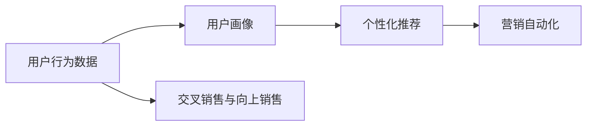

                 

# 用户行为分析：AI如何洞察用户需求，优化商品供给和营销策略

## 1. 背景介绍

在当今数字化时代，企业面对日益激烈的市场竞争和不断变化的用户需求，亟需更精确的用户行为分析来优化商品供给和营销策略。人工智能技术的引入，特别是机器学习和深度学习技术，为洞察用户需求和精准营销提供了前所未有的工具。本文将深入探讨AI技术如何帮助企业洞察用户行为，优化商品供给和营销策略。

## 2. 核心概念与联系

### 2.1 核心概念概述

要全面理解AI在用户行为分析中的应用，首先需要了解一些核心概念及其相互联系：

- **用户行为分析 (User Behavior Analysis, UBA)**：通过数据分析和AI技术，识别用户的行为模式和偏好，预测用户未来行为，从而优化商品供给和营销策略。

- **用户画像 (User Persona)**：基于用户行为数据构建的虚拟人物，包括用户的兴趣、偏好、消费习惯等，用于指导个性化推荐和精准营销。

- **个性化推荐 (Personalized Recommendation)**：根据用户画像和行为数据，推荐用户可能感兴趣的商品或服务，提升用户体验和满意度。

- **营销自动化 (Marketing Automation)**：利用AI技术自动化营销活动，包括广告投放、邮件营销、社交媒体推广等，提高营销效率和ROI。

- **交叉销售与向上销售 (Cross-Selling and Upselling)**：通过用户行为分析，发现潜在购买机会，推荐相关商品或服务，增加销售额。

这些概念通过数据分析和AI技术的协同工作，相互交织，共同推动企业实现更高效的用户行为分析和更精准的营销策略。

### 2.2 核心概念原理和架构的 Mermaid 流程图



此流程图展示了用户行为数据如何通过用户画像、个性化推荐和营销自动化，以及交叉销售与向上销售等核心概念进行转化，最终为企业的决策提供支持。

## 3. 核心算法原理 & 具体操作步骤

### 3.1 算法原理概述

AI在用户行为分析中的核心算法主要基于机器学习和深度学习技术，包括协同过滤、关联规则、神经网络等。这些算法通过分析和预测用户的行为模式和偏好，帮助企业优化商品供给和营销策略。

### 3.2 算法步骤详解

1. **数据收集与预处理**：
   - 收集用户行为数据，如浏览记录、购买记录、点击率、评分等。
   - 数据清洗和预处理，包括去除噪声、填补缺失值、标准化数据等。

2. **特征提取**：
   - 从原始数据中提取有意义的特征，如用户ID、商品ID、浏览时长、购买金额等。
   - 使用嵌入技术将离散特征转换为连续向量，便于后续建模。

3. **模型训练**：
   - 选择合适的算法（如协同过滤、KNN、决策树、神经网络等）进行模型训练。
   - 使用历史数据进行训练，优化模型参数。

4. **预测与推荐**：
   - 使用训练好的模型对新数据进行预测，生成推荐结果。
   - 对推荐结果进行排序和筛选，选择最可能符合用户需求的商品或服务。

5. **评估与优化**：
   - 使用指标（如准确率、召回率、F1分数等）评估模型性能。
   - 根据评估结果，调整模型参数和特征，优化推荐效果。

### 3.3 算法优缺点

#### 优点：

- **高效性**：自动化和规模化分析，大幅提升分析效率。
- **准确性**：基于大数据和深度学习算法，推荐结果更准确。
- **实时性**：实时分析用户行为，迅速响应市场变化。

#### 缺点：

- **数据隐私**：需要收集大量用户数据，涉及隐私和安全问题。
- **模型复杂性**：深度学习模型复杂，训练和优化困难。
- **数据偏差**：模型结果可能受到训练数据偏差的影响。

### 3.4 算法应用领域

AI在用户行为分析中的应用领域非常广泛，包括但不限于以下领域：

- **电商领域**：个性化推荐、交叉销售、广告投放等。
- **内容平台**：内容推荐、用户留存分析、个性化视频推荐等。
- **金融行业**：风险评估、客户细分、投资建议等。
- **健康医疗**：患者画像、治疗方案推荐、疾病预防等。
- **旅游服务**：个性化旅游路线推荐、用户满意度分析等。

这些领域的企业都可以通过AI技术进行用户行为分析，以提升用户满意度、增加收入和优化运营效率。

## 4. 数学模型和公式 & 详细讲解 & 举例说明

### 4.1 数学模型构建

用户行为分析的核心数学模型包括协同过滤、关联规则和神经网络等。以下将详细讲解协同过滤和神经网络的数学模型构建。

#### 协同过滤 (Collaborative Filtering, CF)

协同过滤分为基于用户的协同过滤 (User-Based CF) 和基于物品的协同过滤 (Item-Based CF)。

- **基于用户的协同过滤**：
  - **模型构建**：
    $$
    \hat{R}_{ui} = \sum_{j=1}^{n}a_{ij}\times u_{ju}
    $$
    其中，$\hat{R}_{ui}$ 为用户 $u$ 对物品 $i$ 的预测评分，$n$ 为所有物品的数量，$a_{ij}$ 为用户 $u$ 对物品 $j$ 的评分，$u_{ju}$ 为物品 $j$ 的平均评分。

  - **算法步骤**：
    1. 计算用户与物品间的相似度。
    2. 利用相似度加权求和，预测用户对物品的评分。

- **基于物品的协同过滤**：
  - **模型构建**：
    $$
    \hat{R}_{ui} = \sum_{j=1}^{n}a_{ij}\times v_{iu}
    $$
    其中，$\hat{R}_{ui}$ 为物品 $i$ 对用户 $u$ 的预测评分，$a_{ij}$ 为用户 $j$ 对物品 $i$ 的评分，$v_{iu}$ 为用户的平均评分。

  - **算法步骤**：
    1. 计算物品与物品间的相似度。
    2. 利用相似度加权求和，预测用户对物品的评分。

#### 神经网络模型

以卷积神经网络 (Convolutional Neural Network, CNN) 为例，其数学模型构建如下：

- **输入层**：用户行为数据，如浏览记录、购买记录等，表示为矩阵 $\mathbf{X}$。

- **卷积层**：使用卷积核对输入数据进行特征提取，生成卷积特征图 $\mathbf{Z}$。

- **池化层**：对卷积特征图进行降维，保留最重要的特征。

- **全连接层**：将池化后的特征图映射到用户画像，输出用户偏好向量 $\mathbf{P}$。

- **输出层**：根据用户画像进行个性化推荐，输出推荐结果 $\mathbf{R}$。

### 4.2 公式推导过程

#### 协同过滤

- **基于用户的协同过滤**：
  - **相似度计算**：使用余弦相似度计算用户之间的相似度。
  - **评分预测**：利用加权平均法进行评分预测。

- **基于物品的协同过滤**：
  - **相似度计算**：使用余弦相似度计算物品之间的相似度。
  - **评分预测**：利用加权平均法进行评分预测。

#### 神经网络模型

- **卷积层**：
  $$
  \mathbf{Z} = \mathbf{X} * \mathbf{W} + b
  $$
  其中，$*$ 表示卷积运算，$\mathbf{W}$ 为卷积核，$b$ 为偏置项。

- **池化层**：
  $$
  \mathbf{Z'} = \max(\mathbf{Z})
  $$
  其中，$\max$ 表示取最大值。

- **全连接层**：
  $$
  \mathbf{P} = \mathbf{Z'}\mathbf{W'} + b'
  $$
  其中，$\mathbf{W'}$ 为全连接层权重，$b'$ 为偏置项。

### 4.3 案例分析与讲解

#### 电商领域个性化推荐

- **问题描述**：某电商网站希望提升用户购买率和转化率，通过用户行为分析进行个性化推荐。
- **数据集**：用户浏览记录、购买记录、评分、反馈等。
- **算法选择**：基于物品的协同过滤。
- **算法步骤**：
  1. 收集用户行为数据，并进行预处理。
  2. 构建物品-物品相似度矩阵。
  3. 利用相似度矩阵进行评分预测。
  4. 根据预测评分进行排序，推荐用户可能感兴趣的商品。
- **结果**：使用基于物品的协同过滤算法，电商网站显著提升了用户的购买率和转化率。

#### 内容平台内容推荐

- **问题描述**：某视频平台希望提升用户留存率和点击率，通过用户行为分析进行内容推荐。
- **数据集**：用户观看记录、点赞记录、评论记录等。
- **算法选择**：神经网络模型。
- **算法步骤**：
  1. 收集用户行为数据，并进行预处理。
  2. 构建神经网络模型，输入为观看记录，输出为用户偏好向量。
  3. 根据用户偏好向量进行内容推荐。
- **结果**：使用神经网络模型，视频平台显著提高了用户留存率和点击率。

## 5. 项目实践：代码实例和详细解释说明

### 5.1 开发环境搭建

在进行AI项目实践时，我们需要准备好开发环境。以下是使用Python进行TensorFlow开发的典型环境配置流程：

1. 安装Anaconda：从官网下载并安装Anaconda，用于创建独立的Python环境。

2. 创建并激活虚拟环境：
```bash
conda create -n tf-env python=3.8 
conda activate tf-env
```

3. 安装TensorFlow：根据CUDA版本，从官网获取对应的安装命令。例如：
```bash
conda install tensorflow -c conda-forge
```

4. 安装其他依赖包：
```bash
pip install numpy pandas scikit-learn
```

完成上述步骤后，即可在`tf-env`环境中开始项目实践。

### 5.2 源代码详细实现

以下是一个基于TensorFlow的协同过滤推荐系统的Python代码实现：

```python
import tensorflow as tf
from tensorflow.keras.layers import Input, Dense, Embedding, Conv2D, Flatten, MaxPooling2D, Concatenate
from tensorflow.keras.models import Model

# 构建神经网络模型
def build_model(input_shape, num_users, num_items, embed_dim):
    # 输入层
    user_input = Input(shape=(1,))
    item_input = Input(shape=(1,))
    
    # 嵌入层
    user_embed = Embedding(num_users, embed_dim)(user_input)
    item_embed = Embedding(num_items, embed_dim)(item_input)
    
    # 卷积层
    conv2d = Conv2D(32, (2, 2), activation='relu', padding='same')(tf.concat([user_embed, item_embed], axis=-1))
    
    # 池化层
    pooling = MaxPooling2D((1, 1))(conv2d)
    
    # 全连接层
    fc = Dense(64, activation='relu')(pooling)
    
    # 输出层
    output = Dense(1, activation='sigmoid')(fc)
    
    # 定义模型
    model = Model(inputs=[user_input, item_input], outputs=output)
    model.compile(optimizer='adam', loss='binary_crossentropy', metrics=['accuracy'])
    return model

# 训练和评估函数
def train_and_evaluate(model, train_data, val_data, epochs):
    # 训练模型
    history = model.fit(x=train_data, y=train_labels, validation_data=(val_data, val_labels), epochs=epochs, batch_size=32)
    
    # 评估模型
    test_loss, test_acc = model.evaluate(x=test_data, y=test_labels)
    print(f"Test accuracy: {test_acc:.2f}")
    return history

# 加载数据
train_data = ...
val_data = ...
test_data = ...
train_labels = ...
val_labels = ...
test_labels = ...

# 构建模型
embed_dim = 128
num_users = ...
num_items = ...
input_shape = (1,)

model = build_model(input_shape, num_users, num_items, embed_dim)

# 训练模型
epochs = 10
history = train_and_evaluate(model, train_data, val_data, epochs)

# 结果展示
```

### 5.3 代码解读与分析

让我们再详细解读一下关键代码的实现细节：

**build_model函数**：
- 定义输入层，分别对用户ID和物品ID进行嵌入。
- 通过卷积层进行特征提取，池化层进行降维。
- 使用全连接层将特征映射为用户画像。
- 定义输出层，进行二分类预测。
- 构建并编译神经网络模型。

**train_and_evaluate函数**：
- 使用训练数据对模型进行训练，并记录训练过程中的性能指标。
- 在验证集上评估模型性能，并返回训练历史。
- 在测试集上评估模型性能，并输出结果。

**数据加载**：
- 使用TensorFlow的DataLoader加载数据。
- 将数据和标签作为模型输入和输出。
- 在模型训练过程中，实时更新训练历史和性能指标。

## 6. 实际应用场景

### 6.1 电商平台

电商平台可以通过用户行为分析，提升个性化推荐和交叉销售的效果。具体实现如下：

- **个性化推荐**：利用协同过滤算法，分析用户的历史购买和浏览记录，推荐其可能感兴趣的商品。
- **交叉销售**：通过用户画像和行为数据，发现购买某商品的用户还可能对哪些商品感兴趣，进行交叉销售推荐。

### 6.2 内容平台

内容平台可以通过用户行为分析，提高内容推荐和用户留存率。具体实现如下：

- **内容推荐**：使用神经网络模型，分析用户的观看记录和互动行为，推荐其可能感兴趣的视频内容。
- **用户留存**：通过用户画像和行为数据，预测用户流失风险，进行留存策略调整。

### 6.3 金融行业

金融行业可以通过用户行为分析，优化风险评估和客户细分。具体实现如下：

- **风险评估**：利用神经网络模型，分析用户的交易记录和行为数据，预测其违约风险。
- **客户细分**：通过用户画像和行为数据，将客户分为高价值和低价值用户，进行差异化营销。

## 7. 工具和资源推荐

### 7.1 学习资源推荐

为了帮助开发者系统掌握AI在用户行为分析中的应用，这里推荐一些优质的学习资源：

1. 《机器学习实战》系列书籍：深入浅出地讲解了机器学习的基本概念和算法，适合入门学习。

2. 《深度学习》课程：由斯坦福大学Andrew Ng开设的深度学习课程，详细讲解了深度学习的基本原理和实现方法。

3. 《Python深度学习》书籍：由Francois Chollet（Keras作者）撰写，介绍了使用TensorFlow进行深度学习的实践技巧。

4. Kaggle平台：包含大量NLP和用户行为分析的数据集和竞赛，可以锻炼实践能力。

5. PyTorch官方文档：提供了丰富的TensorFlow和深度学习应用示例，适合初学者和实践者参考。

通过对这些资源的学习实践，相信你一定能够快速掌握AI在用户行为分析中的应用，并用于解决实际的业务问题。

### 7.2 开发工具推荐

高效的开发离不开优秀的工具支持。以下是几款用于AI项目开发的常用工具：

1. PyTorch：基于Python的开源深度学习框架，灵活的计算图，适合快速迭代研究。

2. TensorFlow：由Google主导开发的开源深度学习框架，生产部署方便，适合大规模工程应用。

3. Jupyter Notebook：交互式的数据分析和机器学习开发环境，支持代码编辑和可视化展示。

4. Keras：基于TensorFlow的高级API，方便进行快速模型原型设计和实验验证。

5. TensorBoard：TensorFlow配套的可视化工具，可实时监测模型训练状态，并提供丰富的图表呈现方式。

6. Weights & Biases：模型训练的实验跟踪工具，可以记录和可视化模型训练过程中的各项指标。

合理利用这些工具，可以显著提升AI项目开发的效率和质量，加快创新迭代的步伐。

### 7.3 相关论文推荐

AI在用户行为分析领域的研究不断深入，以下是几篇奠基性的相关论文，推荐阅读：

1. "Collaborative Filtering for Implicit Feedback Datasets"：介绍了协同过滤算法在推荐系统中的应用。

2. "Deep Learning with TensorFlow"：介绍了TensorFlow框架的基本使用方法和深度学习模型的构建。

3. "Neural Networks for Implicit Feedback Data"：介绍了神经网络在推荐系统中的建模方法。

4. "A Survey of Cross-Selling and Upselling Research"：对交叉销售和向上销售的研究进行了综述，提供了多种实现策略。

5. "A Survey of Online Recommendation Algorithms"：对在线推荐算法进行了综述，包括协同过滤、深度学习等方法。

这些论文代表了大规模用户行为分析技术的发展脉络，通过学习这些前沿成果，可以帮助研究者把握学科前进方向，激发更多的创新灵感。

## 8. 总结：未来发展趋势与挑战

### 8.1 总结

本文对AI在用户行为分析中的应用进行了全面系统的介绍。首先阐述了AI技术在洞察用户需求和优化商品供给和营销策略中的重要性。其次，从原理到实践，详细讲解了协同过滤、神经网络等核心算法的构建和应用。最后，展示了AI在电商平台、内容平台、金融行业等实际应用场景中的应用。

通过本文的系统梳理，可以看到，AI技术在用户行为分析中的应用已经日益成熟，为企业优化商品供给和营销策略提供了强有力的技术支撑。未来，随着算力提升和数据丰富，AI技术在用户行为分析中的应用将更加广泛和深入，推动企业实现更高的业务价值。

### 8.2 未来发展趋势

展望未来，AI在用户行为分析领域将呈现以下几个发展趋势：

1. **多模态融合**：将文本、图像、语音等多模态数据进行融合分析，提升推荐系统的准确性和鲁棒性。

2. **实时化处理**：利用流式处理框架（如Apache Flink）实现实时数据处理和推荐，提高用户体验和响应速度。

3. **联邦学习**：通过联邦学习技术，保护用户隐私，同时进行大规模协同推荐。

4. **边缘计算**：在边缘设备上进行推荐计算，降低延迟，提高推荐效率。

5. **可解释性增强**：引入可解释性技术，增强推荐系统的透明度和可信度。

6. **AI+大数据**：结合大数据技术，进行更大规模和更高质量的用户行为分析，优化商品供给和营销策略。

这些趋势将进一步推动AI技术在用户行为分析中的应用，带来更加高效、精准和个性化的服务。

### 8.3 面临的挑战

尽管AI在用户行为分析领域取得了诸多进展，但仍面临以下挑战：

1. **数据隐私**：用户行为数据的收集和处理涉及隐私和安全问题，如何在保护用户隐私的前提下进行有效分析，是关键挑战之一。

2. **算法复杂性**：AI算法（如深度神经网络）的复杂性，使得模型训练和优化困难，需要更多的计算资源和时间。

3. **模型可解释性**：AI模型的黑盒特性，导致推荐系统的决策过程难以解释和调试。

4. **跨平台适配**：不同平台（如Web、移动端、智能设备等）的用户行为数据格式不同，如何实现跨平台数据融合和统一分析，是未来需要解决的问题。

5. **数据质量和多样性**：用户行为数据的质量和多样性对推荐系统的效果有重要影响，如何收集和处理高质量数据，是实际应用中的难题。

6. **实时性要求**：实时化推荐系统需要高效的数据处理和快速计算，这对系统的架构设计和算法优化提出了更高要求。

这些挑战需要学界和产业界共同努力，寻找有效的解决方案，才能进一步提升AI在用户行为分析中的应用效果。

### 8.4 研究展望

未来，在用户行为分析领域，AI技术有望在以下几个方面取得突破：

1. **深度强化学习**：将强化学习引入推荐系统，通过互动反馈进一步优化推荐策略。

2. **元学习**：通过元学习技术，提升推荐系统的泛化能力和适应性。

3. **联邦学习**：利用联邦学习技术，实现跨平台跨机构的协同推荐，提升数据利用效率。

4. **因果推断**：引入因果推断技术，对用户行为进行因果分析，提升推荐的准确性和公平性。

5. **个性化推荐算法**：研究更加个性化的推荐算法，如基于图神经网络的推荐模型。

6. **实时推荐系统**：实现高效的实时数据处理和推荐算法，提升用户体验和系统响应速度。

这些方向的研究将推动AI技术在用户行为分析中的进一步应用，为个性化推荐和精准营销带来新的突破。

## 9. 附录：常见问题与解答

**Q1：AI在用户行为分析中如何处理数据隐私问题？**

A: 数据隐私是AI在用户行为分析中面临的重要挑战之一。以下是一些处理数据隐私的方法：

1. **数据匿名化**：使用数据匿名化技术，如泛化、去标识化等，保护用户隐私。

2. **差分隐私**：引入差分隐私技术，在保证数据可用性的前提下，保护用户隐私。

3. **联邦学习**：利用联邦学习技术，在边缘设备上进行模型训练，保护用户数据隐私。

4. **用户授权**：通过用户授权和同意，明确数据使用范围和目的，保护用户隐私。

5. **数据去重**：对重复数据进行处理，减少数据泄露的风险。

**Q2：如何提高AI推荐系统的可解释性？**

A: 提高AI推荐系统的可解释性，有助于增强用户信任和满意度。以下是一些提高可解释性的方法：

1. **特征重要性分析**：通过特征重要性分析，识别对推荐结果有重要影响的用户行为特征。

2. **规则提取**：利用规则提取技术，发现推荐系统内部的决策规则，解释推荐逻辑。

3. **可视化展示**：通过可视化工具，展示推荐系统的输入、输出和决策路径，增强可解释性。

4. **解释模型**：引入可解释模型（如线性模型），提高推荐系统的透明度和可信度。

**Q3：AI推荐系统如何适应多模态数据？**

A: 多模态数据的融合是提升推荐系统效果的重要方向。以下是一些适应多模态数据的方法：

1. **特征融合**：使用特征融合技术，将不同模态的数据进行组合和融合，提升特征表达能力。

2. **深度学习模型**：利用深度学习模型，将不同模态的数据进行协同建模，提升推荐系统的准确性和鲁棒性。

3. **多模态特征提取**：使用多模态特征提取技术，从不同模态的数据中提取有意义的特征，提升推荐效果。

4. **模型集成**：利用模型集成技术，将不同模态的推荐模型进行组合和融合，提升推荐系统的性能。

这些方法可以有效地处理多模态数据，提升推荐系统的准确性和鲁棒性。

---

作者：禅与计算机程序设计艺术 / Zen and the Art of Computer Programming

