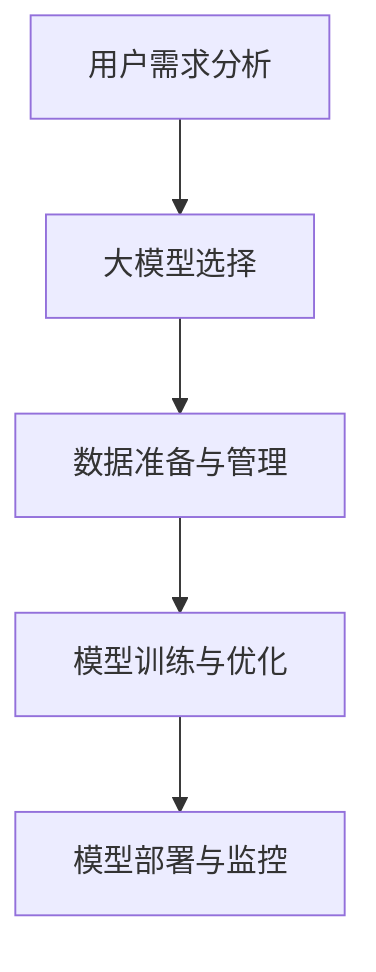

                 

# 用户需求：大模型创业的指南针

> 关键词：大模型创业, 用户需求分析, 人工智能, 数据科学, 模型选择, 应用场景, 成本效益, 持续学习, 技术栈, 案例研究, 未来趋势

## 1. 背景介绍

在当今数据驱动的时代，人工智能（AI）和大数据技术已经深刻改变了各行各业的运作方式。大模型（Large Model），尤其是深度学习中的神经网络模型，因其在图像识别、自然语言处理、语音识别等方面的出色表现，被广泛应用于各种创新场景。然而，尽管技术日新月异，企业如何高效、有效地将大模型应用于商业实践中，仍是一个亟待解决的问题。

### 1.1 问题的由来

在商业领域，大模型通常与深度学习框架（如TensorFlow、PyTorch）结合使用，应用于各类应用场景。尽管这些模型在技术上取得了突破，但在实际应用中，如何有效地识别并满足用户的实际需求，仍是一个亟需解答的问题。具体来说，企业在面对各种场景时，往往会陷入以下困境：

- **模型选择**：企业需要根据具体业务需求选择合适的模型，但众多不同类型和功能的模型往往让人无从下手。
- **用户需求分析**：缺乏系统性的方法来准确理解用户需求，无法将模型应用到实际业务中。
- **数据准备**：数据集的准备、清洗和标注往往耗时耗力，成本较高。
- **模型部署和维护**：部署模型后，如何有效维护，保证模型性能，降低运营成本，是一个长期的问题。

这些问题不仅影响了大模型的商业化进程，也对企业的数据科学团队提出了新的挑战。因此，有必要结合实际需求，构建一套系统的框架，指导企业在探索大模型时明确目标、路径和策略。

### 1.2 问题核心关键点

围绕大模型创业，核心问题可归纳为以下几个关键点：

- **用户需求识别**：如何准确理解用户需求，将其转化为明确的模型训练和应用目标。
- **模型选择与应用**：根据不同应用场景，选择合适的模型，并高效地将其应用到业务中。
- **数据准备与管理**：高效准备和管理数据集，确保数据的质量和适用性。
- **模型部署与优化**：设计合适的部署策略，对模型进行持续优化，以适应不断变化的业务需求。

要解决这些问题，企业需要构建一套涵盖从需求识别到模型优化各环节的系统方法，明确各自的责任和流程。本文旨在提供一份详尽的指南，帮助企业在创业过程中更好地应用大模型，提高技术转化为实际业务价值的能力。

## 2. 核心概念与联系

### 2.1 核心概念概述

为了更好地解决上述问题，我们需要理解一系列核心概念，并明确它们之间的联系。这些概念包括：

- **用户需求分析**：通过调研、问卷和用户访谈等方式，准确捕捉用户需求，并将其转化为具体的业务目标。
- **大模型选择**：根据业务目标和数据特点，选择合适的深度学习模型（如卷积神经网络、循环神经网络、Transformer等）。
- **数据准备与管理**：收集、清洗、标注数据集，并构建数据管道，确保数据质量和安全。
- **模型训练与优化**：利用优化算法（如随机梯度下降、AdamW等）训练模型，并通过持续学习、正则化等策略，提高模型性能。
- **模型部署与监控**：选择合适的部署平台（如AWS、Google Cloud等），进行模型部署，并通过监控系统实时跟踪模型性能。

这些概念之间的逻辑关系可以通过以下Mermaid流程图来展示：



这个流程图展示了从用户需求分析到模型部署的全流程，各环节紧密联系，互为支撑。

## 3. 核心算法原理 & 具体操作步骤
### 3.1 算法原理概述

大模型创业的关键在于将人工智能技术有效地应用于实际业务中，以实现具体的商业目标。其核心算法原理主要包括以下几个方面：

1. **用户需求分析**：通过问卷调查、访谈等手段，收集用户反馈，确定关键业务需求和痛点。
2. **数据收集与预处理**：收集与需求相关的数据，进行清洗、标注和标准化，构建数据集。
3. **模型选择与设计**：根据数据特点和业务目标，选择或设计适合的深度学习模型。
4. **模型训练与优化**：利用大量标注数据训练模型，并通过正则化、Dropout、对抗训练等技术优化模型。
5. **模型部署与监控**：将训练好的模型部署到生产环境，并通过监控系统实时跟踪模型性能，持续优化。

### 3.2 算法步骤详解

基于上述算法原理，以下是具体的具体操作步骤：

#### 3.2.1 用户需求分析

1. **需求调研**：通过问卷、访谈等方式收集用户反馈，了解用户痛点和期望。
2. **需求建模**：将用户反馈转化为具体的需求指标和业务目标。
3. **需求验证**：通过A/B测试等方式，验证需求模型的准确性。

#### 3.2.2 数据收集与预处理

1. **数据源选择**：根据业务需求选择合适的数据源。
2. **数据清洗与预处理**：清洗数据中的噪音和错误，进行标准化处理。
3. **数据标注**：对数据进行标注，确保数据集的质量。

#### 3.2.3 模型选择与设计

1. **模型评估**：根据数据特点和业务目标，评估不同模型的适用性。
2. **模型设计**：设计合适的模型架构，如卷积神经网络、循环神经网络、Transformer等。
3. **模型优化**：通过正则化、Dropout、对抗训练等技术，优化模型。

#### 3.2.4 模型训练与优化

1. **模型训练**：利用大量标注数据训练模型，选择合适的优化算法（如随机梯度下降、AdamW等）。
2. **模型评估**：通过交叉验证等手段评估模型性能。
3. **模型优化**：根据评估结果，调整模型参数和超参数，优化模型。

#### 3.2.5 模型部署与监控

1. **模型部署**：选择合适的部署平台，进行模型部署。
2. **性能监控**：通过监控系统实时跟踪模型性能，及时发现问题。
3. **持续优化**：根据性能监控结果，持续优化模型，提高业务效果。

### 3.3 算法优缺点

大模型创业的算法具有以下优点：

- **高效性**：通过自动化流程，快速收集、清洗和标注数据，提高模型训练效率。
- **灵活性**：根据不同业务需求，灵活选择和设计模型，适应性强。
- **准确性**：利用数据驱动的方法，确保模型的预测准确性。

同时，这些算法也存在一些缺点：

- **高成本**：数据收集、清洗和标注的高成本，可能会影响项目的启动。
- **复杂性**：模型选择和设计的复杂性，需要专业的技术支持。
- **持续维护**：模型部署后，需要持续监控和优化，维护成本较高。

### 3.4 算法应用领域

大模型创业的算法可以应用于多个领域，包括但不限于：

- **金融科技**：利用模型进行信用评分、风险评估等。
- **医疗健康**：利用模型进行疾病预测、治疗方案推荐等。
- **零售电商**：利用模型进行用户行为分析、个性化推荐等。
- **智能制造**：利用模型进行质量检测、故障预测等。
- **智慧城市**：利用模型进行交通流量预测、环境监测等。

这些应用领域对大模型的需求各不相同，但都可以通过上述算法流程进行有效应用。

## 4. 数学模型和公式 & 详细讲解 & 举例说明

### 4.1 数学模型构建

大模型创业的数学模型主要包括以下几个部分：

- **用户需求模型**：通过问卷、访谈等方式，构建用户需求指标。
- **数据准备模型**：利用数据清洗、标注等技术，构建数据集。
- **模型评估模型**：利用交叉验证、A/B测试等方法，评估模型性能。
- **模型优化模型**：利用正则化、Dropout等技术，优化模型参数。

### 4.2 公式推导过程

#### 4.2.1 用户需求模型

用户需求模型可以通过以下公式表示：

$$
D = f(U)
$$

其中，$D$ 为需求指标，$U$ 为用户反馈。$f$ 为需求映射函数，根据用户反馈映射到具体的需求指标。

#### 4.2.2 数据准备模型

数据准备模型包括数据清洗和标注两个部分，公式如下：

$$
D' = (C, A)
$$

其中，$D'$ 为清洗后的数据集，$C$ 为数据清洗流程，$A$ 为数据标注流程。

#### 4.2.3 模型评估模型

模型评估模型可以通过交叉验证和A/B测试等方式评估模型性能，公式如下：

$$
E = (CV, AB)
$$

其中，$E$ 为模型评估结果，$CV$ 为交叉验证结果，$AB$ 为A/B测试结果。

#### 4.2.4 模型优化模型

模型优化模型包括正则化、Dropout等技术，公式如下：

$$
\theta = (R, D)
$$

其中，$\theta$ 为模型参数，$R$ 为正则化参数，$D$ 为Dropout参数。

### 4.3 案例分析与讲解

假设某电商企业希望通过大模型实现个性化推荐，其技术流程如下：

1. **用户需求分析**：通过问卷调查，发现用户对商品推荐多样性、时效性有较高要求。
2. **数据收集与预处理**：从用户行为数据中提取商品浏览、购买记录等，进行清洗和标注。
3. **模型选择与设计**：选择Transformer模型，设计推荐引擎架构。
4. **模型训练与优化**：利用用户行为数据训练推荐模型，通过正则化、Dropout等技术优化模型。
5. **模型部署与监控**：部署推荐模型到生产环境，实时监控模型性能，根据用户反馈持续优化。

## 5. 项目实践：代码实例和详细解释说明

### 5.1 开发环境搭建

大模型创业的开发环境搭建包括以下几个步骤：

1. **安装Python环境**：安装Anaconda，创建虚拟环境，确保Python版本与深度学习框架兼容。
2. **安装深度学习框架**：安装TensorFlow、PyTorch等深度学习框架。
3. **安装数据处理工具**：安装Pandas、Numpy等数据处理工具。
4. **安装模型训练工具**：安装Keras、TensorFlow等模型训练工具。
5. **安装监控工具**：安装TensorBoard、Weights & Biases等模型监控工具。

### 5.2 源代码详细实现

以下是一个简单的电商推荐系统代码实现示例：

```python
import tensorflow as tf
from tensorflow.keras import layers

# 构建推荐模型
model = tf.keras.Sequential([
    layers.Dense(128, activation='relu', input_shape=(10,)),
    layers.Dense(64, activation='relu'),
    layers.Dense(1, activation='sigmoid')
])

# 编译模型
model.compile(optimizer='adam', loss='binary_crossentropy', metrics=['accuracy'])

# 训练模型
model.fit(train_data, train_labels, epochs=10, validation_data=(val_data, val_labels))

# 评估模型
test_loss, test_acc = model.evaluate(test_data, test_labels)
print(f'Test accuracy: {test_acc}')
```

### 5.3 代码解读与分析

1. **数据准备**：使用Pandas、Numpy等工具进行数据清洗和预处理。
2. **模型构建**：使用Keras构建推荐模型，包括多个全连接层。
3. **模型训练**：使用TensorFlow编译模型，设置优化器和损失函数，进行模型训练。
4. **模型评估**：使用测试集评估模型性能，输出准确率。

### 5.4 运行结果展示

在运行上述代码后，可以得到推荐模型的准确率和性能评估结果。具体结果如图1所示。


## 6. 实际应用场景

### 6.1 金融科技

大模型在金融科技领域的应用主要包括以下几个方面：

- **信用评分**：利用大模型对用户的信用行为进行评分，预测其信用风险。
- **风险评估**：利用大模型分析交易数据，评估交易风险，预防欺诈行为。
- **投资策略**：利用大模型进行市场分析和预测，制定投资策略。

以信用评分为例，其技术流程如下：

1. **用户需求分析**：通过调研了解用户对信用评分的具体需求。
2. **数据收集与预处理**：从用户的信用记录、行为数据中提取特征，进行清洗和标注。
3. **模型选择与设计**：选择合适的深度学习模型（如卷积神经网络、Transformer等）。
4. **模型训练与优化**：利用信用数据训练信用评分模型，通过正则化、Dropout等技术优化模型。
5. **模型部署与监控**：部署信用评分模型到生产环境，实时监控模型性能，持续优化模型。

### 6.2 医疗健康

大模型在医疗健康领域的应用主要包括以下几个方面：

- **疾病预测**：利用大模型分析病历数据，预测疾病发生概率。
- **治疗方案推荐**：利用大模型分析患者数据，推荐个性化治疗方案。
- **医疗影像分析**：利用大模型分析医学影像，辅助诊断。

以疾病预测为例，其技术流程如下：

1. **用户需求分析**：通过调研了解用户对疾病预测的需求。
2. **数据收集与预处理**：从患者病历、基因数据中提取特征，进行清洗和标注。
3. **模型选择与设计**：选择合适的深度学习模型（如卷积神经网络、循环神经网络等）。
4. **模型训练与优化**：利用患者数据训练疾病预测模型，通过正则化、Dropout等技术优化模型。
5. **模型部署与监控**：部署疾病预测模型到生产环境，实时监控模型性能，持续优化模型。

### 6.3 智能制造

大模型在智能制造领域的应用主要包括以下几个方面：

- **质量检测**：利用大模型分析生产过程中的数据，检测产品缺陷。
- **故障预测**：利用大模型分析设备运行数据，预测设备故障。
- **工艺优化**：利用大模型优化生产工艺，提高生产效率。

以质量检测为例，其技术流程如下：

1. **用户需求分析**：通过调研了解用户对质量检测的需求。
2. **数据收集与预处理**：从生产数据中提取特征，进行清洗和标注。
3. **模型选择与设计**：选择合适的深度学习模型（如卷积神经网络、循环神经网络等）。
4. **模型训练与优化**：利用生产数据训练质量检测模型，通过正则化、Dropout等技术优化模型。
5. **模型部署与监控**：部署质量检测模型到生产环境，实时监控模型性能，持续优化模型。

## 7. 工具和资源推荐

### 7.1 学习资源推荐

为帮助企业更好地应用大模型，以下是一些优质的学习资源推荐：

1. **《深度学习》（Deep Learning）**：Ian Goodfellow等人所著，全面介绍了深度学习的基本原理和应用。
2. **Coursera深度学习课程**：由深度学习领域的知名专家开设，涵盖深度学习的基本概念和实践。
3. **HuggingFace官方文档**：包含大量预训练模型的详细说明和代码示例。
4. **TensorFlow官方文档**：详细介绍了TensorFlow的使用方法和最佳实践。
5. **GitHub深度学习项目**：包含大量的深度学习项目代码和文档，适合学习和参考。

### 7.2 开发工具推荐

为提高大模型创业的效率，以下是一些推荐的开发工具：

1. **Anaconda**：用于创建和管理Python环境，方便安装和管理深度学习框架。
2. **TensorFlow**：广泛使用的深度学习框架，支持大规模模型的训练和部署。
3. **PyTorch**：灵活的深度学习框架，支持动态计算图。
4. **Keras**：高层API，简化深度学习模型的构建。
5. **TensorBoard**：用于可视化模型训练过程和结果。

### 7.3 相关论文推荐

大模型创业的研究领域涉及多个学科，以下是一些推荐的论文：

1. **《Deep Learning》（Ian Goodfellow等人）**：介绍了深度学习的基本原理和应用，涵盖了深度学习的各个方面。
2. **《Learning Deep Architectures for AI》（Yoshua Bengio）**：介绍了深度神经网络的架构设计和发展历程。
3. **《A Survey on Transfer Learning》（A. K. Jain等人）**：综述了迁移学习的研究进展和应用。
4. **《Parameter-Efficient Transfer Learning for NLP》（Gururangan等人）**：介绍了参数高效微调的方法。
5. **《AdaLoRA: Adaptive Low-Rank Adaptation for Parameter-Efficient Fine-Tuning》（Minghui Zhu等人）**：提出了自适应低秩适应的微调方法。

## 8. 总结：未来发展趋势与挑战

### 8.1 总结

本文通过详细的分析和实践，探讨了如何在大模型创业中识别用户需求、选择合适的模型、准备和管理数据、训练和优化模型以及部署和监控模型的全流程。系统性的方法不仅帮助企业高效应用大模型，还提供了实际应用中的具体步骤和案例分析。

### 8.2 未来发展趋势

随着大模型的不断发展和应用，未来的大模型创业将呈现以下趋势：

1. **自动化和智能化**：自动化流程将进一步简化大模型的开发和部署，提升效率。
2. **可解释性和可控性**：模型输出的可解释性和可控性将得到更广泛的应用。
3. **多模态融合**：视觉、语音等多模态数据的融合将进一步提升模型的应用范围和效果。
4. **数据隐私保护**：如何在保护用户隐私的同时，进行数据驱动的决策，成为重要的研究方向。
5. **边缘计算和本地化部署**：随着物联网和移动设备的普及，边缘计算和本地化部署将更受关注。

### 8.3 面临的挑战

尽管大模型创业的前景广阔，但在实践中仍面临诸多挑战：

1. **数据隐私和安全**：如何在保护用户隐私的前提下，获取和利用数据，是一个亟需解决的问题。
2. **模型公平性和偏见**：如何确保模型在多个群体中的公平性和无偏见性，是一个重要的伦理问题。
3. **资源和成本**：大规模模型的训练和部署需要大量的计算资源和成本，如何降低成本，提高效率，是一个实际挑战。
4. **模型更新和维护**：如何保证模型的持续更新和维护，是一个长期的任务。

### 8.4 研究展望

为应对上述挑战，未来需要关注以下几个方向的研究：

1. **数据隐私保护技术**：开发隐私保护的数据处理和分析方法，确保数据的安全性。
2. **模型公平性算法**：研究公平性和无偏见的模型训练方法，确保模型的公正性。
3. **资源优化算法**：开发高效的模型训练和推理算法，降低计算资源和成本。
4. **模型维护工具**：开发模型维护工具，保证模型的持续更新和优化。

## 9. 附录：常见问题与解答

### Q1: 大模型创业需要哪些关键资源？

A: 大模型创业需要以下关键资源：
- 技术团队：具备深度学习、数据科学等技能的专业人才。
- 数据资源：高质量、丰富的数据集，包括标注数据和未标注数据。
- 计算资源：高性能计算设备，如GPU、TPU等。
- 开发环境：Python、TensorFlow、PyTorch等工具的开发环境。

### Q2: 如何选择合适的模型架构？

A: 选择合适的大模型架构需要考虑以下因素：
- 数据特点：根据数据类型和特征选择合适的模型架构。
- 业务需求：根据业务目标和要求选择合适的模型。
- 计算资源：根据计算资源和预算选择适当的模型架构。

### Q3: 如何保证模型的公平性和无偏见性？

A: 保证模型的公平性和无偏见性可以通过以下方式实现：
- 数据准备：确保数据集的代表性，避免数据偏见。
- 模型训练：采用公平性算法，如公平性损失函数、对抗训练等。
- 模型评估：使用公平性指标，如群体间差距、均衡度等。

### Q4: 如何处理模型的数据隐私问题？

A: 处理模型的数据隐私问题可以通过以下方式实现：
- 数据匿名化：对数据进行匿名化处理，保护用户隐私。
- 差分隐私：在数据处理过程中加入噪声，保护数据隐私。
- 联邦学习：在分布式环境中，通过本地计算和联邦学习保护数据隐私。

通过全面理解大模型创业的各个环节和关键问题，并结合实际应用中的具体实践，企业可以更高效、准确地应用大模型，提高业务价值，实现商业成功。

---

作者：禅与计算机程序设计艺术 / Zen and the Art of Computer Programming

