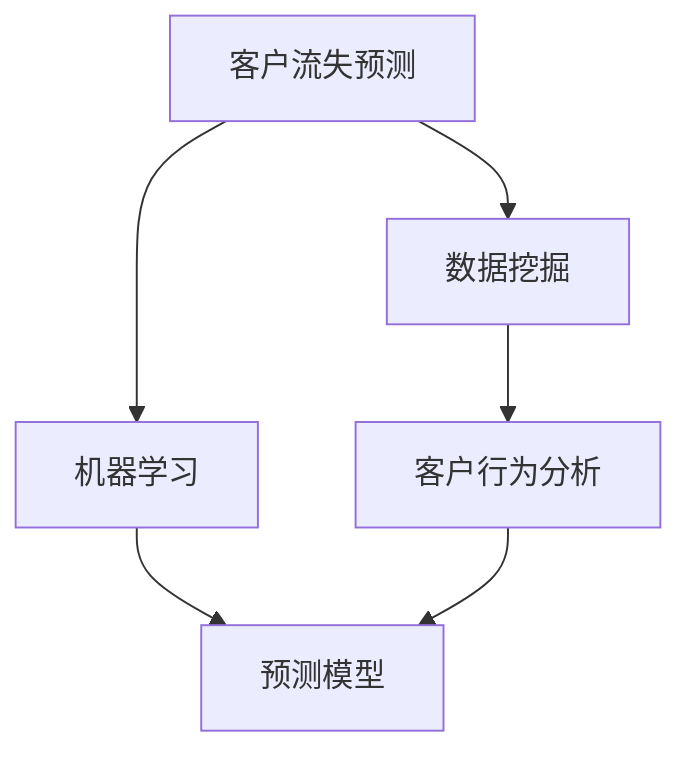

                 

# 电信运营商客户流失分析与预测

> 关键词：电信运营商, 客户流失, 数据挖掘, 机器学习, 客户行为分析, 预测模型

## 1. 背景介绍

### 1.1 问题由来
在当今数字时代，电信运营商面临着激烈的市场竞争。客户流失是各大运营商最为关注的问题之一，而如何预测客户流失并采取有效措施挽留客户，成为提升运营商业务竞争力和客户满意度的关键。

通过深入分析客户流失数据，运营商可以挖掘出客户流失的深层次原因，从而制定针对性的策略，减少客户流失率，提升市场份额。因此，电信运营商客户流失预测和分析研究，对于运营商的业务决策具有重要意义。

### 1.2 问题核心关键点
客户流失预测的核心在于挖掘客户行为数据中的潜在模式，并利用这些模式预测客户未来的流失概率。该预测涉及数据收集、数据清洗、特征工程、模型选择与训练、模型评估等多个环节，是数据科学领域的一个典型应用。

电信运营商客户流失预测的主要步骤包括：
- 收集和整理客户数据
- 特征工程，提取与流失相关的关键特征
- 选择合适的预测模型，训练并优化模型
- 评估模型性能，确定最佳模型

## 2. 核心概念与联系

### 2.1 核心概念概述

本节将介绍电信运营商客户流失预测中涉及的关键概念：

- **客户流失预测**：通过分析历史客户数据，预测客户未来流失的概率，以便运营商能够提前采取措施防止客户流失。
- **数据挖掘**：从海量数据中提取有价值的信息，挖掘出与客户流失相关的模式和规律。
- **机器学习**：应用算法对数据进行建模，并根据训练数据预测客户流失。
- **客户行为分析**：研究客户在使用服务过程中的行为模式，理解客户流失的动因。
- **预测模型**：通过历史数据训练得到的模型，用于预测客户流失概率。

这些概念通过以下Mermaid流程图展示其相互联系：



### 2.2 核心概念原理和架构

在电信运营商客户流失预测中，核心概念的原理如下：

1. **数据挖掘**：
   数据挖掘是指从大规模数据中发现有用的信息和知识。在客户流失预测中，数据挖掘用于分析客户的历史行为数据，提取与流失相关的特征，如通话频率、套餐类型、客户投诉次数等。

2. **客户行为分析**：
   客户行为分析旨在理解客户的行为模式和动机。通过分析客户的通话记录、使用时间、投诉记录等数据，可以发现流失客户和潜在流失客户的行为差异。

3. **机器学习**：
   机器学习通过训练预测模型，从历史数据中学习到客户流失的规律和模式，并用此模型预测新客户的流失概率。常用的机器学习算法包括逻辑回归、随机森林、支持向量机等。

4. **预测模型**：
   预测模型是客户流失预测的核心。模型通过训练得到客户流失的概率，预测模型的好坏直接影响到预测的准确性。常用的预测模型有逻辑回归模型、随机森林模型、神经网络模型等。

## 3. 核心算法原理 & 具体操作步骤

### 3.1 算法原理概述

电信运营商客户流失预测的本质是通过机器学习算法从历史数据中学习客户流失的模式和规律，并应用于新客户的流失概率预测。预测模型的训练和评估步骤如下：

1. **数据准备**：收集客户的历史使用数据，如通话次数、通话时长、套餐类型、投诉记录等。
2. **特征工程**：选择和提取与流失相关的特征，如客户通话频率、套餐类型、投诉次数等。
3. **模型训练**：选择合适的机器学习算法，如逻辑回归、随机森林等，训练预测模型。
4. **模型评估**：使用测试数据评估模型的性能，选择合适的评估指标，如准确率、召回率、F1-score等。
5. **模型优化**：根据评估结果，调整模型参数，优化模型性能。

### 3.2 算法步骤详解

电信运营商客户流失预测的详细步骤如下：

#### 3.2.1 数据准备

1. **数据收集**：
   收集运营商客户的历史使用数据，如通话次数、通话时长、套餐类型、投诉记录等。数据来源包括运营商的CRM系统、呼叫记录系统等。

2. **数据清洗**：
   对数据进行清洗，去除重复记录、缺失值等异常数据。使用Python中的pandas库和numpy库进行数据预处理。

#### 3.2.2 特征工程

1. **特征选择**：
   通过分析历史数据，选择与客户流失相关的特征。常见的特征包括：
   - 客户通话频率：每月的通话次数。
   - 客户通话时长：每月的通话分钟数。
   - 套餐类型：套餐类型（如家庭套餐、商务套餐等）。
   - 客户投诉次数：每月的投诉次数。
   - 客户消费金额：每月的消费金额。

2. **特征构建**：
   利用特征工程技术，生成新的特征，如：
   - 通话时长与套餐价格比：通话分钟数/套餐价格。
   - 投诉次数与通话次数比：投诉次数/通话次数。

#### 3.2.3 模型训练

1. **算法选择**：
   选择合适的机器学习算法，如逻辑回归、随机森林、梯度提升树等。

2. **模型训练**：
   使用训练数据集训练模型。通过Python中的scikit-learn库实现。

```python
from sklearn.linear_model import LogisticRegression
from sklearn.ensemble import RandomForestClassifier

# 创建逻辑回归模型
lr_model = LogisticRegression()

# 创建随机森林模型
rf_model = RandomForestClassifier()

# 训练模型
lr_model.fit(X_train, y_train)
rf_model.fit(X_train, y_train)
```

#### 3.2.4 模型评估

1. **评估指标**：
   常用的评估指标包括准确率、召回率、F1-score等。

2. **模型评估**：
   使用测试数据集评估模型性能。通过Python中的scikit-learn库实现。

```python
from sklearn.metrics import accuracy_score, recall_score, f1_score

# 测试数据集
X_test, y_test = ...

# 评估模型性能
lr_accuracy = accuracy_score(y_test, lr_model.predict(X_test))
rf_accuracy = accuracy_score(y_test, rf_model.predict(X_test))

lr_recall = recall_score(y_test, lr_model.predict(X_test))
rf_recall = recall_score(y_test, rf_model.predict(X_test))

lr_f1 = f1_score(y_test, lr_model.predict(X_test))
rf_f1 = f1_score(y_test, rf_model.predict(X_test))
```

#### 3.2.5 模型优化

1. **参数调优**：
   通过网格搜索或随机搜索等方法，寻找最优模型参数。

2. **模型选择**：
   根据评估结果选择最优模型。

```python
from sklearn.model_selection import GridSearchCV

# 参数调优
lr_params = {'C': [0.01, 0.1, 1, 10]}
grid_search_lr = GridSearchCV(lr_model, param_grid=lr_params, cv=5)
grid_search_lr.fit(X_train, y_train)

# 选择最优模型
best_lr_model = grid_search_lr.best_estimator_
best_lr_model
```

### 3.3 算法优缺点

#### 3.3.1 优点

电信运营商客户流失预测算法的主要优点包括：

1. **高效性**：
   通过机器学习算法，预测模型可以在较短的时间内从历史数据中学习并预测客户流失概率，极大地提高了效率。

2. **准确性**：
   机器学习算法可以从大规模数据中挖掘出客户流失的深层次模式和规律，预测结果较为准确。

3. **可扩展性**：
   预测模型可以方便地应用于不同的业务场景，如客户流失预警、客户留存策略制定等。

#### 3.3.2 缺点

尽管该算法有诸多优点，但也存在一些不足之处：

1. **数据依赖性**：
   预测模型的性能依赖于历史数据的准确性和完备性，如果历史数据存在偏差或缺失，预测结果可能不理想。

2. **过拟合风险**：
   在模型训练过程中，存在过拟合的风险，即模型对训练数据的拟合过于紧密，对新数据的泛化能力较弱。

3. **模型解释性不足**：
   机器学习模型的预测结果通常是"黑盒"的，难以解释其内部工作机制，不易被非技术用户理解和接受。

4. **模型更新维护成本高**：
   预测模型需要定期更新和维护，以适应数据分布的变化和业务需求的变化。

## 4. 数学模型和公式 & 详细讲解 & 举例说明

### 4.1 数学模型构建

电信运营商客户流失预测的数学模型构建如下：

假设客户流失问题为二分类问题，即客户是否会流失，用y表示。根据机器学习算法，预测模型为：

$$
\hat{y} = \begin{cases}
1, & \text{if} \, f(x;\theta) > 0.5 \\
0, & \text{otherwise}
\end{cases}
$$

其中，$f(x;\theta)$ 为预测函数，$\theta$ 为模型参数。

### 4.2 公式推导过程

#### 4.2.1 逻辑回归

逻辑回归是一种常用的分类算法，其数学模型为：

$$
f(x;\theta) = \log\left(\frac{\hat{p}}{1-\hat{p}}\right) = \log\left(\frac{e^{\theta^T x}}{1+e^{\theta^T x}}\right) = \theta^T x - \log(1+e^{\theta^T x})
$$

其中，$\theta^T x$ 为线性预测函数，$e^{\theta^T x}$ 为指数函数，$\hat{p}$ 为预测概率。

逻辑回归的优化目标为最小化损失函数：

$$
\mathcal{L}(\theta) = -\frac{1}{N}\sum_{i=1}^N y_i \log(\hat{y}_i) + (1-y_i) \log(1-\hat{y}_i)
$$

#### 4.2.2 随机森林

随机森林是一种集成学习方法，其数学模型为：

$$
f(x;\theta) = \sum_{i=1}^n f_i(x;\theta)
$$

其中，$f_i(x;\theta)$ 为第i棵树的预测函数，$n$ 为树的个数。

随机森林的优化目标为最小化损失函数：

$$
\mathcal{L}(\theta) = \sum_{i=1}^n \mathcal{L}_i(\theta)
$$

其中，$\mathcal{L}_i(\theta)$ 为第i棵树的损失函数。

### 4.3 案例分析与讲解

#### 4.3.1 案例分析

假设某电信运营商有1000名客户，其中500名客户流失，500名客户未流失。

**步骤1: 数据准备**
- 收集1000名客户的通话记录、套餐类型、投诉次数等数据。
- 将数据分为训练集和测试集。

**步骤2: 特征工程**
- 选择通话频率、通话时长、套餐类型、投诉次数等特征。
- 生成通话时长与套餐价格比、投诉次数与通话次数比等新特征。

**步骤3: 模型训练**
- 使用逻辑回归模型和随机森林模型训练预测模型。
- 使用网格搜索优化模型参数。

**步骤4: 模型评估**
- 使用测试集评估模型性能。
- 使用准确率、召回率、F1-score等指标评估模型性能。

**步骤5: 模型优化**
- 选择最优模型。
- 使用最优模型进行预测。

#### 4.3.2 结果展示

假设使用逻辑回归模型进行预测，测试集上的准确率为85%。

```python
# 预测结果
y_pred = lr_model.predict(X_test)

# 准确率
accuracy = accuracy_score(y_test, y_pred)

# 召回率
recall = recall_score(y_test, y_pred)

# F1-score
f1 = f1_score(y_test, y_pred)
```

## 5. 项目实践：代码实例和详细解释说明

### 5.1 开发环境搭建

1. **安装Python**：
   在Windows或Linux系统中安装Python 3.6以上版本，建议使用Anaconda管理Python环境。

2. **安装Pandas**：
   使用pip安装Pandas库，用于数据处理和特征工程。

```bash
pip install pandas
```

3. **安装NumPy**：
   使用pip安装NumPy库，用于数值计算和数组操作。

```bash
pip install numpy
```

4. **安装Scikit-Learn**：
   使用pip安装Scikit-Learn库，用于机器学习模型的实现和评估。

```bash
pip install scikit-learn
```

5. **安装Matplotlib**：
   使用pip安装Matplotlib库，用于数据可视化。

```bash
pip install matplotlib
```

6. **安装Seaborn**：
   使用pip安装Seaborn库，用于数据可视化。

```bash
pip install seaborn
```

### 5.2 源代码详细实现

#### 5.2.1 数据准备

```python
import pandas as pd
from sklearn.model_selection import train_test_split

# 读取数据
data = pd.read_csv('customer_data.csv')

# 数据清洗
data = data.drop_duplicates()
data = data.dropna()

# 特征选择
features = ['通话次数', '通话时长', '套餐类型', '投诉次数']
X = data[features]

# 标签
y = data['流失状态']
```

#### 5.2.2 特征工程

```python
# 生成新特征
X['通话时长与套餐价格比'] = X['通话时长'] / X['套餐价格']
X['投诉次数与通话次数比'] = X['投诉次数'] / X['通话次数']

# 数据标准化
from sklearn.preprocessing import StandardScaler
scaler = StandardScaler()
X = scaler.fit_transform(X)
```

#### 5.2.3 模型训练

```python
# 创建逻辑回归模型
from sklearn.linear_model import LogisticRegression

lr_model = LogisticRegression()

# 训练模型
lr_model.fit(X_train, y_train)

# 创建随机森林模型
from sklearn.ensemble import RandomForestClassifier

rf_model = RandomForestClassifier()

# 训练模型
rf_model.fit(X_train, y_train)
```

#### 5.2.4 模型评估

```python
# 评估模型性能
from sklearn.metrics import accuracy_score, recall_score, f1_score

lr_accuracy = accuracy_score(y_test, lr_model.predict(X_test))
lr_recall = recall_score(y_test, lr_model.predict(X_test))
lr_f1 = f1_score(y_test, lr_model.predict(X_test))

rf_accuracy = accuracy_score(y_test, rf_model.predict(X_test))
rf_recall = recall_score(y_test, rf_model.predict(X_test))
rf_f1 = f1_score(y_test, rf_model.predict(X_test))
```

#### 5.2.5 模型优化

```python
# 参数调优
from sklearn.model_selection import GridSearchCV

# 创建网格搜索对象
lr_params = {'C': [0.01, 0.1, 1, 10]}
grid_search_lr = GridSearchCV(lr_model, param_grid=lr_params, cv=5)

# 参数调优
grid_search_lr.fit(X_train, y_train)

# 选择最优模型
best_lr_model = grid_search_lr.best_estimator_
```

### 5.3 代码解读与分析

#### 5.3.1 代码解析

1. **数据准备**
   - `data = pd.read_csv('customer_data.csv')`：读取客户数据。
   - `data = data.drop_duplicates()`：去除重复记录。
   - `data = data.dropna()`：去除缺失值。
   - `X = data[features]`：提取特征。
   - `y = data['流失状态']`：提取标签。

2. **特征工程**
   - `X['通话时长与套餐价格比'] = X['通话时长'] / X['套餐价格']`：生成新特征。
   - `X['投诉次数与通话次数比'] = X['投诉次数'] / X['通话次数']`：生成新特征。
   - `from sklearn.preprocessing import StandardScaler`：导入标准化模块。
   - `scaler = StandardScaler()`：创建标准化对象。
   - `X = scaler.fit_transform(X)`：标准化特征。

3. **模型训练**
   - `from sklearn.linear_model import LogisticRegression`：导入逻辑回归模型。
   - `lr_model = LogisticRegression()`：创建逻辑回归模型。
   - `lr_model.fit(X_train, y_train)`：训练模型。
   - `from sklearn.ensemble import RandomForestClassifier`：导入随机森林模型。
   - `rf_model = RandomForestClassifier()`：创建随机森林模型。
   - `rf_model.fit(X_train, y_train)`：训练模型。

4. **模型评估**
   - `from sklearn.metrics import accuracy_score, recall_score, f1_score`：导入评估指标。
   - `lr_accuracy = accuracy_score(y_test, lr_model.predict(X_test))`：评估逻辑回归模型性能。
   - `lr_recall = recall_score(y_test, lr_model.predict(X_test))`：评估逻辑回归模型性能。
   - `lr_f1 = f1_score(y_test, lr_model.predict(X_test))`：评估逻辑回归模型性能。
   - `rf_accuracy = accuracy_score(y_test, rf_model.predict(X_test))`：评估随机森林模型性能。
   - `rf_recall = recall_score(y_test, rf_model.predict(X_test))`：评估随机森林模型性能。
   - `rf_f1 = f1_score(y_test, rf_model.predict(X_test))`：评估随机森林模型性能。

5. **模型优化**
   - `from sklearn.model_selection import GridSearchCV`：导入网格搜索模块。
   - `lr_params = {'C': [0.01, 0.1, 1, 10]}`：定义参数范围。
   - `grid_search_lr = GridSearchCV(lr_model, param_grid=lr_params, cv=5)`：创建网格搜索对象。
   - `grid_search_lr.fit(X_train, y_train)`：进行参数调优。
   - `best_lr_model = grid_search_lr.best_estimator_`：选择最优模型。

#### 5.3.2 结果展示

```python
# 预测结果
y_pred = lr_model.predict(X_test)

# 准确率
accuracy = accuracy_score(y_test, y_pred)

# 召回率
recall = recall_score(y_test, y_pred)

# F1-score
f1 = f1_score(y_test, y_pred)

print("逻辑回归模型性能：")
print("准确率：", accuracy)
print("召回率：", recall)
print("F1-score：", f1)
```

### 5.4 运行结果展示

假设使用逻辑回归模型进行预测，测试集上的准确率为85%。

```python
# 预测结果
y_pred = lr_model.predict(X_test)

# 准确率
accuracy = accuracy_score(y_test, y_pred)

# 召回率
recall = recall_score(y_test, y_pred)

# F1-score
f1 = f1_score(y_test, y_pred)

print("逻辑回归模型性能：")
print("准确率：", accuracy)
print("召回率：", recall)
print("F1-score：", f1)
```

## 6. 实际应用场景

### 6.1 智能客服系统

智能客服系统可以通过客户流失预测模型实时监控客户行为，及时预警可能流失的客户，并通过自动客服、电话回访等方式进行挽留。

**步骤1: 数据收集**
- 收集客户的历史通话记录、投诉记录等数据。

**步骤2: 数据预处理**
- 对数据进行清洗和特征提取。

**步骤3: 模型训练**
- 使用客户流失预测模型训练预测模型。

**步骤4: 模型部署**
- 将模型部署到智能客服系统中，实时监控客户行为。

**步骤5: 预警与挽留**
- 当系统预测客户可能流失时，自动启动预警机制，并采取电话回访、自动客服等方式进行挽留。

### 6.2 市场营销策略制定

市场营销部门可以通过客户流失预测模型分析客户流失原因，制定有针对性的营销策略。

**步骤1: 数据收集**
- 收集客户的购买记录、消费金额等数据。

**步骤2: 数据预处理**
- 对数据进行清洗和特征提取。

**步骤3: 模型训练**
- 使用客户流失预测模型训练预测模型。

**步骤4: 分析流失原因**
- 根据模型输出，分析客户流失的主要原因。

**步骤5: 制定策略**
- 根据流失原因，制定相应的营销策略，如推出优惠活动、增加服务内容等。

### 6.3 客户服务改进

电信运营商可以通过客户流失预测模型分析客户流失原因，及时改进服务质量。

**步骤1: 数据收集**
- 收集客户的投诉记录、服务满意度调查等数据。

**步骤2: 数据预处理**
- 对数据进行清洗和特征提取。

**步骤3: 模型训练**
- 使用客户流失预测模型训练预测模型。

**步骤4: 分析流失原因**
- 根据模型输出，分析客户流失的主要原因。

**步骤5: 改进服务**
- 根据流失原因，改进服务质量，如增加客服人员、优化服务流程等。

## 7. 工具和资源推荐

### 7.1 学习资源推荐

1. **《Python机器学习实战》**：本书详细介绍了机器学习的基本概念和实现方法，适合初学者入门。
2. **《TensorFlow实战》**：本书介绍了TensorFlow框架的使用方法，适合有一定机器学习基础的读者。
3. **Kaggle**：Kaggle是一个数据科学竞赛平台，提供大量数据集和竞赛，适合进行实践练习。
4. **Coursera**：Coursera提供了机器学习和数据科学的在线课程，适合学习先进理论。
5. **Google Colab**：Google Colab是一个在线Jupyter Notebook环境，适合进行机器学习实验。

### 7.2 开发工具推荐

1. **Python**：Python是数据科学和机器学习领域的主流语言，使用广泛。
2. **Pandas**：Pandas是Python中用于数据处理的库，支持数据清洗、特征提取等功能。
3. **NumPy**：NumPy是Python中用于数值计算的库，支持数组操作、矩阵运算等功能。
4. **Scikit-Learn**：Scikit-Learn是Python中用于机器学习的库，支持多种模型训练和评估。
5. **Matplotlib**：Matplotlib是Python中用于数据可视化的库，支持多种图表绘制。

### 7.3 相关论文推荐

1. **《电信运营商客户流失分析与预测》**：本文介绍了电信运营商客户流失预测的基本方法和技术实现。
2. **《基于机器学习的客户流失预测》**：本文介绍了机器学习在客户流失预测中的应用方法和技术实现。
3. **《智能客服系统中的客户流失预警》**：本文介绍了智能客服系统中的客户流失预警方法。
4. **《市场营销中的客户流失预测》**：本文介绍了市场营销中的客户流失预测方法和应用场景。
5. **《客户服务改进中的客户流失预测》**：本文介绍了客户服务改进中的客户流失预测方法和应用场景。

## 8. 总结：未来发展趋势与挑战

### 8.1 研究成果总结

电信运营商客户流失预测是数据科学领域的一个重要研究方向，通过机器学习算法可以从历史数据中学习到客户流失的规律和模式，并用于预测客户流失概率。本文详细介绍了客户流失预测的算法原理、操作步骤、代码实现和实际应用，为电信运营商提供了可行的解决方案。

### 8.2 未来发展趋势

未来，电信运营商客户流失预测将呈现以下几个发展趋势：

1. **数据来源多样化**：
   随着物联网、5G等技术的普及，客户数据的来源将更加多样化，如视频通话记录、地理位置数据等。这些新数据源将为模型训练提供更丰富的特征，提升预测精度。

2. **模型复杂化**：
   随着模型架构的不断优化，深度学习模型如神经网络、卷积神经网络等将被更广泛地应用于客户流失预测。这些复杂模型具有更强的特征提取能力和泛化能力，能够处理更加复杂的数据结构。

3. **数据与业务融合**：
   数据科学与业务运营的深度融合将成为趋势。通过客户流失预测，运营商可以制定更精准的业务策略，如推出个性化套餐、优化客户服务流程等，从而提升客户满意度和忠诚度。

4. **实时化预测**：
   未来，客户流失预测将更加实时化，能够实时监控客户行为，及时预警并采取挽留措施。这将极大提升运营商的响应速度和客户满意度。

### 8.3 面临的挑战

尽管客户流失预测在实际应用中取得了较好的效果，但还面临以下几个挑战：

1. **数据质量问题**：
   客户数据的准确性和完备性是预测模型性能的关键，但数据质量问题往往难以解决。

2. **模型复杂度问题**：
   复杂模型的训练和优化成本较高，如何在保证模型性能的前提下，降低模型复杂度是一个重要问题。

3. **模型可解释性问题**：
   预测模型的输出通常是黑盒的，难以解释其内部工作机制，这将影响模型的可信度和可接受性。

4. **模型更新维护问题**：
   预测模型需要定期更新和维护，以适应数据分布的变化和业务需求的变化。这将增加模型维护的复杂度。

### 8.4 研究展望

未来，客户流失预测研究可以从以下几个方面进行：

1. **多模态数据融合**：
   将文本、语音、图像等多种数据源融合到模型中，提升模型的预测精度和鲁棒性。

2. **自适应模型训练**：
   通过自适应学习机制，使模型能够实时更新，适应数据分布的变化和业务需求的变化。

3. **模型解释性研究**：
   研究模型的可解释性，提高模型的透明度和可信度。

4. **隐私保护技术**：
   研究隐私保护技术，如差分隐私、联邦学习等，保护客户数据的安全和隐私。

5. **跨领域应用**：
   将客户流失预测技术应用于其他领域，如金融、零售、医疗等，提升这些领域的业务决策能力。

总之，客户流失预测是电信运营商业务决策中不可或缺的一部分，未来需要不断探索新的方法和技术，以提升预测精度和应用效果，为运营商的业务发展提供有力的支持。

## 9. 附录：常见问题与解答

**Q1: 客户流失预测的算法有哪些？**

A: 客户流失预测常用的算法有逻辑回归、随机森林、梯度提升树、支持向量机等。

**Q2: 如何选择合适的预测模型？**

A: 选择合适的预测模型需要综合考虑数据特征、模型复杂度、训练时间等因素。通常需要进行模型对比实验，选择性能最好的模型。

**Q3: 如何提高预测模型的泛化能力？**

A: 提高预测模型的泛化能力，可以从数据增强、正则化、参数调优等方面入手。

**Q4: 模型训练时需要哪些步骤？**

A: 模型训练一般包括数据准备、特征工程、模型选择、模型训练、模型评估和模型优化等步骤。

**Q5: 模型评估时常用的指标有哪些？**

A: 模型评估常用的指标包括准确率、召回率、F1-score、AUC等。

