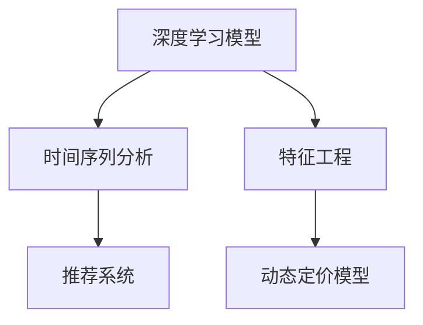

                 

# 电商价格优化的智能技术

## 1. 背景介绍

### 1.1 问题由来

在电商领域，价格优化是提升销售收入、优化客户体验的重要环节。传统的价格优化方法多基于线性回归、动态定价模型等，依赖于对历史数据的深入分析，难以实时响应市场变化，且容易受到价格敏感度数据质量的影响。随着人工智能和大数据技术的不断发展，基于深度学习的价格优化技术应运而生，成为电商行业智能化转型的新热点。

### 1.2 问题核心关键点

电商价格优化旨在通过机器学习模型，对商品价格进行动态调整，以最大化销售收入和客户满意度。具体而言，价格优化算法需要根据商品的历史销售数据、市场趋势、竞争对手价格、用户行为数据等因素，预测不同价格下的销量，并据此制定最优价格策略。

关键点包括：
1. 数据收集与清洗：收集商品的历史销售数据、市场趋势数据、用户行为数据等。
2. 模型训练与调参：训练深度学习模型，如神经网络、梯度提升树等，调整模型超参数，使其能够准确预测销量。
3. 价格策略制定：根据模型预测结果，制定不同场景下的价格策略，如折扣、促销等。
4. 实时价格调整：将价格策略应用到电商平台上，实时调整商品价格。
5. 性能评估与优化：对价格策略的效果进行评估，不断优化模型和策略。

## 2. 核心概念与联系

### 2.1 核心概念概述

电商价格优化涉及多个核心概念，包括：

- **深度学习模型**：如神经网络、梯度提升树等，用于对销售数据进行建模和预测。
- **时间序列分析**：用于分析商品销量随时间变化的规律。
- **特征工程**：包括商品属性、用户特征、市场趋势等，提取和构造对销量预测有用的特征。
- **推荐系统**：结合用户行为数据，对商品进行个性化推荐，提升用户体验和转化率。
- **动态定价模型**：结合竞争对手价格和市场供需变化，实时调整商品价格，优化销售收入。

这些概念之间的逻辑关系可以通过以下Mermaid流程图来展示：



这个流程图展示了电商价格优化的核心概念及其相互关系：

1. 深度学习模型和特征工程是预测销量的基础，时间序列分析帮助理解销量随时间的变化规律。
2. 推荐系统结合用户行为数据，提升商品推荐效果，增加用户粘性。
3. 动态定价模型实时调整商品价格，优化销售收入。

## 3. 核心算法原理 & 具体操作步骤

### 3.1 算法原理概述

电商价格优化主要基于时间序列分析和深度学习模型进行。具体来说，通过收集商品的历史销售数据、市场趋势数据、用户行为数据等，构建时间序列模型，预测商品在不同价格下的销量。根据预测结果，结合竞争对手价格和市场供需变化，实时调整商品价格，以最大化销售收入。

### 3.2 算法步骤详解

电商价格优化的算法步骤如下：

**Step 1: 数据收集与清洗**

- 收集商品的历史销售数据、市场趋势数据、用户行为数据等。
- 清洗数据，去除异常值、缺失值，标准化数据格式。

**Step 2: 特征工程**

- 提取商品的分类属性、大小、颜色等基础属性特征。
- 构造用户特征，如历史购买记录、浏览记录、购物车添加行为等。
- 考虑市场趋势，如节假日、促销活动、季节变化等时间特征。

**Step 3: 模型训练与调参**

- 选择合适的深度学习模型，如LSTM、GRU、CNN等。
- 将数据集分为训练集、验证集和测试集，划分为训练和测试阶段。
- 训练模型，调整超参数，如学习率、批量大小、迭代轮数等。
- 使用验证集评估模型性能，根据性能指标调整模型参数。

**Step 4: 价格策略制定**

- 使用训练好的模型预测不同价格下的销量。
- 结合竞争对手价格和市场供需变化，制定价格策略。
- 考虑促销、折扣、季节性折扣等特殊情况，优化价格策略。

**Step 5: 实时价格调整**

- 根据价格策略实时调整商品价格。
- 对价格调整效果进行实时监测，评估模型效果。
- 根据监测结果，不断优化价格策略和模型参数。

### 3.3 算法优缺点

电商价格优化的主要优点包括：

1. **实时响应市场变化**：深度学习模型可以实时处理大量数据，快速响应市场变化，动态调整价格。
2. **精准预测销量**：基于时间序列分析和深度学习，模型可以精确预测不同价格下的销量，指导价格优化。
3. **优化用户体验**：结合用户行为数据，推荐系统能够提升个性化推荐效果，增加用户粘性。
4. **提升销售收入**：动态定价模型根据市场供需变化，实时调整价格，最大化销售收入。

同时，该方法也存在一些局限性：

1. **数据质量依赖度高**：模型预测的准确性依赖于数据质量，历史数据缺失或不准确会影响模型效果。
2. **模型复杂度高**：深度学习模型参数多，训练复杂，需要大量的计算资源和时间。
3. **市场变化快速**：市场变化快，模型需要频繁更新，增加了维护成本。
4. **用户行为难以预测**：用户行为受多种因素影响，难以全面预测。
5. **价格敏感度难以估计**：不同用户对价格敏感度不同，难以准确估计。

尽管存在这些局限性，电商价格优化技术仍然是目前提升销售和客户体验的有效手段。未来需要进一步优化模型和算法，提高数据处理能力和市场反应速度。

### 3.4 算法应用领域

电商价格优化技术主要应用于以下领域：

1. **个性化推荐系统**：通过深度学习模型和推荐系统，对用户进行个性化推荐，提升用户体验和转化率。
2. **动态定价模型**：结合市场趋势和竞争对手价格，实时调整商品价格，优化销售收入。
3. **库存管理**：通过预测销量和实时价格调整，优化库存水平，避免库存积压和缺货现象。
4. **市场分析与趋势预测**：分析市场趋势和用户行为数据，预测未来市场变化，指导电商运营决策。
5. **用户反馈与行为分析**：收集用户反馈和行为数据，优化推荐系统和价格策略，提升用户满意度。

## 4. 数学模型和公式 & 详细讲解 & 举例说明

### 4.1 数学模型构建

电商价格优化的数学模型主要基于时间序列分析和深度学习模型。假设商品的历史销售数据为 $y_t$，其中 $t$ 表示时间。模型目标为预测未来时间 $t+1$ 的销量 $y_{t+1}$。

常见的数学模型包括：

1. **线性回归模型**：
$$
y_{t+1} = \beta_0 + \beta_1 x_t + \epsilon_t
$$
其中 $x_t$ 为时间序列特征，$\epsilon_t$ 为随机误差。

2. **LSTM模型**：
$$
h_t = \tanh(\text{LSTM}(h_{t-1}, x_t))
$$
$$
y_{t+1} = \text{softmax}(W h_t + b)
$$
其中 $h_t$ 为LSTM隐藏状态，$W$ 为输出权重矩阵。

3. **时间序列分解模型**：
$$
y_t = y_{t-1} + \Delta y_t
$$
$$
\Delta y_t = \alpha x_t + \beta
$$
其中 $\Delta y_t$ 为销售变化量，$\alpha$ 和 $\beta$ 为模型参数。

### 4.2 公式推导过程

以LSTM模型为例，推导其预测销量公式。假设 $x_t$ 为时间 $t$ 的特征向量，$h_t$ 为LSTM隐藏状态，$y_{t+1}$ 为时间 $t+1$ 的预测销量。

**Step 1: 初始化LSTM隐藏状态**

$$
h_0 = \text{zeros}(D)
$$

**Step 2: 前向传播计算**

$$
h_t = \tanh(W_i h_{t-1} + b_i x_t)
$$
$$
i_t = \text{sigmoid}(W_f h_{t-1} + b_f x_t)
$$
$$
f_t = \text{sigmoid}(W_c h_{t-1} + b_c x_t)
$$
$$
o_t = \text{sigmoid}(W_o h_{t-1} + b_o x_t)
$$
$$
c_t = f_t \cdot c_{t-1} + i_t \cdot \tanh(h_t)
$$
$$
h_t = o_t \cdot \tanh(c_t)
$$

**Step 3: 输出计算**

$$
y_{t+1} = \text{softmax}(W h_t + b)
$$

其中 $W$ 为输出权重矩阵，$b$ 为偏置向量。

### 4.3 案例分析与讲解

假设有一家电商平台的服装商品，收集了过去1年的销售数据。通过数据清洗和特征工程，构建了以下LSTM模型：

**Step 1: 数据预处理**

- 将销售数据标准化，使用Z-score标准化。
- 构造特征向量 $x_t = [\text{day of week}, \text{season}, \text{holiday}, \text{promotion}]$。

**Step 2: 模型训练**

- 使用历史数据 $y_{1..12}$ 训练LSTM模型。
- 设定模型参数 $\beta_1, \beta_2, \beta_3, \ldots$，进行梯度下降训练。

**Step 3: 价格策略制定**

- 使用训练好的模型预测下个月（$t+1$）的销量 $y_{13}$。
- 结合竞争对手价格和市场供需变化，制定价格策略。

**Step 4: 实时价格调整**

- 根据价格策略实时调整商品价格。
- 实时监测价格调整效果，评估模型性能。

## 5. 项目实践：代码实例和详细解释说明

### 5.1 开发环境搭建

在进行电商价格优化的项目实践前，我们需要准备好开发环境。以下是使用Python进行TensorFlow开发的环境配置流程：

1. 安装Anaconda：从官网下载并安装Anaconda，用于创建独立的Python环境。

2. 创建并激活虚拟环境：
```bash
conda create -n tf-env python=3.8 
conda activate tf-env
```

3. 安装TensorFlow：根据CUDA版本，从官网获取对应的安装命令。例如：
```bash
conda install tensorflow -c conda-forge
```

4. 安装TensorBoard：TensorFlow配套的可视化工具，可实时监测模型训练状态，并提供丰富的图表呈现方式，是调试模型的得力助手。
```bash
pip install tensorboard
```

5. 安装PyTorch：尽管TensorFlow在电商价格优化项目中较为常用，但PyTorch也在越来越多地被用于深度学习模型的开发和训练。
```bash
pip install torch
```

6. 安装Pandas、Numpy等常用数据处理库：
```bash
pip install pandas numpy scikit-learn matplotlib
```

完成上述步骤后，即可在`tf-env`环境中开始项目实践。

### 5.2 源代码详细实现

下面我们以LSTM模型为例，给出使用TensorFlow对电商价格优化进行建模的代码实现。

首先，定义时间序列数据的输入输出：

```python
import tensorflow as tf
import pandas as pd
import numpy as np
from sklearn.preprocessing import MinMaxScaler

# 读取数据
data = pd.read_csv('sales_data.csv')

# 标准化数据
scaler = MinMaxScaler(feature_range=(0, 1))
scaled_data = scaler.fit_transform(data)

# 构造特征向量
def create_dataset(dataset, look_back=1):
    X, y = [], []
    for i in range(len(dataset)-look_back-1):
        a = dataset[i:(i+look_back), 0]
        b = dataset[i + look_back, 0]
        X.append(a)
        y.append(b)
    return np.array(X), np.array(y)

look_back = 1
X, y = create_dataset(scaled_data, look_back)

# 将数据划分为训练集和测试集
train_size = int(len(X) * 0.8)
test_size = len(X) - train_size
train_X, test_X = X[0:train_size,:], X[train_size:len(X),:]
train_y, test_y = y[0:train_size], y[train_size:len(y)]
```

然后，定义LSTM模型和优化器：

```python
model = tf.keras.models.Sequential()
model.add(tf.keras.layers.LSTM(4, input_shape=(look_back, 1), return_sequences=True))
model.add(tf.keras.layers.Dropout(0.2))
model.add(tf.keras.layers.LSTM(4))
model.add(tf.keras.layers.Dropout(0.2))
model.add(tf.keras.layers.Dense(1))

model.compile(loss='mean_squared_error', optimizer='adam')

# 训练模型
model.fit(train_X, train_y, epochs=100, batch_size=32, verbose=2)
```

最后，评估模型并应用到实际场景：

```python
# 评估模型
test_loss = model.evaluate(test_X, test_y, verbose=2)

# 使用模型进行价格预测
def forecast(model, test_X, look_back=1):
    X_test = []
    for i in range(len(test_X) - look_back - 1):
        a = test_X[i:(i+look_back), 0]
        X_test.append(a)
    X_test = np.array(X_test)
    X_test = reshape(X_test, (X_test.shape[0], X_test.shape[1], 1))
    y_pred = model.predict(X_test)
    y_pred = y_pred.flatten()
    return y_pred

forecast(model, test_X)
```

以上就是使用TensorFlow对LSTM模型进行电商价格优化的完整代码实现。可以看到，TensorFlow的Keras API使得模型的构建和训练变得非常简洁高效。

### 5.3 代码解读与分析

让我们再详细解读一下关键代码的实现细节：

**create_dataset函数**：
- 将时间序列数据划分为输入和输出，用于训练模型。

**LSTM模型定义**：
- 定义一个包含两个LSTM层和一个Dense层的模型，输出为销量预测值。
- 使用Dropout层避免过拟合，通过隐藏状态传递信息。

**模型编译与训练**：
- 使用Mean Squared Error损失函数，Adam优化器进行模型训练。
- 使用fit函数进行模型训练，迭代100个epoch，批量大小为32。

**价格预测**：
- 使用forecast函数对测试集进行价格预测。
- 将预测结果用于指导价格调整策略。

## 6. 实际应用场景

### 6.1 智能推荐系统

智能推荐系统是电商价格优化的重要应用场景之一。通过深度学习模型和推荐系统，平台可以更精准地预测用户购买意愿，实时调整商品价格，提升用户体验和销售收入。

在技术实现上，可以收集用户的历史浏览记录、购买记录、行为偏好等数据，构建用户画像。利用深度学习模型预测不同价格下的用户点击率，结合推荐系统生成个性化推荐，根据用户行为数据实时调整价格，提升推荐效果和转化率。

### 6.2 动态定价策略

动态定价策略也是电商价格优化的核心应用。通过实时监测市场变化，结合竞争对手价格和库存情况，调整商品价格，最大化销售收入。

在实现上，可以收集竞争对手的价格数据、库存水平、市场趋势等，构建动态定价模型。根据实时数据动态调整商品价格，使用梯度下降算法优化模型参数，实时监测价格调整效果，根据反馈数据不断优化定价策略。

### 6.3 库存管理优化

库存管理优化也是电商价格优化的重要方向。通过预测未来销量和市场供需变化，优化库存水平，减少缺货和积压现象，降低库存成本。

在技术实现上，可以结合库存数据和历史销售数据，构建预测模型。根据预测结果优化库存水平，实时调整补货策略，提升库存周转率和运营效率。

## 7. 工具和资源推荐

### 7.1 学习资源推荐

为了帮助开发者系统掌握电商价格优化的理论基础和实践技巧，这里推荐一些优质的学习资源：

1. **《深度学习》书籍**：Ian Goodfellow等人著，介绍了深度学习的基本原理和应用。
2. **TensorFlow官方文档**：TensorFlow的官方文档，提供了丰富的学习资源和代码示例。
3. **Kaggle竞赛**：Kaggle上有很多电商价格优化的竞赛项目，可以学习到实际应用的案例和算法。
4. **Coursera《机器学习》课程**：由斯坦福大学Andrew Ng教授主讲，系统介绍了机器学习的基本概念和算法。

通过对这些资源的学习实践，相信你一定能够快速掌握电商价格优化的精髓，并用于解决实际的电商问题。

### 7.2 开发工具推荐

高效的开发离不开优秀的工具支持。以下是几款用于电商价格优化开发的常用工具：

1. **TensorFlow**：由Google主导开发的开源深度学习框架，生产部署方便，适合大规模工程应用。
2. **Keras**：TensorFlow的高层API，使得模型构建和训练更加简洁高效。
3. **Jupyter Notebook**：免费的开源交互式编程环境，支持Python、R等多种编程语言。
4. **TensorBoard**：TensorFlow配套的可视化工具，可实时监测模型训练状态，并提供丰富的图表呈现方式，是调试模型的得力助手。

合理利用这些工具，可以显著提升电商价格优化的开发效率，加快创新迭代的步伐。

### 7.3 相关论文推荐

电商价格优化技术的发展源于学界的持续研究。以下是几篇奠基性的相关论文，推荐阅读：

1. **《神经网络与深度学习》书籍**：Ian Goodfellow等人著，介绍了深度学习的基本原理和应用。
2. **《深度学习与自然语言处理》书籍**：Ian Goodfellow等人著，介绍了深度学习在自然语言处理中的应用。
3. **《深度学习中的时间序列预测》论文**：详细介绍了时间序列预测的深度学习模型和算法。
4. **《电商价格优化的研究》论文**：介绍了电商价格优化的基本方法和应用场景。

这些论文代表了大语言模型微调技术的发展脉络。通过学习这些前沿成果，可以帮助研究者把握学科前进方向，激发更多的创新灵感。

## 8. 总结：未来发展趋势与挑战

### 8.1 总结

本文对电商价格优化的智能技术进行了全面系统的介绍。首先阐述了电商价格优化的背景和意义，明确了价格优化在提升销售收入、优化客户体验方面的重要价值。其次，从原理到实践，详细讲解了电商价格优化的数学模型和关键步骤，给出了电商价格优化的完整代码实例。同时，本文还广泛探讨了价格优化方法在智能推荐系统、动态定价策略、库存管理优化等多个电商领域的应用前景，展示了价格优化技术的广泛应用。

通过本文的系统梳理，可以看到，电商价格优化的智能技术正在成为电商行业智能化转型的新引擎，极大地提升了销售和客户体验。未来，伴随深度学习和大数据技术的不断进步，基于深度学习的电商价格优化方法必将迎来更广阔的发展空间。

### 8.2 未来发展趋势

展望未来，电商价格优化的主要发展趋势包括：

1. **深度学习与业务融合更紧密**：深度学习模型将更深入地应用于业务决策和运营优化，提升电商运营效率。
2. **实时数据处理能力提升**：实时数据处理和分析能力将不断提升，支持更快速的价格调整和业务决策。
3. **个性化推荐系统优化**：通过深度学习模型和推荐系统，提升个性化推荐效果，增加用户粘性。
4. **动态定价模型精细化**：结合市场趋势和用户行为数据，构建更精细化的动态定价模型。
5. **多模态数据融合**：结合图像、视频、语音等多模态数据，提升价格预测和推荐系统的能力。

这些趋势凸显了电商价格优化技术的广阔前景。这些方向的探索发展，必将进一步提升电商系统的性能和应用范围，为电商平台带来更大的商业价值。

### 8.3 面临的挑战

尽管电商价格优化技术已经取得了一定的成功，但在迈向更加智能化、普适化应用的过程中，它仍面临着诸多挑战：

1. **数据质量问题**：电商数据通常具有高维度、噪声大和时序性等特点，数据质量难以保证。
2. **模型复杂性高**：深度学习模型参数多，训练复杂，需要大量的计算资源和时间。
3. **业务场景复杂**：电商运营涉及多个环节，如库存管理、供应链优化等，需综合考虑多种因素。
4. **用户行为多样**：用户行为受多种因素影响，难以全面预测。
5. **市场变化快速**：市场变化快，模型需要频繁更新，增加了维护成本。

尽管存在这些挑战，电商价格优化技术仍然是目前提升销售和客户体验的有效手段。未来需要进一步优化模型和算法，提高数据处理能力和市场反应速度。

### 8.4 研究展望

面对电商价格优化所面临的种种挑战，未来的研究需要在以下几个方面寻求新的突破：

1. **数据质量提升**：改进数据收集和清洗技术，提升数据质量。
2. **模型轻量化**：研究轻量级深度学习模型和算法，降低计算复杂度，提升实时响应能力。
3. **多模态融合**：结合图像、视频、语音等多模态数据，提升价格预测和推荐系统的能力。
4. **实时计算优化**：研究实时计算和存储技术，支持更快速的数据处理和模型训练。
5. **用户行为建模**：结合心理学、社会学等学科，构建更准确的预测模型，提升预测效果。

这些研究方向的探索，必将引领电商价格优化技术迈向更高的台阶，为电商平台带来更大的商业价值。相信随着学界和产业界的共同努力，这些挑战终将一一被克服，电商价格优化技术必将迎来更广阔的发展空间。

## 9. 附录：常见问题与解答

**Q1: 电商价格优化需要哪些关键数据？**

A: 电商价格优化需要以下关键数据：
1. **销售数据**：包括历史销售记录、销量、价格、折扣等。
2. **市场趋势数据**：包括节假日、促销活动、季节变化等。
3. **用户行为数据**：包括浏览记录、购买记录、点击率、评分等。
4. **竞争对手数据**：包括竞争对手的定价策略、市场份额等。

这些数据的质量和完整性直接影响价格优化模型的性能和效果。

**Q2: 电商价格优化中常用的模型有哪些？**

A: 电商价格优化中常用的模型包括：
1. **线性回归模型**：用于简单的价格预测。
2. **LSTM模型**：用于处理时间序列数据，预测未来销量。
3. **GRU模型**：与LSTM类似，但参数更少，计算更快。
4. **梯度提升树**：用于处理高维数据，提升模型的预测能力。
5. **随机森林**：与梯度提升树类似，但稳定性更高。

这些模型各有优缺点，应根据具体业务场景选择适合的模型。

**Q3: 电商价格优化的目标是什么？**

A: 电商价格优化的目标是：
1. **最大化销售收入**：通过动态调整商品价格，提升整体销售收入。
2. **提升用户体验**：通过个性化推荐和实时价格调整，提升用户满意度和转化率。
3. **优化库存管理**：通过预测销量和实时价格调整，优化库存水平，降低库存成本。

价格优化需要综合考虑销售收入、用户体验和库存管理等因素，以达到最佳效果。

**Q4: 电商价格优化的主要流程是什么？**

A: 电商价格优化的主要流程包括：
1. **数据收集与清洗**：收集和清洗销售数据、市场趋势数据、用户行为数据等。
2. **特征工程**：提取和构造对销量预测有用的特征。
3. **模型训练与调参**：选择适合的深度学习模型，训练和调整模型参数。
4. **价格策略制定**：根据预测结果，制定价格策略。
5. **实时价格调整**：根据价格策略实时调整商品价格。
6. **性能评估与优化**：评估价格策略的效果，不断优化模型和策略。

这些流程需要紧密结合业务需求和数据特征，进行全面优化和调整。

---

作者：禅与计算机程序设计艺术 / Zen and the Art of Computer Programming

